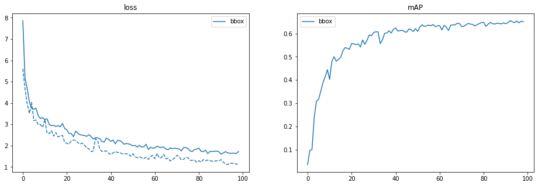

# Documented code.
### Process
The entire process is split into data processing, model definition and training bbox, training segmentation

The dataset is downloaded and we see that the folder structure is -> Annotations -> images -> masks We write a script to create the bounding box from the mask. For this we the library pycocotools. We also use assertion statements to check if shape of images and matching along with filename to avoid using auto image rotation using metadata opencv vs PIL issues. There are potentially 3 types of classes in the segmentation

    spallmask
    rebarmask
    crackmask

These are loaded seperately as different masks then merged. The bouding box is obtained for each of these classes.
### Method of generating coco json
Use the eva_custom_data.ipynb file to genetate the coco json. This file uses code from src/atom_seg.py. The output is as follows

```
  "annotations": [
    {
      "area": 14040,
      "bbox": [
        26.0,
        0.0,
        467.0,
        237.0
      ],
      "category_id": 1,
      "height": 322,
      "id": 3,
      "image_id": 3,
      "iscrowd": 0,
      "segmentation": [
        [
          492.0,
          195.99803921568628,
          477.0,
          195.99803921568628,
          468.0019607843137,
          190.0,
          469.0019607843137,
          181.0,
          462.0019607843137,
          176.0,
          466.0019607843137,
          154.0,
          458.0019607843137,
          147.0,
          448.0019607843137,
          128.0,
          447.0019607843137,
          115.0,
          434.0019607843137,
          81.0,
          419.0,
          66.99803921568628,
          412.0,
          62.998039215686276,
          404.0,
          64.99803921568628,
          400.0019607843137,
          60.0,
          398.0019607843137,
          37.0,
          387.0019607843137,
          17.0,
          388.0,
          0,
          489.9980392156863,
          0.0,
          485.9980392156863,
          55.0,
          489.9980392156863,
          113.0,
          484.9980392156863,
          158.0,
          492.9980392156863,
          178.0,
          492.0,
          195.99803921568628
        ],
```


## Data Split

The data is split using coco split repo https://github.com/akarazniewicz/cocosplit with 80% train and 20% for test.
Model

# Training the model
To train the model download a model and keep inside folder weights and use the train_obj.ipynb file. A pretrained detr model will be used and transfer learning with low lr will be utilized to train the model on custom dataset. For transfer learning two parameters are deleted in the checkpoint weights.

del checkpoint["model"]["class_embed.weight"]
del checkpoint["model"]["class_embed.bias"]
del checkpoint["model"]["query_embed.weight"]

The number of class is chaged and the checkpoint weights are loaded. The standard script is used of training.

# The training performance
The Logs are as follows
```
{"train_lr": 9.99999999999971e-06, "train_class_error": 60.78771079123557, "train_loss": 7.86420937806719, "train_loss_ce": 0.31310928636504826, "train_loss_bbox": 0.4990684626751779, "train_loss_giou": 0.4344807903921943, "train_loss_ce_0": 0.4276198490535065, "train_loss_bbox_0": 0.5633075164265708, "train_loss_giou_0": 0.4799045514126908, "train_loss_ce_1": 0.35414706209799685, "train_loss_bbox_1": 0.5320886977362864, "train_loss_giou_1": 0.45339985130895616, "train_loss_ce_2": 0.3320137487694735, "train_loss_bbox_2": 0.5121084442846244, "train_loss_giou_2": 0.43964119277228436, "train_loss_ce_3": 0.326923902631219, "train_loss_bbox_3": 0.505085962191379, "train_loss_giou_3": 0.43891581101956173, "train_loss_ce_4": 0.3191569667459257, "train_loss_bbox_4": 0.4982612817493356, "train_loss_giou_4": 0.4349759965412169, "train_loss_ce_unscaled": 0.31310928636504826, "train_class_error_unscaled": 60.78771079123557, "train_loss_bbox_unscaled": 0.09981369252148202, "train_loss_giou_unscaled": 0.21724039519609714, "train_cardinality_error_unscaled": 2.627165627165627, "train_loss_ce_0_unscaled": 0.4276198490535065, "train_loss_bbox_0_unscaled": 0.11266150323471424, "train_loss_giou_0_unscaled": 0.2399522757063454, "train_cardinality_error_0_unscaled": 4.285516285516286, "train_loss_ce_1_unscaled": 0.35414706209799685, "train_loss_bbox_1_unscaled": 0.10641773973739424, "train_loss_giou_1_unscaled": 0.22669992565447808, "train_cardinality_error_1_unscaled": 3.3575883575883574, "train_loss_ce_2_unscaled": 0.3320137487694735, "train_loss_bbox_2_unscaled": 0.1024216889388916, "train_loss_giou_2_unscaled": 0.21982059638614218, "train_cardinality_error_2_unscaled": 2.9965349965349963, "train_loss_ce_3_unscaled": 0.326923902631219, "train_loss_bbox_3_unscaled": 0.10101719221005982, "train_loss_giou_3_unscaled": 0.21945790550978087, "train_cardinality_error_3_unscaled": 2.8745668745668747, "train_loss_ce_4_unscaled": 0.3191569667459257, "train_loss_bbox_4_unscaled": 0.09965225635386864, "train_loss_giou_4_unscaled": 0.21748799827060844, "train_cardinality_error_4_unscaled": 2.7491337491337493, "test_class_error": 60.99561099913578, "test_loss": 5.60434558479553, "test_loss_ce": 0.24935076146161317, "test_loss_bbox": 0.3192205534730305, "test_loss_giou": 0.3334385203720378, "test_loss_ce_0": 0.2751843539206666, "test_loss_bbox_0": 0.37496048673904775, "test_loss_giou_0": 0.3791288008974066, "test_loss_ce_1": 0.25057840404344034, "test_loss_bbox_1": 0.349142326515785, "test_loss_giou_1": 0.35678849795256234, "test_loss_ce_2": 0.24749741033339204, "test_loss_bbox_2": 0.32593037791896096, "test_loss_giou_2": 0.33620267804926335, "test_loss_ce_3": 0.24685356165756803, "test_loss_bbox_3": 0.32176488988767543, "test_loss_giou_3": 0.3410519102506975, "test_loss_ce_4": 0.24713373736479033, "test_loss_bbox_4": 0.31584507570300596, "test_loss_giou_4": 0.33427325917545986, "test_loss_ce_unscaled": 0.24935076146161317, "test_class_error_unscaled": 60.99561099913578, "test_loss_bbox_unscaled": 0.0638441108489875, "test_loss_giou_unscaled": 0.1667192601860189, "test_cardinality_error_unscaled": 1.029106029106029, "test_loss_ce_0_unscaled": 0.2751843539206666, "test_loss_bbox_0_unscaled": 0.07499209721717914, "test_loss_giou_0_unscaled": 0.1895644004487033, "test_cardinality_error_0_unscaled": 1.029106029106029, "test_loss_ce_1_unscaled": 0.25057840404344034, "test_loss_bbox_1_unscaled": 0.0698284654776751, "test_loss_giou_1_unscaled": 0.17839424897628117, "test_cardinality_error_1_unscaled": 1.029106029106029, "test_loss_ce_2_unscaled": 0.24749741033339204, "test_loss_bbox_2_unscaled": 0.06518607572294198, "test_loss_giou_2_unscaled": 0.16810133902463167, "test_cardinality_error_2_unscaled": 1.029106029106029, "test_loss_ce_3_unscaled": 0.24685356165756803, "test_loss_bbox_3_unscaled": 0.06435297804543193, "test_loss_giou_3_unscaled": 0.17052595512534874, "test_cardinality_error_3_unscaled": 1.029106029106029, "test_loss_ce_4_unscaled": 0.24713373736479033, "test_loss_bbox_4_unscaled": 0.06316901503191462, "test_loss_giou_4_unscaled": 0.16713662958772993, "test_cardinality_error_4_unscaled": 1.029106029106029, "test_coco_eval_bbox": [0.026214984820241857, 0.035367523400042816, 0.0273889176264132, 0.001050966975053291, 0.011928859869569692, 0.030009182642516855, 0.15778627406020984, 0.24546417608278723, 0.3503100787594716, 0.027976190476190477, 0.16011838180462343, 0.42789765822576936], "epoch": 0, "n_parameters": 41279752}
{"train_lr": 9.99999999999971e-06, "train_class_error": 61.20351120703599, "train_loss": 5.180051944163717, "train_loss_ce": 0.23542226561230922, "train_loss_bbox": 0.29320428755756517, "train_loss_giou": 0.2967035436250233, "train_loss_ce_0": 0.2648145992848415, "train_loss_bbox_0": 0.34896118598922377, "train_loss_giou_0": 0.3525807860404852, "train_loss_ce_1": 0.24344360239142895, "train_loss_bbox_1": 0.3164619125596203, "train_loss_giou_1": 0.31817917694090475, "train_loss_ce_2": 0.240074241366715, "train_loss_bbox_2": 0.3042635233738484, "train_loss_giou_2": 0.3091908834993385, "train_loss_ce_3": 0.23632559202009926, "train_loss_bbox_3": 0.29634937847179005, "train_loss_giou_3": 0.29993849251308297, "train_loss_ce_4": 0.23487122279830014, "train_loss_bbox_4": 0.29181235340021794, "train_loss_giou_4": 0.29745490573300143, "train_loss_ce_unscaled": 0.23542226561230922, "train_class_error_unscaled": 61.20351120703599, "train_loss_bbox_unscaled": 0.058640857622781234, "train_loss_giou_unscaled": 0.14835177181251166, "train_cardinality_error_unscaled": 1.0214830214830215, "train_loss_ce_0_unscaled": 0.2648145992848415, "train_loss_bbox_0_unscaled": 0.06979223725476966, "train_loss_giou_0_unscaled": 0.1762903930202426, "train_cardinality_error_0_unscaled": 1.02009702009702, "train_loss_ce_1_unscaled": 0.24344360239142895, "train_loss_bbox_1_unscaled": 0.06329238255994235, "train_loss_giou_1_unscaled": 0.15908958847045238, "train_cardinality_error_1_unscaled": 1.0214830214830215, "train_loss_ce_2_unscaled": 0.240074241366715, "train_loss_bbox_2_unscaled": 0.06085270487562039, "train_loss_giou_2_unscaled": 0.15459544174966924, "train_cardinality_error_2_unscaled": 1.0214830214830215, "train_loss_ce_3_unscaled": 0.23632559202009926, "train_loss_bbox_3_unscaled": 0.05926987559199643, "train_loss_giou_3_unscaled": 0.14996924625654148, "train_cardinality_error_3_unscaled": 1.0214830214830215, "train_loss_ce_4_unscaled": 0.23487122279830014, "train_loss_bbox_4_unscaled": 0.05836247066545738, "train_loss_giou_4_unscaled": 0.14872745286650071, "train_cardinality_error_4_unscaled": 1.0214830214830215, "test_class_error": 60.718410721935506, "test_loss": 4.673705790524919, "test_loss_ce": 0.21954129229487537, "test_loss_bbox": 0.25420031933938764, "test_loss_giou": 0.270837553325661, "test_loss_ce_0": 0.24475793523697165, "test_loss_bbox_0": 0.32327313151156334, "test_loss_giou_0": 0.32003223898091915, "test_loss_ce_1": 0.23246189115126245, "test_loss_bbox_1": 0.2700370862493995, "test_loss_giou_1": 0.28595622153391215, "test_loss_ce_2": 0.23207710316431807, "test_loss_bbox_2": 0.2557548368304493, "test_loss_giou_2": 0.2758817970133125, "test_loss_ce_3": 0.22290247581622932, "test_loss_bbox_3": 0.2581298147958761, "test_loss_giou_3": 0.270865168822613, "test_loss_ce_4": 0.2208073849299934, "test_loss_bbox_4": 0.24932356230780348, "test_loss_giou_4": 0.26686597099670994, "test_loss_ce_unscaled": 0.21954129229487537, "test_class_error_unscaled": 60.718410721935506, "test_loss_bbox_unscaled": 0.05084006380862915, "test_loss_giou_unscaled": 0.1354187766628305, "test_cardinality_error_unscaled": 1.0235620235620235, "test_loss_ce_0_unscaled": 0.24475793523697165, "test_loss_bbox_0_unscaled": 0.06465462626203926, "test_loss_giou_0_unscaled": 0.16001611949045957, "test_cardinality_error_0_unscaled": 1.029106029106029, "test_loss_ce_1_unscaled": 0.23246189115126245, "test_loss_bbox_1_unscaled": 0.05400741719289044, "test_loss_giou_1_unscaled": 0.14297811076695607, "test_cardinality_error_1_unscaled": 1.029106029106029, "test_loss_ce_2_unscaled": 0.23207710316431807, "test_loss_bbox_2_unscaled": 0.0511509672566288, "test_loss_giou_2_unscaled": 0.13794089850665625, "test_cardinality_error_2_unscaled": 1.0277200277200278, "test_loss_ce_3_unscaled": 0.22290247581622932, "test_loss_bbox_3_unscaled": 0.051625962980344574, "test_loss_giou_3_unscaled": 0.1354325844113065, "test_cardinality_error_3_unscaled": 1.0138600138600138, "test_loss_ce_4_unscaled": 0.2208073849299934, "test_loss_bbox_4_unscaled": 0.04986471245846274, "test_loss_giou_4_unscaled": 0.13343298549835497, "test_cardinality_error_4_unscaled": 1.0207900207900207, "test_coco_eval_bbox": [0.06879265760623468, 0.09707228108005529, 0.07002357703544679, 0.007077169627610455, 0.026703078867812757, 0.0837482881511364, 0.2499670280252898, 0.35678733876171126, 0.45375676103228063, 0.0994047619047619, 0.22871923937360178, 0.5292215981870135], "epoch": 1, "n_parameters": 41279752}
{"train_lr": 9.99999999999971e-06, "train_class_error": 61.03026103378581, "train_loss": 4.668804407375332, "train_loss_ce": 0.2157695563677866, "train_loss_bbox": 0.25397040238520047, "train_loss_giou": 0.2736972996491322, "train_loss_ce_0": 0.2335766771645624, "train_loss_bbox_0": 0.32062169496674797, "train_loss_giou_0": 0.3214087915850115, "train_loss_ce_1": 0.22772784760558742, "train_loss_bbox_1": 0.2752039657876009, "train_loss_giou_1": 0.2859601402398372, "train_loss_ce_2": 0.2247900567582227, "train_loss_bbox_2": 0.26471877108539094, "train_loss_giou_2": 0.27960292770890666, "train_loss_ce_3": 0.21734095858158292, "train_loss_bbox_3": 0.25591221283178983, "train_loss_giou_3": 0.277186939143011, "train_loss_ce_4": 0.21585628981827884, "train_loss_bbox_4": 0.25261614778758706, "train_loss_giou_4": 0.2728437322836656, "train_loss_ce_unscaled": 0.2157695563677866, "train_class_error_unscaled": 61.03026103378581, "train_loss_bbox_unscaled": 0.05079408039223359, "train_loss_giou_unscaled": 0.1368486498245661, "train_cardinality_error_unscaled": 1.0152460152460152, "train_loss_ce_0_unscaled": 0.2335766771645624, "train_loss_bbox_0_unscaled": 0.06412433883483759, "train_loss_giou_0_unscaled": 0.16070439579250576, "train_cardinality_error_0_unscaled": 1.015939015939016, "train_loss_ce_1_unscaled": 0.22772784760558742, "train_loss_bbox_1_unscaled": 0.05504079312099013, "train_loss_giou_1_unscaled": 0.1429800701199186, "train_cardinality_error_1_unscaled": 1.0187110187110187, "train_loss_ce_2_unscaled": 0.2247900567582227, "train_loss_bbox_2_unscaled": 0.05294375421514196, "train_loss_giou_2_unscaled": 0.13980146385445333, "train_cardinality_error_2_unscaled": 1.0145530145530146, "train_loss_ce_3_unscaled": 0.21734095858158292, "train_loss_bbox_3_unscaled": 0.051182442486069304, "train_loss_giou_3_unscaled": 0.1385934695715055, "train_cardinality_error_3_unscaled": 1.0097020097020097, "train_loss_ce_4_unscaled": 0.21585628981827884, "train_loss_bbox_4_unscaled": 0.050523229561648016, "train_loss_giou_4_unscaled": 0.1364218661418328, "train_cardinality_error_4_unscaled": 1.0173250173250172, "test_class_error": 60.92631092983571, "test_loss": 3.9466433232328746, "test_loss_ce": 0.20735743980433943, "test_loss_bbox": 0.18950163040436643, "test_loss_giou": 0.23312234316777622, "test_loss_ce_0": 0.22628202965600533, "test_loss_bbox_0": 0.23435854321514785, "test_loss_giou_0": 0.26133821036199356, "test_loss_ce_1": 0.22526763364923078, "test_loss_bbox_1": 0.20331177614985532, "test_loss_giou_1": 0.2315694396890705, "test_loss_ce_2": 0.22051140315713244, "test_loss_bbox_2": 0.198940451363423, "test_loss_giou_2": 0.2342491171381495, "test_loss_ce_3": 0.20787228880823175, "test_loss_bbox_3": 0.19866326625561515, "test_loss_giou_3": 0.24036790125913612, "test_loss_ce_4": 0.20717021955205586, "test_loss_bbox_4": 0.1916174176042578, "test_loss_giou_4": 0.23514220469624156, "test_loss_ce_unscaled": 0.20735743980433943, "test_class_error_unscaled": 60.92631092983571, "test_loss_bbox_unscaled": 0.03790032605131364, "test_loss_giou_unscaled": 0.11656117158388811, "test_cardinality_error_unscaled": 1.0277200277200278, "test_loss_ce_0_unscaled": 0.22628202965600533, "test_loss_bbox_0_unscaled": 0.04687170859339775, "test_loss_giou_0_unscaled": 0.13066910518099678, "test_cardinality_error_0_unscaled": 1.0284130284130284, "test_loss_ce_1_unscaled": 0.22526763364923078, "test_loss_bbox_1_unscaled": 0.04066235522016088, "test_loss_giou_1_unscaled": 0.11578471984453526, "test_cardinality_error_1_unscaled": 1.029106029106029, "test_loss_ce_2_unscaled": 0.22051140315713244, "test_loss_bbox_2_unscaled": 0.03978809030927919, "test_loss_giou_2_unscaled": 0.11712455856907475, "test_cardinality_error_2_unscaled": 1.029106029106029, "test_loss_ce_3_unscaled": 0.20787228880823175, "test_loss_bbox_3_unscaled": 0.039732653404988105, "test_loss_giou_3_unscaled": 0.12018395062956806, "test_cardinality_error_3_unscaled": 1.024948024948025, "test_loss_ce_4_unscaled": 0.20717021955205586, "test_loss_bbox_4_unscaled": 0.038323483495035275, "test_loss_giou_4_unscaled": 0.11757110234812078, "test_cardinality_error_4_unscaled": 1.027027027027027, "test_coco_eval_bbox": [0.07734320659836758, 0.10106819067130852, 0.08192169411808453, 0.004389527709576967, 0.030154174898715455, 0.11119505594011891, 0.33044424181344084, 0.411418612546414, 0.48596709201402766, 0.11011904761904763, 0.28235458612975395, 0.5583338259927086], "epoch": 2, "n_parameters": 41279752}
{"train_lr": 9.99999999999971e-06, "train_class_error": 59.29775930128408, "train_loss": 4.047892613300301, "train_loss_ce": 0.1941027982736959, "train_loss_bbox": 0.22496419691313535, "train_loss_giou": 0.2336209156574347, "train_loss_ce_0": 0.21272577294125916, "train_loss_bbox_0": 0.25068735909194517, "train_loss_giou_0": 0.26294149314869797, "train_loss_ce_1": 0.20788613871341458, "train_loss_bbox_1": 0.2372881464262597, "train_loss_giou_1": 0.24218692216952475, "train_loss_ce_2": 0.2042091813599026, "train_loss_bbox_2": 0.22787374777723252, "train_loss_giou_2": 0.23953275641714294, "train_loss_ce_3": 0.19685188676562995, "train_loss_bbox_3": 0.22553173076988753, "train_loss_giou_3": 0.236733067969192, "train_loss_ce_4": 0.19460946054304987, "train_loss_bbox_4": 0.22373258369462984, "train_loss_giou_4": 0.23241445585331483, "train_loss_ce_unscaled": 0.1941027982736959, "train_class_error_unscaled": 59.29775930128408, "train_loss_bbox_unscaled": 0.04499283949544425, "train_loss_giou_unscaled": 0.11681045782871735, "train_cardinality_error_unscaled": 0.9826749826749827, "train_loss_ce_0_unscaled": 0.21272577294125916, "train_loss_bbox_0_unscaled": 0.05013747173874579, "train_loss_giou_0_unscaled": 0.13147074657434898, "train_cardinality_error_0_unscaled": 1.0048510048510049, "train_loss_ce_1_unscaled": 0.20788613871341458, "train_loss_bbox_1_unscaled": 0.04745762919386228, "train_loss_giou_1_unscaled": 0.12109346108476238, "train_cardinality_error_1_unscaled": 1.0062370062370063, "train_loss_ce_2_unscaled": 0.2042091813599026, "train_loss_bbox_2_unscaled": 0.04557474953660061, "train_loss_giou_2_unscaled": 0.11976637820857147, "train_cardinality_error_2_unscaled": 1.004158004158004, "train_loss_ce_3_unscaled": 0.19685188676562995, "train_loss_bbox_3_unscaled": 0.045106346026445046, "train_loss_giou_3_unscaled": 0.118366533984596, "train_cardinality_error_3_unscaled": 0.9695079695079695, "train_loss_ce_4_unscaled": 0.19460946054304987, "train_loss_bbox_4_unscaled": 0.04474651671323876, "train_loss_giou_4_unscaled": 0.11620722792665741, "train_cardinality_error_4_unscaled": 0.9799029799029799, "test_class_error": 51.15500115852594, "test_loss": 3.5145892316420007, "test_loss_ce": 0.16384528987500133, "test_loss_bbox": 0.17952618372064452, "test_loss_giou": 0.2143518641147032, "test_loss_ce_0": 0.19358640192147558, "test_loss_bbox_0": 0.20376114607017362, "test_loss_giou_0": 0.2434997384075646, "test_loss_ce_1": 0.18615141518385622, "test_loss_bbox_1": 0.18266276895550704, "test_loss_giou_1": 0.22528480847346147, "test_loss_ce_2": 0.1829306855746135, "test_loss_bbox_2": 0.17741478332115063, "test_loss_giou_2": 0.2200327192175661, "test_loss_ce_3": 0.1683752150006969, "test_loss_bbox_3": 0.18516747991290466, "test_loss_giou_3": 0.22399286148206113, "test_loss_ce_4": 0.16566822629703348, "test_loss_bbox_4": 0.17985925444337905, "test_loss_giou_4": 0.21847838120004492, "test_loss_ce_unscaled": 0.16384528987500133, "test_class_error_unscaled": 51.15500115852594, "test_loss_bbox_unscaled": 0.035905236688107564, "test_loss_giou_unscaled": 0.1071759320573516, "test_cardinality_error_unscaled": 0.875952875952876, "test_loss_ce_0_unscaled": 0.19358640192147558, "test_loss_bbox_0_unscaled": 0.040752229211711254, "test_loss_giou_0_unscaled": 0.1217498692037823, "test_cardinality_error_0_unscaled": 1.0055440055440055, "test_loss_ce_1_unscaled": 0.18615141518385622, "test_loss_bbox_1_unscaled": 0.03653255379445753, "test_loss_giou_1_unscaled": 0.11264240423673073, "test_cardinality_error_1_unscaled": 0.9882189882189882, "test_loss_ce_2_unscaled": 0.1829306855746135, "test_loss_bbox_2_unscaled": 0.03548295659994757, "test_loss_giou_2_unscaled": 0.11001635960878305, "test_cardinality_error_2_unscaled": 0.9847539847539848, "test_loss_ce_3_unscaled": 0.1683752150006969, "test_loss_bbox_3_unscaled": 0.03703349596760749, "test_loss_giou_3_unscaled": 0.11199643074103056, "test_cardinality_error_3_unscaled": 0.8690228690228691, "test_loss_ce_4_unscaled": 0.16566822629703348, "test_loss_bbox_4_unscaled": 0.035971850962574936, "test_loss_giou_4_unscaled": 0.10923919060002246, "test_cardinality_error_4_unscaled": 0.8828828828828829, "test_coco_eval_bbox": [0.17712014471274104, 0.23789063487720907, 0.18658869949174273, 0.010407522130217383, 0.05374087250533068, 0.23145827801273522, 0.3298169744347217, 0.42869574954807954, 0.4834455802445436, 0.1511904761904762, 0.25850111856823266, 0.5560682497454594], "epoch": 3, "n_parameters": 41279752}
{"train_lr": 9.99999999999971e-06, "train_class_error": 44.84869485221963, "train_loss": 3.756786641622206, "train_loss_ce": 0.16022513821688483, "train_loss_bbox": 0.20746940453372228, "train_loss_giou": 0.22768319739456072, "train_loss_ce_0": 0.18750844565052371, "train_loss_bbox_0": 0.24318942674051658, "train_loss_giou_0": 0.26190615026635256, "train_loss_ce_1": 0.18104120470762217, "train_loss_bbox_1": 0.21841909809196813, "train_loss_giou_1": 0.24154295722230473, "train_loss_ce_2": 0.1759035200495673, "train_loss_bbox_2": 0.20860168278831742, "train_loss_giou_2": 0.23019146489667464, "train_loss_ce_3": 0.16532191017911108, "train_loss_bbox_3": 0.2130766475943646, "train_loss_giou_3": 0.23326722351280418, "train_loss_ce_4": 0.16208157717616234, "train_loss_bbox_4": 0.21045357008010912, "train_loss_giou_4": 0.22890402993144712, "train_loss_ce_unscaled": 0.16022513821688483, "train_class_error_unscaled": 44.84869485221963, "train_loss_bbox_unscaled": 0.04149388096909079, "train_loss_giou_unscaled": 0.11384159869728036, "train_cardinality_error_unscaled": 0.7948717948717948, "train_loss_ce_0_unscaled": 0.18750844565052371, "train_loss_bbox_0_unscaled": 0.048637885309249805, "train_loss_giou_0_unscaled": 0.13095307513317628, "train_cardinality_error_0_unscaled": 0.9293139293139293, "train_loss_ce_1_unscaled": 0.18104120470762217, "train_loss_bbox_1_unscaled": 0.04368381965221296, "train_loss_giou_1_unscaled": 0.12077147861115237, "train_cardinality_error_1_unscaled": 0.875952875952876, "train_loss_ce_2_unscaled": 0.1759035200495673, "train_loss_bbox_2_unscaled": 0.041720336533525255, "train_loss_giou_2_unscaled": 0.11509573244833732, "train_cardinality_error_2_unscaled": 0.8697158697158697, "train_loss_ce_3_unscaled": 0.16532191017911108, "train_loss_bbox_3_unscaled": 0.04261532958470445, "train_loss_giou_3_unscaled": 0.11663361175640209, "train_cardinality_error_3_unscaled": 0.7927927927927928, "train_loss_ce_4_unscaled": 0.16208157717616234, "train_loss_bbox_4_unscaled": 0.042090713930699, "train_loss_giou_4_unscaled": 0.11445201496572356, "train_cardinality_error_4_unscaled": 0.7893277893277894, "test_class_error": 43.53199353551832, "test_loss": 4.029218350091145, "test_loss_ce": 0.1561749595028141, "test_loss_bbox": 0.24227055353748245, "test_loss_giou": 0.24157308920835838, "test_loss_ce_0": 0.18318620231196192, "test_loss_bbox_0": 0.2795623880310845, "test_loss_giou_0": 0.2822546410791922, "test_loss_ce_1": 0.1800296103335886, "test_loss_bbox_1": 0.24895466477122888, "test_loss_giou_1": 0.255213469617993, "test_loss_ce_2": 0.17421558709690582, "test_loss_bbox_2": 0.24877932000510286, "test_loss_giou_2": 0.2545545738105219, "test_loss_ce_3": 0.16265907758596462, "test_loss_bbox_3": 0.2377005315625205, "test_loss_giou_3": 0.24275884488681415, "test_loss_ce_4": 0.16101093446922682, "test_loss_bbox_4": 0.2391201063321951, "test_loss_giou_4": 0.23919979756025497, "test_loss_ce_unscaled": 0.1561749595028141, "test_class_error_unscaled": 43.53199353551832, "test_loss_bbox_unscaled": 0.04845411067651694, "test_loss_giou_unscaled": 0.12078654460417919, "test_cardinality_error_unscaled": 0.7546777546777547, "test_loss_ce_0_unscaled": 0.18318620231196192, "test_loss_bbox_0_unscaled": 0.055912477656816825, "test_loss_giou_0_unscaled": 0.1411273205395961, "test_cardinality_error_0_unscaled": 0.957033957033957, "test_loss_ce_1_unscaled": 0.1800296103335886, "test_loss_bbox_1_unscaled": 0.049790932916295834, "test_loss_giou_1_unscaled": 0.1276067348089965, "test_cardinality_error_1_unscaled": 0.9216909216909217, "test_loss_ce_2_unscaled": 0.17421558709690582, "test_loss_bbox_2_unscaled": 0.04975586399346931, "test_loss_giou_2_unscaled": 0.12727728690526094, "test_cardinality_error_2_unscaled": 0.8884268884268884, "test_loss_ce_3_unscaled": 0.16265907758596462, "test_loss_bbox_3_unscaled": 0.047540106249447815, "test_loss_giou_3_unscaled": 0.12137942244340708, "test_cardinality_error_3_unscaled": 0.7664587664587664, "test_loss_ce_4_unscaled": 0.16101093446922682, "test_loss_bbox_4_unscaled": 0.04782402133943457, "test_loss_giou_4_unscaled": 0.11959989878012749, "test_cardinality_error_4_unscaled": 0.7602217602217602, "test_coco_eval_bbox": [0.23452540062975324, 0.30850004994209573, 0.2524068737144373, 0.041554418423348, 0.06934906450901422, 0.2920257391788576, 0.3317213503756672, 0.439956523207471, 0.4833197357265121, 0.13452380952380955, 0.24925428784489184, 0.5615357834926266], "epoch": 4, "n_parameters": 41279752}
{"train_lr": 9.99999999999971e-06, "train_class_error": 38.888888892413675, "train_loss": 3.7129361955732962, "train_loss_ce": 0.150874156486435, "train_loss_bbox": 0.21318582920919088, "train_loss_giou": 0.22506450421266563, "train_loss_ce_0": 0.1767329188652352, "train_loss_bbox_0": 0.25143632060271826, "train_loss_giou_0": 0.25771208794184713, "train_loss_ce_1": 0.16847198524196746, "train_loss_bbox_1": 0.22581070964628017, "train_loss_giou_1": 0.23673810342575888, "train_loss_ce_2": 0.16286995324286183, "train_loss_bbox_2": 0.21775386055604873, "train_loss_giou_2": 0.23093109928479397, "train_loss_ce_3": 0.1544368514503602, "train_loss_bbox_3": 0.21887954698820042, "train_loss_giou_3": 0.22961369332388218, "train_loss_ce_4": 0.15145999660752732, "train_loss_bbox_4": 0.2154419632178066, "train_loss_giou_4": 0.22552262997346378, "train_loss_ce_unscaled": 0.150874156486435, "train_class_error_unscaled": 38.888888892413675, "train_loss_bbox_unscaled": 0.04263716578878571, "train_loss_giou_unscaled": 0.11253225210633282, "train_cardinality_error_unscaled": 0.7525987525987526, "train_loss_ce_0_unscaled": 0.1767329188652352, "train_loss_bbox_0_unscaled": 0.050287264204317506, "train_loss_giou_0_unscaled": 0.12885604397092357, "train_cardinality_error_0_unscaled": 0.8995148995148995, "train_loss_ce_1_unscaled": 0.16847198524196746, "train_loss_bbox_1_unscaled": 0.04516214178713737, "train_loss_giou_1_unscaled": 0.11836905171287944, "train_cardinality_error_1_unscaled": 0.817047817047817, "train_loss_ce_2_unscaled": 0.16286995324286183, "train_loss_bbox_2_unscaled": 0.043550772261976865, "train_loss_giou_2_unscaled": 0.11546554964239698, "train_cardinality_error_2_unscaled": 0.7865557865557865, "train_loss_ce_3_unscaled": 0.1544368514503602, "train_loss_bbox_3_unscaled": 0.043775909457017544, "train_loss_giou_3_unscaled": 0.11480684666194109, "train_cardinality_error_3_unscaled": 0.7581427581427581, "train_loss_ce_4_unscaled": 0.15145999660752732, "train_loss_bbox_4_unscaled": 0.043088392593994045, "train_loss_giou_4_unscaled": 0.11276131498673189, "train_cardinality_error_4_unscaled": 0.7283437283437283, "test_class_error": 31.750981754506533, "test_loss": 3.175088277710079, "test_loss_ce": 0.12572657964750608, "test_loss_bbox": 0.17035634445100092, "test_loss_giou": 0.20356951811953047, "test_loss_ce_0": 0.15902012962849885, "test_loss_bbox_0": 0.2002447203256071, "test_loss_giou_0": 0.23959762907160378, "test_loss_ce_1": 0.14843075750918436, "test_loss_bbox_1": 0.1813323160250073, "test_loss_giou_1": 0.22033098986474325, "test_loss_ce_2": 0.1420540663975853, "test_loss_bbox_2": 0.17107452608887636, "test_loss_giou_2": 0.20907287893407642, "test_loss_ce_3": 0.1310694229675164, "test_loss_bbox_3": 0.16830780896295588, "test_loss_giou_3": 0.20557911166364917, "test_loss_ce_4": 0.12812371885545012, "test_loss_bbox_4": 0.16682395561677626, "test_loss_giou_4": 0.2043738050008101, "test_loss_ce_unscaled": 0.12572657964750608, "test_class_error_unscaled": 31.750981754506533, "test_loss_bbox_unscaled": 0.03407126886005967, "test_loss_giou_unscaled": 0.10178475905976524, "test_cardinality_error_unscaled": 0.7124047124047124, "test_loss_ce_0_unscaled": 0.15902012962849885, "test_loss_bbox_0_unscaled": 0.04004894403872427, "test_loss_giou_0_unscaled": 0.11979881453580189, "test_cardinality_error_0_unscaled": 0.7726957726957727, "test_loss_ce_1_unscaled": 0.14843075750918436, "test_loss_bbox_1_unscaled": 0.03626646325269705, "test_loss_giou_1_unscaled": 0.11016549493237163, "test_cardinality_error_1_unscaled": 0.6451836451836452, "test_loss_ce_2_unscaled": 0.1420540663975853, "test_loss_bbox_2_unscaled": 0.03421490524307523, "test_loss_giou_2_unscaled": 0.10453643946703821, "test_cardinality_error_2_unscaled": 0.6403326403326404, "test_loss_ce_3_unscaled": 0.1310694229675164, "test_loss_bbox_3_unscaled": 0.0336615618080164, "test_loss_giou_3_unscaled": 0.10278955583182459, "test_cardinality_error_3_unscaled": 0.6999306999306999, "test_loss_ce_4_unscaled": 0.12812371885545012, "test_loss_bbox_4_unscaled": 0.033364791143298336, "test_loss_giou_4_unscaled": 0.10218690250040505, "test_cardinality_error_4_unscaled": 0.6735966735966736, "test_coco_eval_bbox": [0.22966044542955794, 0.317246258828019, 0.24721415863345794, 0.038917682019823895, 0.11891773848348468, 0.2811329084433399, 0.3276491781890832, 0.4515379515427507, 0.4966830726680993, 0.1386904761904762, 0.30184563758389255, 0.5670693335960851], "epoch": 5, "n_parameters": 41279752}
{"train_lr": 9.99999999999971e-06, "train_class_error": 34.40748440748441, "train_loss": 3.7577360841534047, "train_loss_ce": 0.13940763353953095, "train_loss_bbox": 0.22674325872303006, "train_loss_giou": 0.23568806901047482, "train_loss_ce_0": 0.16577545195010865, "train_loss_bbox_0": 0.2541094568796193, "train_loss_giou_0": 0.2659583801373953, "train_loss_ce_1": 0.15677224685940105, "train_loss_bbox_1": 0.2373520866364282, "train_loss_giou_1": 0.24792629108607397, "train_loss_ce_2": 0.15040887073623868, "train_loss_bbox_2": 0.23093864649833695, "train_loss_giou_2": 0.23923073005775405, "train_loss_ce_3": 0.14046085929603438, "train_loss_bbox_3": 0.22913939005754017, "train_loss_giou_3": 0.23743172610541308, "train_loss_ce_4": 0.1387871450379753, "train_loss_bbox_4": 0.22756415262575663, "train_loss_giou_4": 0.23404169421351295, "train_loss_ce_unscaled": 0.13940763353953095, "train_class_error_unscaled": 34.40748440748441, "train_loss_bbox_unscaled": 0.045348651650053855, "train_loss_giou_unscaled": 0.11784403450523741, "train_cardinality_error_unscaled": 0.7193347193347194, "train_loss_ce_0_unscaled": 0.16577545195010865, "train_loss_bbox_0_unscaled": 0.05082189148435226, "train_loss_giou_0_unscaled": 0.13297919006869766, "train_cardinality_error_0_unscaled": 0.8641718641718642, "train_loss_ce_1_unscaled": 0.15677224685940105, "train_loss_bbox_1_unscaled": 0.04747041728352703, "train_loss_giou_1_unscaled": 0.12396314554303699, "train_cardinality_error_1_unscaled": 0.7595287595287595, "train_loss_ce_2_unscaled": 0.15040887073623868, "train_loss_bbox_2_unscaled": 0.04618772913618575, "train_loss_giou_2_unscaled": 0.11961536502887703, "train_cardinality_error_2_unscaled": 0.729036729036729, "train_loss_ce_3_unscaled": 0.14046085929603438, "train_loss_bbox_3_unscaled": 0.04582787797755961, "train_loss_giou_3_unscaled": 0.11871586305270654, "train_cardinality_error_3_unscaled": 0.7137907137907138, "train_loss_ce_4_unscaled": 0.1387871450379753, "train_loss_bbox_4_unscaled": 0.045512830334498044, "train_loss_giou_4_unscaled": 0.11702084710675648, "train_cardinality_error_4_unscaled": 0.6964656964656964, "test_class_error": 26.172326175850955, "test_loss": 3.204098772244658, "test_loss_ce": 0.1166552465408395, "test_loss_bbox": 0.18127822925543835, "test_loss_giou": 0.21362156179821995, "test_loss_ce_0": 0.14712554026441552, "test_loss_bbox_0": 0.21057301043188786, "test_loss_giou_0": 0.23747701340884858, "test_loss_ce_1": 0.13734999148153176, "test_loss_bbox_1": 0.19043150170088557, "test_loss_giou_1": 0.21690088235828006, "test_loss_ce_2": 0.12868619747721277, "test_loss_bbox_2": 0.18337903864815966, "test_loss_giou_2": 0.21072613304882354, "test_loss_ce_3": 0.11840721396183981, "test_loss_bbox_3": 0.18513142051367568, "test_loss_giou_3": 0.21253062591565952, "test_loss_ce_4": 0.11586705397832907, "test_loss_bbox_4": 0.1835849018830726, "test_loss_giou_4": 0.21437321449433114, "test_loss_ce_unscaled": 0.1166552465408395, "test_class_error_unscaled": 26.172326175850955, "test_loss_bbox_unscaled": 0.0362556458883922, "test_loss_giou_unscaled": 0.10681078089910997, "test_cardinality_error_unscaled": 0.6756756756756757, "test_loss_ce_0_unscaled": 0.14712554026441552, "test_loss_bbox_0_unscaled": 0.042114602156597875, "test_loss_giou_0_unscaled": 0.11873850670442429, "test_cardinality_error_0_unscaled": 0.8884268884268884, "test_loss_ce_1_unscaled": 0.13734999148153176, "test_loss_bbox_1_unscaled": 0.03808630043247034, "test_loss_giou_1_unscaled": 0.10845044117914003, "test_cardinality_error_1_unscaled": 0.6909216909216909, "test_loss_ce_2_unscaled": 0.12868619747721277, "test_loss_bbox_2_unscaled": 0.036675807758546175, "test_loss_giou_2_unscaled": 0.10536306652441177, "test_cardinality_error_2_unscaled": 0.6638946638946639, "test_loss_ce_3_unscaled": 0.11840721396183981, "test_loss_bbox_3_unscaled": 0.03702628404568114, "test_loss_giou_3_unscaled": 0.10626531295782976, "test_cardinality_error_3_unscaled": 0.659043659043659, "test_loss_ce_4_unscaled": 0.11586705397832907, "test_loss_bbox_4_unscaled": 0.036716980371064016, "test_loss_giou_4_unscaled": 0.10718660724716557, "test_cardinality_error_4_unscaled": 0.6451836451836452, "test_coco_eval_bbox": [0.25609666805854675, 0.35179232122974735, 0.27446882658666283, 0.034293320804248635, 0.11597597101301528, 0.30821493885903367, 0.35433763657596257, 0.45568904317284603, 0.49755331950465603, 0.12380952380952383, 0.29297632363907533, 0.5686103721220482], "epoch": 6, "n_parameters": 41279752}
{"train_lr": 9.99999999999971e-06, "train_class_error": 32.27073227425706, "train_loss": 3.4072411837287335, "train_loss_ce": 0.133235737272594, "train_loss_bbox": 0.19368183797797187, "train_loss_giou": 0.213580407868304, "train_loss_ce_0": 0.16034982704021952, "train_loss_bbox_0": 0.2395912501096147, "train_loss_giou_0": 0.24975214451448172, "train_loss_ce_1": 0.1515178794124937, "train_loss_bbox_1": 0.21019316258648577, "train_loss_giou_1": 0.22278898785036633, "train_loss_ce_2": 0.1427783126815265, "train_loss_bbox_2": 0.19540081879902407, "train_loss_giou_2": 0.21472886995730595, "train_loss_ce_3": 0.13426416766079421, "train_loss_bbox_3": 0.19450122959219945, "train_loss_giou_3": 0.21486170937927415, "train_loss_ce_4": 0.13425924989681, "train_loss_bbox_4": 0.1886529373501996, "train_loss_giou_4": 0.21310264475215085, "train_loss_ce_unscaled": 0.133235737272594, "train_class_error_unscaled": 32.27073227425706, "train_loss_bbox_unscaled": 0.03873636749878329, "train_loss_giou_unscaled": 0.106790203934152, "train_cardinality_error_unscaled": 0.7075537075537075, "train_loss_ce_0_unscaled": 0.16034982704021952, "train_loss_bbox_0_unscaled": 0.047918250033669355, "train_loss_giou_0_unscaled": 0.12487607225724086, "train_cardinality_error_0_unscaled": 0.7713097713097713, "train_loss_ce_1_unscaled": 0.1515178794124937, "train_loss_bbox_1_unscaled": 0.04203863244320441, "train_loss_giou_1_unscaled": 0.11139449392518316, "train_cardinality_error_1_unscaled": 0.7047817047817048, "train_loss_ce_2_unscaled": 0.1427783126815265, "train_loss_bbox_2_unscaled": 0.039080163813115444, "train_loss_giou_2_unscaled": 0.10736443497865297, "train_cardinality_error_2_unscaled": 0.6791406791406791, "train_loss_ce_3_unscaled": 0.13426416766079421, "train_loss_bbox_3_unscaled": 0.038900245912373066, "train_loss_giou_3_unscaled": 0.10743085468963708, "train_cardinality_error_3_unscaled": 0.6742896742896742, "train_loss_ce_4_unscaled": 0.13425924989681, "train_loss_bbox_4_unscaled": 0.0377305874785593, "train_loss_giou_4_unscaled": 0.10655132237607542, "train_cardinality_error_4_unscaled": 0.674982674982675, "test_class_error": 26.79602679955158, "test_loss": 2.9832037889804597, "test_loss_ce": 0.11697533007369752, "test_loss_bbox": 0.1609475228984531, "test_loss_giou": 0.19814611497391285, "test_loss_ce_0": 0.13832610866896503, "test_loss_bbox_0": 0.19718743965664798, "test_loss_giou_0": 0.22760425994401168, "test_loss_ce_1": 0.1328322863029103, "test_loss_bbox_1": 0.16773018665154796, "test_loss_giou_1": 0.20158231958530054, "test_loss_ce_2": 0.12964763829345174, "test_loss_bbox_2": 0.16088294201967457, "test_loss_giou_2": 0.19626034656829994, "test_loss_ce_3": 0.12102268711239104, "test_loss_bbox_3": 0.1598563783415493, "test_loss_giou_3": 0.19863596696946162, "test_loss_ce_4": 0.11821853970638938, "test_loss_bbox_4": 0.16031403580263556, "test_loss_giou_4": 0.19703369308327603, "test_loss_ce_unscaled": 0.11697533007369752, "test_class_error_unscaled": 26.79602679955158, "test_loss_bbox_unscaled": 0.03218950455516515, "test_loss_giou_unscaled": 0.09907305748695643, "test_cardinality_error_unscaled": 0.613998613998614, "test_loss_ce_0_unscaled": 0.13832610866896503, "test_loss_bbox_0_unscaled": 0.039437487940236216, "test_loss_giou_0_unscaled": 0.11380212997200584, "test_cardinality_error_0_unscaled": 0.6167706167706167, "test_loss_ce_1_unscaled": 0.1328322863029103, "test_loss_bbox_1_unscaled": 0.03354603736529066, "test_loss_giou_1_unscaled": 0.10079115979265027, "test_cardinality_error_1_unscaled": 0.5758835758835759, "test_loss_ce_2_unscaled": 0.12964763829345174, "test_loss_bbox_2_unscaled": 0.03217658841735938, "test_loss_giou_2_unscaled": 0.09813017328414997, "test_cardinality_error_2_unscaled": 0.5731115731115731, "test_loss_ce_3_unscaled": 0.12102268711239104, "test_loss_bbox_3_unscaled": 0.03197127563087625, "test_loss_giou_3_unscaled": 0.09931798348473081, "test_cardinality_error_3_unscaled": 0.5911295911295912, "test_loss_ce_4_unscaled": 0.11821853970638938, "test_loss_bbox_4_unscaled": 0.03206280713909959, "test_loss_giou_4_unscaled": 0.09851684654163802, "test_cardinality_error_4_unscaled": 0.5862785862785863, "test_coco_eval_bbox": [0.2995143149147311, 0.3891657854298604, 0.32331875520839903, 0.053409747745550046, 0.16744740093798058, 0.35310366784957137, 0.36527508936205005, 0.47188103782623153, 0.5088423548566564, 0.1630952380952381, 0.33858594332587616, 0.5717719315531907], "epoch": 7, "n_parameters": 41279752}
{"train_lr": 9.99999999999971e-06, "train_class_error": 27.027027027027028, "train_loss": 3.2729637877530293, "train_loss_ce": 0.11661020984450293, "train_loss_bbox": 0.1913479370292862, "train_loss_giou": 0.2059532014016715, "train_loss_ce_0": 0.14477341453227255, "train_loss_bbox_0": 0.23286136988181252, "train_loss_giou_0": 0.24522233521533524, "train_loss_ce_1": 0.1365656804625819, "train_loss_bbox_1": 0.20552540196032262, "train_loss_giou_1": 0.2169210710875788, "train_loss_ce_2": 0.1284279604805056, "train_loss_bbox_2": 0.19305988547552896, "train_loss_giou_2": 0.21053907805982763, "train_loss_ce_3": 0.1208610178050848, "train_loss_bbox_3": 0.19350397150656332, "train_loss_giou_3": 0.2096624834952219, "train_loss_ce_4": 0.11660899022661943, "train_loss_bbox_4": 0.1948819873055504, "train_loss_giou_4": 0.20963780547873642, "train_loss_ce_unscaled": 0.11661020984450293, "train_class_error_unscaled": 27.027027027027028, "train_loss_bbox_unscaled": 0.038269587445227085, "train_loss_giou_unscaled": 0.10297660070083575, "train_cardinality_error_unscaled": 0.7331947331947332, "train_loss_ce_0_unscaled": 0.14477341453227255, "train_loss_bbox_0_unscaled": 0.04657227403277109, "train_loss_giou_0_unscaled": 0.12261116760766762, "train_cardinality_error_0_unscaled": 0.8316008316008316, "train_loss_ce_1_unscaled": 0.1365656804625819, "train_loss_bbox_1_unscaled": 0.0411050804256257, "train_loss_giou_1_unscaled": 0.1084605355437894, "train_cardinality_error_1_unscaled": 0.7172557172557172, "train_loss_ce_2_unscaled": 0.1284279604805056, "train_loss_bbox_2_unscaled": 0.03861197705392881, "train_loss_giou_2_unscaled": 0.10526953902991382, "train_cardinality_error_2_unscaled": 0.6943866943866944, "train_loss_ce_3_unscaled": 0.1208610178050848, "train_loss_bbox_3_unscaled": 0.038700794285435644, "train_loss_giou_3_unscaled": 0.10483124174761095, "train_cardinality_error_3_unscaled": 0.7255717255717256, "train_loss_ce_4_unscaled": 0.11660899022661943, "train_loss_bbox_4_unscaled": 0.03897639746988762, "train_loss_giou_4_unscaled": 0.10481890273936821, "train_cardinality_error_4_unscaled": 0.7130977130977131, "test_class_error": 28.66712867065345, "test_loss": 2.9905798426911243, "test_loss_ce": 0.12351042229722807, "test_loss_bbox": 0.16555543167856074, "test_loss_giou": 0.19120031921547978, "test_loss_ce_0": 0.13347484745385435, "test_loss_bbox_0": 0.1924618371760399, "test_loss_giou_0": 0.22509424961530244, "test_loss_ce_1": 0.1371831384522181, "test_loss_bbox_1": 0.16556005617597205, "test_loss_giou_1": 0.19842973989657206, "test_loss_ce_2": 0.13183517262824213, "test_loss_bbox_2": 0.1644074923254947, "test_loss_giou_2": 0.19592547714090644, "test_loss_ce_3": 0.12595270353909177, "test_loss_bbox_3": 0.16450027765206637, "test_loss_giou_3": 0.19554015859827265, "test_loss_ce_4": 0.12130711627301627, "test_loss_bbox_4": 0.16525822781330995, "test_loss_giou_4": 0.19338317220605916, "test_loss_ce_unscaled": 0.12351042229722807, "test_class_error_unscaled": 28.66712867065345, "test_loss_bbox_unscaled": 0.03311108629853669, "test_loss_giou_unscaled": 0.09560015960773989, "test_cardinality_error_unscaled": 0.6202356202356203, "test_loss_ce_0_unscaled": 0.13347484745385435, "test_loss_bbox_0_unscaled": 0.03849236741862102, "test_loss_giou_0_unscaled": 0.11254712480765122, "test_cardinality_error_0_unscaled": 0.656964656964657, "test_loss_ce_1_unscaled": 0.1371831384522181, "test_loss_bbox_1_unscaled": 0.033112011253523976, "test_loss_giou_1_unscaled": 0.09921486994828603, "test_cardinality_error_1_unscaled": 0.6278586278586279, "test_loss_ce_2_unscaled": 0.13183517262824213, "test_loss_bbox_2_unscaled": 0.032881498427794406, "test_loss_giou_2_unscaled": 0.09796273857045322, "test_cardinality_error_2_unscaled": 0.6098406098406098, "test_loss_ce_3_unscaled": 0.12595270353909177, "test_loss_bbox_3_unscaled": 0.032900055590952465, "test_loss_giou_3_unscaled": 0.09777007929913632, "test_cardinality_error_3_unscaled": 0.6015246015246015, "test_loss_ce_4_unscaled": 0.12130711627301627, "test_loss_bbox_4_unscaled": 0.033051645554271696, "test_loss_giou_4_unscaled": 0.09669158610302958, "test_cardinality_error_4_unscaled": 0.6133056133056133, "test_coco_eval_bbox": [0.30988426269601277, 0.4138551364788823, 0.33855628539576227, 0.08322006184025957, 0.16886029202224037, 0.3632805956809089, 0.3696138812902262, 0.48363185857066937, 0.520231994724484, 0.2422619047619047, 0.3608407904548844, 0.5726383551745656], "epoch": 8, "n_parameters": 41279752}
{"train_lr": 9.99999999999971e-06, "train_class_error": 25.860475864000644, "train_loss": 3.319737108403653, "train_loss_ce": 0.11391487894787711, "train_loss_bbox": 0.20260077092876594, "train_loss_giou": 0.21295820675372085, "train_loss_ce_0": 0.1391795486913173, "train_loss_bbox_0": 0.23650778406793388, "train_loss_giou_0": 0.2470899140430009, "train_loss_ce_1": 0.13159464820437694, "train_loss_bbox_1": 0.21164062753583066, "train_loss_giou_1": 0.22064690947615265, "train_loss_ce_2": 0.1243030522828657, "train_loss_bbox_2": 0.2004940665326367, "train_loss_giou_2": 0.21533178378539372, "train_loss_ce_3": 0.11817076609591609, "train_loss_bbox_3": 0.20573616855760374, "train_loss_giou_3": 0.214025885920019, "train_loss_ce_4": 0.11568806618024087, "train_loss_bbox_4": 0.19807727623934845, "train_loss_giou_4": 0.21177676960319922, "train_loss_ce_unscaled": 0.11391487894787711, "train_class_error_unscaled": 25.860475864000644, "train_loss_bbox_unscaled": 0.04052015425016483, "train_loss_giou_unscaled": 0.10647910337686042, "train_cardinality_error_unscaled": 0.7075537075537075, "train_loss_ce_0_unscaled": 0.1391795486913173, "train_loss_bbox_0_unscaled": 0.04730155683824133, "train_loss_giou_0_unscaled": 0.12354495702150045, "train_cardinality_error_0_unscaled": 0.8593208593208593, "train_loss_ce_1_unscaled": 0.13159464820437694, "train_loss_bbox_1_unscaled": 0.04232812552226866, "train_loss_giou_1_unscaled": 0.11032345473807632, "train_cardinality_error_1_unscaled": 0.7234927234927235, "train_loss_ce_2_unscaled": 0.1243030522828657, "train_loss_bbox_2_unscaled": 0.04009881327335341, "train_loss_giou_2_unscaled": 0.10766589189269686, "train_cardinality_error_2_unscaled": 0.6826056826056826, "train_loss_ce_3_unscaled": 0.11817076609591609, "train_loss_bbox_3_unscaled": 0.04114723373307735, "train_loss_giou_3_unscaled": 0.1070129429600095, "train_cardinality_error_3_unscaled": 0.6943866943866944, "train_loss_ce_4_unscaled": 0.11568806618024087, "train_loss_bbox_4_unscaled": 0.0396154553326762, "train_loss_giou_4_unscaled": 0.10588838480159961, "train_cardinality_error_4_unscaled": 0.7027027027027027, "test_class_error": 17.821667825192606, "test_loss": 2.8594943596590996, "test_loss_ce": 0.08440483616230889, "test_loss_bbox": 0.170215983689864, "test_loss_giou": 0.19421394909741724, "test_loss_ce_0": 0.11654044032207873, "test_loss_bbox_0": 0.19231700730701742, "test_loss_giou_0": 0.2272699550878481, "test_loss_ce_1": 0.10622754341711975, "test_loss_bbox_1": 0.17852542287594564, "test_loss_giou_1": 0.20943760987544174, "test_loss_ce_2": 0.09890362300296274, "test_loss_bbox_2": 0.1680860464497936, "test_loss_giou_2": 0.20203582487086497, "test_loss_ce_3": 0.09123728072212826, "test_loss_bbox_3": 0.17016639538259037, "test_loss_giou_3": 0.1998961945003052, "test_loss_ce_4": 0.08757126454674727, "test_loss_bbox_4": 0.16753388778903547, "test_loss_giou_4": 0.19491110526267968, "test_loss_ce_unscaled": 0.08440483616230889, "test_class_error_unscaled": 17.821667825192606, "test_loss_bbox_unscaled": 0.03404319669201981, "test_loss_giou_unscaled": 0.09710697454870862, "test_cardinality_error_unscaled": 0.7602217602217602, "test_loss_ce_0_unscaled": 0.11654044032207873, "test_loss_bbox_0_unscaled": 0.03846340143487725, "test_loss_giou_0_unscaled": 0.11363497754392406, "test_cardinality_error_0_unscaled": 1.2141372141372142, "test_loss_ce_1_unscaled": 0.10622754341711975, "test_loss_bbox_1_unscaled": 0.03570508452975246, "test_loss_giou_1_unscaled": 0.10471880493772087, "test_cardinality_error_1_unscaled": 0.8038808038808039, "test_loss_ce_2_unscaled": 0.09890362300296274, "test_loss_bbox_2_unscaled": 0.03361720929847809, "test_loss_giou_2_unscaled": 0.10101791243543248, "test_cardinality_error_2_unscaled": 0.7512127512127512, "test_loss_ce_3_unscaled": 0.09123728072212826, "test_loss_bbox_3_unscaled": 0.034033279113435365, "test_loss_giou_3_unscaled": 0.0999480972501526, "test_cardinality_error_3_unscaled": 0.7844767844767845, "test_loss_ce_4_unscaled": 0.08757126454674727, "test_loss_bbox_4_unscaled": 0.03350677752218061, "test_loss_giou_4_unscaled": 0.09745555263133984, "test_cardinality_error_4_unscaled": 0.7546777546777547, "test_coco_eval_bbox": [0.3339286994120873, 0.44469570662358443, 0.356248210820289, 0.0710617122260293, 0.21336202573410318, 0.3896923258778251, 0.394102549062476, 0.4911199628865319, 0.5229513383422295, 0.19464285714285715, 0.3675894854586129, 0.5798564719019937], "epoch": 9, "n_parameters": 41279752}
{"train_lr": 9.99999999999971e-06, "train_class_error": 22.707322710847492, "train_loss": 3.2233815519559896, "train_loss_ce": 0.09926444168250137, "train_loss_bbox": 0.19757744853855294, "train_loss_giou": 0.21399457772324998, "train_loss_ce_0": 0.1303773184041254, "train_loss_bbox_0": 0.23295296596173437, "train_loss_giou_0": 0.24422580679092487, "train_loss_ce_1": 0.1179685349763666, "train_loss_bbox_1": 0.21281811580505952, "train_loss_giou_1": 0.22306711344940333, "train_loss_ce_2": 0.10951695739082173, "train_loss_bbox_2": 0.20097990930390208, "train_loss_giou_2": 0.21483345314271732, "train_loss_ce_3": 0.1053048254855495, "train_loss_bbox_3": 0.2003397682742348, "train_loss_giou_3": 0.21301956859960047, "train_loss_ce_4": 0.09977789680955222, "train_loss_bbox_4": 0.1945656474217597, "train_loss_giou_4": 0.21279720820574322, "train_loss_ce_unscaled": 0.09926444168250137, "train_class_error_unscaled": 22.707322710847492, "train_loss_bbox_unscaled": 0.0395154896749239, "train_loss_giou_unscaled": 0.10699728886162499, "train_cardinality_error_unscaled": 0.6514206514206514, "train_loss_ce_0_unscaled": 0.1303773184041254, "train_loss_bbox_0_unscaled": 0.04659059321622694, "train_loss_giou_0_unscaled": 0.12211290339546244, "train_cardinality_error_0_unscaled": 0.8787248787248787, "train_loss_ce_1_unscaled": 0.1179685349763666, "train_loss_bbox_1_unscaled": 0.04256362320076899, "train_loss_giou_1_unscaled": 0.11153355672470167, "train_cardinality_error_1_unscaled": 0.7124047124047124, "train_loss_ce_2_unscaled": 0.10951695739082173, "train_loss_bbox_2_unscaled": 0.04019598187252683, "train_loss_giou_2_unscaled": 0.10741672657135866, "train_cardinality_error_2_unscaled": 0.6486486486486487, "train_loss_ce_3_unscaled": 0.1053048254855495, "train_loss_bbox_3_unscaled": 0.04006795357649453, "train_loss_giou_3_unscaled": 0.10650978429980024, "train_cardinality_error_3_unscaled": 0.6493416493416494, "train_loss_ce_4_unscaled": 0.09977789680955222, "train_loss_bbox_4_unscaled": 0.03891312956683498, "train_loss_giou_4_unscaled": 0.10639860410287161, "train_cardinality_error_4_unscaled": 0.6486486486486487, "test_class_error": 19.692769696294476, "test_loss": 3.2304105936205603, "test_loss_ce": 0.09920137852748771, "test_loss_bbox": 0.1962732532909056, "test_loss_giou": 0.2249542430136159, "test_loss_ce_0": 0.12491666347280368, "test_loss_bbox_0": 0.21143586125046696, "test_loss_giou_0": 0.2526086648140033, "test_loss_ce_1": 0.11683229034123084, "test_loss_bbox_1": 0.20067338743560115, "test_loss_giou_1": 0.22847818531101144, "test_loss_ce_2": 0.10777024732516531, "test_loss_bbox_2": 0.19679078190733967, "test_loss_giou_2": 0.22489584723199646, "test_loss_ce_3": 0.10365045793125069, "test_loss_bbox_3": 0.19669260413786727, "test_loss_giou_3": 0.22490690750788253, "test_loss_ce_4": 0.09838085756380607, "test_loss_bbox_4": 0.19719228200351127, "test_loss_giou_4": 0.22475667191477014, "test_loss_ce_unscaled": 0.09920137852748771, "test_class_error_unscaled": 19.692769696294476, "test_loss_bbox_unscaled": 0.03925465072659429, "test_loss_giou_unscaled": 0.11247712150680796, "test_cardinality_error_unscaled": 0.6666666666666666, "test_loss_ce_0_unscaled": 0.12491666347280368, "test_loss_bbox_0_unscaled": 0.04228717226493776, "test_loss_giou_0_unscaled": 0.12630433240700165, "test_cardinality_error_0_unscaled": 0.9140679140679141, "test_loss_ce_1_unscaled": 0.11683229034123084, "test_loss_bbox_1_unscaled": 0.040134677412382073, "test_loss_giou_1_unscaled": 0.11423909265550572, "test_cardinality_error_1_unscaled": 0.6722106722106722, "test_loss_ce_2_unscaled": 0.10777024732516531, "test_loss_bbox_2_unscaled": 0.03935815637178683, "test_loss_giou_2_unscaled": 0.11244792361599823, "test_cardinality_error_2_unscaled": 0.6209286209286209, "test_loss_ce_3_unscaled": 0.10365045793125069, "test_loss_bbox_3_unscaled": 0.039338520841643326, "test_loss_giou_3_unscaled": 0.11245345375394127, "test_cardinality_error_3_unscaled": 0.6237006237006237, "test_loss_ce_4_unscaled": 0.09838085756380607, "test_loss_bbox_4_unscaled": 0.039438456434392505, "test_loss_giou_4_unscaled": 0.11237833595738507, "test_cardinality_error_4_unscaled": 0.65003465003465, "test_coco_eval_bbox": [0.28780691326202557, 0.4025300623981924, 0.3047332534042134, 0.05356244827091056, 0.14904054040749404, 0.34629302759093017, 0.3765724787992869, 0.47904848746620604, 0.5137961496554384, 0.1369047619047619, 0.3186055182699478, 0.5846710677570861], "epoch": 10, "n_parameters": 41279752}
{"train_lr": 9.99999999999971e-06, "train_class_error": 21.945021948546728, "train_loss": 3.2619796485671735, "train_loss_ce": 0.1052380229526195, "train_loss_bbox": 0.19703375562839598, "train_loss_giou": 0.21886676892751797, "train_loss_ce_0": 0.12882093569609795, "train_loss_bbox_0": 0.23111688435640462, "train_loss_giou_0": 0.2508876305112224, "train_loss_ce_1": 0.12041367597057445, "train_loss_bbox_1": 0.21188721439090563, "train_loss_giou_1": 0.2266688699203486, "train_loss_ce_2": 0.11275336025982705, "train_loss_bbox_2": 0.19799614012272343, "train_loss_giou_2": 0.22163591245273212, "train_loss_ce_3": 0.1072112831566285, "train_loss_bbox_3": 0.19413303588894573, "train_loss_giou_3": 0.21870912641431423, "train_loss_ce_4": 0.10606698354120754, "train_loss_bbox_4": 0.1940895416183308, "train_loss_giou_4": 0.21845050793262463, "train_loss_ce_unscaled": 0.1052380229526195, "train_class_error_unscaled": 21.945021948546728, "train_loss_bbox_unscaled": 0.039406751060493066, "train_loss_giou_unscaled": 0.10943338446375898, "train_cardinality_error_unscaled": 0.6354816354816355, "train_loss_ce_0_unscaled": 0.12882093569609795, "train_loss_bbox_0_unscaled": 0.04622337697635322, "train_loss_giou_0_unscaled": 0.1254438152556112, "train_cardinality_error_0_unscaled": 0.8447678447678447, "train_loss_ce_1_unscaled": 0.12041367597057445, "train_loss_bbox_1_unscaled": 0.04237744288954029, "train_loss_giou_1_unscaled": 0.1133344349601743, "train_cardinality_error_1_unscaled": 0.6638946638946639, "train_loss_ce_2_unscaled": 0.11275336025982705, "train_loss_bbox_2_unscaled": 0.039599228024286524, "train_loss_giou_2_unscaled": 0.11081795622636606, "train_cardinality_error_2_unscaled": 0.6437976437976438, "train_loss_ce_3_unscaled": 0.1072112831566285, "train_loss_bbox_3_unscaled": 0.03882660716642998, "train_loss_giou_3_unscaled": 0.10935456320715711, "train_cardinality_error_3_unscaled": 0.625086625086625, "train_loss_ce_4_unscaled": 0.10606698354120754, "train_loss_bbox_4_unscaled": 0.0388179082657086, "train_loss_giou_4_unscaled": 0.10922525396631232, "train_cardinality_error_4_unscaled": 0.6514206514206514, "test_class_error": 14.74936475112714, "test_loss": 2.57715253454484, "test_loss_ce": 0.07476830125278268, "test_loss_bbox": 0.14810633707510168, "test_loss_giou": 0.1874063172979811, "test_loss_ce_0": 0.10505434396827663, "test_loss_bbox_0": 0.16826895748833692, "test_loss_giou_0": 0.2076314512591187, "test_loss_ce_1": 0.09560551745592787, "test_loss_bbox_1": 0.1542266504690619, "test_loss_giou_1": 0.19239862008137745, "test_loss_ce_2": 0.08434100247060684, "test_loss_bbox_2": 0.14625252379531756, "test_loss_giou_2": 0.18543690769356816, "test_loss_ce_3": 0.07776935038201421, "test_loss_bbox_3": 0.1503817463811288, "test_loss_giou_3": 0.1881995404543186, "test_loss_ce_4": 0.07513270498505638, "test_loss_bbox_4": 0.14884796130328296, "test_loss_giou_4": 0.18732429166180511, "test_loss_ce_unscaled": 0.07476830125278268, "test_class_error_unscaled": 14.74936475112714, "test_loss_bbox_unscaled": 0.029621267409857082, "test_loss_giou_unscaled": 0.09370315864899055, "test_cardinality_error_unscaled": 0.7456687456687456, "test_loss_ce_0_unscaled": 0.10505434396827663, "test_loss_bbox_0_unscaled": 0.033653791522063776, "test_loss_giou_0_unscaled": 0.10381572562955935, "test_cardinality_error_0_unscaled": 0.8322938322938322, "test_loss_ce_1_unscaled": 0.09560551745592787, "test_loss_bbox_1_unscaled": 0.030845330083227703, "test_loss_giou_1_unscaled": 0.09619931004068873, "test_cardinality_error_1_unscaled": 0.6673596673596673, "test_loss_ce_2_unscaled": 0.08434100247060684, "test_loss_bbox_2_unscaled": 0.029250504738797724, "test_loss_giou_2_unscaled": 0.09271845384678408, "test_cardinality_error_2_unscaled": 0.7110187110187111, "test_loss_ce_3_unscaled": 0.07776935038201421, "test_loss_bbox_3_unscaled": 0.030076349246407952, "test_loss_giou_3_unscaled": 0.0940997702271593, "test_cardinality_error_3_unscaled": 0.72002772002772, "test_loss_ce_4_unscaled": 0.07513270498505638, "test_loss_bbox_4_unscaled": 0.029769592233678574, "test_loss_giou_4_unscaled": 0.09366214583090256, "test_cardinality_error_4_unscaled": 0.7435897435897436, "test_coco_eval_bbox": [0.36692070529443443, 0.47978279725993384, 0.39859582958492346, 0.06698714904929935, 0.19527774032218556, 0.4304166743772473, 0.4202257735971802, 0.5114578945216753, 0.5355240588767488, 0.15535714285714286, 0.3945190156599553, 0.593253850954117], "epoch": 11, "n_parameters": 41279752}
{"train_lr": 9.99999999999971e-06, "train_class_error": 19.773619775382166, "train_loss": 2.9981355400714778, "train_loss_ce": 0.09427604746352754, "train_loss_bbox": 0.17925203282176952, "train_loss_giou": 0.2017789718927977, "train_loss_ce_0": 0.1203708642883968, "train_loss_bbox_0": 0.2111428435930591, "train_loss_giou_0": 0.23081730164675274, "train_loss_ce_1": 0.10971040564948069, "train_loss_bbox_1": 0.19445509950185683, "train_loss_giou_1": 0.2131325420371708, "train_loss_ce_2": 0.10291160366570481, "train_loss_bbox_2": 0.18125103941098197, "train_loss_giou_2": 0.2032543056059115, "train_loss_ce_3": 0.09570245876685153, "train_loss_bbox_3": 0.1819648007982961, "train_loss_giou_3": 0.20365624397228926, "train_loss_ce_4": 0.09403235925104984, "train_loss_bbox_4": 0.1799148315911027, "train_loss_giou_4": 0.20051178681049095, "train_loss_ce_unscaled": 0.09427604746352754, "train_class_error_unscaled": 19.773619775382166, "train_loss_bbox_unscaled": 0.03585040663728492, "train_loss_giou_unscaled": 0.10088948594639885, "train_cardinality_error_unscaled": 0.6632016632016632, "train_loss_ce_0_unscaled": 0.1203708642883968, "train_loss_bbox_0_unscaled": 0.04222856867252975, "train_loss_giou_0_unscaled": 0.11540865082337637, "train_cardinality_error_0_unscaled": 0.7893277893277894, "train_loss_ce_1_unscaled": 0.10971040564948069, "train_loss_bbox_1_unscaled": 0.03889101993147999, "train_loss_giou_1_unscaled": 0.1065662710185854, "train_cardinality_error_1_unscaled": 0.6687456687456688, "train_loss_ce_2_unscaled": 0.10291160366570481, "train_loss_bbox_2_unscaled": 0.036250207940089416, "train_loss_giou_2_unscaled": 0.10162715280295576, "train_cardinality_error_2_unscaled": 0.6888426888426888, "train_loss_ce_3_unscaled": 0.09570245876685153, "train_loss_bbox_3_unscaled": 0.036392960164306154, "train_loss_giou_3_unscaled": 0.10182812198614463, "train_cardinality_error_3_unscaled": 0.6652806652806653, "train_loss_ce_4_unscaled": 0.09403235925104984, "train_loss_bbox_4_unscaled": 0.035982966311379226, "train_loss_giou_4_unscaled": 0.10025589340524547, "train_cardinality_error_4_unscaled": 0.665973665973666, "test_class_error": 13.90621390973869, "test_loss": 2.57015854055972, "test_loss_ce": 0.0727712571663417, "test_loss_bbox": 0.14594231494421647, "test_loss_giou": 0.18732427972435373, "test_loss_ce_0": 0.10221047893731112, "test_loss_bbox_0": 0.1753203509632325, "test_loss_giou_0": 0.21568035633301288, "test_loss_ce_1": 0.09491596969671623, "test_loss_bbox_1": 0.1542918334443352, "test_loss_giou_1": 0.19149731709902598, "test_loss_ce_2": 0.0849876469581637, "test_loss_bbox_2": 0.14901248328916972, "test_loss_giou_2": 0.1871683242952171, "test_loss_ce_3": 0.07617970209820286, "test_loss_bbox_3": 0.14697335817678803, "test_loss_giou_3": 0.18492426218791547, "test_loss_ce_4": 0.07331577882561793, "test_loss_bbox_4": 0.14326840172097738, "test_loss_giou_4": 0.18437442284694416, "test_loss_ce_unscaled": 0.0727712571663417, "test_class_error_unscaled": 13.90621390973869, "test_loss_bbox_unscaled": 0.029188462999040727, "test_loss_giou_unscaled": 0.09366213986217686, "test_cardinality_error_unscaled": 0.6895356895356896, "test_loss_ce_0_unscaled": 0.10221047893731112, "test_loss_bbox_0_unscaled": 0.03506407020090771, "test_loss_giou_0_unscaled": 0.10784017816650644, "test_cardinality_error_0_unscaled": 0.6687456687456688, "test_loss_ce_1_unscaled": 0.09491596969671623, "test_loss_bbox_1_unscaled": 0.030858366628198762, "test_loss_giou_1_unscaled": 0.09574865854951299, "test_cardinality_error_1_unscaled": 0.6036036036036037, "test_loss_ce_2_unscaled": 0.0849876469581637, "test_loss_bbox_2_unscaled": 0.02980249667667983, "test_loss_giou_2_unscaled": 0.09358416214760855, "test_cardinality_error_2_unscaled": 0.6181566181566182, "test_loss_ce_3_unscaled": 0.07617970209820286, "test_loss_bbox_3_unscaled": 0.029394671659108588, "test_loss_giou_3_unscaled": 0.09246213109395773, "test_cardinality_error_3_unscaled": 0.6437976437976438, "test_loss_ce_4_unscaled": 0.07331577882561793, "test_loss_bbox_4_unscaled": 0.028653680284947095, "test_loss_giou_4_unscaled": 0.09218721142347208, "test_cardinality_error_4_unscaled": 0.6666666666666666, "test_coco_eval_bbox": [0.394038477278563, 0.500715611612738, 0.43035206233942924, 0.0870265422175845, 0.25037996600066664, 0.4565932425105207, 0.4257051647798875, 0.5145167339437149, 0.5405290446659166, 0.22976190476190475, 0.4238860924683072, 0.5896502118435315], "epoch": 12, "n_parameters": 41279752}
{"train_lr": 9.99999999999971e-06, "train_class_error": 18.30676831029309, "train_loss": 2.9404114418862477, "train_loss_ce": 0.08502339602653357, "train_loss_bbox": 0.18548688720537404, "train_loss_giou": 0.19805720363816534, "train_loss_ce_0": 0.1109789843092255, "train_loss_bbox_0": 0.21672875963135965, "train_loss_giou_0": 0.2318702832907335, "train_loss_ce_1": 0.10335168020033597, "train_loss_bbox_1": 0.1902428049496062, "train_loss_giou_1": 0.20562835716160321, "train_loss_ce_2": 0.09501427674560523, "train_loss_bbox_2": 0.1829998125583553, "train_loss_giou_2": 0.1987823052944942, "train_loss_ce_3": 0.08847504190322317, "train_loss_bbox_3": 0.1836447463121087, "train_loss_giou_3": 0.19923567862784952, "train_loss_ce_4": 0.08545384614035073, "train_loss_bbox_4": 0.18199515599713545, "train_loss_giou_4": 0.19744221774224846, "train_loss_ce_unscaled": 0.08502339602653357, "train_class_error_unscaled": 18.30676831029309, "train_loss_bbox_unscaled": 0.03709737753478794, "train_loss_giou_unscaled": 0.09902860181908267, "train_cardinality_error_unscaled": 0.6583506583506583, "train_loss_ce_0_unscaled": 0.1109789843092255, "train_loss_bbox_0_unscaled": 0.04334575188690209, "train_loss_giou_0_unscaled": 0.11593514164536675, "train_cardinality_error_0_unscaled": 0.7089397089397089, "train_loss_ce_1_unscaled": 0.10335168020033597, "train_loss_bbox_1_unscaled": 0.038048560987985015, "train_loss_giou_1_unscaled": 0.10281417858080161, "train_cardinality_error_1_unscaled": 0.6437976437976438, "train_loss_ce_2_unscaled": 0.09501427674560523, "train_loss_bbox_2_unscaled": 0.036599962520319516, "train_loss_giou_2_unscaled": 0.0993911526472471, "train_cardinality_error_2_unscaled": 0.6465696465696466, "train_loss_ce_3_unscaled": 0.08847504190322317, "train_loss_bbox_3_unscaled": 0.03672894929443394, "train_loss_giou_3_unscaled": 0.09961783931392476, "train_cardinality_error_3_unscaled": 0.6361746361746362, "train_loss_ce_4_unscaled": 0.08545384614035073, "train_loss_bbox_4_unscaled": 0.03639903126512954, "train_loss_giou_4_unscaled": 0.09872110887112423, "train_cardinality_error_4_unscaled": 0.6548856548856549, "test_class_error": 15.222915226440007, "test_loss": 2.706993524087122, "test_loss_ce": 0.07947325314057722, "test_loss_bbox": 0.16117969652016959, "test_loss_giou": 0.1872845106214099, "test_loss_ce_0": 0.10020803354885818, "test_loss_bbox_0": 0.17992615622835528, "test_loss_giou_0": 0.2217161873522023, "test_loss_ce_1": 0.09232345287512728, "test_loss_bbox_1": 0.17225691731257606, "test_loss_giou_1": 0.1992888462601316, "test_loss_ce_2": 0.08408771168726133, "test_loss_bbox_2": 0.17006480628889176, "test_loss_giou_2": 0.1993957007005656, "test_loss_ce_3": 0.08106717925074691, "test_loss_bbox_3": 0.1636920418223716, "test_loss_giou_3": 0.19028665401087977, "test_loss_ce_4": 0.08084535679861389, "test_loss_bbox_4": 0.15886202654514103, "test_loss_giou_4": 0.1850350135040217, "test_loss_ce_unscaled": 0.07947325314057722, "test_class_error_unscaled": 15.222915226440007, "test_loss_bbox_unscaled": 0.032235939213483285, "test_loss_giou_unscaled": 0.09364225531070496, "test_cardinality_error_unscaled": 0.5855855855855856, "test_loss_ce_0_unscaled": 0.10020803354885818, "test_loss_bbox_0_unscaled": 0.035985231244638406, "test_loss_giou_0_unscaled": 0.11085809367610115, "test_cardinality_error_0_unscaled": 0.5994455994455995, "test_loss_ce_1_unscaled": 0.09232345287512728, "test_loss_bbox_1_unscaled": 0.03445138355777731, "test_loss_giou_1_unscaled": 0.0996444231300658, "test_cardinality_error_1_unscaled": 0.5280665280665281, "test_loss_ce_2_unscaled": 0.08408771168726133, "test_loss_bbox_2_unscaled": 0.03401296128462729, "test_loss_giou_2_unscaled": 0.0996978503502828, "test_cardinality_error_2_unscaled": 0.5453915453915454, "test_loss_ce_3_unscaled": 0.08106717925074691, "test_loss_bbox_3_unscaled": 0.032738408331300387, "test_loss_giou_3_unscaled": 0.09514332700543988, "test_cardinality_error_3_unscaled": 0.5668745668745668, "test_loss_ce_4_unscaled": 0.08084535679861389, "test_loss_bbox_4_unscaled": 0.031772405266044086, "test_loss_giou_4_unscaled": 0.09251750675201086, "test_cardinality_error_4_unscaled": 0.586971586971587, "test_coco_eval_bbox": [0.386347845876776, 0.48111918203519466, 0.4142074452793041, 0.14735432039944743, 0.2485405032199143, 0.44599222201109084, 0.4240323925211385, 0.5132707310180075, 0.5415933906743525, 0.25773809523809527, 0.3782252050708427, 0.603543534666798], "epoch": 13, "n_parameters": 41279752}
{"train_lr": 9.99999999999971e-06, "train_class_error": 17.059367062891845, "train_loss": 2.95100846697829, "train_loss_ce": 0.08597291494764162, "train_loss_bbox": 0.1812050695416833, "train_loss_giou": 0.1964405628433677, "train_loss_ce_0": 0.11301140523234002, "train_loss_bbox_0": 0.21411647769472125, "train_loss_giou_0": 0.22888227694165103, "train_loss_ce_1": 0.10207468864942877, "train_loss_bbox_1": 0.19643290447005363, "train_loss_giou_1": 0.20986492251325464, "train_loss_ce_2": 0.09616257213484225, "train_loss_bbox_2": 0.18910467643252032, "train_loss_giou_2": 0.20371152321167152, "train_loss_ce_3": 0.08852720235242001, "train_loss_bbox_3": 0.18499812746726427, "train_loss_giou_3": 0.1991357575748335, "train_loss_ce_4": 0.08787358684178043, "train_loss_bbox_4": 0.17857674665862663, "train_loss_giou_4": 0.19491704614808472, "train_loss_ce_unscaled": 0.08597291494764162, "train_class_error_unscaled": 17.059367062891845, "train_loss_bbox_unscaled": 0.03624101390588411, "train_loss_giou_unscaled": 0.09822028142168385, "train_cardinality_error_unscaled": 0.6791406791406791, "train_loss_ce_0_unscaled": 0.11301140523234002, "train_loss_bbox_0_unscaled": 0.04282329556075901, "train_loss_giou_0_unscaled": 0.11444113847082552, "train_cardinality_error_0_unscaled": 0.8024948024948025, "train_loss_ce_1_unscaled": 0.10207468864942877, "train_loss_bbox_1_unscaled": 0.039286580891300014, "train_loss_giou_1_unscaled": 0.10493246125662732, "train_cardinality_error_1_unscaled": 0.6964656964656964, "train_loss_ce_2_unscaled": 0.09616257213484225, "train_loss_bbox_2_unscaled": 0.037820935335813176, "train_loss_giou_2_unscaled": 0.10185576160583576, "train_cardinality_error_2_unscaled": 0.6756756756756757, "train_loss_ce_3_unscaled": 0.08852720235242001, "train_loss_bbox_3_unscaled": 0.03699962555141042, "train_loss_giou_3_unscaled": 0.09956787878741676, "train_cardinality_error_3_unscaled": 0.6673596673596673, "train_loss_ce_4_unscaled": 0.08787358684178043, "train_loss_bbox_4_unscaled": 0.03571534931965621, "train_loss_giou_4_unscaled": 0.09745852307404236, "train_cardinality_error_4_unscaled": 0.6888426888426888, "test_class_error": 15.130515132277523, "test_loss": 2.4518180007085317, "test_loss_ce": 0.07357017908624441, "test_loss_bbox": 0.13298698196126948, "test_loss_giou": 0.17158059972033102, "test_loss_ce_0": 0.10794066420316759, "test_loss_bbox_0": 0.16946024160731482, "test_loss_giou_0": 0.20344076419735815, "test_loss_ce_1": 0.09782055763302908, "test_loss_bbox_1": 0.14697667612092039, "test_loss_giou_1": 0.1797110909649009, "test_loss_ce_2": 0.08792917664998798, "test_loss_bbox_2": 0.13635100448750637, "test_loss_giou_2": 0.1748204860353503, "test_loss_ce_3": 0.08025661601536706, "test_loss_bbox_3": 0.13459112833764555, "test_loss_giou_3": 0.17595062520011628, "test_loss_ce_4": 0.07542983359194633, "test_loss_bbox_4": 0.13210416519762697, "test_loss_giou_4": 0.17089721172201244, "test_loss_ce_unscaled": 0.07357017908624441, "test_class_error_unscaled": 15.130515132277523, "test_loss_bbox_unscaled": 0.026597396383476357, "test_loss_giou_unscaled": 0.08579029986016551, "test_cardinality_error_unscaled": 0.7546777546777547, "test_loss_ce_0_unscaled": 0.10794066420316759, "test_loss_bbox_0_unscaled": 0.03389204829629209, "test_loss_giou_0_unscaled": 0.10172038209867908, "test_cardinality_error_0_unscaled": 0.8406098406098406, "test_loss_ce_1_unscaled": 0.09782055763302908, "test_loss_bbox_1_unscaled": 0.02939533527000799, "test_loss_giou_1_unscaled": 0.08985554548245045, "test_cardinality_error_1_unscaled": 0.7463617463617463, "test_loss_ce_2_unscaled": 0.08792917664998798, "test_loss_bbox_2_unscaled": 0.027270200904665292, "test_loss_giou_2_unscaled": 0.08741024301767515, "test_cardinality_error_2_unscaled": 0.7006237006237006, "test_loss_ce_3_unscaled": 0.08025661601536706, "test_loss_bbox_3_unscaled": 0.026918225642229152, "test_loss_giou_3_unscaled": 0.08797531260005814, "test_cardinality_error_3_unscaled": 0.7172557172557172, "test_loss_ce_4_unscaled": 0.07542983359194633, "test_loss_bbox_4_unscaled": 0.02642083301951777, "test_loss_giou_4_unscaled": 0.08544860586100622, "test_cardinality_error_4_unscaled": 0.7442827442827443, "test_coco_eval_bbox": [0.3786571492364957, 0.4898114834004042, 0.4019826458251797, 0.11815790153260408, 0.19278266163496266, 0.4453400102352898, 0.4215402089232296, 0.5174870556115457, 0.5482508856219083, 0.23333333333333334, 0.41524981357196117, 0.6004197457877624], "epoch": 14, "n_parameters": 41279752}
{"train_lr": 9.99999999999971e-06, "train_class_error": 16.22776623129101, "train_loss": 2.904150997054686, "train_loss_ce": 0.07853018366648708, "train_loss_bbox": 0.1786096375474315, "train_loss_giou": 0.20153975957644457, "train_loss_ce_0": 0.10686065716907582, "train_loss_bbox_0": 0.20750532514588005, "train_loss_giou_0": 0.23158897022695402, "train_loss_ce_1": 0.09649916028196236, "train_loss_bbox_1": 0.18895683441458275, "train_loss_giou_1": 0.20905656975255768, "train_loss_ce_2": 0.08686422095109549, "train_loss_bbox_2": 0.18124138841138313, "train_loss_giou_2": 0.20726812478575704, "train_loss_ce_3": 0.08309076693940867, "train_loss_bbox_3": 0.1799273253679895, "train_loss_giou_3": 0.20353555072122206, "train_loss_ce_4": 0.07838949923057129, "train_loss_bbox_4": 0.18019883335475717, "train_loss_giou_4": 0.2044881888751098, "train_loss_ce_unscaled": 0.07853018366648708, "train_class_error_unscaled": 16.22776623129101, "train_loss_bbox_unscaled": 0.03572192754433829, "train_loss_giou_unscaled": 0.10076987978822229, "train_cardinality_error_unscaled": 0.6417186417186417, "train_loss_ce_0_unscaled": 0.10686065716907582, "train_loss_bbox_0_unscaled": 0.04150106508364838, "train_loss_giou_0_unscaled": 0.11579448511347701, "train_cardinality_error_0_unscaled": 0.7304227304227304, "train_loss_ce_1_unscaled": 0.09649916028196236, "train_loss_bbox_1_unscaled": 0.03779136692641699, "train_loss_giou_1_unscaled": 0.10452828487627884, "train_cardinality_error_1_unscaled": 0.6528066528066528, "train_loss_ce_2_unscaled": 0.08686422095109549, "train_loss_bbox_2_unscaled": 0.03624827779277034, "train_loss_giou_2_unscaled": 0.10363406239287852, "train_cardinality_error_2_unscaled": 0.6361746361746362, "train_loss_ce_3_unscaled": 0.08309076693940867, "train_loss_bbox_3_unscaled": 0.03598546505178314, "train_loss_giou_3_unscaled": 0.10176777536061103, "train_cardinality_error_3_unscaled": 0.6153846153846154, "train_loss_ce_4_unscaled": 0.07838949923057129, "train_loss_bbox_4_unscaled": 0.03603976664094, "train_loss_giou_4_unscaled": 0.1022440944375549, "train_cardinality_error_4_unscaled": 0.6340956340956341, "test_class_error": 15.477015478777869, "test_loss": 2.617482734254186, "test_loss_ce": 0.08880752281150629, "test_loss_bbox": 0.14670169218336843, "test_loss_giou": 0.18131442517765017, "test_loss_ce_0": 0.10778400764047862, "test_loss_bbox_0": 0.18673431811233362, "test_loss_giou_0": 0.20810351657603074, "test_loss_ce_1": 0.09963955713886138, "test_loss_bbox_1": 0.16092789834023183, "test_loss_giou_1": 0.18816687213160144, "test_loss_ce_2": 0.09040173346102763, "test_loss_bbox_2": 0.14898173379623386, "test_loss_giou_2": 0.1846094788545878, "test_loss_ce_3": 0.09175071988967114, "test_loss_bbox_3": 0.14364003342378184, "test_loss_giou_3": 0.17784927453915444, "test_loss_ce_4": 0.08938113146193541, "test_loss_bbox_4": 0.14402825831437557, "test_loss_giou_4": 0.17866056269436187, "test_loss_ce_unscaled": 0.08880752281150629, "test_class_error_unscaled": 15.477015478777869, "test_loss_bbox_unscaled": 0.029340338422732887, "test_loss_giou_unscaled": 0.09065721258882509, "test_cardinality_error_unscaled": 0.5627165627165627, "test_loss_ce_0_unscaled": 0.10778400764047862, "test_loss_bbox_0_unscaled": 0.03734686364544322, "test_loss_giou_0_unscaled": 0.10405175828801537, "test_cardinality_error_0_unscaled": 0.6382536382536382, "test_loss_ce_1_unscaled": 0.09963955713886138, "test_loss_bbox_1_unscaled": 0.03218557959718066, "test_loss_giou_1_unscaled": 0.09408343606580072, "test_cardinality_error_1_unscaled": 0.5731115731115731, "test_loss_ce_2_unscaled": 0.09040173346102763, "test_loss_bbox_2_unscaled": 0.02979634675808504, "test_loss_giou_2_unscaled": 0.0923047394272939, "test_cardinality_error_2_unscaled": 0.5675675675675675, "test_loss_ce_3_unscaled": 0.09175071988967114, "test_loss_bbox_3_unscaled": 0.028728006696115537, "test_loss_giou_3_unscaled": 0.08892463726957722, "test_cardinality_error_3_unscaled": 0.5516285516285516, "test_loss_ce_4_unscaled": 0.08938113146193541, "test_loss_bbox_4_unscaled": 0.028805651618083856, "test_loss_giou_4_unscaled": 0.08933028134718093, "test_cardinality_error_4_unscaled": 0.553014553014553, "test_coco_eval_bbox": [0.3834779863999832, 0.49685307529486045, 0.410043538591859, 0.07738194218496983, 0.2012163664043285, 0.4482796856760675, 0.4383914653243252, 0.5052109939761713, 0.5460790012068987, 0.2005952380952381, 0.4274002609992543, 0.5952724406345453], "epoch": 15, "n_parameters": 41279752}
{"train_lr": 9.99999999999971e-06, "train_class_error": 16.805266805266804, "train_loss": 2.9409658766189843, "train_loss_ce": 0.08172916172820828, "train_loss_bbox": 0.18253270926616172, "train_loss_giou": 0.20210543702397177, "train_loss_ce_0": 0.10935151365166655, "train_loss_bbox_0": 0.20885093354607775, "train_loss_giou_0": 0.227937735581018, "train_loss_ce_1": 0.096000790149563, "train_loss_bbox_1": 0.19710669277993573, "train_loss_giou_1": 0.21360741847931142, "train_loss_ce_2": 0.08799402719737433, "train_loss_bbox_2": 0.1909174668865326, "train_loss_giou_2": 0.20943460122463362, "train_loss_ce_3": 0.081610019308501, "train_loss_bbox_3": 0.18307795355965178, "train_loss_giou_3": 0.20543291919031492, "train_loss_ce_4": 0.08176857336234859, "train_loss_bbox_4": 0.1819322865058772, "train_loss_giou_4": 0.19957564117506982, "train_loss_ce_unscaled": 0.08172916172820828, "train_class_error_unscaled": 16.805266805266804, "train_loss_bbox_unscaled": 0.0365065418458747, "train_loss_giou_unscaled": 0.10105271851198588, "train_cardinality_error_unscaled": 0.6056826056826057, "train_loss_ce_0_unscaled": 0.10935151365166655, "train_loss_bbox_0_unscaled": 0.04177018672573798, "train_loss_giou_0_unscaled": 0.113968867790509, "train_cardinality_error_0_unscaled": 0.7144837144837145, "train_loss_ce_1_unscaled": 0.096000790149563, "train_loss_bbox_1_unscaled": 0.039421338440846505, "train_loss_giou_1_unscaled": 0.10680370923965571, "train_cardinality_error_1_unscaled": 0.6306306306306306, "train_loss_ce_2_unscaled": 0.08799402719737433, "train_loss_bbox_2_unscaled": 0.03818349334348719, "train_loss_giou_2_unscaled": 0.10471730061231681, "train_cardinality_error_2_unscaled": 0.6292446292446292, "train_loss_ce_3_unscaled": 0.081610019308501, "train_loss_bbox_3_unscaled": 0.036615590692051815, "train_loss_giou_3_unscaled": 0.10271645959515746, "train_cardinality_error_3_unscaled": 0.6174636174636174, "train_loss_ce_4_unscaled": 0.08176857336234859, "train_loss_bbox_4_unscaled": 0.0363864572944632, "train_loss_giou_4_unscaled": 0.09978782058753491, "train_cardinality_error_4_unscaled": 0.6042966042966043, "test_class_error": 13.143913147437928, "test_loss": 2.409736620870884, "test_loss_ce": 0.07264712230385116, "test_loss_bbox": 0.13276849747380487, "test_loss_giou": 0.16899605474369606, "test_loss_ce_0": 0.08791403223198559, "test_loss_bbox_0": 0.17141959064769832, "test_loss_giou_0": 0.21466841337504028, "test_loss_ce_1": 0.0859424080195357, "test_loss_bbox_1": 0.14537246757569675, "test_loss_giou_1": 0.1853868945844456, "test_loss_ce_2": 0.0777880421684192, "test_loss_bbox_2": 0.1367969514824042, "test_loss_giou_2": 0.1759293131834917, "test_loss_ce_3": 0.073211701081045, "test_loss_bbox_3": 0.13415703035914292, "test_loss_giou_3": 0.17154119337753382, "test_loss_ce_4": 0.07131693743303975, "test_loss_bbox_4": 0.1323554329290129, "test_loss_giou_4": 0.17152452658879946, "test_loss_ce_unscaled": 0.07264712230385116, "test_class_error_unscaled": 13.143913147437928, "test_loss_bbox_unscaled": 0.026553699540197644, "test_loss_giou_unscaled": 0.08449802737184803, "test_cardinality_error_unscaled": 0.5717255717255717, "test_loss_ce_0_unscaled": 0.08791403223198559, "test_loss_bbox_0_unscaled": 0.034283918123343755, "test_loss_giou_0_unscaled": 0.10733420668752014, "test_cardinality_error_0_unscaled": 0.6354816354816355, "test_loss_ce_1_unscaled": 0.0859424080195357, "test_loss_bbox_1_unscaled": 0.02907449352843474, "test_loss_giou_1_unscaled": 0.0926934472922228, "test_cardinality_error_1_unscaled": 0.5550935550935551, "test_loss_ce_2_unscaled": 0.0777880421684192, "test_loss_bbox_2_unscaled": 0.027359390304742055, "test_loss_giou_2_unscaled": 0.08796465659174585, "test_cardinality_error_2_unscaled": 0.5613305613305614, "test_loss_ce_3_unscaled": 0.073211701081045, "test_loss_bbox_3_unscaled": 0.026831406088609167, "test_loss_giou_3_unscaled": 0.08577059668876691, "test_cardinality_error_3_unscaled": 0.5731115731115731, "test_loss_ce_4_unscaled": 0.07131693743303975, "test_loss_bbox_4_unscaled": 0.02647108666028257, "test_loss_giou_4_unscaled": 0.08576226329439973, "test_cardinality_error_4_unscaled": 0.5682605682605683, "test_coco_eval_bbox": [0.4258267611181193, 0.5249013479793387, 0.4617458486719678, 0.10611099914848648, 0.2562822870575736, 0.4941454572509901, 0.4608195179870565, 0.5185378928864075, 0.5492139161285391, 0.20476190476190476, 0.390543437733035, 0.6103783624002366], "epoch": 16, "n_parameters": 41279752}
{"train_lr": 9.99999999999971e-06, "train_class_error": 17.833217834980225, "train_loss": 2.88522460892556, "train_loss_ce": 0.0875278830162321, "train_loss_bbox": 0.16799166981112768, "train_loss_giou": 0.19606086262711533, "train_loss_ce_0": 0.1104412691719122, "train_loss_bbox_0": 0.21034297092132948, "train_loss_giou_0": 0.2357282063156387, "train_loss_ce_1": 0.10047931093940204, "train_loss_bbox_1": 0.18866879385344204, "train_loss_giou_1": 0.2071492536069615, "train_loss_ce_2": 0.09313646409873179, "train_loss_bbox_2": 0.17567355882915991, "train_loss_giou_2": 0.1994683696260406, "train_loss_ce_3": 0.08745375244311268, "train_loss_bbox_3": 0.17451260645750571, "train_loss_giou_3": 0.19858737210391383, "train_loss_ce_4": 0.08671520355914107, "train_loss_bbox_4": 0.1700031738018337, "train_loss_giou_4": 0.19528389164993354, "train_loss_ce_unscaled": 0.0875278830162321, "train_class_error_unscaled": 17.833217834980225, "train_loss_bbox_unscaled": 0.033598333920854935, "train_loss_giou_unscaled": 0.09803043131355767, "train_cardinality_error_unscaled": 0.6673596673596673, "train_loss_ce_0_unscaled": 0.1104412691719122, "train_loss_bbox_0_unscaled": 0.042068594218601554, "train_loss_giou_0_unscaled": 0.11786410315781935, "train_cardinality_error_0_unscaled": 0.7255717255717256, "train_loss_ce_1_unscaled": 0.10047931093940204, "train_loss_bbox_1_unscaled": 0.037733758753907824, "train_loss_giou_1_unscaled": 0.10357462680348074, "train_cardinality_error_1_unscaled": 0.674982674982675, "train_loss_ce_2_unscaled": 0.09313646409873179, "train_loss_bbox_2_unscaled": 0.03513471173943483, "train_loss_giou_2_unscaled": 0.0997341848130203, "train_cardinality_error_2_unscaled": 0.6465696465696466, "train_loss_ce_3_unscaled": 0.08745375244311268, "train_loss_bbox_3_unscaled": 0.03490252125774635, "train_loss_giou_3_unscaled": 0.09929368605195692, "train_cardinality_error_3_unscaled": 0.659043659043659, "train_loss_ce_4_unscaled": 0.08671520355914107, "train_loss_bbox_4_unscaled": 0.03400063479308888, "train_loss_giou_4_unscaled": 0.09764194582496677, "train_cardinality_error_4_unscaled": 0.6548856548856549, "test_class_error": 11.099561103085883, "test_loss": 2.460278070981634, "test_loss_ce": 0.058040116797176126, "test_loss_bbox": 0.1454407069974076, "test_loss_giou": 0.1802441211351486, "test_loss_ce_0": 0.08049195880815249, "test_loss_bbox_0": 0.1763355506510472, "test_loss_giou_0": 0.21807906004759642, "test_loss_ce_1": 0.073665779157947, "test_loss_bbox_1": 0.162104850176048, "test_loss_giou_1": 0.19766577580531933, "test_loss_ce_2": 0.06801826827952256, "test_loss_bbox_2": 0.14846028248009505, "test_loss_giou_2": 0.18333921218529725, "test_loss_ce_3": 0.06204827913738305, "test_loss_bbox_3": 0.14533346873589958, "test_loss_giou_3": 0.17882176909443412, "test_loss_ce_4": 0.059406780460833065, "test_loss_bbox_4": 0.14298921713911447, "test_loss_giou_4": 0.17979288262289925, "test_loss_ce_unscaled": 0.058040116797176126, "test_class_error_unscaled": 11.099561103085883, "test_loss_bbox_unscaled": 0.029088141325001534, "test_loss_giou_unscaled": 0.0901220605675743, "test_cardinality_error_unscaled": 0.577962577962578, "test_loss_ce_0_unscaled": 0.08049195880815249, "test_loss_bbox_0_unscaled": 0.03526711011820486, "test_loss_giou_0_unscaled": 0.10903953002379821, "test_cardinality_error_0_unscaled": 0.7442827442827443, "test_loss_ce_1_unscaled": 0.073665779157947, "test_loss_bbox_1_unscaled": 0.032420970016750955, "test_loss_giou_1_unscaled": 0.09883288790265966, "test_cardinality_error_1_unscaled": 0.6410256410256411, "test_loss_ce_2_unscaled": 0.06801826827952256, "test_loss_bbox_2_unscaled": 0.029692056479754748, "test_loss_giou_2_unscaled": 0.09166960609264863, "test_cardinality_error_2_unscaled": 0.525987525987526, "test_loss_ce_3_unscaled": 0.06204827913738305, "test_loss_bbox_3_unscaled": 0.029066693710908035, "test_loss_giou_3_unscaled": 0.08941088454721706, "test_cardinality_error_3_unscaled": 0.5641025641025641, "test_loss_ce_4_unscaled": 0.059406780460833065, "test_loss_bbox_4_unscaled": 0.02859784348862025, "test_loss_giou_4_unscaled": 0.08989644131144962, "test_cardinality_error_4_unscaled": 0.5613305613305614, "test_coco_eval_bbox": [0.4327114540199178, 0.5396091178445842, 0.46223356085461653, 0.13890286296914933, 0.26328135867469743, 0.4973212599080623, 0.4643285892793979, 0.5297560073871443, 0.5554590392090992, 0.22797619047619044, 0.4228747203579418, 0.6117788287844451], "epoch": 17, "n_parameters": 41279752}
{"train_lr": 9.99999999999971e-06, "train_class_error": 16.77061677061677, "train_loss": 3.042104498052391, "train_loss_ce": 0.08151096215657196, "train_loss_bbox": 0.18388079847864244, "train_loss_giou": 0.2089337794547765, "train_loss_ce_0": 0.10612149660524679, "train_loss_bbox_0": 0.22967842511564224, "train_loss_giou_0": 0.24339448897605626, "train_loss_ce_1": 0.09578920927872567, "train_loss_bbox_1": 0.20709578508778384, "train_loss_giou_1": 0.2231302132890692, "train_loss_ce_2": 0.0881777724865962, "train_loss_bbox_2": 0.1977279819541676, "train_loss_giou_2": 0.21653624982860298, "train_loss_ce_3": 0.08603949597918895, "train_loss_bbox_3": 0.18925926115232172, "train_loss_giou_3": 0.21021551364672655, "train_loss_ce_4": 0.08286259480294714, "train_loss_bbox_4": 0.18380753587149162, "train_loss_giou_4": 0.2079429380693786, "train_loss_ce_unscaled": 0.08151096215657196, "train_class_error_unscaled": 16.77061677061677, "train_loss_bbox_unscaled": 0.03677615971089555, "train_loss_giou_unscaled": 0.10446688972738825, "train_cardinality_error_unscaled": 0.6063756063756064, "train_loss_ce_0_unscaled": 0.10612149660524679, "train_loss_bbox_0_unscaled": 0.04593568502157947, "train_loss_giou_0_unscaled": 0.12169724448802813, "train_cardinality_error_0_unscaled": 0.7214137214137214, "train_loss_ce_1_unscaled": 0.09578920927872567, "train_loss_bbox_1_unscaled": 0.04141915703549909, "train_loss_giou_1_unscaled": 0.1115651066445346, "train_cardinality_error_1_unscaled": 0.6791406791406791, "train_loss_ce_2_unscaled": 0.0881777724865962, "train_loss_bbox_2_unscaled": 0.039545596338426456, "train_loss_giou_2_unscaled": 0.10826812491430149, "train_cardinality_error_2_unscaled": 0.589050589050589, "train_loss_ce_3_unscaled": 0.08603949597918895, "train_loss_bbox_3_unscaled": 0.03785185221381284, "train_loss_giou_3_unscaled": 0.10510775682336328, "train_cardinality_error_3_unscaled": 0.6015246015246015, "train_loss_ce_4_unscaled": 0.08286259480294714, "train_loss_bbox_4_unscaled": 0.03676150719701665, "train_loss_giou_4_unscaled": 0.1039714690346893, "train_cardinality_error_4_unscaled": 0.6001386001386001, "test_class_error": 9.055209058733839, "test_loss": 2.4835935745798747, "test_loss_ce": 0.05764462607863911, "test_loss_bbox": 0.15238879045067524, "test_loss_giou": 0.1854171035443423, "test_loss_ce_0": 0.07702081071874874, "test_loss_bbox_0": 0.17374498376717026, "test_loss_giou_0": 0.20862229008354086, "test_loss_ce_1": 0.07294361155464979, "test_loss_bbox_1": 0.16317653053195544, "test_loss_giou_1": 0.19199308129292103, "test_loss_ce_2": 0.06504686028440128, "test_loss_bbox_2": 0.15511777049042827, "test_loss_giou_2": 0.19102317823854817, "test_loss_ce_3": 0.060821403107328836, "test_loss_bbox_3": 0.1486543966760589, "test_loss_giou_3": 0.18616500420448107, "test_loss_ce_4": 0.05791790115406846, "test_loss_bbox_4": 0.15046265443925097, "test_loss_giou_4": 0.1854325840023765, "test_loss_ce_unscaled": 0.05764462607863911, "test_class_error_unscaled": 9.055209058733839, "test_loss_bbox_unscaled": 0.030477758112337057, "test_loss_giou_unscaled": 0.09270855177217115, "test_cardinality_error_unscaled": 0.7047817047817048, "test_loss_ce_0_unscaled": 0.07702081071874874, "test_loss_bbox_0_unscaled": 0.03474899673704071, "test_loss_giou_0_unscaled": 0.10431114504177043, "test_cardinality_error_0_unscaled": 0.6347886347886348, "test_loss_ce_1_unscaled": 0.07294361155464979, "test_loss_bbox_1_unscaled": 0.03263530612885126, "test_loss_giou_1_unscaled": 0.09599654064646052, "test_cardinality_error_1_unscaled": 0.6063756063756064, "test_loss_ce_2_unscaled": 0.06504686028440128, "test_loss_bbox_2_unscaled": 0.03102355416152918, "test_loss_giou_2_unscaled": 0.09551158911927408, "test_cardinality_error_2_unscaled": 0.5883575883575883, "test_loss_ce_3_unscaled": 0.060821403107328836, "test_loss_bbox_3_unscaled": 0.02973087935573573, "test_loss_giou_3_unscaled": 0.09308250210224053, "test_cardinality_error_3_unscaled": 0.6306306306306306, "test_loss_ce_4_unscaled": 0.05791790115406846, "test_loss_bbox_4_unscaled": 0.03009253094322613, "test_loss_giou_4_unscaled": 0.09271629200118825, "test_cardinality_error_4_unscaled": 0.6729036729036729, "test_coco_eval_bbox": [0.4267885263349438, 0.5370190003584052, 0.4509802438196904, 0.13356813565514103, 0.24153196059150414, 0.495357915957041, 0.46174735468779715, 0.5257033873149437, 0.5485217712793661, 0.20357142857142857, 0.4078905667412379, 0.608243176667652], "epoch": 18, "n_parameters": 41279752}
{"train_lr": 9.99999999999971e-06, "train_class_error": 16.643566647091426, "train_loss": 2.8114630435620653, "train_loss_ce": 0.08001235149110766, "train_loss_bbox": 0.1694507267873422, "train_loss_giou": 0.19160457032881756, "train_loss_ce_0": 0.10963934564973864, "train_loss_bbox_0": 0.2060263218101287, "train_loss_giou_0": 0.22525046083221648, "train_loss_ce_1": 0.09578193734517994, "train_loss_bbox_1": 0.18342932441600354, "train_loss_giou_1": 0.19828397489965416, "train_loss_ce_2": 0.08835900073965064, "train_loss_bbox_2": 0.17588859885202995, "train_loss_giou_2": 0.19722393493807655, "train_loss_ce_3": 0.08364810747631723, "train_loss_bbox_3": 0.17283305685969788, "train_loss_giou_3": 0.19239324742278868, "train_loss_ce_4": 0.08111985284215892, "train_loss_bbox_4": 0.16752969518391647, "train_loss_giou_4": 0.1929885346651573, "train_loss_ce_unscaled": 0.08001235149110766, "train_class_error_unscaled": 16.643566647091426, "train_loss_bbox_unscaled": 0.03389014545582849, "train_loss_giou_unscaled": 0.09580228516440878, "train_cardinality_error_unscaled": 0.6638946638946639, "train_loss_ce_0_unscaled": 0.10963934564973864, "train_loss_bbox_0_unscaled": 0.04120526433427323, "train_loss_giou_0_unscaled": 0.11262523041610824, "train_cardinality_error_0_unscaled": 0.738045738045738, "train_loss_ce_1_unscaled": 0.09578193734517994, "train_loss_bbox_1_unscaled": 0.03668586490578996, "train_loss_giou_1_unscaled": 0.09914198744982708, "train_cardinality_error_1_unscaled": 0.6936936936936937, "train_loss_ce_2_unscaled": 0.08835900073965064, "train_loss_bbox_2_unscaled": 0.035177719812873785, "train_loss_giou_2_unscaled": 0.09861196746903828, "train_cardinality_error_2_unscaled": 0.6313236313236313, "train_loss_ce_3_unscaled": 0.08364810747631723, "train_loss_bbox_3_unscaled": 0.03456661140137014, "train_loss_giou_3_unscaled": 0.09619662371139434, "train_cardinality_error_3_unscaled": 0.6195426195426196, "train_loss_ce_4_unscaled": 0.08111985284215892, "train_loss_bbox_4_unscaled": 0.033505939064019476, "train_loss_giou_4_unscaled": 0.09649426733257865, "train_cardinality_error_4_unscaled": 0.6493416493416494, "test_class_error": 10.371910375435156, "test_loss": 2.163534878081257, "test_loss_ce": 0.05675384994071628, "test_loss_bbox": 0.12374724180399545, "test_loss_giou": 0.1602218709343932, "test_loss_ce_0": 0.07586557713851713, "test_loss_bbox_0": 0.14860645194337216, "test_loss_giou_0": 0.18906688731491608, "test_loss_ce_1": 0.07088399922965083, "test_loss_bbox_1": 0.13211873793433668, "test_loss_giou_1": 0.17217538355541825, "test_loss_ce_2": 0.06278825330462512, "test_loss_bbox_2": 0.12506388015761113, "test_loss_giou_2": 0.16397676669056022, "test_loss_ce_3": 0.060225407127048936, "test_loss_bbox_3": 0.1234615154019657, "test_loss_giou_3": 0.15866681625672868, "test_loss_ce_4": 0.05619798305363582, "test_loss_bbox_4": 0.124082543118518, "test_loss_giou_4": 0.1596317063456844, "test_loss_ce_unscaled": 0.05675384994071628, "test_class_error_unscaled": 10.371910375435156, "test_loss_bbox_unscaled": 0.024749448331239442, "test_loss_giou_unscaled": 0.0801109354671966, "test_cardinality_error_unscaled": 0.7283437283437283, "test_loss_ce_0_unscaled": 0.07586557713851713, "test_loss_bbox_0_unscaled": 0.029721290405906806, "test_loss_giou_0_unscaled": 0.09453344365745804, "test_cardinality_error_0_unscaled": 0.832986832986833, "test_loss_ce_1_unscaled": 0.07088399922965083, "test_loss_bbox_1_unscaled": 0.026423747616749687, "test_loss_giou_1_unscaled": 0.08608769177770913, "test_cardinality_error_1_unscaled": 0.6936936936936937, "test_loss_ce_2_unscaled": 0.06278825330462512, "test_loss_bbox_2_unscaled": 0.02501277604778649, "test_loss_giou_2_unscaled": 0.08198838334528011, "test_cardinality_error_2_unscaled": 0.6521136521136521, "test_loss_ce_3_unscaled": 0.060225407127048936, "test_loss_bbox_3_unscaled": 0.024692303159003736, "test_loss_giou_3_unscaled": 0.07933340812836434, "test_cardinality_error_3_unscaled": 0.6396396396396397, "test_loss_ce_4_unscaled": 0.05619798305363582, "test_loss_bbox_4_unscaled": 0.024816508674045362, "test_loss_giou_4_unscaled": 0.0798158531728422, "test_cardinality_error_4_unscaled": 0.6916146916146916, "test_coco_eval_bbox": [0.43408028398358767, 0.5323487054947886, 0.4664008411310584, 0.12763474184828177, 0.2953999750588833, 0.4932668645014908, 0.4696901345363216, 0.5383308537697364, 0.5642436264550773, 0.3029761904761905, 0.472832774049217, 0.6055844582389069], "epoch": 19, "n_parameters": 41279752}
{"train_lr": 9.99999999999971e-06, "train_class_error": 15.373065374827766, "train_loss": 2.7413868434803916, "train_loss_ce": 0.07315576012595239, "train_loss_bbox": 0.16559137492514864, "train_loss_giou": 0.1886626498738842, "train_loss_ce_0": 0.0992940973230307, "train_loss_bbox_0": 0.20453712382377723, "train_loss_giou_0": 0.21876508257740995, "train_loss_ce_1": 0.08867341633100416, "train_loss_bbox_1": 0.1866651781023385, "train_loss_giou_1": 0.19957586563220062, "train_loss_ce_2": 0.0816010303316801, "train_loss_bbox_2": 0.17402061986932513, "train_loss_giou_2": 0.19462178142551573, "train_loss_ce_3": 0.07763871939309673, "train_loss_bbox_3": 0.17095094205771605, "train_loss_giou_3": 0.19188466732153361, "train_loss_ce_4": 0.07370310327173346, "train_loss_bbox_4": 0.16605802502661263, "train_loss_giou_4": 0.18598740479224107, "train_loss_ce_unscaled": 0.07315576012595239, "train_class_error_unscaled": 15.373065374827766, "train_loss_bbox_unscaled": 0.03311827497289607, "train_loss_giou_unscaled": 0.0943313249369421, "train_cardinality_error_unscaled": 0.6465696465696466, "train_loss_ce_0_unscaled": 0.0992940973230307, "train_loss_bbox_0_unscaled": 0.04090742469227622, "train_loss_giou_0_unscaled": 0.10938254128870498, "train_cardinality_error_0_unscaled": 0.8011088011088011, "train_loss_ce_1_unscaled": 0.08867341633100416, "train_loss_bbox_1_unscaled": 0.03733303558342133, "train_loss_giou_1_unscaled": 0.09978793281610031, "train_cardinality_error_1_unscaled": 0.7130977130977131, "train_loss_ce_2_unscaled": 0.0816010303316801, "train_loss_bbox_2_unscaled": 0.03480412394817782, "train_loss_giou_2_unscaled": 0.09731089071275786, "train_cardinality_error_2_unscaled": 0.6638946638946639, "train_loss_ce_3_unscaled": 0.07763871939309673, "train_loss_bbox_3_unscaled": 0.03419018834790606, "train_loss_giou_3_unscaled": 0.09594233366076681, "train_cardinality_error_3_unscaled": 0.6091476091476091, "train_loss_ce_4_unscaled": 0.07370310327173346, "train_loss_bbox_4_unscaled": 0.03321160499344703, "train_loss_giou_4_unscaled": 0.09299370239612054, "train_cardinality_error_4_unscaled": 0.6292446292446292, "test_class_error": 8.54700854877094, "test_loss": 2.1050957429790076, "test_loss_ce": 0.04813944484369272, "test_loss_bbox": 0.11859618912419344, "test_loss_giou": 0.16048667960421376, "test_loss_ce_0": 0.0713801513758562, "test_loss_bbox_0": 0.1499491261804963, "test_loss_giou_0": 0.1955794106319557, "test_loss_ce_1": 0.06324851073349831, "test_loss_bbox_1": 0.13244799173960484, "test_loss_giou_1": 0.16770577348112978, "test_loss_ce_2": 0.05629778021764081, "test_loss_bbox_2": 0.12372407632894757, "test_loss_giou_2": 0.15981663316385, "test_loss_ce_3": 0.05191383834332826, "test_loss_bbox_3": 0.12115321233378089, "test_loss_giou_3": 0.15925466952353654, "test_loss_ce_4": 0.049216254946763995, "test_loss_bbox_4": 0.1187582471313075, "test_loss_giou_4": 0.15742774878784094, "test_loss_ce_unscaled": 0.04813944484369272, "test_class_error_unscaled": 8.54700854877094, "test_loss_bbox_unscaled": 0.023719237867564646, "test_loss_giou_unscaled": 0.08024333980210688, "test_cardinality_error_unscaled": 0.6042966042966043, "test_loss_ce_0_unscaled": 0.0713801513758562, "test_loss_bbox_0_unscaled": 0.0299898252253855, "test_loss_giou_0_unscaled": 0.09778970531597785, "test_cardinality_error_0_unscaled": 0.7331947331947332, "test_loss_ce_1_unscaled": 0.06324851073349831, "test_loss_bbox_1_unscaled": 0.026489598413236178, "test_loss_giou_1_unscaled": 0.08385288674056489, "test_cardinality_error_1_unscaled": 0.6008316008316008, "test_loss_ce_2_unscaled": 0.05629778021764081, "test_loss_bbox_2_unscaled": 0.024744815321552694, "test_loss_giou_2_unscaled": 0.079908316581925, "test_cardinality_error_2_unscaled": 0.589050589050589, "test_loss_ce_3_unscaled": 0.05191383834332826, "test_loss_bbox_3_unscaled": 0.024230642498510212, "test_loss_giou_3_unscaled": 0.07962733476176827, "test_cardinality_error_3_unscaled": 0.571032571032571, "test_loss_ce_4_unscaled": 0.049216254946763995, "test_loss_bbox_4_unscaled": 0.023751649455046663, "test_loss_giou_4_unscaled": 0.07871387439392047, "test_cardinality_error_4_unscaled": 0.5973665973665974, "test_coco_eval_bbox": [0.4527765271677629, 0.5577590962394723, 0.48647978138732595, 0.18905238825382237, 0.3087197149720182, 0.5131601201562404, 0.48995056869990883, 0.5476182858483573, 0.5769494791138982, 0.361904761904762, 0.4795115585384041, 0.6209938581797878], "epoch": 20, "n_parameters": 41279752}
{"train_lr": 9.99999999999971e-06, "train_class_error": 13.432663434425825, "train_loss": 2.5744339823431197, "train_loss_ce": 0.06397377429234852, "train_loss_bbox": 0.15565949657509828, "train_loss_giou": 0.18182173914489694, "train_loss_ce_0": 0.09146238090012195, "train_loss_bbox_0": 0.1916503478048146, "train_loss_giou_0": 0.21531116322188928, "train_loss_ce_1": 0.07973710835220707, "train_loss_bbox_1": 0.17358423907978413, "train_loss_giou_1": 0.19044122804144728, "train_loss_ce_2": 0.07274874830689697, "train_loss_bbox_2": 0.1643196531337165, "train_loss_giou_2": 0.18565151584867132, "train_loss_ce_3": 0.06616302217568414, "train_loss_bbox_3": 0.15886533594150057, "train_loss_giou_3": 0.1838886237607098, "train_loss_ce_4": 0.06456646995189905, "train_loss_bbox_4": 0.15406308709743818, "train_loss_giou_4": 0.18052603569777576, "train_loss_ce_unscaled": 0.06397377429234852, "train_class_error_unscaled": 13.432663434425825, "train_loss_bbox_unscaled": 0.031131899288945206, "train_loss_giou_unscaled": 0.09091086957244847, "train_cardinality_error_unscaled": 0.5939015939015939, "train_loss_ce_0_unscaled": 0.09146238090012195, "train_loss_bbox_0_unscaled": 0.03833006956625526, "train_loss_giou_0_unscaled": 0.10765558161094464, "train_cardinality_error_0_unscaled": 0.72002772002772, "train_loss_ce_1_unscaled": 0.07973710835220707, "train_loss_bbox_1_unscaled": 0.03471684774573652, "train_loss_giou_1_unscaled": 0.09522061402072364, "train_cardinality_error_1_unscaled": 0.5973665973665974, "train_loss_ce_2_unscaled": 0.07274874830689697, "train_loss_bbox_2_unscaled": 0.032863930584146425, "train_loss_giou_2_unscaled": 0.09282575792433566, "train_cardinality_error_2_unscaled": 0.5994455994455995, "train_loss_ce_3_unscaled": 0.06616302217568414, "train_loss_bbox_3_unscaled": 0.031773067178231765, "train_loss_giou_3_unscaled": 0.0919443118803549, "train_cardinality_error_3_unscaled": 0.5876645876645876, "train_loss_ce_4_unscaled": 0.06456646995189905, "train_loss_bbox_4_unscaled": 0.030812617453952383, "train_loss_giou_4_unscaled": 0.09026301784888788, "train_cardinality_error_4_unscaled": 0.586971586971587, "test_class_error": 9.124509128033909, "test_loss": 2.076990371910766, "test_loss_ce": 0.050241801720217034, "test_loss_bbox": 0.11666833731453616, "test_loss_giou": 0.15575012612161088, "test_loss_ce_0": 0.0767678873260792, "test_loss_bbox_0": 0.14579247366262654, "test_loss_giou_0": 0.18243829405150808, "test_loss_ce_1": 0.06696430693128785, "test_loss_bbox_1": 0.12890054511676954, "test_loss_giou_1": 0.16233158454412563, "test_loss_ce_2": 0.056270728821966494, "test_loss_bbox_2": 0.12306336844268972, "test_loss_giou_2": 0.15824144851475727, "test_loss_ce_3": 0.052430622580998745, "test_loss_bbox_3": 0.12030487304536609, "test_loss_giou_3": 0.15735179596862608, "test_loss_ce_4": 0.050905562170188184, "test_loss_bbox_4": 0.11637845874989272, "test_loss_giou_4": 0.15618815293183197, "test_loss_ce_unscaled": 0.050241801720217034, "test_class_error_unscaled": 9.124509128033909, "test_loss_bbox_unscaled": 0.02333366745767943, "test_loss_giou_unscaled": 0.07787506306080544, "test_cardinality_error_unscaled": 0.6223146223146223, "test_loss_ce_0_unscaled": 0.0767678873260792, "test_loss_bbox_0_unscaled": 0.029158494783770642, "test_loss_giou_0_unscaled": 0.09121914702575404, "test_cardinality_error_0_unscaled": 0.7428967428967429, "test_loss_ce_1_unscaled": 0.06696430693128785, "test_loss_bbox_1_unscaled": 0.025780109036778378, "test_loss_giou_1_unscaled": 0.08116579227206282, "test_cardinality_error_1_unscaled": 0.6029106029106029, "test_loss_ce_2_unscaled": 0.056270728821966494, "test_loss_bbox_2_unscaled": 0.02461267367124103, "test_loss_giou_2_unscaled": 0.07912072425737864, "test_cardinality_error_2_unscaled": 0.5807345807345807, "test_loss_ce_3_unscaled": 0.052430622580998745, "test_loss_bbox_3_unscaled": 0.02406097456621818, "test_loss_giou_3_unscaled": 0.07867589798431304, "test_cardinality_error_3_unscaled": 0.5855855855855856, "test_loss_ce_4_unscaled": 0.050905562170188184, "test_loss_bbox_4_unscaled": 0.023275691760950467, "test_loss_giou_4_unscaled": 0.07809407646591598, "test_cardinality_error_4_unscaled": 0.5883575883575883, "test_coco_eval_bbox": [0.45716828088878997, 0.5557630033917719, 0.48842215096358105, 0.19207625996649302, 0.3052703853651544, 0.5180512776557419, 0.4807523653614742, 0.542535624841139, 0.5661346714089431, 0.29761904761904756, 0.43888888888888894, 0.6171718067461491], "epoch": 21, "n_parameters": 41279752}
{"train_lr": 9.99999999999971e-06, "train_class_error": 12.49711249887489, "train_loss": 2.5657424939229196, "train_loss_ce": 0.06416917187245269, "train_loss_bbox": 0.15026768504390886, "train_loss_giou": 0.18339334708158953, "train_loss_ce_0": 0.09470243201721991, "train_loss_bbox_0": 0.1830341234952934, "train_loss_giou_0": 0.21451944282132557, "train_loss_ce_1": 0.08209269778684125, "train_loss_bbox_1": 0.1677929379229259, "train_loss_giou_1": 0.193179667532981, "train_loss_ce_2": 0.07169849187785132, "train_loss_bbox_2": 0.16301465896748868, "train_loss_giou_2": 0.19240641965687647, "train_loss_ce_3": 0.06834257791283432, "train_loss_bbox_3": 0.15515833198559506, "train_loss_giou_3": 0.1850147574251919, "train_loss_ce_4": 0.06606549605110423, "train_loss_bbox_4": 0.14932980182388964, "train_loss_giou_4": 0.18156045943767102, "train_loss_ce_unscaled": 0.06416917187245269, "train_class_error_unscaled": 12.49711249887489, "train_loss_bbox_unscaled": 0.03005353700852361, "train_loss_giou_unscaled": 0.09169667354079476, "train_cardinality_error_unscaled": 0.6881496881496881, "train_loss_ce_0_unscaled": 0.09470243201721991, "train_loss_bbox_0_unscaled": 0.03660682463283991, "train_loss_giou_0_unscaled": 0.10725972141066278, "train_cardinality_error_0_unscaled": 0.8295218295218295, "train_loss_ce_1_unscaled": 0.08209269778684125, "train_loss_bbox_1_unscaled": 0.03355858762692389, "train_loss_giou_1_unscaled": 0.0965898337664905, "train_cardinality_error_1_unscaled": 0.7241857241857241, "train_loss_ce_2_unscaled": 0.07169849187785132, "train_loss_bbox_2_unscaled": 0.03260293174005802, "train_loss_giou_2_unscaled": 0.09620320982843823, "train_cardinality_error_2_unscaled": 0.6195426195426196, "train_loss_ce_3_unscaled": 0.06834257791283432, "train_loss_bbox_3_unscaled": 0.031031666339677775, "train_loss_giou_3_unscaled": 0.09250737871259596, "train_cardinality_error_3_unscaled": 0.65003465003465, "train_loss_ce_4_unscaled": 0.06606549605110423, "train_loss_bbox_4_unscaled": 0.029865960419508456, "train_loss_giou_4_unscaled": 0.09078022971883551, "train_cardinality_error_4_unscaled": 0.6666666666666666, "test_class_error": 10.649110652635432, "test_loss": 2.2235270077175486, "test_loss_ce": 0.05190138444165905, "test_loss_bbox": 0.1284078269395319, "test_loss_giou": 0.16788928668199937, "test_loss_ce_0": 0.0808963777491824, "test_loss_bbox_0": 0.1641249093262586, "test_loss_giou_0": 0.2038403171594161, "test_loss_ce_1": 0.07161902581493518, "test_loss_bbox_1": 0.13680167581462666, "test_loss_giou_1": 0.17374501679394697, "test_loss_ce_2": 0.06305799157797098, "test_loss_bbox_2": 0.1236708292509129, "test_loss_giou_2": 0.16370854242262706, "test_loss_ce_3": 0.05610047819575352, "test_loss_bbox_3": 0.1279135157553607, "test_loss_giou_3": 0.1659371460054124, "test_loss_ce_4": 0.05349252543906127, "test_loss_bbox_4": 0.12658061863427267, "test_loss_giou_4": 0.16383954649242524, "test_loss_ce_unscaled": 0.05190138444165905, "test_class_error_unscaled": 10.649110652635432, "test_loss_bbox_unscaled": 0.025681565396296673, "test_loss_giou_unscaled": 0.08394464334099969, "test_cardinality_error_unscaled": 0.5765765765765766, "test_loss_ce_0_unscaled": 0.0808963777491824, "test_loss_bbox_0_unscaled": 0.03282498190733227, "test_loss_giou_0_unscaled": 0.10192015857970806, "test_cardinality_error_0_unscaled": 0.6576576576576577, "test_loss_ce_1_unscaled": 0.07161902581493518, "test_loss_bbox_1_unscaled": 0.027360335132462114, "test_loss_giou_1_unscaled": 0.08687250839697348, "test_cardinality_error_1_unscaled": 0.5502425502425502, "test_loss_ce_2_unscaled": 0.06305799157797098, "test_loss_bbox_2_unscaled": 0.02473416584669738, "test_loss_giou_2_unscaled": 0.08185427121131353, "test_cardinality_error_2_unscaled": 0.5176715176715176, "test_loss_ce_3_unscaled": 0.05610047819575352, "test_loss_bbox_3_unscaled": 0.025582703148296887, "test_loss_giou_3_unscaled": 0.0829685730027062, "test_cardinality_error_3_unscaled": 0.5620235620235621, "test_loss_ce_4_unscaled": 0.05349252543906127, "test_loss_bbox_4_unscaled": 0.025316123712526496, "test_loss_giou_4_unscaled": 0.08191977324621262, "test_cardinality_error_4_unscaled": 0.5738045738045738, "test_coco_eval_bbox": [0.4440089772670679, 0.5526127213066292, 0.46839626749796326, 0.17523204673797657, 0.2818845116968827, 0.5066339292383041, 0.47271840156132516, 0.5397594023451873, 0.5660130928067771, 0.2988095238095238, 0.44418344519015657, 0.6184993595428121], "epoch": 22, "n_parameters": 41279752}
{"train_lr": 9.99999999999971e-06, "train_class_error": 12.739662741425132, "train_loss": 2.4192365124238506, "train_loss_ce": 0.06078993582176107, "train_loss_bbox": 0.13888128072653308, "train_loss_giou": 0.17267961243499258, "train_loss_ce_0": 0.09059790669134102, "train_loss_bbox_0": 0.18565473685393463, "train_loss_giou_0": 0.20541107394343355, "train_loss_ce_1": 0.07868244290207765, "train_loss_bbox_1": 0.1628005798048987, "train_loss_giou_1": 0.18502651587675945, "train_loss_ce_2": 0.07007457129491756, "train_loss_bbox_2": 0.14594649315933675, "train_loss_giou_2": 0.17730258263735332, "train_loss_ce_3": 0.0634301890429991, "train_loss_bbox_3": 0.13917071374206805, "train_loss_giou_3": 0.17246278496723744, "train_loss_ce_4": 0.06086731421596921, "train_loss_bbox_4": 0.1387501766625082, "train_loss_giou_4": 0.17070760531964108, "train_loss_ce_unscaled": 0.06078993582176107, "train_class_error_unscaled": 12.739662741425132, "train_loss_bbox_unscaled": 0.027776256090059764, "train_loss_giou_unscaled": 0.08633980621749629, "train_cardinality_error_unscaled": 0.611919611919612, "train_loss_ce_0_unscaled": 0.09059790669134102, "train_loss_bbox_0_unscaled": 0.03713094736420377, "train_loss_giou_0_unscaled": 0.10270553697171678, "train_cardinality_error_0_unscaled": 0.7276507276507277, "train_loss_ce_1_unscaled": 0.07868244290207765, "train_loss_bbox_1_unscaled": 0.03256011601119242, "train_loss_giou_1_unscaled": 0.09251325793837972, "train_cardinality_error_1_unscaled": 0.6243936243936244, "train_loss_ce_2_unscaled": 0.07007457129491756, "train_loss_bbox_2_unscaled": 0.029189298626445932, "train_loss_giou_2_unscaled": 0.08865129131867666, "train_cardinality_error_2_unscaled": 0.5786555786555787, "train_loss_ce_3_unscaled": 0.0634301890429991, "train_loss_bbox_3_unscaled": 0.027834142723500894, "train_loss_giou_3_unscaled": 0.08623139248361872, "train_cardinality_error_3_unscaled": 0.5980595980595981, "train_loss_ce_4_unscaled": 0.06086731421596921, "train_loss_bbox_4_unscaled": 0.027750035311590444, "train_loss_giou_4_unscaled": 0.08535380265982054, "train_cardinality_error_4_unscaled": 0.6063756063756064, "test_class_error": 9.782859786384567, "test_loss": 2.2666547932995744, "test_loss_ce": 0.056357879810694726, "test_loss_bbox": 0.12046780735280103, "test_loss_giou": 0.18020831802324214, "test_loss_ce_0": 0.07452479199715414, "test_loss_bbox_0": 0.15747394900812883, "test_loss_giou_0": 0.21447989243397014, "test_loss_ce_1": 0.06649666642525572, "test_loss_bbox_1": 0.13185772934976298, "test_loss_giou_1": 0.18561548973567274, "test_loss_ce_2": 0.06189009156095647, "test_loss_bbox_2": 0.12184689420372846, "test_loss_giou_2": 0.17984756808766705, "test_loss_ce_3": 0.05721135689196856, "test_loss_bbox_3": 0.12257776665226998, "test_loss_giou_3": 0.1812079539541891, "test_loss_ce_4": 0.05655119630321975, "test_loss_bbox_4": 0.11943900485781854, "test_loss_giou_4": 0.17860043361752048, "test_loss_ce_unscaled": 0.056357879810694726, "test_class_error_unscaled": 9.782859786384567, "test_loss_bbox_unscaled": 0.024093561501797915, "test_loss_giou_unscaled": 0.09010415901162107, "test_cardinality_error_unscaled": 0.5266805266805267, "test_loss_ce_0_unscaled": 0.07452479199715414, "test_loss_bbox_0_unscaled": 0.03149478979491353, "test_loss_giou_0_unscaled": 0.10723994621698507, "test_cardinality_error_0_unscaled": 0.5855855855855856, "test_loss_ce_1_unscaled": 0.06649666642525572, "test_loss_bbox_1_unscaled": 0.026371545875374013, "test_loss_giou_1_unscaled": 0.09280774486783637, "test_cardinality_error_1_unscaled": 0.5051975051975052, "test_loss_ce_2_unscaled": 0.06189009156095647, "test_loss_bbox_2_unscaled": 0.024369378805893707, "test_loss_giou_2_unscaled": 0.08992378404383353, "test_cardinality_error_2_unscaled": 0.49203049203049204, "test_loss_ce_3_unscaled": 0.05721135689196856, "test_loss_bbox_3_unscaled": 0.024515553352397843, "test_loss_giou_3_unscaled": 0.09060397697709455, "test_cardinality_error_3_unscaled": 0.5093555093555093, "test_loss_ce_4_unscaled": 0.05655119630321975, "test_loss_bbox_4_unscaled": 0.023887800987311643, "test_loss_giou_4_unscaled": 0.08930021680876024, "test_cardinality_error_4_unscaled": 0.5204435204435205, "test_coco_eval_bbox": [0.4309304532669555, 0.5556608374345083, 0.450546453668833, 0.20368581178001263, 0.28785489658820357, 0.4949285550249625, 0.4797441872452671, 0.5246728131404429, 0.5519700532706243, 0.3119047619047619, 0.4482848620432513, 0.6001763720563602], "epoch": 23, "n_parameters": 41279752}
{"train_lr": 9.99999999999971e-06, "train_class_error": 12.670362672125062, "train_loss": 2.6884961062668755, "train_loss_ce": 0.06861862389104495, "train_loss_bbox": 0.16371967701327858, "train_loss_giou": 0.19057513528702907, "train_loss_ce_0": 0.09683594837518482, "train_loss_bbox_0": 0.20010028457448495, "train_loss_giou_0": 0.21858726267342096, "train_loss_ce_1": 0.08285702426672809, "train_loss_bbox_1": 0.17920412393887053, "train_loss_giou_1": 0.20020523425695058, "train_loss_ce_2": 0.07463122066398789, "train_loss_bbox_2": 0.1674965580942126, "train_loss_giou_2": 0.19474410857909766, "train_loss_ce_3": 0.07043501610202517, "train_loss_bbox_3": 0.16548115816625636, "train_loss_giou_3": 0.19355641130928522, "train_loss_ce_4": 0.07043620729143885, "train_loss_bbox_4": 0.16041276680998767, "train_loss_giou_4": 0.190599352018088, "train_loss_ce_unscaled": 0.06861862389104495, "train_class_error_unscaled": 12.670362672125062, "train_loss_bbox_unscaled": 0.032743935461000524, "train_loss_giou_unscaled": 0.09528756764351454, "train_cardinality_error_unscaled": 0.5904365904365905, "train_loss_ce_0_unscaled": 0.09683594837518482, "train_loss_bbox_0_unscaled": 0.04002005692406178, "train_loss_giou_0_unscaled": 0.10929363133671048, "train_cardinality_error_0_unscaled": 0.8274428274428275, "train_loss_ce_1_unscaled": 0.08285702426672809, "train_loss_bbox_1_unscaled": 0.03584082476983179, "train_loss_giou_1_unscaled": 0.10010261712847529, "train_cardinality_error_1_unscaled": 0.6694386694386695, "train_loss_ce_2_unscaled": 0.07463122066398789, "train_loss_bbox_2_unscaled": 0.03349931158928287, "train_loss_giou_2_unscaled": 0.09737205428954883, "train_cardinality_error_2_unscaled": 0.5550935550935551, "train_loss_ce_3_unscaled": 0.07043501610202517, "train_loss_bbox_3_unscaled": 0.03309623162666812, "train_loss_giou_3_unscaled": 0.09677820565464261, "train_cardinality_error_3_unscaled": 0.5613305613305614, "train_loss_ce_4_unscaled": 0.07043620729143885, "train_loss_bbox_4_unscaled": 0.03208255345855045, "train_loss_giou_4_unscaled": 0.095299676009044, "train_cardinality_error_4_unscaled": 0.5848925848925849, "test_class_error": 11.111111112873504, "test_loss": 2.2480761692888276, "test_loss_ce": 0.056257332551805525, "test_loss_bbox": 0.12763195785120057, "test_loss_giou": 0.16066280300635394, "test_loss_ce_0": 0.07572348058391813, "test_loss_bbox_0": 0.16509107247186014, "test_loss_giou_0": 0.20587497470449923, "test_loss_ce_1": 0.0683757917503753, "test_loss_bbox_1": 0.14614965000828148, "test_loss_giou_1": 0.17875738362429958, "test_loss_ce_2": 0.06099535815477023, "test_loss_bbox_2": 0.1359239271270758, "test_loss_giou_2": 0.16817836140231465, "test_loss_ce_3": 0.05798815802812561, "test_loss_bbox_3": 0.131314734576563, "test_loss_giou_3": 0.16321294556990812, "test_loss_ce_4": 0.056173519590709486, "test_loss_bbox_4": 0.12812497467577086, "test_loss_giou_4": 0.161639729598621, "test_loss_ce_unscaled": 0.056257332551805525, "test_class_error_unscaled": 11.111111112873504, "test_loss_bbox_unscaled": 0.025526391585600806, "test_loss_giou_unscaled": 0.08033140150317697, "test_cardinality_error_unscaled": 0.6534996534996536, "test_loss_ce_0_unscaled": 0.07572348058391813, "test_loss_bbox_0_unscaled": 0.03301821446158534, "test_loss_giou_0_unscaled": 0.10293748735224961, "test_cardinality_error_0_unscaled": 0.6985446985446986, "test_loss_ce_1_unscaled": 0.0683757917503753, "test_loss_bbox_1_unscaled": 0.029229930033087628, "test_loss_giou_1_unscaled": 0.08937869181214979, "test_cardinality_error_1_unscaled": 0.5627165627165627, "test_loss_ce_2_unscaled": 0.06099535815477023, "test_loss_bbox_2_unscaled": 0.0271847854418085, "test_loss_giou_2_unscaled": 0.08408918070115733, "test_cardinality_error_2_unscaled": 0.577962577962578, "test_loss_ce_3_unscaled": 0.05798815802812561, "test_loss_bbox_3_unscaled": 0.026262946932867674, "test_loss_giou_3_unscaled": 0.08160647278495406, "test_cardinality_error_3_unscaled": 0.5966735966735967, "test_loss_ce_4_unscaled": 0.056173519590709486, "test_loss_bbox_4_unscaled": 0.025624994888168526, "test_loss_giou_4_unscaled": 0.0808198647993105, "test_cardinality_error_4_unscaled": 0.6548856548856549, "test_coco_eval_bbox": [0.4389988489543763, 0.5421443448242249, 0.47371705914464574, 0.17703880734307006, 0.3053927427674617, 0.49589019013865143, 0.4690859742018738, 0.5475528751384201, 0.5733723309142036, 0.34345238095238095, 0.4690902311707681, 0.6198801195520086], "epoch": 24, "n_parameters": 41279752}
{"train_lr": 9.99999999999971e-06, "train_class_error": 13.109263112787893, "train_loss": 2.572878156468843, "train_loss_ce": 0.06595115870492893, "train_loss_bbox": 0.15467088354967035, "train_loss_giou": 0.1773532539998502, "train_loss_ce_0": 0.09379455451417759, "train_loss_bbox_0": 0.19663644147545037, "train_loss_giou_0": 0.21226000517338245, "train_loss_ce_1": 0.07762847526938835, "train_loss_bbox_1": 0.17489079283376122, "train_loss_giou_1": 0.19511332763042702, "train_loss_ce_2": 0.07409854251120832, "train_loss_bbox_2": 0.15939211356437463, "train_loss_giou_2": 0.18484126333965664, "train_loss_ce_3": 0.06767574522449409, "train_loss_bbox_3": 0.15678795696089687, "train_loss_giou_3": 0.18218929257065739, "train_loss_ce_4": 0.06682414022549103, "train_loss_bbox_4": 0.154262128155046, "train_loss_giou_4": 0.17850809004764465, "train_loss_ce_unscaled": 0.06595115870492893, "train_class_error_unscaled": 13.109263112787893, "train_loss_bbox_unscaled": 0.03093417664720049, "train_loss_giou_unscaled": 0.0886766269999251, "train_cardinality_error_unscaled": 0.5973665973665974, "train_loss_ce_0_unscaled": 0.09379455451417759, "train_loss_bbox_0_unscaled": 0.039327288277535, "train_loss_giou_0_unscaled": 0.10613000258669122, "train_cardinality_error_0_unscaled": 0.7685377685377686, "train_loss_ce_1_unscaled": 0.07762847526938835, "train_loss_bbox_1_unscaled": 0.034978158544162995, "train_loss_giou_1_unscaled": 0.09755666381521351, "train_cardinality_error_1_unscaled": 0.647955647955648, "train_loss_ce_2_unscaled": 0.07409854251120832, "train_loss_bbox_2_unscaled": 0.03187842270951881, "train_loss_giou_2_unscaled": 0.09242063166982832, "train_cardinality_error_2_unscaled": 0.586971586971587, "train_loss_ce_3_unscaled": 0.06767574522449409, "train_loss_bbox_3_unscaled": 0.031357591412832404, "train_loss_giou_3_unscaled": 0.09109464628532869, "train_cardinality_error_3_unscaled": 0.586971586971587, "train_loss_ce_4_unscaled": 0.06682414022549103, "train_loss_bbox_4_unscaled": 0.030852425625975025, "train_loss_giou_4_unscaled": 0.08925404502382232, "train_cardinality_error_4_unscaled": 0.6098406098406098, "test_class_error": 9.436359439884221, "test_loss": 2.1448629206228467, "test_loss_ce": 0.04783559009506011, "test_loss_bbox": 0.12473303633364471, "test_loss_giou": 0.15752737830268454, "test_loss_ce_0": 0.07563595555735814, "test_loss_bbox_0": 0.15505355124749703, "test_loss_giou_0": 0.19122899078447125, "test_loss_ce_1": 0.06680856743929951, "test_loss_bbox_1": 0.13874757583159503, "test_loss_giou_1": 0.17203135576747147, "test_loss_ce_2": 0.05780188736865379, "test_loss_bbox_2": 0.1288441348090324, "test_loss_giou_2": 0.1595579545611899, "test_loss_ce_3": 0.050615485716275714, "test_loss_bbox_3": 0.1283155959370602, "test_loss_giou_3": 0.16093715705230513, "test_loss_ce_4": 0.04858456954838628, "test_loss_bbox_4": 0.12349894674583929, "test_loss_giou_4": 0.15710518334115123, "test_loss_ce_unscaled": 0.04783559009506011, "test_class_error_unscaled": 9.436359439884221, "test_loss_bbox_unscaled": 0.024946607287898298, "test_loss_giou_unscaled": 0.07876368915134227, "test_cardinality_error_unscaled": 0.5647955647955648, "test_loss_ce_0_unscaled": 0.07563595555735814, "test_loss_bbox_0_unscaled": 0.031010710205095392, "test_loss_giou_0_unscaled": 0.09561449539223563, "test_cardinality_error_0_unscaled": 0.6826056826056826, "test_loss_ce_1_unscaled": 0.06680856743929951, "test_loss_bbox_1_unscaled": 0.027749515154056267, "test_loss_giou_1_unscaled": 0.08601567788373574, "test_cardinality_error_1_unscaled": 0.5516285516285516, "test_loss_ce_2_unscaled": 0.05780188736865379, "test_loss_bbox_2_unscaled": 0.025768826973165643, "test_loss_giou_2_unscaled": 0.07977897728059495, "test_cardinality_error_2_unscaled": 0.5308385308385308, "test_loss_ce_3_unscaled": 0.050615485716275714, "test_loss_bbox_3_unscaled": 0.02566311923284871, "test_loss_giou_3_unscaled": 0.08046857852615256, "test_cardinality_error_3_unscaled": 0.5502425502425502, "test_loss_ce_4_unscaled": 0.04858456954838628, "test_loss_bbox_4_unscaled": 0.024699789321867133, "test_loss_giou_4_unscaled": 0.07855259167057561, "test_cardinality_error_4_unscaled": 0.5647955647955648, "test_coco_eval_bbox": [0.4606458843333813, 0.5728337720818399, 0.49582624346092785, 0.2486340269983059, 0.3419256301395902, 0.5123137742200699, 0.4960709137414037, 0.552484096132414, 0.5804526847719245, 0.3708333333333333, 0.4918577554064131, 0.6217758728281932], "epoch": 25, "n_parameters": 41279752}
{"train_lr": 9.99999999999971e-06, "train_class_error": 12.35851236027475, "train_loss": 2.512514809902416, "train_loss_ce": 0.06482058832033445, "train_loss_bbox": 0.14859480072233675, "train_loss_giou": 0.1738393640072083, "train_loss_ce_0": 0.08808316112288542, "train_loss_bbox_0": 0.19045722337306703, "train_loss_giou_0": 0.20867381736956284, "train_loss_ce_1": 0.0800827433919236, "train_loss_bbox_1": 0.16737015250933435, "train_loss_giou_1": 0.18539295403889625, "train_loss_ce_2": 0.07262127208224271, "train_loss_bbox_2": 0.1577005642553377, "train_loss_giou_2": 0.18217417128946908, "train_loss_ce_3": 0.066233561774068, "train_loss_bbox_3": 0.15555515147523588, "train_loss_giou_3": 0.1792232578443473, "train_loss_ce_4": 0.06475942930139489, "train_loss_bbox_4": 0.15094478417004634, "train_loss_giou_4": 0.17598780822357368, "train_loss_ce_unscaled": 0.06482058832033445, "train_class_error_unscaled": 12.35851236027475, "train_loss_bbox_unscaled": 0.029718960066114915, "train_loss_giou_unscaled": 0.08691968200360416, "train_cardinality_error_unscaled": 0.5904365904365905, "train_loss_ce_0_unscaled": 0.08808316112288542, "train_loss_bbox_0_unscaled": 0.03809144465112058, "train_loss_giou_0_unscaled": 0.10433690868478142, "train_cardinality_error_0_unscaled": 0.7616077616077616, "train_loss_ce_1_unscaled": 0.0800827433919236, "train_loss_bbox_1_unscaled": 0.0334740304849572, "train_loss_giou_1_unscaled": 0.09269647701944812, "train_cardinality_error_1_unscaled": 0.6451836451836452, "train_loss_ce_2_unscaled": 0.07262127208224271, "train_loss_bbox_2_unscaled": 0.031540112842290004, "train_loss_giou_2_unscaled": 0.09108708564473454, "train_cardinality_error_2_unscaled": 0.6091476091476091, "train_loss_ce_3_unscaled": 0.066233561774068, "train_loss_bbox_3_unscaled": 0.031111030277879346, "train_loss_giou_3_unscaled": 0.08961162892217366, "train_cardinality_error_3_unscaled": 0.5821205821205822, "train_loss_ce_4_unscaled": 0.06475942930139489, "train_loss_bbox_4_unscaled": 0.030188956872346455, "train_loss_giou_4_unscaled": 0.08799390411178684, "train_cardinality_error_4_unscaled": 0.5939015939015939, "test_class_error": 10.88011088011088, "test_loss": 2.0750498193924782, "test_loss_ce": 0.055764774001902814, "test_loss_bbox": 0.11269998880605357, "test_loss_giou": 0.14927492782793686, "test_loss_ce_0": 0.07937979450388911, "test_loss_bbox_0": 0.15130413242061355, "test_loss_giou_0": 0.1820222994807026, "test_loss_ce_1": 0.06885141485101652, "test_loss_bbox_1": 0.12809816554862533, "test_loss_giou_1": 0.16535832232596226, "test_loss_ce_2": 0.059432989958764594, "test_loss_bbox_2": 0.12060740670255093, "test_loss_giou_2": 0.1589685564064269, "test_loss_ce_3": 0.054113771726348424, "test_loss_bbox_3": 0.11940311718272589, "test_loss_giou_3": 0.15237703107746625, "test_loss_ce_4": 0.05560322698770471, "test_loss_bbox_4": 0.11312785904728036, "test_loss_giou_4": 0.1486620376982461, "test_loss_ce_unscaled": 0.055764774001902814, "test_class_error_unscaled": 10.88011088011088, "test_loss_bbox_unscaled": 0.02253999775282042, "test_loss_giou_unscaled": 0.07463746391396843, "test_cardinality_error_unscaled": 0.6181566181566182, "test_loss_ce_0_unscaled": 0.07937979450388911, "test_loss_bbox_0_unscaled": 0.030260826506195635, "test_loss_giou_0_unscaled": 0.0910111497403513, "test_cardinality_error_0_unscaled": 0.7650727650727651, "test_loss_ce_1_unscaled": 0.06885141485101652, "test_loss_bbox_1_unscaled": 0.025619633140833695, "test_loss_giou_1_unscaled": 0.08267916116298113, "test_cardinality_error_1_unscaled": 0.5765765765765766, "test_loss_ce_2_unscaled": 0.059432989958764594, "test_loss_bbox_2_unscaled": 0.024121481347609663, "test_loss_giou_2_unscaled": 0.07948427820321345, "test_cardinality_error_2_unscaled": 0.5814275814275814, "test_loss_ce_3_unscaled": 0.054113771726348424, "test_loss_bbox_3_unscaled": 0.023880623418473777, "test_loss_giou_3_unscaled": 0.07618851553873313, "test_cardinality_error_3_unscaled": 0.5862785862785863, "test_loss_ce_4_unscaled": 0.05560322698770471, "test_loss_bbox_4_unscaled": 0.022625571811263213, "test_loss_giou_4_unscaled": 0.07433101884912305, "test_cardinality_error_4_unscaled": 0.6112266112266113, "test_coco_eval_bbox": [0.45303021509790775, 0.553790915664037, 0.48909392450111483, 0.23442714843456708, 0.2964993687029891, 0.5120039811954409, 0.4810822628550709, 0.5338743936622711, 0.5598022747996353, 0.36845238095238103, 0.4690156599552573, 0.5965494137353434], "epoch": 26, "n_parameters": 41279752}
{"train_lr": 9.99999999999971e-06, "train_class_error": 11.700161701924092, "train_loss": 2.4939883132557004, "train_loss_ce": 0.06157137197229381, "train_loss_bbox": 0.1493343427849576, "train_loss_giou": 0.1800339467312343, "train_loss_ce_0": 0.08880994703071406, "train_loss_bbox_0": 0.18321927503262514, "train_loss_giou_0": 0.20158049036708048, "train_loss_ce_1": 0.0753061136870198, "train_loss_bbox_1": 0.16769771988755988, "train_loss_giou_1": 0.18622968377376378, "train_loss_ce_2": 0.06769431769224957, "train_loss_bbox_2": 0.1596957957417248, "train_loss_giou_2": 0.18507576052793925, "train_loss_ce_3": 0.06472599806476823, "train_loss_bbox_3": 0.1522068229664636, "train_loss_giou_3": 0.1805951676059744, "train_loss_ce_4": 0.06261314048993807, "train_loss_bbox_4": 0.14968291160857727, "train_loss_giou_4": 0.1779155209299102, "train_loss_ce_unscaled": 0.06157137197229381, "train_class_error_unscaled": 11.700161701924092, "train_loss_bbox_unscaled": 0.029866868495806918, "train_loss_giou_unscaled": 0.09001697336561715, "train_cardinality_error_unscaled": 0.6188496188496189, "train_loss_ce_0_unscaled": 0.08880994703071406, "train_loss_bbox_0_unscaled": 0.03664385496392815, "train_loss_giou_0_unscaled": 0.10079024518354024, "train_cardinality_error_0_unscaled": 0.7519057519057519, "train_loss_ce_1_unscaled": 0.0753061136870198, "train_loss_bbox_1_unscaled": 0.033539543954212776, "train_loss_giou_1_unscaled": 0.09311484188688189, "train_cardinality_error_1_unscaled": 0.6361746361746362, "train_loss_ce_2_unscaled": 0.06769431769224957, "train_loss_bbox_2_unscaled": 0.03193915919875126, "train_loss_giou_2_unscaled": 0.09253788026396963, "train_cardinality_error_2_unscaled": 0.6008316008316008, "train_loss_ce_3_unscaled": 0.06472599806476823, "train_loss_bbox_3_unscaled": 0.030441364639374795, "train_loss_giou_3_unscaled": 0.0902975838029872, "train_cardinality_error_3_unscaled": 0.5987525987525988, "train_loss_ce_4_unscaled": 0.06261314048993807, "train_loss_bbox_4_unscaled": 0.029936582263112483, "train_loss_giou_4_unscaled": 0.0889577604649551, "train_cardinality_error_4_unscaled": 0.6112266112266113, "test_class_error": 8.46615846968325, "test_loss": 2.1241059602636456, "test_loss_ce": 0.048620483806013595, "test_loss_bbox": 0.12237245519274403, "test_loss_giou": 0.15566139029531287, "test_loss_ce_0": 0.07360522807371854, "test_loss_bbox_0": 0.15370730438727268, "test_loss_giou_0": 0.18954222766541806, "test_loss_ce_1": 0.06244118622390341, "test_loss_bbox_1": 0.13342530804422276, "test_loss_giou_1": 0.16291033075406, "test_loss_ce_2": 0.05359067969222523, "test_loss_bbox_2": 0.13329399576151196, "test_loss_giou_2": 0.1688968504127825, "test_loss_ce_3": 0.04862987285987395, "test_loss_bbox_3": 0.12723238892176875, "test_loss_giou_3": 0.16128356470800653, "test_loss_ce_4": 0.0474026123088016, "test_loss_bbox_4": 0.12359214850978271, "test_loss_giou_4": 0.1578979392020304, "test_loss_ce_unscaled": 0.048620483806013595, "test_class_error_unscaled": 8.46615846968325, "test_loss_bbox_unscaled": 0.02447449103867789, "test_loss_giou_unscaled": 0.07783069514765643, "test_cardinality_error_unscaled": 0.6798336798336798, "test_loss_ce_0_unscaled": 0.07360522807371854, "test_loss_bbox_0_unscaled": 0.030741460902754498, "test_loss_giou_0_unscaled": 0.09477111383270903, "test_cardinality_error_0_unscaled": 0.8177408177408177, "test_loss_ce_1_unscaled": 0.06244118622390341, "test_loss_bbox_1_unscaled": 0.02668506160122875, "test_loss_giou_1_unscaled": 0.08145516537703, "test_cardinality_error_1_unscaled": 0.6313236313236313, "test_loss_ce_2_unscaled": 0.05359067969222523, "test_loss_bbox_2_unscaled": 0.02665879919593192, "test_loss_giou_2_unscaled": 0.08444842520639124, "test_cardinality_error_2_unscaled": 0.6056826056826057, "test_loss_ce_3_unscaled": 0.04862987285987395, "test_loss_bbox_3_unscaled": 0.025446477796616483, "test_loss_giou_3_unscaled": 0.08064178235400327, "test_cardinality_error_3_unscaled": 0.6417186417186417, "test_loss_ce_4_unscaled": 0.0474026123088016, "test_loss_bbox_4_unscaled": 0.024718429749006728, "test_loss_giou_4_unscaled": 0.0789489696010152, "test_cardinality_error_4_unscaled": 0.6583506583506583, "test_coco_eval_bbox": [0.4621437930143103, 0.5714435450995676, 0.5050289436036495, 0.26125465680319626, 0.3360909308788547, 0.5153020913370872, 0.4833145810781747, 0.5544154895405077, 0.5812139730074173, 0.3803571428571429, 0.46478840417598805, 0.6255259959930372], "epoch": 27, "n_parameters": 41279752}
{"train_lr": 9.99999999999971e-06, "train_class_error": 11.5153615188863, "train_loss": 2.476168806255987, "train_loss_ce": 0.061674720146912686, "train_loss_bbox": 0.14513732518094616, "train_loss_giou": 0.17532567658196369, "train_loss_ce_0": 0.08144754851127423, "train_loss_bbox_0": 0.18588434732941833, "train_loss_giou_0": 0.21460252322840012, "train_loss_ce_1": 0.0726997463340455, "train_loss_bbox_1": 0.16837166586719138, "train_loss_giou_1": 0.1906712895371562, "train_loss_ce_2": 0.06536636856906988, "train_loss_bbox_2": 0.15888197114658867, "train_loss_giou_2": 0.18423259630024805, "train_loss_ce_3": 0.06257351767874857, "train_loss_bbox_3": 0.14671657955608305, "train_loss_giou_3": 0.1767022463693771, "train_loss_ce_4": 0.06156516857402535, "train_loss_bbox_4": 0.14666152047671052, "train_loss_giou_4": 0.17765398531098872, "train_loss_ce_unscaled": 0.061674720146912686, "train_class_error_unscaled": 11.5153615188863, "train_loss_bbox_unscaled": 0.02902746506742694, "train_loss_giou_unscaled": 0.08766283829098184, "train_cardinality_error_unscaled": 0.6029106029106029, "train_loss_ce_0_unscaled": 0.08144754851127423, "train_loss_bbox_0_unscaled": 0.03717686945981684, "train_loss_giou_0_unscaled": 0.10730126161420006, "train_cardinality_error_0_unscaled": 0.7817047817047817, "train_loss_ce_1_unscaled": 0.0726997463340455, "train_loss_bbox_1_unscaled": 0.03367433321745505, "train_loss_giou_1_unscaled": 0.0953356447685781, "train_cardinality_error_1_unscaled": 0.6368676368676369, "train_loss_ce_2_unscaled": 0.06536636856906988, "train_loss_bbox_2_unscaled": 0.03177639423906339, "train_loss_giou_2_unscaled": 0.09211629815012402, "train_cardinality_error_2_unscaled": 0.6015246015246015, "train_loss_ce_3_unscaled": 0.06257351767874857, "train_loss_bbox_3_unscaled": 0.02934331592877169, "train_loss_giou_3_unscaled": 0.08835112318468855, "train_cardinality_error_3_unscaled": 0.5904365904365905, "train_loss_ce_4_unscaled": 0.06156516857402535, "train_loss_bbox_4_unscaled": 0.029332304049389114, "train_loss_giou_4_unscaled": 0.08882699265549436, "train_cardinality_error_4_unscaled": 0.5835065835065835, "test_class_error": 7.7269577269577265, "test_loss": 2.0274878592021914, "test_loss_ce": 0.04176754269099778, "test_loss_bbox": 0.11559078270312571, "test_loss_giou": 0.15762093464946547, "test_loss_ce_0": 0.06600302278981612, "test_loss_bbox_0": 0.14363607238495382, "test_loss_giou_0": 0.1956719131991835, "test_loss_ce_1": 0.054841512502738804, "test_loss_bbox_1": 0.12299436051204894, "test_loss_giou_1": 0.16704574863446395, "test_loss_ce_2": 0.04702945748932826, "test_loss_bbox_2": 0.11994782292264064, "test_loss_giou_2": 0.1626332742797775, "test_loss_ce_3": 0.041853663428665915, "test_loss_bbox_3": 0.11669459227764267, "test_loss_giou_3": 0.1596719182702459, "test_loss_ce_4": 0.04066361175541126, "test_loss_bbox_4": 0.11529489010133556, "test_loss_giou_4": 0.15852674703505498, "test_loss_ce_unscaled": 0.04176754269099778, "test_class_error_unscaled": 7.7269577269577265, "test_loss_bbox_unscaled": 0.023118156564763372, "test_loss_giou_unscaled": 0.07881046732473274, "test_cardinality_error_unscaled": 0.534996534996535, "test_loss_ce_0_unscaled": 0.06600302278981612, "test_loss_bbox_0_unscaled": 0.02872721446137191, "test_loss_giou_0_unscaled": 0.09783595659959175, "test_cardinality_error_0_unscaled": 0.7422037422037422, "test_loss_ce_1_unscaled": 0.054841512502738804, "test_loss_bbox_1_unscaled": 0.024598872107702126, "test_loss_giou_1_unscaled": 0.08352287431723197, "test_cardinality_error_1_unscaled": 0.5696465696465697, "test_loss_ce_2_unscaled": 0.04702945748932826, "test_loss_bbox_2_unscaled": 0.023989564626221434, "test_loss_giou_2_unscaled": 0.08131663713988875, "test_cardinality_error_2_unscaled": 0.5356895356895357, "test_loss_ce_3_unscaled": 0.041853663428665915, "test_loss_bbox_3_unscaled": 0.0233389184954147, "test_loss_giou_3_unscaled": 0.07983595913512295, "test_cardinality_error_3_unscaled": 0.5398475398475399, "test_loss_ce_4_unscaled": 0.04066361175541126, "test_loss_bbox_4_unscaled": 0.023058978002324794, "test_loss_giou_4_unscaled": 0.07926337351752749, "test_cardinality_error_4_unscaled": 0.5294525294525294, "test_coco_eval_bbox": [0.4946673878965227, 0.5942048938924552, 0.5258223722596246, 0.24625546252422956, 0.35961819036888093, 0.551127284576871, 0.5122493996612153, 0.5607745481239746, 0.5791761094491814, 0.35, 0.48683818046234156, 0.621280585936217], "epoch": 28, "n_parameters": 41279752}
{"train_lr": 9.99999999999971e-06, "train_class_error": 10.891660895185675, "train_loss": 2.43813458929358, "train_loss_ce": 0.05587328266111272, "train_loss_bbox": 0.15426785304589935, "train_loss_giou": 0.17642603282786373, "train_loss_ce_0": 0.07920321770184124, "train_loss_bbox_0": 0.18599419769000364, "train_loss_giou_0": 0.2052523348369453, "train_loss_ce_1": 0.07004507739018276, "train_loss_bbox_1": 0.16453177136209635, "train_loss_giou_1": 0.18431048697262115, "train_loss_ce_2": 0.06141775397078593, "train_loss_bbox_2": 0.15376977615538606, "train_loss_giou_2": 0.17959371981567918, "train_loss_ce_3": 0.05704028201643541, "train_loss_bbox_3": 0.15075886051273146, "train_loss_giou_3": 0.1754238072857622, "train_loss_ce_4": 0.057021617820304446, "train_loss_bbox_4": 0.15073563054988803, "train_loss_giou_4": 0.1764688847053406, "train_loss_ce_unscaled": 0.05587328266111272, "train_class_error_unscaled": 10.891660895185675, "train_loss_bbox_unscaled": 0.030853570562194226, "train_loss_giou_unscaled": 0.08821301641393187, "train_cardinality_error_unscaled": 0.5821205821205822, "train_loss_ce_0_unscaled": 0.07920321770184124, "train_loss_bbox_0_unscaled": 0.037198839455517684, "train_loss_giou_0_unscaled": 0.10262616741847265, "train_cardinality_error_0_unscaled": 0.7394317394317395, "train_loss_ce_1_unscaled": 0.07004507739018276, "train_loss_bbox_1_unscaled": 0.03290635427977691, "train_loss_giou_1_unscaled": 0.09215524348631057, "train_cardinality_error_1_unscaled": 0.5987525987525988, "train_loss_ce_2_unscaled": 0.06141775397078593, "train_loss_bbox_2_unscaled": 0.030753955214683867, "train_loss_giou_2_unscaled": 0.08979685990783959, "train_cardinality_error_2_unscaled": 0.5772695772695773, "train_loss_ce_3_unscaled": 0.05704028201643541, "train_loss_bbox_3_unscaled": 0.030151772129524315, "train_loss_giou_3_unscaled": 0.0877119036428811, "train_cardinality_error_3_unscaled": 0.5848925848925849, "train_loss_ce_4_unscaled": 0.057021617820304446, "train_loss_bbox_4_unscaled": 0.03014712609358426, "train_loss_giou_4_unscaled": 0.0882344423526703, "train_cardinality_error_4_unscaled": 0.5696465696465697, "test_class_error": 5.763455766980547, "test_loss": 1.9076217276154555, "test_loss_ce": 0.03415585627330451, "test_loss_bbox": 0.11165341332668409, "test_loss_giou": 0.15285874476716985, "test_loss_ce_0": 0.052676683431141576, "test_loss_bbox_0": 0.13928340917436388, "test_loss_giou_0": 0.1793046559382047, "test_loss_ce_1": 0.04634220230774648, "test_loss_bbox_1": 0.1247967169739497, "test_loss_giou_1": 0.1662316413613053, "test_loss_ce_2": 0.04079327751961114, "test_loss_bbox_2": 0.11442131661937126, "test_loss_giou_2": 0.1521325730980062, "test_loss_ce_3": 0.03603087209232269, "test_loss_bbox_3": 0.11217843689158694, "test_loss_giou_3": 0.14906268353604313, "test_loss_ce_4": 0.03620062483047025, "test_loss_bbox_4": 0.10951014260786611, "test_loss_giou_4": 0.14998848010332155, "test_loss_ce_unscaled": 0.03415585627330451, "test_class_error_unscaled": 5.763455766980547, "test_loss_bbox_unscaled": 0.02233068264855623, "test_loss_giou_unscaled": 0.07642937238358492, "test_cardinality_error_unscaled": 0.5682605682605683, "test_loss_ce_0_unscaled": 0.052676683431141576, "test_loss_bbox_0_unscaled": 0.027856681790856007, "test_loss_giou_0_unscaled": 0.08965232796910234, "test_cardinality_error_0_unscaled": 0.6410256410256411, "test_loss_ce_1_unscaled": 0.04634220230774648, "test_loss_bbox_1_unscaled": 0.024959343411312365, "test_loss_giou_1_unscaled": 0.08311582068065265, "test_cardinality_error_1_unscaled": 0.4781704781704782, "test_loss_ce_2_unscaled": 0.04079327751961114, "test_loss_bbox_2_unscaled": 0.022884263311740597, "test_loss_giou_2_unscaled": 0.0760662865490031, "test_cardinality_error_2_unscaled": 0.5474705474705475, "test_loss_ce_3_unscaled": 0.03603087209232269, "test_loss_bbox_3_unscaled": 0.022435687341658257, "test_loss_giou_3_unscaled": 0.07453134176802156, "test_cardinality_error_3_unscaled": 0.5772695772695773, "test_loss_ce_4_unscaled": 0.03620062483047025, "test_loss_bbox_4_unscaled": 0.02190202854029003, "test_loss_giou_4_unscaled": 0.07499424005166078, "test_cardinality_error_4_unscaled": 0.5523215523215523, "test_coco_eval_bbox": [0.49414965201359734, 0.5906716218288346, 0.5297428196667823, 0.2342265302984708, 0.36048543249807935, 0.5536271553350303, 0.5136989223230045, 0.5635866754117943, 0.5849441609387859, 0.3375, 0.487313571961223, 0.6327037146516898], "epoch": 30, "n_parameters": 41279752}
{"train_lr": 9.99999999999971e-06, "train_class_error": 9.96765996942236, "train_loss": 2.5141009043173996, "train_loss_ce": 0.05228724305425896, "train_loss_bbox": 0.1597472408945186, "train_loss_giou": 0.17960553526960968, "train_loss_ce_0": 0.07621875812200038, "train_loss_bbox_0": 0.1926239284087161, "train_loss_giou_0": 0.21532074259290743, "train_loss_ce_1": 0.06267576311481383, "train_loss_bbox_1": 0.17827410393730786, "train_loss_giou_1": 0.194590472051524, "train_loss_ce_2": 0.05669883423163193, "train_loss_bbox_2": 0.17005345973877425, "train_loss_giou_2": 0.187024163026737, "train_loss_ce_3": 0.05461614408601741, "train_loss_bbox_3": 0.1611703580228595, "train_loss_giou_3": 0.18132258556158445, "train_loss_ce_4": 0.0521739976598344, "train_loss_bbox_4": 0.15944665528276233, "train_loss_giou_4": 0.18025092201272563, "train_loss_ce_unscaled": 0.05228724305425896, "train_class_error_unscaled": 9.96765996942236, "train_loss_bbox_unscaled": 0.03194944809009569, "train_loss_giou_unscaled": 0.08980276763480484, "train_cardinality_error_unscaled": 0.5765765765765766, "train_loss_ce_0_unscaled": 0.07621875812200038, "train_loss_bbox_0_unscaled": 0.03852478563798461, "train_loss_giou_0_unscaled": 0.10766037129645371, "train_cardinality_error_0_unscaled": 0.7103257103257103, "train_loss_ce_1_unscaled": 0.06267576311481383, "train_loss_bbox_1_unscaled": 0.03565482070446221, "train_loss_giou_1_unscaled": 0.097295236025762, "train_cardinality_error_1_unscaled": 0.5661815661815662, "train_loss_ce_2_unscaled": 0.05669883423163193, "train_loss_bbox_2_unscaled": 0.034010691921293155, "train_loss_giou_2_unscaled": 0.0935120815133685, "train_cardinality_error_2_unscaled": 0.5641025641025641, "train_loss_ce_3_unscaled": 0.05461614408601741, "train_loss_bbox_3_unscaled": 0.03223407151640928, "train_loss_giou_3_unscaled": 0.09066129278079223, "train_cardinality_error_3_unscaled": 0.5696465696465697, "train_loss_ce_4_unscaled": 0.0521739976598344, "train_loss_bbox_4_unscaled": 0.031889331025572926, "train_loss_giou_4_unscaled": 0.09012546100636282, "train_cardinality_error_4_unscaled": 0.5661815661815662, "test_class_error": 5.867405870930651, "test_loss": 1.847842507226985, "test_loss_ce": 0.03292465381691185, "test_loss_bbox": 0.11202804473947091, "test_loss_giou": 0.14041525895861562, "test_loss_ce_0": 0.0557916535638577, "test_loss_bbox_0": 0.13883280151537203, "test_loss_giou_0": 0.17163341865717993, "test_loss_ce_1": 0.046146928152057225, "test_loss_bbox_1": 0.12163487784125618, "test_loss_giou_1": 0.14723676804528002, "test_loss_ce_2": 0.0400751062766866, "test_loss_bbox_2": 0.11897986698237377, "test_loss_giou_2": 0.14544419757376426, "test_loss_ce_3": 0.035164208308133195, "test_loss_bbox_3": 0.11419534938937867, "test_loss_giou_3": 0.14108743431331874, "test_loss_ce_4": 0.033738044441544476, "test_loss_bbox_4": 0.11292342046225393, "test_loss_giou_4": 0.1395904867292194, "test_loss_ce_unscaled": 0.03292465381691185, "test_class_error_unscaled": 5.867405870930651, "test_loss_bbox_unscaled": 0.022405608939245727, "test_loss_giou_unscaled": 0.07020762947930781, "test_cardinality_error_unscaled": 0.5911295911295912, "test_loss_ce_0_unscaled": 0.0557916535638577, "test_loss_bbox_0_unscaled": 0.02776656027822623, "test_loss_giou_0_unscaled": 0.08581670932858997, "test_cardinality_error_0_unscaled": 0.7442827442827443, "test_loss_ce_1_unscaled": 0.046146928152057225, "test_loss_bbox_1_unscaled": 0.024326975569993838, "test_loss_giou_1_unscaled": 0.07361838402264001, "test_cardinality_error_1_unscaled": 0.5564795564795565, "test_loss_ce_2_unscaled": 0.0400751062766866, "test_loss_bbox_2_unscaled": 0.023795973367237808, "test_loss_giou_2_unscaled": 0.07272209878688213, "test_cardinality_error_2_unscaled": 0.5682605682605683, "test_loss_ce_3_unscaled": 0.035164208308133195, "test_loss_bbox_3_unscaled": 0.02283906984502451, "test_loss_giou_3_unscaled": 0.07054371715665937, "test_cardinality_error_3_unscaled": 0.5855855855855856, "test_loss_ce_4_unscaled": 0.033738044441544476, "test_loss_bbox_4_unscaled": 0.02258468404436795, "test_loss_giou_4_unscaled": 0.0697952433646097, "test_cardinality_error_4_unscaled": 0.5814275814275814, "test_coco_eval_bbox": [0.5074675185224373, 0.6047705781554847, 0.5444461531336329, 0.2700219382319904, 0.38136838196943673, 0.5623124546821027, 0.5146758170561981, 0.5761999221470354, 0.5947719423603669, 0.3833333333333334, 0.5098434004474273, 0.6338857687128453], "epoch": 31, "n_parameters": 41279752}
{"train_lr": 9.99999999999971e-06, "train_class_error": 9.89835990012229, "train_loss": 2.4329284389388524, "train_loss_ce": 0.05181063019855171, "train_loss_bbox": 0.1501705149228653, "train_loss_giou": 0.17594222504482943, "train_loss_ce_0": 0.07600119665561085, "train_loss_bbox_0": 0.1854143930303497, "train_loss_giou_0": 0.20746072505136703, "train_loss_ce_1": 0.06163168436206753, "train_loss_bbox_1": 0.17295969893403315, "train_loss_giou_1": 0.19359641123049307, "train_loss_ce_2": 0.05311450047909505, "train_loss_bbox_2": 0.1591013953417581, "train_loss_giou_2": 0.18442339386612858, "train_loss_ce_3": 0.051810155546701916, "train_loss_bbox_3": 0.15325339260877047, "train_loss_giou_3": 0.17973687280323136, "train_loss_ce_4": 0.051215935428480706, "train_loss_bbox_4": 0.14964223094284534, "train_loss_giou_4": 0.17564308973789547, "train_loss_ce_unscaled": 0.05181063019855171, "train_class_error_unscaled": 9.89835990012229, "train_loss_bbox_unscaled": 0.030034102982249594, "train_loss_giou_unscaled": 0.08797111252241471, "train_cardinality_error_unscaled": 0.5945945945945946, "train_loss_ce_0_unscaled": 0.07600119665561085, "train_loss_bbox_0_unscaled": 0.03708287866105863, "train_loss_giou_0_unscaled": 0.10373036252568352, "train_cardinality_error_0_unscaled": 0.7366597366597366, "train_loss_ce_1_unscaled": 0.06163168436206753, "train_loss_bbox_1_unscaled": 0.034591939788871935, "train_loss_giou_1_unscaled": 0.09679820561524653, "train_cardinality_error_1_unscaled": 0.5904365904365905, "train_loss_ce_2_unscaled": 0.05311450047909505, "train_loss_bbox_2_unscaled": 0.0318202791226949, "train_loss_giou_2_unscaled": 0.09221169693306429, "train_cardinality_error_2_unscaled": 0.6105336105336105, "train_loss_ce_3_unscaled": 0.051810155546701916, "train_loss_bbox_3_unscaled": 0.030650678494130664, "train_loss_giou_3_unscaled": 0.08986843640161568, "train_cardinality_error_3_unscaled": 0.586971586971587, "train_loss_ce_4_unscaled": 0.051215935428480706, "train_loss_bbox_4_unscaled": 0.029928446220710347, "train_loss_giou_4_unscaled": 0.08782154486894773, "train_cardinality_error_4_unscaled": 0.5897435897435898, "test_class_error": 4.735504737267127, "test_loss": 1.721693285118094, "test_loss_ce": 0.03078441005022333, "test_loss_bbox": 0.10255438084981959, "test_loss_giou": 0.138748914561004, "test_loss_ce_0": 0.047564203757690104, "test_loss_bbox_0": 0.1215239058049268, "test_loss_giou_0": 0.1598931787250278, "test_loss_ce_1": 0.04057184826813257, "test_loss_bbox_1": 0.10833176012310358, "test_loss_giou_1": 0.1429176390253663, "test_loss_ce_2": 0.034642426951350135, "test_loss_bbox_2": 0.10740673530921702, "test_loss_giou_2": 0.14114135150602106, "test_loss_ce_3": 0.03295715517642893, "test_loss_bbox_3": 0.1033188473531358, "test_loss_giou_3": 0.13780658044132688, "test_loss_ce_4": 0.032256445663141294, "test_loss_bbox_4": 0.1020998290648951, "test_loss_giou_4": 0.13717367392154675, "test_loss_ce_unscaled": 0.03078441005022333, "test_class_error_unscaled": 4.735504737267127, "test_loss_bbox_unscaled": 0.020510876158217506, "test_loss_giou_unscaled": 0.069374457280502, "test_cardinality_error_unscaled": 0.5585585585585585, "test_loss_ce_0_unscaled": 0.047564203757690104, "test_loss_bbox_0_unscaled": 0.02430478116234071, "test_loss_giou_0_unscaled": 0.0799465893625139, "test_cardinality_error_0_unscaled": 0.7096327096327096, "test_loss_ce_1_unscaled": 0.04057184826813257, "test_loss_bbox_1_unscaled": 0.021666352036238047, "test_loss_giou_1_unscaled": 0.07145881951268315, "test_cardinality_error_1_unscaled": 0.5086625086625086, "test_loss_ce_2_unscaled": 0.034642426951350135, "test_loss_bbox_2_unscaled": 0.021481347058616367, "test_loss_giou_2_unscaled": 0.07057067575301053, "test_cardinality_error_2_unscaled": 0.5585585585585585, "test_loss_ce_3_unscaled": 0.03295715517642893, "test_loss_bbox_3_unscaled": 0.020663769501993952, "test_loss_giou_3_unscaled": 0.06890329022066344, "test_cardinality_error_3_unscaled": 0.5571725571725572, "test_loss_ce_4_unscaled": 0.032256445663141294, "test_loss_bbox_4_unscaled": 0.02041996583247032, "test_loss_giou_4_unscaled": 0.06858683696077338, "test_cardinality_error_4_unscaled": 0.5627165627165627, "test_coco_eval_bbox": [0.516968238640715, 0.6080431951050176, 0.5554755851347254, 0.2510976184922428, 0.39266880085845907, 0.5718812983434792, 0.5323790124049278, 0.5768831796714888, 0.5995243503809996, 0.3714285714285714, 0.5135113721103655, 0.6388481623805302], "epoch": 32, "n_parameters": 41279752}
{"train_lr": 9.99999999999971e-06, "train_class_error": 10.441210444735225, "train_loss": 2.3144099395126765, "train_loss_ce": 0.05158091949939544, "train_loss_bbox": 0.1387791387563828, "train_loss_giou": 0.1662996514175637, "train_loss_ce_0": 0.07638061281241025, "train_loss_bbox_0": 0.17634466786662986, "train_loss_giou_0": 0.2039551694031317, "train_loss_ce_1": 0.06562895488432281, "train_loss_bbox_1": 0.15460052659408507, "train_loss_giou_1": 0.17925781461817478, "train_loss_ce_2": 0.05761327583010528, "train_loss_bbox_2": 0.14695175668987565, "train_loss_giou_2": 0.1734975553269363, "train_loss_ce_3": 0.05322590738858535, "train_loss_bbox_3": 0.1428437753685712, "train_loss_giou_3": 0.17098672325546677, "train_loss_ce_4": 0.052843743546388156, "train_loss_bbox_4": 0.13800128932322014, "train_loss_giou_4": 0.16561845066806796, "train_loss_ce_unscaled": 0.05158091949939544, "train_class_error_unscaled": 10.441210444735225, "train_loss_bbox_unscaled": 0.027755827742369944, "train_loss_giou_unscaled": 0.08314982570878185, "train_cardinality_error_unscaled": 0.5758835758835759, "train_loss_ce_0_unscaled": 0.07638061281241025, "train_loss_bbox_0_unscaled": 0.03526893357874739, "train_loss_giou_0_unscaled": 0.10197758470156584, "train_cardinality_error_0_unscaled": 0.7366597366597366, "train_loss_ce_1_unscaled": 0.06562895488432281, "train_loss_bbox_1_unscaled": 0.030920105383486815, "train_loss_giou_1_unscaled": 0.08962890730908739, "train_cardinality_error_1_unscaled": 0.5980595980595981, "train_loss_ce_2_unscaled": 0.05761327583010528, "train_loss_bbox_2_unscaled": 0.02939035128079205, "train_loss_giou_2_unscaled": 0.08674877766346815, "train_cardinality_error_2_unscaled": 0.5724185724185724, "train_loss_ce_3_unscaled": 0.05322590738858535, "train_loss_bbox_3_unscaled": 0.028568755082427236, "train_loss_giou_3_unscaled": 0.08549336162773338, "train_cardinality_error_3_unscaled": 0.5620235620235621, "train_loss_ce_4_unscaled": 0.052843743546388156, "train_loss_bbox_4_unscaled": 0.027600257854317512, "train_loss_giou_4_unscaled": 0.08280922533403398, "train_cardinality_error_4_unscaled": 0.58004158004158, "test_class_error": 4.45830446006685, "test_loss": 1.7560876310981774, "test_loss_ce": 0.030167450196982103, "test_loss_bbox": 0.10252147786995643, "test_loss_giou": 0.13911644675544957, "test_loss_ce_0": 0.050497236663566855, "test_loss_bbox_0": 0.13144051252618402, "test_loss_giou_0": 0.16758978920353013, "test_loss_ce_1": 0.041481109687040656, "test_loss_bbox_1": 0.11414615004578359, "test_loss_giou_1": 0.15091603224011485, "test_loss_ce_2": 0.03538623496502297, "test_loss_bbox_2": 0.10369484144897405, "test_loss_giou_2": 0.13979713964693594, "test_loss_ce_3": 0.031083951225796633, "test_loss_bbox_3": 0.10591362500130841, "test_loss_giou_3": 0.14287108451396496, "test_loss_ce_4": 0.03056429707310836, "test_loss_bbox_4": 0.10069482737915927, "test_loss_giou_4": 0.13820544393295559, "test_loss_ce_unscaled": 0.030167450196982103, "test_class_error_unscaled": 4.45830446006685, "test_loss_bbox_unscaled": 0.02050429558005811, "test_loss_giou_unscaled": 0.06955822337772478, "test_cardinality_error_unscaled": 0.5814275814275814, "test_loss_ce_0_unscaled": 0.050497236663566855, "test_loss_bbox_0_unscaled": 0.026288102501622522, "test_loss_giou_0_unscaled": 0.08379489460176506, "test_cardinality_error_0_unscaled": 0.7130977130977131, "test_loss_ce_1_unscaled": 0.041481109687040656, "test_loss_bbox_1_unscaled": 0.022829230013803648, "test_loss_giou_1_unscaled": 0.07545801612005743, "test_cardinality_error_1_unscaled": 0.5419265419265419, "test_loss_ce_2_unscaled": 0.03538623496502297, "test_loss_bbox_2_unscaled": 0.020738968279403754, "test_loss_giou_2_unscaled": 0.06989856982346797, "test_cardinality_error_2_unscaled": 0.5925155925155925, "test_loss_ce_3_unscaled": 0.031083951225796633, "test_loss_bbox_3_unscaled": 0.0211827250001326, "test_loss_giou_3_unscaled": 0.07143554225698248, "test_cardinality_error_3_unscaled": 0.5814275814275814, "test_loss_ce_4_unscaled": 0.03056429707310836, "test_loss_bbox_4_unscaled": 0.020138965479446134, "test_loss_giou_4_unscaled": 0.06910272196647779, "test_cardinality_error_4_unscaled": 0.5814275814275814, "test_coco_eval_bbox": [0.515498680698917, 0.6076224439877952, 0.554277546207927, 0.2436331282384573, 0.3856810463035267, 0.572213139705522, 0.5272229420955246, 0.5755383496948981, 0.5925229159667897, 0.36964285714285716, 0.5019248695003728, 0.6351512464282195], "epoch": 33, "n_parameters": 41279752}
{"train_lr": 9.99999999999971e-06, "train_class_error": 9.863709865472256, "train_loss": 2.372397011901449, "train_loss_ce": 0.05275167994816745, "train_loss_bbox": 0.14690927348447524, "train_loss_giou": 0.1702069640985728, "train_loss_ce_0": 0.07425912153441121, "train_loss_bbox_0": 0.18627806263830582, "train_loss_giou_0": 0.2010588329530638, "train_loss_ce_1": 0.06457689835142805, "train_loss_bbox_1": 0.16510732888746865, "train_loss_giou_1": 0.183783621979685, "train_loss_ce_2": 0.05491079321472103, "train_loss_bbox_2": 0.1513018171733461, "train_loss_giou_2": 0.17600165484105226, "train_loss_ce_3": 0.05527750774566741, "train_loss_bbox_3": 0.14885923346183155, "train_loss_giou_3": 0.17316741918162679, "train_loss_ce_4": 0.05263852813264907, "train_loss_bbox_4": 0.14535031248237718, "train_loss_giou_4": 0.16995796298947669, "train_loss_ce_unscaled": 0.05275167994816745, "train_class_error_unscaled": 9.863709865472256, "train_loss_bbox_unscaled": 0.029381854704898097, "train_loss_giou_unscaled": 0.0851034820492864, "train_cardinality_error_unscaled": 0.5384615384615384, "train_loss_ce_0_unscaled": 0.07425912153441121, "train_loss_bbox_0_unscaled": 0.03725561244014395, "train_loss_giou_0_unscaled": 0.1005294164765319, "train_cardinality_error_0_unscaled": 0.7124047124047124, "train_loss_ce_1_unscaled": 0.06457689835142805, "train_loss_bbox_1_unscaled": 0.03302146570288466, "train_loss_giou_1_unscaled": 0.0918918109898425, "train_cardinality_error_1_unscaled": 0.5828135828135829, "train_loss_ce_2_unscaled": 0.05491079321472103, "train_loss_bbox_2_unscaled": 0.03026036346655233, "train_loss_giou_2_unscaled": 0.08800082742052613, "train_cardinality_error_2_unscaled": 0.5564795564795565, "train_loss_ce_3_unscaled": 0.05527750774566741, "train_loss_bbox_3_unscaled": 0.02977184671553643, "train_loss_giou_3_unscaled": 0.08658370959081339, "train_cardinality_error_3_unscaled": 0.5273735273735274, "train_loss_ce_4_unscaled": 0.05263852813264907, "train_loss_bbox_4_unscaled": 0.029070062484083618, "train_loss_giou_4_unscaled": 0.08497898149473834, "train_cardinality_error_4_unscaled": 0.544005544005544, "test_class_error": 10.094710098234879, "test_loss": 2.3295446857448594, "test_loss_ce": 0.053873624976534085, "test_loss_bbox": 0.1396116574313582, "test_loss_giou": 0.16633736455267037, "test_loss_ce_0": 0.0805666488562797, "test_loss_bbox_0": 0.18187340685151573, "test_loss_giou_0": 0.2109462078338023, "test_loss_ce_1": 0.07146521542258348, "test_loss_bbox_1": 0.1519802434102723, "test_loss_giou_1": 0.1742270738815815, "test_loss_ce_2": 0.05868880670443844, "test_loss_bbox_2": 0.14413140876423916, "test_loss_giou_2": 0.16863692521388055, "test_loss_ce_3": 0.056345854120655195, "test_loss_bbox_3": 0.14193100090334174, "test_loss_giou_3": 0.16697040293172094, "test_loss_ce_4": 0.05518824518758713, "test_loss_bbox_4": 0.13994945732041503, "test_loss_giou_4": 0.16682113212425512, "test_loss_ce_unscaled": 0.053873624976534085, "test_class_error_unscaled": 10.094710098234879, "test_loss_bbox_unscaled": 0.02792233147297625, "test_loss_giou_unscaled": 0.08316868227633518, "test_cardinality_error_unscaled": 0.6555786555786556, "test_loss_ce_0_unscaled": 0.0805666488562797, "test_loss_bbox_0_unscaled": 0.0363746812871747, "test_loss_giou_0_unscaled": 0.10547310391690115, "test_cardinality_error_0_unscaled": 0.975051975051975, "test_loss_ce_1_unscaled": 0.07146521542258348, "test_loss_bbox_1_unscaled": 0.03039604873020184, "test_loss_giou_1_unscaled": 0.08711353694079076, "test_cardinality_error_1_unscaled": 0.6625086625086625, "test_loss_ce_2_unscaled": 0.05868880670443844, "test_loss_bbox_2_unscaled": 0.02882628171489789, "test_loss_giou_2_unscaled": 0.08431846260694027, "test_cardinality_error_2_unscaled": 0.6292446292446292, "test_loss_ce_3_unscaled": 0.056345854120655195, "test_loss_bbox_3_unscaled": 0.02838620018183008, "test_loss_giou_3_unscaled": 0.08348520146586047, "test_cardinality_error_3_unscaled": 0.6056826056826057, "test_loss_ce_4_unscaled": 0.05518824518758713, "test_loss_bbox_4_unscaled": 0.02798989147098886, "test_loss_giou_4_unscaled": 0.08341056606212756, "test_cardinality_error_4_unscaled": 0.6327096327096328, "test_coco_eval_bbox": [0.44808733409975626, 0.5569645123708383, 0.4837943619472876, 0.19507101298239465, 0.32728498233327097, 0.5061491798696022, 0.47300315144534566, 0.5468168269051312, 0.5691816018158582, 0.33333333333333337, 0.46803691275167775, 0.6167359674187934], "epoch": 34, "n_parameters": 41279752}
{"train_lr": 9.99999999999971e-06, "train_class_error": 10.279510281272671, "train_loss": 2.3697240776209134, "train_loss_ce": 0.05247557501389475, "train_loss_bbox": 0.14144262746337877, "train_loss_giou": 0.17244849428895936, "train_loss_ce_0": 0.07976578657110238, "train_loss_bbox_0": 0.18717667632507146, "train_loss_giou_0": 0.2019970584725309, "train_loss_ce_1": 0.0676958980381975, "train_loss_bbox_1": 0.15512103838968716, "train_loss_giou_1": 0.1804820394152498, "train_loss_ce_2": 0.057419226120723386, "train_loss_bbox_2": 0.1480380444531216, "train_loss_giou_2": 0.1792106928093435, "train_loss_ce_3": 0.05454559069077791, "train_loss_bbox_3": 0.1450408340850619, "train_loss_giou_3": 0.17764361424736902, "train_loss_ce_4": 0.05481563791256767, "train_loss_bbox_4": 0.14113056727595322, "train_loss_giou_4": 0.17327468773596666, "train_loss_ce_unscaled": 0.05247557501389475, "train_class_error_unscaled": 10.279510281272671, "train_loss_bbox_unscaled": 0.028288525486608925, "train_loss_giou_unscaled": 0.08622424714447968, "train_cardinality_error_unscaled": 0.5502425502425502, "train_loss_ce_0_unscaled": 0.07976578657110238, "train_loss_bbox_0_unscaled": 0.03743533526979031, "train_loss_giou_0_unscaled": 0.10099852923626546, "train_cardinality_error_0_unscaled": 0.6832986832986833, "train_loss_ce_1_unscaled": 0.0676958980381975, "train_loss_bbox_1_unscaled": 0.031024207741187335, "train_loss_giou_1_unscaled": 0.0902410197076249, "train_cardinality_error_1_unscaled": 0.5446985446985447, "train_loss_ce_2_unscaled": 0.057419226120723386, "train_loss_bbox_2_unscaled": 0.029607608909212046, "train_loss_giou_2_unscaled": 0.08960534640467176, "train_cardinality_error_2_unscaled": 0.553014553014553, "train_loss_ce_3_unscaled": 0.05454559069077791, "train_loss_bbox_3_unscaled": 0.029008166771575715, "train_loss_giou_3_unscaled": 0.08882180712368451, "train_cardinality_error_3_unscaled": 0.5280665280665281, "train_loss_ce_4_unscaled": 0.05481563791256767, "train_loss_bbox_4_unscaled": 0.028226113419951415, "train_loss_giou_4_unscaled": 0.08663734386798333, "train_cardinality_error_4_unscaled": 0.5384615384615384, "test_class_error": 5.8558558558558556, "test_loss": 2.2380753935757465, "test_loss_ce": 0.037412503858643316, "test_loss_bbox": 0.14397225529729948, "test_loss_giou": 0.16642949387833877, "test_loss_ce_0": 0.05832029689942475, "test_loss_bbox_0": 0.17505323813811244, "test_loss_giou_0": 0.2074611825779421, "test_loss_ce_1": 0.04954623279509928, "test_loss_bbox_1": 0.157751330523671, "test_loss_giou_1": 0.18272858808541248, "test_loss_ce_2": 0.04425359589549393, "test_loss_bbox_2": 0.1470595049521449, "test_loss_giou_2": 0.17195078245236983, "test_loss_ce_3": 0.03779530290415443, "test_loss_bbox_3": 0.14585901276490504, "test_loss_giou_3": 0.1691348610738872, "test_loss_ce_4": 0.03805528439173013, "test_loss_bbox_4": 0.1405522751241757, "test_loss_giou_4": 0.16473964635316315, "test_loss_ce_unscaled": 0.037412503858643316, "test_class_error_unscaled": 5.8558558558558556, "test_loss_bbox_unscaled": 0.02879445100227682, "test_loss_giou_unscaled": 0.08321474693916939, "test_cardinality_error_unscaled": 0.7581427581427581, "test_loss_ce_0_unscaled": 0.05832029689942475, "test_loss_bbox_0_unscaled": 0.035010647598256464, "test_loss_giou_0_unscaled": 0.10373059128897105, "test_cardinality_error_0_unscaled": 0.7934857934857935, "test_loss_ce_1_unscaled": 0.04954623279509928, "test_loss_bbox_1_unscaled": 0.03155026609582758, "test_loss_giou_1_unscaled": 0.09136429404270624, "test_cardinality_error_1_unscaled": 0.604989604989605, "test_loss_ce_2_unscaled": 0.04425359589549393, "test_loss_bbox_2_unscaled": 0.02941190093505304, "test_loss_giou_2_unscaled": 0.08597539122618492, "test_cardinality_error_2_unscaled": 0.6978516978516979, "test_loss_ce_3_unscaled": 0.03779530290415443, "test_loss_bbox_3_unscaled": 0.029171802495281604, "test_loss_giou_3_unscaled": 0.0845674305369436, "test_cardinality_error_3_unscaled": 0.704088704088704, "test_loss_ce_4_unscaled": 0.03805528439173013, "test_loss_bbox_4_unscaled": 0.02811045497810766, "test_loss_giou_4_unscaled": 0.08236982317658158, "test_cardinality_error_4_unscaled": 0.7255717255717256, "test_coco_eval_bbox": [0.46871378438411954, 0.5735464504766471, 0.5086372308696746, 0.17025475588750288, 0.32103870188719175, 0.5224988197042356, 0.489750248400726, 0.5599931745346152, 0.5761746821448314, 0.37023809523809526, 0.485015846383296, 0.6196843695602194], "epoch": 35, "n_parameters": 41279752}
{"train_lr": 9.99999999999971e-06, "train_class_error": 9.736659736659737, "train_loss": 2.324984857071266, "train_loss_ce": 0.0513026753657433, "train_loss_bbox": 0.13849369045772944, "train_loss_giou": 0.16979442221872193, "train_loss_ce_0": 0.0751276594684684, "train_loss_bbox_0": 0.18242045469602733, "train_loss_giou_0": 0.2023229889380626, "train_loss_ce_1": 0.06535127775739648, "train_loss_bbox_1": 0.1570829920224169, "train_loss_giou_1": 0.1800379812180459, "train_loss_ce_2": 0.05632474718355992, "train_loss_bbox_2": 0.14441987276671045, "train_loss_giou_2": 0.17763573220432094, "train_loss_ce_3": 0.054065216768424094, "train_loss_bbox_3": 0.14230868872384167, "train_loss_giou_3": 0.16967367027174327, "train_loss_ce_4": 0.051665714599377494, "train_loss_bbox_4": 0.13783322813083584, "train_loss_giou_4": 0.1691238470814415, "train_loss_ce_unscaled": 0.0513026753657433, "train_class_error_unscaled": 9.736659736659737, "train_loss_bbox_unscaled": 0.027698738144211116, "train_loss_giou_unscaled": 0.08489721110936096, "train_cardinality_error_unscaled": 0.5495495495495496, "train_loss_ce_0_unscaled": 0.0751276594684684, "train_loss_bbox_0_unscaled": 0.036484090949531985, "train_loss_giou_0_unscaled": 0.1011614944690313, "train_cardinality_error_0_unscaled": 0.6895356895356896, "train_loss_ce_1_unscaled": 0.06535127775739648, "train_loss_bbox_1_unscaled": 0.031416598414099946, "train_loss_giou_1_unscaled": 0.09001899060902295, "train_cardinality_error_1_unscaled": 0.5398475398475399, "train_loss_ce_2_unscaled": 0.05632474718355992, "train_loss_bbox_2_unscaled": 0.02888397455321301, "train_loss_giou_2_unscaled": 0.08881786610216047, "train_cardinality_error_2_unscaled": 0.5343035343035343, "train_loss_ce_3_unscaled": 0.054065216768424094, "train_loss_bbox_3_unscaled": 0.02846173777187544, "train_loss_giou_3_unscaled": 0.08483683513587163, "train_cardinality_error_3_unscaled": 0.5343035343035343, "train_loss_ce_4_unscaled": 0.051665714599377494, "train_loss_bbox_4_unscaled": 0.02756664561648606, "train_loss_giou_4_unscaled": 0.08456192354072074, "train_cardinality_error_4_unscaled": 0.5419265419265419, "test_class_error": 6.606606608368999, "test_loss": 1.8173342289239147, "test_loss_ce": 0.03597617794749124, "test_loss_bbox": 0.09866182684991315, "test_loss_giou": 0.14380280899654554, "test_loss_ce_0": 0.05392559568116404, "test_loss_bbox_0": 0.12857388478477258, "test_loss_giou_0": 0.17326766717210876, "test_loss_ce_1": 0.046931494976245755, "test_loss_bbox_1": 0.1117203329907303, "test_loss_giou_1": 0.16034515473632785, "test_loss_ce_2": 0.04198007821276857, "test_loss_bbox_2": 0.10511063933320865, "test_loss_giou_2": 0.15059552842019253, "test_loss_ce_3": 0.03567545856296832, "test_loss_bbox_3": 0.10181926147610837, "test_loss_giou_3": 0.1489587734741877, "test_loss_ce_4": 0.03614124280175247, "test_loss_bbox_4": 0.09879066009133827, "test_loss_giou_4": 0.145057649886699, "test_loss_ce_unscaled": 0.03597617794749124, "test_class_error_unscaled": 6.606606608368999, "test_loss_bbox_unscaled": 0.019732365375016808, "test_loss_giou_unscaled": 0.07190140449827277, "test_cardinality_error_unscaled": 0.5509355509355509, "test_loss_ce_0_unscaled": 0.05392559568116404, "test_loss_bbox_0_unscaled": 0.02571477697405781, "test_loss_giou_0_unscaled": 0.08663383358605438, "test_cardinality_error_0_unscaled": 0.6146916146916147, "test_loss_ce_1_unscaled": 0.046931494976245755, "test_loss_bbox_1_unscaled": 0.0223440666016958, "test_loss_giou_1_unscaled": 0.08017257736816392, "test_cardinality_error_1_unscaled": 0.4961884961884962, "test_loss_ce_2_unscaled": 0.04198007821276857, "test_loss_bbox_2_unscaled": 0.02102212791317559, "test_loss_giou_2_unscaled": 0.07529776421009626, "test_cardinality_error_2_unscaled": 0.5038115038115039, "test_loss_ce_3_unscaled": 0.03567545856296832, "test_loss_bbox_3_unscaled": 0.020363852308775226, "test_loss_giou_3_unscaled": 0.07447938673709385, "test_cardinality_error_3_unscaled": 0.5280665280665281, "test_loss_ce_4_unscaled": 0.03614124280175247, "test_loss_bbox_4_unscaled": 0.0197581320527324, "test_loss_giou_4_unscaled": 0.0725288249433495, "test_cardinality_error_4_unscaled": 0.544005544005544, "test_coco_eval_bbox": [0.5015214224986997, 0.6016723720724619, 0.534032555182053, 0.23086891629720274, 0.3764207943572446, 0.5559950936359247, 0.5147341179063596, 0.5694428891626184, 0.5861578140025134, 0.35714285714285715, 0.4892104772557792, 0.6309800637172793], "epoch": 36, "n_parameters": 41279752}
{"train_lr": 9.99999999999971e-06, "train_class_error": 9.170709172471563, "train_loss": 2.1862981674155004, "train_loss_ce": 0.046680366499241954, "train_loss_bbox": 0.12876392904493494, "train_loss_giou": 0.15897913437210184, "train_loss_ce_0": 0.0755934033609085, "train_loss_bbox_0": 0.16791115970978784, "train_loss_giou_0": 0.19218641395628328, "train_loss_ce_1": 0.06216866892240923, "train_loss_bbox_1": 0.14842074367650787, "train_loss_giou_1": 0.1731214466519597, "train_loss_ce_2": 0.05672103522365263, "train_loss_bbox_2": 0.13430111715731444, "train_loss_giou_2": 0.16598531151511814, "train_loss_ce_3": 0.05133801657207322, "train_loss_bbox_3": 0.12801828619017835, "train_loss_giou_3": 0.15972449850969983, "train_loss_ce_4": 0.0495964048222735, "train_loss_bbox_4": 0.12838963120504543, "train_loss_giou_4": 0.15839859653246213, "train_loss_ce_unscaled": 0.046680366499241954, "train_class_error_unscaled": 9.170709172471563, "train_loss_bbox_unscaled": 0.025752785796982418, "train_loss_giou_unscaled": 0.07948956718605092, "train_cardinality_error_unscaled": 0.5654885654885655, "train_loss_ce_0_unscaled": 0.0755934033609085, "train_loss_bbox_0_unscaled": 0.033582231962804215, "train_loss_giou_0_unscaled": 0.09609320697814164, "train_cardinality_error_0_unscaled": 0.7144837144837145, "train_loss_ce_1_unscaled": 0.06216866892240923, "train_loss_bbox_1_unscaled": 0.029684148777253044, "train_loss_giou_1_unscaled": 0.08656072332597985, "train_cardinality_error_1_unscaled": 0.5786555786555787, "train_loss_ce_2_unscaled": 0.05672103522365263, "train_loss_bbox_2_unscaled": 0.02686022342087821, "train_loss_giou_2_unscaled": 0.08299265575755907, "train_cardinality_error_2_unscaled": 0.5502425502425502, "train_loss_ce_3_unscaled": 0.05133801657207322, "train_loss_bbox_3_unscaled": 0.02560365724242444, "train_loss_giou_3_unscaled": 0.07986224925484992, "train_cardinality_error_3_unscaled": 0.5668745668745668, "train_loss_ce_4_unscaled": 0.0495964048222735, "train_loss_bbox_4_unscaled": 0.025677926269794246, "train_loss_giou_4_unscaled": 0.07919929826623107, "train_cardinality_error_4_unscaled": 0.5516285516285516, "test_class_error": 6.953106954869345, "test_loss": 1.7273457464455464, "test_loss_ce": 0.035179439445791716, "test_loss_bbox": 0.09569507874019201, "test_loss_giou": 0.13545657660262253, "test_loss_ce_0": 0.05209064949736742, "test_loss_bbox_0": 0.131553103354755, "test_loss_giou_0": 0.17421552324080253, "test_loss_ce_1": 0.04322987679905569, "test_loss_bbox_1": 0.11017091900926039, "test_loss_giou_1": 0.14697322737856697, "test_loss_ce_2": 0.03847382531303203, "test_loss_bbox_2": 0.09931025002861675, "test_loss_giou_2": 0.13756549401739282, "test_loss_ce_3": 0.03601293013168035, "test_loss_bbox_3": 0.09449891127227746, "test_loss_giou_3": 0.13315619031588236, "test_loss_ce_4": 0.03607434928930178, "test_loss_bbox_4": 0.09421570300255604, "test_loss_giou_4": 0.1334737077076569, "test_loss_ce_unscaled": 0.035179439445791716, "test_class_error_unscaled": 6.953106954869345, "test_loss_bbox_unscaled": 0.019139015759913895, "test_loss_giou_unscaled": 0.06772828830131127, "test_cardinality_error_unscaled": 0.5772695772695773, "test_loss_ce_0_unscaled": 0.05209064949736742, "test_loss_bbox_0_unscaled": 0.02631062066907932, "test_loss_giou_0_unscaled": 0.08710776162040126, "test_cardinality_error_0_unscaled": 0.674982674982675, "test_loss_ce_1_unscaled": 0.04322987679905569, "test_loss_bbox_1_unscaled": 0.022034183762869485, "test_loss_giou_1_unscaled": 0.07348661368928348, "test_cardinality_error_1_unscaled": 0.5426195426195426, "test_loss_ce_2_unscaled": 0.03847382531303203, "test_loss_bbox_2_unscaled": 0.01986204998048793, "test_loss_giou_2_unscaled": 0.06878274700869641, "test_cardinality_error_2_unscaled": 0.5564795564795565, "test_loss_ce_3_unscaled": 0.03601293013168035, "test_loss_bbox_3_unscaled": 0.018899782242579998, "test_loss_giou_3_unscaled": 0.06657809515794118, "test_cardinality_error_3_unscaled": 0.5703395703395704, "test_loss_ce_4_unscaled": 0.03607434928930178, "test_loss_bbox_4_unscaled": 0.018843140614774705, "test_loss_giou_4_unscaled": 0.06673685385382845, "test_cardinality_error_4_unscaled": 0.5682605682605683, "test_coco_eval_bbox": [0.5037737867447329, 0.6027210075891811, 0.5368396924614216, 0.23738591859645838, 0.38040090567366286, 0.5558555327268134, 0.5259964912842007, 0.5657644254611189, 0.5803618563132888, 0.35357142857142854, 0.49220730797912005, 0.6225572305974317], "epoch": 37, "n_parameters": 41279752}
{"train_lr": 9.99999999999971e-06, "train_class_error": 9.771309771309772, "train_loss": 2.1724865399230184, "train_loss_ce": 0.04882762181846884, "train_loss_bbox": 0.13072361048551087, "train_loss_giou": 0.15978939014429527, "train_loss_ce_0": 0.07016738455980631, "train_loss_bbox_0": 0.16530258747041018, "train_loss_giou_0": 0.19000260881971173, "train_loss_ce_1": 0.05962065537813326, "train_loss_bbox_1": 0.1454174259247688, "train_loss_giou_1": 0.17080113727519353, "train_loss_ce_2": 0.053414949088749476, "train_loss_bbox_2": 0.13238586691916196, "train_loss_giou_2": 0.16293901795739527, "train_loss_ce_3": 0.05108169293026307, "train_loss_bbox_3": 0.13223901967248897, "train_loss_giou_3": 0.16152223579105368, "train_loss_ce_4": 0.049603543254344844, "train_loss_bbox_4": 0.12754293433335698, "train_loss_giou_4": 0.16110484437321262, "train_loss_ce_unscaled": 0.04882762181846884, "train_class_error_unscaled": 9.771309771309772, "train_loss_bbox_unscaled": 0.026144722110655723, "train_loss_giou_unscaled": 0.07989469507214764, "train_cardinality_error_unscaled": 0.5550935550935551, "train_loss_ce_0_unscaled": 0.07016738455980631, "train_loss_bbox_0_unscaled": 0.03306051747317085, "train_loss_giou_0_unscaled": 0.09500130440985587, "train_cardinality_error_0_unscaled": 0.7061677061677062, "train_loss_ce_1_unscaled": 0.05962065537813326, "train_loss_bbox_1_unscaled": 0.029083485169722152, "train_loss_giou_1_unscaled": 0.08540056863759676, "train_cardinality_error_1_unscaled": 0.5717255717255717, "train_loss_ce_2_unscaled": 0.053414949088749476, "train_loss_bbox_2_unscaled": 0.026477173423847637, "train_loss_giou_2_unscaled": 0.08146950897869763, "train_cardinality_error_2_unscaled": 0.5315315315315315, "train_loss_ce_3_unscaled": 0.05108169293026307, "train_loss_bbox_3_unscaled": 0.02644780394701869, "train_loss_giou_3_unscaled": 0.08076111789552684, "train_cardinality_error_3_unscaled": 0.5412335412335413, "train_loss_ce_4_unscaled": 0.049603543254344844, "train_loss_bbox_4_unscaled": 0.025508586903975932, "train_loss_giou_4_unscaled": 0.08055242218660631, "train_cardinality_error_4_unscaled": 0.5370755370755371, "test_class_error": 4.98960498960499, "test_loss": 1.7532543931814712, "test_loss_ce": 0.02907957933053762, "test_loss_bbox": 0.101910416678379, "test_loss_giou": 0.13360584777672094, "test_loss_ce_0": 0.04620708766789455, "test_loss_bbox_0": 0.14881683313058675, "test_loss_giou_0": 0.1799263987207446, "test_loss_ce_1": 0.0404072478016669, "test_loss_bbox_1": 0.11728318973895542, "test_loss_giou_1": 0.14670599277285512, "test_loss_ce_2": 0.03564533531273136, "test_loss_bbox_2": 0.10848976354671698, "test_loss_giou_2": 0.13817954193529616, "test_loss_ce_3": 0.03172768969283972, "test_loss_bbox_3": 0.10046305237124963, "test_loss_giou_3": 0.13176109552466034, "test_loss_ce_4": 0.029907446982430592, "test_loss_bbox_4": 0.10053715390577261, "test_loss_giou_4": 0.1326007204838949, "test_loss_ce_unscaled": 0.02907957933053762, "test_class_error_unscaled": 4.98960498960499, "test_loss_bbox_unscaled": 0.02038208329701591, "test_loss_giou_unscaled": 0.06680292388836047, "test_cardinality_error_unscaled": 0.5620235620235621, "test_loss_ce_0_unscaled": 0.04620708766789455, "test_loss_bbox_0_unscaled": 0.029763366665938974, "test_loss_giou_0_unscaled": 0.0899631993603723, "test_cardinality_error_0_unscaled": 0.7165627165627165, "test_loss_ce_1_unscaled": 0.0404072478016669, "test_loss_bbox_1_unscaled": 0.023456637971219364, "test_loss_giou_1_unscaled": 0.07335299638642756, "test_cardinality_error_1_unscaled": 0.5045045045045045, "test_loss_ce_2_unscaled": 0.03564533531273136, "test_loss_bbox_2_unscaled": 0.021697952716378335, "test_loss_giou_2_unscaled": 0.06908977096764808, "test_cardinality_error_2_unscaled": 0.532917532917533, "test_loss_ce_3_unscaled": 0.03172768969283972, "test_loss_bbox_3_unscaled": 0.02009261047921956, "test_loss_giou_3_unscaled": 0.06588054776233017, "test_cardinality_error_3_unscaled": 0.5474705474705475, "test_loss_ce_4_unscaled": 0.029907446982430592, "test_loss_bbox_4_unscaled": 0.020107430851568447, "test_loss_giou_4_unscaled": 0.06630036024194745, "test_cardinality_error_4_unscaled": 0.5481635481635482, "test_coco_eval_bbox": [0.5219336423439395, 0.6122161450719894, 0.5549876868037311, 0.30355173171112176, 0.3865955073171494, 0.5739329977056171, 0.5315236962739003, 0.5809987220027053, 0.6014367249141929, 0.4125, 0.5218307233407905, 0.6380270634216837], "epoch": 38, "n_parameters": 41279752}
{"train_lr": 9.99999999999971e-06, "train_class_error": 10.487410489172879, "train_loss": 2.360139875051992, "train_loss_ce": 0.05457515858012149, "train_loss_bbox": 0.1401596030430792, "train_loss_giou": 0.16730678860131684, "train_loss_ce_0": 0.07419848670614117, "train_loss_bbox_0": 0.18423580828271885, "train_loss_giou_0": 0.20296086326540963, "train_loss_ce_1": 0.0650338125421613, "train_loss_bbox_1": 0.16347498968966456, "train_loss_giou_1": 0.1836835975376005, "train_loss_ce_2": 0.05963133609502059, "train_loss_bbox_2": 0.15059905098680193, "train_loss_giou_2": 0.1735114460386341, "train_loss_ce_3": 0.054502461632846534, "train_loss_bbox_3": 0.1470080986386649, "train_loss_giou_3": 0.1716940222064076, "train_loss_ce_4": 0.053837520909095785, "train_loss_bbox_4": 0.144427396798518, "train_loss_giou_4": 0.1692994217738788, "train_loss_ce_unscaled": 0.05457515858012149, "train_class_error_unscaled": 10.487410489172879, "train_loss_bbox_unscaled": 0.02803192066954228, "train_loss_giou_unscaled": 0.08365339430065842, "train_cardinality_error_unscaled": 0.5647955647955648, "train_loss_ce_0_unscaled": 0.07419848670614117, "train_loss_bbox_0_unscaled": 0.0368471616215627, "train_loss_giou_0_unscaled": 0.10148043163270482, "train_cardinality_error_0_unscaled": 0.7830907830907831, "train_loss_ce_1_unscaled": 0.0650338125421613, "train_loss_bbox_1_unscaled": 0.0326949979978267, "train_loss_giou_1_unscaled": 0.09184179876880025, "train_cardinality_error_1_unscaled": 0.5848925848925849, "train_loss_ce_2_unscaled": 0.05963133609502059, "train_loss_bbox_2_unscaled": 0.030119810250154692, "train_loss_giou_2_unscaled": 0.08675572301931705, "train_cardinality_error_2_unscaled": 0.5516285516285516, "train_loss_ce_3_unscaled": 0.054502461632846534, "train_loss_bbox_3_unscaled": 0.029401619739866637, "train_loss_giou_3_unscaled": 0.0858470111032038, "train_cardinality_error_3_unscaled": 0.5668745668745668, "train_loss_ce_4_unscaled": 0.053837520909095785, "train_loss_bbox_4_unscaled": 0.02888547933750159, "train_loss_giou_4_unscaled": 0.0846497108869394, "train_cardinality_error_4_unscaled": 0.5634095634095634, "test_class_error": 4.770154771917162, "test_loss": 1.746457802610664, "test_loss_ce": 0.031126340061829502, "test_loss_bbox": 0.10139512362724076, "test_loss_giou": 0.13924089602852396, "test_loss_ce_0": 0.05099258859266021, "test_loss_bbox_0": 0.12864469836336287, "test_loss_giou_0": 0.17657529083045093, "test_loss_ce_1": 0.04148739438637056, "test_loss_bbox_1": 0.11236014082377269, "test_loss_giou_1": 0.14712639114795587, "test_loss_ce_2": 0.034995742295883016, "test_loss_bbox_2": 0.10547780705717852, "test_loss_giou_2": 0.1380411465384443, "test_loss_ce_3": 0.03245552309391293, "test_loss_bbox_3": 0.10251945646238343, "test_loss_giou_3": 0.137934837957595, "test_loss_ce_4": 0.031187490244348918, "test_loss_bbox_4": 0.09993708383986417, "test_loss_giou_4": 0.13495984642520517, "test_loss_ce_unscaled": 0.031126340061829502, "test_class_error_unscaled": 4.770154771917162, "test_loss_bbox_unscaled": 0.020279024741196087, "test_loss_giou_unscaled": 0.06962044801426198, "test_cardinality_error_unscaled": 0.6340956340956341, "test_loss_ce_0_unscaled": 0.05099258859266021, "test_loss_bbox_0_unscaled": 0.025728939630333864, "test_loss_giou_0_unscaled": 0.08828764541522546, "test_cardinality_error_0_unscaled": 0.7851697851697852, "test_loss_ce_1_unscaled": 0.04148739438637056, "test_loss_bbox_1_unscaled": 0.022472028202962645, "test_loss_giou_1_unscaled": 0.07356319557397793, "test_cardinality_error_1_unscaled": 0.6146916146916147, "test_loss_ce_2_unscaled": 0.034995742295883016, "test_loss_bbox_2_unscaled": 0.021095561443189737, "test_loss_giou_2_unscaled": 0.06902057326922215, "test_cardinality_error_2_unscaled": 0.6375606375606375, "test_loss_ce_3_unscaled": 0.03245552309391293, "test_loss_bbox_3_unscaled": 0.02050389127827773, "test_loss_giou_3_unscaled": 0.0689674189787975, "test_cardinality_error_3_unscaled": 0.6486486486486487, "test_loss_ce_4_unscaled": 0.031187490244348918, "test_loss_bbox_4_unscaled": 0.019987416733120846, "test_loss_giou_4_unscaled": 0.06747992321260259, "test_cardinality_error_4_unscaled": 0.6299376299376299, "test_coco_eval_bbox": [0.5020031250512709, 0.6022936126244474, 0.537048961891599, 0.2892844999400448, 0.38888226335406345, 0.55153853474522, 0.523932676737783, 0.5713134932696291, 0.5951821812694301, 0.3869047619047619, 0.5006058911260254, 0.6377593851610998], "epoch": 39, "n_parameters": 41279752}
{"train_lr": 9.99999999999971e-06, "train_class_error": 10.244860246622636, "train_loss": 2.2893139716112425, "train_loss_ce": 0.05347629023508629, "train_loss_bbox": 0.13651936667521464, "train_loss_giou": 0.16402144026855422, "train_loss_ce_0": 0.07494275086435706, "train_loss_bbox_0": 0.1782924857168708, "train_loss_giou_0": 0.20071325585896657, "train_loss_ce_1": 0.06473332570397639, "train_loss_bbox_1": 0.15436985592305535, "train_loss_giou_1": 0.1776935359048744, "train_loss_ce_2": 0.05860886892552045, "train_loss_bbox_2": 0.1421232662929773, "train_loss_giou_2": 0.1685327528172372, "train_loss_ce_3": 0.05515483810085617, "train_loss_bbox_3": 0.1388384324401018, "train_loss_giou_3": 0.1668407846182812, "train_loss_ce_4": 0.054178853663128385, "train_loss_bbox_4": 0.1359750350855926, "train_loss_giou_4": 0.16429883214804503, "train_loss_ce_unscaled": 0.05347629023508629, "train_class_error_unscaled": 10.244860246622636, "train_loss_bbox_unscaled": 0.027303873354146982, "train_loss_giou_unscaled": 0.08201072013427711, "train_cardinality_error_unscaled": 0.5668745668745668, "train_loss_ce_0_unscaled": 0.07494275086435706, "train_loss_bbox_0_unscaled": 0.035658497156798634, "train_loss_giou_0_unscaled": 0.10035662792948329, "train_cardinality_error_0_unscaled": 0.6742896742896742, "train_loss_ce_1_unscaled": 0.06473332570397639, "train_loss_bbox_1_unscaled": 0.03087397120771665, "train_loss_giou_1_unscaled": 0.0888467679524372, "train_cardinality_error_1_unscaled": 0.5731115731115731, "train_loss_ce_2_unscaled": 0.05860886892552045, "train_loss_bbox_2_unscaled": 0.028424653338884116, "train_loss_giou_2_unscaled": 0.0842663764086186, "train_cardinality_error_2_unscaled": 0.571032571032571, "train_loss_ce_3_unscaled": 0.05515483810085617, "train_loss_bbox_3_unscaled": 0.02776768645213572, "train_loss_giou_3_unscaled": 0.0834203923091406, "train_cardinality_error_3_unscaled": 0.5724185724185724, "train_loss_ce_4_unscaled": 0.054178853663128385, "train_loss_bbox_4_unscaled": 0.02719500700524303, "train_loss_giou_4_unscaled": 0.08214941607402251, "train_cardinality_error_4_unscaled": 0.5613305613305614, "test_class_error": 3.4303534303534304, "test_loss": 1.6371042222966978, "test_loss_ce": 0.022194946739283943, "test_loss_bbox": 0.09485580390080428, "test_loss_giou": 0.13298622873493637, "test_loss_ce_0": 0.04012223824233871, "test_loss_bbox_0": 0.12106051840073973, "test_loss_giou_0": 0.16606058121471048, "test_loss_ce_1": 0.03213644929391958, "test_loss_bbox_1": 0.10536021120298966, "test_loss_giou_1": 0.149156356252322, "test_loss_ce_2": 0.027418451039299453, "test_loss_bbox_2": 0.10066079041757314, "test_loss_giou_2": 0.13977357047098177, "test_loss_ce_3": 0.024072979046040808, "test_loss_bbox_3": 0.09667481516751868, "test_loss_giou_3": 0.13509685671626903, "test_loss_ce_4": 0.02269808230247125, "test_loss_bbox_4": 0.09522359617111258, "test_loss_giou_4": 0.13155175547218123, "test_loss_ce_unscaled": 0.022194946739283943, "test_class_error_unscaled": 3.4303534303534304, "test_loss_bbox_unscaled": 0.018971160795134303, "test_loss_giou_unscaled": 0.06649311436746819, "test_cardinality_error_unscaled": 0.5419265419265419, "test_loss_ce_0_unscaled": 0.04012223824233871, "test_loss_bbox_0_unscaled": 0.02421210369589588, "test_loss_giou_0_unscaled": 0.08303029060735524, "test_cardinality_error_0_unscaled": 0.5904365904365905, "test_loss_ce_1_unscaled": 0.03213644929391958, "test_loss_bbox_1_unscaled": 0.021072042212070936, "test_loss_giou_1_unscaled": 0.074578178126161, "test_cardinality_error_1_unscaled": 0.4864864864864865, "test_loss_ce_2_unscaled": 0.027418451039299453, "test_loss_bbox_2_unscaled": 0.020132158080029428, "test_loss_giou_2_unscaled": 0.06988678523549088, "test_cardinality_error_2_unscaled": 0.5142065142065142, "test_loss_ce_3_unscaled": 0.024072979046040808, "test_loss_bbox_3_unscaled": 0.01933496301685223, "test_loss_giou_3_unscaled": 0.06754842835813452, "test_cardinality_error_3_unscaled": 0.5343035343035343, "test_loss_ce_4_unscaled": 0.02269808230247125, "test_loss_bbox_4_unscaled": 0.019044719230479155, "test_loss_giou_4_unscaled": 0.06577587773609062, "test_cardinality_error_4_unscaled": 0.5370755370755371, "test_coco_eval_bbox": [0.5269141426962196, 0.6189844904931854, 0.5696719102309545, 0.322786214454997, 0.4032772275439969, 0.5770874079168852, 0.5461573874109268, 0.5791069660628617, 0.5967831439444435, 0.42916666666666664, 0.506972408650261, 0.6367707820146484], "epoch": 40, "n_parameters": 41279752}
{"train_lr": 9.99999999999971e-06, "train_class_error": 9.424809424809425, "train_loss": 2.201967911349032, "train_loss_ce": 0.04867458911795997, "train_loss_bbox": 0.1305645606115884, "train_loss_giou": 0.1619050900760989, "train_loss_ce_0": 0.07064947644816588, "train_loss_bbox_0": 0.1714710963196789, "train_loss_giou_0": 0.192942346311326, "train_loss_ce_1": 0.06102103299410212, "train_loss_bbox_1": 0.14741292267351083, "train_loss_giou_1": 0.1749710835521616, "train_loss_ce_2": 0.05180954184582151, "train_loss_bbox_2": 0.1388582940434757, "train_loss_giou_2": 0.1677992476701571, "train_loss_ce_3": 0.048044485744828655, "train_loss_bbox_3": 0.13317991782183747, "train_loss_giou_3": 0.1637363484850875, "train_loss_ce_4": 0.049127971083616925, "train_loss_bbox_4": 0.12978168388690517, "train_loss_giou_4": 0.16001820958742893, "train_loss_ce_unscaled": 0.04867458911795997, "train_class_error_unscaled": 9.424809424809425, "train_loss_bbox_unscaled": 0.026112912117541662, "train_loss_giou_unscaled": 0.08095254503804945, "train_cardinality_error_unscaled": 0.5571725571725572, "train_loss_ce_0_unscaled": 0.07064947644816588, "train_loss_bbox_0_unscaled": 0.03429421924805877, "train_loss_giou_0_unscaled": 0.096471173155663, "train_cardinality_error_0_unscaled": 0.6576576576576577, "train_loss_ce_1_unscaled": 0.06102103299410212, "train_loss_bbox_1_unscaled": 0.029482584513790974, "train_loss_giou_1_unscaled": 0.0874855417760808, "train_cardinality_error_1_unscaled": 0.5474705474705475, "train_loss_ce_2_unscaled": 0.05180954184582151, "train_loss_bbox_2_unscaled": 0.027771658792043633, "train_loss_giou_2_unscaled": 0.08389962383507855, "train_cardinality_error_2_unscaled": 0.5523215523215523, "train_loss_ce_3_unscaled": 0.048044485744828655, "train_loss_bbox_3_unscaled": 0.026635983583858793, "train_loss_giou_3_unscaled": 0.08186817424254375, "train_cardinality_error_3_unscaled": 0.5516285516285516, "train_loss_ce_4_unscaled": 0.049127971083616925, "train_loss_bbox_4_unscaled": 0.025956336759955043, "train_loss_giou_4_unscaled": 0.08000910479371447, "train_cardinality_error_4_unscaled": 0.5481635481635482, "test_class_error": 3.765303767066157, "test_loss": 1.588693511481923, "test_loss_ce": 0.02313492517623609, "test_loss_bbox": 0.09133035447693746, "test_loss_giou": 0.12800352752456545, "test_loss_ce_0": 0.04306535668914137, "test_loss_bbox_0": 0.11676302649679692, "test_loss_giou_0": 0.16646496475527706, "test_loss_ce_1": 0.034565615131081785, "test_loss_bbox_1": 0.10041727373610126, "test_loss_giou_1": 0.14270151004308804, "test_loss_ce_2": 0.027560667841832216, "test_loss_bbox_2": 0.09150360004714357, "test_loss_giou_2": 0.1323549436329143, "test_loss_ce_3": 0.023194134871316153, "test_loss_bbox_3": 0.09343934489758743, "test_loss_giou_3": 0.12986322830554436, "test_loss_ce_4": 0.02376765844011935, "test_loss_bbox_4": 0.09115586357936005, "test_loss_giou_4": 0.12940751357947633, "test_loss_ce_unscaled": 0.02313492517623609, "test_class_error_unscaled": 3.765303767066157, "test_loss_bbox_unscaled": 0.018266070907779312, "test_loss_giou_unscaled": 0.06400176376228273, "test_cardinality_error_unscaled": 0.553014553014553, "test_loss_ce_0_unscaled": 0.04306535668914137, "test_loss_bbox_0_unscaled": 0.02335260530361907, "test_loss_giou_0_unscaled": 0.08323248237763853, "test_cardinality_error_0_unscaled": 0.7428967428967429, "test_loss_ce_1_unscaled": 0.034565615131081785, "test_loss_bbox_1_unscaled": 0.020083454739604448, "test_loss_giou_1_unscaled": 0.07135075502154402, "test_cardinality_error_1_unscaled": 0.5169785169785169, "test_loss_ce_2_unscaled": 0.027560667841832216, "test_loss_bbox_2_unscaled": 0.018300720001296584, "test_loss_giou_2_unscaled": 0.06617747181645715, "test_cardinality_error_2_unscaled": 0.571032571032571, "test_loss_ce_3_unscaled": 0.023194134871316153, "test_loss_bbox_3_unscaled": 0.018687868996491695, "test_loss_giou_3_unscaled": 0.06493161415277218, "test_cardinality_error_3_unscaled": 0.5793485793485793, "test_loss_ce_4_unscaled": 0.02376765844011935, "test_loss_bbox_4_unscaled": 0.01823117272129343, "test_loss_giou_4_unscaled": 0.06470375678973816, "test_cardinality_error_4_unscaled": 0.5557865557865558, "test_coco_eval_bbox": [0.5351842018523889, 0.6243562854330901, 0.5633168310368157, 0.2714907786802743, 0.42066617184670363, 0.5871884576862755, 0.5418511230912249, 0.582639322145969, 0.5983073201338787, 0.3886904761904762, 0.5093633482475765, 0.6391706900515649], "epoch": 41, "n_parameters": 41279752}
{"train_lr": 9.99999999999971e-06, "train_class_error": 9.44790944967184, "train_loss": 2.267653402247831, "train_loss_ce": 0.04926982151111742, "train_loss_bbox": 0.1373346869485893, "train_loss_giou": 0.16543760701590582, "train_loss_ce_0": 0.07333998618580125, "train_loss_bbox_0": 0.17092605899665725, "train_loss_giou_0": 0.20023933521840445, "train_loss_ce_1": 0.05995199156885125, "train_loss_bbox_1": 0.15243449340666737, "train_loss_giou_1": 0.17791440426188052, "train_loss_ce_2": 0.05434365813741653, "train_loss_bbox_2": 0.1442321393618196, "train_loss_giou_2": 0.17021575429665903, "train_loss_ce_3": 0.05105576325955586, "train_loss_bbox_3": 0.1399863451817386, "train_loss_giou_3": 0.1685771702563523, "train_loss_ce_4": 0.050195403062493545, "train_loss_bbox_4": 0.13586051695498014, "train_loss_giou_4": 0.16633826560306617, "train_loss_ce_unscaled": 0.04926982151111742, "train_class_error_unscaled": 9.44790944967184, "train_loss_bbox_unscaled": 0.027466937393590303, "train_loss_giou_unscaled": 0.08271880350795291, "train_cardinality_error_unscaled": 0.5509355509355509, "train_loss_ce_0_unscaled": 0.07333998618580125, "train_loss_bbox_0_unscaled": 0.03418521178668147, "train_loss_giou_0_unscaled": 0.10011966760920223, "train_cardinality_error_0_unscaled": 0.7124047124047124, "train_loss_ce_1_unscaled": 0.05995199156885125, "train_loss_bbox_1_unscaled": 0.03048689868197888, "train_loss_giou_1_unscaled": 0.08895720213094026, "train_cardinality_error_1_unscaled": 0.5828135828135829, "train_loss_ce_2_unscaled": 0.05434365813741653, "train_loss_bbox_2_unscaled": 0.028846427893791445, "train_loss_giou_2_unscaled": 0.08510787714832951, "train_cardinality_error_2_unscaled": 0.5821205821205822, "train_loss_ce_3_unscaled": 0.05105576325955586, "train_loss_bbox_3_unscaled": 0.02799726904086557, "train_loss_giou_3_unscaled": 0.08428858512817615, "train_cardinality_error_3_unscaled": 0.5696465696465697, "train_loss_ce_4_unscaled": 0.050195403062493545, "train_loss_bbox_4_unscaled": 0.027172103429978618, "train_loss_giou_4_unscaled": 0.08316913280153308, "train_cardinality_error_4_unscaled": 0.5550935550935551, "test_class_error": 4.435204435204435, "test_loss": 1.6624679976734782, "test_loss_ce": 0.027804857418660723, "test_loss_bbox": 0.0925769509653395, "test_loss_giou": 0.1270756062045332, "test_loss_ce_0": 0.04599405746495226, "test_loss_bbox_0": 0.1280872397162201, "test_loss_giou_0": 0.17785832349905437, "test_loss_ce_1": 0.03672869916688769, "test_loss_bbox_1": 0.10630841581092802, "test_loss_giou_1": 0.14662339668966215, "test_loss_ce_2": 0.03307240305949712, "test_loss_bbox_2": 0.10042659835844757, "test_loss_giou_2": 0.13723268852990614, "test_loss_ce_3": 0.028338154576305667, "test_loss_bbox_3": 0.0962445288560949, "test_loss_giou_3": 0.12989166209620068, "test_loss_ce_4": 0.0286135133425691, "test_loss_bbox_4": 0.09219493468989742, "test_loss_giou_4": 0.12739597660588128, "test_loss_ce_unscaled": 0.027804857418660723, "test_class_error_unscaled": 4.435204435204435, "test_loss_bbox_unscaled": 0.01851539019939289, "test_loss_giou_unscaled": 0.0635378031022666, "test_cardinality_error_unscaled": 0.5453915453915454, "test_loss_ce_0_unscaled": 0.04599405746495226, "test_loss_bbox_0_unscaled": 0.02561744793795168, "test_loss_giou_0_unscaled": 0.08892916174952718, "test_cardinality_error_0_unscaled": 0.6666666666666666, "test_loss_ce_1_unscaled": 0.03672869916688769, "test_loss_bbox_1_unscaled": 0.02126168317599732, "test_loss_giou_1_unscaled": 0.07331169834483107, "test_cardinality_error_1_unscaled": 0.5370755370755371, "test_loss_ce_2_unscaled": 0.03307240305949712, "test_loss_bbox_2_unscaled": 0.020085319699829268, "test_loss_giou_2_unscaled": 0.06861634426495307, "test_cardinality_error_2_unscaled": 0.58004158004158, "test_loss_ce_3_unscaled": 0.028338154576305667, "test_loss_bbox_3_unscaled": 0.01924890577044449, "test_loss_giou_3_unscaled": 0.06494583104810034, "test_cardinality_error_3_unscaled": 0.5731115731115731, "test_loss_ce_4_unscaled": 0.0286135133425691, "test_loss_bbox_4_unscaled": 0.01843898695114579, "test_loss_giou_4_unscaled": 0.06369798830294064, "test_cardinality_error_4_unscaled": 0.5537075537075538, "test_coco_eval_bbox": [0.5156152174083557, 0.6110454399979042, 0.5472973271234327, 0.256085206752167, 0.4130730624638329, 0.5630004682522719, 0.5324744622724178, 0.5850332119324776, 0.5996171340510738, 0.41011904761904755, 0.5231357196122297, 0.637497947252603], "epoch": 42, "n_parameters": 41279752}
{"train_lr": 9.99999999999971e-06, "train_class_error": 7.923307925070315, "train_loss": 2.0877084372892263, "train_loss_ce": 0.04212757854177652, "train_loss_bbox": 0.12371328430752414, "train_loss_giou": 0.15220676192126997, "train_loss_ce_0": 0.0625201967050139, "train_loss_bbox_0": 0.16526622491955179, "train_loss_giou_0": 0.19190476635472278, "train_loss_ce_1": 0.05357697093274068, "train_loss_bbox_1": 0.14404890916038535, "train_loss_giou_1": 0.1708961354100035, "train_loss_ce_2": 0.04433431011406568, "train_loss_bbox_2": 0.1321731620104835, "train_loss_giou_2": 0.16220004520974718, "train_loss_ce_3": 0.04238466956255538, "train_loss_bbox_3": 0.12717139706975952, "train_loss_giou_3": 0.15705611448856335, "train_loss_ce_4": 0.043453538297321063, "train_loss_bbox_4": 0.12169979429304889, "train_loss_giou_4": 0.15097458362166286, "train_loss_ce_unscaled": 0.04212757854177652, "train_class_error_unscaled": 7.923307925070315, "train_loss_bbox_unscaled": 0.024742656919204232, "train_loss_giou_unscaled": 0.07610338096063499, "train_cardinality_error_unscaled": 0.5142065142065142, "train_loss_ce_0_unscaled": 0.0625201967050139, "train_loss_bbox_0_unscaled": 0.033053244969453235, "train_loss_giou_0_unscaled": 0.09595238317736139, "train_cardinality_error_0_unscaled": 0.6216216216216216, "train_loss_ce_1_unscaled": 0.05357697093274068, "train_loss_bbox_1_unscaled": 0.028809781749077706, "train_loss_giou_1_unscaled": 0.08544806770500175, "train_cardinality_error_1_unscaled": 0.507969507969508, "train_loss_ce_2_unscaled": 0.04433431011406568, "train_loss_bbox_2_unscaled": 0.026434632424815033, "train_loss_giou_2_unscaled": 0.08110002260487359, "train_cardinality_error_2_unscaled": 0.5135135135135135, "train_loss_ce_3_unscaled": 0.04238466956255538, "train_loss_bbox_3_unscaled": 0.025434279432281468, "train_loss_giou_3_unscaled": 0.07852805724428168, "train_cardinality_error_3_unscaled": 0.5176715176715176, "train_loss_ce_4_unscaled": 0.043453538297321063, "train_loss_bbox_4_unscaled": 0.024339958834987876, "train_loss_giou_4_unscaled": 0.07548729181083143, "train_cardinality_error_4_unscaled": 0.5162855162855163, "test_class_error": 5.532455534217925, "test_loss": 1.7278165144849715, "test_loss_ce": 0.031454095772718065, "test_loss_bbox": 0.09636076503612065, "test_loss_giou": 0.13522289630363818, "test_loss_ce_0": 0.052132677405038394, "test_loss_bbox_0": 0.12181963310631835, "test_loss_giou_0": 0.1726338147745311, "test_loss_ce_1": 0.04154847067199543, "test_loss_bbox_1": 0.10871263182439989, "test_loss_giou_1": 0.1515603780085563, "test_loss_ce_2": 0.036225313068328636, "test_loss_bbox_2": 0.10213655455790496, "test_loss_giou_2": 0.1448706334362572, "test_loss_ce_3": 0.030578373546670513, "test_loss_bbox_3": 0.09889215485103124, "test_loss_giou_3": 0.14043273301233622, "test_loss_ce_4": 0.0312750289259653, "test_loss_bbox_4": 0.09628708166995151, "test_loss_giou_4": 0.13567328252729574, "test_loss_ce_unscaled": 0.031454095772718065, "test_class_error_unscaled": 5.532455534217925, "test_loss_bbox_unscaled": 0.019272153009547596, "test_loss_giou_unscaled": 0.06761144815181909, "test_cardinality_error_unscaled": 0.4760914760914761, "test_loss_ce_0_unscaled": 0.052132677405038394, "test_loss_bbox_0_unscaled": 0.02436392659957799, "test_loss_giou_0_unscaled": 0.08631690738726555, "test_cardinality_error_0_unscaled": 0.5273735273735274, "test_loss_ce_1_unscaled": 0.04154847067199543, "test_loss_bbox_1_unscaled": 0.021742526338547365, "test_loss_giou_1_unscaled": 0.07578018900427815, "test_cardinality_error_1_unscaled": 0.4553014553014553, "test_loss_ce_2_unscaled": 0.036225313068328636, "test_loss_bbox_2_unscaled": 0.020427310925134542, "test_loss_giou_2_unscaled": 0.0724353167181286, "test_cardinality_error_2_unscaled": 0.44282744282744285, "test_loss_ce_3_unscaled": 0.030578373546670513, "test_loss_bbox_3_unscaled": 0.019778430927867536, "test_loss_giou_3_unscaled": 0.07021636650616811, "test_cardinality_error_3_unscaled": 0.47054747054747054, "test_loss_ce_4_unscaled": 0.0312750289259653, "test_loss_bbox_4_unscaled": 0.019257416345220386, "test_loss_giou_4_unscaled": 0.06783664126364787, "test_cardinality_error_4_unscaled": 0.4726264726264726, "test_coco_eval_bbox": [0.5133175642436291, 0.6130228350282263, 0.5515716726531349, 0.27843512249119856, 0.3771555536101189, 0.5723500767475519, 0.5335158789830767, 0.5765358630214416, 0.5994534295297362, 0.381547619047619, 0.5057746085011185, 0.6414319965842284], "epoch": 43, "n_parameters": 41279752}
{"train_lr": 9.99999999999971e-06, "train_class_error": 8.93970893970894, "train_loss": 2.240701072855225, "train_loss_ce": 0.04730628646655117, "train_loss_bbox": 0.13443957137270512, "train_loss_giou": 0.16350902180166105, "train_loss_ce_0": 0.06772941796011453, "train_loss_bbox_0": 0.17385126046232274, "train_loss_giou_0": 0.19483219110874855, "train_loss_ce_1": 0.05876230912743964, "train_loss_bbox_1": 0.1546536869681179, "train_loss_giou_1": 0.17866097352443597, "train_loss_ce_2": 0.04999070086575777, "train_loss_bbox_2": 0.14625085320656736, "train_loss_giou_2": 0.17029843620351842, "train_loss_ce_3": 0.048400745128913195, "train_loss_bbox_3": 0.1395465260176653, "train_loss_giou_3": 0.16688907026666283, "train_loss_ce_4": 0.04751860876762778, "train_loss_bbox_4": 0.13658953338154098, "train_loss_giou_4": 0.1614718801101214, "train_loss_ce_unscaled": 0.04730628646655117, "train_class_error_unscaled": 8.93970893970894, "train_loss_bbox_unscaled": 0.02688791433688736, "train_loss_giou_unscaled": 0.08175451090083052, "train_cardinality_error_unscaled": 0.5038115038115039, "train_loss_ce_0_unscaled": 0.06772941796011453, "train_loss_bbox_0_unscaled": 0.03477025212822011, "train_loss_giou_0_unscaled": 0.09741609555437428, "train_cardinality_error_0_unscaled": 0.7061677061677062, "train_loss_ce_1_unscaled": 0.05876230912743964, "train_loss_bbox_1_unscaled": 0.03093073732650123, "train_loss_giou_1_unscaled": 0.08933048676221798, "train_cardinality_error_1_unscaled": 0.5537075537075538, "train_loss_ce_2_unscaled": 0.04999070086575777, "train_loss_bbox_2_unscaled": 0.02925017063860276, "train_loss_giou_2_unscaled": 0.08514921810175921, "train_cardinality_error_2_unscaled": 0.5017325017325017, "train_loss_ce_3_unscaled": 0.048400745128913195, "train_loss_bbox_3_unscaled": 0.027909305141573967, "train_loss_giou_3_unscaled": 0.08344453513333142, "train_cardinality_error_3_unscaled": 0.5204435204435205, "train_loss_ce_4_unscaled": 0.04751860876762778, "train_loss_bbox_4_unscaled": 0.027317906614994517, "train_loss_giou_4_unscaled": 0.0807359400550607, "train_cardinality_error_4_unscaled": 0.5135135135135135, "test_class_error": 3.8115038115038113, "test_loss": 1.6807262546803003, "test_loss_ce": 0.0244266806294918, "test_loss_bbox": 0.09853773272376216, "test_loss_giou": 0.1393149107054382, "test_loss_ce_0": 0.04481860169620977, "test_loss_bbox_0": 0.12240663711923902, "test_loss_giou_0": 0.17017586208100297, "test_loss_ce_1": 0.035313807641553265, "test_loss_bbox_1": 0.10413716298967537, "test_loss_giou_1": 0.14231365551489225, "test_loss_ce_2": 0.031376140953905514, "test_loss_bbox_2": 0.10010735086105346, "test_loss_giou_2": 0.14271775532413172, "test_loss_ce_3": 0.026252487217689583, "test_loss_bbox_3": 0.099310871182695, "test_loss_giou_3": 0.14039043182725305, "test_loss_ce_4": 0.02592560454945055, "test_loss_bbox_4": 0.09646592015814881, "test_loss_giou_4": 0.13673464447900147, "test_loss_ce_unscaled": 0.0244266806294918, "test_class_error_unscaled": 3.8115038115038113, "test_loss_bbox_unscaled": 0.019707546555853436, "test_loss_giou_unscaled": 0.0696574553527191, "test_cardinality_error_unscaled": 0.546084546084546, "test_loss_ce_0_unscaled": 0.04481860169620977, "test_loss_bbox_0_unscaled": 0.024481327408809817, "test_loss_giou_0_unscaled": 0.08508793104050148, "test_cardinality_error_0_unscaled": 0.6625086625086625, "test_loss_ce_1_unscaled": 0.035313807641553265, "test_loss_bbox_1_unscaled": 0.02082743257224787, "test_loss_giou_1_unscaled": 0.07115682775744613, "test_cardinality_error_1_unscaled": 0.5384615384615384, "test_loss_ce_2_unscaled": 0.031376140953905514, "test_loss_bbox_2_unscaled": 0.02002147018486067, "test_loss_giou_2_unscaled": 0.07135887766206586, "test_cardinality_error_2_unscaled": 0.5155925155925156, "test_loss_ce_3_unscaled": 0.026252487217689583, "test_loss_bbox_3_unscaled": 0.01986217425783744, "test_loss_giou_3_unscaled": 0.07019521591362653, "test_cardinality_error_3_unscaled": 0.5557865557865558, "test_loss_ce_4_unscaled": 0.02592560454945055, "test_loss_bbox_4_unscaled": 0.019293184041052704, "test_loss_giou_4_unscaled": 0.06836732223950073, "test_cardinality_error_4_unscaled": 0.5405405405405406, "test_coco_eval_bbox": [0.5181778032118719, 0.6146433761469272, 0.5474207292363198, 0.20586381572489998, 0.407226527545558, 0.5723994417528031, 0.5303615896935473, 0.5784301074122065, 0.5960590047262794, 0.3601190476190476, 0.5163543997017151, 0.63791440864453], "epoch": 44, "n_parameters": 41279752}
{"train_lr": 9.99999999999971e-06, "train_class_error": 9.563409563409563, "train_loss": 2.244804909714375, "train_loss_ce": 0.04717256366435131, "train_loss_bbox": 0.13866958632285573, "train_loss_giou": 0.1607322993992272, "train_loss_ce_0": 0.06888118531357286, "train_loss_bbox_0": 0.17187276804898444, "train_loss_giou_0": 0.19626439003917961, "train_loss_ce_1": 0.05856070258006945, "train_loss_bbox_1": 0.1541235141471617, "train_loss_giou_1": 0.18021504705925412, "train_loss_ce_2": 0.052404351928581075, "train_loss_bbox_2": 0.14445566130274093, "train_loss_giou_2": 0.17143016004430198, "train_loss_ce_3": 0.04763105343679498, "train_loss_bbox_3": 0.14221710146340907, "train_loss_giou_3": 0.16461419340478656, "train_loss_ce_4": 0.04704014288139322, "train_loss_bbox_4": 0.13856186182577002, "train_loss_giou_4": 0.15995833558583542, "train_loss_ce_unscaled": 0.04717256366435131, "train_class_error_unscaled": 9.563409563409563, "train_loss_bbox_unscaled": 0.027733917253211976, "train_loss_giou_unscaled": 0.0803661496996136, "train_cardinality_error_unscaled": 0.5613305613305614, "train_loss_ce_0_unscaled": 0.06888118531357286, "train_loss_bbox_0_unscaled": 0.03437455366762537, "train_loss_giou_0_unscaled": 0.09813219501958981, "train_cardinality_error_0_unscaled": 0.7623007623007623, "train_loss_ce_1_unscaled": 0.05856070258006945, "train_loss_bbox_1_unscaled": 0.03082470278812628, "train_loss_giou_1_unscaled": 0.09010752352962706, "train_cardinality_error_1_unscaled": 0.6181566181566182, "train_loss_ce_2_unscaled": 0.052404351928581075, "train_loss_bbox_2_unscaled": 0.02889113220736663, "train_loss_giou_2_unscaled": 0.08571508002215099, "train_cardinality_error_2_unscaled": 0.5641025641025641, "train_loss_ce_3_unscaled": 0.04763105343679498, "train_loss_bbox_3_unscaled": 0.028443420288422127, "train_loss_giou_3_unscaled": 0.08230709670239328, "train_cardinality_error_3_unscaled": 0.5952875952875953, "train_loss_ce_4_unscaled": 0.04704014288139322, "train_loss_bbox_4_unscaled": 0.027712372398198848, "train_loss_giou_4_unscaled": 0.07997916779291771, "train_cardinality_error_4_unscaled": 0.5717255717255717, "test_class_error": 6.225456227218618, "test_loss": 1.6807525727177608, "test_loss_ce": 0.035174918266849306, "test_loss_bbox": 0.09387735640907652, "test_loss_giou": 0.12898759955923672, "test_loss_ce_0": 0.05502599266984511, "test_loss_bbox_0": 0.12470349746647182, "test_loss_giou_0": 0.16855661251936535, "test_loss_ce_1": 0.04462247589318361, "test_loss_bbox_1": 0.10230754624099593, "test_loss_giou_1": 0.1393185117058017, "test_loss_ce_2": 0.03888420184143523, "test_loss_bbox_2": 0.10023478771368208, "test_loss_giou_2": 0.13330781918305618, "test_loss_ce_3": 0.03448113839262675, "test_loss_bbox_3": 0.09839345745055608, "test_loss_giou_3": 0.12912403696622604, "test_loss_ce_4": 0.03520421035779564, "test_loss_bbox_4": 0.09307434763410855, "test_loss_giou_4": 0.12547405686794844, "test_loss_ce_unscaled": 0.035174918266849306, "test_class_error_unscaled": 6.225456227218618, "test_loss_bbox_unscaled": 0.01877547128349336, "test_loss_giou_unscaled": 0.06449379977961836, "test_cardinality_error_unscaled": 0.5647955647955648, "test_loss_ce_0_unscaled": 0.05502599266984511, "test_loss_bbox_0_unscaled": 0.02494069949187447, "test_loss_giou_0_unscaled": 0.08427830625968268, "test_cardinality_error_0_unscaled": 0.7747747747747747, "test_loss_ce_1_unscaled": 0.04462247589318361, "test_loss_bbox_1_unscaled": 0.020461509229482377, "test_loss_giou_1_unscaled": 0.06965925585290085, "test_cardinality_error_1_unscaled": 0.5911295911295912, "test_loss_ce_2_unscaled": 0.03888420184143523, "test_loss_bbox_2_unscaled": 0.02004695755487007, "test_loss_giou_2_unscaled": 0.06665390959152809, "test_cardinality_error_2_unscaled": 0.5620235620235621, "test_loss_ce_3_unscaled": 0.03448113839262675, "test_loss_bbox_3_unscaled": 0.019678691443383734, "test_loss_giou_3_unscaled": 0.06456201848311302, "test_cardinality_error_3_unscaled": 0.5918225918225918, "test_loss_ce_4_unscaled": 0.03520421035779564, "test_loss_bbox_4_unscaled": 0.01861486950281256, "test_loss_giou_4_unscaled": 0.06273702843397422, "test_cardinality_error_4_unscaled": 0.568953568953569, "test_coco_eval_bbox": [0.5203812879284524, 0.6081197611421068, 0.5542539045587154, 0.29332551330895434, 0.39955692474125504, 0.572731550313666, 0.5246488173636996, 0.5814615738741093, 0.6008569158494771, 0.4005952380952381, 0.5299869500372856, 0.6373265017899957], "epoch": 45, "n_parameters": 41279752}
{"train_lr": 9.99999999999971e-06, "train_class_error": 8.835758835758837, "train_loss": 2.1690197012569206, "train_loss_ce": 0.044336824589218296, "train_loss_bbox": 0.1298829948320489, "train_loss_giou": 0.15853247502902607, "train_loss_ce_0": 0.06565947542648097, "train_loss_bbox_0": 0.16776361040337293, "train_loss_giou_0": 0.19417622877505614, "train_loss_ce_1": 0.05366099500315865, "train_loss_bbox_1": 0.15096504437044644, "train_loss_giou_1": 0.17177890281419497, "train_loss_ce_2": 0.046116086410637025, "train_loss_bbox_2": 0.14229581303176828, "train_loss_giou_2": 0.16436245039941863, "train_loss_ce_3": 0.04303373813162531, "train_loss_bbox_3": 0.13656802448861646, "train_loss_giou_3": 0.1631559184336117, "train_loss_ce_4": 0.04397902617628729, "train_loss_bbox_4": 0.13222345274279948, "train_loss_giou_4": 0.16052864449600834, "train_loss_ce_unscaled": 0.044336824589218296, "train_class_error_unscaled": 8.835758835758837, "train_loss_bbox_unscaled": 0.02597659897596181, "train_loss_giou_unscaled": 0.07926623751451303, "train_cardinality_error_unscaled": 0.5405405405405406, "train_loss_ce_0_unscaled": 0.06565947542648097, "train_loss_bbox_0_unscaled": 0.0335527221341143, "train_loss_giou_0_unscaled": 0.09708811438752807, "train_cardinality_error_0_unscaled": 0.760914760914761, "train_loss_ce_1_unscaled": 0.05366099500315865, "train_loss_bbox_1_unscaled": 0.030193008901325473, "train_loss_giou_1_unscaled": 0.08588945140709749, "train_cardinality_error_1_unscaled": 0.6084546084546084, "train_loss_ce_2_unscaled": 0.046116086410637025, "train_loss_bbox_2_unscaled": 0.028459162706262687, "train_loss_giou_2_unscaled": 0.08218122519970932, "train_cardinality_error_2_unscaled": 0.553014553014553, "train_loss_ce_3_unscaled": 0.04303373813162531, "train_loss_bbox_3_unscaled": 0.027313604787616828, "train_loss_giou_3_unscaled": 0.08157795921680586, "train_cardinality_error_3_unscaled": 0.544005544005544, "train_loss_ce_4_unscaled": 0.04397902617628729, "train_loss_bbox_4_unscaled": 0.026444690553077747, "train_loss_giou_4_unscaled": 0.08026432224800417, "train_cardinality_error_4_unscaled": 0.532917532917533, "test_class_error": 6.179256182780963, "test_loss": 1.6266305375926853, "test_loss_ce": 0.031688025525127145, "test_loss_bbox": 0.09351189879601149, "test_loss_giou": 0.12574447417787935, "test_loss_ce_0": 0.055251634401686484, "test_loss_bbox_0": 0.11942269869293302, "test_loss_giou_0": 0.15733680713531958, "test_loss_ce_1": 0.04451911055006366, "test_loss_bbox_1": 0.10229812802298979, "test_loss_giou_1": 0.13713368763133874, "test_loss_ce_2": 0.0356628911224336, "test_loss_bbox_2": 0.09778010246375536, "test_loss_giou_2": 0.1292746547023538, "test_loss_ce_3": 0.03171300354036614, "test_loss_bbox_3": 0.0936612174139511, "test_loss_giou_3": 0.12315903631912199, "test_loss_ce_4": 0.03166661718234488, "test_loss_bbox_4": 0.09225689862194528, "test_loss_giou_4": 0.12454965150942839, "test_loss_ce_unscaled": 0.031688025525127145, "test_class_error_unscaled": 6.179256182780963, "test_loss_bbox_unscaled": 0.018702379767334427, "test_loss_giou_unscaled": 0.06287223708893967, "test_cardinality_error_unscaled": 0.5516285516285516, "test_loss_ce_0_unscaled": 0.055251634401686484, "test_loss_bbox_0_unscaled": 0.023884539709930527, "test_loss_giou_0_unscaled": 0.07866840356765979, "test_cardinality_error_0_unscaled": 0.5835065835065835, "test_loss_ce_1_unscaled": 0.04451911055006366, "test_loss_bbox_1_unscaled": 0.020459625598918375, "test_loss_giou_1_unscaled": 0.06856684381566937, "test_cardinality_error_1_unscaled": 0.51004851004851, "test_loss_ce_2_unscaled": 0.0356628911224336, "test_loss_bbox_2_unscaled": 0.01955602049268653, "test_loss_giou_2_unscaled": 0.0646373273511769, "test_cardinality_error_2_unscaled": 0.5481635481635482, "test_loss_ce_3_unscaled": 0.03171300354036614, "test_loss_bbox_3_unscaled": 0.01873224349634377, "test_loss_giou_3_unscaled": 0.061579518159560996, "test_cardinality_error_3_unscaled": 0.5544005544005544, "test_loss_ce_4_unscaled": 0.03166661718234488, "test_loss_bbox_4_unscaled": 0.018451379747623713, "test_loss_giou_4_unscaled": 0.06227482575471419, "test_cardinality_error_4_unscaled": 0.5453915453915454, "test_coco_eval_bbox": [0.5223666478944975, 0.6065435513062472, 0.5557178762663968, 0.30226384393592626, 0.43398832411878036, 0.5681978266276344, 0.5315987052945348, 0.5800003199436898, 0.5983579778847812, 0.37916666666666665, 0.5158137583892617, 0.638315104936447], "epoch": 46, "n_parameters": 41279752}
{"train_lr": 9.99999999999971e-06, "train_class_error": 9.216909216909217, "train_loss": 2.069934212166594, "train_loss_ce": 0.04568966774607752, "train_loss_bbox": 0.1173270706420381, "train_loss_giou": 0.15106179275532522, "train_loss_ce_0": 0.07016447158754079, "train_loss_bbox_0": 0.15686734809784822, "train_loss_giou_0": 0.18659289147154953, "train_loss_ce_1": 0.05520009213372153, "train_loss_bbox_1": 0.13786331682684763, "train_loss_giou_1": 0.17009275313144084, "train_loss_ce_2": 0.05133959547530383, "train_loss_bbox_2": 0.12729928638122598, "train_loss_giou_2": 0.15801417707818627, "train_loss_ce_3": 0.04687923357723731, "train_loss_bbox_3": 0.12286506420774586, "train_loss_giou_3": 0.1545059401503224, "train_loss_ce_4": 0.04712418009787215, "train_loss_bbox_4": 0.118924655381665, "train_loss_giou_4": 0.1521226774877917, "train_loss_ce_unscaled": 0.04568966774607752, "train_class_error_unscaled": 9.216909216909217, "train_loss_bbox_unscaled": 0.02346541411975916, "train_loss_giou_unscaled": 0.07553089637766261, "train_cardinality_error_unscaled": 0.5613305613305614, "train_loss_ce_0_unscaled": 0.07016447158754079, "train_loss_bbox_0_unscaled": 0.03137346966597442, "train_loss_giou_0_unscaled": 0.09329644573577477, "train_cardinality_error_0_unscaled": 0.6763686763686764, "train_loss_ce_1_unscaled": 0.05520009213372153, "train_loss_bbox_1_unscaled": 0.027572663311155324, "train_loss_giou_1_unscaled": 0.08504637656572042, "train_cardinality_error_1_unscaled": 0.5717255717255717, "train_loss_ce_2_unscaled": 0.05133959547530383, "train_loss_bbox_2_unscaled": 0.02545985725223605, "train_loss_giou_2_unscaled": 0.07900708853909313, "train_cardinality_error_2_unscaled": 0.5661815661815662, "train_loss_ce_3_unscaled": 0.04687923357723731, "train_loss_bbox_3_unscaled": 0.024573012827608376, "train_loss_giou_3_unscaled": 0.0772529700751612, "train_cardinality_error_3_unscaled": 0.586971586971587, "train_loss_ce_4_unscaled": 0.04712418009787215, "train_loss_bbox_4_unscaled": 0.023784931100471227, "train_loss_giou_4_unscaled": 0.07606133874389585, "train_cardinality_error_4_unscaled": 0.5627165627165627, "test_class_error": 4.45830446006685, "test_loss": 1.6026743910587131, "test_loss_ce": 0.02578063858694986, "test_loss_bbox": 0.09037792352457387, "test_loss_giou": 0.1263034037641577, "test_loss_ce_0": 0.048143294120524247, "test_loss_bbox_0": 0.11632240510191343, "test_loss_giou_0": 0.15657241825254445, "test_loss_ce_1": 0.03612868625824248, "test_loss_bbox_1": 0.10822577700561024, "test_loss_giou_1": 0.1436218596834816, "test_loss_ce_2": 0.03079327460685804, "test_loss_bbox_2": 0.09682565318757431, "test_loss_giou_2": 0.13307490015476012, "test_loss_ce_3": 0.027220043218861425, "test_loss_bbox_3": 0.09196410163829125, "test_loss_giou_3": 0.1275837865663913, "test_loss_ce_4": 0.026833199405252594, "test_loss_bbox_4": 0.0906817831824471, "test_loss_giou_4": 0.12622124375936808, "test_loss_ce_unscaled": 0.02578063858694986, "test_class_error_unscaled": 4.45830446006685, "test_loss_bbox_unscaled": 0.018075584709561707, "test_loss_giou_unscaled": 0.06315170188207885, "test_cardinality_error_unscaled": 0.5197505197505198, "test_loss_ce_0_unscaled": 0.048143294120524247, "test_loss_bbox_0_unscaled": 0.023264480996760782, "test_loss_giou_0_unscaled": 0.07828620912627222, "test_cardinality_error_0_unscaled": 0.604989604989605, "test_loss_ce_1_unscaled": 0.03612868625824248, "test_loss_bbox_1_unscaled": 0.02164515538421238, "test_loss_giou_1_unscaled": 0.0718109298417408, "test_cardinality_error_1_unscaled": 0.5114345114345115, "test_loss_ce_2_unscaled": 0.03079327460685804, "test_loss_bbox_2_unscaled": 0.019365130626155698, "test_loss_giou_2_unscaled": 0.06653745007738006, "test_cardinality_error_2_unscaled": 0.5051975051975052, "test_loss_ce_3_unscaled": 0.027220043218861425, "test_loss_bbox_3_unscaled": 0.018392820327529168, "test_loss_giou_3_unscaled": 0.06379189328319565, "test_cardinality_error_3_unscaled": 0.5377685377685377, "test_loss_ce_4_unscaled": 0.026833199405252594, "test_loss_bbox_4_unscaled": 0.018136356591956324, "test_loss_giou_4_unscaled": 0.06311062187968404, "test_cardinality_error_4_unscaled": 0.5232155232155232, "test_coco_eval_bbox": [0.5375043999230059, 0.6200154418613817, 0.5700120904077783, 0.3026556683750944, 0.42835866660981425, 0.5884944473216044, 0.5473557542761364, 0.5890461945364281, 0.6060872841935375, 0.4005952380952381, 0.5289755779269202, 0.6451147896344468], "epoch": 47, "n_parameters": 41279752}
{"train_lr": 9.99999999999971e-06, "train_class_error": 8.662508662508662, "train_loss": 2.1020925165530326, "train_loss_ce": 0.045421756749892205, "train_loss_bbox": 0.12302734000493443, "train_loss_giou": 0.15306832632585607, "train_loss_ce_0": 0.06910263431255441, "train_loss_bbox_0": 0.16345412779550378, "train_loss_giou_0": 0.1872003765793534, "train_loss_ce_1": 0.057807379352952805, "train_loss_bbox_1": 0.14195688089132516, "train_loss_giou_1": 0.17006758039227313, "train_loss_ce_2": 0.05051519529515758, "train_loss_bbox_2": 0.12905361556286046, "train_loss_giou_2": 0.1594476147154017, "train_loss_ce_3": 0.047503612297413955, "train_loss_bbox_3": 0.1252316255845279, "train_loss_giou_3": 0.15520058323423316, "train_loss_ce_4": 0.04546308586460042, "train_loss_bbox_4": 0.12348927064635484, "train_loss_giou_4": 0.15508151347655352, "train_loss_ce_unscaled": 0.045421756749892205, "train_class_error_unscaled": 8.662508662508662, "train_loss_bbox_unscaled": 0.02460546799233843, "train_loss_giou_unscaled": 0.07653416316292803, "train_cardinality_error_unscaled": 0.5412335412335413, "train_loss_ce_0_unscaled": 0.06910263431255441, "train_loss_bbox_0_unscaled": 0.032690825592661926, "train_loss_giou_0_unscaled": 0.0936001882896767, "train_cardinality_error_0_unscaled": 0.6638946638946639, "train_loss_ce_1_unscaled": 0.057807379352952805, "train_loss_bbox_1_unscaled": 0.028391376175812482, "train_loss_giou_1_unscaled": 0.08503379019613656, "train_cardinality_error_1_unscaled": 0.5793485793485793, "train_loss_ce_2_unscaled": 0.05051519529515758, "train_loss_bbox_2_unscaled": 0.025810723112313926, "train_loss_giou_2_unscaled": 0.07972380735770085, "train_cardinality_error_2_unscaled": 0.5453915453915454, "train_loss_ce_3_unscaled": 0.047503612297413955, "train_loss_bbox_3_unscaled": 0.025046325126715775, "train_loss_giou_3_unscaled": 0.07760029161711658, "train_cardinality_error_3_unscaled": 0.5641025641025641, "train_loss_ce_4_unscaled": 0.04546308586460042, "train_loss_bbox_4_unscaled": 0.024697854084221548, "train_loss_giou_4_unscaled": 0.07754075673827676, "train_cardinality_error_4_unscaled": 0.5426195426195426, "test_class_error": 4.06560406912885, "test_loss": 1.6257591251934453, "test_loss_ce": 0.026392787612170163, "test_loss_bbox": 0.09396078959313929, "test_loss_giou": 0.1350833018744727, "test_loss_ce_0": 0.044667583264647925, "test_loss_bbox_0": 0.11052681578740178, "test_loss_giou_0": 0.14870623474887734, "test_loss_ce_1": 0.033898489076841495, "test_loss_bbox_1": 0.10699928524030718, "test_loss_giou_1": 0.1449534256509502, "test_loss_ce_2": 0.027057557303427553, "test_loss_bbox_2": 0.10227202218250525, "test_loss_giou_2": 0.14108630461322708, "test_loss_ce_3": 0.024832639863636482, "test_loss_bbox_3": 0.09671568859314349, "test_loss_giou_3": 0.13399779084070804, "test_loss_ce_4": 0.025060625233008796, "test_loss_bbox_4": 0.09449749421625193, "test_loss_giou_4": 0.13505028784068523, "test_loss_ce_unscaled": 0.026392787612170163, "test_class_error_unscaled": 4.06560406912885, "test_loss_bbox_unscaled": 0.018792157914626333, "test_loss_giou_unscaled": 0.06754165093723635, "test_cardinality_error_unscaled": 0.5571725571725572, "test_loss_ce_0_unscaled": 0.044667583264647925, "test_loss_bbox_0_unscaled": 0.02210536313889263, "test_loss_giou_0_unscaled": 0.07435311737443867, "test_cardinality_error_0_unscaled": 0.6943866943866944, "test_loss_ce_1_unscaled": 0.033898489076841495, "test_loss_bbox_1_unscaled": 0.021399857067165486, "test_loss_giou_1_unscaled": 0.0724767128254751, "test_cardinality_error_1_unscaled": 0.5592515592515592, "test_loss_ce_2_unscaled": 0.027057557303427553, "test_loss_bbox_2_unscaled": 0.020454404449667354, "test_loss_giou_2_unscaled": 0.07054315230661354, "test_cardinality_error_2_unscaled": 0.5550935550935551, "test_loss_ce_3_unscaled": 0.024832639863636482, "test_loss_bbox_3_unscaled": 0.019343137701073623, "test_loss_giou_3_unscaled": 0.06699889542035402, "test_cardinality_error_3_unscaled": 0.568953568953569, "test_loss_ce_4_unscaled": 0.025060625233008796, "test_loss_bbox_4_unscaled": 0.018899498852673332, "test_loss_giou_4_unscaled": 0.06752514392034262, "test_cardinality_error_4_unscaled": 0.5599445599445599, "test_coco_eval_bbox": [0.5267762485101855, 0.6176275376605502, 0.5640009678180811, 0.27126350682928546, 0.41340966476885044, 0.5786578203627044, 0.5360784501927661, 0.5793913604538935, 0.5971013101694103, 0.3636904761904762, 0.5157065622669649, 0.6384395835386082], "epoch": 48, "n_parameters": 41279752}
{"train_lr": 9.99999999999971e-06, "train_class_error": 8.685608687371078, "train_loss": 2.0835018897984594, "train_loss_ce": 0.04446199390661967, "train_loss_bbox": 0.12175959131692692, "train_loss_giou": 0.15281551774805482, "train_loss_ce_0": 0.0644414306590786, "train_loss_bbox_0": 0.15634295685644045, "train_loss_giou_0": 0.18719245829023756, "train_loss_ce_1": 0.052547278619837504, "train_loss_bbox_1": 0.14166562989152767, "train_loss_giou_1": 0.16953101045789606, "train_loss_ce_2": 0.0472495500486644, "train_loss_bbox_2": 0.13154790599263136, "train_loss_giou_2": 0.16384968244195067, "train_loss_ce_3": 0.0437514733074077, "train_loss_bbox_3": 0.1277141481023527, "train_loss_giou_3": 0.1590154358932564, "train_loss_ce_4": 0.04549979845164504, "train_loss_bbox_4": 0.12205709734891573, "train_loss_giou_4": 0.1520589219970333, "train_loss_ce_unscaled": 0.04446199390661967, "train_class_error_unscaled": 8.685608687371078, "train_loss_bbox_unscaled": 0.024351918287652694, "train_loss_giou_unscaled": 0.07640775887402741, "train_cardinality_error_unscaled": 0.5495495495495496, "train_loss_ce_0_unscaled": 0.0644414306590786, "train_loss_bbox_0_unscaled": 0.03126859136134882, "train_loss_giou_0_unscaled": 0.09359622914511878, "train_cardinality_error_0_unscaled": 0.6729036729036729, "train_loss_ce_1_unscaled": 0.052547278619837504, "train_loss_bbox_1_unscaled": 0.028333125987083072, "train_loss_giou_1_unscaled": 0.08476550522894803, "train_cardinality_error_1_unscaled": 0.5932085932085932, "train_loss_ce_2_unscaled": 0.0472495500486644, "train_loss_bbox_2_unscaled": 0.02630958124047774, "train_loss_giou_2_unscaled": 0.08192484122097533, "train_cardinality_error_2_unscaled": 0.5717255717255717, "train_loss_ce_3_unscaled": 0.0437514733074077, "train_loss_bbox_3_unscaled": 0.02554282954327984, "train_loss_giou_3_unscaled": 0.0795077179466282, "train_cardinality_error_3_unscaled": 0.5620235620235621, "train_loss_ce_4_unscaled": 0.04549979845164504, "train_loss_bbox_4_unscaled": 0.024411419509152984, "train_loss_giou_4_unscaled": 0.07602946099851665, "train_cardinality_error_4_unscaled": 0.5571725571725572, "test_class_error": 5.012705014467405, "test_loss": 1.602020552633582, "test_loss_ce": 0.02563576780517863, "test_loss_bbox": 0.09531049391129574, "test_loss_giou": 0.1329412905813007, "test_loss_ce_0": 0.04520143210391051, "test_loss_bbox_0": 0.11300775274500116, "test_loss_giou_0": 0.15205604166350098, "test_loss_ce_1": 0.03719088115255532, "test_loss_bbox_1": 0.10093957044078361, "test_loss_giou_1": 0.13759820480273982, "test_loss_ce_2": 0.031818854344426564, "test_loss_bbox_2": 0.09353329601671162, "test_loss_giou_2": 0.133443060387197, "test_loss_ce_3": 0.027295247775313385, "test_loss_bbox_3": 0.09255534487667384, "test_loss_giou_3": 0.13060368127651042, "test_loss_ce_4": 0.027156438339607538, "test_loss_bbox_4": 0.09382713008323479, "test_loss_giou_4": 0.13190606366571914, "test_loss_ce_unscaled": 0.02563576780517863, "test_class_error_unscaled": 5.012705014467405, "test_loss_bbox_unscaled": 0.019062098781097415, "test_loss_giou_unscaled": 0.06647064529065035, "test_cardinality_error_unscaled": 0.5855855855855856, "test_loss_ce_0_unscaled": 0.04520143210391051, "test_loss_bbox_0_unscaled": 0.02260155057920529, "test_loss_giou_0_unscaled": 0.07602802083175049, "test_cardinality_error_0_unscaled": 0.7408177408177408, "test_loss_ce_1_unscaled": 0.03719088115255532, "test_loss_bbox_1_unscaled": 0.02018791409428809, "test_loss_giou_1_unscaled": 0.06879910240136991, "test_cardinality_error_1_unscaled": 0.546084546084546, "test_loss_ce_2_unscaled": 0.031818854344426564, "test_loss_bbox_2_unscaled": 0.018706659193919378, "test_loss_giou_2_unscaled": 0.0667215301935985, "test_cardinality_error_2_unscaled": 0.5550935550935551, "test_loss_ce_3_unscaled": 0.027295247775313385, "test_loss_bbox_3_unscaled": 0.018511068993018926, "test_loss_giou_3_unscaled": 0.06530184063825521, "test_cardinality_error_3_unscaled": 0.5675675675675675, "test_loss_ce_4_unscaled": 0.027156438339607538, "test_loss_bbox_4_unscaled": 0.01876542604013978, "test_loss_giou_4_unscaled": 0.06595303183285957, "test_cardinality_error_4_unscaled": 0.5793485793485793, "test_coco_eval_bbox": [0.5125182890116067, 0.6089040131826764, 0.5539328184778124, 0.2326190904069475, 0.3803610342683661, 0.5705666211424715, 0.5303658556094127, 0.5799437965584725, 0.5997749729380961, 0.36011904761904756, 0.5155201342281879, 0.6417630636844353], "epoch": 49, "n_parameters": 41279752}
{"train_lr": 9.99999999999971e-06, "train_class_error": 8.662508662508662, "train_loss": 2.056080703184721, "train_loss_ce": 0.044878137417868655, "train_loss_bbox": 0.11850192918031065, "train_loss_giou": 0.1502579881429507, "train_loss_ce_0": 0.06476403907596333, "train_loss_bbox_0": 0.15805320822771274, "train_loss_giou_0": 0.18448291825322913, "train_loss_ce_1": 0.05429888338597386, "train_loss_bbox_1": 0.13836840552175245, "train_loss_giou_1": 0.1666246408484334, "train_loss_ce_2": 0.046546174531844356, "train_loss_bbox_2": 0.12973486239313872, "train_loss_giou_2": 0.1590807028140612, "train_loss_ce_3": 0.04418134305879832, "train_loss_bbox_3": 0.12409239030512191, "train_loss_giou_3": 0.15429897444246546, "train_loss_ce_4": 0.04438995460258249, "train_loss_bbox_4": 0.12087804853415332, "train_loss_giou_4": 0.15264809804911095, "train_loss_ce_unscaled": 0.044878137417868655, "train_class_error_unscaled": 8.662508662508662, "train_loss_bbox_unscaled": 0.023700385825606535, "train_loss_giou_unscaled": 0.07512899407147534, "train_cardinality_error_unscaled": 0.5419265419265419, "train_loss_ce_0_unscaled": 0.06476403907596333, "train_loss_bbox_0_unscaled": 0.03161064162398595, "train_loss_giou_0_unscaled": 0.09224145912661456, "train_cardinality_error_0_unscaled": 0.6777546777546778, "train_loss_ce_1_unscaled": 0.05429888338597386, "train_loss_bbox_1_unscaled": 0.02767368114591471, "train_loss_giou_1_unscaled": 0.0833123204242167, "train_cardinality_error_1_unscaled": 0.5620235620235621, "train_loss_ce_2_unscaled": 0.046546174531844356, "train_loss_bbox_2_unscaled": 0.025946972477336933, "train_loss_giou_2_unscaled": 0.0795403514070306, "train_cardinality_error_2_unscaled": 0.544005544005544, "train_loss_ce_3_unscaled": 0.04418134305879832, "train_loss_bbox_3_unscaled": 0.02481847803146473, "train_loss_giou_3_unscaled": 0.07714948722123273, "train_cardinality_error_3_unscaled": 0.5488565488565489, "train_loss_ce_4_unscaled": 0.04438995460258249, "train_loss_bbox_4_unscaled": 0.024175609763368335, "train_loss_giou_4_unscaled": 0.07632404902455547, "train_cardinality_error_4_unscaled": 0.5391545391545391, "test_class_error": 3.4303534303534304, "test_loss": 1.5085948380594525, "test_loss_ce": 0.02379262668770669, "test_loss_bbox": 0.08382373015194285, "test_loss_giou": 0.1261853834075888, "test_loss_ce_0": 0.03629833346307841, "test_loss_bbox_0": 0.1091887707281819, "test_loss_giou_0": 0.1556377407584187, "test_loss_ce_1": 0.0318745600383275, "test_loss_bbox_1": 0.09590294296005825, "test_loss_giou_1": 0.13579309849960475, "test_loss_ce_2": 0.027816009161104126, "test_loss_bbox_2": 0.0866287472107327, "test_loss_giou_2": 0.12477369863625128, "test_loss_ce_3": 0.02536843539599662, "test_loss_bbox_3": 0.08436330750698194, "test_loss_giou_3": 0.12653420261434606, "test_loss_ce_4": 0.0246660872546243, "test_loss_bbox_4": 0.08398548936134441, "test_loss_giou_4": 0.12596167331756358, "test_loss_ce_unscaled": 0.02379262668770669, "test_class_error_unscaled": 3.4303534303534304, "test_loss_bbox_unscaled": 0.01676474604497477, "test_loss_giou_unscaled": 0.0630926917037944, "test_cardinality_error_unscaled": 0.5135135135135135, "test_loss_ce_0_unscaled": 0.03629833346307841, "test_loss_bbox_0_unscaled": 0.021837754116334894, "test_loss_giou_0_unscaled": 0.07781887037920936, "test_cardinality_error_0_unscaled": 0.6202356202356203, "test_loss_ce_1_unscaled": 0.0318745600383275, "test_loss_bbox_1_unscaled": 0.019180588625572825, "test_loss_giou_1_unscaled": 0.06789654924980237, "test_cardinality_error_1_unscaled": 0.46846846846846846, "test_loss_ce_2_unscaled": 0.027816009161104126, "test_loss_bbox_2_unscaled": 0.01732574946460671, "test_loss_giou_2_unscaled": 0.06238684931812564, "test_cardinality_error_2_unscaled": 0.4961884961884962, "test_loss_ce_3_unscaled": 0.02536843539599662, "test_loss_bbox_3_unscaled": 0.016872661490940792, "test_loss_giou_3_unscaled": 0.06326710130717303, "test_cardinality_error_3_unscaled": 0.5086625086625086, "test_loss_ce_4_unscaled": 0.0246660872546243, "test_loss_bbox_4_unscaled": 0.016797097880013767, "test_loss_giou_4_unscaled": 0.06298083665878179, "test_cardinality_error_4_unscaled": 0.5031185031185031, "test_coco_eval_bbox": [0.5336735853729502, 0.621638062721088, 0.567994131442257, 0.2723676091861382, 0.41947642453597106, 0.5873133102008088, 0.5480798934943006, 0.5793335928432152, 0.602685749530305, 0.3886904761904761, 0.5120246085011186, 0.6451781784740699], "epoch": 50, "n_parameters": 41279752}
{"train_lr": 9.99999999999971e-06, "train_class_error": 6.895356895356896, "train_loss": 1.9906836745050263, "train_loss_ce": 0.03817773946553812, "train_loss_bbox": 0.1183126415058258, "train_loss_giou": 0.14813226002913255, "train_loss_ce_0": 0.060662770577149465, "train_loss_bbox_0": 0.1561029232207141, "train_loss_giou_0": 0.1811571486980983, "train_loss_ce_1": 0.05080012756600103, "train_loss_bbox_1": 0.13073638145058666, "train_loss_giou_1": 0.15881816630799656, "train_loss_ce_2": 0.04185065219581949, "train_loss_bbox_2": 0.12643551862490773, "train_loss_giou_2": 0.1580574913976594, "train_loss_ce_3": 0.04084917963362368, "train_loss_bbox_3": 0.12247427733007067, "train_loss_giou_3": 0.1522031600534792, "train_loss_ce_4": 0.03748291397140388, "train_loss_bbox_4": 0.11901934585732177, "train_loss_giou_4": 0.14941098493003052, "train_loss_ce_unscaled": 0.03817773946553812, "train_class_error_unscaled": 6.895356895356896, "train_loss_bbox_unscaled": 0.023662528290322317, "train_loss_giou_unscaled": 0.07406613001456627, "train_cardinality_error_unscaled": 0.5502425502425502, "train_loss_ce_0_unscaled": 0.060662770577149465, "train_loss_bbox_0_unscaled": 0.031220584663117792, "train_loss_giou_0_unscaled": 0.09057857434904915, "train_cardinality_error_0_unscaled": 0.6534996534996536, "train_loss_ce_1_unscaled": 0.05080012756600103, "train_loss_bbox_1_unscaled": 0.026147276241195467, "train_loss_giou_1_unscaled": 0.07940908315399828, "train_cardinality_error_1_unscaled": 0.5336105336105336, "train_loss_ce_2_unscaled": 0.04185065219581949, "train_loss_bbox_2_unscaled": 0.02528710369787444, "train_loss_giou_2_unscaled": 0.0790287456988297, "train_cardinality_error_2_unscaled": 0.5294525294525294, "train_loss_ce_3_unscaled": 0.04084917963362368, "train_loss_bbox_3_unscaled": 0.02449485550783652, "train_loss_giou_3_unscaled": 0.0761015800267396, "train_cardinality_error_3_unscaled": 0.5336105336105336, "train_loss_ce_4_unscaled": 0.03748291397140388, "train_loss_bbox_4_unscaled": 0.023803869117766475, "train_loss_giou_4_unscaled": 0.07470549246501526, "train_cardinality_error_4_unscaled": 0.5343035343035343, "test_class_error": 4.804804806567197, "test_loss": 1.6216061735346303, "test_loss_ce": 0.03214789852404764, "test_loss_bbox": 0.09600267650421428, "test_loss_giou": 0.12732712283203854, "test_loss_ce_0": 0.0480343485539082, "test_loss_bbox_0": 0.1204324734570847, "test_loss_giou_0": 0.15762677774277314, "test_loss_ce_1": 0.04077888393945621, "test_loss_bbox_1": 0.10450114458360485, "test_loss_giou_1": 0.13524997106295697, "test_loss_ce_2": 0.03393764085379108, "test_loss_bbox_2": 0.09823964809197275, "test_loss_giou_2": 0.13017432898675413, "test_loss_ce_3": 0.032675470625030116, "test_loss_bbox_3": 0.09461856553394267, "test_loss_giou_3": 0.12314599934172812, "test_loss_ce_4": 0.03226224970767148, "test_loss_bbox_4": 0.09269571364215076, "test_loss_giou_4": 0.121755257259205, "test_loss_ce_unscaled": 0.03214789852404764, "test_class_error_unscaled": 4.804804806567197, "test_loss_bbox_unscaled": 0.019200535292000775, "test_loss_giou_unscaled": 0.06366356141601927, "test_cardinality_error_unscaled": 0.5980595980595981, "test_loss_ce_0_unscaled": 0.0480343485539082, "test_loss_bbox_0_unscaled": 0.024086494728398772, "test_loss_giou_0_unscaled": 0.07881338887138657, "test_cardinality_error_0_unscaled": 0.6652806652806653, "test_loss_ce_1_unscaled": 0.04077888393945621, "test_loss_bbox_1_unscaled": 0.02090022891756, "test_loss_giou_1_unscaled": 0.06762498553147848, "test_cardinality_error_1_unscaled": 0.5433125433125433, "test_loss_ce_2_unscaled": 0.03393764085379108, "test_loss_bbox_2_unscaled": 0.01964792960348564, "test_loss_giou_2_unscaled": 0.06508716449337706, "test_cardinality_error_2_unscaled": 0.5634095634095634, "test_loss_ce_3_unscaled": 0.032675470625030116, "test_loss_bbox_3_unscaled": 0.018923713118276782, "test_loss_giou_3_unscaled": 0.06157299967086406, "test_cardinality_error_3_unscaled": 0.5793485793485793, "test_loss_ce_4_unscaled": 0.03226224970767148, "test_loss_bbox_4_unscaled": 0.018539142719394452, "test_loss_giou_4_unscaled": 0.0608776286296025, "test_cardinality_error_4_unscaled": 0.6022176022176022, "test_coco_eval_bbox": [0.5134870334503067, 0.6096569304914669, 0.5548207228542451, 0.21495543302722392, 0.38874510029452275, 0.562595547013758, 0.5309949004530758, 0.5830204106299514, 0.599971205067908, 0.3196428571428572, 0.5177805741983594, 0.6409459060005912], "epoch": 51, "n_parameters": 41279752}
{"train_lr": 9.99999999999971e-06, "train_class_error": 7.44975744975745, "train_loss": 2.0166852400427375, "train_loss_ce": 0.03756779676986423, "train_loss_bbox": 0.11889845472699184, "train_loss_giou": 0.15057667648924447, "train_loss_ce_0": 0.05806160404272878, "train_loss_bbox_0": 0.15962439638769677, "train_loss_giou_0": 0.18828092733358065, "train_loss_ce_1": 0.047151805172005054, "train_loss_bbox_1": 0.13479846874955456, "train_loss_giou_1": 0.16427132669043723, "train_loss_ce_2": 0.04068300518838378, "train_loss_bbox_2": 0.13119147105590387, "train_loss_giou_2": 0.15777019529564051, "train_loss_ce_3": 0.03917004552400778, "train_loss_bbox_3": 0.12591530035016896, "train_loss_giou_3": 0.1542184026040555, "train_loss_ce_4": 0.03703224724761861, "train_loss_bbox_4": 0.12057816036941377, "train_loss_giou_4": 0.15089495016400054, "train_loss_ce_unscaled": 0.03756779676986423, "train_class_error_unscaled": 7.44975744975745, "train_loss_bbox_unscaled": 0.023779690950432544, "train_loss_giou_unscaled": 0.07528833824462224, "train_cardinality_error_unscaled": 0.5564795564795565, "train_loss_ce_0_unscaled": 0.05806160404272878, "train_loss_bbox_0_unscaled": 0.03192487930684084, "train_loss_giou_0_unscaled": 0.09414046366679032, "train_cardinality_error_0_unscaled": 0.7172557172557172, "train_loss_ce_1_unscaled": 0.047151805172005054, "train_loss_bbox_1_unscaled": 0.026959693793475896, "train_loss_giou_1_unscaled": 0.08213566334521862, "train_cardinality_error_1_unscaled": 0.5641025641025641, "train_loss_ce_2_unscaled": 0.04068300518838378, "train_loss_bbox_2_unscaled": 0.026238294205049407, "train_loss_giou_2_unscaled": 0.07888509764782026, "train_cardinality_error_2_unscaled": 0.5315315315315315, "train_loss_ce_3_unscaled": 0.03917004552400778, "train_loss_bbox_3_unscaled": 0.025183060001878796, "train_loss_giou_3_unscaled": 0.07710920130202775, "train_cardinality_error_3_unscaled": 0.5495495495495496, "train_loss_ce_4_unscaled": 0.03703224724761861, "train_loss_bbox_4_unscaled": 0.024115632064201645, "train_loss_giou_4_unscaled": 0.07544747508200027, "train_cardinality_error_4_unscaled": 0.5627165627165627, "test_class_error": 3.130053133577914, "test_loss": 1.4821479534272075, "test_loss_ce": 0.019286991247477188, "test_loss_bbox": 0.0840703010448072, "test_loss_giou": 0.136823243633873, "test_loss_ce_0": 0.028716583423301575, "test_loss_bbox_0": 0.10331657143569166, "test_loss_giou_0": 0.1476431755001811, "test_loss_ce_1": 0.022639951989958874, "test_loss_bbox_1": 0.09065696090325578, "test_loss_giou_1": 0.1378536718592244, "test_loss_ce_2": 0.021880089638154538, "test_loss_bbox_2": 0.0840640854676482, "test_loss_giou_2": 0.13400288924771056, "test_loss_ce_3": 0.01879452155970578, "test_loss_bbox_3": 0.08286966369387307, "test_loss_giou_3": 0.13519083168964294, "test_loss_ce_4": 0.018768383670496092, "test_loss_bbox_4": 0.08215104967964992, "test_loss_giou_4": 0.13341899109811975, "test_loss_ce_unscaled": 0.019286991247477188, "test_class_error_unscaled": 3.130053133577914, "test_loss_bbox_unscaled": 0.01681406020295915, "test_loss_giou_unscaled": 0.0684116218169365, "test_cardinality_error_unscaled": 0.4802494802494803, "test_loss_ce_0_unscaled": 0.028716583423301575, "test_loss_bbox_0_unscaled": 0.020663314329864287, "test_loss_giou_0_unscaled": 0.07382158775009055, "test_cardinality_error_0_unscaled": 0.6375606375606375, "test_loss_ce_1_unscaled": 0.022639951989958874, "test_loss_bbox_1_unscaled": 0.01813139217277719, "test_loss_giou_1_unscaled": 0.0689268359296122, "test_cardinality_error_1_unscaled": 0.4670824670824671, "test_loss_ce_2_unscaled": 0.021880089638154538, "test_loss_bbox_2_unscaled": 0.01681281710708319, "test_loss_giou_2_unscaled": 0.06700144462385528, "test_cardinality_error_2_unscaled": 0.4587664587664588, "test_loss_ce_3_unscaled": 0.01879452155970578, "test_loss_bbox_3_unscaled": 0.016573932752457245, "test_loss_giou_3_unscaled": 0.06759541584482147, "test_cardinality_error_3_unscaled": 0.4698544698544699, "test_loss_ce_4_unscaled": 0.018768383670496092, "test_loss_bbox_4_unscaled": 0.016430209927152446, "test_loss_giou_4_unscaled": 0.06670949554905987, "test_cardinality_error_4_unscaled": 0.47886347886347885, "test_coco_eval_bbox": [0.5259103679836145, 0.628635014624692, 0.5571698392942991, 0.2575138537458019, 0.3883192442925269, 0.5937072150823323, 0.5553795865261048, 0.5798462137330496, 0.5954893272117441, 0.3476190476190476, 0.5022371364653243, 0.642896508687227], "epoch": 52, "n_parameters": 41279752}
{"train_lr": 9.99999999999971e-06, "train_class_error": 7.184107187631968, "train_loss": 1.932623510999444, "train_loss_ce": 0.03583668833877239, "train_loss_bbox": 0.11463681310260371, "train_loss_giou": 0.14760063955210515, "train_loss_ce_0": 0.055757534039855845, "train_loss_bbox_0": 0.14418774207877105, "train_loss_giou_0": 0.179063794023034, "train_loss_ce_1": 0.04620509199821313, "train_loss_bbox_1": 0.12661917767489403, "train_loss_giou_1": 0.16029448370427946, "train_loss_ce_2": 0.04034884098027962, "train_loss_bbox_2": 0.12026920254656571, "train_loss_giou_2": 0.15442241299755444, "train_loss_ce_3": 0.036580615974024705, "train_loss_bbox_3": 0.11811495877606168, "train_loss_giou_3": 0.15123193448232597, "train_loss_ce_4": 0.03575350048385683, "train_loss_bbox_4": 0.115423325604126, "train_loss_giou_4": 0.15027675584051564, "train_loss_ce_unscaled": 0.03583668833877239, "train_class_error_unscaled": 7.184107187631968, "train_loss_bbox_unscaled": 0.022927362625425836, "train_loss_giou_unscaled": 0.07380031977605257, "train_cardinality_error_unscaled": 0.5384615384615384, "train_loss_ce_0_unscaled": 0.055757534039855845, "train_loss_bbox_0_unscaled": 0.028837548370704787, "train_loss_giou_0_unscaled": 0.089531897011517, "train_cardinality_error_0_unscaled": 0.7900207900207901, "train_loss_ce_1_unscaled": 0.04620509199821313, "train_loss_bbox_1_unscaled": 0.025323835566216514, "train_loss_giou_1_unscaled": 0.08014724185213973, "train_cardinality_error_1_unscaled": 0.5599445599445599, "train_loss_ce_2_unscaled": 0.04034884098027962, "train_loss_bbox_2_unscaled": 0.024053840537194733, "train_loss_giou_2_unscaled": 0.07721120649877722, "train_cardinality_error_2_unscaled": 0.5280665280665281, "train_loss_ce_3_unscaled": 0.036580615974024705, "train_loss_bbox_3_unscaled": 0.023622991708226692, "train_loss_giou_3_unscaled": 0.07561596724116298, "train_cardinality_error_3_unscaled": 0.532917532917533, "train_loss_ce_4_unscaled": 0.03575350048385683, "train_loss_bbox_4_unscaled": 0.023084665142639967, "train_loss_giou_4_unscaled": 0.07513837792025782, "train_cardinality_error_4_unscaled": 0.5356895356895357, "test_class_error": 3.3495033512657413, "test_loss": 1.434803291597634, "test_loss_ce": 0.019771603952893717, "test_loss_bbox": 0.0806873308989069, "test_loss_giou": 0.11709381759745002, "test_loss_ce_0": 0.03882149881161519, "test_loss_bbox_0": 0.10257951361246598, "test_loss_giou_0": 0.15231135649682745, "test_loss_ce_1": 0.030563215119253556, "test_loss_bbox_1": 0.08926266172354781, "test_loss_giou_1": 0.1308976233996869, "test_loss_ce_2": 0.025549679032243824, "test_loss_bbox_2": 0.08400948028766234, "test_loss_giou_2": 0.1248465785737345, "test_loss_ce_3": 0.021320203959105596, "test_loss_bbox_3": 0.0818419775648697, "test_loss_giou_3": 0.11901975900698931, "test_loss_ce_4": 0.020173894108117648, "test_loss_bbox_4": 0.07924991101801024, "test_loss_giou_4": 0.11680318366630327, "test_loss_ce_unscaled": 0.019771603952893717, "test_class_error_unscaled": 3.3495033512657413, "test_loss_bbox_unscaled": 0.01613746620604945, "test_loss_giou_unscaled": 0.05854690879872501, "test_cardinality_error_unscaled": 0.5142065142065142, "test_loss_ce_0_unscaled": 0.03882149881161519, "test_loss_bbox_0_unscaled": 0.02051590276399288, "test_loss_giou_0_unscaled": 0.07615567824841372, "test_cardinality_error_0_unscaled": 0.8426888426888427, "test_loss_ce_1_unscaled": 0.030563215119253556, "test_loss_bbox_1_unscaled": 0.017852532346903947, "test_loss_giou_1_unscaled": 0.06544881169984346, "test_cardinality_error_1_unscaled": 0.5502425502425502, "test_loss_ce_2_unscaled": 0.025549679032243824, "test_loss_bbox_2_unscaled": 0.016801896051981964, "test_loss_giou_2_unscaled": 0.06242328928686725, "test_cardinality_error_2_unscaled": 0.5176715176715176, "test_loss_ce_3_unscaled": 0.021320203959105596, "test_loss_bbox_3_unscaled": 0.016368395496580597, "test_loss_giou_3_unscaled": 0.05950987950349466, "test_cardinality_error_3_unscaled": 0.49965349965349964, "test_loss_ce_4_unscaled": 0.020173894108117648, "test_loss_bbox_4_unscaled": 0.01584998221825279, "test_loss_giou_4_unscaled": 0.058401591833151634, "test_cardinality_error_4_unscaled": 0.5148995148995149, "test_coco_eval_bbox": [0.5523005898143636, 0.6381063721245043, 0.5904939504012268, 0.328875363737409, 0.4488350516055766, 0.5997491056476745, 0.5618401383578713, 0.5952387046546475, 0.6079486454828396, 0.405952380952381, 0.5279642058165549, 0.6454396163825664], "epoch": 53, "n_parameters": 41279752}
{"train_lr": 9.99999999999971e-06, "train_class_error": 7.715407717170107, "train_loss": 2.0198225144305346, "train_loss_ce": 0.03983859900831839, "train_loss_bbox": 0.11915440752725384, "train_loss_giou": 0.1502052681857484, "train_loss_ce_0": 0.062438499369445476, "train_loss_bbox_0": 0.15799960137518512, "train_loss_giou_0": 0.18267775775654319, "train_loss_ce_1": 0.050087136640035335, "train_loss_bbox_1": 0.134587309015392, "train_loss_giou_1": 0.16340765656486453, "train_loss_ce_2": 0.04608774800662011, "train_loss_bbox_2": 0.1241635740931486, "train_loss_giou_2": 0.15793668538104802, "train_loss_ce_3": 0.04112356449454886, "train_loss_bbox_3": 0.12428525267769108, "train_loss_giou_3": 0.15626981232782577, "train_loss_ce_4": 0.04051599295163433, "train_loss_bbox_4": 0.11937458836683282, "train_loss_giou_4": 0.1496690638719626, "train_loss_ce_unscaled": 0.03983859900831839, "train_class_error_unscaled": 7.715407717170107, "train_loss_bbox_unscaled": 0.023830881475245713, "train_loss_giou_unscaled": 0.0751026340928742, "train_cardinality_error_unscaled": 0.5190575190575191, "train_loss_ce_0_unscaled": 0.062438499369445476, "train_loss_bbox_0_unscaled": 0.03159992031401962, "train_loss_giou_0_unscaled": 0.09133887887827159, "train_cardinality_error_0_unscaled": 0.7858627858627859, "train_loss_ce_1_unscaled": 0.050087136640035335, "train_loss_bbox_1_unscaled": 0.026917461726662192, "train_loss_giou_1_unscaled": 0.08170382828243226, "train_cardinality_error_1_unscaled": 0.6167706167706167, "train_loss_ce_2_unscaled": 0.04608774800662011, "train_loss_bbox_2_unscaled": 0.024832714770482343, "train_loss_giou_2_unscaled": 0.07896834269052401, "train_cardinality_error_2_unscaled": 0.544005544005544, "train_loss_ce_3_unscaled": 0.04112356449454886, "train_loss_bbox_3_unscaled": 0.02485705057271367, "train_loss_giou_3_unscaled": 0.07813490616391289, "train_cardinality_error_3_unscaled": 0.5162855162855163, "train_loss_ce_4_unscaled": 0.04051599295163433, "train_loss_bbox_4_unscaled": 0.0238749176891145, "train_loss_giou_4_unscaled": 0.0748345319359813, "train_cardinality_error_4_unscaled": 0.5183645183645184, "test_class_error": 3.049203049203049, "test_loss": 1.4755920759561632, "test_loss_ce": 0.01818984296215898, "test_loss_bbox": 0.08715384583391006, "test_loss_giou": 0.12544918454775608, "test_loss_ce_0": 0.0337019004570745, "test_loss_bbox_0": 0.11269604675897751, "test_loss_giou_0": 0.14625434869705434, "test_loss_ce_1": 0.026205655203891825, "test_loss_bbox_1": 0.0953742110764844, "test_loss_giou_1": 0.1299317143212072, "test_loss_ce_2": 0.022157370739646496, "test_loss_bbox_2": 0.092624384529078, "test_loss_giou_2": 0.12443449871249275, "test_loss_ce_3": 0.01895333197258987, "test_loss_bbox_3": 0.08884713978442729, "test_loss_giou_3": 0.12476422951110766, "test_loss_ce_4": 0.019562068419262845, "test_loss_bbox_4": 0.08540401352557843, "test_loss_giou_4": 0.123888295781505, "test_loss_ce_unscaled": 0.01818984296215898, "test_class_error_unscaled": 3.049203049203049, "test_loss_bbox_unscaled": 0.017430769211831437, "test_loss_giou_unscaled": 0.06272459227387804, "test_cardinality_error_unscaled": 0.49757449757449757, "test_loss_ce_0_unscaled": 0.0337019004570745, "test_loss_bbox_0_unscaled": 0.022539209308553222, "test_loss_giou_0_unscaled": 0.07312717434852717, "test_cardinality_error_0_unscaled": 0.6791406791406791, "test_loss_ce_1_unscaled": 0.026205655203891825, "test_loss_bbox_1_unscaled": 0.019074842208584644, "test_loss_giou_1_unscaled": 0.0649658571606036, "test_cardinality_error_1_unscaled": 0.534996534996535, "test_loss_ce_2_unscaled": 0.022157370739646496, "test_loss_bbox_2_unscaled": 0.018524876898974283, "test_loss_giou_2_unscaled": 0.062217249356246375, "test_cardinality_error_2_unscaled": 0.501039501039501, "test_loss_ce_3_unscaled": 0.01895333197258987, "test_loss_bbox_3_unscaled": 0.017769427922291633, "test_loss_giou_3_unscaled": 0.06238211475555383, "test_cardinality_error_3_unscaled": 0.5017325017325017, "test_loss_ce_4_unscaled": 0.019562068419262845, "test_loss_bbox_4_unscaled": 0.01708080269117489, "test_loss_giou_4_unscaled": 0.0619441478907525, "test_cardinality_error_4_unscaled": 0.498960498960499, "test_coco_eval_bbox": [0.5525048769267984, 0.6310566481314986, 0.5890230384725555, 0.28147779260205885, 0.4370429482458966, 0.606904323241564, 0.5646078290220921, 0.5915902801107006, 0.6027422729155224, 0.35119047619047616, 0.512719052945563, 0.6471695076690642], "epoch": 54, "n_parameters": 41279752}
{"train_lr": 9.99999999999971e-06, "train_class_error": 7.657657657657658, "train_loss": 1.9348477976191707, "train_loss_ce": 0.039162691706085336, "train_loss_bbox": 0.11256235635536707, "train_loss_giou": 0.14243715022556994, "train_loss_ce_0": 0.06021723324324402, "train_loss_bbox_0": 0.15326066448257064, "train_loss_giou_0": 0.17711171344676452, "train_loss_ce_1": 0.04769956980751064, "train_loss_bbox_1": 0.1286838630837797, "train_loss_giou_1": 0.15443733664989803, "train_loss_ce_2": 0.041739896603544116, "train_loss_bbox_2": 0.12122230819727882, "train_loss_giou_2": 0.14893887083066146, "train_loss_ce_3": 0.04017919806906261, "train_loss_bbox_3": 0.12037578188605756, "train_loss_giou_3": 0.1504473143043571, "train_loss_ce_4": 0.03857866150443071, "train_loss_bbox_4": 0.11385118394408553, "train_loss_giou_4": 0.14394201393021697, "train_loss_ce_unscaled": 0.039162691706085336, "train_class_error_unscaled": 7.657657657657658, "train_loss_bbox_unscaled": 0.022512471284626964, "train_loss_giou_unscaled": 0.07121857511278497, "train_cardinality_error_unscaled": 0.5135135135135135, "train_loss_ce_0_unscaled": 0.06021723324324402, "train_loss_bbox_0_unscaled": 0.030652132893416176, "train_loss_giou_0_unscaled": 0.08855585672338226, "train_cardinality_error_0_unscaled": 0.674982674982675, "train_loss_ce_1_unscaled": 0.04769956980751064, "train_loss_bbox_1_unscaled": 0.02573677256563969, "train_loss_giou_1_unscaled": 0.07721866832494902, "train_cardinality_error_1_unscaled": 0.5744975744975745, "train_loss_ce_2_unscaled": 0.041739896603544116, "train_loss_bbox_2_unscaled": 0.02424446165713992, "train_loss_giou_2_unscaled": 0.07446943541533073, "train_cardinality_error_2_unscaled": 0.5287595287595288, "train_loss_ce_3_unscaled": 0.04017919806906261, "train_loss_bbox_3_unscaled": 0.024075156375920698, "train_loss_giou_3_unscaled": 0.07522365715217855, "train_cardinality_error_3_unscaled": 0.5128205128205128, "train_loss_ce_4_unscaled": 0.03857866150443071, "train_loss_bbox_4_unscaled": 0.022770236812955334, "train_loss_giou_4_unscaled": 0.07197100696510848, "train_cardinality_error_4_unscaled": 0.5058905058905059, "test_class_error": 2.3215523215523217, "test_loss": 1.426931464812271, "test_loss_ce": 0.016369864930337923, "test_loss_bbox": 0.08015958431976501, "test_loss_giou": 0.1191843636566289, "test_loss_ce_0": 0.031114517976335063, "test_loss_bbox_0": 0.09842364151838828, "test_loss_giou_0": 0.15132250384332732, "test_loss_ce_1": 0.024609311150129938, "test_loss_bbox_1": 0.09068511873716005, "test_loss_giou_1": 0.14070473312918544, "test_loss_ce_2": 0.019576399344681358, "test_loss_bbox_2": 0.0870554802180297, "test_loss_giou_2": 0.1277284981555106, "test_loss_ce_3": 0.01739171594766207, "test_loss_bbox_3": 0.08256389749025357, "test_loss_giou_3": 0.12485664913576672, "test_loss_ce_4": 0.01785083737105989, "test_loss_bbox_4": 0.07822602236809949, "test_loss_giou_4": 0.11910832012930597, "test_loss_ce_unscaled": 0.016369864930337923, "test_class_error_unscaled": 2.3215523215523217, "test_loss_bbox_unscaled": 0.016031916872214214, "test_loss_giou_unscaled": 0.05959218182831445, "test_cardinality_error_unscaled": 0.5190575190575191, "test_loss_ce_0_unscaled": 0.031114517976335063, "test_loss_bbox_0_unscaled": 0.01968472832278171, "test_loss_giou_0_unscaled": 0.07566125192166366, "test_cardinality_error_0_unscaled": 0.7415107415107415, "test_loss_ce_1_unscaled": 0.024609311150129938, "test_loss_bbox_1_unscaled": 0.0181370237467866, "test_loss_giou_1_unscaled": 0.07035236656459272, "test_cardinality_error_1_unscaled": 0.5647955647955648, "test_loss_ce_2_unscaled": 0.019576399344681358, "test_loss_bbox_2_unscaled": 0.01741109605703041, "test_loss_giou_2_unscaled": 0.0638642490777553, "test_cardinality_error_2_unscaled": 0.5308385308385308, "test_loss_ce_3_unscaled": 0.01739171594766207, "test_loss_bbox_3_unscaled": 0.016512779493791027, "test_loss_giou_3_unscaled": 0.06242832456788336, "test_cardinality_error_3_unscaled": 0.5308385308385308, "test_loss_ce_4_unscaled": 0.01785083737105989, "test_loss_bbox_4_unscaled": 0.015645204494660173, "test_loss_giou_4_unscaled": 0.059554160064652986, "test_cardinality_error_4_unscaled": 0.5176715176715176, "test_coco_eval_bbox": [0.5486075018886168, 0.6336335040369089, 0.5856029080140619, 0.3112869825929713, 0.4399208566770232, 0.5985494894582909, 0.5626963432213707, 0.5899327940504693, 0.6025503067015762, 0.4035714285714286, 0.5226183818046234, 0.6404230301835979], "epoch": 55, "n_parameters": 41279752}
{"train_lr": 9.99999999999971e-06, "train_class_error": 6.791406791406791, "train_loss": 1.9550497524265964, "train_loss_ce": 0.03437318302643882, "train_loss_bbox": 0.11420248175712401, "train_loss_giou": 0.1521770254820482, "train_loss_ce_0": 0.05538213520176816, "train_loss_bbox_0": 0.1558973368480595, "train_loss_giou_0": 0.18369327943025987, "train_loss_ce_1": 0.04684588645376685, "train_loss_bbox_1": 0.1307379767913126, "train_loss_giou_1": 0.16369739317348742, "train_loss_ce_2": 0.04097876492051836, "train_loss_bbox_2": 0.11898846447994456, "train_loss_giou_2": 0.15640300417309905, "train_loss_ce_3": 0.03860466279793543, "train_loss_bbox_3": 0.11432357492442975, "train_loss_giou_3": 0.14989125588166574, "train_loss_ce_4": 0.03731538652787721, "train_loss_bbox_4": 0.11208251545015963, "train_loss_giou_4": 0.14945542676037413, "train_loss_ce_unscaled": 0.03437318302643882, "train_class_error_unscaled": 6.791406791406791, "train_loss_bbox_unscaled": 0.022840496332062588, "train_loss_giou_unscaled": 0.0760885127410241, "train_cardinality_error_unscaled": 0.5169785169785169, "train_loss_ce_0_unscaled": 0.05538213520176816, "train_loss_bbox_0_unscaled": 0.031179467371031798, "train_loss_giou_0_unscaled": 0.09184663971512994, "train_cardinality_error_0_unscaled": 0.796950796950797, "train_loss_ce_1_unscaled": 0.04684588645376685, "train_loss_bbox_1_unscaled": 0.026147595357617116, "train_loss_giou_1_unscaled": 0.08184869658674371, "train_cardinality_error_1_unscaled": 0.6188496188496189, "train_loss_ce_2_unscaled": 0.04097876492051836, "train_loss_bbox_2_unscaled": 0.023797692933680694, "train_loss_giou_2_unscaled": 0.07820150208654952, "train_cardinality_error_2_unscaled": 0.5786555786555787, "train_loss_ce_3_unscaled": 0.03860466279793543, "train_loss_bbox_3_unscaled": 0.022864714994179813, "train_loss_giou_3_unscaled": 0.07494562794083287, "train_cardinality_error_3_unscaled": 0.525987525987526, "train_loss_ce_4_unscaled": 0.03731538652787721, "train_loss_bbox_4_unscaled": 0.022416503085384995, "train_loss_giou_4_unscaled": 0.07472771338018706, "train_cardinality_error_4_unscaled": 0.5045045045045045, "test_class_error": 2.275352277114667, "test_loss": 1.3960316994783164, "test_loss_ce": 0.016494675721729975, "test_loss_bbox": 0.07923294408266238, "test_loss_giou": 0.11932293289003484, "test_loss_ce_0": 0.030999582854954494, "test_loss_bbox_0": 0.1014631398277756, "test_loss_giou_0": 0.15149064966150233, "test_loss_ce_1": 0.023775594575949077, "test_loss_bbox_1": 0.08724798855506663, "test_loss_giou_1": 0.12771345345575777, "test_loss_ce_2": 0.01901379679110406, "test_loss_bbox_2": 0.08140992261701711, "test_loss_giou_2": 0.12472451413702156, "test_loss_ce_3": 0.016787339293953357, "test_loss_bbox_3": 0.0807647589356616, "test_loss_giou_3": 0.11934501267272568, "test_loss_ce_4": 0.017883449085094802, "test_loss_bbox_4": 0.07935315960332782, "test_loss_giou_4": 0.11900877560168112, "test_loss_ce_unscaled": 0.016494675721729975, "test_class_error_unscaled": 2.275352277114667, "test_loss_bbox_unscaled": 0.01584658881246641, "test_loss_giou_unscaled": 0.05966146644501742, "test_cardinality_error_unscaled": 0.4941094941094941, "test_loss_ce_0_unscaled": 0.030999582854954494, "test_loss_bbox_0_unscaled": 0.02029262797175103, "test_loss_giou_0_unscaled": 0.07574532483075117, "test_cardinality_error_0_unscaled": 0.6548856548856549, "test_loss_ce_1_unscaled": 0.023775594575949077, "test_loss_bbox_1_unscaled": 0.01744959768997305, "test_loss_giou_1_unscaled": 0.06385672672787888, "test_cardinality_error_1_unscaled": 0.5225225225225225, "test_loss_ce_2_unscaled": 0.01901379679110406, "test_loss_bbox_2_unscaled": 0.016281984501524117, "test_loss_giou_2_unscaled": 0.06236225706851078, "test_cardinality_error_2_unscaled": 0.5121275121275122, "test_loss_ce_3_unscaled": 0.016787339293953357, "test_loss_bbox_3_unscaled": 0.01615295177667672, "test_loss_giou_3_unscaled": 0.05967250633636284, "test_cardinality_error_3_unscaled": 0.507969507969508, "test_loss_ce_4_unscaled": 0.017883449085094802, "test_loss_bbox_4_unscaled": 0.015870631889298777, "test_loss_giou_4_unscaled": 0.05950438780084056, "test_cardinality_error_4_unscaled": 0.48440748440748443, "test_coco_eval_bbox": [0.5570921083984909, 0.6368018337503146, 0.5959585760144884, 0.27912359840434714, 0.4630675363080499, 0.6046510990249212, 0.5690765536376708, 0.5877895268210572, 0.5996318870101085, 0.3452380952380953, 0.5284908650260999, 0.6395056984267744], "epoch": 56, "n_parameters": 41279752}
{"train_lr": 9.99999999999971e-06, "train_class_error": 7.657657657657658, "train_loss": 2.0689925603718744, "train_loss_ce": 0.040304934449700965, "train_loss_bbox": 0.12367514727542943, "train_loss_giou": 0.1527467970416848, "train_loss_ce_0": 0.05949831236559674, "train_loss_bbox_0": 0.1671906747608055, "train_loss_giou_0": 0.1959828571445481, "train_loss_ce_1": 0.05143875595851571, "train_loss_bbox_1": 0.13692592760794542, "train_loss_giou_1": 0.1636558556961501, "train_loss_ce_2": 0.04357882208931966, "train_loss_bbox_2": 0.1312805662126547, "train_loss_giou_2": 0.16150571004186168, "train_loss_ce_3": 0.04268031819380124, "train_loss_bbox_3": 0.12605866264585439, "train_loss_giou_3": 0.1557020893009355, "train_loss_ce_4": 0.04049764817758046, "train_loss_bbox_4": 0.1230641366515053, "train_loss_giou_4": 0.15320534854404477, "train_loss_ce_unscaled": 0.040304934449700965, "train_class_error_unscaled": 7.657657657657658, "train_loss_bbox_unscaled": 0.024735029480579467, "train_loss_giou_unscaled": 0.0763733985208424, "train_cardinality_error_unscaled": 0.5266805266805267, "train_loss_ce_0_unscaled": 0.05949831236559674, "train_loss_bbox_0_unscaled": 0.03343813500850515, "train_loss_giou_0_unscaled": 0.09799142857227405, "train_cardinality_error_0_unscaled": 0.6146916146916147, "train_loss_ce_1_unscaled": 0.05143875595851571, "train_loss_bbox_1_unscaled": 0.027385185556892854, "train_loss_giou_1_unscaled": 0.08182792784807505, "train_cardinality_error_1_unscaled": 0.5751905751905751, "train_loss_ce_2_unscaled": 0.04357882208931966, "train_loss_bbox_2_unscaled": 0.026256113295067083, "train_loss_giou_2_unscaled": 0.08075285502093084, "train_cardinality_error_2_unscaled": 0.5814275814275814, "train_loss_ce_3_unscaled": 0.04268031819380124, "train_loss_bbox_3_unscaled": 0.025211732514455593, "train_loss_giou_3_unscaled": 0.07785104465046774, "train_cardinality_error_3_unscaled": 0.5287595287595288, "train_loss_ce_4_unscaled": 0.04049764817758046, "train_loss_bbox_4_unscaled": 0.02461282729235112, "train_loss_giou_4_unscaled": 0.07660267427202239, "train_cardinality_error_4_unscaled": 0.5239085239085239, "test_class_error": 3.1069531087154987, "test_loss": 1.4573072714915685, "test_loss_ce": 0.019667835604699153, "test_loss_bbox": 0.0877086942614013, "test_loss_giou": 0.1236809094333847, "test_loss_ce_0": 0.03320581151980454, "test_loss_bbox_0": 0.10640285547747846, "test_loss_giou_0": 0.14238940963130484, "test_loss_ce_1": 0.0256512998832114, "test_loss_bbox_1": 0.09649448398157325, "test_loss_giou_1": 0.13060089227067706, "test_loss_ce_2": 0.02303067937131401, "test_loss_bbox_2": 0.09123293571406492, "test_loss_giou_2": 0.12280598764029627, "test_loss_ce_3": 0.020283731702746968, "test_loss_bbox_3": 0.08808952153802992, "test_loss_giou_3": 0.12013702076999826, "test_loss_ce_4": 0.01921016640609279, "test_loss_bbox_4": 0.0865068762670952, "test_loss_giou_4": 0.12020816114406493, "test_loss_ce_unscaled": 0.019667835604699153, "test_class_error_unscaled": 3.1069531087154987, "test_loss_bbox_unscaled": 0.017541738844987158, "test_loss_giou_unscaled": 0.06184045471669235, "test_cardinality_error_unscaled": 0.4934164934164934, "test_loss_ce_0_unscaled": 0.03320581151980454, "test_loss_bbox_0_unscaled": 0.021280571078069698, "test_loss_giou_0_unscaled": 0.07119470481565242, "test_cardinality_error_0_unscaled": 0.5973665973665974, "test_loss_ce_1_unscaled": 0.0256512998832114, "test_loss_bbox_1_unscaled": 0.019298896787924354, "test_loss_giou_1_unscaled": 0.06530044613533853, "test_cardinality_error_1_unscaled": 0.5176715176715176, "test_loss_ce_2_unscaled": 0.02303067937131401, "test_loss_bbox_2_unscaled": 0.01824658718999225, "test_loss_giou_2_unscaled": 0.06140299382014813, "test_cardinality_error_2_unscaled": 0.5128205128205128, "test_loss_ce_3_unscaled": 0.020283731702746968, "test_loss_bbox_3_unscaled": 0.017617904336520225, "test_loss_giou_3_unscaled": 0.06006851038499913, "test_cardinality_error_3_unscaled": 0.4837144837144837, "test_loss_ce_4_unscaled": 0.01921016640609279, "test_loss_bbox_4_unscaled": 0.017301375249352973, "test_loss_giou_4_unscaled": 0.06010408057203247, "test_cardinality_error_4_unscaled": 0.49064449064449067, "test_coco_eval_bbox": [0.5506965212289018, 0.6340983947218541, 0.5929733471027367, 0.3334270191404002, 0.44100108384243886, 0.5952479034076871, 0.5649698986311743, 0.5949150282883547, 0.6119131032938203, 0.4351190476190476, 0.5362882177479492, 0.6460971524288107], "epoch": 57, "n_parameters": 41279752}
{"train_lr": 9.99999999999971e-06, "train_class_error": 6.999306999307, "train_loss": 1.8241137308325148, "train_loss_ce": 0.032117836790991484, "train_loss_bbox": 0.1083759997925532, "train_loss_giou": 0.14073314471783444, "train_loss_ce_0": 0.05255114343712101, "train_loss_bbox_0": 0.14078131692557597, "train_loss_giou_0": 0.17195267278290588, "train_loss_ce_1": 0.04222580260788008, "train_loss_bbox_1": 0.12293174809292837, "train_loss_giou_1": 0.15234924990190704, "train_loss_ce_2": 0.03735273518708573, "train_loss_bbox_2": 0.11252517317830277, "train_loss_giou_2": 0.14583180790053255, "train_loss_ce_3": 0.035427748424792516, "train_loss_bbox_3": 0.10899593105781062, "train_loss_giou_3": 0.1407413007646324, "train_loss_ce_4": 0.03260578575487411, "train_loss_bbox_4": 0.10735891133479707, "train_loss_giou_4": 0.13925542896684473, "train_loss_ce_unscaled": 0.032117836790991484, "train_class_error_unscaled": 6.999306999307, "train_loss_bbox_unscaled": 0.02167519994147189, "train_loss_giou_unscaled": 0.07036657235891722, "train_cardinality_error_unscaled": 0.534996534996535, "train_loss_ce_0_unscaled": 0.05255114343712101, "train_loss_bbox_0_unscaled": 0.028156263363300432, "train_loss_giou_0_unscaled": 0.08597633639145294, "train_cardinality_error_0_unscaled": 0.665973665973666, "train_loss_ce_1_unscaled": 0.04222580260788008, "train_loss_bbox_1_unscaled": 0.02458634961471323, "train_loss_giou_1_unscaled": 0.07617462495095352, "train_cardinality_error_1_unscaled": 0.5925155925155925, "train_loss_ce_2_unscaled": 0.03735273518708573, "train_loss_bbox_2_unscaled": 0.022505034601583054, "train_loss_giou_2_unscaled": 0.07291590395026627, "train_cardinality_error_2_unscaled": 0.5641025641025641, "train_loss_ce_3_unscaled": 0.035427748424792516, "train_loss_bbox_3_unscaled": 0.021799186228794495, "train_loss_giou_3_unscaled": 0.0703706503823162, "train_cardinality_error_3_unscaled": 0.5190575190575191, "train_loss_ce_4_unscaled": 0.03260578575487411, "train_loss_bbox_4_unscaled": 0.021471782264765028, "train_loss_giou_4_unscaled": 0.06962771448342236, "train_cardinality_error_4_unscaled": 0.5322245322245323, "test_class_error": 2.875952875952876, "test_loss": 1.355567217832244, "test_loss_ce": 0.016122476274434517, "test_loss_bbox": 0.0763576230097482, "test_loss_giou": 0.1119546399129734, "test_loss_ce_0": 0.029750020418185773, "test_loss_bbox_0": 0.10110977401650993, "test_loss_giou_0": 0.14697951423320518, "test_loss_ce_1": 0.023714730000010013, "test_loss_bbox_1": 0.08719463319577694, "test_loss_giou_1": 0.12364722504354729, "test_loss_ce_2": 0.019176181715788665, "test_loss_bbox_2": 0.08326204112851611, "test_loss_giou_2": 0.11913283240522515, "test_loss_ce_3": 0.01710592240474174, "test_loss_bbox_3": 0.07995105167490715, "test_loss_giou_3": 0.11435572525237223, "test_loss_ce_4": 0.016927844748155424, "test_loss_bbox_4": 0.07678334522871036, "test_loss_giou_4": 0.11204163214851401, "test_loss_ce_unscaled": 0.016122476274434517, "test_class_error_unscaled": 2.875952875952876, "test_loss_bbox_unscaled": 0.015271524583749158, "test_loss_giou_unscaled": 0.0559773199564867, "test_cardinality_error_unscaled": 0.4982674982674983, "test_loss_ce_0_unscaled": 0.029750020418185773, "test_loss_bbox_0_unscaled": 0.020221954805367287, "test_loss_giou_0_unscaled": 0.07348975711660259, "test_cardinality_error_0_unscaled": 0.5952875952875953, "test_loss_ce_1_unscaled": 0.023714730000010013, "test_loss_bbox_1_unscaled": 0.017438926630765097, "test_loss_giou_1_unscaled": 0.061823612521773645, "test_cardinality_error_1_unscaled": 0.4864864864864865, "test_loss_ce_2_unscaled": 0.019176181715788665, "test_loss_bbox_2_unscaled": 0.016652408206986415, "test_loss_giou_2_unscaled": 0.059566416202612577, "test_cardinality_error_2_unscaled": 0.49480249480249483, "test_loss_ce_3_unscaled": 0.01710592240474174, "test_loss_bbox_3_unscaled": 0.01599021033498143, "test_loss_giou_3_unscaled": 0.05717786262618611, "test_cardinality_error_3_unscaled": 0.4941094941094941, "test_loss_ce_4_unscaled": 0.016927844748155424, "test_loss_bbox_4_unscaled": 0.015356669051421655, "test_loss_giou_4_unscaled": 0.056020816074257004, "test_cardinality_error_4_unscaled": 0.49203049203049204, "test_coco_eval_bbox": [0.5585753314134067, 0.6392979839336136, 0.5924544309489317, 0.32819046856223655, 0.4584123876452856, 0.6064280268171302, 0.5701584965490518, 0.5983976153530312, 0.6117991677909131, 0.45238095238095244, 0.5418204697986577, 0.6459421289453806], "epoch": 58, "n_parameters": 41279752}
{"train_lr": 9.99999999999971e-06, "train_class_error": 6.9184569202193105, "train_loss": 1.9262037868002715, "train_loss_ce": 0.036416777675434074, "train_loss_bbox": 0.11556364369610285, "train_loss_giou": 0.1443655157741869, "train_loss_ce_0": 0.05725055415009533, "train_loss_bbox_0": 0.15036207910340565, "train_loss_giou_0": 0.1761646960356627, "train_loss_ce_1": 0.05068418115313778, "train_loss_bbox_1": 0.128320935271985, "train_loss_giou_1": 0.15686575113198695, "train_loss_ce_2": 0.04266334803226484, "train_loss_bbox_2": 0.11651772633517626, "train_loss_giou_2": 0.14743370493087848, "train_loss_ce_3": 0.038985768749955955, "train_loss_bbox_3": 0.11777971618972094, "train_loss_giou_3": 0.14807459933015926, "train_loss_ce_4": 0.038127544854997815, "train_loss_bbox_4": 0.11639876970898667, "train_loss_giou_4": 0.14422847306819236, "train_loss_ce_unscaled": 0.036416777675434074, "train_class_error_unscaled": 6.9184569202193105, "train_loss_bbox_unscaled": 0.023112728777105972, "train_loss_giou_unscaled": 0.07218275788709345, "train_cardinality_error_unscaled": 0.5252945252945252, "train_loss_ce_0_unscaled": 0.05725055415009533, "train_loss_bbox_0_unscaled": 0.030072415814872466, "train_loss_giou_0_unscaled": 0.08808234801783135, "train_cardinality_error_0_unscaled": 0.6999306999306999, "train_loss_ce_1_unscaled": 0.05068418115313778, "train_loss_bbox_1_unscaled": 0.025664187041617936, "train_loss_giou_1_unscaled": 0.07843287556599347, "train_cardinality_error_1_unscaled": 0.5987525987525988, "train_loss_ce_2_unscaled": 0.04266334803226484, "train_loss_bbox_2_unscaled": 0.02330354527665182, "train_loss_giou_2_unscaled": 0.07371685246543924, "train_cardinality_error_2_unscaled": 0.5523215523215523, "train_loss_ce_3_unscaled": 0.038985768749955955, "train_loss_bbox_3_unscaled": 0.023555943202834037, "train_loss_giou_3_unscaled": 0.07403729966507963, "train_cardinality_error_3_unscaled": 0.5239085239085239, "train_loss_ce_4_unscaled": 0.038127544854997815, "train_loss_bbox_4_unscaled": 0.02327975394508891, "train_loss_giou_4_unscaled": 0.07211423653409618, "train_cardinality_error_4_unscaled": 0.5190575190575191, "test_class_error": 3.2917532917532917, "test_loss": 1.4931487592191475, "test_loss_ce": 0.017780502915525822, "test_loss_bbox": 0.08764021725691365, "test_loss_giou": 0.1330804304992335, "test_loss_ce_0": 0.03129037827034705, "test_loss_bbox_0": 0.10504271179355025, "test_loss_giou_0": 0.14951322071269743, "test_loss_ce_1": 0.025527191644068706, "test_loss_bbox_1": 0.09292439723868834, "test_loss_giou_1": 0.13385592849198433, "test_loss_ce_2": 0.02191735744182134, "test_loss_bbox_2": 0.08863213889904924, "test_loss_giou_2": 0.13030026949121154, "test_loss_ce_3": 0.019918334952213672, "test_loss_bbox_3": 0.08900663490928012, "test_loss_giou_3": 0.1306125050977296, "test_loss_ce_4": 0.018645202940324082, "test_loss_bbox_4": 0.08730925443018796, "test_loss_giou_4": 0.13015207656538494, "test_loss_ce_unscaled": 0.017780502915525822, "test_class_error_unscaled": 3.2917532917532917, "test_loss_bbox_unscaled": 0.017528043442863354, "test_loss_giou_unscaled": 0.06654021524961674, "test_cardinality_error_unscaled": 0.4961884961884962, "test_loss_ce_0_unscaled": 0.03129037827034705, "test_loss_bbox_0_unscaled": 0.021008542382590117, "test_loss_giou_0_unscaled": 0.07475661035634872, "test_cardinality_error_0_unscaled": 0.6846846846846847, "test_loss_ce_1_unscaled": 0.025527191644068706, "test_loss_bbox_1_unscaled": 0.01858487942631015, "test_loss_giou_1_unscaled": 0.06692796424599216, "test_cardinality_error_1_unscaled": 0.5121275121275122, "test_loss_ce_2_unscaled": 0.02191735744182134, "test_loss_bbox_2_unscaled": 0.017726427754122642, "test_loss_giou_2_unscaled": 0.06515013474560577, "test_cardinality_error_2_unscaled": 0.5031185031185031, "test_loss_ce_3_unscaled": 0.019918334952213672, "test_loss_bbox_3_unscaled": 0.01780132697514379, "test_loss_giou_3_unscaled": 0.0653062525488648, "test_cardinality_error_3_unscaled": 0.5093555093555093, "test_loss_ce_4_unscaled": 0.018645202940324082, "test_loss_bbox_4_unscaled": 0.017461850886166676, "test_loss_giou_4_unscaled": 0.06507603828269247, "test_cardinality_error_4_unscaled": 0.4934164934164934, "test_coco_eval_bbox": [0.5402173088764264, 0.62990130278964, 0.5799003663043031, 0.28609214003029376, 0.4162729580970554, 0.5920879657967443, 0.5541719768431866, 0.5845504524537015, 0.6021228263825568, 0.43333333333333335, 0.5210896718866518, 0.6393014090058136], "epoch": 59, "n_parameters": 41279752}
{"train_lr": 9.99999999999971e-06, "train_class_error": 7.010857014381795, "train_loss": 1.8796156880300754, "train_loss_ce": 0.03637995032273076, "train_loss_bbox": 0.10739853056386495, "train_loss_giou": 0.14148837796780936, "train_loss_ce_0": 0.05392276732634083, "train_loss_bbox_0": 0.14619904206788176, "train_loss_giou_0": 0.17636180072713048, "train_loss_ce_1": 0.044039365284001264, "train_loss_bbox_1": 0.12642378879843985, "train_loss_giou_1": 0.15932510690976578, "train_loss_ce_2": 0.03969286936387428, "train_loss_bbox_2": 0.11657057622381778, "train_loss_giou_2": 0.15104771591852045, "train_loss_ce_3": 0.038805436434789335, "train_loss_bbox_3": 0.10997093901843638, "train_loss_giou_3": 0.14616669661785608, "train_loss_ce_4": 0.0356123395221001, "train_loss_bbox_4": 0.10707034802739396, "train_loss_giou_4": 0.1431400419438125, "train_loss_ce_unscaled": 0.03637995032273076, "train_class_error_unscaled": 7.010857014381795, "train_loss_bbox_unscaled": 0.021479706135362243, "train_loss_giou_unscaled": 0.07074418898390468, "train_cardinality_error_unscaled": 0.5086625086625086, "train_loss_ce_0_unscaled": 0.05392276732634083, "train_loss_bbox_0_unscaled": 0.029239808406735037, "train_loss_giou_0_unscaled": 0.08818090036356524, "train_cardinality_error_0_unscaled": 0.623007623007623, "train_loss_ce_1_unscaled": 0.044039365284001264, "train_loss_bbox_1_unscaled": 0.025284757811836873, "train_loss_giou_1_unscaled": 0.07966255345488289, "train_cardinality_error_1_unscaled": 0.5121275121275122, "train_loss_ce_2_unscaled": 0.03969286936387428, "train_loss_bbox_2_unscaled": 0.023314115254444663, "train_loss_giou_2_unscaled": 0.07552385795926023, "train_cardinality_error_2_unscaled": 0.5204435204435205, "train_loss_ce_3_unscaled": 0.038805436434789335, "train_loss_bbox_3_unscaled": 0.021994187772836814, "train_loss_giou_3_unscaled": 0.07308334830892804, "train_cardinality_error_3_unscaled": 0.5031185031185031, "train_loss_ce_4_unscaled": 0.0356123395221001, "train_loss_bbox_4_unscaled": 0.021414069546617655, "train_loss_giou_4_unscaled": 0.07157002097190625, "train_cardinality_error_4_unscaled": 0.5058905058905059, "test_class_error": 3.3957033957033955, "test_loss": 1.5483496193674007, "test_loss_ce": 0.020815423331862735, "test_loss_bbox": 0.08959924166845268, "test_loss_giou": 0.1238188470558251, "test_loss_ce_0": 0.03502362723788865, "test_loss_bbox_0": 0.1175569856522588, "test_loss_giou_0": 0.15918652945645387, "test_loss_ce_1": 0.02848952102301627, "test_loss_bbox_1": 0.10526956974161493, "test_loss_giou_1": 0.1377179780232766, "test_loss_ce_2": 0.024149771201557587, "test_loss_bbox_2": 0.09837888382318445, "test_loss_giou_2": 0.13164504980429625, "test_loss_ce_3": 0.021500237537442287, "test_loss_bbox_3": 0.09480546014957848, "test_loss_giou_3": 0.12550404215552952, "test_loss_ce_4": 0.021043604420690497, "test_loss_bbox_4": 0.08960939135095228, "test_loss_giou_4": 0.12423545353460544, "test_loss_ce_unscaled": 0.020815423331862735, "test_class_error_unscaled": 3.3957033957033955, "test_loss_bbox_unscaled": 0.017919848319362497, "test_loss_giou_unscaled": 0.06190942352791255, "test_cardinality_error_unscaled": 0.5634095634095634, "test_loss_ce_0_unscaled": 0.03502362723788865, "test_loss_bbox_0_unscaled": 0.023511397125675747, "test_loss_giou_0_unscaled": 0.07959326472822693, "test_cardinality_error_0_unscaled": 0.702009702009702, "test_loss_ce_1_unscaled": 0.02848952102301627, "test_loss_bbox_1_unscaled": 0.02105391400137546, "test_loss_giou_1_unscaled": 0.0688589890116383, "test_cardinality_error_1_unscaled": 0.5190575190575191, "test_loss_ce_2_unscaled": 0.024149771201557587, "test_loss_bbox_2_unscaled": 0.019675776779352172, "test_loss_giou_2_unscaled": 0.06582252490214813, "test_cardinality_error_2_unscaled": 0.5453915453915454, "test_loss_ce_3_unscaled": 0.021500237537442287, "test_loss_bbox_3_unscaled": 0.01896109203572436, "test_loss_giou_3_unscaled": 0.06275202107776476, "test_cardinality_error_3_unscaled": 0.5703395703395704, "test_loss_ce_4_unscaled": 0.021043604420690497, "test_loss_bbox_4_unscaled": 0.017921878265672604, "test_loss_giou_4_unscaled": 0.06211772676730272, "test_cardinality_error_4_unscaled": 0.5668745668745668, "test_coco_eval_bbox": [0.5423375446300858, 0.6335250109183949, 0.5805764087651546, 0.3376883354572093, 0.44319505186980207, 0.5871487694340612, 0.5580418735191496, 0.5911244065488919, 0.6062644974484491, 0.42380952380952386, 0.5407951155853841, 0.6405921765691202], "epoch": 60, "n_parameters": 41279752}
{"train_lr": 9.99999999999971e-06, "train_class_error": 7.1032571032571035, "train_loss": 1.8948875642526466, "train_loss_ce": 0.034681330815982465, "train_loss_bbox": 0.11040902319373931, "train_loss_giou": 0.1406726334876512, "train_loss_ce_0": 0.05592454282653453, "train_loss_bbox_0": 0.14966003506812922, "train_loss_giou_0": 0.18103818292842502, "train_loss_ce_1": 0.04547168922133146, "train_loss_bbox_1": 0.12781628196489786, "train_loss_giou_1": 0.15881438157827757, "train_loss_ce_2": 0.038750477965745475, "train_loss_bbox_2": 0.11767733613014923, "train_loss_giou_2": 0.15240792350808696, "train_loss_ce_3": 0.03573433910062977, "train_loss_bbox_3": 0.11326252399573951, "train_loss_giou_3": 0.14512747999123213, "train_loss_ce_4": 0.03486779330859901, "train_loss_bbox_4": 0.11084584791370754, "train_loss_giou_4": 0.1417257533004031, "train_loss_ce_unscaled": 0.034681330815982465, "train_class_error_unscaled": 7.1032571032571035, "train_loss_bbox_unscaled": 0.022081804668952917, "train_loss_giou_unscaled": 0.0703363167438256, "train_cardinality_error_unscaled": 0.5239085239085239, "train_loss_ce_0_unscaled": 0.05592454282653453, "train_loss_bbox_0_unscaled": 0.02993200703544061, "train_loss_giou_0_unscaled": 0.09051909146421251, "train_cardinality_error_0_unscaled": 0.6202356202356203, "train_loss_ce_1_unscaled": 0.04547168922133146, "train_loss_bbox_1_unscaled": 0.02556325645300244, "train_loss_giou_1_unscaled": 0.07940719078913878, "train_cardinality_error_1_unscaled": 0.5606375606375607, "train_loss_ce_2_unscaled": 0.038750477965745475, "train_loss_bbox_2_unscaled": 0.02353546721570333, "train_loss_giou_2_unscaled": 0.07620396175404348, "train_cardinality_error_2_unscaled": 0.534996534996535, "train_loss_ce_3_unscaled": 0.03573433910062977, "train_loss_bbox_3_unscaled": 0.022652504777849466, "train_loss_giou_3_unscaled": 0.07256373999561606, "train_cardinality_error_3_unscaled": 0.5377685377685377, "train_loss_ce_4_unscaled": 0.03486779330859901, "train_loss_bbox_4_unscaled": 0.02216916958390324, "train_loss_giou_4_unscaled": 0.07086287665020155, "train_cardinality_error_4_unscaled": 0.5343035343035343, "test_class_error": 3.176253178015568, "test_loss": 1.3899089136701115, "test_loss_ce": 0.01969777657555138, "test_loss_bbox": 0.0780935829333646, "test_loss_giou": 0.11685991425606747, "test_loss_ce_0": 0.033399849303806184, "test_loss_bbox_0": 0.10016263956468674, "test_loss_giou_0": 0.15091701030565977, "test_loss_ce_1": 0.026536791382352296, "test_loss_bbox_1": 0.08542131447334589, "test_loss_giou_1": 0.12602885944184047, "test_loss_ce_2": 0.02200708051529753, "test_loss_bbox_2": 0.08014077622745489, "test_loss_giou_2": 0.11769969246078513, "test_loss_ce_3": 0.019957313870824615, "test_loss_bbox_3": 0.08058653513198087, "test_loss_giou_3": 0.1190934407880384, "test_loss_ce_4": 0.019194185652506635, "test_loss_bbox_4": 0.07743190893063054, "test_loss_giou_4": 0.11668023873928596, "test_loss_ce_unscaled": 0.01969777657555138, "test_class_error_unscaled": 3.176253178015568, "test_loss_bbox_unscaled": 0.015618716589899957, "test_loss_giou_unscaled": 0.058429957128033734, "test_cardinality_error_unscaled": 0.5169785169785169, "test_loss_ce_0_unscaled": 0.033399849303806184, "test_loss_bbox_0_unscaled": 0.020032527948821988, "test_loss_giou_0_unscaled": 0.07545850515282988, "test_cardinality_error_0_unscaled": 0.525987525987526, "test_loss_ce_1_unscaled": 0.026536791382352296, "test_loss_bbox_1_unscaled": 0.017084262908868136, "test_loss_giou_1_unscaled": 0.06301442972092024, "test_cardinality_error_1_unscaled": 0.4857934857934858, "test_loss_ce_2_unscaled": 0.02200708051529753, "test_loss_bbox_2_unscaled": 0.0160281552564629, "test_loss_giou_2_unscaled": 0.05884984623039256, "test_cardinality_error_2_unscaled": 0.498960498960499, "test_loss_ce_3_unscaled": 0.019957313870824615, "test_loss_bbox_3_unscaled": 0.016117307034141062, "test_loss_giou_3_unscaled": 0.0595467203940192, "test_cardinality_error_3_unscaled": 0.5287595287595288, "test_loss_ce_4_unscaled": 0.019194185652506635, "test_loss_bbox_4_unscaled": 0.01548638180858628, "test_loss_giou_4_unscaled": 0.05834011936964298, "test_cardinality_error_4_unscaled": 0.5148995148995149, "test_coco_eval_bbox": [0.5449437667905623, 0.6348470409865414, 0.5894496284944687, 0.3207519598431412, 0.44577887544837475, 0.5905790124808178, 0.5609037698253996, 0.5927059948560165, 0.6104927310571118, 0.4380952380952381, 0.533263422818792, 0.6464485827831972], "epoch": 61, "n_parameters": 41279752}
{"train_lr": 9.99999999999971e-06, "train_class_error": 6.791406791406791, "train_loss": 1.9796530685593168, "train_loss_ce": 0.03672598428839975, "train_loss_bbox": 0.11570226162806288, "train_loss_giou": 0.14955512321168815, "train_loss_ce_0": 0.05536612635609176, "train_loss_bbox_0": 0.15924319499691822, "train_loss_giou_0": 0.18976821988428622, "train_loss_ce_1": 0.04558630963042338, "train_loss_bbox_1": 0.13100080924884405, "train_loss_giou_1": 0.16184820312224407, "train_loss_ce_2": 0.04023666928058406, "train_loss_bbox_2": 0.1242838918837465, "train_loss_giou_2": 0.15664817191459038, "train_loss_ce_3": 0.03667396336099922, "train_loss_bbox_3": 0.12057515329017213, "train_loss_giou_3": 0.15472054962721948, "train_loss_ce_4": 0.03565658583193371, "train_loss_bbox_4": 0.11547201976298832, "train_loss_giou_4": 0.15058983783918542, "train_loss_ce_unscaled": 0.03672598428839975, "train_class_error_unscaled": 6.791406791406791, "train_loss_bbox_unscaled": 0.02314045233942429, "train_loss_giou_unscaled": 0.07477756160584408, "train_cardinality_error_unscaled": 0.5183645183645184, "train_loss_ce_0_unscaled": 0.05536612635609176, "train_loss_bbox_0_unscaled": 0.03184863897905332, "train_loss_giou_0_unscaled": 0.09488410994214311, "train_cardinality_error_0_unscaled": 0.5848925848925849, "train_loss_ce_1_unscaled": 0.04558630963042338, "train_loss_bbox_1_unscaled": 0.02620016186538766, "train_loss_giou_1_unscaled": 0.08092410156112204, "train_cardinality_error_1_unscaled": 0.5433125433125433, "train_loss_ce_2_unscaled": 0.04023666928058406, "train_loss_bbox_2_unscaled": 0.02485677845936142, "train_loss_giou_2_unscaled": 0.07832408595729519, "train_cardinality_error_2_unscaled": 0.544005544005544, "train_loss_ce_3_unscaled": 0.03667396336099922, "train_loss_bbox_3_unscaled": 0.024115030622149786, "train_loss_giou_3_unscaled": 0.07736027481360974, "train_cardinality_error_3_unscaled": 0.5252945252945252, "train_loss_ce_4_unscaled": 0.03565658583193371, "train_loss_bbox_4_unscaled": 0.023094403906644672, "train_loss_giou_4_unscaled": 0.07529491891959271, "train_cardinality_error_4_unscaled": 0.5273735273735274, "test_class_error": 4.0194040194040195, "test_loss": 1.640237509422727, "test_loss_ce": 0.0240158238517628, "test_loss_bbox": 0.0981745142696202, "test_loss_giou": 0.13927534854585563, "test_loss_ce_0": 0.03966229223178661, "test_loss_bbox_0": 0.12127602968832228, "test_loss_giou_0": 0.16287147230517096, "test_loss_ce_1": 0.03141665516763703, "test_loss_bbox_1": 0.10331408681550625, "test_loss_giou_1": 0.14196755017824497, "test_loss_ce_2": 0.026874757723379897, "test_loss_bbox_2": 0.09705435844914044, "test_loss_giou_2": 0.13656879846866316, "test_loss_ce_3": 0.02404115238210694, "test_loss_bbox_3": 0.10028651136613231, "test_loss_giou_3": 0.1394886909696846, "test_loss_ce_4": 0.02315239324645722, "test_loss_bbox_4": 0.09540259147260392, "test_loss_giou_4": 0.13539448037629978, "test_loss_ce_unscaled": 0.0240158238517628, "test_class_error_unscaled": 4.0194040194040195, "test_loss_bbox_unscaled": 0.019634902867090347, "test_loss_giou_unscaled": 0.06963767427292782, "test_cardinality_error_unscaled": 0.5183645183645184, "test_loss_ce_0_unscaled": 0.03966229223178661, "test_loss_bbox_0_unscaled": 0.02425520596296442, "test_loss_giou_0_unscaled": 0.08143573615258548, "test_cardinality_error_0_unscaled": 0.5855855855855856, "test_loss_ce_1_unscaled": 0.03141665516763703, "test_loss_bbox_1_unscaled": 0.02066281731760004, "test_loss_giou_1_unscaled": 0.07098377508912249, "test_cardinality_error_1_unscaled": 0.534996534996535, "test_loss_ce_2_unscaled": 0.026874757723379897, "test_loss_bbox_2_unscaled": 0.019410871683115852, "test_loss_giou_2_unscaled": 0.06828439923433158, "test_cardinality_error_2_unscaled": 0.5571725571725572, "test_loss_ce_3_unscaled": 0.02404115238210694, "test_loss_bbox_3_unscaled": 0.020057302280067777, "test_loss_giou_3_unscaled": 0.0697443454848423, "test_cardinality_error_3_unscaled": 0.546084546084546, "test_loss_ce_4_unscaled": 0.02315239324645722, "test_loss_bbox_4_unscaled": 0.0190805183298891, "test_loss_giou_4_unscaled": 0.06769724018814989, "test_cardinality_error_4_unscaled": 0.5336105336105336, "test_coco_eval_bbox": [0.5286678959201803, 0.6155003661099274, 0.5671902462662978, 0.28882080520937603, 0.43754335009639633, 0.5762032177422503, 0.5429490631871013, 0.5816295443113123, 0.5989006379321684, 0.35714285714285715, 0.52207774049217, 0.6393404933162544], "epoch": 62, "n_parameters": 41279752}
{"train_lr": 9.99999999999971e-06, "train_class_error": 6.9184569202193105, "train_loss": 1.9214709009296995, "train_loss_ce": 0.036297592215321126, "train_loss_bbox": 0.11355270711512758, "train_loss_giou": 0.14386493702853462, "train_loss_ce_0": 0.05426415638073651, "train_loss_bbox_0": 0.15267517480144713, "train_loss_giou_0": 0.18202492588523025, "train_loss_ce_1": 0.04299218636397004, "train_loss_bbox_1": 0.134874420577424, "train_loss_giou_1": 0.16069654373765735, "train_loss_ce_2": 0.03902858435231777, "train_loss_bbox_2": 0.1199032883040416, "train_loss_giou_2": 0.14848383550667052, "train_loss_ce_3": 0.036144323090680226, "train_loss_bbox_3": 0.1177717488148067, "train_loss_giou_3": 0.14653513845435795, "train_loss_ce_4": 0.034657623143345556, "train_loss_bbox_4": 0.11377692944934942, "train_loss_giou_4": 0.14392679539391007, "train_loss_ce_unscaled": 0.036297592215321126, "train_class_error_unscaled": 6.9184569202193105, "train_loss_bbox_unscaled": 0.02271054142618801, "train_loss_giou_unscaled": 0.07193246851426731, "train_cardinality_error_unscaled": 0.5301455301455301, "train_loss_ce_0_unscaled": 0.05426415638073651, "train_loss_bbox_0_unscaled": 0.030535034949575664, "train_loss_giou_0_unscaled": 0.09101246294261513, "train_cardinality_error_0_unscaled": 0.5835065835065835, "train_loss_ce_1_unscaled": 0.04299218636397004, "train_loss_bbox_1_unscaled": 0.026974884105158282, "train_loss_giou_1_unscaled": 0.08034827186882867, "train_cardinality_error_1_unscaled": 0.5204435204435205, "train_loss_ce_2_unscaled": 0.03902858435231777, "train_loss_bbox_2_unscaled": 0.02398065767526544, "train_loss_giou_2_unscaled": 0.07424191775333526, "train_cardinality_error_2_unscaled": 0.5301455301455301, "train_loss_ce_3_unscaled": 0.036144323090680226, "train_loss_bbox_3_unscaled": 0.023554349767995517, "train_loss_giou_3_unscaled": 0.07326756922717897, "train_cardinality_error_3_unscaled": 0.5273735273735274, "train_loss_ce_4_unscaled": 0.034657623143345556, "train_loss_bbox_4_unscaled": 0.02275538592575452, "train_loss_giou_4_unscaled": 0.07196339769695503, "train_cardinality_error_4_unscaled": 0.5412335412335413, "test_class_error": 2.8413028413028414, "test_loss": 1.421626785079473, "test_loss_ce": 0.01849749382812231, "test_loss_bbox": 0.08218420730621057, "test_loss_giou": 0.11683075572993304, "test_loss_ce_0": 0.0269705946328911, "test_loss_bbox_0": 0.10565113191307623, "test_loss_giou_0": 0.15096157923475043, "test_loss_ce_1": 0.024294414408692233, "test_loss_bbox_1": 0.09006799579993645, "test_loss_giou_1": 0.128268711893656, "test_loss_ce_2": 0.019667863770602482, "test_loss_bbox_2": 0.08889929761649293, "test_loss_giou_2": 0.12421166977366886, "test_loss_ce_3": 0.017959640157195603, "test_loss_bbox_3": 0.08691320385156574, "test_loss_giou_3": 0.12162828757295324, "test_loss_ce_4": 0.017935342615097032, "test_loss_bbox_4": 0.08325348501961759, "test_loss_giou_4": 0.11743110990408635, "test_loss_ce_unscaled": 0.01849749382812231, "test_class_error_unscaled": 2.8413028413028414, "test_loss_bbox_unscaled": 0.016436841440847245, "test_loss_giou_unscaled": 0.05841537786496652, "test_cardinality_error_unscaled": 0.4726264726264726, "test_loss_ce_0_unscaled": 0.0269705946328911, "test_loss_bbox_0_unscaled": 0.021130226399524915, "test_loss_giou_0_unscaled": 0.07548078961737521, "test_cardinality_error_0_unscaled": 0.5412335412335413, "test_loss_ce_1_unscaled": 0.024294414408692233, "test_loss_bbox_1_unscaled": 0.018013599177026038, "test_loss_giou_1_unscaled": 0.064134355946828, "test_cardinality_error_1_unscaled": 0.4663894663894664, "test_loss_ce_2_unscaled": 0.019667863770602482, "test_loss_bbox_2_unscaled": 0.017779859556085274, "test_loss_giou_2_unscaled": 0.06210583488683443, "test_cardinality_error_2_unscaled": 0.47124047124047125, "test_loss_ce_3_unscaled": 0.017959640157195603, "test_loss_bbox_3_unscaled": 0.01738264077108764, "test_loss_giou_3_unscaled": 0.06081414378647662, "test_cardinality_error_3_unscaled": 0.4698544698544699, "test_loss_ce_4_unscaled": 0.017935342615097032, "test_loss_bbox_4_unscaled": 0.016650697011797486, "test_loss_giou_4_unscaled": 0.05871555495204318, "test_cardinality_error_4_unscaled": 0.46846846846846846, "test_coco_eval_bbox": [0.5522005574871065, 0.6356218917218386, 0.5896933606794645, 0.3185433030829669, 0.45740107103375405, 0.5965797405622889, 0.5750829631762587, 0.5952196857797473, 0.6099061676256089, 0.4285714285714286, 0.5408650260999255, 0.6439156567149473], "epoch": 63, "n_parameters": 41279752}
{"train_lr": 9.99999999999971e-06, "train_class_error": 7.1032571032571035, "train_loss": 1.9228661939643183, "train_loss_ce": 0.033628873410357134, "train_loss_bbox": 0.11599280966067595, "train_loss_giou": 0.1444447380300206, "train_loss_ce_0": 0.04925201988226839, "train_loss_bbox_0": 0.15643206573067567, "train_loss_giou_0": 0.18219083035397018, "train_loss_ce_1": 0.039739133111737185, "train_loss_bbox_1": 0.137147143204346, "train_loss_giou_1": 0.16024123327399986, "train_loss_ce_2": 0.03644893228932645, "train_loss_bbox_2": 0.12376089799150113, "train_loss_giou_2": 0.15252615584735646, "train_loss_ce_3": 0.033672420419788, "train_loss_bbox_3": 0.11826364724681927, "train_loss_giou_3": 0.14857390128483974, "train_loss_ce_4": 0.03336913774922581, "train_loss_bbox_4": 0.1135507163205084, "train_loss_giou_4": 0.1436315439925455, "train_loss_ce_unscaled": 0.033628873410357134, "train_class_error_unscaled": 7.1032571032571035, "train_loss_bbox_unscaled": 0.02319856197492569, "train_loss_giou_unscaled": 0.0722223690150103, "train_cardinality_error_unscaled": 0.5051975051975052, "train_loss_ce_0_unscaled": 0.04925201988226839, "train_loss_bbox_0_unscaled": 0.03128641310624897, "train_loss_giou_0_unscaled": 0.09109541517698509, "train_cardinality_error_0_unscaled": 0.6126126126126126, "train_loss_ce_1_unscaled": 0.039739133111737185, "train_loss_bbox_1_unscaled": 0.02742942863312432, "train_loss_giou_1_unscaled": 0.08012061663699993, "train_cardinality_error_1_unscaled": 0.5169785169785169, "train_loss_ce_2_unscaled": 0.03644893228932645, "train_loss_bbox_2_unscaled": 0.02475217960604511, "train_loss_giou_2_unscaled": 0.07626307792367823, "train_cardinality_error_2_unscaled": 0.532917532917533, "train_loss_ce_3_unscaled": 0.033672420419788, "train_loss_bbox_3_unscaled": 0.023652729501512756, "train_loss_giou_3_unscaled": 0.07428695064241987, "train_cardinality_error_3_unscaled": 0.5086625086625086, "train_loss_ce_4_unscaled": 0.03336913774922581, "train_loss_bbox_4_unscaled": 0.022710143298695504, "train_loss_giou_4_unscaled": 0.07181577199627275, "train_cardinality_error_4_unscaled": 0.507969507969508, "test_class_error": 3.083853083853084, "test_loss": 1.4443523091511261, "test_loss_ce": 0.017672956075071102, "test_loss_bbox": 0.08429585934738608, "test_loss_giou": 0.1251352635094133, "test_loss_ce_0": 0.03286559904737913, "test_loss_bbox_0": 0.10408039385232137, "test_loss_giou_0": 0.14681833664410987, "test_loss_ce_1": 0.02327781176743181, "test_loss_bbox_1": 0.0902258071051917, "test_loss_giou_1": 0.12982765688965572, "test_loss_ce_2": 0.01975657203877708, "test_loss_bbox_2": 0.08829474222038924, "test_loss_giou_2": 0.12629454720788588, "test_loss_ce_3": 0.017357879555936907, "test_loss_bbox_3": 0.08700495360681189, "test_loss_giou_3": 0.1269828187287556, "test_loss_ce_4": 0.018483355601849303, "test_loss_bbox_4": 0.08279604981095115, "test_loss_giou_4": 0.12318170351529402, "test_loss_ce_unscaled": 0.017672956075071102, "test_class_error_unscaled": 3.083853083853084, "test_loss_bbox_unscaled": 0.01685917186625018, "test_loss_giou_unscaled": 0.06256763175470666, "test_cardinality_error_unscaled": 0.47401247401247404, "test_loss_ce_0_unscaled": 0.03286559904737913, "test_loss_bbox_0_unscaled": 0.02081607872967454, "test_loss_giou_0_unscaled": 0.07340916832205494, "test_cardinality_error_0_unscaled": 0.5550935550935551, "test_loss_ce_1_unscaled": 0.02327781176743181, "test_loss_bbox_1_unscaled": 0.01804516142090926, "test_loss_giou_1_unscaled": 0.06491382844482786, "test_cardinality_error_1_unscaled": 0.4539154539154539, "test_loss_ce_2_unscaled": 0.01975657203877708, "test_loss_bbox_2_unscaled": 0.017658948422650332, "test_loss_giou_2_unscaled": 0.06314727360394294, "test_cardinality_error_2_unscaled": 0.4698544698544699, "test_loss_ce_3_unscaled": 0.017357879555936907, "test_loss_bbox_3_unscaled": 0.01740099072497666, "test_loss_giou_3_unscaled": 0.0634914093643778, "test_cardinality_error_3_unscaled": 0.4864864864864865, "test_loss_ce_4_unscaled": 0.018483355601849303, "test_loss_bbox_4_unscaled": 0.016559209971484093, "test_loss_giou_4_unscaled": 0.06159085175764701, "test_cardinality_error_4_unscaled": 0.4753984753984754, "test_coco_eval_bbox": [0.5388169024801976, 0.6281153529681138, 0.5770543790973499, 0.30416947602207917, 0.42652570949316987, 0.5934369397078058, 0.5653420997904369, 0.5890170441113475, 0.6072628995074645, 0.40952380952380957, 0.5281506338553318, 0.6459562518474727], "epoch": 64, "n_parameters": 41279752}
{"train_lr": 9.99999999999971e-06, "train_class_error": 7.472857474619865, "train_loss": 1.9343009001821243, "train_loss_ce": 0.03572768883949004, "train_loss_bbox": 0.11264955634102793, "train_loss_giou": 0.14710061003248145, "train_loss_ce_0": 0.05726389762159625, "train_loss_bbox_0": 0.14676689633186996, "train_loss_giou_0": 0.18354728485425975, "train_loss_ce_1": 0.046599135746417636, "train_loss_bbox_1": 0.1313825010793827, "train_loss_giou_1": 0.1633651502951928, "train_loss_ce_2": 0.04029492672015622, "train_loss_bbox_2": 0.11787850732191602, "train_loss_giou_2": 0.15311671166641383, "train_loss_ce_3": 0.03914494625583873, "train_loss_bbox_3": 0.11425780155518488, "train_loss_giou_3": 0.1484388672512435, "train_loss_ce_4": 0.03618441022820274, "train_loss_bbox_4": 0.11320327764360218, "train_loss_giou_4": 0.1473787242723519, "train_loss_ce_unscaled": 0.03572768883949004, "train_class_error_unscaled": 7.472857474619865, "train_loss_bbox_unscaled": 0.02252991128279179, "train_loss_giou_unscaled": 0.07355030501624073, "train_cardinality_error_unscaled": 0.5266805266805267, "train_loss_ce_0_unscaled": 0.05726389762159625, "train_loss_bbox_0_unscaled": 0.029353379301613226, "train_loss_giou_0_unscaled": 0.09177364242712988, "train_cardinality_error_0_unscaled": 0.5571725571725572, "train_loss_ce_1_unscaled": 0.046599135746417636, "train_loss_bbox_1_unscaled": 0.026276500211487773, "train_loss_giou_1_unscaled": 0.0816825751475964, "train_cardinality_error_1_unscaled": 0.5183645183645184, "train_loss_ce_2_unscaled": 0.04029492672015622, "train_loss_bbox_2_unscaled": 0.02357570145231409, "train_loss_giou_2_unscaled": 0.07655835583320691, "train_cardinality_error_2_unscaled": 0.5675675675675675, "train_loss_ce_3_unscaled": 0.03914494625583873, "train_loss_bbox_3_unscaled": 0.02285156036615475, "train_loss_giou_3_unscaled": 0.07421943362562175, "train_cardinality_error_3_unscaled": 0.5315315315315315, "train_loss_ce_4_unscaled": 0.03618441022820274, "train_loss_bbox_4_unscaled": 0.0226406555129725, "train_loss_giou_4_unscaled": 0.07368936213617595, "train_cardinality_error_4_unscaled": 0.5391545391545391, "test_class_error": 4.700854702617093, "test_loss": 1.591257923678963, "test_loss_ce": 0.029581532330087732, "test_loss_bbox": 0.08758980299107993, "test_loss_giou": 0.12996967480732843, "test_loss_ce_0": 0.04782797354290541, "test_loss_bbox_0": 0.11845422337865631, "test_loss_giou_0": 0.15474630913962445, "test_loss_ce_1": 0.03939852704156292, "test_loss_bbox_1": 0.0967913267479555, "test_loss_giou_1": 0.1382271753196822, "test_loss_ce_2": 0.03438233498238682, "test_loss_bbox_2": 0.09060365417281621, "test_loss_giou_2": 0.12891302504063645, "test_loss_ce_3": 0.030224828789111608, "test_loss_bbox_3": 0.08941978493050949, "test_loss_giou_3": 0.12903867173508812, "test_loss_ce_4": 0.02882585658769817, "test_loss_bbox_4": 0.08828773282659359, "test_loss_giou_4": 0.12897548410971793, "test_loss_ce_unscaled": 0.029581532330087732, "test_class_error_unscaled": 4.700854702617093, "test_loss_bbox_unscaled": 0.017517960593891758, "test_loss_giou_unscaled": 0.06498483740366422, "test_cardinality_error_unscaled": 0.5668745668745668, "test_loss_ce_0_unscaled": 0.04782797354290541, "test_loss_bbox_0_unscaled": 0.023690844722394203, "test_loss_giou_0_unscaled": 0.07737315456981222, "test_cardinality_error_0_unscaled": 0.5668745668745668, "test_loss_ce_1_unscaled": 0.03939852704156292, "test_loss_bbox_1_unscaled": 0.01935826534855845, "test_loss_giou_1_unscaled": 0.0691135876598411, "test_cardinality_error_1_unscaled": 0.5176715176715176, "test_loss_ce_2_unscaled": 0.03438233498238682, "test_loss_bbox_2_unscaled": 0.01812073084792317, "test_loss_giou_2_unscaled": 0.06445651252031823, "test_cardinality_error_2_unscaled": 0.5814275814275814, "test_loss_ce_3_unscaled": 0.030224828789111608, "test_loss_bbox_3_unscaled": 0.017883956970612125, "test_loss_giou_3_unscaled": 0.06451933586754406, "test_cardinality_error_3_unscaled": 0.5793485793485793, "test_loss_ce_4_unscaled": 0.02882585658769817, "test_loss_bbox_4_unscaled": 0.0176575465365981, "test_loss_giou_4_unscaled": 0.06448774205485897, "test_cardinality_error_4_unscaled": 0.5731115731115731, "test_coco_eval_bbox": [0.5234254571985383, 0.6134158586592092, 0.5648952536720075, 0.31396404862408084, 0.4171346007294416, 0.5714856095960044, 0.5394508344309179, 0.5847162899329718, 0.5966308151987472, 0.4196428571428571, 0.4995339299030574, 0.6387847735409071], "epoch": 65, "n_parameters": 41279752}
{"train_lr": 9.99999999999971e-06, "train_class_error": 6.167706167706168, "train_loss": 1.8420996587387846, "train_loss_ce": 0.030499831048902765, "train_loss_bbox": 0.10807105963526917, "train_loss_giou": 0.13634588655629096, "train_loss_ce_0": 0.04566806521230274, "train_loss_bbox_0": 0.1482500987810264, "train_loss_giou_0": 0.18104653042881172, "train_loss_ce_1": 0.03700183735977754, "train_loss_bbox_1": 0.1283500505558377, "train_loss_giou_1": 0.15721892224197492, "train_loss_ce_2": 0.03274702187368733, "train_loss_bbox_2": 0.11855786989945777, "train_loss_giou_2": 0.1503267769836669, "train_loss_ce_3": 0.031609368283776994, "train_loss_bbox_3": 0.1125365570497364, "train_loss_giou_3": 0.1449057061640818, "train_loss_ce_4": 0.030586524470370156, "train_loss_bbox_4": 0.10824818283768677, "train_loss_giou_4": 0.14012937593691396, "train_loss_ce_unscaled": 0.030499831048902765, "train_class_error_unscaled": 6.167706167706168, "train_loss_bbox_unscaled": 0.021614211943511718, "train_loss_giou_unscaled": 0.06817294327814548, "train_cardinality_error_unscaled": 0.5128205128205128, "train_loss_ce_0_unscaled": 0.04566806521230274, "train_loss_bbox_0_unscaled": 0.029650019752203757, "train_loss_giou_0_unscaled": 0.09052326521440586, "train_cardinality_error_0_unscaled": 0.5654885654885655, "train_loss_ce_1_unscaled": 0.03700183735977754, "train_loss_bbox_1_unscaled": 0.025670010089869105, "train_loss_giou_1_unscaled": 0.07860946112098746, "train_cardinality_error_1_unscaled": 0.5204435204435205, "train_loss_ce_2_unscaled": 0.03274702187368733, "train_loss_bbox_2_unscaled": 0.023711573958593114, "train_loss_giou_2_unscaled": 0.07516338849183345, "train_cardinality_error_2_unscaled": 0.5135135135135135, "train_loss_ce_3_unscaled": 0.031609368283776994, "train_loss_bbox_3_unscaled": 0.022507311394844753, "train_loss_giou_3_unscaled": 0.0724528530820409, "train_cardinality_error_3_unscaled": 0.5121275121275122, "train_loss_ce_4_unscaled": 0.030586524470370156, "train_loss_bbox_4_unscaled": 0.021649636575411323, "train_loss_giou_4_unscaled": 0.07006468796845698, "train_cardinality_error_4_unscaled": 0.5107415107415108, "test_class_error": 3.361053361053361, "test_loss": 1.3893477276060537, "test_loss_ce": 0.021260103985431517, "test_loss_bbox": 0.07876547633419206, "test_loss_giou": 0.11569816752886161, "test_loss_ce_0": 0.031316324622863954, "test_loss_bbox_0": 0.09710978433923513, "test_loss_giou_0": 0.1376515907582027, "test_loss_ce_1": 0.026084330174514586, "test_loss_bbox_1": 0.09078481036470074, "test_loss_giou_1": 0.12749807616116185, "test_loss_ce_2": 0.02317933585475839, "test_loss_bbox_2": 0.08334075272914566, "test_loss_giou_2": 0.12047006033892774, "test_loss_ce_3": 0.021808920275767366, "test_loss_bbox_3": 0.08133938259749117, "test_loss_giou_3": 0.11724365620834498, "test_loss_ce_4": 0.02191784316493068, "test_loss_bbox_4": 0.079222585276616, "test_loss_giou_4": 0.11465652559626376, "test_loss_ce_unscaled": 0.021260103985431517, "test_class_error_unscaled": 3.361053361053361, "test_loss_bbox_unscaled": 0.01575309526541852, "test_loss_giou_unscaled": 0.057849083764430806, "test_cardinality_error_unscaled": 0.45252945252945254, "test_loss_ce_0_unscaled": 0.031316324622863954, "test_loss_bbox_0_unscaled": 0.019421956889468166, "test_loss_giou_0_unscaled": 0.06882579537910136, "test_cardinality_error_0_unscaled": 0.49133749133749133, "test_loss_ce_1_unscaled": 0.026084330174514586, "test_loss_bbox_1_unscaled": 0.018156962061968224, "test_loss_giou_1_unscaled": 0.06374903808058092, "test_cardinality_error_1_unscaled": 0.4490644490644491, "test_loss_ce_2_unscaled": 0.02317933585475839, "test_loss_bbox_2_unscaled": 0.016668150537697005, "test_loss_giou_2_unscaled": 0.06023503016946387, "test_cardinality_error_2_unscaled": 0.4539154539154539, "test_loss_ce_3_unscaled": 0.021808920275767366, "test_loss_bbox_3_unscaled": 0.016267876517691095, "test_loss_giou_3_unscaled": 0.05862182810417249, "test_cardinality_error_3_unscaled": 0.4566874566874567, "test_loss_ce_4_unscaled": 0.02191784316493068, "test_loss_bbox_4_unscaled": 0.015844517069263996, "test_loss_giou_4_unscaled": 0.05732826279813188, "test_cardinality_error_4_unscaled": 0.4539154539154539, "test_coco_eval_bbox": [0.5626435442539999, 0.635691526603813, 0.5952735917595237, 0.3255236743084097, 0.4754613845338381, 0.6059795626175081, 0.5734731131765255, 0.5975696721821403, 0.6123802210810898, 0.38511904761904764, 0.5463972781506339, 0.6483850625677408], "epoch": 66, "n_parameters": 41279752}
{"train_lr": 9.99999999999971e-06, "train_class_error": 6.895356895356896, "train_loss": 1.8138191534623667, "train_loss_ce": 0.03788718074716697, "train_loss_bbox": 0.10361847517545944, "train_loss_giou": 0.1367893140925687, "train_loss_ce_0": 0.05254074935803354, "train_loss_bbox_0": 0.1374780104553026, "train_loss_giou_0": 0.16917255099498804, "train_loss_ce_1": 0.043316059177062924, "train_loss_bbox_1": 0.1195882925646262, "train_loss_giou_1": 0.15482149719778895, "train_loss_ce_2": 0.03732884145729898, "train_loss_bbox_2": 0.11025411917809307, "train_loss_giou_2": 0.14642112749116915, "train_loss_ce_3": 0.03573383756570813, "train_loss_bbox_3": 0.10755509226786247, "train_loss_giou_3": 0.14040314581190969, "train_loss_ce_4": 0.03670229420892485, "train_loss_bbox_4": 0.10555561824249296, "train_loss_giou_4": 0.13865294740667627, "train_loss_ce_unscaled": 0.03788718074716697, "train_class_error_unscaled": 6.895356895356896, "train_loss_bbox_unscaled": 0.020723695058068384, "train_loss_giou_unscaled": 0.06839465704628435, "train_cardinality_error_unscaled": 0.4954954954954955, "train_loss_ce_0_unscaled": 0.05254074935803354, "train_loss_bbox_0_unscaled": 0.0274956020780233, "train_loss_giou_0_unscaled": 0.08458627549749402, "train_cardinality_error_0_unscaled": 0.5897435897435898, "train_loss_ce_1_unscaled": 0.043316059177062924, "train_loss_bbox_1_unscaled": 0.023917658513312488, "train_loss_giou_1_unscaled": 0.07741074859889448, "train_cardinality_error_1_unscaled": 0.5239085239085239, "train_loss_ce_2_unscaled": 0.03732884145729898, "train_loss_bbox_2_unscaled": 0.02205082384788135, "train_loss_giou_2_unscaled": 0.07321056374558457, "train_cardinality_error_2_unscaled": 0.5045045045045045, "train_loss_ce_3_unscaled": 0.03573383756570813, "train_loss_bbox_3_unscaled": 0.021511018467900534, "train_loss_giou_3_unscaled": 0.07020157290595484, "train_cardinality_error_3_unscaled": 0.5024255024255024, "train_loss_ce_4_unscaled": 0.03670229420892485, "train_loss_bbox_4_unscaled": 0.021111123609128753, "train_loss_giou_4_unscaled": 0.06932647370333814, "train_cardinality_error_4_unscaled": 0.4934164934164934, "test_class_error": 3.1185031185031185, "test_loss": 1.4105767613161957, "test_loss_ce": 0.018194511965043084, "test_loss_bbox": 0.0805908137847226, "test_loss_giou": 0.11642751560307012, "test_loss_ce_0": 0.031814596152079766, "test_loss_bbox_0": 0.10662158736629943, "test_loss_giou_0": 0.1476148718236142, "test_loss_ce_1": 0.025558811276606242, "test_loss_bbox_1": 0.09024396914748664, "test_loss_giou_1": 0.12541234016170622, "test_loss_ce_2": 0.021445195158367136, "test_loss_bbox_2": 0.0886979887322655, "test_loss_giou_2": 0.12385876471601422, "test_loss_ce_3": 0.0191687974614486, "test_loss_bbox_3": 0.08313096301244186, "test_loss_giou_3": 0.1164768855974894, "test_loss_ce_4": 0.019249593147921604, "test_loss_bbox_4": 0.08093130511469876, "test_loss_giou_4": 0.11513825393929221, "test_loss_ce_unscaled": 0.018194511965043084, "test_class_error_unscaled": 3.1185031185031185, "test_loss_bbox_unscaled": 0.016118162755008297, "test_loss_giou_unscaled": 0.05821375780153506, "test_cardinality_error_unscaled": 0.46846846846846846, "test_loss_ce_0_unscaled": 0.031814596152079766, "test_loss_bbox_0_unscaled": 0.021324317492493017, "test_loss_giou_0_unscaled": 0.0738074359118071, "test_cardinality_error_0_unscaled": 0.5966735966735967, "test_loss_ce_1_unscaled": 0.025558811276606242, "test_loss_bbox_1_unscaled": 0.018048793839694762, "test_loss_giou_1_unscaled": 0.06270617008085311, "test_cardinality_error_1_unscaled": 0.49203049203049204, "test_loss_ce_2_unscaled": 0.021445195158367136, "test_loss_bbox_2_unscaled": 0.01773959774348423, "test_loss_giou_2_unscaled": 0.06192938235800711, "test_cardinality_error_2_unscaled": 0.47955647955647956, "test_loss_ce_3_unscaled": 0.0191687974614486, "test_loss_bbox_3_unscaled": 0.01662619262920823, "test_loss_giou_3_unscaled": 0.0582384427987447, "test_cardinality_error_3_unscaled": 0.4774774774774775, "test_loss_ce_4_unscaled": 0.019249593147921604, "test_loss_bbox_4_unscaled": 0.016186261020358122, "test_loss_giou_4_unscaled": 0.057569126969646105, "test_cardinality_error_4_unscaled": 0.47054747054747054, "test_coco_eval_bbox": [0.5588553246058169, 0.6382270489484034, 0.5963758104178981, 0.32221633462448734, 0.451612061765339, 0.6080126712016245, 0.5732980328795467, 0.5997006749034391, 0.6118532027252092, 0.4029761904761905, 0.5414429530201342, 0.6467225013958683], "epoch": 67, "n_parameters": 41279752}
{"train_lr": 9.99999999999971e-06, "train_class_error": 6.826056826056826, "train_loss": 1.8962447584893185, "train_loss_ce": 0.03670212994453271, "train_loss_bbox": 0.11423728643572545, "train_loss_giou": 0.13977122905761602, "train_loss_ce_0": 0.052858177666890147, "train_loss_bbox_0": 0.1485489153716912, "train_loss_giou_0": 0.18145293063449927, "train_loss_ce_1": 0.04285994242811451, "train_loss_bbox_1": 0.13247047811204454, "train_loss_giou_1": 0.15604368886927805, "train_loss_ce_2": 0.03929178155717096, "train_loss_bbox_2": 0.1190345196733645, "train_loss_giou_2": 0.14609821145929403, "train_loss_ce_3": 0.03717744534578893, "train_loss_bbox_3": 0.11563799480055036, "train_loss_giou_3": 0.14187939627172216, "train_loss_ce_4": 0.03608419582089995, "train_loss_bbox_4": 0.11485279437570174, "train_loss_giou_4": 0.141243647058557, "train_loss_ce_unscaled": 0.03670212994453271, "train_class_error_unscaled": 6.826056826056826, "train_loss_bbox_unscaled": 0.02284745736162508, "train_loss_giou_unscaled": 0.06988561452880801, "train_cardinality_error_unscaled": 0.507969507969508, "train_loss_ce_0_unscaled": 0.052858177666890147, "train_loss_bbox_0_unscaled": 0.029709783118742256, "train_loss_giou_0_unscaled": 0.09072646531724964, "train_cardinality_error_0_unscaled": 0.6015246015246015, "train_loss_ce_1_unscaled": 0.04285994242811451, "train_loss_bbox_1_unscaled": 0.026494095556319215, "train_loss_giou_1_unscaled": 0.07802184443463903, "train_cardinality_error_1_unscaled": 0.5412335412335413, "train_loss_ce_2_unscaled": 0.03929178155717096, "train_loss_bbox_2_unscaled": 0.023806903941772376, "train_loss_giou_2_unscaled": 0.07304910572964701, "train_cardinality_error_2_unscaled": 0.5204435204435205, "train_loss_ce_3_unscaled": 0.03717744534578893, "train_loss_bbox_3_unscaled": 0.0231275989571412, "train_loss_giou_3_unscaled": 0.07093969813586108, "train_cardinality_error_3_unscaled": 0.5148995148995149, "train_loss_ce_4_unscaled": 0.03608419582089995, "train_loss_bbox_4_unscaled": 0.022970558869589847, "train_loss_giou_4_unscaled": 0.0706218235292785, "train_cardinality_error_4_unscaled": 0.51004851004851, "test_class_error": 2.7373527373527375, "test_loss": 1.2789824958335627, "test_loss_ce": 0.01699549472373755, "test_loss_bbox": 0.07067315815996356, "test_loss_giou": 0.10507135286317959, "test_loss_ce_0": 0.029300374461780774, "test_loss_bbox_0": 0.09555040086908052, "test_loss_giou_0": 0.1408354049123829, "test_loss_ce_1": 0.02384329868530819, "test_loss_bbox_1": 0.07923070258478365, "test_loss_giou_1": 0.12005162109993268, "test_loss_ce_2": 0.020121075035511356, "test_loss_bbox_2": 0.07569282781074568, "test_loss_giou_2": 0.11069768996636899, "test_loss_ce_3": 0.017705292497503414, "test_loss_bbox_3": 0.07290579230806643, "test_loss_giou_3": 0.10564409000173015, "test_loss_ce_4": 0.017678297054105768, "test_loss_bbox_4": 0.07106853916735097, "test_loss_giou_4": 0.10591708163957338, "test_loss_ce_unscaled": 0.01699549472373755, "test_class_error_unscaled": 2.7373527373527375, "test_loss_bbox_unscaled": 0.01413463162386058, "test_loss_giou_unscaled": 0.052535676431589795, "test_cardinality_error_unscaled": 0.4774774774774775, "test_loss_ce_0_unscaled": 0.029300374461780774, "test_loss_bbox_0_unscaled": 0.01911008019937423, "test_loss_giou_0_unscaled": 0.07041770245619144, "test_cardinality_error_0_unscaled": 0.5738045738045738, "test_loss_ce_1_unscaled": 0.02384329868530819, "test_loss_bbox_1_unscaled": 0.015846140565555892, "test_loss_giou_1_unscaled": 0.06002581054996634, "test_cardinality_error_1_unscaled": 0.48717948717948717, "test_loss_ce_2_unscaled": 0.020121075035511356, "test_loss_bbox_2_unscaled": 0.0151385655658925, "test_loss_giou_2_unscaled": 0.05534884498318449, "test_cardinality_error_2_unscaled": 0.48995148995148996, "test_loss_ce_3_unscaled": 0.017705292497503414, "test_loss_bbox_3_unscaled": 0.01458115847452143, "test_loss_giou_3_unscaled": 0.05282204500086508, "test_cardinality_error_3_unscaled": 0.48717948717948717, "test_loss_ce_4_unscaled": 0.017678297054105768, "test_loss_bbox_4_unscaled": 0.014213707812429921, "test_loss_giou_4_unscaled": 0.05295854081978669, "test_cardinality_error_4_unscaled": 0.48163548163548164, "test_coco_eval_bbox": [0.5635320697258053, 0.637747261550489, 0.6042247726998855, 0.37914872860808574, 0.47150819727950544, 0.6021180072961548, 0.578111052454768, 0.6004306797559186, 0.6113953277556483, 0.4511904761904762, 0.5402078672632364, 0.6438624495024141], "epoch": 68, "n_parameters": 41279752}
{"train_lr": 9.99999999999971e-06, "train_class_error": 7.033957033957034, "train_loss": 1.858974014435582, "train_loss_ce": 0.03676361357351988, "train_loss_bbox": 0.10534081372612479, "train_loss_giou": 0.13936059993749184, "train_loss_ce_0": 0.049867000276706666, "train_loss_bbox_0": 0.14907658972847776, "train_loss_giou_0": 0.18011751704883508, "train_loss_ce_1": 0.04220716253381438, "train_loss_bbox_1": 0.12356238248380455, "train_loss_giou_1": 0.15519099905105901, "train_loss_ce_2": 0.03891644062505123, "train_loss_bbox_2": 0.11608792149041645, "train_loss_giou_2": 0.14773399827386138, "train_loss_ce_3": 0.03569256052257472, "train_loss_bbox_3": 0.10978910207428291, "train_loss_giou_3": 0.1441201537909478, "train_loss_ce_4": 0.0356115013479184, "train_loss_bbox_4": 0.10710184442360865, "train_loss_giou_4": 0.14243382040981775, "train_loss_ce_unscaled": 0.03676361357351988, "train_class_error_unscaled": 7.033957033957034, "train_loss_bbox_unscaled": 0.021068162741094354, "train_loss_giou_unscaled": 0.06968029996874592, "train_cardinality_error_unscaled": 0.5045045045045045, "train_loss_ce_0_unscaled": 0.049867000276706666, "train_loss_bbox_0_unscaled": 0.02981531794027413, "train_loss_giou_0_unscaled": 0.09005875852441754, "train_cardinality_error_0_unscaled": 0.5758835758835759, "train_loss_ce_1_unscaled": 0.04220716253381438, "train_loss_bbox_1_unscaled": 0.024712476506312937, "train_loss_giou_1_unscaled": 0.07759549952552951, "train_cardinality_error_1_unscaled": 0.5239085239085239, "train_loss_ce_2_unscaled": 0.03891644062505123, "train_loss_bbox_2_unscaled": 0.02321758432661029, "train_loss_giou_2_unscaled": 0.07386699913693069, "train_cardinality_error_2_unscaled": 0.5183645183645184, "train_loss_ce_3_unscaled": 0.03569256052257472, "train_loss_bbox_3_unscaled": 0.021957820396268854, "train_loss_giou_3_unscaled": 0.0720600768954739, "train_cardinality_error_3_unscaled": 0.5045045045045045, "train_loss_ce_4_unscaled": 0.0356115013479184, "train_loss_bbox_4_unscaled": 0.021420368835025377, "train_loss_giou_4_unscaled": 0.07121691020490888, "train_cardinality_error_4_unscaled": 0.5031185031185031, "test_class_error": 2.356202356202356, "test_loss": 1.3471518288510422, "test_loss_ce": 0.014129657812050446, "test_loss_bbox": 0.07872516723325165, "test_loss_giou": 0.12090513855735213, "test_loss_ce_0": 0.024250066253650678, "test_loss_bbox_0": 0.10407056798222614, "test_loss_giou_0": 0.1481010472080564, "test_loss_ce_1": 0.019758585951946385, "test_loss_bbox_1": 0.08554935597053684, "test_loss_giou_1": 0.1253636834816394, "test_loss_ce_2": 0.01784013490293457, "test_loss_bbox_2": 0.07808108011174145, "test_loss_giou_2": 0.11714563705156185, "test_loss_ce_3": 0.015661965149906015, "test_loss_bbox_3": 0.0769290452008539, "test_loss_giou_3": 0.11638887386642556, "test_loss_ce_4": 0.014385210127374379, "test_loss_bbox_4": 0.07565490410702558, "test_loss_giou_4": 0.11421170165699056, "test_loss_ce_unscaled": 0.014129657812050446, "test_class_error_unscaled": 2.356202356202356, "test_loss_bbox_unscaled": 0.015745033432580453, "test_loss_giou_unscaled": 0.060452569278676066, "test_cardinality_error_unscaled": 0.4483714483714484, "test_loss_ce_0_unscaled": 0.024250066253650678, "test_loss_bbox_0_unscaled": 0.02081411358256897, "test_loss_giou_0_unscaled": 0.0740505236040282, "test_cardinality_error_0_unscaled": 0.5287595287595288, "test_loss_ce_1_unscaled": 0.019758585951946385, "test_loss_bbox_1_unscaled": 0.017109871192042065, "test_loss_giou_1_unscaled": 0.0626818417408197, "test_cardinality_error_1_unscaled": 0.4539154539154539, "test_loss_ce_2_unscaled": 0.01784013490293457, "test_loss_bbox_2_unscaled": 0.015616216026866138, "test_loss_giou_2_unscaled": 0.058572818525780924, "test_cardinality_error_2_unscaled": 0.44282744282744285, "test_loss_ce_3_unscaled": 0.015661965149906015, "test_loss_bbox_3_unscaled": 0.01538580905824218, "test_loss_giou_3_unscaled": 0.05819443693321278, "test_cardinality_error_3_unscaled": 0.45114345114345117, "test_loss_ce_4_unscaled": 0.014385210127374379, "test_loss_bbox_4_unscaled": 0.015130980839992841, "test_loss_giou_4_unscaled": 0.05710585082849528, "test_cardinality_error_4_unscaled": 0.45322245322245325, "test_coco_eval_bbox": [0.5574636024392079, 0.6448764783827746, 0.6004535716057814, 0.33110182937119864, 0.451256985962865, 0.6047893773845614, 0.5783997127616651, 0.5955547379216813, 0.6088537306322976, 0.4178571428571428, 0.5331189410887398, 0.6467812920813216], "epoch": 69, "n_parameters": 41279752}
{"train_lr": 9.99999999999971e-06, "train_class_error": 6.410256410256411, "train_loss": 1.883759818449597, "train_loss_ce": 0.03212338684635372, "train_loss_bbox": 0.11260202975862363, "train_loss_giou": 0.14031900282709117, "train_loss_ce_0": 0.0462957327630587, "train_loss_bbox_0": 0.15044882953714267, "train_loss_giou_0": 0.18033516652783999, "train_loss_ce_1": 0.040874210878051695, "train_loss_bbox_1": 0.13399049751292746, "train_loss_giou_1": 0.15745400296096906, "train_loss_ce_2": 0.0347742749730713, "train_loss_bbox_2": 0.12212026263545225, "train_loss_giou_2": 0.15002551453855412, "train_loss_ce_3": 0.03332985245575081, "train_loss_bbox_3": 0.11863638007689373, "train_loss_giou_3": 0.1453468812189413, "train_loss_ce_4": 0.030771191855683284, "train_loss_bbox_4": 0.11247624619783252, "train_loss_giou_4": 0.1418363488720096, "train_loss_ce_unscaled": 0.03212338684635372, "train_class_error_unscaled": 6.410256410256411, "train_loss_bbox_unscaled": 0.022520405939332907, "train_loss_giou_unscaled": 0.07015950141354559, "train_cardinality_error_unscaled": 0.48995148995148996, "train_loss_ce_0_unscaled": 0.0462957327630587, "train_loss_bbox_0_unscaled": 0.030089765861991868, "train_loss_giou_0_unscaled": 0.09016758326391999, "train_cardinality_error_0_unscaled": 0.6368676368676369, "train_loss_ce_1_unscaled": 0.040874210878051695, "train_loss_bbox_1_unscaled": 0.02679809950690972, "train_loss_giou_1_unscaled": 0.07872700148048453, "train_cardinality_error_1_unscaled": 0.5252945252945252, "train_loss_ce_2_unscaled": 0.0347742749730713, "train_loss_bbox_2_unscaled": 0.024424052462936975, "train_loss_giou_2_unscaled": 0.07501275726927706, "train_cardinality_error_2_unscaled": 0.5114345114345115, "train_loss_ce_3_unscaled": 0.03332985245575081, "train_loss_bbox_3_unscaled": 0.023727276024285367, "train_loss_giou_3_unscaled": 0.07267344060947065, "train_cardinality_error_3_unscaled": 0.4954954954954955, "train_loss_ce_4_unscaled": 0.030771191855683284, "train_loss_bbox_4_unscaled": 0.02249524924627874, "train_loss_giou_4_unscaled": 0.0709181744360048, "train_cardinality_error_4_unscaled": 0.49203049203049204, "test_class_error": 2.5525525543149445, "test_loss": 1.4227038536305336, "test_loss_ce": 0.014497169547138509, "test_loss_bbox": 0.07984388407451447, "test_loss_giou": 0.11591654832133468, "test_loss_ce_0": 0.02521733805312723, "test_loss_bbox_0": 0.10954833922395257, "test_loss_giou_0": 0.15585628030040738, "test_loss_ce_1": 0.018591889214062605, "test_loss_bbox_1": 0.0987619244837546, "test_loss_giou_1": 0.1381185825550135, "test_loss_ce_2": 0.015658131989005467, "test_loss_bbox_2": 0.09140497910624276, "test_loss_giou_2": 0.12808482418106565, "test_loss_ce_3": 0.0142084246380227, "test_loss_bbox_3": 0.08566299566969389, "test_loss_giou_3": 0.12092063537258615, "test_loss_ce_4": 0.014243200351720097, "test_loss_bbox_4": 0.08103632036924403, "test_loss_giou_4": 0.11513238806569237, "test_loss_ce_unscaled": 0.014497169547138509, "test_class_error_unscaled": 2.5525525543149445, "test_loss_bbox_unscaled": 0.015968776776243004, "test_loss_giou_unscaled": 0.05795827416066734, "test_cardinality_error_unscaled": 0.4643104643104643, "test_loss_ce_0_unscaled": 0.02521733805312723, "test_loss_bbox_0_unscaled": 0.02190966787957796, "test_loss_giou_0_unscaled": 0.07792814015020369, "test_cardinality_error_0_unscaled": 0.5772695772695773, "test_loss_ce_1_unscaled": 0.018591889214062605, "test_loss_bbox_1_unscaled": 0.0197523849108208, "test_loss_giou_1_unscaled": 0.06905929127750675, "test_cardinality_error_1_unscaled": 0.46292446292446293, "test_loss_ce_2_unscaled": 0.015658131989005467, "test_loss_bbox_2_unscaled": 0.018280995829638845, "test_loss_giou_2_unscaled": 0.06404241209053282, "test_cardinality_error_2_unscaled": 0.47193347193347196, "test_loss_ce_3_unscaled": 0.0142084246380227, "test_loss_bbox_3_unscaled": 0.017132599152655588, "test_loss_giou_3_unscaled": 0.06046031768629308, "test_cardinality_error_3_unscaled": 0.46153846153846156, "test_loss_ce_4_unscaled": 0.014243200351720097, "test_loss_bbox_4_unscaled": 0.016207264061198826, "test_loss_giou_4_unscaled": 0.057566194032846185, "test_cardinality_error_4_unscaled": 0.46846846846846846, "test_coco_eval_bbox": [0.5589932714189852, 0.6427519709918555, 0.596141509305665, 0.3343324117495072, 0.47105258903164066, 0.6049489794572733, 0.5748829983700646, 0.5990554551287862, 0.6085174342649027, 0.4220238095238095, 0.5335896718866517, 0.6456580287056197], "epoch": 70, "n_parameters": 41279752}
{"train_lr": 9.99999999999971e-06, "train_class_error": 6.652806652806653, "train_loss": 1.8633150797423235, "train_loss_ce": 0.03432963529064566, "train_loss_bbox": 0.10978119838556852, "train_loss_giou": 0.14068724924462253, "train_loss_ce_0": 0.05021895774100889, "train_loss_bbox_0": 0.14661253562774082, "train_loss_giou_0": 0.1800005317601741, "train_loss_ce_1": 0.042666024668207875, "train_loss_bbox_1": 0.1251853893272842, "train_loss_giou_1": 0.15488893382266752, "train_loss_ce_2": 0.03879159220895375, "train_loss_bbox_2": 0.11434170223607301, "train_loss_giou_2": 0.1470936583877849, "train_loss_ce_3": 0.03529544514499346, "train_loss_bbox_3": 0.11328130355072534, "train_loss_giou_3": 0.14409555435924173, "train_loss_ce_4": 0.03643480892858606, "train_loss_bbox_4": 0.10989518856083715, "train_loss_giou_4": 0.13971537836954484, "train_loss_ce_unscaled": 0.03432963529064566, "train_class_error_unscaled": 6.652806652806653, "train_loss_bbox_unscaled": 0.021956239655944346, "train_loss_giou_unscaled": 0.07034362462231127, "train_cardinality_error_unscaled": 0.4954954954954955, "train_loss_ce_0_unscaled": 0.05021895774100889, "train_loss_bbox_0_unscaled": 0.029322507101280856, "train_loss_giou_0_unscaled": 0.09000026588008705, "train_cardinality_error_0_unscaled": 0.6015246015246015, "train_loss_ce_1_unscaled": 0.042666024668207875, "train_loss_bbox_1_unscaled": 0.02503707786739306, "train_loss_giou_1_unscaled": 0.07744446691133376, "train_cardinality_error_1_unscaled": 0.5107415107415108, "train_loss_ce_2_unscaled": 0.03879159220895375, "train_loss_bbox_2_unscaled": 0.02286834050259054, "train_loss_giou_2_unscaled": 0.07354682919389245, "train_cardinality_error_2_unscaled": 0.5384615384615384, "train_loss_ce_3_unscaled": 0.03529544514499346, "train_loss_bbox_3_unscaled": 0.02265626072757106, "train_loss_giou_3_unscaled": 0.07204777717962087, "train_cardinality_error_3_unscaled": 0.51004851004851, "train_loss_ce_4_unscaled": 0.03643480892858606, "train_loss_bbox_4_unscaled": 0.02197903772585006, "train_loss_giou_4_unscaled": 0.06985768918477242, "train_cardinality_error_4_unscaled": 0.5114345114345115, "test_class_error": 4.215754217516608, "test_loss": 1.54850579816293, "test_loss_ce": 0.02217784962262976, "test_loss_bbox": 0.08745103835548408, "test_loss_giou": 0.12370109646913498, "test_loss_ce_0": 0.04406433477433149, "test_loss_bbox_0": 0.11026735899922176, "test_loss_giou_0": 0.16093120699695473, "test_loss_ce_1": 0.035317911751834366, "test_loss_bbox_1": 0.10138820225085059, "test_loss_giou_1": 0.14437173590921148, "test_loss_ce_2": 0.02635324388082851, "test_loss_bbox_2": 0.09131904974146098, "test_loss_giou_2": 0.12744035587819683, "test_loss_ce_3": 0.02299242552796316, "test_loss_bbox_3": 0.09004968611945606, "test_loss_giou_3": 0.12707259319593572, "test_loss_ce_4": 0.021545281787117235, "test_loss_bbox_4": 0.08739111122784314, "test_loss_giou_4": 0.12467131396589061, "test_loss_ce_unscaled": 0.02217784962262976, "test_class_error_unscaled": 4.215754217516608, "test_loss_bbox_unscaled": 0.017490207671032276, "test_loss_giou_unscaled": 0.06185054823456749, "test_cardinality_error_unscaled": 0.4982674982674983, "test_loss_ce_0_unscaled": 0.04406433477433149, "test_loss_bbox_0_unscaled": 0.02205347177835229, "test_loss_giou_0_unscaled": 0.08046560349847737, "test_cardinality_error_0_unscaled": 0.5384615384615384, "test_loss_ce_1_unscaled": 0.035317911751834366, "test_loss_bbox_1_unscaled": 0.020277640424095668, "test_loss_giou_1_unscaled": 0.07218586795460574, "test_cardinality_error_1_unscaled": 0.46084546084546085, "test_loss_ce_2_unscaled": 0.02635324388082851, "test_loss_bbox_2_unscaled": 0.018263809932157014, "test_loss_giou_2_unscaled": 0.06372017793909841, "test_cardinality_error_2_unscaled": 0.48995148995148996, "test_loss_ce_3_unscaled": 0.02299242552796316, "test_loss_bbox_3_unscaled": 0.01800993720924047, "test_loss_giou_3_unscaled": 0.06353629659796786, "test_cardinality_error_3_unscaled": 0.48232848232848236, "test_loss_ce_4_unscaled": 0.021545281787117235, "test_loss_bbox_4_unscaled": 0.017478222247182144, "test_loss_giou_4_unscaled": 0.062335656982945305, "test_cardinality_error_4_unscaled": 0.4968814968814969, "test_coco_eval_bbox": [0.5383685314033567, 0.6304988818406918, 0.5722724001666372, 0.3216610963776073, 0.44295590689873665, 0.5833874581468778, 0.5564417995766078, 0.5923801855317908, 0.6087182878035687, 0.43750000000000006, 0.5379800521998509, 0.6431822511249056], "epoch": 71, "n_parameters": 41279752}
{"train_lr": 9.99999999999971e-06, "train_class_error": 6.306306306306307, "train_loss": 1.844257781710222, "train_loss_ce": 0.034959410586235605, "train_loss_bbox": 0.10650452012899678, "train_loss_giou": 0.1418188379939364, "train_loss_ce_0": 0.05075767485194255, "train_loss_bbox_0": 0.14142620045245108, "train_loss_giou_0": 0.17712884129374207, "train_loss_ce_1": 0.043603665822813914, "train_loss_bbox_1": 0.12360275316304493, "train_loss_giou_1": 0.1559884362929576, "train_loss_ce_2": 0.038165911066248656, "train_loss_bbox_2": 0.11203186356734254, "train_loss_giou_2": 0.146814003184035, "train_loss_ce_3": 0.036414496429681344, "train_loss_bbox_3": 0.10862111264861712, "train_loss_giou_3": 0.1436060107340849, "train_loss_ce_4": 0.034972205398246324, "train_loss_bbox_4": 0.10661496154380522, "train_loss_giou_4": 0.14122688165160407, "train_loss_ce_unscaled": 0.034959410586235605, "train_class_error_unscaled": 6.306306306306307, "train_loss_bbox_unscaled": 0.02130090402425038, "train_loss_giou_unscaled": 0.0709094189969682, "train_cardinality_error_unscaled": 0.5183645183645184, "train_loss_ce_0_unscaled": 0.05075767485194255, "train_loss_bbox_0_unscaled": 0.028285240105850904, "train_loss_giou_0_unscaled": 0.08856442064687103, "train_cardinality_error_0_unscaled": 0.7054747054747055, "train_loss_ce_1_unscaled": 0.043603665822813914, "train_loss_bbox_1_unscaled": 0.024720550581879983, "train_loss_giou_1_unscaled": 0.0779942181464788, "train_cardinality_error_1_unscaled": 0.5544005544005544, "train_loss_ce_2_unscaled": 0.038165911066248656, "train_loss_bbox_2_unscaled": 0.02240637270895066, "train_loss_giou_2_unscaled": 0.0734070015920175, "train_cardinality_error_2_unscaled": 0.5682605682605683, "train_loss_ce_3_unscaled": 0.036414496429681344, "train_loss_bbox_3_unscaled": 0.02172422253191781, "train_loss_giou_3_unscaled": 0.07180300536704246, "train_cardinality_error_3_unscaled": 0.5114345114345115, "train_loss_ce_4_unscaled": 0.034972205398246324, "train_loss_bbox_4_unscaled": 0.021322992327606934, "train_loss_giou_4_unscaled": 0.07061344082580204, "train_cardinality_error_4_unscaled": 0.5246015246015246, "test_class_error": 3.7075537075537075, "test_loss": 1.486449144432116, "test_loss_ce": 0.021753354652466285, "test_loss_bbox": 0.08369963984402079, "test_loss_giou": 0.12727690335783956, "test_loss_ce_0": 0.03213046096792462, "test_loss_bbox_0": 0.11342564055067503, "test_loss_giou_0": 0.16356431781130373, "test_loss_ce_1": 0.027381907193654142, "test_loss_bbox_1": 0.09314603143070237, "test_loss_giou_1": 0.13079545992327826, "test_loss_ce_2": 0.023917761295753397, "test_loss_bbox_2": 0.08617657273930349, "test_loss_giou_2": 0.12474608501872501, "test_loss_ce_3": 0.02105722971564237, "test_loss_bbox_3": 0.0849267147721533, "test_loss_giou_3": 0.12462783379225953, "test_loss_ce_4": 0.02130797585857155, "test_loss_bbox_4": 0.08191070939031476, "test_loss_giou_4": 0.12460454548718776, "test_loss_ce_unscaled": 0.021753354652466285, "test_class_error_unscaled": 3.7075537075537075, "test_loss_bbox_unscaled": 0.016739927984810256, "test_loss_giou_unscaled": 0.06363845167891978, "test_cardinality_error_unscaled": 0.4656964656964657, "test_loss_ce_0_unscaled": 0.03213046096792462, "test_loss_bbox_0_unscaled": 0.02268512812213958, "test_loss_giou_0_unscaled": 0.08178215890565187, "test_cardinality_error_0_unscaled": 0.6181566181566182, "test_loss_ce_1_unscaled": 0.027381907193654142, "test_loss_bbox_1_unscaled": 0.018629206303179224, "test_loss_giou_1_unscaled": 0.06539772996163913, "test_cardinality_error_1_unscaled": 0.4747054747054747, "test_loss_ce_2_unscaled": 0.023917761295753397, "test_loss_bbox_2_unscaled": 0.017235314539341323, "test_loss_giou_2_unscaled": 0.06237304250936251, "test_cardinality_error_2_unscaled": 0.47124047124047125, "test_loss_ce_3_unscaled": 0.02105722971564237, "test_loss_bbox_3_unscaled": 0.01698534293274498, "test_loss_giou_3_unscaled": 0.062313916896129765, "test_cardinality_error_3_unscaled": 0.46153846153846156, "test_loss_ce_4_unscaled": 0.02130797585857155, "test_loss_bbox_4_unscaled": 0.016382141854570133, "test_loss_giou_4_unscaled": 0.06230227274359388, "test_cardinality_error_4_unscaled": 0.4622314622314622, "test_coco_eval_bbox": [0.5451503200686837, 0.6316011218766202, 0.579329598354192, 0.3012874439699855, 0.42304786687729723, 0.599283382096229, 0.5621675474005463, 0.5871498171877305, 0.6030975881578176, 0.4083333333333333, 0.5164149888143176, 0.64461851742372], "epoch": 72, "n_parameters": 41279752}
{"train_lr": 9.99999999999971e-06, "train_class_error": 7.033957033957034, "train_loss": 1.752722246051238, "train_loss_ce": 0.034165272016279565, "train_loss_bbox": 0.10034237010501279, "train_loss_giou": 0.1308668300829575, "train_loss_ce_0": 0.04831085750005796, "train_loss_bbox_0": 0.13725306645515928, "train_loss_giou_0": 0.1688943966675862, "train_loss_ce_1": 0.04286671958783137, "train_loss_bbox_1": 0.11808898104632265, "train_loss_giou_1": 0.1462938075088744, "train_loss_ce_2": 0.036274967553682064, "train_loss_bbox_2": 0.10926900163927966, "train_loss_giou_2": 0.14073676543151514, "train_loss_ce_3": 0.034314574187167296, "train_loss_bbox_3": 0.10436384336234213, "train_loss_giou_3": 0.13479249073000146, "train_loss_ce_4": 0.033697707885317243, "train_loss_bbox_4": 0.10019662938831336, "train_loss_giou_4": 0.13199395924414187, "train_loss_ce_unscaled": 0.034165272016279565, "train_class_error_unscaled": 7.033957033957034, "train_loss_bbox_unscaled": 0.02006847399970412, "train_loss_giou_unscaled": 0.06543341504147875, "train_cardinality_error_unscaled": 0.4968814968814969, "train_loss_ce_0_unscaled": 0.04831085750005796, "train_loss_bbox_0_unscaled": 0.027450613290257365, "train_loss_giou_0_unscaled": 0.0844471983337931, "train_cardinality_error_0_unscaled": 0.6611226611226612, "train_loss_ce_1_unscaled": 0.04286671958783137, "train_loss_bbox_1_unscaled": 0.023617796210039017, "train_loss_giou_1_unscaled": 0.0731469037544372, "train_cardinality_error_1_unscaled": 0.5246015246015246, "train_loss_ce_2_unscaled": 0.036274967553682064, "train_loss_bbox_2_unscaled": 0.02185380033508449, "train_loss_giou_2_unscaled": 0.07036838271575757, "train_cardinality_error_2_unscaled": 0.5204435204435205, "train_loss_ce_3_unscaled": 0.034314574187167296, "train_loss_bbox_3_unscaled": 0.02087276868460208, "train_loss_giou_3_unscaled": 0.06739624536500073, "train_cardinality_error_3_unscaled": 0.49757449757449757, "train_loss_ce_4_unscaled": 0.033697707885317243, "train_loss_bbox_4_unscaled": 0.020039325867207077, "train_loss_giou_4_unscaled": 0.06599697962207093, "train_cardinality_error_4_unscaled": 0.5017325017325017, "test_class_error": 2.4255024255024256, "test_loss": 1.3360823638109867, "test_loss_ce": 0.014594082077669117, "test_loss_bbox": 0.07700350664927781, "test_loss_giou": 0.11524919543882582, "test_loss_ce_0": 0.02773431004461965, "test_loss_bbox_0": 0.09742731474629104, "test_loss_giou_0": 0.14164164850303718, "test_loss_ce_1": 0.021352493071569514, "test_loss_bbox_1": 0.08567639119143462, "test_loss_giou_1": 0.12303328968465782, "test_loss_ce_2": 0.016874561800668254, "test_loss_bbox_2": 0.08277536976284768, "test_loss_giou_2": 0.11878382742446243, "test_loss_ce_3": 0.01514198389461167, "test_loss_bbox_3": 0.08014756547479437, "test_loss_giou_3": 0.11604630143710168, "test_loss_ce_4": 0.015599301430660998, "test_loss_bbox_4": 0.0751659437905602, "test_loss_giou_4": 0.11183527423867895, "test_loss_ce_unscaled": 0.014594082077669117, "test_class_error_unscaled": 2.4255024255024256, "test_loss_bbox_unscaled": 0.015400701318625478, "test_loss_giou_unscaled": 0.05762459771941291, "test_cardinality_error_unscaled": 0.5058905058905059, "test_loss_ce_0_unscaled": 0.02773431004461965, "test_loss_bbox_0_unscaled": 0.019485462948096475, "test_loss_giou_0_unscaled": 0.07082082425151859, "test_cardinality_error_0_unscaled": 0.623007623007623, "test_loss_ce_1_unscaled": 0.021352493071569514, "test_loss_bbox_1_unscaled": 0.017135278227573165, "test_loss_giou_1_unscaled": 0.06151664484232891, "test_cardinality_error_1_unscaled": 0.48925848925848925, "test_loss_ce_2_unscaled": 0.016874561800668254, "test_loss_bbox_2_unscaled": 0.016555073956312897, "test_loss_giou_2_unscaled": 0.059391913712231216, "test_cardinality_error_2_unscaled": 0.5218295218295218, "test_loss_ce_3_unscaled": 0.01514198389461167, "test_loss_bbox_3_unscaled": 0.016029513111223137, "test_loss_giou_3_unscaled": 0.05802315071855084, "test_cardinality_error_3_unscaled": 0.5148995148995149, "test_loss_ce_4_unscaled": 0.015599301430660998, "test_loss_bbox_4_unscaled": 0.015033188772956407, "test_loss_giou_4_unscaled": 0.055917637119339475, "test_cardinality_error_4_unscaled": 0.5086625086625086, "test_coco_eval_bbox": [0.5595184157026241, 0.6384842772070392, 0.5987158676489087, 0.3314418935011019, 0.4612496302473799, 0.6055866744915379, 0.573396326690947, 0.598976535685275, 0.6137262952831414, 0.4202380952380953, 0.54626677852349, 0.64974940059776], "epoch": 73, "n_parameters": 41279752}
{"train_lr": 9.99999999999971e-06, "train_class_error": 7.299607301369692, "train_loss": 1.9115864798572177, "train_loss_ce": 0.03687492583866971, "train_loss_bbox": 0.11587715268455193, "train_loss_giou": 0.14093238957954296, "train_loss_ce_0": 0.054601477240350305, "train_loss_bbox_0": 0.15609755432355843, "train_loss_giou_0": 0.17746859561711323, "train_loss_ce_1": 0.04609985807704159, "train_loss_bbox_1": 0.12992792423460853, "train_loss_giou_1": 0.15590431270133434, "train_loss_ce_2": 0.03987636101750041, "train_loss_bbox_2": 0.12142491524320093, "train_loss_giou_2": 0.14676704058941256, "train_loss_ce_3": 0.038499124677997876, "train_loss_bbox_3": 0.11508423043511762, "train_loss_giou_3": 0.14399793735826008, "train_loss_ce_4": 0.03687714813976222, "train_loss_bbox_4": 0.11467377911305683, "train_loss_giou_4": 0.14060176108664965, "train_loss_ce_unscaled": 0.03687492583866971, "train_class_error_unscaled": 7.299607301369692, "train_loss_bbox_unscaled": 0.023175430560274126, "train_loss_giou_unscaled": 0.07046619478977148, "train_cardinality_error_unscaled": 0.5017325017325017, "train_loss_ce_0_unscaled": 0.054601477240350305, "train_loss_bbox_0_unscaled": 0.031219510827858933, "train_loss_giou_0_unscaled": 0.08873429780855661, "train_cardinality_error_0_unscaled": 0.6174636174636174, "train_loss_ce_1_unscaled": 0.04609985807704159, "train_loss_bbox_1_unscaled": 0.0259855848518268, "train_loss_giou_1_unscaled": 0.07795215635066717, "train_cardinality_error_1_unscaled": 0.4968814968814969, "train_loss_ce_2_unscaled": 0.03987636101750041, "train_loss_bbox_2_unscaled": 0.024284983018306047, "train_loss_giou_2_unscaled": 0.07338352029470628, "train_cardinality_error_2_unscaled": 0.5232155232155232, "train_loss_ce_3_unscaled": 0.038499124677997876, "train_loss_bbox_3_unscaled": 0.023016846057851117, "train_loss_giou_3_unscaled": 0.07199896867913004, "train_cardinality_error_3_unscaled": 0.5003465003465003, "train_loss_ce_4_unscaled": 0.03687714813976222, "train_loss_bbox_4_unscaled": 0.022934755812543017, "train_loss_giou_4_unscaled": 0.07030088054332483, "train_cardinality_error_4_unscaled": 0.5024255024255024, "test_class_error": 2.4255024255024256, "test_loss": 1.3614777556461768, "test_loss_ce": 0.014914294606201845, "test_loss_bbox": 0.07643141960873633, "test_loss_giou": 0.11966895957994361, "test_loss_ce_0": 0.028200278452977404, "test_loss_bbox_0": 0.10091744678912068, "test_loss_giou_0": 0.14781016825968743, "test_loss_ce_1": 0.019847330409343753, "test_loss_bbox_1": 0.08388908402264965, "test_loss_giou_1": 0.12450795556139137, "test_loss_ce_2": 0.01734122571434607, "test_loss_bbox_2": 0.08244532607211806, "test_loss_giou_2": 0.12284832664107748, "test_loss_ce_3": 0.015410713344129206, "test_loss_bbox_3": 0.07991764111520512, "test_loss_giou_3": 0.12335626585815651, "test_loss_ce_4": 0.015163978969674302, "test_loss_bbox_4": 0.0732495669631787, "test_loss_giou_4": 0.11555777993040289, "test_loss_ce_unscaled": 0.014914294606201845, "test_class_error_unscaled": 2.4255024255024256, "test_loss_bbox_unscaled": 0.015286283913808756, "test_loss_giou_unscaled": 0.059834479789971806, "test_cardinality_error_unscaled": 0.5038115038115039, "test_loss_ce_0_unscaled": 0.028200278452977404, "test_loss_bbox_0_unscaled": 0.020183489353306286, "test_loss_giou_0_unscaled": 0.07390508412984372, "test_cardinality_error_0_unscaled": 0.5939015939015939, "test_loss_ce_1_unscaled": 0.019847330409343753, "test_loss_bbox_1_unscaled": 0.016777816840737272, "test_loss_giou_1_unscaled": 0.062253977780695684, "test_cardinality_error_1_unscaled": 0.4878724878724879, "test_loss_ce_2_unscaled": 0.01734122571434607, "test_loss_bbox_2_unscaled": 0.01648906522675089, "test_loss_giou_2_unscaled": 0.06142416332053874, "test_cardinality_error_2_unscaled": 0.5155925155925156, "test_loss_ce_3_unscaled": 0.015410713344129206, "test_loss_bbox_3_unscaled": 0.01598352823685274, "test_loss_giou_3_unscaled": 0.061678132929078255, "test_cardinality_error_3_unscaled": 0.49757449757449757, "test_loss_ce_4_unscaled": 0.015163978969674302, "test_loss_bbox_4_unscaled": 0.014649913406189291, "test_loss_giou_4_unscaled": 0.057778889965201446, "test_cardinality_error_4_unscaled": 0.5003465003465003, "test_coco_eval_bbox": [0.5626642936881104, 0.6439105523082097, 0.5975175119822942, 0.3499195118037317, 0.46127745915932966, 0.608834826608508, 0.5740225275906995, 0.5978291820639569, 0.6118004120163739, 0.46428571428571425, 0.5338366890380313, 0.6471389627877954], "epoch": 74, "n_parameters": 41279752}
{"train_lr": 9.99999999999971e-06, "train_class_error": 7.126357128119518, "train_loss": 1.91372361525112, "train_loss_ce": 0.03540542991653215, "train_loss_bbox": 0.11338504467079479, "train_loss_giou": 0.1423016909254316, "train_loss_ce_0": 0.05240023370724765, "train_loss_bbox_0": 0.15146439831138525, "train_loss_giou_0": 0.18090357573100121, "train_loss_ce_1": 0.044147270306996805, "train_loss_bbox_1": 0.1305312255690454, "train_loss_giou_1": 0.16151541734807456, "train_loss_ce_2": 0.038115551612214645, "train_loss_bbox_2": 0.11975313986800688, "train_loss_giou_2": 0.15244987276553776, "train_loss_ce_3": 0.03656049248330562, "train_loss_bbox_3": 0.11642441908781799, "train_loss_giou_3": 0.14640568549940344, "train_loss_ce_4": 0.03540339942737208, "train_loss_bbox_4": 0.1136391627920465, "train_loss_giou_4": 0.14291760195317735, "train_loss_ce_unscaled": 0.03540542991653215, "train_class_error_unscaled": 7.126357128119518, "train_loss_bbox_unscaled": 0.022677008957135453, "train_loss_giou_unscaled": 0.0711508454627158, "train_cardinality_error_unscaled": 0.4837144837144837, "train_loss_ce_0_unscaled": 0.05240023370724765, "train_loss_bbox_0_unscaled": 0.030292879621616395, "train_loss_giou_0_unscaled": 0.09045178786550061, "train_cardinality_error_0_unscaled": 0.6493416493416494, "train_loss_ce_1_unscaled": 0.044147270306996805, "train_loss_bbox_1_unscaled": 0.02610624515001642, "train_loss_giou_1_unscaled": 0.08075770867403728, "train_cardinality_error_1_unscaled": 0.5467775467775468, "train_loss_ce_2_unscaled": 0.038115551612214645, "train_loss_bbox_2_unscaled": 0.02395062792816471, "train_loss_giou_2_unscaled": 0.07622493638276888, "train_cardinality_error_2_unscaled": 0.5093555093555093, "train_loss_ce_3_unscaled": 0.03656049248330562, "train_loss_bbox_3_unscaled": 0.023284883847639572, "train_loss_giou_3_unscaled": 0.07320284274970172, "train_cardinality_error_3_unscaled": 0.4878724878724879, "train_loss_ce_4_unscaled": 0.03540339942737208, "train_loss_bbox_4_unscaled": 0.02272783259635924, "train_loss_giou_4_unscaled": 0.07145880097658867, "train_cardinality_error_4_unscaled": 0.49133749133749133, "test_class_error": 3.003003004765395, "test_loss": 1.4446187892338818, "test_loss_ce": 0.01719474787141111, "test_loss_bbox": 0.08508076144566944, "test_loss_giou": 0.11968374898759176, "test_loss_ce_0": 0.026580645071465885, "test_loss_bbox_0": 0.11098856649317018, "test_loss_giou_0": 0.15005644458866912, "test_loss_ce_1": 0.020495819478144706, "test_loss_bbox_1": 0.09899693046072375, "test_loss_giou_1": 0.13312240212391585, "test_loss_ce_2": 0.016441297112455722, "test_loss_bbox_2": 0.09012014665127792, "test_loss_giou_2": 0.12347734288382844, "test_loss_ce_3": 0.01533652475743704, "test_loss_bbox_3": 0.09068547003874743, "test_loss_giou_3": 0.1256566584027648, "test_loss_ce_4": 0.016596520315116065, "test_loss_bbox_4": 0.08426711960532396, "test_loss_giou_4": 0.1198376425214716, "test_loss_ce_unscaled": 0.01719474787141111, "test_class_error_unscaled": 3.003003004765395, "test_loss_bbox_unscaled": 0.01701615231333666, "test_loss_giou_unscaled": 0.05984187449379588, "test_cardinality_error_unscaled": 0.47401247401247404, "test_loss_ce_0_unscaled": 0.026580645071465885, "test_loss_bbox_0_unscaled": 0.022197713262878477, "test_loss_giou_0_unscaled": 0.07502822229433456, "test_cardinality_error_0_unscaled": 0.5897435897435898, "test_loss_ce_1_unscaled": 0.020495819478144706, "test_loss_bbox_1_unscaled": 0.01979938610724728, "test_loss_giou_1_unscaled": 0.06656120106195793, "test_cardinality_error_1_unscaled": 0.4837144837144837, "test_loss_ce_2_unscaled": 0.016441297112455722, "test_loss_bbox_2_unscaled": 0.01802402931734744, "test_loss_giou_2_unscaled": 0.06173867144191422, "test_cardinality_error_2_unscaled": 0.49203049203049204, "test_loss_ce_3_unscaled": 0.01533652475743704, "test_loss_bbox_3_unscaled": 0.01813709401613978, "test_loss_giou_3_unscaled": 0.0628283292013824, "test_cardinality_error_3_unscaled": 0.4781704781704782, "test_loss_ce_4_unscaled": 0.016596520315116065, "test_loss_bbox_4_unscaled": 0.016853423897894675, "test_loss_giou_4_unscaled": 0.0599188212607358, "test_cardinality_error_4_unscaled": 0.47193347193347196, "test_coco_eval_bbox": [0.5548812684348511, 0.6408631447224675, 0.5944709644567369, 0.35321395008015494, 0.4574879211608448, 0.6019555239397546, 0.5722351088430657, 0.5938115780511519, 0.6113514243715329, 0.4446428571428572, 0.5407718120805369, 0.6465628797582685], "epoch": 75, "n_parameters": 41279752}
{"train_lr": 9.99999999999971e-06, "train_class_error": 5.613305613305613, "train_loss": 1.8682980262046527, "train_loss_ce": 0.03040519929154642, "train_loss_bbox": 0.11301948921012737, "train_loss_giou": 0.14391982282769408, "train_loss_ce_0": 0.04923376657949417, "train_loss_bbox_0": 0.14607582737485816, "train_loss_giou_0": 0.17890845851524786, "train_loss_ce_1": 0.041720897675624265, "train_loss_bbox_1": 0.12411540475617823, "train_loss_giou_1": 0.15221858338523225, "train_loss_ce_2": 0.032854152136992706, "train_loss_bbox_2": 0.12008586344686714, "train_loss_giou_2": 0.15039530125906794, "train_loss_ce_3": 0.031524677875026705, "train_loss_bbox_3": 0.11783464196798335, "train_loss_giou_3": 0.14834085077935427, "train_loss_ce_4": 0.030965334446789092, "train_loss_bbox_4": 0.11221797088689053, "train_loss_giou_4": 0.1444617863008733, "train_loss_ce_unscaled": 0.03040519929154642, "train_class_error_unscaled": 5.613305613305613, "train_loss_bbox_unscaled": 0.022603897779291896, "train_loss_giou_unscaled": 0.07195991141384704, "train_cardinality_error_unscaled": 0.5121275121275122, "train_loss_ce_0_unscaled": 0.04923376657949417, "train_loss_bbox_0_unscaled": 0.02921516553073481, "train_loss_giou_0_unscaled": 0.08945422925762393, "train_cardinality_error_0_unscaled": 0.6548856548856549, "train_loss_ce_1_unscaled": 0.041720897675624265, "train_loss_bbox_1_unscaled": 0.02482308094775045, "train_loss_giou_1_unscaled": 0.07610929169261613, "train_cardinality_error_1_unscaled": 0.5786555786555787, "train_loss_ce_2_unscaled": 0.032854152136992706, "train_loss_bbox_2_unscaled": 0.024017172692600466, "train_loss_giou_2_unscaled": 0.07519765062953397, "train_cardinality_error_2_unscaled": 0.5675675675675675, "train_loss_ce_3_unscaled": 0.031524677875026705, "train_loss_bbox_3_unscaled": 0.023566928395920138, "train_loss_giou_3_unscaled": 0.07417042538967714, "train_cardinality_error_3_unscaled": 0.5031185031185031, "train_loss_ce_4_unscaled": 0.030965334446789092, "train_loss_bbox_4_unscaled": 0.022443594159306707, "train_loss_giou_4_unscaled": 0.07223089315043665, "train_cardinality_error_4_unscaled": 0.5107415107415108, "test_class_error": 2.7258027275651178, "test_loss": 1.4378212238048809, "test_loss_ce": 0.01756056504456092, "test_loss_bbox": 0.07916320390013135, "test_loss_giou": 0.118706836676895, "test_loss_ce_0": 0.032980390464858, "test_loss_bbox_0": 0.10672849044978247, "test_loss_giou_0": 0.16307604079517488, "test_loss_ce_1": 0.0226241816819099, "test_loss_bbox_1": 0.09045798128453998, "test_loss_giou_1": 0.13857064768413827, "test_loss_ce_2": 0.019133441059082667, "test_loss_bbox_2": 0.08463577176582995, "test_loss_giou_2": 0.12573275615461815, "test_loss_ce_3": 0.016824995433705737, "test_loss_bbox_3": 0.08420182593755439, "test_loss_giou_3": 0.1234771585555351, "test_loss_ce_4": 0.018244828036816797, "test_loss_bbox_4": 0.07830685960698153, "test_loss_giou_4": 0.1173952466195768, "test_loss_ce_unscaled": 0.01756056504456092, "test_class_error_unscaled": 2.7258027275651178, "test_loss_bbox_unscaled": 0.015832640779897187, "test_loss_giou_unscaled": 0.0593534183384475, "test_cardinality_error_unscaled": 0.51004851004851, "test_loss_ce_0_unscaled": 0.032980390464858, "test_loss_bbox_0_unscaled": 0.021345698085567726, "test_loss_giou_0_unscaled": 0.08153802039758744, "test_cardinality_error_0_unscaled": 0.6465696465696466, "test_loss_ce_1_unscaled": 0.0226241816819099, "test_loss_bbox_1_unscaled": 0.01809159625187382, "test_loss_giou_1_unscaled": 0.06928532384206913, "test_cardinality_error_1_unscaled": 0.5433125433125433, "test_loss_ce_2_unscaled": 0.019133441059082667, "test_loss_bbox_2_unscaled": 0.01692715435781292, "test_loss_giou_2_unscaled": 0.06286637807730908, "test_cardinality_error_2_unscaled": 0.5377685377685377, "test_loss_ce_3_unscaled": 0.016824995433705737, "test_loss_bbox_3_unscaled": 0.016840365172537432, "test_loss_giou_3_unscaled": 0.06173857927776755, "test_cardinality_error_3_unscaled": 0.5031185031185031, "test_loss_ce_4_unscaled": 0.018244828036816797, "test_loss_bbox_4_unscaled": 0.015661371924107017, "test_loss_giou_4_unscaled": 0.0586976233097884, "test_cardinality_error_4_unscaled": 0.5148995148995149, "test_coco_eval_bbox": [0.54692162817325, 0.6396253338680595, 0.5905465805025701, 0.34445513163779196, 0.4453700450742288, 0.5959414573863069, 0.5661412480292357, 0.5971139301705123, 0.608306449176056, 0.4339285714285715, 0.5332820656226697, 0.645104608007357], "epoch": 76, "n_parameters": 41279752}
{"train_lr": 9.99999999999971e-06, "train_class_error": 6.121506123268514, "train_loss": 1.7518902807827632, "train_loss_ce": 0.029075082425459975, "train_loss_bbox": 0.10474337506794054, "train_loss_giou": 0.1366738375903663, "train_loss_ce_0": 0.04873003034369831, "train_loss_bbox_0": 0.13644147092865022, "train_loss_giou_0": 0.16836493026028881, "train_loss_ce_1": 0.03587337005963696, "train_loss_bbox_1": 0.11947470563912425, "train_loss_giou_1": 0.14836203236176748, "train_loss_ce_2": 0.03203942221385133, "train_loss_bbox_2": 0.11217432266342624, "train_loss_giou_2": 0.14132736832915457, "train_loss_ce_3": 0.030843094177624916, "train_loss_bbox_3": 0.1052756234887298, "train_loss_giou_3": 0.13518223424628636, "train_loss_ce_4": 0.029305738272058363, "train_loss_bbox_4": 0.10292715109285801, "train_loss_giou_4": 0.13507648707675338, "train_loss_ce_unscaled": 0.029075082425459975, "train_class_error_unscaled": 6.121506123268514, "train_loss_bbox_unscaled": 0.020948675028367933, "train_loss_giou_unscaled": 0.06833691879518315, "train_cardinality_error_unscaled": 0.46846846846846846, "train_loss_ce_0_unscaled": 0.04873003034369831, "train_loss_bbox_0_unscaled": 0.02728829419140963, "train_loss_giou_0_unscaled": 0.08418246513014441, "train_cardinality_error_0_unscaled": 0.6237006237006237, "train_loss_ce_1_unscaled": 0.03587337005963696, "train_loss_bbox_1_unscaled": 0.02389494110187948, "train_loss_giou_1_unscaled": 0.07418101618088374, "train_cardinality_error_1_unscaled": 0.5426195426195426, "train_loss_ce_2_unscaled": 0.03203942221385133, "train_loss_bbox_2_unscaled": 0.022434864532685245, "train_loss_giou_2_unscaled": 0.07066368416457729, "train_cardinality_error_2_unscaled": 0.49064449064449067, "train_loss_ce_3_unscaled": 0.030843094177624916, "train_loss_bbox_3_unscaled": 0.021055124678448285, "train_loss_giou_3_unscaled": 0.06759111712314318, "train_cardinality_error_3_unscaled": 0.4670824670824671, "train_loss_ce_4_unscaled": 0.029305738272058363, "train_loss_bbox_4_unscaled": 0.02058543016448648, "train_loss_giou_4_unscaled": 0.06753824353837669, "train_cardinality_error_4_unscaled": 0.47054747054747054, "test_class_error": 2.5641025641025643, "test_loss": 1.310778433352461, "test_loss_ce": 0.016190029502249875, "test_loss_bbox": 0.07742931490166374, "test_loss_giou": 0.11018711499926619, "test_loss_ce_0": 0.02972779726972609, "test_loss_bbox_0": 0.09692149982759916, "test_loss_giou_0": 0.13321897360655638, "test_loss_ce_1": 0.022389921228654807, "test_loss_bbox_1": 0.08588552438961865, "test_loss_giou_1": 0.12121391278831643, "test_loss_ce_2": 0.017684283920952303, "test_loss_bbox_2": 0.07837112100274714, "test_loss_giou_2": 0.11175804793297707, "test_loss_ce_3": 0.017028181597666472, "test_loss_bbox_3": 0.07870592003945089, "test_loss_giou_3": 0.11117143020271346, "test_loss_ce_4": 0.01655003056196116, "test_loss_bbox_4": 0.07775133803850834, "test_loss_giou_4": 0.10859399586812704, "test_loss_ce_unscaled": 0.016190029502249875, "test_class_error_unscaled": 2.5641025641025643, "test_loss_bbox_unscaled": 0.015485862981881727, "test_loss_giou_unscaled": 0.05509355749963309, "test_cardinality_error_unscaled": 0.4594594594594595, "test_loss_ce_0_unscaled": 0.02972779726972609, "test_loss_bbox_0_unscaled": 0.01938429997094125, "test_loss_giou_0_unscaled": 0.06660948680327819, "test_cardinality_error_0_unscaled": 0.6015246015246015, "test_loss_ce_1_unscaled": 0.022389921228654807, "test_loss_bbox_1_unscaled": 0.017177104887346674, "test_loss_giou_1_unscaled": 0.060606956394158217, "test_cardinality_error_1_unscaled": 0.46361746361746364, "test_loss_ce_2_unscaled": 0.017684283920952303, "test_loss_bbox_2_unscaled": 0.015674224222106025, "test_loss_giou_2_unscaled": 0.055879023966488535, "test_cardinality_error_2_unscaled": 0.4442134442134442, "test_loss_ce_3_unscaled": 0.017028181597666472, "test_loss_bbox_3_unscaled": 0.015741184021443727, "test_loss_giou_3_unscaled": 0.05558571510135673, "test_cardinality_error_3_unscaled": 0.44005544005544006, "test_loss_ce_4_unscaled": 0.01655003056196116, "test_loss_bbox_4_unscaled": 0.015550267614801147, "test_loss_giou_4_unscaled": 0.05429699793406352, "test_cardinality_error_4_unscaled": 0.45114345114345117, "test_coco_eval_bbox": [0.5605354870296708, 0.6328494371191851, 0.5950831911338271, 0.35573481674942625, 0.4783862897503781, 0.6008076906297095, 0.5734866219100994, 0.5998483822402814, 0.61484414298639, 0.42023809523809524, 0.5494593586875466, 0.648609715242881], "epoch": 77, "n_parameters": 41279752}
{"train_lr": 9.99999999999971e-06, "train_class_error": 5.913605915368305, "train_loss": 1.7247799490623266, "train_loss_ce": 0.02974075158723872, "train_loss_bbox": 0.10162718735805668, "train_loss_giou": 0.129855574788274, "train_loss_ce_0": 0.04319836493385083, "train_loss_bbox_0": 0.13842810828907368, "train_loss_giou_0": 0.16856813893414008, "train_loss_ce_1": 0.03567535419944697, "train_loss_bbox_1": 0.11530966771223111, "train_loss_giou_1": 0.14649038949280418, "train_loss_ce_2": 0.03206461819545904, "train_loss_bbox_2": 0.10942674862712684, "train_loss_giou_2": 0.14003456531096398, "train_loss_ce_3": 0.029425856327403393, "train_loss_bbox_3": 0.10638245648355305, "train_loss_giou_3": 0.13553307028338882, "train_loss_ce_4": 0.030105686314668215, "train_loss_bbox_4": 0.10187869756763293, "train_loss_giou_4": 0.1310347173665021, "train_loss_ce_unscaled": 0.02974075158723872, "train_class_error_unscaled": 5.913605915368305, "train_loss_bbox_unscaled": 0.020325437457283296, "train_loss_giou_unscaled": 0.064927787394137, "train_cardinality_error_unscaled": 0.4781704781704782, "train_loss_ce_0_unscaled": 0.04319836493385083, "train_loss_bbox_0_unscaled": 0.027685621639743335, "train_loss_giou_0_unscaled": 0.08428406946707004, "train_cardinality_error_0_unscaled": 0.647955647955648, "train_loss_ce_1_unscaled": 0.03567535419944697, "train_loss_bbox_1_unscaled": 0.023061933516113606, "train_loss_giou_1_unscaled": 0.07324519474640209, "train_cardinality_error_1_unscaled": 0.5065835065835066, "train_loss_ce_2_unscaled": 0.03206461819545904, "train_loss_bbox_2_unscaled": 0.021885349750854412, "train_loss_giou_2_unscaled": 0.07001728265548199, "train_cardinality_error_2_unscaled": 0.4753984753984754, "train_loss_ce_3_unscaled": 0.029425856327403393, "train_loss_bbox_3_unscaled": 0.021276491264311168, "train_loss_giou_3_unscaled": 0.06776653514169441, "train_cardinality_error_3_unscaled": 0.4802494802494803, "train_loss_ce_4_unscaled": 0.030105686314668215, "train_loss_bbox_4_unscaled": 0.020375739521658717, "train_loss_giou_4_unscaled": 0.06551735868325105, "train_cardinality_error_4_unscaled": 0.4753984753984754, "test_class_error": 2.0674520692144593, "test_loss": 1.316032651716318, "test_loss_ce": 0.014535477975999382, "test_loss_bbox": 0.07479652311918807, "test_loss_giou": 0.11542611004822137, "test_loss_ce_0": 0.0295333091984508, "test_loss_bbox_0": 0.09289652299024913, "test_loss_giou_0": 0.13856645270263002, "test_loss_ce_1": 0.022294153394733614, "test_loss_bbox_1": 0.07980631178145556, "test_loss_giou_1": 0.12070157776999127, "test_loss_ce_2": 0.01728549158415401, "test_loss_bbox_2": 0.07749761446499816, "test_loss_giou_2": 0.12036009809248825, "test_loss_ce_3": 0.015459651435270207, "test_loss_bbox_3": 0.07732583795385649, "test_loss_giou_3": 0.11942615957410486, "test_loss_ce_4": 0.015412259269515723, "test_loss_bbox_4": 0.07250069380606823, "test_loss_giou_4": 0.11220840313578347, "test_loss_ce_unscaled": 0.014535477975999382, "test_class_error_unscaled": 2.0674520692144593, "test_loss_bbox_unscaled": 0.014959304630291685, "test_loss_giou_unscaled": 0.057713055024110685, "test_cardinality_error_unscaled": 0.4941094941094941, "test_loss_ce_0_unscaled": 0.0295333091984508, "test_loss_bbox_0_unscaled": 0.01857930460553655, "test_loss_giou_0_unscaled": 0.06928322635131501, "test_cardinality_error_0_unscaled": 0.6666666666666666, "test_loss_ce_1_unscaled": 0.022294153394733614, "test_loss_bbox_1_unscaled": 0.01596126236519773, "test_loss_giou_1_unscaled": 0.060350788884995635, "test_cardinality_error_1_unscaled": 0.5142065142065142, "test_loss_ce_2_unscaled": 0.01728549158415401, "test_loss_bbox_2_unscaled": 0.015499522908231242, "test_loss_giou_2_unscaled": 0.060180049046244126, "test_cardinality_error_2_unscaled": 0.5003465003465003, "test_loss_ce_3_unscaled": 0.015459651435270207, "test_loss_bbox_3_unscaled": 0.015465167584059062, "test_loss_giou_3_unscaled": 0.05971307978705243, "test_cardinality_error_3_unscaled": 0.49480249480249483, "test_loss_ce_4_unscaled": 0.015412259269515723, "test_loss_bbox_4_unscaled": 0.014500138760955484, "test_loss_giou_4_unscaled": 0.05610420156789173, "test_cardinality_error_4_unscaled": 0.4864864864864865, "test_coco_eval_bbox": [0.5555723258158092, 0.6383547754035355, 0.594059017915173, 0.34282530205632283, 0.4558216882441369, 0.6053850677036611, 0.5731039337076673, 0.5954948373530702, 0.6077557905364211, 0.44702380952380955, 0.5305881804623416, 0.6454153118533846], "epoch": 78, "n_parameters": 41279752}
{"train_lr": 9.99999999999971e-06, "train_class_error": 5.959805959805959, "train_loss": 1.8179315589530871, "train_loss_ce": 0.032440422684455295, "train_loss_bbox": 0.11273616223066157, "train_loss_giou": 0.1353523890466551, "train_loss_ce_0": 0.04855836236873059, "train_loss_bbox_0": 0.1375430008475246, "train_loss_giou_0": 0.16839268685874226, "train_loss_ce_1": 0.0396121893474308, "train_loss_bbox_1": 0.12039363039405765, "train_loss_giou_1": 0.14551281016152184, "train_loss_ce_2": 0.03355640960940967, "train_loss_bbox_2": 0.1239880799978703, "train_loss_giou_2": 0.14469062943303246, "train_loss_ce_3": 0.03382721153137065, "train_loss_bbox_3": 0.11889511551023851, "train_loss_giou_3": 0.1376753349479337, "train_loss_ce_4": 0.03228629575083133, "train_loss_bbox_4": 0.11521305032048636, "train_loss_giou_4": 0.13725778117662327, "train_loss_ce_unscaled": 0.032440422684455295, "train_class_error_unscaled": 5.959805959805959, "train_loss_bbox_unscaled": 0.022547232466656263, "train_loss_giou_unscaled": 0.06767619452332756, "train_cardinality_error_unscaled": 0.4802494802494803, "train_loss_ce_0_unscaled": 0.04855836236873059, "train_loss_bbox_0_unscaled": 0.0275086001877054, "train_loss_giou_0_unscaled": 0.08419634342937113, "train_cardinality_error_0_unscaled": 0.6008316008316008, "train_loss_ce_1_unscaled": 0.0396121893474308, "train_loss_bbox_1_unscaled": 0.02407872599335962, "train_loss_giou_1_unscaled": 0.07275640508076092, "train_cardinality_error_1_unscaled": 0.5322245322245323, "train_loss_ce_2_unscaled": 0.03355640960940967, "train_loss_bbox_2_unscaled": 0.024797615983051635, "train_loss_giou_2_unscaled": 0.07234531471651623, "train_cardinality_error_2_unscaled": 0.49965349965349964, "train_loss_ce_3_unscaled": 0.03382721153137065, "train_loss_bbox_3_unscaled": 0.023779023169557295, "train_loss_giou_3_unscaled": 0.06883766747396684, "train_cardinality_error_3_unscaled": 0.4767844767844768, "train_loss_ce_4_unscaled": 0.03228629575083133, "train_loss_bbox_4_unscaled": 0.02304261006229013, "train_loss_giou_4_unscaled": 0.06862889058831163, "train_cardinality_error_4_unscaled": 0.46846846846846846, "test_class_error": 2.1367521385145287, "test_loss": 1.3233220315669365, "test_loss_ce": 0.015027705969985372, "test_loss_bbox": 0.07835791212372993, "test_loss_giou": 0.11162285929079777, "test_loss_ce_0": 0.02803141112715188, "test_loss_bbox_0": 0.10029174814714546, "test_loss_giou_0": 0.14152630393239085, "test_loss_ce_1": 0.02201830144939008, "test_loss_bbox_1": 0.08591857284297154, "test_loss_giou_1": 0.12091927059970625, "test_loss_ce_2": 0.017710874316051523, "test_loss_bbox_2": 0.08274239808584326, "test_loss_giou_2": 0.11455672308131382, "test_loss_ce_3": 0.01603597271387034, "test_loss_bbox_3": 0.07913836661135043, "test_loss_giou_3": 0.10999658780220227, "test_loss_ce_4": 0.014776014433830623, "test_loss_bbox_4": 0.07663968668854328, "test_loss_giou_4": 0.10801132833965933, "test_loss_ce_unscaled": 0.015027705969985372, "test_class_error_unscaled": 2.1367521385145287, "test_loss_bbox_unscaled": 0.015671582412999575, "test_loss_giou_unscaled": 0.05581142964539888, "test_cardinality_error_unscaled": 0.48094248094248093, "test_loss_ce_0_unscaled": 0.02803141112715188, "test_loss_bbox_0_unscaled": 0.02005834963265613, "test_loss_giou_0_unscaled": 0.07076315196619543, "test_cardinality_error_0_unscaled": 0.5474705474705475, "test_loss_ce_1_unscaled": 0.02201830144939008, "test_loss_bbox_1_unscaled": 0.01718371455723514, "test_loss_giou_1_unscaled": 0.060459635299853126, "test_cardinality_error_1_unscaled": 0.455994455994456, "test_loss_ce_2_unscaled": 0.017710874316051523, "test_loss_bbox_2_unscaled": 0.016548479598710007, "test_loss_giou_2_unscaled": 0.05727836154065691, "test_cardinality_error_2_unscaled": 0.46015246015246014, "test_loss_ce_3_unscaled": 0.01603597271387034, "test_loss_bbox_3_unscaled": 0.015827673301487974, "test_loss_giou_3_unscaled": 0.054998293901101135, "test_cardinality_error_3_unscaled": 0.47054747054747054, "test_loss_ce_4_unscaled": 0.014776014433830623, "test_loss_bbox_4_unscaled": 0.01532793733822498, "test_loss_giou_4_unscaled": 0.054005664169829666, "test_cardinality_error_4_unscaled": 0.47054747054747054, "test_coco_eval_bbox": [0.5633736882725427, 0.6433896092469357, 0.6013184070557702, 0.34119726001988765, 0.461602076888617, 0.6090810220729013, 0.5730642962394176, 0.5992875920504658, 0.6131900341095522, 0.44166666666666665, 0.5486483967188663, 0.6446043945216278], "epoch": 79, "n_parameters": 41279752}
{"train_lr": 9.99999999999971e-06, "train_class_error": 6.837606841131621, "train_loss": 1.8413194985267016, "train_loss_ce": 0.03557766474815044, "train_loss_bbox": 0.11207632328450101, "train_loss_giou": 0.13636461842084874, "train_loss_ce_0": 0.05257345871751752, "train_loss_bbox_0": 0.14064085867051979, "train_loss_giou_0": 0.16857453480579748, "train_loss_ce_1": 0.044073048425247605, "train_loss_bbox_1": 0.12182235433148866, "train_loss_giou_1": 0.1480017054931868, "train_loss_ce_2": 0.03907317563978523, "train_loss_bbox_2": 0.11961908338750227, "train_loss_giou_2": 0.1426185815803557, "train_loss_ce_3": 0.03720274991461528, "train_loss_bbox_3": 0.1188187480065778, "train_loss_giou_3": 0.14096252201996326, "train_loss_ce_4": 0.03625832009740928, "train_loss_bbox_4": 0.11081087618178158, "train_loss_giou_4": 0.1362508811722674, "train_loss_ce_unscaled": 0.03557766474815044, "train_class_error_unscaled": 6.837606841131621, "train_loss_bbox_unscaled": 0.02241526468904148, "train_loss_giou_unscaled": 0.06818230921042437, "train_cardinality_error_unscaled": 0.4753984753984754, "train_loss_ce_0_unscaled": 0.05257345871751752, "train_loss_bbox_0_unscaled": 0.028128171712676436, "train_loss_giou_0_unscaled": 0.08428726740289874, "train_cardinality_error_0_unscaled": 0.5758835758835759, "train_loss_ce_1_unscaled": 0.044073048425247605, "train_loss_bbox_1_unscaled": 0.02436447085984366, "train_loss_giou_1_unscaled": 0.0740008527465934, "train_cardinality_error_1_unscaled": 0.5211365211365211, "train_loss_ce_2_unscaled": 0.03907317563978523, "train_loss_bbox_2_unscaled": 0.02392381667182087, "train_loss_giou_2_unscaled": 0.07130929079017785, "train_cardinality_error_2_unscaled": 0.4781704781704782, "train_loss_ce_3_unscaled": 0.03720274991461528, "train_loss_bbox_3_unscaled": 0.02376374961293289, "train_loss_giou_3_unscaled": 0.07048126100998163, "train_cardinality_error_3_unscaled": 0.4851004851004851, "train_loss_ce_4_unscaled": 0.03625832009740928, "train_loss_bbox_4_unscaled": 0.022162175250038947, "train_loss_giou_4_unscaled": 0.0681254405861337, "train_cardinality_error_4_unscaled": 0.4781704781704782, "test_class_error": 1.9288519306143208, "test_loss": 1.2193332032257935, "test_loss_ce": 0.012444623307403525, "test_loss_bbox": 0.06855000943017767, "test_loss_giou": 0.10214546331083783, "test_loss_ce_0": 0.025538747339170064, "test_loss_bbox_0": 0.09364334438241403, "test_loss_giou_0": 0.13803125191957522, "test_loss_ce_1": 0.019188697640858104, "test_loss_bbox_1": 0.07890066103293346, "test_loss_giou_1": 0.11463087925213704, "test_loss_ce_2": 0.01527374218247319, "test_loss_bbox_2": 0.07364162432748828, "test_loss_giou_2": 0.10872955699803015, "test_loss_ce_3": 0.012195516120374197, "test_loss_bbox_3": 0.07047292402069641, "test_loss_giou_3": 0.1037165360242562, "test_loss_ce_4": 0.011935262170817959, "test_loss_bbox_4": 0.06915996342443048, "test_loss_giou_4": 0.10113439713595067, "test_loss_ce_unscaled": 0.012444623307403525, "test_class_error_unscaled": 1.9288519306143208, "test_loss_bbox_unscaled": 0.01371000188952073, "test_loss_giou_unscaled": 0.05107273165541892, "test_cardinality_error_unscaled": 0.465003465003465, "test_loss_ce_0_unscaled": 0.025538747339170064, "test_loss_bbox_0_unscaled": 0.018728668908624086, "test_loss_giou_0_unscaled": 0.06901562595978761, "test_cardinality_error_0_unscaled": 0.6077616077616078, "test_loss_ce_1_unscaled": 0.019188697640858104, "test_loss_bbox_1_unscaled": 0.01578013219484028, "test_loss_giou_1_unscaled": 0.05731543962606852, "test_cardinality_error_1_unscaled": 0.48717948717948717, "test_loss_ce_2_unscaled": 0.01527374218247319, "test_loss_bbox_2_unscaled": 0.014728324872145348, "test_loss_giou_2_unscaled": 0.054364778499015075, "test_cardinality_error_2_unscaled": 0.45322245322245325, "test_loss_ce_3_unscaled": 0.012195516120374197, "test_loss_bbox_3_unscaled": 0.014094584828664755, "test_loss_giou_3_unscaled": 0.0518582680121281, "test_cardinality_error_3_unscaled": 0.4670824670824671, "test_loss_ce_4_unscaled": 0.011935262170817959, "test_loss_bbox_4_unscaled": 0.013831992703667447, "test_loss_giou_4_unscaled": 0.050567198567975334, "test_cardinality_error_4_unscaled": 0.46084546084546085, "test_coco_eval_bbox": [0.5745666428772817, 0.6476954849114919, 0.608696709799773, 0.36607509761205764, 0.4855122647575304, 0.614998865694513, 0.5849082561469181, 0.6073283102174016, 0.6195508701579634, 0.4827380952380952, 0.5584079045488441, 0.6477088054652348], "epoch": 80, "n_parameters": 41279752}
{"train_lr": 9.99999999999971e-06, "train_class_error": 6.514206514206514, "train_loss": 1.88328984403681, "train_loss_ce": 0.035516497896473466, "train_loss_bbox": 0.10973717509081544, "train_loss_giou": 0.14048974648665324, "train_loss_ce_0": 0.05072918252239359, "train_loss_bbox_0": 0.15078778578870758, "train_loss_giou_0": 0.17683253892163642, "train_loss_ce_1": 0.041789953607834086, "train_loss_bbox_1": 0.1363819314712918, "train_loss_giou_1": 0.1582000101926173, "train_loss_ce_2": 0.03717355939181119, "train_loss_bbox_2": 0.11854818217554443, "train_loss_giou_2": 0.14952261131502073, "train_loss_ce_3": 0.03502529031182016, "train_loss_bbox_3": 0.11184983836694756, "train_loss_giou_3": 0.14552758860241102, "train_loss_ce_4": 0.03492779456022339, "train_loss_bbox_4": 0.10988812851871228, "train_loss_giou_4": 0.1403620261660237, "train_loss_ce_unscaled": 0.035516497896473466, "train_class_error_unscaled": 6.514206514206514, "train_loss_bbox_unscaled": 0.021947434986538138, "train_loss_giou_unscaled": 0.07024487324332662, "train_cardinality_error_unscaled": 0.46292446292446293, "train_loss_ce_0_unscaled": 0.05072918252239359, "train_loss_bbox_0_unscaled": 0.03015755716522824, "train_loss_giou_0_unscaled": 0.08841626946081821, "train_cardinality_error_0_unscaled": 0.5945945945945946, "train_loss_ce_1_unscaled": 0.041789953607834086, "train_loss_bbox_1_unscaled": 0.027276386234493653, "train_loss_giou_1_unscaled": 0.07910000509630866, "train_cardinality_error_1_unscaled": 0.49203049203049204, "train_loss_ce_2_unscaled": 0.03717355939181119, "train_loss_bbox_2_unscaled": 0.02370963644169204, "train_loss_giou_2_unscaled": 0.07476130565751037, "train_cardinality_error_2_unscaled": 0.45114345114345117, "train_loss_ce_3_unscaled": 0.03502529031182016, "train_loss_bbox_3_unscaled": 0.02236996765673801, "train_loss_giou_3_unscaled": 0.07276379430120551, "train_cardinality_error_3_unscaled": 0.46361746361746364, "train_loss_ce_4_unscaled": 0.03492779456022339, "train_loss_bbox_4_unscaled": 0.02197762570593684, "train_loss_giou_4_unscaled": 0.07018101308301185, "train_cardinality_error_4_unscaled": 0.46361746361746364, "test_class_error": 1.593901593901594, "test_loss": 1.2949412402645921, "test_loss_ce": 0.011635484323344731, "test_loss_bbox": 0.07609309386190902, "test_loss_giou": 0.11107191552904358, "test_loss_ce_0": 0.021380968658876422, "test_loss_bbox_0": 0.09569315369643028, "test_loss_giou_0": 0.14706252690866764, "test_loss_ce_1": 0.01762205390031377, "test_loss_bbox_1": 0.07971584950512428, "test_loss_giou_1": 0.11997434671397682, "test_loss_ce_2": 0.01350625842003774, "test_loss_bbox_2": 0.07961605989960896, "test_loss_giou_2": 0.11651111586756452, "test_loss_ce_3": 0.012486970353193705, "test_loss_bbox_3": 0.07895672820864745, "test_loss_giou_3": 0.11423793245088865, "test_loss_ce_4": 0.012018103728917746, "test_loss_bbox_4": 0.07635443403346209, "test_loss_giou_4": 0.11100424360419345, "test_loss_ce_unscaled": 0.011635484323344731, "test_class_error_unscaled": 1.593901593901594, "test_loss_bbox_unscaled": 0.015218618793163916, "test_loss_giou_unscaled": 0.05553595776452179, "test_cardinality_error_unscaled": 0.4566874566874567, "test_loss_ce_0_unscaled": 0.021380968658876422, "test_loss_bbox_0_unscaled": 0.019138630754517667, "test_loss_giou_0_unscaled": 0.07353126345433382, "test_cardinality_error_0_unscaled": 0.5952875952875953, "test_loss_ce_1_unscaled": 0.01762205390031377, "test_loss_bbox_1_unscaled": 0.015943169922323294, "test_loss_giou_1_unscaled": 0.05998717335698841, "test_cardinality_error_1_unscaled": 0.4733194733194733, "test_loss_ce_2_unscaled": 0.01350625842003774, "test_loss_bbox_2_unscaled": 0.015923211975791184, "test_loss_giou_2_unscaled": 0.05825555793378226, "test_cardinality_error_2_unscaled": 0.4455994455994456, "test_loss_ce_3_unscaled": 0.012486970353193705, "test_loss_bbox_3_unscaled": 0.01579134564263306, "test_loss_giou_3_unscaled": 0.05711896622544432, "test_cardinality_error_3_unscaled": 0.4643104643104643, "test_loss_ce_4_unscaled": 0.012018103728917746, "test_loss_bbox_4_unscaled": 0.015270886821730407, "test_loss_giou_4_unscaled": 0.055502121802096724, "test_cardinality_error_4_unscaled": 0.4594594594594595, "test_coco_eval_bbox": [0.5695680179611552, 0.6485985713625783, 0.6025251847176056, 0.36714959352247545, 0.46853481048516943, 0.6179115819678743, 0.5896681295203156, 0.6038908707623014, 0.6161168078862566, 0.4375, 0.5444677479492915, 0.650905507931816], "epoch": 81, "n_parameters": 41279752}
{"train_lr": 9.99999999999971e-06, "train_class_error": 5.093555093555094, "train_loss": 1.7320041356231832, "train_loss_ce": 0.026834786736227672, "train_loss_bbox": 0.10523232692569928, "train_loss_giou": 0.13183210190186795, "train_loss_ce_0": 0.043971778410325284, "train_loss_bbox_0": 0.14370501183014692, "train_loss_giou_0": 0.1706602709704774, "train_loss_ce_1": 0.035504253074009166, "train_loss_bbox_1": 0.1179061491359916, "train_loss_giou_1": 0.14414212291470355, "train_loss_ce_2": 0.029181973992317624, "train_loss_bbox_2": 0.1110119624547428, "train_loss_giou_2": 0.13877070503604966, "train_loss_ce_3": 0.026456642528390376, "train_loss_bbox_3": 0.10797661912323532, "train_loss_giou_3": 0.13465511414712283, "train_loss_ce_4": 0.026572604429942255, "train_loss_bbox_4": 0.10563931205488705, "train_loss_giou_4": 0.13195040051671092, "train_loss_ce_unscaled": 0.026834786736227672, "train_class_error_unscaled": 5.093555093555094, "train_loss_bbox_unscaled": 0.021046465427994893, "train_loss_giou_unscaled": 0.06591605095093397, "train_cardinality_error_unscaled": 0.4656964656964657, "train_loss_ce_0_unscaled": 0.043971778410325284, "train_loss_bbox_0_unscaled": 0.028741002413918595, "train_loss_giou_0_unscaled": 0.0853301354852387, "train_cardinality_error_0_unscaled": 0.6243936243936244, "train_loss_ce_1_unscaled": 0.035504253074009166, "train_loss_bbox_1_unscaled": 0.023581229807319776, "train_loss_giou_1_unscaled": 0.07207106145735177, "train_cardinality_error_1_unscaled": 0.5072765072765073, "train_loss_ce_2_unscaled": 0.029181973992317624, "train_loss_bbox_2_unscaled": 0.022202392545033683, "train_loss_giou_2_unscaled": 0.06938535251802483, "train_cardinality_error_2_unscaled": 0.465003465003465, "train_loss_ce_3_unscaled": 0.026456642528390376, "train_loss_bbox_3_unscaled": 0.02159532380296138, "train_loss_giou_3_unscaled": 0.06732755707356142, "train_cardinality_error_3_unscaled": 0.4767844767844768, "train_loss_ce_4_unscaled": 0.026572604429942255, "train_loss_bbox_4_unscaled": 0.02112786236980043, "train_loss_giou_4_unscaled": 0.06597520025835546, "train_cardinality_error_4_unscaled": 0.4726264726264726, "test_class_error": 2.286902286902287, "test_loss": 1.2271259811036264, "test_loss_ce": 0.012802316179429108, "test_loss_bbox": 0.06979671213969495, "test_loss_giou": 0.10524652466663287, "test_loss_ce_0": 0.02462068134049039, "test_loss_bbox_0": 0.09049702240947997, "test_loss_giou_0": 0.12919910564987674, "test_loss_ce_1": 0.018562115686952277, "test_loss_bbox_1": 0.08071615693836434, "test_loss_giou_1": 0.11401984407434179, "test_loss_ce_2": 0.015888116646411942, "test_loss_bbox_2": 0.07505590335691215, "test_loss_giou_2": 0.1098671798708533, "test_loss_ce_3": 0.013494612548470996, "test_loss_bbox_3": 0.07123369229563763, "test_loss_giou_3": 0.10580583714976215, "test_loss_ce_4": 0.013300552701038087, "test_loss_bbox_4": 0.07017026089999259, "test_loss_giou_4": 0.10684934297701755, "test_loss_ce_unscaled": 0.012802316179429108, "test_class_error_unscaled": 2.286902286902287, "test_loss_bbox_unscaled": 0.013959342449237428, "test_loss_giou_unscaled": 0.052623262333316434, "test_cardinality_error_unscaled": 0.437976437976438, "test_loss_ce_0_unscaled": 0.02462068134049039, "test_loss_bbox_0_unscaled": 0.018099404464857246, "test_loss_giou_0_unscaled": 0.06459955282493837, "test_cardinality_error_0_unscaled": 0.5308385308385308, "test_loss_ce_1_unscaled": 0.018562115686952277, "test_loss_bbox_1_unscaled": 0.01614323142742995, "test_loss_giou_1_unscaled": 0.057009922037170896, "test_cardinality_error_1_unscaled": 0.44490644490644493, "test_loss_ce_2_unscaled": 0.015888116646411942, "test_loss_bbox_2_unscaled": 0.015011180650148533, "test_loss_giou_2_unscaled": 0.05493358993542665, "test_cardinality_error_2_unscaled": 0.4407484407484408, "test_loss_ce_3_unscaled": 0.013494612548470996, "test_loss_bbox_3_unscaled": 0.014246738471261181, "test_loss_giou_3_unscaled": 0.05290291857488107, "test_cardinality_error_3_unscaled": 0.44767844767844767, "test_loss_ce_4_unscaled": 0.013300552701038087, "test_loss_bbox_4_unscaled": 0.01403405217741689, "test_loss_giou_4_unscaled": 0.053424671488508775, "test_cardinality_error_4_unscaled": 0.4386694386694387, "test_coco_eval_bbox": [0.5552623275585779, 0.6311540279012402, 0.5966967712683218, 0.3438783172907991, 0.45664241204158434, 0.6023262146008663, 0.5788458564625959, 0.5987200474938633, 0.6150627711744955, 0.41190476190476194, 0.5397511185682327, 0.6495106250205275], "epoch": 82, "n_parameters": 41279752}
{"train_lr": 9.99999999999971e-06, "train_class_error": 5.751905751905752, "train_loss": 1.7275858817502803, "train_loss_ce": 0.026698869497726575, "train_loss_bbox": 0.10692763385864404, "train_loss_giou": 0.13227440409584337, "train_loss_ce_0": 0.03890361048313405, "train_loss_bbox_0": 0.1391191601376317, "train_loss_giou_0": 0.1644352239118379, "train_loss_ce_1": 0.034000454661776494, "train_loss_bbox_1": 0.1229809146562923, "train_loss_giou_1": 0.1465807120087902, "train_loss_ce_2": 0.029865205658846802, "train_loss_bbox_2": 0.11432836821905581, "train_loss_giou_2": 0.1360004253876515, "train_loss_ce_3": 0.027606160988968207, "train_loss_bbox_3": 0.10951047402962123, "train_loss_giou_3": 0.1339888586323871, "train_loss_ce_4": 0.026940683693952205, "train_loss_bbox_4": 0.1067145329874915, "train_loss_giou_4": 0.1307101918439938, "train_loss_ce_unscaled": 0.026698869497726575, "train_class_error_unscaled": 5.751905751905752, "train_loss_bbox_unscaled": 0.021385526755722712, "train_loss_giou_unscaled": 0.06613720204792169, "train_cardinality_error_unscaled": 0.4573804573804574, "train_loss_ce_0_unscaled": 0.03890361048313405, "train_loss_bbox_0_unscaled": 0.027823832054504363, "train_loss_giou_0_unscaled": 0.08221761195591895, "train_cardinality_error_0_unscaled": 0.5738045738045738, "train_loss_ce_1_unscaled": 0.034000454661776494, "train_loss_bbox_1_unscaled": 0.02459618289989167, "train_loss_giou_1_unscaled": 0.0732903560043951, "train_cardinality_error_1_unscaled": 0.4934164934164934, "train_loss_ce_2_unscaled": 0.029865205658846802, "train_loss_bbox_2_unscaled": 0.022865673627159657, "train_loss_giou_2_unscaled": 0.06800021269382575, "train_cardinality_error_2_unscaled": 0.4622314622314622, "train_loss_ce_3_unscaled": 0.027606160988968207, "train_loss_bbox_3_unscaled": 0.021902094793919673, "train_loss_giou_3_unscaled": 0.06699442931619355, "train_cardinality_error_3_unscaled": 0.45807345807345806, "train_loss_ce_4_unscaled": 0.026940683693952205, "train_loss_bbox_4_unscaled": 0.02134290660976104, "train_loss_giou_4_unscaled": 0.0653550959219969, "train_cardinality_error_4_unscaled": 0.455994455994456, "test_class_error": 2.668052668052668, "test_loss": 1.3505071019437564, "test_loss_ce": 0.0165261948586414, "test_loss_bbox": 0.0796098006180567, "test_loss_giou": 0.11408714928399005, "test_loss_ce_0": 0.023367833067670873, "test_loss_bbox_0": 0.099030711213727, "test_loss_giou_0": 0.13941868071909672, "test_loss_ce_1": 0.01961612753803856, "test_loss_bbox_1": 0.08906625529940931, "test_loss_giou_1": 0.12334218053295641, "test_loss_ce_2": 0.01774615401673769, "test_loss_bbox_2": 0.08678932301312871, "test_loss_giou_2": 0.11822490987890062, "test_loss_ce_3": 0.015864942492067623, "test_loss_bbox_3": 0.08323729942324917, "test_loss_giou_3": 0.11586338004880867, "test_loss_ce_4": 0.016436594960621977, "test_loss_bbox_4": 0.0792028238623818, "test_loss_giou_4": 0.11307673423718183, "test_loss_ce_unscaled": 0.0165261948586414, "test_class_error_unscaled": 2.668052668052668, "test_loss_bbox_unscaled": 0.015921960112381253, "test_loss_giou_unscaled": 0.057043574641995026, "test_cardinality_error_unscaled": 0.45807345807345806, "test_loss_ce_0_unscaled": 0.023367833067670873, "test_loss_bbox_0_unscaled": 0.019806142250361206, "test_loss_giou_0_unscaled": 0.06970934035954836, "test_cardinality_error_0_unscaled": 0.5384615384615384, "test_loss_ce_1_unscaled": 0.01961612753803856, "test_loss_bbox_1_unscaled": 0.017813251028515074, "test_loss_giou_1_unscaled": 0.061671090266478205, "test_cardinality_error_1_unscaled": 0.45807345807345806, "test_loss_ce_2_unscaled": 0.01774615401673769, "test_loss_bbox_2_unscaled": 0.0173578646133395, "test_loss_giou_2_unscaled": 0.05911245493945031, "test_cardinality_error_2_unscaled": 0.44767844767844767, "test_loss_ce_3_unscaled": 0.015864942492067623, "test_loss_bbox_3_unscaled": 0.016647459889425845, "test_loss_giou_3_unscaled": 0.057931690024404334, "test_cardinality_error_3_unscaled": 0.4566874566874567, "test_loss_ce_4_unscaled": 0.016436594960621977, "test_loss_bbox_4_unscaled": 0.0158405647582774, "test_loss_giou_4_unscaled": 0.056538367118590914, "test_cardinality_error_4_unscaled": 0.46084546084546085, "test_coco_eval_bbox": [0.5569027728180299, 0.6405307940287982, 0.5916306885887292, 0.3764112993845911, 0.4431435979412541, 0.6036673303003393, 0.5743154538134623, 0.5943597482398653, 0.6086795390677907, 0.4583333333333333, 0.5275074571215511, 0.6432439977666109], "epoch": 83, "n_parameters": 41279752}
{"train_lr": 9.99999999999971e-06, "train_class_error": 6.167706167706168, "train_loss": 1.7904142448633977, "train_loss_ce": 0.033325237081137576, "train_loss_bbox": 0.10607548909325072, "train_loss_giou": 0.13067896051780267, "train_loss_ce_0": 0.04512697085803558, "train_loss_bbox_0": 0.1494025889066405, "train_loss_giou_0": 0.1742353293933723, "train_loss_ce_1": 0.03928668036453744, "train_loss_bbox_1": 0.1258200828027308, "train_loss_giou_1": 0.15013959369804822, "train_loss_ce_2": 0.03704629543128992, "train_loss_bbox_2": 0.11198393674857775, "train_loss_giou_2": 0.13952910464337032, "train_loss_ce_3": 0.03404420465949316, "train_loss_bbox_3": 0.11005428381527536, "train_loss_giou_3": 0.13415962048726865, "train_loss_ce_4": 0.03390498140984655, "train_loss_bbox_4": 0.10435656219726004, "train_loss_giou_4": 0.1312443269720031, "train_loss_ce_unscaled": 0.033325237081137576, "train_class_error_unscaled": 6.167706167706168, "train_loss_bbox_unscaled": 0.021215097830428825, "train_loss_giou_unscaled": 0.06533948025890134, "train_cardinality_error_unscaled": 0.5072765072765073, "train_loss_ce_0_unscaled": 0.04512697085803558, "train_loss_bbox_0_unscaled": 0.029880517852322888, "train_loss_giou_0_unscaled": 0.08711766469668615, "train_cardinality_error_0_unscaled": 0.6112266112266113, "train_loss_ce_1_unscaled": 0.03928668036453744, "train_loss_bbox_1_unscaled": 0.025164016527630395, "train_loss_giou_1_unscaled": 0.07506979684902411, "train_cardinality_error_1_unscaled": 0.5273735273735274, "train_loss_ce_2_unscaled": 0.03704629543128992, "train_loss_bbox_2_unscaled": 0.022396787337581894, "train_loss_giou_2_unscaled": 0.06976455232168516, "train_cardinality_error_2_unscaled": 0.4954954954954955, "train_loss_ce_3_unscaled": 0.03404420465949316, "train_loss_bbox_3_unscaled": 0.022010856808233576, "train_loss_giou_3_unscaled": 0.06707981024363432, "train_cardinality_error_3_unscaled": 0.5045045045045045, "train_loss_ce_4_unscaled": 0.03390498140984655, "train_loss_bbox_4_unscaled": 0.020871312371038845, "train_loss_giou_4_unscaled": 0.06562216348600156, "train_cardinality_error_4_unscaled": 0.4982674982674983, "test_class_error": 1.5592515592515592, "test_loss": 1.3073066710594496, "test_loss_ce": 0.011421649271824996, "test_loss_bbox": 0.07723888437304328, "test_loss_giou": 0.1152386246087728, "test_loss_ce_0": 0.023246665453933005, "test_loss_bbox_0": 0.09956197570609245, "test_loss_giou_0": 0.14430873328335816, "test_loss_ce_1": 0.01695270329095868, "test_loss_bbox_1": 0.07891397678492719, "test_loss_giou_1": 0.11817732802382461, "test_loss_ce_2": 0.013223569264980885, "test_loss_bbox_2": 0.08075876251167707, "test_loss_giou_2": 0.11847730642875201, "test_loss_ce_3": 0.011979278401940092, "test_loss_bbox_3": 0.08106114753029534, "test_loss_giou_3": 0.115407412116592, "test_loss_ce_4": 0.011660827832893163, "test_loss_bbox_4": 0.07702686921619163, "test_loss_giou_4": 0.11265095136930607, "test_loss_ce_unscaled": 0.011421649271824996, "test_class_error_unscaled": 1.5592515592515592, "test_loss_bbox_unscaled": 0.015447776905975446, "test_loss_giou_unscaled": 0.0576193123043864, "test_cardinality_error_unscaled": 0.4677754677754678, "test_loss_ce_0_unscaled": 0.023246665453933005, "test_loss_bbox_0_unscaled": 0.019912395150641436, "test_loss_giou_0_unscaled": 0.07215436664167908, "test_cardinality_error_0_unscaled": 0.5876645876645876, "test_loss_ce_1_unscaled": 0.01695270329095868, "test_loss_bbox_1_unscaled": 0.015782795346917084, "test_loss_giou_1_unscaled": 0.059088664011912304, "test_cardinality_error_1_unscaled": 0.4663894663894664, "test_loss_ce_2_unscaled": 0.013223569264980885, "test_loss_bbox_2_unscaled": 0.016151752447475805, "test_loss_giou_2_unscaled": 0.059238653214376005, "test_cardinality_error_2_unscaled": 0.4767844767844768, "test_loss_ce_3_unscaled": 0.011979278401940092, "test_loss_bbox_3_unscaled": 0.016212229480113697, "test_loss_giou_3_unscaled": 0.057703706058296, "test_cardinality_error_3_unscaled": 0.4733194733194733, "test_loss_ce_4_unscaled": 0.011660827832893163, "test_loss_bbox_4_unscaled": 0.01540537382916845, "test_loss_giou_4_unscaled": 0.056325475684653036, "test_cardinality_error_4_unscaled": 0.4670824670824671, "test_coco_eval_bbox": [0.5638371096561259, 0.6481522656911893, 0.6021770016703059, 0.3553033197231143, 0.451435493733918, 0.61160809528619, 0.580100746713023, 0.5955691353877273, 0.6083309781922827, 0.4416666666666667, 0.5273303504847129, 0.6447718987092325], "epoch": 84, "n_parameters": 41279752}
{"train_lr": 9.99999999999971e-06, "train_class_error": 5.463155464917855, "train_loss": 1.633297660911421, "train_loss_ce": 0.026555685442965035, "train_loss_bbox": 0.0941041149573345, "train_loss_giou": 0.1259427461786065, "train_loss_ce_0": 0.04295475063104756, "train_loss_bbox_0": 0.12732290692901083, "train_loss_giou_0": 0.1620436443773641, "train_loss_ce_1": 0.03480793767638345, "train_loss_bbox_1": 0.11229891478060147, "train_loss_giou_1": 0.14442474953184836, "train_loss_ce_2": 0.030885542203198058, "train_loss_bbox_2": 0.09954631330131741, "train_loss_giou_2": 0.1319464220615699, "train_loss_ce_3": 0.029226960076340482, "train_loss_bbox_3": 0.09671240192157109, "train_loss_giou_3": 0.12756001660167882, "train_loss_ce_4": 0.02902011300807419, "train_loss_bbox_4": 0.09344444991226876, "train_loss_giou_4": 0.1244999965858063, "train_loss_ce_unscaled": 0.026555685442965035, "train_class_error_unscaled": 5.463155464917855, "train_loss_bbox_unscaled": 0.018820822990821495, "train_loss_giou_unscaled": 0.06297137308930326, "train_cardinality_error_unscaled": 0.46846846846846846, "train_loss_ce_0_unscaled": 0.04295475063104756, "train_loss_bbox_0_unscaled": 0.025464581428269958, "train_loss_giou_0_unscaled": 0.08102182218868205, "train_cardinality_error_0_unscaled": 0.5585585585585585, "train_loss_ce_1_unscaled": 0.03480793767638345, "train_loss_bbox_1_unscaled": 0.022459782984324588, "train_loss_giou_1_unscaled": 0.07221237476592418, "train_cardinality_error_1_unscaled": 0.4961884961884962, "train_loss_ce_2_unscaled": 0.030885542203198058, "train_loss_bbox_2_unscaled": 0.019909262692662924, "train_loss_giou_2_unscaled": 0.06597321103078495, "train_cardinality_error_2_unscaled": 0.4802494802494803, "train_loss_ce_3_unscaled": 0.029226960076340482, "train_loss_bbox_3_unscaled": 0.0193424803722451, "train_loss_giou_3_unscaled": 0.06378000830083941, "train_cardinality_error_3_unscaled": 0.47401247401247404, "train_loss_ce_4_unscaled": 0.02902011300807419, "train_loss_bbox_4_unscaled": 0.018688889967738466, "train_loss_giou_4_unscaled": 0.06224999829290315, "train_cardinality_error_4_unscaled": 0.47401247401247404, "test_class_error": 1.593901593901594, "test_loss": 1.3219949491515663, "test_loss_ce": 0.012189708192974463, "test_loss_bbox": 0.07646881812203699, "test_loss_giou": 0.11307430548215193, "test_loss_ce_0": 0.021623045234644027, "test_loss_bbox_0": 0.09382783463166681, "test_loss_giou_0": 0.1417829524661135, "test_loss_ce_1": 0.016569174008959613, "test_loss_bbox_1": 0.08503994803775002, "test_loss_giou_1": 0.12532737529988267, "test_loss_ce_2": 0.014460088336834832, "test_loss_bbox_2": 0.08135111775179539, "test_loss_giou_2": 0.12006290481062458, "test_loss_ce_3": 0.012389215745709206, "test_loss_bbox_3": 0.08027858720809655, "test_loss_giou_3": 0.12276409097578653, "test_loss_ce_4": 0.011506610393510414, "test_loss_bbox_4": 0.07733069006443974, "test_loss_giou_4": 0.11594849308579644, "test_loss_ce_unscaled": 0.012189708192974463, "test_class_error_unscaled": 1.593901593901594, "test_loss_bbox_unscaled": 0.015293763632926772, "test_loss_giou_unscaled": 0.056537152741075965, "test_cardinality_error_unscaled": 0.4594594594594595, "test_loss_ce_0_unscaled": 0.021623045234644027, "test_loss_bbox_0_unscaled": 0.018765566921557352, "test_loss_giou_0_unscaled": 0.07089147623305675, "test_cardinality_error_0_unscaled": 0.6202356202356203, "test_loss_ce_1_unscaled": 0.016569174008959613, "test_loss_bbox_1_unscaled": 0.017007989627557625, "test_loss_giou_1_unscaled": 0.06266368764994133, "test_cardinality_error_1_unscaled": 0.44767844767844767, "test_loss_ce_2_unscaled": 0.014460088336834832, "test_loss_bbox_2_unscaled": 0.016270223533191245, "test_loss_giou_2_unscaled": 0.06003145240531229, "test_cardinality_error_2_unscaled": 0.4656964656964657, "test_loss_ce_3_unscaled": 0.012389215745709206, "test_loss_bbox_3_unscaled": 0.016055717449880522, "test_loss_giou_3_unscaled": 0.061382045487893264, "test_cardinality_error_3_unscaled": 0.4622314622314622, "test_loss_ce_4_unscaled": 0.011506610393510414, "test_loss_bbox_4_unscaled": 0.015466137970549236, "test_loss_giou_4_unscaled": 0.05797424654289822, "test_cardinality_error_4_unscaled": 0.46153846153846156, "test_coco_eval_bbox": [0.5681539311612163, 0.6433589110360544, 0.6073331916886645, 0.36562028708101607, 0.44818501532696925, 0.6182104909999699, 0.5861345292117477, 0.598660502418241, 0.607454510228422, 0.42440476190476184, 0.5199011931394482, 0.6470410877919007], "epoch": 85, "n_parameters": 41279752}
{"train_lr": 9.99999999999971e-06, "train_class_error": 5.8558558558558556, "train_loss": 1.7278513773955395, "train_loss_ce": 0.03015375305801659, "train_loss_bbox": 0.10035351845574561, "train_loss_giou": 0.13031193574765285, "train_loss_ce_0": 0.04693362074111544, "train_loss_bbox_0": 0.14160295780967566, "train_loss_giou_0": 0.169230372188658, "train_loss_ce_1": 0.03722795972241266, "train_loss_bbox_1": 0.11763641600156938, "train_loss_giou_1": 0.14516134757344623, "train_loss_ce_2": 0.03376070480750676, "train_loss_bbox_2": 0.10588720819976746, "train_loss_giou_2": 0.13758679871251825, "train_loss_ce_3": 0.029793426590101955, "train_loss_bbox_3": 0.1048628183124343, "train_loss_giou_3": 0.1361256132647137, "train_loss_ce_4": 0.0296084873594169, "train_loss_bbox_4": 0.10094124532084621, "train_loss_giou_4": 0.13067319679408956, "train_loss_ce_unscaled": 0.03015375305801659, "train_class_error_unscaled": 5.8558558558558556, "train_loss_bbox_unscaled": 0.020070703684049642, "train_loss_giou_unscaled": 0.06515596787382642, "train_cardinality_error_unscaled": 0.46916146916146917, "train_loss_ce_0_unscaled": 0.04693362074111544, "train_loss_bbox_0_unscaled": 0.028320591530826507, "train_loss_giou_0_unscaled": 0.084615186094329, "train_cardinality_error_0_unscaled": 0.6243936243936244, "train_loss_ce_1_unscaled": 0.03722795972241266, "train_loss_bbox_1_unscaled": 0.023527283227937304, "train_loss_giou_1_unscaled": 0.07258067378672312, "train_cardinality_error_1_unscaled": 0.49480249480249483, "train_loss_ce_2_unscaled": 0.03376070480750676, "train_loss_bbox_2_unscaled": 0.021177441666866973, "train_loss_giou_2_unscaled": 0.06879339935625912, "train_cardinality_error_2_unscaled": 0.49133749133749133, "train_loss_ce_3_unscaled": 0.029793426590101955, "train_loss_bbox_3_unscaled": 0.020972563675395003, "train_loss_giou_3_unscaled": 0.06806280663235685, "train_cardinality_error_3_unscaled": 0.4677754677754678, "train_loss_ce_4_unscaled": 0.0296084873594169, "train_loss_bbox_4_unscaled": 0.020188249052551913, "train_loss_giou_4_unscaled": 0.06533659839704478, "train_cardinality_error_4_unscaled": 0.4670824670824671, "test_class_error": 2.668052668052668, "test_loss": 1.3010695572124118, "test_loss_ce": 0.016343752426437288, "test_loss_bbox": 0.07374156081864426, "test_loss_giou": 0.10866941809034646, "test_loss_ce_0": 0.027190137234160985, "test_loss_bbox_0": 0.09490016162426457, "test_loss_giou_0": 0.14771443935871456, "test_loss_ce_1": 0.02168361541029606, "test_loss_bbox_1": 0.08231497843951834, "test_loss_giou_1": 0.12324569567945048, "test_loss_ce_2": 0.016877978546906036, "test_loss_bbox_2": 0.08007764851136168, "test_loss_giou_2": 0.11487632670794108, "test_loss_ce_3": 0.015747060882600517, "test_loss_bbox_3": 0.07562487002666098, "test_loss_giou_3": 0.1080891542854362, "test_loss_ce_4": 0.01699054856742191, "test_loss_bbox_4": 0.0725259749813887, "test_loss_giou_4": 0.10445623400305512, "test_loss_ce_unscaled": 0.016343752426437288, "test_class_error_unscaled": 2.668052668052668, "test_loss_bbox_unscaled": 0.014748312163083444, "test_loss_giou_unscaled": 0.05433470904517323, "test_cardinality_error_unscaled": 0.46361746361746364, "test_loss_ce_0_unscaled": 0.027190137234160985, "test_loss_bbox_0_unscaled": 0.018980032329370764, "test_loss_giou_0_unscaled": 0.07385721967935728, "test_cardinality_error_0_unscaled": 0.5807345807345807, "test_loss_ce_1_unscaled": 0.02168361541029606, "test_loss_bbox_1_unscaled": 0.016462995692679682, "test_loss_giou_1_unscaled": 0.06162284783972524, "test_cardinality_error_1_unscaled": 0.46916146916146917, "test_loss_ce_2_unscaled": 0.016877978546906036, "test_loss_bbox_2_unscaled": 0.016015529733897287, "test_loss_giou_2_unscaled": 0.05743816335397054, "test_cardinality_error_2_unscaled": 0.46846846846846846, "test_loss_ce_3_unscaled": 0.015747060882600517, "test_loss_bbox_3_unscaled": 0.015124973965575111, "test_loss_giou_3_unscaled": 0.0540445771427181, "test_cardinality_error_3_unscaled": 0.46846846846846846, "test_loss_ce_4_unscaled": 0.01699054856742191, "test_loss_bbox_4_unscaled": 0.014505195018996072, "test_loss_giou_4_unscaled": 0.05222811700152756, "test_cardinality_error_4_unscaled": 0.4677754677754678, "test_coco_eval_bbox": [0.5660220784341645, 0.641146863139375, 0.5983267108791649, 0.34559223855182813, 0.4763692330755403, 0.6102505903103269, 0.5761881908784053, 0.6013771798385706, 0.6166143203240673, 0.4589285714285714, 0.5492822520507085, 0.6497658225769369], "epoch": 86, "n_parameters": 41279752}
{"train_lr": 9.99999999999971e-06, "train_class_error": 5.7057057074680975, "train_loss": 1.7335017891428681, "train_loss_ce": 0.030306492768104352, "train_loss_bbox": 0.09957191046928872, "train_loss_giou": 0.13114018877677758, "train_loss_ce_0": 0.04623661206665461, "train_loss_bbox_0": 0.13423426999960272, "train_loss_giou_0": 0.17207417084124876, "train_loss_ce_1": 0.03718342799848846, "train_loss_bbox_1": 0.11972924652854684, "train_loss_giou_1": 0.14884235354157183, "train_loss_ce_2": 0.033255256959229054, "train_loss_bbox_2": 0.10994424732829226, "train_loss_giou_2": 0.1377406292133503, "train_loss_ce_3": 0.030725676542002592, "train_loss_bbox_3": 0.10277756249076446, "train_loss_giou_3": 0.13659304768693836, "train_loss_ce_4": 0.030297409761021226, "train_loss_bbox_4": 0.10064747262996514, "train_loss_giou_4": 0.1322018119376811, "train_loss_ce_unscaled": 0.030306492768104352, "train_class_error_unscaled": 5.7057057074680975, "train_loss_bbox_unscaled": 0.01991438207475369, "train_loss_giou_unscaled": 0.06557009438838879, "train_cardinality_error_unscaled": 0.47054747054747054, "train_loss_ce_0_unscaled": 0.04623661206665461, "train_loss_bbox_0_unscaled": 0.02684685399682259, "train_loss_giou_0_unscaled": 0.08603708542062438, "train_cardinality_error_0_unscaled": 0.6334026334026334, "train_loss_ce_1_unscaled": 0.03718342799848846, "train_loss_bbox_1_unscaled": 0.02394584929589918, "train_loss_giou_1_unscaled": 0.07442117677078591, "train_cardinality_error_1_unscaled": 0.5190575190575191, "train_loss_ce_2_unscaled": 0.033255256959229054, "train_loss_bbox_2_unscaled": 0.021988849402795795, "train_loss_giou_2_unscaled": 0.06887031460667516, "train_cardinality_error_2_unscaled": 0.4733194733194733, "train_loss_ce_3_unscaled": 0.030725676542002592, "train_loss_bbox_3_unscaled": 0.02055551248459934, "train_loss_giou_3_unscaled": 0.06829652384346918, "train_cardinality_error_3_unscaled": 0.465003465003465, "train_loss_ce_4_unscaled": 0.030297409761021226, "train_loss_bbox_4_unscaled": 0.020129494500047657, "train_loss_giou_4_unscaled": 0.06610090596884055, "train_cardinality_error_4_unscaled": 0.47193347193347196, "test_class_error": 2.1136521136521136, "test_loss": 1.2730599869396317, "test_loss_ce": 0.013238766350374654, "test_loss_bbox": 0.07409259969302745, "test_loss_giou": 0.11572172818544088, "test_loss_ce_0": 0.02386772433909202, "test_loss_bbox_0": 0.09022649519574039, "test_loss_giou_0": 0.12955828912540682, "test_loss_ce_1": 0.018332892421184445, "test_loss_bbox_1": 0.08264542080988631, "test_loss_giou_1": 0.11597618841703618, "test_loss_ce_2": 0.016420354332591793, "test_loss_bbox_2": 0.07630161017215632, "test_loss_giou_2": 0.11185319991220803, "test_loss_ce_3": 0.013554569835529013, "test_loss_bbox_3": 0.07781250110090977, "test_loss_giou_3": 0.1158106285234499, "test_loss_ce_4": 0.013316559090473875, "test_loss_bbox_4": 0.0722900762436337, "test_loss_giou_4": 0.11204038449896761, "test_loss_ce_unscaled": 0.013238766350374654, "test_class_error_unscaled": 2.1136521136521136, "test_loss_bbox_unscaled": 0.014818519909562167, "test_loss_giou_unscaled": 0.05786086409272044, "test_cardinality_error_unscaled": 0.465003465003465, "test_loss_ce_0_unscaled": 0.02386772433909202, "test_loss_bbox_0_unscaled": 0.018045299044956744, "test_loss_giou_0_unscaled": 0.06477914456270341, "test_cardinality_error_0_unscaled": 0.5994455994455995, "test_loss_ce_1_unscaled": 0.018332892421184445, "test_loss_bbox_1_unscaled": 0.01652908416907674, "test_loss_giou_1_unscaled": 0.05798809420851809, "test_cardinality_error_1_unscaled": 0.4774774774774775, "test_loss_ce_2_unscaled": 0.016420354332591793, "test_loss_bbox_2_unscaled": 0.015260322017521595, "test_loss_giou_2_unscaled": 0.055926599956104016, "test_cardinality_error_2_unscaled": 0.4546084546084546, "test_loss_ce_3_unscaled": 0.013554569835529013, "test_loss_bbox_3_unscaled": 0.01556250021540594, "test_loss_giou_3_unscaled": 0.05790531426172495, "test_cardinality_error_3_unscaled": 0.46015246015246014, "test_loss_ce_4_unscaled": 0.013316559090473875, "test_loss_bbox_4_unscaled": 0.014458015244854298, "test_loss_giou_4_unscaled": 0.056020192249483805, "test_cardinality_error_4_unscaled": 0.46084546084546085, "test_coco_eval_bbox": [0.5651805591919412, 0.6445050503256926, 0.5953331830999078, 0.32217491268387033, 0.4450493339468288, 0.6179205723776168, 0.5821780699930147, 0.6028178151756403, 0.6180300711519217, 0.43750000000000006, 0.5538870246085011, 0.6502683351397511], "epoch": 87, "n_parameters": 41279752}
{"train_lr": 9.99999999999971e-06, "train_class_error": 5.913605915368305, "train_loss": 1.7361926161314223, "train_loss_ce": 0.028693001789185116, "train_loss_bbox": 0.10530819763362986, "train_loss_giou": 0.1301788854169416, "train_loss_ce_0": 0.04155522022956178, "train_loss_bbox_0": 0.14420112982335515, "train_loss_giou_0": 0.17036114873691144, "train_loss_ce_1": 0.035734523566417195, "train_loss_bbox_1": 0.12339603278736894, "train_loss_giou_1": 0.14784188582016541, "train_loss_ce_2": 0.030973202641908983, "train_loss_bbox_2": 0.11227228568527364, "train_loss_giou_2": 0.13502520880431496, "train_loss_ce_3": 0.031101935560601347, "train_loss_bbox_3": 0.10622180772820076, "train_loss_giou_3": 0.1285815906045508, "train_loss_ce_4": 0.03013645882729241, "train_loss_bbox_4": 0.10528380783534223, "train_loss_giou_4": 0.12932629787252747, "train_loss_ce_unscaled": 0.028693001789185116, "train_class_error_unscaled": 5.913605915368305, "train_loss_bbox_unscaled": 0.021061639637090603, "train_loss_giou_unscaled": 0.0650894427084708, "train_cardinality_error_unscaled": 0.45807345807345806, "train_loss_ce_0_unscaled": 0.04155522022956178, "train_loss_bbox_0_unscaled": 0.028840225969576125, "train_loss_giou_0_unscaled": 0.08518057436845572, "train_cardinality_error_0_unscaled": 0.5564795564795565, "train_loss_ce_1_unscaled": 0.035734523566417195, "train_loss_bbox_1_unscaled": 0.02467920654146769, "train_loss_giou_1_unscaled": 0.07392094291008271, "train_cardinality_error_1_unscaled": 0.48163548163548164, "train_loss_ce_2_unscaled": 0.030973202641908983, "train_loss_bbox_2_unscaled": 0.02245445707935533, "train_loss_giou_2_unscaled": 0.06751260440215748, "train_cardinality_error_2_unscaled": 0.4573804573804574, "train_loss_ce_3_unscaled": 0.031101935560601347, "train_loss_bbox_3_unscaled": 0.02124436158681713, "train_loss_giou_3_unscaled": 0.0642907953022754, "train_cardinality_error_3_unscaled": 0.4622314622314622, "train_loss_ce_4_unscaled": 0.03013645882729241, "train_loss_bbox_4_unscaled": 0.02105676156177611, "train_loss_giou_4_unscaled": 0.06466314893626374, "train_cardinality_error_4_unscaled": 0.4594594594594595, "test_class_error": 1.975051975051975, "test_loss": 1.2735652351753215, "test_loss_ce": 0.012292932255751262, "test_loss_bbox": 0.07602137993383515, "test_loss_giou": 0.1083313006125468, "test_loss_ce_0": 0.021708849601417564, "test_loss_bbox_0": 0.09359033693116073, "test_loss_giou_0": 0.13109933172384236, "test_loss_ce_1": 0.016393708223417718, "test_loss_bbox_1": 0.08500905126482972, "test_loss_giou_1": 0.1172022399229881, "test_loss_ce_2": 0.014513946380851123, "test_loss_bbox_2": 0.08086903120777669, "test_loss_giou_2": 0.11315241315591194, "test_loss_ce_3": 0.01207078859675261, "test_loss_bbox_3": 0.08086674014907988, "test_loss_giou_3": 0.11457062766152129, "test_loss_ce_4": 0.011482088935401816, "test_loss_bbox_4": 0.07597055957134366, "test_loss_giou_4": 0.10841990624214326, "test_loss_ce_unscaled": 0.012292932255751262, "test_class_error_unscaled": 1.975051975051975, "test_loss_bbox_unscaled": 0.01520427597502062, "test_loss_giou_unscaled": 0.0541656503062734, "test_cardinality_error_unscaled": 0.44975744975744975, "test_loss_ce_0_unscaled": 0.021708849601417564, "test_loss_bbox_0_unscaled": 0.018718067398494884, "test_loss_giou_0_unscaled": 0.06554966586192118, "test_cardinality_error_0_unscaled": 0.5634095634095634, "test_loss_ce_1_unscaled": 0.016393708223417718, "test_loss_bbox_1_unscaled": 0.017001810232571076, "test_loss_giou_1_unscaled": 0.05860111996149405, "test_cardinality_error_1_unscaled": 0.4566874566874567, "test_loss_ce_2_unscaled": 0.014513946380851123, "test_loss_bbox_2_unscaled": 0.016173806249945633, "test_loss_giou_2_unscaled": 0.05657620657795597, "test_cardinality_error_2_unscaled": 0.4386694386694387, "test_loss_ce_3_unscaled": 0.01207078859675261, "test_loss_bbox_3_unscaled": 0.01617334802374915, "test_loss_giou_3_unscaled": 0.057285313830760645, "test_cardinality_error_3_unscaled": 0.44975744975744975, "test_loss_ce_4_unscaled": 0.011482088935401816, "test_loss_bbox_4_unscaled": 0.01519411193737431, "test_loss_giou_4_unscaled": 0.05420995312107163, "test_cardinality_error_4_unscaled": 0.4442134442134442, "test_coco_eval_bbox": [0.5736564983534557, 0.643867523811256, 0.6088754386660907, 0.3341810188656759, 0.47667194826608705, 0.6211866247327136, 0.5906053867852592, 0.6058729219212976, 0.6202277288086187, 0.45476190476190476, 0.5559936614466815, 0.6516819391073013], "epoch": 88, "n_parameters": 41279752}
{"train_lr": 9.99999999999971e-06, "train_class_error": 5.336105336105336, "train_loss": 1.7461424529934741, "train_loss_ce": 0.02829107260802263, "train_loss_bbox": 0.10350469829113179, "train_loss_giou": 0.13079324750873833, "train_loss_ce_0": 0.041781221005885875, "train_loss_bbox_0": 0.14495612669165606, "train_loss_giou_0": 0.170082024811707, "train_loss_ce_1": 0.03543119072596855, "train_loss_bbox_1": 0.1269162013450391, "train_loss_giou_1": 0.14804559152983826, "train_loss_ce_2": 0.031255546949225624, "train_loss_bbox_2": 0.11118121363599517, "train_loss_giou_2": 0.13933772771869032, "train_loss_ce_3": 0.027474227504539924, "train_loss_bbox_3": 0.10682471500282394, "train_loss_giou_3": 0.1357138866528982, "train_loss_ce_4": 0.027261594551248405, "train_loss_bbox_4": 0.10465853797866913, "train_loss_giou_4": 0.132633634660282, "train_loss_ce_unscaled": 0.02829107260802263, "train_class_error_unscaled": 5.336105336105336, "train_loss_bbox_unscaled": 0.020700939654418455, "train_loss_giou_unscaled": 0.06539662375436917, "train_cardinality_error_unscaled": 0.47401247401247404, "train_loss_ce_0_unscaled": 0.041781221005885875, "train_loss_bbox_0_unscaled": 0.0289912252723706, "train_loss_giou_0_unscaled": 0.0850410124058535, "train_cardinality_error_0_unscaled": 0.5814275814275814, "train_loss_ce_1_unscaled": 0.03543119072596855, "train_loss_bbox_1_unscaled": 0.0253832402493229, "train_loss_giou_1_unscaled": 0.07402279576491913, "train_cardinality_error_1_unscaled": 0.5211365211365211, "train_loss_ce_2_unscaled": 0.031255546949225624, "train_loss_bbox_2_unscaled": 0.02223624276256735, "train_loss_giou_2_unscaled": 0.06966886385934516, "train_cardinality_error_2_unscaled": 0.4726264726264726, "train_loss_ce_3_unscaled": 0.027474227504539924, "train_loss_bbox_3_unscaled": 0.021364943035287694, "train_loss_giou_3_unscaled": 0.0678569433264491, "train_cardinality_error_3_unscaled": 0.47886347886347885, "train_loss_ce_4_unscaled": 0.027261594551248405, "train_loss_bbox_4_unscaled": 0.020931707621550114, "train_loss_giou_4_unscaled": 0.066316817330141, "train_cardinality_error_4_unscaled": 0.4733194733194733, "test_class_error": 1.386001386001386, "test_loss": 1.2915242632705142, "test_loss_ce": 0.01200265808981088, "test_loss_bbox": 0.07393144887025911, "test_loss_giou": 0.11582417043644938, "test_loss_ce_0": 0.02264757248176604, "test_loss_bbox_0": 0.09607769959759192, "test_loss_giou_0": 0.143771065640433, "test_loss_ce_1": 0.017121910859090286, "test_loss_bbox_1": 0.08054404720865391, "test_loss_giou_1": 0.12055558106672905, "test_loss_ce_2": 0.014855993298323883, "test_loss_bbox_2": 0.07837565526965172, "test_loss_giou_2": 0.11526956745343991, "test_loss_ce_3": 0.013146888697963616, "test_loss_bbox_3": 0.07472679371495711, "test_loss_giou_3": 0.11443855908292082, "test_loss_ce_4": 0.011617767993917755, "test_loss_bbox_4": 0.07342067821956887, "test_loss_giou_4": 0.11319620812302733, "test_loss_ce_unscaled": 0.01200265808981088, "test_class_error_unscaled": 1.386001386001386, "test_loss_bbox_unscaled": 0.014786289803482391, "test_loss_giou_unscaled": 0.05791208521822469, "test_cardinality_error_unscaled": 0.4781704781704782, "test_loss_ce_0_unscaled": 0.02264757248176604, "test_loss_bbox_0_unscaled": 0.019215539930361226, "test_loss_giou_0_unscaled": 0.0718855328202165, "test_cardinality_error_0_unscaled": 0.5516285516285516, "test_loss_ce_1_unscaled": 0.017121910859090286, "test_loss_bbox_1_unscaled": 0.01610880946302922, "test_loss_giou_1_unscaled": 0.060277790533364524, "test_cardinality_error_1_unscaled": 0.48232848232848236, "test_loss_ce_2_unscaled": 0.014855993298323883, "test_loss_bbox_2_unscaled": 0.015675131031792876, "test_loss_giou_2_unscaled": 0.05763478372671996, "test_cardinality_error_2_unscaled": 0.4747054747054747, "test_loss_ce_3_unscaled": 0.013146888697963616, "test_loss_bbox_3_unscaled": 0.014945358744669481, "test_loss_giou_3_unscaled": 0.05721927954146041, "test_cardinality_error_3_unscaled": 0.48440748440748443, "test_loss_ce_4_unscaled": 0.011617767993917755, "test_loss_bbox_4_unscaled": 0.014684135646753565, "test_loss_giou_4_unscaled": 0.056598104061513665, "test_cardinality_error_4_unscaled": 0.4726264726264726, "test_coco_eval_bbox": [0.5636337072374523, 0.6418694455657336, 0.6018957516615668, 0.33275176396719097, 0.4665793636443237, 0.6129123759037032, 0.5827511246909434, 0.6015037353425797, 0.6129772715557619, 0.43928571428571433, 0.5447473900074571, 0.6487545570992217], "epoch": 89, "n_parameters": 41279752}
{"train_lr": 9.99999999999971e-06, "train_class_error": 5.8905058905058905, "train_loss": 1.722530412977118, "train_loss_ce": 0.027514385687613354, "train_loss_bbox": 0.10154708439506183, "train_loss_giou": 0.130525209262647, "train_loss_ce_0": 0.04336555420037809, "train_loss_bbox_0": 0.14128501596457207, "train_loss_giou_0": 0.16724888032414562, "train_loss_ce_1": 0.03635446117332106, "train_loss_bbox_1": 0.12178513885179454, "train_loss_giou_1": 0.1437974979665985, "train_loss_ce_2": 0.03248971547083974, "train_loss_bbox_2": 0.11133642074389336, "train_loss_giou_2": 0.13497570031067602, "train_loss_ce_3": 0.02917312043601235, "train_loss_bbox_3": 0.10574132430077383, "train_loss_giou_3": 0.1339893465189164, "train_loss_ce_4": 0.028077248354613227, "train_loss_bbox_4": 0.10226870785910722, "train_loss_giou_4": 0.13105560670853983, "train_loss_ce_unscaled": 0.027514385687613354, "train_class_error_unscaled": 5.8905058905058905, "train_loss_bbox_unscaled": 0.020309416873461862, "train_loss_giou_unscaled": 0.0652626046313235, "train_cardinality_error_unscaled": 0.45252945252945254, "train_loss_ce_0_unscaled": 0.04336555420037809, "train_loss_bbox_0_unscaled": 0.02825700324441791, "train_loss_giou_0_unscaled": 0.08362444016207281, "train_cardinality_error_0_unscaled": 0.5453915453915454, "train_loss_ce_1_unscaled": 0.03635446117332106, "train_loss_bbox_1_unscaled": 0.024357027761129583, "train_loss_giou_1_unscaled": 0.07189874898329925, "train_cardinality_error_1_unscaled": 0.4961884961884962, "train_loss_ce_2_unscaled": 0.03248971547083974, "train_loss_bbox_2_unscaled": 0.02226728417543399, "train_loss_giou_2_unscaled": 0.06748785015533801, "train_cardinality_error_2_unscaled": 0.4566874566874567, "train_loss_ce_3_unscaled": 0.02917312043601235, "train_loss_bbox_3_unscaled": 0.021148264892166965, "train_loss_giou_3_unscaled": 0.0669946732594582, "train_cardinality_error_3_unscaled": 0.45807345807345806, "train_loss_ce_4_unscaled": 0.028077248354613227, "train_loss_bbox_4_unscaled": 0.020453741623905803, "train_loss_giou_4_unscaled": 0.06552780335426991, "train_cardinality_error_4_unscaled": 0.45322245322245325, "test_class_error": 2.1136521136521136, "test_loss": 1.2934489695975533, "test_loss_ce": 0.015223760287571208, "test_loss_bbox": 0.07405927386948076, "test_loss_giou": 0.10982067783880134, "test_loss_ce_0": 0.022484106941755136, "test_loss_bbox_0": 0.0916535286400635, "test_loss_giou_0": 0.13963776583152765, "test_loss_ce_1": 0.0166443678214339, "test_loss_bbox_1": 0.0839730243102408, "test_loss_giou_1": 0.12523311851591346, "test_loss_ce_2": 0.01592951283087475, "test_loss_bbox_2": 0.07848232921292943, "test_loss_giou_2": 0.11906561273010093, "test_loss_ce_3": 0.014257809046114643, "test_loss_bbox_3": 0.0766300441786306, "test_loss_giou_3": 0.11450201990657273, "test_loss_ce_4": 0.01582828644399032, "test_loss_bbox_4": 0.07201819909879795, "test_loss_giou_4": 0.10800552916502011, "test_loss_ce_unscaled": 0.015223760287571208, "test_class_error_unscaled": 2.1136521136521136, "test_loss_bbox_unscaled": 0.014811854760471683, "test_loss_giou_unscaled": 0.05491033891940067, "test_cardinality_error_unscaled": 0.4462924462924463, "test_loss_ce_0_unscaled": 0.022484106941755136, "test_loss_bbox_0_unscaled": 0.01833070571807343, "test_loss_giou_0_unscaled": 0.06981888291576382, "test_cardinality_error_0_unscaled": 0.525987525987526, "test_loss_ce_1_unscaled": 0.0166443678214339, "test_loss_bbox_1_unscaled": 0.016794604869534883, "test_loss_giou_1_unscaled": 0.06261655925795673, "test_cardinality_error_1_unscaled": 0.4573804573804574, "test_loss_ce_2_unscaled": 0.01592951283087475, "test_loss_bbox_2_unscaled": 0.0156964658258053, "test_loss_giou_2_unscaled": 0.05953280636505046, "test_cardinality_error_2_unscaled": 0.44282744282744285, "test_loss_ce_3_unscaled": 0.014257809046114643, "test_loss_bbox_3_unscaled": 0.015326008844116414, "test_loss_giou_3_unscaled": 0.057251009953286365, "test_cardinality_error_3_unscaled": 0.45114345114345117, "test_loss_ce_4_unscaled": 0.01582828644399032, "test_loss_bbox_4_unscaled": 0.014403639836282013, "test_loss_giou_4_unscaled": 0.054002764582510056, "test_cardinality_error_4_unscaled": 0.4462924462924463, "test_coco_eval_bbox": [0.5763287289906848, 0.6464078628948196, 0.6131758639133398, 0.35729990779357895, 0.4766070948920732, 0.6193631718877847, 0.5870413918261497, 0.6064324678856522, 0.6197065760870532, 0.45357142857142857, 0.5518969052945564, 0.6524396492265249], "epoch": 90, "n_parameters": 41279752}
{"train_lr": 9.99999999999971e-06, "train_class_error": 5.301455301455301, "train_loss": 1.6021826073642453, "train_loss_ce": 0.023938213445408266, "train_loss_bbox": 0.09153354693557848, "train_loss_giou": 0.12378628123409617, "train_loss_ce_0": 0.03684639978048471, "train_loss_bbox_0": 0.1291664842056654, "train_loss_giou_0": 0.16332103899594239, "train_loss_ce_1": 0.03140261030953196, "train_loss_bbox_1": 0.1090758724928119, "train_loss_giou_1": 0.13906796843495042, "train_loss_ce_2": 0.027165213409911546, "train_loss_bbox_2": 0.10388286072278057, "train_loss_giou_2": 0.1331072663236474, "train_loss_ce_3": 0.025308050598594457, "train_loss_bbox_3": 0.0957873597087975, "train_loss_giou_3": 0.12740354734580714, "train_loss_ce_4": 0.02534915134982421, "train_loss_bbox_4": 0.0922350338966749, "train_loss_giou_4": 0.123805702765287, "train_loss_ce_unscaled": 0.023938213445408266, "train_class_error_unscaled": 5.301455301455301, "train_loss_bbox_unscaled": 0.018306709361944815, "train_loss_giou_unscaled": 0.061893140617048086, "train_cardinality_error_unscaled": 0.45045045045045046, "train_loss_ce_0_unscaled": 0.03684639978048471, "train_loss_bbox_0_unscaled": 0.02583329681609128, "train_loss_giou_0_unscaled": 0.08166051949797119, "train_cardinality_error_0_unscaled": 0.5072765072765073, "train_loss_ce_1_unscaled": 0.03140261030953196, "train_loss_bbox_1_unscaled": 0.02181517454257915, "train_loss_giou_1_unscaled": 0.06953398421747521, "train_cardinality_error_1_unscaled": 0.46084546084546085, "train_loss_ce_2_unscaled": 0.027165213409911546, "train_loss_bbox_2_unscaled": 0.02077657211383473, "train_loss_giou_2_unscaled": 0.0665536331618237, "train_cardinality_error_2_unscaled": 0.45045045045045046, "train_loss_ce_3_unscaled": 0.025308050598594457, "train_loss_bbox_3_unscaled": 0.01915747195912095, "train_loss_giou_3_unscaled": 0.06370177367290357, "train_cardinality_error_3_unscaled": 0.45322245322245325, "train_loss_ce_4_unscaled": 0.02534915134982421, "train_loss_bbox_4_unscaled": 0.01844700678733803, "train_loss_giou_4_unscaled": 0.0619028513826435, "train_cardinality_error_4_unscaled": 0.45045045045045046, "test_class_error": 2.2176022176022174, "test_loss": 1.343387852370615, "test_loss_ce": 0.014432332168509053, "test_loss_bbox": 0.077197471803941, "test_loss_giou": 0.11702077851804361, "test_loss_ce_0": 0.025035619927448145, "test_loss_bbox_0": 0.09533108293955948, "test_loss_giou_0": 0.13778892801771211, "test_loss_ce_1": 0.01990174650238287, "test_loss_bbox_1": 0.08842536959957205, "test_loss_giou_1": 0.12736285503176625, "test_loss_ce_2": 0.017029358014493654, "test_loss_bbox_2": 0.0815516207018662, "test_loss_giou_2": 0.12159248848838766, "test_loss_ce_3": 0.015153758529703978, "test_loss_bbox_3": 0.07968713021859763, "test_loss_giou_3": 0.11866507221243072, "test_loss_ce_4": 0.014297157518616743, "test_loss_bbox_4": 0.07644762359146476, "test_loss_giou_4": 0.11646745266678098, "test_loss_ce_unscaled": 0.014432332168509053, "test_class_error_unscaled": 2.2176022176022174, "test_loss_bbox_unscaled": 0.01543949433032498, "test_loss_giou_unscaled": 0.05851038925902181, "test_cardinality_error_unscaled": 0.4539154539154539, "test_loss_ce_0_unscaled": 0.025035619927448145, "test_loss_bbox_0_unscaled": 0.019066216558352247, "test_loss_giou_0_unscaled": 0.06889446400885606, "test_cardinality_error_0_unscaled": 0.5467775467775468, "test_loss_ce_1_unscaled": 0.01990174650238287, "test_loss_bbox_1_unscaled": 0.017685073903521066, "test_loss_giou_1_unscaled": 0.06368142751588313, "test_cardinality_error_1_unscaled": 0.4573804573804574, "test_loss_ce_2_unscaled": 0.017029358014493654, "test_loss_bbox_2_unscaled": 0.016310324144374763, "test_loss_giou_2_unscaled": 0.06079624424419383, "test_cardinality_error_2_unscaled": 0.46084546084546085, "test_loss_ce_3_unscaled": 0.015153758529703978, "test_loss_bbox_3_unscaled": 0.015937426014547125, "test_loss_giou_3_unscaled": 0.05933253610621536, "test_cardinality_error_3_unscaled": 0.47193347193347196, "test_loss_ce_4_unscaled": 0.014297157518616743, "test_loss_bbox_4_unscaled": 0.01528952474694903, "test_loss_giou_4_unscaled": 0.05823372633339049, "test_cardinality_error_4_unscaled": 0.4518364518364518, "test_coco_eval_bbox": [0.5639227477322621, 0.642571650591728, 0.5953733845205857, 0.31040021613345264, 0.43709623692997907, 0.6148276183163429, 0.5765076013288328, 0.5944377789509047, 0.609557606750101, 0.4375, 0.5350251677852349, 0.645396590797123], "epoch": 91, "n_parameters": 41279752}
{"train_lr": 9.99999999999971e-06, "train_class_error": 5.751905751905752, "train_loss": 1.649143486375472, "train_loss_ce": 0.029182056209092744, "train_loss_bbox": 0.09367817573311299, "train_loss_giou": 0.12596166668794093, "train_loss_ce_0": 0.042666442488607716, "train_loss_bbox_0": 0.12996532072972092, "train_loss_giou_0": 0.16478444149489213, "train_loss_ce_1": 0.033741892990380676, "train_loss_bbox_1": 0.1120047203793719, "train_loss_giou_1": 0.1428476575341228, "train_loss_ce_2": 0.032172636340983815, "train_loss_bbox_2": 0.10416726158881509, "train_loss_giou_2": 0.13464724464046401, "train_loss_ce_3": 0.03060025778972208, "train_loss_bbox_3": 0.09622066598953531, "train_loss_giou_3": 0.12735165392286812, "train_loss_ce_4": 0.028892443150791702, "train_loss_bbox_4": 0.0932979374809019, "train_loss_giou_4": 0.1269610005373436, "train_loss_ce_unscaled": 0.029182056209092744, "train_class_error_unscaled": 5.751905751905752, "train_loss_bbox_unscaled": 0.018735635156303707, "train_loss_giou_unscaled": 0.06298083334397046, "train_cardinality_error_unscaled": 0.4878724878724879, "train_loss_ce_0_unscaled": 0.042666442488607716, "train_loss_bbox_0_unscaled": 0.025993064165306397, "train_loss_giou_0_unscaled": 0.08239222074744607, "train_cardinality_error_0_unscaled": 0.5841995841995842, "train_loss_ce_1_unscaled": 0.033741892990380676, "train_loss_bbox_1_unscaled": 0.02240094409743098, "train_loss_giou_1_unscaled": 0.0714238287670614, "train_cardinality_error_1_unscaled": 0.4878724878724879, "train_loss_ce_2_unscaled": 0.032172636340983815, "train_loss_bbox_2_unscaled": 0.02083345233673799, "train_loss_giou_2_unscaled": 0.06732362232023201, "train_cardinality_error_2_unscaled": 0.4851004851004851, "train_loss_ce_3_unscaled": 0.03060025778972208, "train_loss_bbox_3_unscaled": 0.019244133178544846, "train_loss_giou_3_unscaled": 0.06367582696143406, "train_cardinality_error_3_unscaled": 0.49757449757449757, "train_loss_ce_4_unscaled": 0.028892443150791702, "train_loss_bbox_4_unscaled": 0.018659587475140106, "train_loss_giou_4_unscaled": 0.0634805002686718, "train_cardinality_error_4_unscaled": 0.48094248094248093, "test_class_error": 1.8595518613142514, "test_loss": 1.241186933138886, "test_loss_ce": 0.010782141968298128, "test_loss_bbox": 0.06803016538705292, "test_loss_giou": 0.10329296714055067, "test_loss_ce_0": 0.021672046419462465, "test_loss_bbox_0": 0.09181316130570628, "test_loss_giou_0": 0.14104920012291652, "test_loss_ce_1": 0.01626322554417931, "test_loss_bbox_1": 0.08349607799173805, "test_loss_giou_1": 0.1213779380378505, "test_loss_ce_2": 0.012798032339735668, "test_loss_bbox_2": 0.07819168508563988, "test_loss_giou_2": 0.11727253293421065, "test_loss_ce_3": 0.011479004426456928, "test_loss_bbox_3": 0.07281247906681158, "test_loss_giou_3": 0.10746285872829514, "test_loss_ce_4": 0.010751224616272093, "test_loss_bbox_4": 0.0690574998543317, "test_loss_giou_4": 0.10358469116960395, "test_loss_ce_unscaled": 0.010782141968298128, "test_class_error_unscaled": 1.8595518613142514, "test_loss_bbox_unscaled": 0.013606033092061327, "test_loss_giou_unscaled": 0.051646483570275334, "test_cardinality_error_unscaled": 0.46292446292446293, "test_loss_ce_0_unscaled": 0.021672046419462465, "test_loss_bbox_0_unscaled": 0.018362632262690234, "test_loss_giou_0_unscaled": 0.07052460006145826, "test_cardinality_error_0_unscaled": 0.5072765072765073, "test_loss_ce_1_unscaled": 0.01626322554417931, "test_loss_bbox_1_unscaled": 0.01669921558569763, "test_loss_giou_1_unscaled": 0.06068896901892525, "test_cardinality_error_1_unscaled": 0.44005544005544006, "test_loss_ce_2_unscaled": 0.012798032339735668, "test_loss_bbox_2_unscaled": 0.015638337034941215, "test_loss_giou_2_unscaled": 0.058636266467105326, "test_cardinality_error_2_unscaled": 0.46015246015246014, "test_loss_ce_3_unscaled": 0.011479004426456928, "test_loss_bbox_3_unscaled": 0.01456249583440259, "test_loss_giou_3_unscaled": 0.05373142936414757, "test_cardinality_error_3_unscaled": 0.48232848232848236, "test_loss_ce_4_unscaled": 0.010751224616272093, "test_loss_bbox_4_unscaled": 0.013811499969188281, "test_loss_giou_4_unscaled": 0.051792345584801974, "test_cardinality_error_4_unscaled": 0.46361746361746364, "test_coco_eval_bbox": [0.5745527550080785, 0.6468154796283639, 0.6084057545819458, 0.3158345362070474, 0.47462581426202205, 0.6216839086572166, 0.5893137030104924, 0.6045112060277392, 0.613998069673071, 0.4107142857142857, 0.5436428038777031, 0.6497760042040267], "epoch": 92, "n_parameters": 41279752}
{"train_lr": 9.99999999999971e-06, "train_class_error": 5.44005544005544, "train_loss": 1.7236386650354245, "train_loss_ce": 0.02763957905721594, "train_loss_bbox": 0.09899411446977037, "train_loss_giou": 0.13151163849992548, "train_loss_ce_0": 0.04025208147981234, "train_loss_bbox_0": 0.14155348824699843, "train_loss_giou_0": 0.17259967137110044, "train_loss_ce_1": 0.033025926768250204, "train_loss_bbox_1": 0.11865175511928086, "train_loss_giou_1": 0.1473112521862207, "train_loss_ce_2": 0.03057201811187306, "train_loss_bbox_2": 0.10966246755314799, "train_loss_giou_2": 0.14087205162828198, "train_loss_ce_3": 0.027820676761471808, "train_loss_bbox_3": 0.1040061231849719, "train_loss_giou_3": 0.13533610208779676, "train_loss_ce_4": 0.02753432640729079, "train_loss_bbox_4": 0.1018229585130617, "train_loss_giou_4": 0.13447242925667713, "train_loss_ce_unscaled": 0.02763957905721594, "train_class_error_unscaled": 5.44005544005544, "train_loss_bbox_unscaled": 0.01979882288620919, "train_loss_giou_unscaled": 0.06575581924996274, "train_cardinality_error_unscaled": 0.46916146916146917, "train_loss_ce_0_unscaled": 0.04025208147981234, "train_loss_bbox_0_unscaled": 0.02831069757156358, "train_loss_giou_0_unscaled": 0.08629983568555022, "train_cardinality_error_0_unscaled": 0.5176715176715176, "train_loss_ce_1_unscaled": 0.033025926768250204, "train_loss_bbox_1_unscaled": 0.023730350982291946, "train_loss_giou_1_unscaled": 0.07365562609311035, "train_cardinality_error_1_unscaled": 0.4774774774774775, "train_loss_ce_2_unscaled": 0.03057201811187306, "train_loss_bbox_2_unscaled": 0.02193249350094849, "train_loss_giou_2_unscaled": 0.07043602581414099, "train_cardinality_error_2_unscaled": 0.4670824670824671, "train_loss_ce_3_unscaled": 0.027820676761471808, "train_loss_bbox_3_unscaled": 0.020801224641254067, "train_loss_giou_3_unscaled": 0.06766805104389838, "train_cardinality_error_3_unscaled": 0.4885654885654886, "train_loss_ce_4_unscaled": 0.02753432640729079, "train_loss_bbox_4_unscaled": 0.020364591713713343, "train_loss_giou_4_unscaled": 0.06723621462833856, "train_cardinality_error_4_unscaled": 0.46916146916146917, "test_class_error": 1.0741510741510742, "test_loss": 1.1450941917316746, "test_loss_ce": 0.007977367176297805, "test_loss_bbox": 0.0687723924081233, "test_loss_giou": 0.10146510836488244, "test_loss_ce_0": 0.016542633757439418, "test_loss_bbox_0": 0.08579504951106659, "test_loss_giou_0": 0.12765693881407597, "test_loss_ce_1": 0.013369449781369192, "test_loss_bbox_1": 0.07417494670325943, "test_loss_giou_1": 0.11222793786623209, "test_loss_ce_2": 0.011079755667734507, "test_loss_bbox_2": 0.07008258126190736, "test_loss_giou_2": 0.10273245386960023, "test_loss_ce_3": 0.008759290380311056, "test_loss_bbox_3": 0.07062128322277726, "test_loss_giou_3": 0.10148723655827575, "test_loss_ce_4": 0.008711377194492727, "test_loss_bbox_4": 0.06718083471059799, "test_loss_giou_4": 0.09645755571453256, "test_loss_ce_unscaled": 0.007977367176297805, "test_class_error_unscaled": 1.0741510741510742, "test_loss_bbox_unscaled": 0.013754478482140986, "test_loss_giou_unscaled": 0.05073255418244122, "test_cardinality_error_unscaled": 0.4386694386694387, "test_loss_ce_0_unscaled": 0.016542633757439418, "test_loss_bbox_0_unscaled": 0.017159009935129085, "test_loss_giou_0_unscaled": 0.06382846940703799, "test_cardinality_error_0_unscaled": 0.5003465003465003, "test_loss_ce_1_unscaled": 0.013369449781369192, "test_loss_bbox_1_unscaled": 0.014834989332777918, "test_loss_giou_1_unscaled": 0.05611396893311604, "test_cardinality_error_1_unscaled": 0.4365904365904366, "test_loss_ce_2_unscaled": 0.011079755667734507, "test_loss_bbox_2_unscaled": 0.01401651623947333, "test_loss_giou_2_unscaled": 0.05136622693480011, "test_cardinality_error_2_unscaled": 0.43173943173943174, "test_loss_ce_3_unscaled": 0.008759290380311056, "test_loss_bbox_3_unscaled": 0.014124256667144706, "test_loss_giou_3_unscaled": 0.05074361827913788, "test_cardinality_error_3_unscaled": 0.4442134442134442, "test_loss_ce_4_unscaled": 0.008711377194492727, "test_loss_bbox_4_unscaled": 0.013436166926500744, "test_loss_giou_4_unscaled": 0.04822877785726628, "test_cardinality_error_4_unscaled": 0.44144144144144143, "test_coco_eval_bbox": [0.584900818669604, 0.6560292126808576, 0.6179231687713457, 0.3424463070462396, 0.4879531174817177, 0.6274968586633737, 0.5978300707964287, 0.6099783327023333, 0.6186246331756723, 0.4410714285714286, 0.5540501491424311, 0.6509281702630803], "epoch": 93, "n_parameters": 41279752}
{"train_lr": 9.99999999999971e-06, "train_class_error": 5.6364056381680285, "train_loss": 1.6666592298393212, "train_loss_ce": 0.02958636353808612, "train_loss_bbox": 0.09558740971391802, "train_loss_giou": 0.13000579202084267, "train_loss_ce_0": 0.04499681644514748, "train_loss_bbox_0": 0.13160318417612746, "train_loss_giou_0": 0.16849751540215083, "train_loss_ce_1": 0.03680371384911762, "train_loss_bbox_1": 0.10655736208300229, "train_loss_giou_1": 0.1406785566424299, "train_loss_ce_2": 0.03217145124697778, "train_loss_bbox_2": 0.10169588131100786, "train_loss_giou_2": 0.13712431852881973, "train_loss_ce_3": 0.03039577204290257, "train_loss_bbox_3": 0.09691745682915753, "train_loss_giou_3": 0.1322649346712308, "train_loss_ce_4": 0.029758389449339187, "train_loss_bbox_4": 0.09284753632123116, "train_loss_giou_4": 0.12916677366175425, "train_loss_ce_unscaled": 0.02958636353808612, "train_class_error_unscaled": 5.6364056381680285, "train_loss_bbox_unscaled": 0.019117481925228528, "train_loss_giou_unscaled": 0.06500289601042133, "train_cardinality_error_unscaled": 0.49480249480249483, "train_loss_ce_0_unscaled": 0.04499681644514748, "train_loss_bbox_0_unscaled": 0.026320636811345423, "train_loss_giou_0_unscaled": 0.08424875770107541, "train_cardinality_error_0_unscaled": 0.5405405405405406, "train_loss_ce_1_unscaled": 0.03680371384911762, "train_loss_bbox_1_unscaled": 0.02131147239078417, "train_loss_giou_1_unscaled": 0.07033927832121495, "train_cardinality_error_1_unscaled": 0.48440748440748443, "train_loss_ce_2_unscaled": 0.03217145124697778, "train_loss_bbox_2_unscaled": 0.020339176238837832, "train_loss_giou_2_unscaled": 0.06856215926440987, "train_cardinality_error_2_unscaled": 0.4961884961884962, "train_loss_ce_3_unscaled": 0.03039577204290257, "train_loss_bbox_3_unscaled": 0.01938349134027338, "train_loss_giou_3_unscaled": 0.0661324673356154, "train_cardinality_error_3_unscaled": 0.5176715176715176, "train_loss_ce_4_unscaled": 0.029758389449339187, "train_loss_bbox_4_unscaled": 0.018569507285028344, "train_loss_giou_4_unscaled": 0.06458338683087712, "train_cardinality_error_4_unscaled": 0.5024255024255024, "test_class_error": 2.044352044352044, "test_loss": 1.1089801582064394, "test_loss_ce": 0.010387343548276123, "test_loss_bbox": 0.06450795780348431, "test_loss_giou": 0.09964350759156941, "test_loss_ce_0": 0.018902399659412934, "test_loss_bbox_0": 0.08134219923514256, "test_loss_giou_0": 0.12047645007663524, "test_loss_ce_1": 0.015470902741061684, "test_loss_bbox_1": 0.0693487471740174, "test_loss_giou_1": 0.1031940850278857, "test_loss_ce_2": 0.012080986989411647, "test_loss_bbox_2": 0.06784174382578187, "test_loss_giou_2": 0.10134783684587777, "test_loss_ce_3": 0.010242338394957789, "test_loss_bbox_3": 0.06595423683518968, "test_loss_giou_3": 0.09665735478997643, "test_loss_ce_4": 0.011194034051152744, "test_loss_bbox_4": 0.06373123368293522, "test_loss_giou_4": 0.09665680080342441, "test_loss_ce_unscaled": 0.010387343548276123, "test_class_error_unscaled": 2.044352044352044, "test_loss_bbox_unscaled": 0.01290159152106886, "test_loss_giou_unscaled": 0.049821753795784705, "test_cardinality_error_unscaled": 0.4365904365904366, "test_loss_ce_0_unscaled": 0.018902399659412934, "test_loss_bbox_0_unscaled": 0.01626843986200196, "test_loss_giou_0_unscaled": 0.06023822503831762, "test_cardinality_error_0_unscaled": 0.5155925155925156, "test_loss_ce_1_unscaled": 0.015470902741061684, "test_loss_bbox_1_unscaled": 0.01386974943312542, "test_loss_giou_1_unscaled": 0.05159704251394285, "test_cardinality_error_1_unscaled": 0.44144144144144143, "test_loss_ce_2_unscaled": 0.012080986989411647, "test_loss_bbox_2_unscaled": 0.013568348769545142, "test_loss_giou_2_unscaled": 0.050673918422938884, "test_cardinality_error_2_unscaled": 0.43104643104643103, "test_loss_ce_3_unscaled": 0.010242338394957789, "test_loss_bbox_3_unscaled": 0.01319084736200376, "test_loss_giou_3_unscaled": 0.048328677394988216, "test_cardinality_error_3_unscaled": 0.44282744282744285, "test_loss_ce_4_unscaled": 0.011194034051152744, "test_loss_bbox_4_unscaled": 0.012746246727164099, "test_loss_giou_4_unscaled": 0.048328400401712206, "test_cardinality_error_4_unscaled": 0.4365904365904366, "test_coco_eval_bbox": [0.5772520456917326, 0.6507947036685621, 0.6161238655901542, 0.36726016529740957, 0.49539378576017556, 0.6179400129153801, 0.5944703065593788, 0.6104657135899638, 0.6229005028448327, 0.43869047619047624, 0.5647278150633855, 0.6533382599270864], "epoch": 94, "n_parameters": 41279752}
{"train_lr": 9.99999999999971e-06, "train_class_error": 5.243705247230028, "train_loss": 1.645660680432284, "train_loss_ce": 0.023802947797770233, "train_loss_bbox": 0.09860433148877205, "train_loss_giou": 0.12729325306060327, "train_loss_ce_0": 0.039521736561451255, "train_loss_bbox_0": 0.1331847798303854, "train_loss_giou_0": 0.16316766992510812, "train_loss_ce_1": 0.031680950593965876, "train_loss_bbox_1": 0.11140300444122701, "train_loss_giou_1": 0.14000697275952836, "train_loss_ce_2": 0.026557240097799917, "train_loss_bbox_2": 0.10655782255973364, "train_loss_giou_2": 0.13375384652275885, "train_loss_ce_3": 0.026971817626699337, "train_loss_bbox_3": 0.10017158200529327, "train_loss_giou_3": 0.12918548611246375, "train_loss_ce_4": 0.024923176071112205, "train_loss_bbox_4": 0.1004300088694607, "train_loss_giou_4": 0.12844405654231789, "train_loss_ce_unscaled": 0.023802947797770233, "train_class_error_unscaled": 5.243705247230028, "train_loss_bbox_unscaled": 0.01972086625096239, "train_loss_giou_unscaled": 0.06364662653030163, "train_cardinality_error_unscaled": 0.4462924462924463, "train_loss_ce_0_unscaled": 0.039521736561451255, "train_loss_bbox_0_unscaled": 0.026636955874945585, "train_loss_giou_0_unscaled": 0.08158383496255406, "train_cardinality_error_0_unscaled": 0.5356895356895357, "train_loss_ce_1_unscaled": 0.031680950593965876, "train_loss_bbox_1_unscaled": 0.02228060092425912, "train_loss_giou_1_unscaled": 0.07000348637976418, "train_cardinality_error_1_unscaled": 0.48232848232848236, "train_loss_ce_2_unscaled": 0.026557240097799917, "train_loss_bbox_2_unscaled": 0.02131156447619117, "train_loss_giou_2_unscaled": 0.06687692326137942, "train_cardinality_error_2_unscaled": 0.4587664587664588, "train_loss_ce_3_unscaled": 0.026971817626699337, "train_loss_bbox_3_unscaled": 0.020034316403123958, "train_loss_giou_3_unscaled": 0.06459274305623187, "train_cardinality_error_3_unscaled": 0.46084546084546085, "train_loss_ce_4_unscaled": 0.024923176071112205, "train_loss_bbox_4_unscaled": 0.02008600177776458, "train_loss_giou_4_unscaled": 0.06422202827115894, "train_cardinality_error_4_unscaled": 0.4539154539154539, "test_class_error": 2.044352044352044, "test_loss": 1.1855262583644437, "test_loss_ce": 0.013502830513065603, "test_loss_bbox": 0.06736718971289989, "test_loss_giou": 0.10392155532860045, "test_loss_ce_0": 0.020150356062708017, "test_loss_bbox_0": 0.08721937353407147, "test_loss_giou_0": 0.13052055175653035, "test_loss_ce_1": 0.015999258883598103, "test_loss_bbox_1": 0.07414486807430898, "test_loss_giou_1": 0.11000310121025382, "test_loss_ce_2": 0.013705336680319563, "test_loss_bbox_2": 0.0719882873063152, "test_loss_giou_2": 0.10794268524737632, "test_loss_ce_3": 0.012985820386535986, "test_loss_bbox_3": 0.06932904058841476, "test_loss_giou_3": 0.10379669233402773, "test_loss_ce_4": 0.013548754327093232, "test_loss_bbox_4": 0.06686781800906441, "test_loss_giou_4": 0.1025327403493334, "test_loss_ce_unscaled": 0.013502830513065603, "test_class_error_unscaled": 2.044352044352044, "test_loss_bbox_unscaled": 0.013473437939611104, "test_loss_giou_unscaled": 0.051960777664300226, "test_cardinality_error_unscaled": 0.4386694386694387, "test_loss_ce_0_unscaled": 0.020150356062708017, "test_loss_bbox_0_unscaled": 0.01744387469661686, "test_loss_giou_0_unscaled": 0.06526027587826518, "test_cardinality_error_0_unscaled": 0.532917532917533, "test_loss_ce_1_unscaled": 0.015999258883598103, "test_loss_bbox_1_unscaled": 0.014828973624026577, "test_loss_giou_1_unscaled": 0.05500155060512691, "test_cardinality_error_1_unscaled": 0.4407484407484408, "test_loss_ce_2_unscaled": 0.013705336680319563, "test_loss_bbox_2_unscaled": 0.014397657436995727, "test_loss_giou_2_unscaled": 0.05397134262368816, "test_cardinality_error_2_unscaled": 0.446985446985447, "test_loss_ce_3_unscaled": 0.012985820386535986, "test_loss_bbox_3_unscaled": 0.013865808143111995, "test_loss_giou_3_unscaled": 0.051898346167013866, "test_cardinality_error_3_unscaled": 0.44975744975744975, "test_loss_ce_4_unscaled": 0.013548754327093232, "test_loss_bbox_4_unscaled": 0.01337356358180526, "test_loss_giou_4_unscaled": 0.0512663701746667, "test_cardinality_error_4_unscaled": 0.44282744282744285, "test_coco_eval_bbox": [0.5711161099070707, 0.6469258893151104, 0.607479021713616, 0.3115740703918126, 0.46852323505771376, 0.6184121548646946, 0.5864194568422625, 0.6048315052106384, 0.6169097349977516, 0.4398809523809524, 0.5461642431021626, 0.6504052944460866], "epoch": 95, "n_parameters": 41279752}
{"train_lr": 9.99999999999971e-06, "train_class_error": 5.162855162855163, "train_loss": 1.6478219469903854, "train_loss_ce": 0.024798294260935147, "train_loss_bbox": 0.10222727666097181, "train_loss_giou": 0.1300745076672203, "train_loss_ce_0": 0.04012470744515977, "train_loss_bbox_0": 0.13084671760206412, "train_loss_giou_0": 0.1599654369236939, "train_loss_ce_1": 0.03142411125928945, "train_loss_bbox_1": 0.10982301169961216, "train_loss_giou_1": 0.14164027966151035, "train_loss_ce_2": 0.02763997098062449, "train_loss_bbox_2": 0.10301899778826404, "train_loss_giou_2": 0.1331674228173862, "train_loss_ce_3": 0.025977383460208166, "train_loss_bbox_3": 0.10240411620305713, "train_loss_giou_3": 0.1287364822993738, "train_loss_ce_4": 0.024790765349033666, "train_loss_bbox_4": 0.10090783297788411, "train_loss_giou_4": 0.13025463360593456, "train_loss_ce_unscaled": 0.024798294260935147, "train_class_error_unscaled": 5.162855162855163, "train_loss_bbox_unscaled": 0.020445455315542857, "train_loss_giou_unscaled": 0.06503725383361016, "train_cardinality_error_unscaled": 0.45807345807345806, "train_loss_ce_0_unscaled": 0.04012470744515977, "train_loss_bbox_0_unscaled": 0.02616934355074696, "train_loss_giou_0_unscaled": 0.07998271846184694, "train_cardinality_error_0_unscaled": 0.5876645876645876, "train_loss_ce_1_unscaled": 0.03142411125928945, "train_loss_bbox_1_unscaled": 0.021964602330499485, "train_loss_giou_1_unscaled": 0.07082013983075518, "train_cardinality_error_1_unscaled": 0.49272349272349275, "train_loss_ce_2_unscaled": 0.02763997098062449, "train_loss_bbox_2_unscaled": 0.020603799594182855, "train_loss_giou_2_unscaled": 0.0665837114086931, "train_cardinality_error_2_unscaled": 0.4698544698544699, "train_loss_ce_3_unscaled": 0.025977383460208166, "train_loss_bbox_3_unscaled": 0.020480823227767824, "train_loss_giou_3_unscaled": 0.0643682411496869, "train_cardinality_error_3_unscaled": 0.46846846846846846, "train_loss_ce_4_unscaled": 0.024790765349033666, "train_loss_bbox_4_unscaled": 0.020181566554270763, "train_loss_giou_4_unscaled": 0.06512731680296728, "train_cardinality_error_4_unscaled": 0.46292446292446293, "test_class_error": 1.4437514455138356, "test_loss": 1.1671515182744936, "test_loss_ce": 0.00810932785663838, "test_loss_bbox": 0.06918427639344626, "test_loss_giou": 0.10248753882825828, "test_loss_ce_0": 0.01887005000569267, "test_loss_bbox_0": 0.08867239267439456, "test_loss_giou_0": 0.13215012845279273, "test_loss_ce_1": 0.013135043296282314, "test_loss_bbox_1": 0.07491937365153145, "test_loss_giou_1": 0.1102875722978814, "test_loss_ce_2": 0.009977479947795896, "test_loss_bbox_2": 0.07404601456802687, "test_loss_giou_2": 0.10633406510843804, "test_loss_ce_3": 0.008322012602722645, "test_loss_bbox_3": 0.07051890344589391, "test_loss_giou_3": 0.10304458054171117, "test_loss_ce_4": 0.009036835021543626, "test_loss_bbox_4": 0.06928225601000333, "test_loss_giou_4": 0.09877366351114737, "test_loss_ce_unscaled": 0.00810932785663838, "test_class_error_unscaled": 1.4437514455138356, "test_loss_bbox_unscaled": 0.013836855284368834, "test_loss_giou_unscaled": 0.05124376941412914, "test_cardinality_error_unscaled": 0.4407484407484408, "test_loss_ce_0_unscaled": 0.01887005000569267, "test_loss_bbox_0_unscaled": 0.01773447851241874, "test_loss_giou_0_unscaled": 0.06607506422639636, "test_cardinality_error_0_unscaled": 0.5502425502425502, "test_loss_ce_1_unscaled": 0.013135043296282314, "test_loss_bbox_1_unscaled": 0.014983874692098184, "test_loss_giou_1_unscaled": 0.0551437861489407, "test_cardinality_error_1_unscaled": 0.4490644490644491, "test_loss_ce_2_unscaled": 0.009977479947795896, "test_loss_bbox_2_unscaled": 0.01480920292044669, "test_loss_giou_2_unscaled": 0.05316703255421902, "test_cardinality_error_2_unscaled": 0.4407484407484408, "test_loss_ce_3_unscaled": 0.008322012602722645, "test_loss_bbox_3_unscaled": 0.014103780705830288, "test_loss_giou_3_unscaled": 0.051522290270855586, "test_cardinality_error_3_unscaled": 0.44282744282744285, "test_loss_ce_4_unscaled": 0.009036835021543626, "test_loss_bbox_4_unscaled": 0.013856451177475193, "test_loss_giou_4_unscaled": 0.049386831755573686, "test_cardinality_error_4_unscaled": 0.44490644490644493, "test_coco_eval_bbox": [0.5837456479729926, 0.654276488563719, 0.6147407321623889, 0.3602445753798003, 0.499720538584452, 0.6262987637937489, 0.5990047973778837, 0.6138436079694419, 0.6218400672592735, 0.45714285714285713, 0.5601603281133481, 0.6534220120208888], "epoch": 96, "n_parameters": 41279752}
{"train_lr": 9.99999999999971e-06, "train_class_error": 5.2321552321552325, "train_loss": 1.6502260685792425, "train_loss_ce": 0.028558662135944043, "train_loss_bbox": 0.0932119110920573, "train_loss_giou": 0.13029981456691825, "train_loss_ce_0": 0.044540318995286134, "train_loss_bbox_0": 0.13224961186035672, "train_loss_giou_0": 0.16598539792739594, "train_loss_ce_1": 0.03440386080143019, "train_loss_bbox_1": 0.10496368688903619, "train_loss_giou_1": 0.14379793508797986, "train_loss_ce_2": 0.03029314587399476, "train_loss_bbox_2": 0.1005299648686944, "train_loss_giou_2": 0.13560045112443317, "train_loss_ce_3": 0.029522913986392525, "train_loss_bbox_3": 0.0963448241742861, "train_loss_giou_3": 0.13016848240308437, "train_loss_ce_4": 0.028369011414335198, "train_loss_bbox_4": 0.09274811143015543, "train_loss_giou_4": 0.12863796621003418, "train_loss_ce_unscaled": 0.028558662135944043, "train_class_error_unscaled": 5.2321552321552325, "train_loss_bbox_unscaled": 0.018642382245776724, "train_loss_giou_unscaled": 0.06514990728345912, "train_cardinality_error_unscaled": 0.4954954954954955, "train_loss_ce_0_unscaled": 0.044540318995286134, "train_loss_bbox_0_unscaled": 0.026449922425769223, "train_loss_giou_0_unscaled": 0.08299269896369797, "train_cardinality_error_0_unscaled": 0.6167706167706167, "train_loss_ce_1_unscaled": 0.03440386080143019, "train_loss_bbox_1_unscaled": 0.020992737394458744, "train_loss_giou_1_unscaled": 0.07189896754398993, "train_cardinality_error_1_unscaled": 0.546084546084546, "train_loss_ce_2_unscaled": 0.03029314587399476, "train_loss_bbox_2_unscaled": 0.020105993025371454, "train_loss_giou_2_unscaled": 0.06780022556221658, "train_cardinality_error_2_unscaled": 0.5114345114345115, "train_loss_ce_3_unscaled": 0.029522913986392525, "train_loss_bbox_3_unscaled": 0.019268964832275588, "train_loss_giou_3_unscaled": 0.06508424120154219, "train_cardinality_error_3_unscaled": 0.5003465003465003, "train_loss_ce_4_unscaled": 0.028369011414335198, "train_loss_bbox_4_unscaled": 0.018549622246274003, "train_loss_giou_4_unscaled": 0.06431898310501709, "train_cardinality_error_4_unscaled": 0.4961884961884962, "test_class_error": 1.8249018266642167, "test_loss": 1.1796889023752708, "test_loss_ce": 0.011455833215636275, "test_loss_bbox": 0.0672143918171019, "test_loss_giou": 0.10302473506577214, "test_loss_ce_0": 0.024854083607888638, "test_loss_bbox_0": 0.09036060933305089, "test_loss_giou_0": 0.13455234316183476, "test_loss_ce_1": 0.01891314923690697, "test_loss_bbox_1": 0.07214322807273763, "test_loss_giou_1": 0.10903024723029187, "test_loss_ce_2": 0.01477411303693886, "test_loss_bbox_2": 0.06722257268626039, "test_loss_giou_2": 0.10449891908666117, "test_loss_ce_3": 0.012223331222223693, "test_loss_bbox_3": 0.06797072404062302, "test_loss_giou_3": 0.10377478686291067, "test_loss_ce_4": 0.011809481398130435, "test_loss_bbox_4": 0.06541341960905164, "test_loss_giou_4": 0.10045293279183216, "test_loss_ce_unscaled": 0.011455833215636275, "test_class_error_unscaled": 1.8249018266642167, "test_loss_bbox_unscaled": 0.013442878370326237, "test_loss_giou_unscaled": 0.05151236753288607, "test_cardinality_error_unscaled": 0.4837144837144837, "test_loss_ce_0_unscaled": 0.024854083607888638, "test_loss_bbox_0_unscaled": 0.01807212185150765, "test_loss_giou_0_unscaled": 0.06727617158091738, "test_cardinality_error_0_unscaled": 0.611919611919612, "test_loss_ce_1_unscaled": 0.01891314923690697, "test_loss_bbox_1_unscaled": 0.01442864562216333, "test_loss_giou_1_unscaled": 0.05451512361514593, "test_cardinality_error_1_unscaled": 0.5280665280665281, "test_loss_ce_2_unscaled": 0.01477411303693886, "test_loss_bbox_2_unscaled": 0.013444514537897485, "test_loss_giou_2_unscaled": 0.05224945954333059, "test_cardinality_error_2_unscaled": 0.49203049203049204, "test_loss_ce_3_unscaled": 0.012223331222223693, "test_loss_bbox_3_unscaled": 0.013594144817805711, "test_loss_giou_3_unscaled": 0.051887393431455334, "test_cardinality_error_3_unscaled": 0.4941094941094941, "test_loss_ce_4_unscaled": 0.011809481398130435, "test_loss_bbox_4_unscaled": 0.013082683902835358, "test_loss_giou_4_unscaled": 0.05022646639591608, "test_cardinality_error_4_unscaled": 0.4767844767844768, "test_coco_eval_bbox": [0.5686671998308919, 0.6463412853617991, 0.6101489971363322, 0.35851359352046874, 0.4752625293681577, 0.6148643846587775, 0.5875312611647016, 0.6084587779217524, 0.6175857049159348, 0.45476190476190476, 0.541890380313199, 0.6535323677209578], "epoch": 97, "n_parameters": 41279752}
{"train_lr": 9.99999999999971e-06, "train_class_error": 6.167706167706168, "train_loss": 1.6343267771019248, "train_loss_ce": 0.028461263099947655, "train_loss_bbox": 0.09557405834061068, "train_loss_giou": 0.12544731550016752, "train_loss_ce_0": 0.04323228558412971, "train_loss_bbox_0": 0.1288999442749464, "train_loss_giou_0": 0.15656441185760234, "train_loss_ce_1": 0.0363025423970754, "train_loss_bbox_1": 0.10823811126236525, "train_loss_giou_1": 0.13649315856350683, "train_loss_ce_2": 0.03130267727655743, "train_loss_bbox_2": 0.10214415407008333, "train_loss_giou_2": 0.1333028187540283, "train_loss_ce_3": 0.030486507207062228, "train_loss_bbox_3": 0.09865698484511568, "train_loss_giou_3": 0.12791988049128447, "train_loss_ce_4": 0.03044564241388832, "train_loss_bbox_4": 0.09539726765714043, "train_loss_giou_4": 0.12545775063981301, "train_loss_ce_unscaled": 0.028461263099947655, "train_class_error_unscaled": 6.167706167706168, "train_loss_bbox_unscaled": 0.019114811651728795, "train_loss_giou_unscaled": 0.06272365775008376, "train_cardinality_error_unscaled": 0.4747054747054747, "train_loss_ce_0_unscaled": 0.04323228558412971, "train_loss_bbox_0_unscaled": 0.025779988882612702, "train_loss_giou_0_unscaled": 0.07828220592880117, "train_cardinality_error_0_unscaled": 0.6417186417186417, "train_loss_ce_1_unscaled": 0.0363025423970754, "train_loss_bbox_1_unscaled": 0.021647622242791945, "train_loss_giou_1_unscaled": 0.06824657928175341, "train_cardinality_error_1_unscaled": 0.5550935550935551, "train_loss_ce_2_unscaled": 0.03130267727655743, "train_loss_bbox_2_unscaled": 0.02042883083583143, "train_loss_giou_2_unscaled": 0.06665140937701415, "train_cardinality_error_2_unscaled": 0.49480249480249483, "train_loss_ce_3_unscaled": 0.030486507207062228, "train_loss_bbox_3_unscaled": 0.019731396985416476, "train_loss_giou_3_unscaled": 0.06395994024564224, "train_cardinality_error_3_unscaled": 0.47886347886347885, "train_loss_ce_4_unscaled": 0.03044564241388832, "train_loss_bbox_4_unscaled": 0.019079453545497962, "train_loss_giou_4_unscaled": 0.06272887531990651, "train_cardinality_error_4_unscaled": 0.47054747054747054, "test_class_error": 1.1550011585259388, "test_loss": 1.1286449819333382, "test_loss_ce": 0.007557427085180799, "test_loss_bbox": 0.06641365973019427, "test_loss_giou": 0.09913949483562821, "test_loss_ce_0": 0.01708968600511488, "test_loss_bbox_0": 0.08566062993157658, "test_loss_giou_0": 0.12789077355641915, "test_loss_ce_1": 0.010796643028109032, "test_loss_bbox_1": 0.07377642855094649, "test_loss_giou_1": 0.11129698659179116, "test_loss_ce_2": 0.00998046656241917, "test_loss_bbox_2": 0.06725880584201298, "test_loss_giou_2": 0.10328239359462418, "test_loss_ce_3": 0.00840192712574443, "test_loss_bbox_3": 0.06617145133556505, "test_loss_giou_3": 0.10174170587720428, "test_loss_ce_4": 0.008029087838957605, "test_loss_bbox_4": 0.06549657830659994, "test_loss_giou_4": 0.09866084195596017, "test_loss_ce_unscaled": 0.007557427085180799, "test_class_error_unscaled": 1.1550011585259388, "test_loss_bbox_unscaled": 0.013282731949911296, "test_loss_giou_unscaled": 0.04956974741781411, "test_cardinality_error_unscaled": 0.4352044352044352, "test_loss_ce_0_unscaled": 0.01708968600511488, "test_loss_bbox_0_unscaled": 0.017132126009808138, "test_loss_giou_0_unscaled": 0.06394538677820957, "test_cardinality_error_0_unscaled": 0.571032571032571, "test_loss_ce_1_unscaled": 0.010796643028109032, "test_loss_bbox_1_unscaled": 0.014755285698055643, "test_loss_giou_1_unscaled": 0.05564849329589558, "test_cardinality_error_1_unscaled": 0.46015246015246014, "test_loss_ce_2_unscaled": 0.00998046656241917, "test_loss_bbox_2_unscaled": 0.013451761152396496, "test_loss_giou_2_unscaled": 0.05164119679731209, "test_cardinality_error_2_unscaled": 0.4483714483714484, "test_loss_ce_3_unscaled": 0.00840192712574443, "test_loss_bbox_3_unscaled": 0.013234290240780397, "test_loss_giou_3_unscaled": 0.05087085293860214, "test_cardinality_error_3_unscaled": 0.44767844767844767, "test_loss_ce_4_unscaled": 0.008029087838957605, "test_loss_bbox_4_unscaled": 0.013099315664676106, "test_loss_giou_4_unscaled": 0.049330420977980086, "test_cardinality_error_4_unscaled": 0.43728343728343727, "test_coco_eval_bbox": [0.5843499426729281, 0.6534463464582813, 0.6192308528602679, 0.3706698151106984, 0.48593315755046906, 0.6274291386804813, 0.5980997122284255, 0.6105345014832946, 0.6190803751873003, 0.45416666666666666, 0.5462248322147651, 0.6526541202745755], "epoch": 98, "n_parameters": 41279752}
{"train_lr": 9.99999999999971e-06, "train_class_error": 5.844305846068236, "train_loss": 1.731648862227465, "train_loss_ce": 0.028601337904522843, "train_loss_bbox": 0.10100815602664062, "train_loss_giou": 0.12938851816160185, "train_loss_ce_0": 0.04187986327855033, "train_loss_bbox_0": 0.1420112490416482, "train_loss_giou_0": 0.16898769780487463, "train_loss_ce_1": 0.03377788694953317, "train_loss_bbox_1": 0.12618851755653415, "train_loss_giou_1": 0.1450781647066895, "train_loss_ce_2": 0.02972838526702078, "train_loss_bbox_2": 0.11258325716758139, "train_loss_giou_2": 0.1365219646250301, "train_loss_ce_3": 0.028898879281807094, "train_loss_bbox_3": 0.10860471496628293, "train_loss_giou_3": 0.13537370923155312, "train_loss_ce_4": 0.029058193663643178, "train_loss_bbox_4": 0.10322070565805283, "train_loss_giou_4": 0.13073766299691864, "train_loss_ce_unscaled": 0.028601337904522843, "train_class_error_unscaled": 5.844305846068236, "train_loss_bbox_unscaled": 0.020201631189192944, "train_loss_giou_unscaled": 0.06469425908080093, "train_cardinality_error_unscaled": 0.4677754677754678, "train_loss_ce_0_unscaled": 0.04187986327855033, "train_loss_bbox_0_unscaled": 0.02840224983091889, "train_loss_giou_0_unscaled": 0.08449384890243732, "train_cardinality_error_0_unscaled": 0.5467775467775468, "train_loss_ce_1_unscaled": 0.03377788694953317, "train_loss_bbox_1_unscaled": 0.02523770355713074, "train_loss_giou_1_unscaled": 0.07253908235334475, "train_cardinality_error_1_unscaled": 0.46846846846846846, "train_loss_ce_2_unscaled": 0.02972838526702078, "train_loss_bbox_2_unscaled": 0.022516651475338663, "train_loss_giou_2_unscaled": 0.06826098231251505, "train_cardinality_error_2_unscaled": 0.47401247401247404, "train_loss_ce_3_unscaled": 0.028898879281807094, "train_loss_bbox_3_unscaled": 0.021720942962406124, "train_loss_giou_3_unscaled": 0.06768685461577656, "train_cardinality_error_3_unscaled": 0.4698544698544699, "train_loss_ce_4_unscaled": 0.029058193663643178, "train_loss_bbox_4_unscaled": 0.02064414114167892, "train_loss_giou_4_unscaled": 0.06536883149845932, "train_cardinality_error_4_unscaled": 0.4726264726264726, "test_class_error": 1.593901593901594, "test_loss": 1.1534450957325706, "test_loss_ce": 0.009734089347683482, "test_loss_bbox": 0.06316927908090403, "test_loss_giou": 0.09930660029871961, "test_loss_ce_0": 0.023835008727914157, "test_loss_bbox_0": 0.08597077680745227, "test_loss_giou_0": 0.13200021903298417, "test_loss_ce_1": 0.018686298523680013, "test_loss_bbox_1": 0.0728105920807756, "test_loss_giou_1": 0.11370163850295238, "test_loss_ce_2": 0.011779256306640371, "test_loss_bbox_2": 0.06858806557984337, "test_loss_giou_2": 0.10877147292149042, "test_loss_ce_3": 0.010505758628637564, "test_loss_bbox_3": 0.06415612522928317, "test_loss_giou_3": 0.10213345036230728, "test_loss_ce_4": 0.01018700241325642, "test_loss_bbox_4": 0.06177216858234533, "test_loss_giou_4": 0.09633729772607402, "test_loss_ce_unscaled": 0.009734089347683482, "test_class_error_unscaled": 1.593901593901594, "test_loss_bbox_unscaled": 0.012633855814115504, "test_loss_giou_unscaled": 0.04965330014935981, "test_cardinality_error_unscaled": 0.46015246015246014, "test_loss_ce_0_unscaled": 0.023835008727914157, "test_loss_bbox_0_unscaled": 0.017194155354197355, "test_loss_giou_0_unscaled": 0.06600010951649209, "test_cardinality_error_0_unscaled": 0.5273735273735274, "test_loss_ce_1_unscaled": 0.018686298523680013, "test_loss_bbox_1_unscaled": 0.014562118418994912, "test_loss_giou_1_unscaled": 0.05685081925147619, "test_cardinality_error_1_unscaled": 0.45322245322245325, "test_loss_ce_2_unscaled": 0.011779256306640371, "test_loss_bbox_2_unscaled": 0.013717613127134218, "test_loss_giou_2_unscaled": 0.05438573646074521, "test_cardinality_error_2_unscaled": 0.46084546084546085, "test_loss_ce_3_unscaled": 0.010505758628637564, "test_loss_bbox_3_unscaled": 0.012831225050890809, "test_loss_giou_3_unscaled": 0.05106672518115364, "test_cardinality_error_3_unscaled": 0.4566874566874567, "test_loss_ce_4_unscaled": 0.01018700241325642, "test_loss_bbox_4_unscaled": 0.012354433706271631, "test_loss_giou_4_unscaled": 0.04816864886303701, "test_cardinality_error_4_unscaled": 0.4643104643104643, "test_coco_eval_bbox": [0.587290705827149, 0.6511727208767042, 0.6272253845591551, 0.3991931861948776, 0.48654233914144573, 0.6287122423795317, 0.5932283918030428, 0.6110704071638947, 0.6190466033533654, 0.4636904761904762, 0.544351230425056, 0.652878772949716], "epoch": 99, "n_parameters": 41279752}


```

# Loss functions
Hungarian Loss is computed between ground truth boxes and the outputs of the model.



# Evaluation matrix

