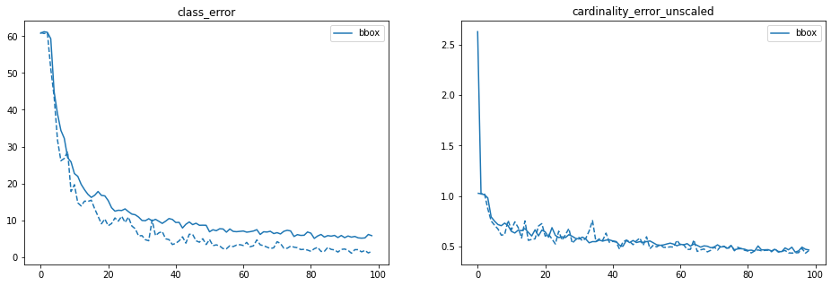

# Documented code.
### Process
The entire process is split into data processing, model definition and training bbox, training segmentation

The dataset is downloaded and we see that the folder structure is -> Annotations -> images -> masks We write a script to create the bounding box from the mask. For this we the library pycocotools. We also use assertion statements to check if shape of images and matching along with filename to avoid using auto image rotation using metadata opencv vs PIL issues. There are potentially 3 types of classes in the segmentation

    spallmask
    rebarmask
    crackmask

These are loaded seperately as different masks then merged. The bouding box is obtained for each of these classes.
### Method of generating coco json
Use the eva_custom_data.ipynb file to genetate the coco json. This file uses code from src/atom_seg.py. The output is as follows

```
  "annotations": [
    {
      "area": 14040,
      "bbox": [
        26.0,
        0.0,
        467.0,
        237.0
      ],
      "category_id": 1,
      "height": 322,
      "id": 3,
      "image_id": 3,
      "iscrowd": 0,
      "segmentation": [
        [
          492.0,
          195.99803921568628,
          477.0,
          195.99803921568628,
          468.0019607843137,
          190.0,
          469.0019607843137,
          181.0,
          462.0019607843137,
          176.0,
          466.0019607843137,
          154.0,
          458.0019607843137,
          147.0,
          448.0019607843137,
          128.0,
          447.0019607843137,
          115.0,
          434.0019607843137,
          81.0,
          419.0,
          66.99803921568628,
          412.0,
          62.998039215686276,
          404.0,
          64.99803921568628,
          400.0019607843137,
          60.0,
          398.0019607843137,
          37.0,
          387.0019607843137,
          17.0,
          388.0,
          0,
          489.9980392156863,
          0.0,
          485.9980392156863,
          55.0,
          489.9980392156863,
          113.0,
          484.9980392156863,
          158.0,
          492.9980392156863,
          178.0,
          492.0,
          195.99803921568628
        ],
```


## Data Split

The data is split using coco split repo https://github.com/akarazniewicz/cocosplit with 80% train and 20% for test.
Model

# Training the model
To train the model download a model and keep inside folder weights and use the train_obj.ipynb file. A pretrained detr model will be used and transfer learning with low lr will be utilized to train the model on custom dataset. For transfer learning two parameters are deleted in the checkpoint weights.

del checkpoint["model"]["class_embed.weight"]
del checkpoint["model"]["class_embed.bias"]
del checkpoint["model"]["query_embed.weight"]

The number of class is chaged and the checkpoint weights are loaded. The standard script is used of training.

# The training performance
The Logs are as follows
```
{"train_lr": 9.99999999999971e-06, "train_class_error": 60.649110652635436, "train_loss": 7.354772792619215, "train_loss_ce": 0.30782607772303017, "train_loss_bbox": 0.4525231833021755, "train_loss_giou": 0.3962373855992976, "train_loss_ce_0": 0.4200033563668746, "train_loss_bbox_0": 0.5232007616249249, "train_loss_giou_0": 0.4505721606567182, "train_loss_ce_1": 0.35643572910680427, "train_loss_bbox_1": 0.4817906654648333, "train_loss_giou_1": 0.41693207301452434, "train_loss_ce_2": 0.3316881077587398, "train_loss_bbox_2": 0.47384040823628404, "train_loss_giou_2": 0.40445584560630227, "train_loss_ce_3": 0.32099156316217453, "train_loss_bbox_3": 0.45775000384943565, "train_loss_giou_3": 0.3991183344680075, "train_loss_ce_4": 0.3144975592055031, "train_loss_bbox_4": 0.4529477135715225, "train_loss_giou_4": 0.3939618548418364, "train_loss_ce_unscaled": 0.30782607772303017, "train_class_error_unscaled": 60.649110652635436, "train_loss_bbox_unscaled": 0.09050463678732215, "train_loss_giou_unscaled": 0.1981186927996488, "train_cardinality_error_unscaled": 2.7837837837837838, "train_loss_ce_0_unscaled": 0.4200033563668746, "train_loss_bbox_0_unscaled": 0.10464015227180344, "train_loss_giou_0_unscaled": 0.2252860803283591, "train_cardinality_error_0_unscaled": 5.255024255024255, "train_loss_ce_1_unscaled": 0.35643572910680427, "train_loss_bbox_1_unscaled": 0.09635813338056011, "train_loss_giou_1_unscaled": 0.20846603650726217, "train_cardinality_error_1_unscaled": 3.7484407484407485, "train_loss_ce_2_unscaled": 0.3316881077587398, "train_loss_bbox_2_unscaled": 0.09476808152320954, "train_loss_giou_2_unscaled": 0.20222792280315113, "train_cardinality_error_2_unscaled": 3.2536382536382535, "train_loss_ce_3_unscaled": 0.32099156316217453, "train_loss_bbox_3_unscaled": 0.09155000076252949, "train_loss_giou_3_unscaled": 0.19955916723400374, "train_cardinality_error_3_unscaled": 3.09009009009009, "train_loss_ce_4_unscaled": 0.3144975592055031, "train_loss_bbox_4_unscaled": 0.09058954291709144, "train_loss_giou_4_unscaled": 0.1969809274209182, "train_cardinality_error_4_unscaled": 2.913374913374913, "test_class_error": 60.99561099913578, "test_loss": 4.490437953796803, "test_loss_ce": 0.2408920698634614, "test_loss_bbox": 0.2223694070435322, "test_loss_giou": 0.24243877653603083, "test_loss_ce_0": 0.3054127993574592, "test_loss_bbox_0": 0.26871633259366556, "test_loss_giou_0": 0.2898926232642625, "test_loss_ce_1": 0.2590702579834977, "test_loss_bbox_1": 0.2364012282173913, "test_loss_giou_1": 0.25982456036268303, "test_loss_ce_2": 0.25181369119074015, "test_loss_bbox_2": 0.22741852710262322, "test_loss_giou_2": 0.25164046311494137, "test_loss_ce_3": 0.2442667949802745, "test_loss_bbox_3": 0.22564135356054318, "test_loss_giou_3": 0.24897888383349856, "test_loss_ce_4": 0.2432050838813506, "test_loss_bbox_4": 0.2255280644620613, "test_loss_giou_4": 0.2469270326408841, "test_loss_ce_unscaled": 0.2408920698634614, "test_class_error_unscaled": 60.99561099913578, "test_loss_bbox_unscaled": 0.04447388143374824, "test_loss_giou_unscaled": 0.12121938826801541, "test_cardinality_error_unscaled": 1.029106029106029, "test_loss_ce_0_unscaled": 0.3054127993574592, "test_loss_bbox_0_unscaled": 0.05374326648504286, "test_loss_giou_0_unscaled": 0.14494631163213126, "test_cardinality_error_0_unscaled": 1.029106029106029, "test_loss_ce_1_unscaled": 0.2590702579834977, "test_loss_bbox_1_unscaled": 0.047280245566416634, "test_loss_giou_1_unscaled": 0.12991228018134152, "test_cardinality_error_1_unscaled": 1.029106029106029, "test_loss_ce_2_unscaled": 0.25181369119074015, "test_loss_bbox_2_unscaled": 0.04548370540890732, "test_loss_giou_2_unscaled": 0.12582023155747069, "test_cardinality_error_2_unscaled": 1.029106029106029, "test_loss_ce_3_unscaled": 0.2442667949802745, "test_loss_bbox_3_unscaled": 0.045128270707461705, "test_loss_giou_3_unscaled": 0.12448944191674928, "test_cardinality_error_3_unscaled": 1.029106029106029, "test_loss_ce_4_unscaled": 0.2432050838813506, "test_loss_bbox_4_unscaled": 0.04510561295230605, "test_loss_giou_4_unscaled": 0.12346351632044204, "test_cardinality_error_4_unscaled": 1.029106029106029, "test_coco_eval_bbox": [0.03370871122650604, 0.049946877882659224, 0.03531367110981272, 0.026486308844476756, 0.012706368736091538, 0.040120386252770264, 0.19428331724727557, 0.29415836146171603, 0.4273854023914013, 0.11547619047619047, 0.21929530201342284, 0.4994281866850593], "epoch": 0, "n_parameters": 41279752}
{"train_lr": 9.99999999999971e-06, "train_class_error": 61.13421113773592, "train_loss": 5.0539399902913935, "train_loss_ce": 0.2255512956550509, "train_loss_bbox": 0.29469127693082503, "train_loss_giou": 0.2830810974805783, "train_loss_ce_0": 0.2615612405336159, "train_loss_bbox_0": 0.34836057288416006, "train_loss_giou_0": 0.3256670467694931, "train_loss_ce_1": 0.23825526608209682, "train_loss_bbox_1": 0.32339167614271885, "train_loss_giou_1": 0.300891581460658, "train_loss_ce_2": 0.23121399165996642, "train_loss_bbox_2": 0.3084214908520711, "train_loss_giou_2": 0.2901310155520568, "train_loss_ce_3": 0.22580829474943342, "train_loss_bbox_3": 0.30194093869019323, "train_loss_giou_3": 0.2887685033941302, "train_loss_ce_4": 0.2266996790979597, "train_loss_bbox_4": 0.29714824740238593, "train_loss_giou_4": 0.28235677285319966, "train_loss_ce_unscaled": 0.2255512956550509, "train_class_error_unscaled": 61.13421113773592, "train_loss_bbox_unscaled": 0.058938255413530274, "train_loss_giou_unscaled": 0.14154054874028915, "train_cardinality_error_unscaled": 1.0173250173250172, "train_loss_ce_0_unscaled": 0.2615612405336159, "train_loss_bbox_0_unscaled": 0.06967211462175235, "train_loss_giou_0_unscaled": 0.16283352338474655, "train_cardinality_error_0_unscaled": 1.0194040194040195, "train_loss_ce_1_unscaled": 0.23825526608209682, "train_loss_bbox_1_unscaled": 0.06467833530741253, "train_loss_giou_1_unscaled": 0.150445790730329, "train_cardinality_error_1_unscaled": 1.0214830214830215, "train_loss_ce_2_unscaled": 0.23121399165996642, "train_loss_bbox_2_unscaled": 0.061684298036685854, "train_loss_giou_2_unscaled": 0.1450655077760284, "train_cardinality_error_2_unscaled": 1.02009702009702, "train_loss_ce_3_unscaled": 0.22580829474943342, "train_loss_bbox_3_unscaled": 0.06038818774939781, "train_loss_giou_3_unscaled": 0.1443842516970651, "train_cardinality_error_3_unscaled": 1.0173250173250172, "train_loss_ce_4_unscaled": 0.2266996790979597, "train_loss_bbox_4_unscaled": 0.05942964931267132, "train_loss_giou_4_unscaled": 0.14117838642659983, "train_cardinality_error_4_unscaled": 1.0166320166320166, "test_class_error": 60.78771079123557, "test_loss": 4.274071042085801, "test_loss_ce": 0.2194466427999935, "test_loss_bbox": 0.2219663687096812, "test_loss_giou": 0.24227957798223568, "test_loss_ce_0": 0.2502990761644007, "test_loss_bbox_0": 0.25257816323035925, "test_loss_giou_0": 0.2721657159835699, "test_loss_ce_1": 0.23124621996342393, "test_loss_bbox_1": 0.24144053668537574, "test_loss_giou_1": 0.25471911654237733, "test_loss_ce_2": 0.22664282958804838, "test_loss_bbox_2": 0.23184328603191007, "test_loss_giou_2": 0.24643094834567603, "test_loss_ce_3": 0.21732893844967036, "test_loss_bbox_3": 0.23309338289653148, "test_loss_giou_3": 0.24715413856407212, "test_loss_ce_4": 0.2180303349066074, "test_loss_bbox_4": 0.22448077019786802, "test_loss_giou_4": 0.24292499797673003, "test_loss_ce_unscaled": 0.2194466427999935, "test_class_error_unscaled": 60.78771079123557, "test_loss_bbox_unscaled": 0.04439327379266524, "test_loss_giou_unscaled": 0.12113978899111784, "test_cardinality_error_unscaled": 1.0263340263340264, "test_loss_ce_0_unscaled": 0.2502990761644007, "test_loss_bbox_0_unscaled": 0.05051563271241971, "test_loss_giou_0_unscaled": 0.13608285799178496, "test_cardinality_error_0_unscaled": 1.029106029106029, "test_loss_ce_1_unscaled": 0.23124621996342393, "test_loss_bbox_1_unscaled": 0.04828810735592103, "test_loss_giou_1_unscaled": 0.12735955827118867, "test_cardinality_error_1_unscaled": 1.0284130284130284, "test_loss_ce_2_unscaled": 0.22664282958804838, "test_loss_bbox_2_unscaled": 0.0463686572182575, "test_loss_giou_2_unscaled": 0.12321547417283801, "test_cardinality_error_2_unscaled": 1.0263340263340264, "test_loss_ce_3_unscaled": 0.21732893844967036, "test_loss_bbox_3_unscaled": 0.046618676692123474, "test_loss_giou_3_unscaled": 0.12357706928203606, "test_cardinality_error_3_unscaled": 1.0235620235620235, "test_loss_ce_4_unscaled": 0.2180303349066074, "test_loss_bbox_4_unscaled": 0.04489615396612626, "test_loss_giou_4_unscaled": 0.12146249898836502, "test_cardinality_error_4_unscaled": 1.0263340263340264, "test_coco_eval_bbox": [0.056575582784808405, 0.07869815681766301, 0.06031271766105873, 0.005700859431181665, 0.03855326064624621, 0.07222804894672809, 0.3099559366440395, 0.39990366140003797, 0.469008654476812, 0.16666666666666666, 0.25871551081282623, 0.5398433343186522], "epoch": 1, "n_parameters": 41279752}
{"train_lr": 9.99999999999971e-06, "train_class_error": 58.708708712233495, "train_loss": 4.451402000416837, "train_loss_ce": 0.20279618937616403, "train_loss_bbox": 0.2565125557642407, "train_loss_giou": 0.2547573985858502, "train_loss_ce_0": 0.22692224733100344, "train_loss_bbox_0": 0.2874817555332692, "train_loss_giou_0": 0.29585881338132725, "train_loss_ce_1": 0.21571740703637907, "train_loss_bbox_1": 0.2707761792531876, "train_loss_giou_1": 0.26879737108470825, "train_loss_ce_2": 0.21087838395686506, "train_loss_bbox_2": 0.2648258742309038, "train_loss_giou_2": 0.2611207922382315, "train_loss_ce_3": 0.2026501228224179, "train_loss_bbox_3": 0.26139994040493, "train_loss_giou_3": 0.2594210908013091, "train_loss_ce_4": 0.20314831324473503, "train_loss_bbox_4": 0.2539350409667399, "train_loss_giou_4": 0.25440252317749457, "train_loss_ce_unscaled": 0.20279618937616403, "train_class_error_unscaled": 58.708708712233495, "train_loss_bbox_unscaled": 0.05130251113238873, "train_loss_giou_unscaled": 0.1273786992929251, "train_cardinality_error_unscaled": 0.9833679833679834, "train_loss_ce_0_unscaled": 0.22692224733100344, "train_loss_bbox_0_unscaled": 0.057496351102781396, "train_loss_giou_0_unscaled": 0.14792940669066362, "train_cardinality_error_0_unscaled": 1.0034650034650034, "train_loss_ce_1_unscaled": 0.21571740703637907, "train_loss_bbox_1_unscaled": 0.05415523590033387, "train_loss_giou_1_unscaled": 0.13439868554235412, "train_cardinality_error_1_unscaled": 0.9896049896049897, "train_loss_ce_2_unscaled": 0.21087838395686506, "train_loss_bbox_2_unscaled": 0.05296517476343956, "train_loss_giou_2_unscaled": 0.13056039611911574, "train_cardinality_error_2_unscaled": 0.9896049896049897, "train_loss_ce_3_unscaled": 0.2026501228224179, "train_loss_bbox_3_unscaled": 0.05227998806852963, "train_loss_giou_3_unscaled": 0.12971054540065455, "train_cardinality_error_3_unscaled": 0.9743589743589743, "train_loss_ce_4_unscaled": 0.20314831324473503, "train_loss_bbox_4_unscaled": 0.05078700817998806, "train_loss_giou_4_unscaled": 0.12720126158874728, "train_cardinality_error_4_unscaled": 0.9847539847539848, "test_class_error": 53.02610302962781, "test_loss": 3.8909314705351945, "test_loss_ce": 0.16815412351190373, "test_loss_bbox": 0.21533340190124858, "test_loss_giou": 0.24565337132597995, "test_loss_ce_0": 0.20285559411929327, "test_loss_bbox_0": 0.23943678137077612, "test_loss_giou_0": 0.2671844463999372, "test_loss_ce_1": 0.19024961439786803, "test_loss_bbox_1": 0.21760991355371986, "test_loss_giou_1": 0.2418655593694289, "test_loss_ce_2": 0.18281588994020795, "test_loss_bbox_2": 0.2168269516591677, "test_loss_giou_2": 0.24157258672013682, "test_loss_ce_3": 0.17108171189214186, "test_loss_bbox_3": 0.21766865443456362, "test_loss_giou_3": 0.24387918585138196, "test_loss_ce_4": 0.1687641926564803, "test_loss_bbox_4": 0.21518620713507436, "test_loss_giou_4": 0.24479329540592387, "test_loss_ce_unscaled": 0.16815412351190373, "test_class_error_unscaled": 53.02610302962781, "test_loss_bbox_unscaled": 0.04306668036650255, "test_loss_giou_unscaled": 0.12282668566298997, "test_cardinality_error_unscaled": 0.8932778932778933, "test_loss_ce_0_unscaled": 0.20285559411929327, "test_loss_bbox_0_unscaled": 0.047887356379033894, "test_loss_giou_0_unscaled": 0.1335922231999686, "test_cardinality_error_0_unscaled": 0.9653499653499653, "test_loss_ce_1_unscaled": 0.19024961439786803, "test_loss_bbox_1_unscaled": 0.04352198273901281, "test_loss_giou_1_unscaled": 0.12093277968471446, "test_cardinality_error_1_unscaled": 0.9306999306999307, "test_loss_ce_2_unscaled": 0.18281588994020795, "test_loss_bbox_2_unscaled": 0.0433653903804327, "test_loss_giou_2_unscaled": 0.12078629336006841, "test_cardinality_error_2_unscaled": 0.9002079002079002, "test_loss_ce_3_unscaled": 0.17108171189214186, "test_loss_bbox_3_unscaled": 0.04353373088536375, "test_loss_giou_3_unscaled": 0.12193959292569098, "test_cardinality_error_3_unscaled": 0.8731808731808732, "test_loss_ce_4_unscaled": 0.1687641926564803, "test_loss_bbox_4_unscaled": 0.04303724134478999, "test_loss_giou_4_unscaled": 0.12239664770296194, "test_cardinality_error_4_unscaled": 0.8925848925848926, "test_coco_eval_bbox": [0.1980699266862089, 0.2644020461958697, 0.21117753319182841, 0.010994362949602135, 0.06467472425520047, 0.24487606805159368, 0.31462071564293576, 0.4302638291216301, 0.470613349828208, 0.1261904761904762, 0.2730797912005966, 0.5438079285315466], "epoch": 2, "n_parameters": 41279752}
{"train_lr": 9.99999999999971e-06, "train_class_error": 50.1155001190249, "train_loss": 4.150830048120278, "train_loss_ce": 0.17090948435956482, "train_loss_bbox": 0.2424392559651443, "train_loss_giou": 0.25272072856821126, "train_loss_ce_0": 0.19735124972968396, "train_loss_bbox_0": 0.279101443605411, "train_loss_giou_0": 0.2879690415563471, "train_loss_ce_1": 0.1880960144261989, "train_loss_bbox_1": 0.25733135859414225, "train_loss_giou_1": 0.2594699805921262, "train_loss_ce_2": 0.18242629860061185, "train_loss_bbox_2": 0.24314108243882038, "train_loss_giou_2": 0.25315883931234656, "train_loss_ce_3": 0.17203363515527006, "train_loss_bbox_3": 0.24457283151269538, "train_loss_giou_3": 0.2556125080924189, "train_loss_ce_4": 0.17172951828665795, "train_loss_bbox_4": 0.2394633549120347, "train_loss_giou_4": 0.25330343125846266, "train_loss_ce_unscaled": 0.17090948435956482, "train_class_error_unscaled": 50.1155001190249, "train_loss_bbox_unscaled": 0.04848785119677222, "train_loss_giou_unscaled": 0.12636036428410563, "train_cardinality_error_unscaled": 0.8475398475398476, "train_loss_ce_0_unscaled": 0.19735124972968396, "train_loss_bbox_0_unscaled": 0.05582028878975352, "train_loss_giou_0_unscaled": 0.14398452077817356, "train_cardinality_error_0_unscaled": 0.9085239085239085, "train_loss_ce_1_unscaled": 0.1880960144261989, "train_loss_bbox_1_unscaled": 0.051466271682685645, "train_loss_giou_1_unscaled": 0.1297349902960631, "train_cardinality_error_1_unscaled": 0.8953568953568953, "train_loss_ce_2_unscaled": 0.18242629860061185, "train_loss_bbox_2_unscaled": 0.0486282164667238, "train_loss_giou_2_unscaled": 0.12657941965617328, "train_cardinality_error_2_unscaled": 0.878031878031878, "train_loss_ce_3_unscaled": 0.17203363515527006, "train_loss_bbox_3_unscaled": 0.04891456615396634, "train_loss_giou_3_unscaled": 0.12780625404620946, "train_cardinality_error_3_unscaled": 0.8350658350658351, "train_loss_ce_4_unscaled": 0.17172951828665795, "train_loss_bbox_4_unscaled": 0.047892670947425865, "train_loss_giou_4_unscaled": 0.12665171562923133, "train_cardinality_error_4_unscaled": 0.8406098406098406, "test_class_error": 42.11134211486689, "test_loss": 3.288925470984383, "test_loss_ce": 0.1536907795863452, "test_loss_bbox": 0.17075074892762174, "test_loss_giou": 0.1961651891779751, "test_loss_ce_0": 0.17919291892945405, "test_loss_bbox_0": 0.20717471572735083, "test_loss_giou_0": 0.22790102810390445, "test_loss_ce_1": 0.17188024581897274, "test_loss_bbox_1": 0.18504608846163056, "test_loss_giou_1": 0.20799893231666178, "test_loss_ce_2": 0.1638893002669352, "test_loss_bbox_2": 0.17649292200545594, "test_loss_giou_2": 0.20093459316367338, "test_loss_ce_3": 0.15430357417318266, "test_loss_bbox_3": 0.17419590508372976, "test_loss_giou_3": 0.1953016940042201, "test_loss_ce_4": 0.15364491409600833, "test_loss_bbox_4": 0.17278660664738918, "test_loss_giou_4": 0.19757531627713187, "test_loss_ce_unscaled": 0.1536907795863452, "test_class_error_unscaled": 42.11134211486689, "test_loss_bbox_unscaled": 0.03415014979391464, "test_loss_giou_unscaled": 0.09808259458898755, "test_cardinality_error_unscaled": 0.7532917532917532, "test_loss_ce_0_unscaled": 0.17919291892945405, "test_loss_bbox_0_unscaled": 0.04143494315966912, "test_loss_giou_0_unscaled": 0.11395051405195222, "test_cardinality_error_0_unscaled": 0.8496188496188496, "test_loss_ce_1_unscaled": 0.17188024581897274, "test_loss_bbox_1_unscaled": 0.037009217675029196, "test_loss_giou_1_unscaled": 0.10399946615833089, "test_cardinality_error_1_unscaled": 0.8371448371448371, "test_loss_ce_2_unscaled": 0.1638893002669352, "test_loss_bbox_2_unscaled": 0.03529858448731759, "test_loss_giou_2_unscaled": 0.10046729658183669, "test_cardinality_error_2_unscaled": 0.7907137907137907, "test_loss_ce_3_unscaled": 0.15430357417318266, "test_loss_bbox_3_unscaled": 0.03483918099389854, "test_loss_giou_3_unscaled": 0.09765084700211005, "test_cardinality_error_3_unscaled": 0.7325017325017324, "test_loss_ce_4_unscaled": 0.15364491409600833, "test_loss_bbox_4_unscaled": 0.0345573213373518, "test_loss_giou_4_unscaled": 0.09878765813856594, "test_cardinality_error_4_unscaled": 0.7456687456687456, "test_coco_eval_bbox": [0.27501172953692643, 0.3479550304485538, 0.2929245846804507, 0.026574139296446312, 0.07369660628351182, 0.3394153335518867, 0.35651449789281536, 0.4562740068858992, 0.5034873862200252, 0.19940476190476192, 0.3197194258016406, 0.563176996091569], "epoch": 3, "n_parameters": 41279752}
{"train_lr": 9.99999999999971e-06, "train_class_error": 39.789789793314576, "train_loss": 3.8912928248132816, "train_loss_ce": 0.1446583259823956, "train_loss_bbox": 0.227872772010628, "train_loss_giou": 0.24363125504426303, "train_loss_ce_0": 0.17258380518997718, "train_loss_bbox_0": 0.2696661363605588, "train_loss_giou_0": 0.2822578907921673, "train_loss_ce_1": 0.1649990370542286, "train_loss_bbox_1": 0.24901366378525974, "train_loss_giou_1": 0.2566887577292164, "train_loss_ce_2": 0.15649561350777932, "train_loss_bbox_2": 0.23443622645881346, "train_loss_giou_2": 0.2486035056148894, "train_loss_ce_3": 0.14842195830024568, "train_loss_bbox_3": 0.2324406786557811, "train_loss_giou_3": 0.24491358802951382, "train_loss_ce_4": 0.14491876664680214, "train_loss_bbox_4": 0.2270131853311655, "train_loss_giou_4": 0.24267764968832417, "train_loss_ce_unscaled": 0.1446583259823956, "train_class_error_unscaled": 39.789789793314576, "train_loss_bbox_unscaled": 0.04557455434610426, "train_loss_giou_unscaled": 0.12181562752213151, "train_cardinality_error_unscaled": 0.7428967428967429, "train_loss_ce_0_unscaled": 0.17258380518997718, "train_loss_bbox_0_unscaled": 0.053933227243068434, "train_loss_giou_0_unscaled": 0.14112894539608364, "train_cardinality_error_0_unscaled": 0.8357588357588358, "train_loss_ce_1_unscaled": 0.1649990370542286, "train_loss_bbox_1_unscaled": 0.049802732720392824, "train_loss_giou_1_unscaled": 0.1283443788646082, "train_cardinality_error_1_unscaled": 0.799029799029799, "train_loss_ce_2_unscaled": 0.15649561350777932, "train_loss_bbox_2_unscaled": 0.04688724529640962, "train_loss_giou_2_unscaled": 0.1243017528074447, "train_cardinality_error_2_unscaled": 0.7706167706167706, "train_loss_ce_3_unscaled": 0.14842195830024568, "train_loss_bbox_3_unscaled": 0.046488135633570654, "train_loss_giou_3_unscaled": 0.12245679401475691, "train_cardinality_error_3_unscaled": 0.7463617463617463, "train_loss_ce_4_unscaled": 0.14491876664680214, "train_loss_bbox_4_unscaled": 0.04540263703938416, "train_loss_giou_4_unscaled": 0.12133882484416209, "train_cardinality_error_4_unscaled": 0.7331947331947332, "test_class_error": 35.770385773910554, "test_loss": 3.7027389236357338, "test_loss_ce": 0.1321709320067421, "test_loss_bbox": 0.21491060324906477, "test_loss_giou": 0.24019495633767035, "test_loss_ce_0": 0.15506735500090252, "test_loss_bbox_0": 0.2524015069787525, "test_loss_giou_0": 0.2793254868404285, "test_loss_ce_1": 0.15052611356677278, "test_loss_bbox_1": 0.2334248588568249, "test_loss_giou_1": 0.2607422625531113, "test_loss_ce_2": 0.13892823044657293, "test_loss_bbox_2": 0.22259867512469314, "test_loss_giou_2": 0.24752721770802721, "test_loss_ce_3": 0.13234910935554614, "test_loss_bbox_3": 0.21790727536559973, "test_loss_giou_3": 0.24144334596473974, "test_loss_ce_4": 0.13156100622525443, "test_loss_bbox_4": 0.2149189798366627, "test_loss_giou_4": 0.2367410078613773, "test_loss_ce_unscaled": 0.1321709320067421, "test_class_error_unscaled": 35.770385773910554, "test_loss_bbox_unscaled": 0.04298212074326791, "test_loss_giou_unscaled": 0.12009747816883518, "test_cardinality_error_unscaled": 0.6812196812196812, "test_loss_ce_0_unscaled": 0.15506735500090252, "test_loss_bbox_0_unscaled": 0.05048030137542018, "test_loss_giou_0_unscaled": 0.13966274342021426, "test_cardinality_error_0_unscaled": 0.8267498267498268, "test_loss_ce_1_unscaled": 0.15052611356677278, "test_loss_bbox_1_unscaled": 0.04668497177756089, "test_loss_giou_1_unscaled": 0.13037113127655564, "test_cardinality_error_1_unscaled": 0.774081774081774, "test_loss_ce_2_unscaled": 0.13892823044657293, "test_loss_bbox_2_unscaled": 0.04451973485739092, "test_loss_giou_2_unscaled": 0.12376360885401361, "test_cardinality_error_2_unscaled": 0.7117117117117117, "test_loss_ce_3_unscaled": 0.13234910935554614, "test_loss_bbox_3_unscaled": 0.04358145516631674, "test_loss_giou_3_unscaled": 0.12072167298236987, "test_cardinality_error_3_unscaled": 0.6888426888426888, "test_loss_ce_4_unscaled": 0.13156100622525443, "test_loss_bbox_4_unscaled": 0.04298379606349821, "test_loss_giou_4_unscaled": 0.11837050393068865, "test_cardinality_error_4_unscaled": 0.681912681912682, "test_coco_eval_bbox": [0.28261570230646155, 0.3677363433918262, 0.3012156707045827, 0.04428840869238407, 0.09748589162031801, 0.3455184770254514, 0.3564592187330586, 0.45518744256566396, 0.485169365747184, 0.1130952380952381, 0.25867822520507083, 0.5638102276086314], "epoch": 4, "n_parameters": 41279752}
{"train_lr": 9.99999999999971e-06, "train_class_error": 36.324786328311106, "train_loss": 3.6459600178593266, "train_loss_ce": 0.13977522708957063, "train_loss_bbox": 0.21230491056873083, "train_loss_giou": 0.22700647727863207, "train_loss_ce_0": 0.1682009225200064, "train_loss_bbox_0": 0.23988233720309315, "train_loss_giou_0": 0.2556917921008125, "train_loss_ce_1": 0.15830737168478573, "train_loss_bbox_1": 0.22090154654673627, "train_loss_giou_1": 0.23925516341844533, "train_loss_ce_2": 0.149001202000691, "train_loss_bbox_2": 0.22343446800455566, "train_loss_giou_2": 0.2370612667983221, "train_loss_ce_3": 0.141997570909572, "train_loss_bbox_3": 0.218062645809277, "train_loss_giou_3": 0.23337441108661316, "train_loss_ce_4": 0.1395909184917042, "train_loss_bbox_4": 0.21398079358118735, "train_loss_giou_4": 0.22813099366628867, "train_loss_ce_unscaled": 0.13977522708957063, "train_class_error_unscaled": 36.324786328311106, "train_loss_bbox_unscaled": 0.04246098213013951, "train_loss_giou_unscaled": 0.11350323863931604, "train_cardinality_error_unscaled": 0.6860706860706861, "train_loss_ce_0_unscaled": 0.1682009225200064, "train_loss_bbox_0_unscaled": 0.04797646741538321, "train_loss_giou_0_unscaled": 0.12784589605040625, "train_cardinality_error_0_unscaled": 0.7962577962577962, "train_loss_ce_1_unscaled": 0.15830737168478573, "train_loss_bbox_1_unscaled": 0.04418030930379675, "train_loss_giou_1_unscaled": 0.11962758170922266, "train_cardinality_error_1_unscaled": 0.7560637560637561, "train_loss_ce_2_unscaled": 0.149001202000691, "train_loss_bbox_2_unscaled": 0.04468689358206524, "train_loss_giou_2_unscaled": 0.11853063339916105, "train_cardinality_error_2_unscaled": 0.7137907137907138, "train_loss_ce_3_unscaled": 0.141997570909572, "train_loss_bbox_3_unscaled": 0.04361252913578095, "train_loss_giou_3_unscaled": 0.11668720554330658, "train_cardinality_error_3_unscaled": 0.6909216909216909, "train_loss_ce_4_unscaled": 0.1395909184917042, "train_loss_bbox_4_unscaled": 0.04279615868938853, "train_loss_giou_4_unscaled": 0.11406549683314433, "train_cardinality_error_4_unscaled": 0.6826056826056826, "test_class_error": 25.028875032399814, "test_loss": 3.0601922316052024, "test_loss_ce": 0.11042943341274793, "test_loss_bbox": 0.17345547755729673, "test_loss_giou": 0.20084522665579618, "test_loss_ce_0": 0.14474809385335288, "test_loss_bbox_0": 0.19863426895735994, "test_loss_giou_0": 0.2390785713783999, "test_loss_ce_1": 0.1364738355450105, "test_loss_bbox_1": 0.1732638154775214, "test_loss_giou_1": 0.21126022474351064, "test_loss_ce_2": 0.12708121753599153, "test_loss_bbox_2": 0.1699215931532619, "test_loss_giou_2": 0.20016192130057744, "test_loss_ce_3": 0.11817326157225383, "test_loss_bbox_3": 0.17147590118516506, "test_loss_giou_3": 0.19944548672962256, "test_loss_ce_4": 0.11414506437988824, "test_loss_bbox_4": 0.17049960118001398, "test_loss_giou_4": 0.20109924855780784, "test_loss_ce_unscaled": 0.11042943341274793, "test_class_error_unscaled": 25.028875032399814, "test_loss_bbox_unscaled": 0.03469109545801963, "test_loss_giou_unscaled": 0.10042261332789809, "test_cardinality_error_unscaled": 0.887040887040887, "test_loss_ce_0_unscaled": 0.14474809385335288, "test_loss_bbox_0_unscaled": 0.039726853825033166, "test_loss_giou_0_unscaled": 0.11953928568919996, "test_cardinality_error_0_unscaled": 0.7401247401247402, "test_loss_ce_1_unscaled": 0.1364738355450105, "test_loss_bbox_1_unscaled": 0.03465276306762269, "test_loss_giou_1_unscaled": 0.10563011237175532, "test_cardinality_error_1_unscaled": 0.7789327789327789, "test_loss_ce_2_unscaled": 0.12708121753599153, "test_loss_bbox_2_unscaled": 0.03398431861761516, "test_loss_giou_2_unscaled": 0.10008096065028872, "test_cardinality_error_2_unscaled": 0.781011781011781, "test_loss_ce_3_unscaled": 0.11817326157225383, "test_loss_bbox_3_unscaled": 0.03429518024451974, "test_loss_giou_3_unscaled": 0.09972274336481128, "test_cardinality_error_3_unscaled": 0.9043659043659044, "test_loss_ce_4_unscaled": 0.11414506437988824, "test_loss_bbox_4_unscaled": 0.034099920355274045, "test_loss_giou_4_unscaled": 0.10054962427890392, "test_cardinality_error_4_unscaled": 0.853083853083853, "test_coco_eval_bbox": [0.28155927792023383, 0.3654241937339582, 0.30322341350982657, 0.04803963897538586, 0.11985993644822328, 0.33917553824123686, 0.3564386001397087, 0.47174115133514277, 0.5086434565294286, 0.13333333333333333, 0.31115771812080534, 0.5792748053995467], "epoch": 5, "n_parameters": 41279752}
{"train_lr": 9.99999999999971e-06, "train_class_error": 33.22938322938323, "train_loss": 3.7225959925923293, "train_loss_ce": 0.13310774969123723, "train_loss_bbox": 0.2236284562441432, "train_loss_giou": 0.2397325491624331, "train_loss_ce_0": 0.16085486409637745, "train_loss_bbox_0": 0.25358885724926195, "train_loss_giou_0": 0.27226205167056616, "train_loss_ce_1": 0.1539764281709847, "train_loss_bbox_1": 0.22765639211468744, "train_loss_giou_1": 0.24462310278985702, "train_loss_ce_2": 0.1427952024195994, "train_loss_bbox_2": 0.22845915909946915, "train_loss_giou_2": 0.24343400528591205, "train_loss_ce_3": 0.13781474002068042, "train_loss_bbox_3": 0.22575373418128333, "train_loss_giou_3": 0.24044415633544605, "train_loss_ce_4": 0.13468032157200577, "train_loss_bbox_4": 0.22092645262946953, "train_loss_giou_4": 0.23885777582332482, "train_loss_ce_unscaled": 0.13310774969123723, "train_class_error_unscaled": 33.22938322938323, "train_loss_bbox_unscaled": 0.0447256912581225, "train_loss_giou_unscaled": 0.11986627458121656, "train_cardinality_error_unscaled": 0.735966735966736, "train_loss_ce_0_unscaled": 0.16085486409637745, "train_loss_bbox_0_unscaled": 0.05071777141926009, "train_loss_giou_0_unscaled": 0.13613102583528308, "train_cardinality_error_0_unscaled": 0.8045738045738046, "train_loss_ce_1_unscaled": 0.1539764281709847, "train_loss_bbox_1_unscaled": 0.04553127842835891, "train_loss_giou_1_unscaled": 0.12231155139492851, "train_cardinality_error_1_unscaled": 0.7837837837837838, "train_loss_ce_2_unscaled": 0.1427952024195994, "train_loss_bbox_2_unscaled": 0.045691831800273454, "train_loss_giou_2_unscaled": 0.12171700264295603, "train_cardinality_error_2_unscaled": 0.7304227304227304, "train_loss_ce_3_unscaled": 0.13781474002068042, "train_loss_bbox_3_unscaled": 0.045150746798564886, "train_loss_giou_3_unscaled": 0.12022207816772303, "train_cardinality_error_3_unscaled": 0.726957726957727, "train_loss_ce_4_unscaled": 0.13468032157200577, "train_loss_bbox_4_unscaled": 0.044185290422241515, "train_loss_giou_4_unscaled": 0.11942888791166241, "train_cardinality_error_4_unscaled": 0.7241857241857241, "test_class_error": 23.712173715698498, "test_loss": 2.9670516675569205, "test_loss_ce": 0.10088990873477906, "test_loss_bbox": 0.17819086206419882, "test_loss_giou": 0.20550092020054617, "test_loss_ce_0": 0.13535188443552798, "test_loss_bbox_0": 0.18639825349538094, "test_loss_giou_0": 0.22123140608859573, "test_loss_ce_1": 0.12767909653178253, "test_loss_bbox_1": 0.17561337012895695, "test_loss_giou_1": 0.20088102442889436, "test_loss_ce_2": 0.11458826163625221, "test_loss_bbox_2": 0.17335132407108406, "test_loss_giou_2": 0.19670414466124314, "test_loss_ce_3": 0.10637792756400836, "test_loss_bbox_3": 0.17198990684000057, "test_loss_giou_3": 0.19702851014342146, "test_loss_ce_4": 0.1028242221008373, "test_loss_bbox_4": 0.17329707404189407, "test_loss_giou_4": 0.19915356602176393, "test_loss_ce_unscaled": 0.10088990873477906, "test_class_error_unscaled": 23.712173715698498, "test_loss_bbox_unscaled": 0.03563817248925598, "test_loss_giou_unscaled": 0.10275046010027308, "test_cardinality_error_unscaled": 0.7158697158697158, "test_loss_ce_0_unscaled": 0.13535188443552798, "test_loss_bbox_0_unscaled": 0.0372796507306366, "test_loss_giou_0_unscaled": 0.11061570304429787, "test_cardinality_error_0_unscaled": 0.808038808038808, "test_loss_ce_1_unscaled": 0.12767909653178253, "test_loss_bbox_1_unscaled": 0.03512267391432957, "test_loss_giou_1_unscaled": 0.10044051221444718, "test_cardinality_error_1_unscaled": 0.7602217602217602, "test_loss_ce_2_unscaled": 0.11458826163625221, "test_loss_bbox_2_unscaled": 0.03467026469281572, "test_loss_giou_2_unscaled": 0.09835207233062157, "test_cardinality_error_2_unscaled": 0.7013167013167013, "test_loss_ce_3_unscaled": 0.10637792756400836, "test_loss_bbox_3_unscaled": 0.034397981405820975, "test_loss_giou_3_unscaled": 0.09851425507171073, "test_cardinality_error_3_unscaled": 0.7553707553707554, "test_loss_ce_4_unscaled": 0.1028242221008373, "test_loss_bbox_4_unscaled": 0.03465941478578956, "test_loss_giou_4_unscaled": 0.09957678301088196, "test_cardinality_error_4_unscaled": 0.7144837144837145, "test_coco_eval_bbox": [0.3106231852892518, 0.3991839212214806, 0.33391434740707465, 0.03972078589502257, 0.15573905064091864, 0.369019552580583, 0.3774398816919333, 0.4760486598803054, 0.5070010789212209, 0.11666666666666667, 0.3087900820283372, 0.5796482412060302], "epoch": 6, "n_parameters": 41279752}
{"train_lr": 9.99999999999971e-06, "train_class_error": 29.96072996249235, "train_loss": 3.3465287464640827, "train_loss_ce": 0.12132860987951184, "train_loss_bbox": 0.19768689799865377, "train_loss_giou": 0.2163406563399983, "train_loss_ce_0": 0.15108741337553827, "train_loss_bbox_0": 0.22324463543472445, "train_loss_giou_0": 0.24500914235042354, "train_loss_ce_1": 0.1429832624006895, "train_loss_bbox_1": 0.20412297213575284, "train_loss_giou_1": 0.2227449668668164, "train_loss_ce_2": 0.13246961190044648, "train_loss_bbox_2": 0.19822770160024603, "train_loss_giou_2": 0.21779742601507668, "train_loss_ce_3": 0.12423229085418479, "train_loss_bbox_3": 0.19655543961126568, "train_loss_giou_3": 0.21573106204149878, "train_loss_ce_4": 0.12125657191644881, "train_loss_bbox_4": 0.1986645786059415, "train_loss_giou_4": 0.21704551908016537, "train_loss_ce_unscaled": 0.12132860987951184, "train_class_error_unscaled": 29.96072996249235, "train_loss_bbox_unscaled": 0.039537379470391154, "train_loss_giou_unscaled": 0.10817032816999915, "train_cardinality_error_unscaled": 0.7858627858627859, "train_loss_ce_0_unscaled": 0.15108741337553827, "train_loss_bbox_0_unscaled": 0.04464892705945054, "train_loss_giou_0_unscaled": 0.12250457117521177, "train_cardinality_error_0_unscaled": 0.9216909216909217, "train_loss_ce_1_unscaled": 0.1429832624006895, "train_loss_bbox_1_unscaled": 0.04082459445245053, "train_loss_giou_1_unscaled": 0.1113724834334082, "train_cardinality_error_1_unscaled": 0.8662508662508662, "train_loss_ce_2_unscaled": 0.13246961190044648, "train_loss_bbox_2_unscaled": 0.03964554032405073, "train_loss_giou_2_unscaled": 0.10889871300753834, "train_cardinality_error_2_unscaled": 0.7900207900207901, "train_loss_ce_3_unscaled": 0.12423229085418479, "train_loss_bbox_3_unscaled": 0.03931108798072702, "train_loss_giou_3_unscaled": 0.10786553102074939, "train_cardinality_error_3_unscaled": 0.7796257796257796, "train_loss_ce_4_unscaled": 0.12125657191644881, "train_loss_bbox_4_unscaled": 0.039732915725254364, "train_loss_giou_4_unscaled": 0.10852275954008268, "train_cardinality_error_4_unscaled": 0.7747747747747747, "test_class_error": 19.20766921119399, "test_loss": 2.8313266845911804, "test_loss_ce": 0.09048831524012439, "test_loss_bbox": 0.16474471887804656, "test_loss_giou": 0.19813364459174587, "test_loss_ce_0": 0.12692192445698885, "test_loss_bbox_0": 0.18395807849771226, "test_loss_giou_0": 0.21399708952411378, "test_loss_ce_1": 0.11803340533551743, "test_loss_bbox_1": 0.16841878290710893, "test_loss_giou_1": 0.19676899996715871, "test_loss_ce_2": 0.10375915682349098, "test_loss_bbox_2": 0.1616458101540143, "test_loss_giou_2": 0.1949975675208157, "test_loss_ce_3": 0.09585578991416442, "test_loss_bbox_3": 0.16285646271298762, "test_loss_giou_3": 0.19688301371850656, "test_loss_ce_4": 0.09377296372374541, "test_loss_bbox_4": 0.1637184205758679, "test_loss_giou_4": 0.1963725490695639, "test_loss_ce_unscaled": 0.09048831524012439, "test_class_error_unscaled": 19.20766921119399, "test_loss_bbox_unscaled": 0.032948943782450626, "test_loss_giou_unscaled": 0.09906682229587294, "test_cardinality_error_unscaled": 0.704088704088704, "test_loss_ce_0_unscaled": 0.12692192445698885, "test_loss_bbox_0_unscaled": 0.03679161565152416, "test_loss_giou_0_unscaled": 0.10699854476205689, "test_cardinality_error_0_unscaled": 0.8260568260568261, "test_loss_ce_1_unscaled": 0.11803340533551743, "test_loss_bbox_1_unscaled": 0.03368375662130795, "test_loss_giou_1_unscaled": 0.09838449998357936, "test_cardinality_error_1_unscaled": 0.7477477477477478, "test_loss_ce_2_unscaled": 0.10375915682349098, "test_loss_bbox_2_unscaled": 0.032329162049003345, "test_loss_giou_2_unscaled": 0.09749878376040785, "test_cardinality_error_2_unscaled": 0.7165627165627165, "test_loss_ce_3_unscaled": 0.09585578991416442, "test_loss_bbox_3_unscaled": 0.03257129257073728, "test_loss_giou_3_unscaled": 0.09844150685925328, "test_cardinality_error_3_unscaled": 0.7338877338877339, "test_loss_ce_4_unscaled": 0.09377296372374541, "test_loss_bbox_4_unscaled": 0.03274368411168838, "test_loss_giou_4_unscaled": 0.09818627453478194, "test_cardinality_error_4_unscaled": 0.7061677061677062, "test_coco_eval_bbox": [0.3482121793905062, 0.45085744652677623, 0.36626841441700464, 0.057418707082726776, 0.17909523116203313, 0.41251363602062174, 0.4022669787895108, 0.4844203420198045, 0.5228244273452317, 0.16547619047619047, 0.3520926547352721, 0.5826084671724636], "epoch": 7, "n_parameters": 41279752}
{"train_lr": 9.99999999999971e-06, "train_class_error": 27.234927234927234, "train_loss": 3.1198102509478987, "train_loss_ce": 0.11126871459711359, "train_loss_bbox": 0.18444617226466856, "train_loss_giou": 0.20188421502513185, "train_loss_ce_0": 0.1421617153395338, "train_loss_bbox_0": 0.20975692780354085, "train_loss_giou_0": 0.23157232376080128, "train_loss_ce_1": 0.13261025042527394, "train_loss_bbox_1": 0.18923719500063074, "train_loss_giou_1": 0.21026278603680004, "train_loss_ce_2": 0.12126093988168622, "train_loss_bbox_2": 0.18337139008890732, "train_loss_giou_2": 0.20509072566148068, "train_loss_ce_3": 0.11249041978031782, "train_loss_bbox_3": 0.18177965032846788, "train_loss_giou_3": 0.20545235968098735, "train_loss_ce_4": 0.11220530601769077, "train_loss_bbox_4": 0.18175699640703094, "train_loss_giou_4": 0.20320217806022364, "train_loss_ce_unscaled": 0.11126871459711359, "train_class_error_unscaled": 27.234927234927234, "train_loss_bbox_unscaled": 0.03688923440672256, "train_loss_giou_unscaled": 0.10094210751256592, "train_cardinality_error_unscaled": 0.6971586971586972, "train_loss_ce_0_unscaled": 0.1421617153395338, "train_loss_bbox_0_unscaled": 0.04195138556548418, "train_loss_giou_0_unscaled": 0.11578616188040064, "train_cardinality_error_0_unscaled": 0.8073458073458073, "train_loss_ce_1_unscaled": 0.13261025042527394, "train_loss_bbox_1_unscaled": 0.03784743902594243, "train_loss_giou_1_unscaled": 0.10513139301840002, "train_cardinality_error_1_unscaled": 0.7401247401247402, "train_loss_ce_2_unscaled": 0.12126093988168622, "train_loss_bbox_2_unscaled": 0.03667427797376469, "train_loss_giou_2_unscaled": 0.10254536283074034, "train_cardinality_error_2_unscaled": 0.6985446985446986, "train_loss_ce_3_unscaled": 0.11249041978031782, "train_loss_bbox_3_unscaled": 0.03635593004362065, "train_loss_giou_3_unscaled": 0.10272617984049368, "train_cardinality_error_3_unscaled": 0.7103257103257103, "train_loss_ce_4_unscaled": 0.11220530601769077, "train_loss_bbox_4_unscaled": 0.03635139924771593, "train_loss_giou_4_unscaled": 0.10160108903011182, "train_cardinality_error_4_unscaled": 0.6916146916146916, "test_class_error": 22.291522295047077, "test_loss": 2.8691364716769443, "test_loss_ce": 0.10183067370344638, "test_loss_bbox": 0.1610593789657907, "test_loss_giou": 0.1941078474392762, "test_loss_ce_0": 0.12890432369559668, "test_loss_bbox_0": 0.18689184047266252, "test_loss_giou_0": 0.2238152824750148, "test_loss_ce_1": 0.1237234215229149, "test_loss_bbox_1": 0.16585651041368024, "test_loss_giou_1": 0.19913439265738242, "test_loss_ce_2": 0.11111715767250101, "test_loss_bbox_2": 0.16221371557039474, "test_loss_giou_2": 0.19362109061007854, "test_loss_ce_3": 0.10089306583166108, "test_loss_bbox_3": 0.16273063207232366, "test_loss_giou_3": 0.1967530029768425, "test_loss_ce_4": 0.10141040782981642, "test_loss_bbox_4": 0.15976142778357572, "test_loss_giou_4": 0.19531229987213863, "test_loss_ce_unscaled": 0.10183067370344638, "test_class_error_unscaled": 22.291522295047077, "test_loss_bbox_unscaled": 0.0322118757482378, "test_loss_giou_unscaled": 0.0970539237196381, "test_cardinality_error_unscaled": 0.613998613998614, "test_loss_ce_0_unscaled": 0.12890432369559668, "test_loss_bbox_0_unscaled": 0.03737836815055385, "test_loss_giou_0_unscaled": 0.1119076412375074, "test_cardinality_error_0_unscaled": 0.8274428274428275, "test_loss_ce_1_unscaled": 0.1237234215229149, "test_loss_bbox_1_unscaled": 0.03317130213230332, "test_loss_giou_1_unscaled": 0.09956719632869121, "test_cardinality_error_1_unscaled": 0.6874566874566874, "test_loss_ce_2_unscaled": 0.11111715767250101, "test_loss_bbox_2_unscaled": 0.032442743098072845, "test_loss_giou_2_unscaled": 0.09681054530503927, "test_cardinality_error_2_unscaled": 0.6243936243936244, "test_loss_ce_3_unscaled": 0.10089306583166108, "test_loss_bbox_3_unscaled": 0.03254612646183762, "test_loss_giou_3_unscaled": 0.09837650148842125, "test_cardinality_error_3_unscaled": 0.6264726264726265, "test_loss_ce_4_unscaled": 0.10141040782981642, "test_loss_bbox_4_unscaled": 0.03195228556697712, "test_loss_giou_4_unscaled": 0.09765614993606932, "test_cardinality_error_4_unscaled": 0.6133056133056133, "test_coco_eval_bbox": [0.3347437354707596, 0.42581693816220334, 0.36360875515083746, 0.06668330720341384, 0.1789125946116468, 0.39325485820854783, 0.3951059280233346, 0.4864946436093914, 0.5182108393367212, 0.14702380952380953, 0.3513842281879195, 0.5772023516274182], "epoch": 8, "n_parameters": 41279752}
{"train_lr": 9.99999999999971e-06, "train_class_error": 25.24832525008764, "train_loss": 3.356512435384215, "train_loss_ce": 0.11465705261689159, "train_loss_bbox": 0.1974936656354412, "train_loss_giou": 0.2193952842214747, "train_loss_ce_0": 0.14334332620765292, "train_loss_bbox_0": 0.23047462311248687, "train_loss_giou_0": 0.24758965404844913, "train_loss_ce_1": 0.13532752457822445, "train_loss_bbox_1": 0.21067726916206933, "train_loss_giou_1": 0.22560985354359417, "train_loss_ce_2": 0.12393614674998989, "train_loss_bbox_2": 0.2069650841922043, "train_loss_giou_2": 0.22111873992680678, "train_loss_ce_3": 0.11791597715589784, "train_loss_bbox_3": 0.204391607728142, "train_loss_giou_3": 0.22211653646791635, "train_loss_ce_4": 0.11365350476476688, "train_loss_bbox_4": 0.2003657684615624, "train_loss_giou_4": 0.22148081877127507, "train_loss_ce_unscaled": 0.11465705261689159, "train_class_error_unscaled": 25.24832525008764, "train_loss_bbox_unscaled": 0.0394987332810824, "train_loss_giou_unscaled": 0.10969764211073735, "train_cardinality_error_unscaled": 0.6812196812196812, "train_loss_ce_0_unscaled": 0.14334332620765292, "train_loss_bbox_0_unscaled": 0.04609492452258834, "train_loss_giou_0_unscaled": 0.12379482702422456, "train_cardinality_error_0_unscaled": 0.9015939015939016, "train_loss_ce_1_unscaled": 0.13532752457822445, "train_loss_bbox_1_unscaled": 0.04213545386171535, "train_loss_giou_1_unscaled": 0.11280492677179708, "train_cardinality_error_1_unscaled": 0.7456687456687456, "train_loss_ce_2_unscaled": 0.12393614674998989, "train_loss_bbox_2_unscaled": 0.04139301678577563, "train_loss_giou_2_unscaled": 0.11055936996340339, "train_cardinality_error_2_unscaled": 0.6611226611226612, "train_loss_ce_3_unscaled": 0.11791597715589784, "train_loss_bbox_3_unscaled": 0.040878321531429444, "train_loss_giou_3_unscaled": 0.11105826823395817, "train_cardinality_error_3_unscaled": 0.6860706860706861, "train_loss_ce_4_unscaled": 0.11365350476476688, "train_loss_bbox_4_unscaled": 0.0400731537868001, "train_loss_giou_4_unscaled": 0.11074040938563753, "train_cardinality_error_4_unscaled": 0.6791406791406791, "test_class_error": 17.26726727079205, "test_loss": 2.667237989343729, "test_loss_ce": 0.08100706250316445, "test_loss_bbox": 0.1510310404645492, "test_loss_giou": 0.1869749508008144, "test_loss_ce_0": 0.11218609178405867, "test_loss_bbox_0": 0.184016900796673, "test_loss_giou_0": 0.22044908806258245, "test_loss_ce_1": 0.10304725692277981, "test_loss_bbox_1": 0.15778441818292901, "test_loss_giou_1": 0.19239321105280272, "test_loss_ce_2": 0.09535024881576545, "test_loss_bbox_2": 0.15087711182568153, "test_loss_giou_2": 0.18044347099686198, "test_loss_ce_3": 0.08386636571571417, "test_loss_bbox_3": 0.15659625366929084, "test_loss_giou_3": 0.1893581436767565, "test_loss_ce_4": 0.08105055780659222, "test_loss_bbox_4": 0.15298825726610088, "test_loss_giou_4": 0.18781754558316058, "test_loss_ce_unscaled": 0.08100706250316445, "test_class_error_unscaled": 17.26726727079205, "test_loss_bbox_unscaled": 0.03020620805857418, "test_loss_giou_unscaled": 0.0934874754004072, "test_cardinality_error_unscaled": 0.5876645876645876, "test_loss_ce_0_unscaled": 0.11218609178405867, "test_loss_bbox_0_unscaled": 0.03680338018734527, "test_loss_giou_0_unscaled": 0.11022454403129123, "test_cardinality_error_0_unscaled": 0.7456687456687456, "test_loss_ce_1_unscaled": 0.10304725692277981, "test_loss_bbox_1_unscaled": 0.031556883595150666, "test_loss_giou_1_unscaled": 0.09619660552640136, "test_cardinality_error_1_unscaled": 0.6112266112266113, "test_loss_ce_2_unscaled": 0.09535024881576545, "test_loss_bbox_2_unscaled": 0.030175422320215965, "test_loss_giou_2_unscaled": 0.09022173549843099, "test_cardinality_error_2_unscaled": 0.5620235620235621, "test_loss_ce_3_unscaled": 0.08386636571571417, "test_loss_bbox_3_unscaled": 0.03131925074379744, "test_loss_giou_3_unscaled": 0.09467907183837825, "test_cardinality_error_3_unscaled": 0.586971586971587, "test_loss_ce_4_unscaled": 0.08105055780659222, "test_loss_bbox_4_unscaled": 0.030597651433470714, "test_loss_giou_4_unscaled": 0.09390877279158029, "test_cardinality_error_4_unscaled": 0.5793485793485793, "test_coco_eval_bbox": [0.3745142701411679, 0.4742889052516018, 0.4066920649133681, 0.06286047210440514, 0.17001553195158253, 0.44672427182666313, 0.4158178382826844, 0.49596551007022766, 0.5249042390761448, 0.14047619047619048, 0.35054996271439226, 0.5871970965940815], "epoch": 9, "n_parameters": 41279752}
{"train_lr": 9.99999999999971e-06, "train_class_error": 22.672672676197458, "train_loss": 3.110502981325656, "train_loss_ce": 0.1026293145025151, "train_loss_bbox": 0.18743015756173548, "train_loss_giou": 0.20614904194182188, "train_loss_ce_0": 0.1371276298592831, "train_loss_bbox_0": 0.20969124581879076, "train_loss_giou_0": 0.23196378839734685, "train_loss_ce_1": 0.12877275673981747, "train_loss_bbox_1": 0.1881786073536734, "train_loss_giou_1": 0.20969998605203397, "train_loss_ce_2": 0.11775447315199537, "train_loss_bbox_2": 0.18701282173281567, "train_loss_giou_2": 0.20502535696254368, "train_loss_ce_3": 0.10557584425307244, "train_loss_bbox_3": 0.18771422321102063, "train_loss_giou_3": 0.20949541279118009, "train_loss_ce_4": 0.10279744425120828, "train_loss_bbox_4": 0.18802457113188129, "train_loss_giou_4": 0.20546030147325142, "train_loss_ce_unscaled": 0.1026293145025151, "train_class_error_unscaled": 22.672672676197458, "train_loss_bbox_unscaled": 0.03748603151402516, "train_loss_giou_unscaled": 0.10307452097091094, "train_cardinality_error_unscaled": 0.668052668052668, "train_loss_ce_0_unscaled": 0.1371276298592831, "train_loss_bbox_0_unscaled": 0.041938249259278415, "train_loss_giou_0_unscaled": 0.11598189419867343, "train_cardinality_error_0_unscaled": 0.799029799029799, "train_loss_ce_1_unscaled": 0.12877275673981747, "train_loss_bbox_1_unscaled": 0.037635721472799984, "train_loss_giou_1_unscaled": 0.10484999302601698, "train_cardinality_error_1_unscaled": 0.7124047124047124, "train_loss_ce_2_unscaled": 0.11775447315199537, "train_loss_bbox_2_unscaled": 0.03740256438799827, "train_loss_giou_2_unscaled": 0.10251267848127184, "train_cardinality_error_2_unscaled": 0.6521136521136521, "train_loss_ce_3_unscaled": 0.10557584425307244, "train_loss_bbox_3_unscaled": 0.037542844635233726, "train_loss_giou_3_unscaled": 0.10474770639559004, "train_cardinality_error_3_unscaled": 0.6597366597366597, "train_loss_ce_4_unscaled": 0.10279744425120828, "train_loss_bbox_4_unscaled": 0.03760491424560939, "train_loss_giou_4_unscaled": 0.10273015073662571, "train_cardinality_error_4_unscaled": 0.6514206514206514, "test_class_error": 16.43566643919122, "test_loss": 2.5546792893646617, "test_loss_ce": 0.07992639006596325, "test_loss_bbox": 0.14347010222989717, "test_loss_giou": 0.17914024265954168, "test_loss_ce_0": 0.11257332332001622, "test_loss_bbox_0": 0.16761536419143797, "test_loss_giou_0": 0.2107148865239123, "test_loss_ce_1": 0.1027365467449481, "test_loss_bbox_1": 0.14793740372332903, "test_loss_giou_1": 0.1833519984349061, "test_loss_ce_2": 0.09088006850548798, "test_loss_bbox_2": 0.14237275992908044, "test_loss_giou_2": 0.18072607406955252, "test_loss_ce_3": 0.08202454551253455, "test_loss_bbox_3": 0.14509930978616284, "test_loss_giou_3": 0.1826581207729427, "test_loss_ce_4": 0.08182408298722037, "test_loss_bbox_4": 0.14396510936438583, "test_loss_giou_4": 0.17766296448430005, "test_loss_ce_unscaled": 0.07992639006596325, "test_class_error_unscaled": 16.43566643919122, "test_loss_bbox_unscaled": 0.02869402041254734, "test_loss_giou_unscaled": 0.08957012132977084, "test_cardinality_error_unscaled": 0.5841995841995842, "test_loss_ce_0_unscaled": 0.11257332332001622, "test_loss_bbox_0_unscaled": 0.033523072844225336, "test_loss_giou_0_unscaled": 0.10535744326195615, "test_cardinality_error_0_unscaled": 0.6798336798336798, "test_loss_ce_1_unscaled": 0.1027365467449481, "test_loss_bbox_1_unscaled": 0.029587480711362798, "test_loss_giou_1_unscaled": 0.09167599921745305, "test_cardinality_error_1_unscaled": 0.5980595980595981, "test_loss_ce_2_unscaled": 0.09088006850548798, "test_loss_bbox_2_unscaled": 0.028474551971488047, "test_loss_giou_2_unscaled": 0.09036303703477626, "test_cardinality_error_2_unscaled": 0.5557865557865558, "test_loss_ce_3_unscaled": 0.08202454551253455, "test_loss_bbox_3_unscaled": 0.029019861936773163, "test_loss_giou_3_unscaled": 0.09132906038647134, "test_cardinality_error_3_unscaled": 0.5911295911295912, "test_loss_ce_4_unscaled": 0.08182408298722037, "test_loss_bbox_4_unscaled": 0.028793021892303924, "test_loss_giou_4_unscaled": 0.08883148224215003, "test_cardinality_error_4_unscaled": 0.5786555786555787, "test_coco_eval_bbox": [0.37889013082942957, 0.482338337052667, 0.41110962824867975, 0.08369340805221243, 0.21855184618850754, 0.43871886713611197, 0.42775475960675363, 0.5112342894317267, 0.5465301218096725, 0.18511904761904763, 0.40169649515287104, 0.5995493808913851], "epoch": 10, "n_parameters": 41279752}
{"train_lr": 9.99999999999971e-06, "train_class_error": 21.841071844596623, "train_loss": 2.9073174702448847, "train_loss_ce": 0.10068048663770185, "train_loss_bbox": 0.16741876276913445, "train_loss_giou": 0.18907687041136595, "train_loss_ce_0": 0.13112531488803095, "train_loss_bbox_0": 0.20169176250484488, "train_loss_giou_0": 0.2183354943061321, "train_loss_ce_1": 0.12256238041506322, "train_loss_bbox_1": 0.17844970130225435, "train_loss_giou_1": 0.19611945434403105, "train_loss_ce_2": 0.11236344221511158, "train_loss_bbox_2": 0.1747023558188604, "train_loss_giou_2": 0.19291661071512986, "train_loss_ce_3": 0.10664017673925458, "train_loss_bbox_3": 0.16745164853469705, "train_loss_giou_3": 0.1895403166405459, "train_loss_ce_4": 0.1005298264553946, "train_loss_bbox_4": 0.16591920255866013, "train_loss_giou_4": 0.1917936643088599, "train_loss_ce_unscaled": 0.10068048663770185, "train_class_error_unscaled": 21.841071844596623, "train_loss_bbox_unscaled": 0.03348375252904325, "train_loss_giou_unscaled": 0.09453843520568297, "train_cardinality_error_unscaled": 0.6687456687456688, "train_loss_ce_0_unscaled": 0.13112531488803095, "train_loss_bbox_0_unscaled": 0.04033835246456801, "train_loss_giou_0_unscaled": 0.10916774715306606, "train_cardinality_error_0_unscaled": 0.7553707553707554, "train_loss_ce_1_unscaled": 0.12256238041506322, "train_loss_bbox_1_unscaled": 0.035689940302402336, "train_loss_giou_1_unscaled": 0.09805972717201553, "train_cardinality_error_1_unscaled": 0.7013167013167013, "train_loss_ce_2_unscaled": 0.11236344221511158, "train_loss_bbox_2_unscaled": 0.03494047113627774, "train_loss_giou_2_unscaled": 0.09645830535756493, "train_cardinality_error_2_unscaled": 0.6264726264726265, "train_loss_ce_3_unscaled": 0.10664017673925458, "train_loss_bbox_3_unscaled": 0.033490329823370864, "train_loss_giou_3_unscaled": 0.09477015832027295, "train_cardinality_error_3_unscaled": 0.6417186417186417, "train_loss_ce_4_unscaled": 0.1005298264553946, "train_loss_bbox_4_unscaled": 0.033183840588793645, "train_loss_giou_4_unscaled": 0.09589683215442996, "train_cardinality_error_4_unscaled": 0.6465696465696466, "test_class_error": 18.341418344943126, "test_loss": 2.5503534891139856, "test_loss_ce": 0.08732306214544566, "test_loss_bbox": 0.13588987683266793, "test_loss_giou": 0.1768927640247411, "test_loss_ce_0": 0.11764602508790092, "test_loss_bbox_0": 0.1633377952006796, "test_loss_giou_0": 0.1959671444638438, "test_loss_ce_1": 0.11069659967923715, "test_loss_bbox_1": 0.1481818858900689, "test_loss_giou_1": 0.18202344151065322, "test_loss_ce_2": 0.09836715418414686, "test_loss_bbox_2": 0.14353237318149972, "test_loss_giou_2": 0.1806105895333214, "test_loss_ce_3": 0.09004800036398987, "test_loss_bbox_3": 0.14141041352668532, "test_loss_giou_3": 0.1803858617652396, "test_loss_ce_4": 0.0889212729642329, "test_loss_bbox_4": 0.13658618171101053, "test_loss_giou_4": 0.17253304465479596, "test_loss_ce_unscaled": 0.08732306214544566, "test_class_error_unscaled": 18.341418344943126, "test_loss_bbox_unscaled": 0.027177975359111404, "test_loss_giou_unscaled": 0.08844638201237055, "test_cardinality_error_unscaled": 0.6347886347886348, "test_loss_ce_0_unscaled": 0.11764602508790092, "test_loss_bbox_0_unscaled": 0.032667559064919555, "test_loss_giou_0_unscaled": 0.0979835722319219, "test_cardinality_error_0_unscaled": 0.6971586971586972, "test_loss_ce_1_unscaled": 0.11069659967923715, "test_loss_bbox_1_unscaled": 0.029636377220868815, "test_loss_giou_1_unscaled": 0.09101172075532661, "test_cardinality_error_1_unscaled": 0.6216216216216216, "test_loss_ce_2_unscaled": 0.09836715418414686, "test_loss_bbox_2_unscaled": 0.028706474650821604, "test_loss_giou_2_unscaled": 0.0903052947666607, "test_cardinality_error_2_unscaled": 0.5786555786555787, "test_loss_ce_3_unscaled": 0.09004800036398987, "test_loss_bbox_3_unscaled": 0.028282082700302885, "test_loss_giou_3_unscaled": 0.0901929308826198, "test_cardinality_error_3_unscaled": 0.6195426195426196, "test_loss_ce_4_unscaled": 0.0889212729642329, "test_loss_bbox_4_unscaled": 0.027317236332843702, "test_loss_giou_4_unscaled": 0.08626652232739798, "test_cardinality_error_4_unscaled": 0.6084546084546084, "test_coco_eval_bbox": [0.37824129409240975, 0.4676598866139141, 0.40694846138670765, 0.10224010797447299, 0.23001016046847136, 0.4368262865931706, 0.4246864996205113, 0.5019532562269041, 0.5407624258130569, 0.24940476190476188, 0.4276006711409396, 0.5839652510920617], "epoch": 11, "n_parameters": 41279752}
{"train_lr": 9.99999999999971e-06, "train_class_error": 22.811272814797594, "train_loss": 3.051497429499297, "train_loss_ce": 0.10484268244368361, "train_loss_bbox": 0.17495587166354876, "train_loss_giou": 0.20125750869987577, "train_loss_ce_0": 0.13546963409568566, "train_loss_bbox_0": 0.20278766508745347, "train_loss_giou_0": 0.23261998179713966, "train_loss_ce_1": 0.12594959349987656, "train_loss_bbox_1": 0.19115018567466646, "train_loss_giou_1": 0.21291362049673798, "train_loss_ce_2": 0.11809603158039954, "train_loss_bbox_2": 0.18240145167009292, "train_loss_giou_2": 0.20357053414534465, "train_loss_ce_3": 0.10975893738941522, "train_loss_bbox_3": 0.177266123897589, "train_loss_giou_3": 0.20233974061075052, "train_loss_ce_4": 0.10612752592737659, "train_loss_bbox_4": 0.17107132073344658, "train_loss_giou_4": 0.19891901790310917, "train_loss_ce_unscaled": 0.10484268244368361, "train_class_error_unscaled": 22.811272814797594, "train_loss_bbox_unscaled": 0.0349911743386475, "train_loss_giou_unscaled": 0.10062875434993789, "train_cardinality_error_unscaled": 0.6562716562716563, "train_loss_ce_0_unscaled": 0.13546963409568566, "train_loss_bbox_0_unscaled": 0.04055753299464328, "train_loss_giou_0_unscaled": 0.11630999089856983, "train_cardinality_error_0_unscaled": 0.7706167706167706, "train_loss_ce_1_unscaled": 0.12594959349987656, "train_loss_bbox_1_unscaled": 0.03823003712886646, "train_loss_giou_1_unscaled": 0.10645681024836899, "train_cardinality_error_1_unscaled": 0.7151767151767152, "train_loss_ce_2_unscaled": 0.11809603158039954, "train_loss_bbox_2_unscaled": 0.03648029036151293, "train_loss_giou_2_unscaled": 0.10178526707267233, "train_cardinality_error_2_unscaled": 0.6451836451836452, "train_loss_ce_3_unscaled": 0.10975893738941522, "train_loss_bbox_3_unscaled": 0.03545322473279032, "train_loss_giou_3_unscaled": 0.10116987030537526, "train_cardinality_error_3_unscaled": 0.6334026334026334, "train_loss_ce_4_unscaled": 0.10612752592737659, "train_loss_bbox_4_unscaled": 0.034214264075565444, "train_loss_giou_4_unscaled": 0.09945950895155459, "train_cardinality_error_4_unscaled": 0.6334026334026334, "test_class_error": 14.87641487993966, "test_loss": 2.5474804311742902, "test_loss_ce": 0.0794075979285729, "test_loss_bbox": 0.14217583974274758, "test_loss_giou": 0.17326716854600385, "test_loss_ce_0": 0.10962675733621102, "test_loss_bbox_0": 0.17920667391815123, "test_loss_giou_0": 0.2139015392098919, "test_loss_ce_1": 0.09791486004422088, "test_loss_bbox_1": 0.15290212447284537, "test_loss_giou_1": 0.18733384025980843, "test_loss_ce_2": 0.08786037213678345, "test_loss_bbox_2": 0.14554027090467414, "test_loss_giou_2": 0.17868397177835346, "test_loss_ce_3": 0.08203384005018274, "test_loss_bbox_3": 0.14194498284463658, "test_loss_giou_3": 0.17725690156324655, "test_loss_ce_4": 0.07957215619714418, "test_loss_bbox_4": 0.14291296940431134, "test_loss_giou_4": 0.1759385686736923, "test_loss_ce_unscaled": 0.0794075979285729, "test_class_error_unscaled": 14.87641487993966, "test_loss_bbox_unscaled": 0.02843516789491618, "test_loss_giou_unscaled": 0.08663358427300193, "test_cardinality_error_unscaled": 0.6368676368676369, "test_loss_ce_0_unscaled": 0.10962675733621102, "test_loss_bbox_0_unscaled": 0.035841334774465466, "test_loss_giou_0_unscaled": 0.10695076960494596, "test_cardinality_error_0_unscaled": 0.7761607761607762, "test_loss_ce_1_unscaled": 0.09791486004422088, "test_loss_bbox_1_unscaled": 0.03058042486630024, "test_loss_giou_1_unscaled": 0.09366692012990421, "test_cardinality_error_1_unscaled": 0.695079695079695, "test_loss_ce_2_unscaled": 0.08786037213678345, "test_loss_bbox_2_unscaled": 0.029108054184032783, "test_loss_giou_2_unscaled": 0.08934198588917673, "test_cardinality_error_2_unscaled": 0.5959805959805959, "test_loss_ce_3_unscaled": 0.08203384005018274, "test_loss_bbox_3_unscaled": 0.028388996541432968, "test_loss_giou_3_unscaled": 0.08862845078162328, "test_cardinality_error_3_unscaled": 0.611919611919612, "test_loss_ce_4_unscaled": 0.07957215619714418, "test_loss_bbox_4_unscaled": 0.02858259387950691, "test_loss_giou_4_unscaled": 0.08796928433684616, "test_cardinality_error_4_unscaled": 0.6257796257796258, "test_coco_eval_bbox": [0.38384913642799595, 0.4797043422412731, 0.40891011227067814, 0.09314708520561385, 0.21389281475009803, 0.44535515291167277, 0.42872774391707064, 0.5071368772429385, 0.5416047664499938, 0.1898809523809524, 0.4024468680089486, 0.5931576181561401], "epoch": 12, "n_parameters": 41279752}
{"train_lr": 9.99999999999971e-06, "train_class_error": 19.554169557694337, "train_loss": 2.806077953338742, "train_loss_ce": 0.09003199564143836, "train_loss_bbox": 0.16448793498436487, "train_loss_giou": 0.19036749552622984, "train_loss_ce_0": 0.12116647385341357, "train_loss_bbox_0": 0.19726274703511204, "train_loss_giou_0": 0.22097276546685793, "train_loss_ce_1": 0.1106119806322432, "train_loss_bbox_1": 0.1679177462721627, "train_loss_giou_1": 0.19205283486669625, "train_loss_ce_2": 0.10330672619448117, "train_loss_bbox_2": 0.16545645592763905, "train_loss_giou_2": 0.19165125673046893, "train_loss_ce_3": 0.09461091652749878, "train_loss_bbox_3": 0.16346136177615705, "train_loss_giou_3": 0.19127357394349964, "train_loss_ce_4": 0.09051573705095865, "train_loss_bbox_4": 0.1629001652080971, "train_loss_giou_4": 0.18802978818150584, "train_loss_ce_unscaled": 0.09003199564143836, "train_class_error_unscaled": 19.554169557694337, "train_loss_bbox_unscaled": 0.03289758696266639, "train_loss_giou_unscaled": 0.09518374776311492, "train_cardinality_error_unscaled": 0.6916146916146916, "train_loss_ce_0_unscaled": 0.12116647385341357, "train_loss_bbox_0_unscaled": 0.03945254937733368, "train_loss_giou_0_unscaled": 0.11048638273342896, "train_cardinality_error_0_unscaled": 0.817047817047817, "train_loss_ce_1_unscaled": 0.1106119806322432, "train_loss_bbox_1_unscaled": 0.033583549266953436, "train_loss_giou_1_unscaled": 0.09602641743334812, "train_cardinality_error_1_unscaled": 0.7782397782397782, "train_loss_ce_2_unscaled": 0.10330672619448117, "train_loss_bbox_2_unscaled": 0.03309129117274875, "train_loss_giou_2_unscaled": 0.09582562836523446, "train_cardinality_error_2_unscaled": 0.674982674982675, "train_loss_ce_3_unscaled": 0.09461091652749878, "train_loss_bbox_3_unscaled": 0.032692272393568596, "train_loss_giou_3_unscaled": 0.09563678697174982, "train_cardinality_error_3_unscaled": 0.6805266805266805, "train_loss_ce_4_unscaled": 0.09051573705095865, "train_loss_bbox_4_unscaled": 0.032580033027936786, "train_loss_giou_4_unscaled": 0.09401489409075292, "train_cardinality_error_4_unscaled": 0.6784476784476784, "test_class_error": 13.455763459288239, "test_loss": 2.346984609181858, "test_loss_ce": 0.06908037010427824, "test_loss_bbox": 0.13308253794216646, "test_loss_giou": 0.1691078244916945, "test_loss_ce_0": 0.0943613786220543, "test_loss_bbox_0": 0.15131314443159727, "test_loss_giou_0": 0.19556764156473072, "test_loss_ce_1": 0.08677693257932516, "test_loss_bbox_1": 0.13720162211816012, "test_loss_giou_1": 0.1813723329694752, "test_loss_ce_2": 0.07715945747743769, "test_loss_bbox_2": 0.13461485743969265, "test_loss_giou_2": 0.172230380478206, "test_loss_ce_3": 0.07115968281577403, "test_loss_bbox_3": 0.13391378590461495, "test_loss_giou_3": 0.16964223460447267, "test_loss_ce_4": 0.06976065460933324, "test_loss_bbox_4": 0.13230833631945996, "test_loss_giou_4": 0.1683314438090916, "test_loss_ce_unscaled": 0.06908037010427824, "test_class_error_unscaled": 13.455763459288239, "test_loss_bbox_unscaled": 0.02661650753512266, "test_loss_giou_unscaled": 0.08455391224584725, "test_cardinality_error_unscaled": 0.659043659043659, "test_loss_ce_0_unscaled": 0.0943613786220543, "test_loss_bbox_0_unscaled": 0.030262628828039186, "test_loss_giou_0_unscaled": 0.09778382078236536, "test_cardinality_error_0_unscaled": 0.8378378378378378, "test_loss_ce_1_unscaled": 0.08677693257932516, "test_loss_bbox_1_unscaled": 0.027440324421824883, "test_loss_giou_1_unscaled": 0.0906861664847376, "test_cardinality_error_1_unscaled": 0.7027027027027027, "test_loss_ce_2_unscaled": 0.07715945747743769, "test_loss_bbox_2_unscaled": 0.02692297144908502, "test_loss_giou_2_unscaled": 0.086115190239103, "test_cardinality_error_2_unscaled": 0.6340956340956341, "test_loss_ce_3_unscaled": 0.07115968281577403, "test_loss_bbox_3_unscaled": 0.026782757239267797, "test_loss_giou_3_unscaled": 0.08482111730223633, "test_cardinality_error_3_unscaled": 0.6465696465696466, "test_loss_ce_4_unscaled": 0.06976065460933324, "test_loss_bbox_4_unscaled": 0.026461667253436395, "test_loss_giou_4_unscaled": 0.0841657219045458, "test_cardinality_error_4_unscaled": 0.6431046431046431, "test_coco_eval_bbox": [0.4054032738987598, 0.5029981071642605, 0.44172815229043844, 0.15333943201614786, 0.2643266163848897, 0.46074092096802827, 0.4442855390784555, 0.5215279444151163, 0.5528866919422182, 0.2511904761904762, 0.4378309097688292, 0.598809734949256], "epoch": 13, "n_parameters": 41279752}
{"train_lr": 9.99999999999971e-06, "train_class_error": 19.034419037943817, "train_loss": 2.8777273632463376, "train_loss_ce": 0.08772662525341715, "train_loss_bbox": 0.17284549492761772, "train_loss_giou": 0.19587547020703988, "train_loss_ce_0": 0.11709450005317544, "train_loss_bbox_0": 0.20229506942334477, "train_loss_giou_0": 0.22475198638249172, "train_loss_ce_1": 0.10739931503638707, "train_loss_bbox_1": 0.1789570614819467, "train_loss_giou_1": 0.2059758385580113, "train_loss_ce_2": 0.09751494004695503, "train_loss_bbox_2": 0.1777888700554479, "train_loss_giou_2": 0.19742836975134337, "train_loss_ce_3": 0.09166061569605419, "train_loss_bbox_3": 0.1706012220187106, "train_loss_giou_3": 0.19578710183945283, "train_loss_ce_4": 0.08873223285854975, "train_loss_bbox_4": 0.17054428421451412, "train_loss_giou_4": 0.19474836884483396, "train_loss_ce_unscaled": 0.08772662525341715, "train_class_error_unscaled": 19.034419037943817, "train_loss_bbox_unscaled": 0.03456909904141581, "train_loss_giou_unscaled": 0.09793773510351994, "train_cardinality_error_unscaled": 0.7047817047817048, "train_loss_ce_0_unscaled": 0.11709450005317544, "train_loss_bbox_0_unscaled": 0.04045901390351484, "train_loss_giou_0_unscaled": 0.11237599319124586, "train_cardinality_error_0_unscaled": 0.8302148302148302, "train_loss_ce_1_unscaled": 0.10739931503638707, "train_loss_bbox_1_unscaled": 0.035791412329563274, "train_loss_giou_1_unscaled": 0.10298791927900565, "train_cardinality_error_1_unscaled": 0.7422037422037422, "train_loss_ce_2_unscaled": 0.09751494004695503, "train_loss_bbox_2_unscaled": 0.035557774005280915, "train_loss_giou_2_unscaled": 0.09871418487567168, "train_cardinality_error_2_unscaled": 0.7027027027027027, "train_loss_ce_3_unscaled": 0.09166061569605419, "train_loss_bbox_3_unscaled": 0.034120244412906904, "train_loss_giou_3_unscaled": 0.09789355091972642, "train_cardinality_error_3_unscaled": 0.6874566874566874, "train_loss_ce_4_unscaled": 0.08873223285854975, "train_loss_bbox_4_unscaled": 0.03410885677907206, "train_loss_giou_4_unscaled": 0.09737418442241698, "train_cardinality_error_4_unscaled": 0.6971586971586972, "test_class_error": 12.624162627687408, "test_loss": 2.3466102515611276, "test_loss_ce": 0.06755286877083319, "test_loss_bbox": 0.12822590404198514, "test_loss_giou": 0.1704720239711981, "test_loss_ce_0": 0.09862122697000084, "test_loss_bbox_0": 0.15079795335544038, "test_loss_giou_0": 0.20041105471298418, "test_loss_ce_1": 0.08551175061425588, "test_loss_bbox_1": 0.1350696082959469, "test_loss_giou_1": 0.18110174043923719, "test_loss_ce_2": 0.07606524724603407, "test_loss_bbox_2": 0.13162679927280316, "test_loss_giou_2": 0.17559351763292394, "test_loss_ce_3": 0.07042582884963508, "test_loss_bbox_3": 0.1309240694252654, "test_loss_giou_3": 0.17527178177714595, "test_loss_ce_4": 0.06816313116361367, "test_loss_bbox_4": 0.12831835445643958, "test_loss_giou_4": 0.17245739185182238, "test_loss_ce_unscaled": 0.06755286877083319, "test_class_error_unscaled": 12.624162627687408, "test_loss_bbox_unscaled": 0.025645180747664212, "test_loss_giou_unscaled": 0.08523601198559905, "test_cardinality_error_unscaled": 0.7595287595287595, "test_loss_ce_0_unscaled": 0.09862122697000084, "test_loss_bbox_0_unscaled": 0.03015959065772815, "test_loss_giou_0_unscaled": 0.10020552735649209, "test_cardinality_error_0_unscaled": 0.9265419265419266, "test_loss_ce_1_unscaled": 0.08551175061425588, "test_loss_bbox_1_unscaled": 0.02701392166712789, "test_loss_giou_1_unscaled": 0.09055087021961859, "test_cardinality_error_1_unscaled": 0.8038808038808039, "test_loss_ce_2_unscaled": 0.07606524724603407, "test_loss_bbox_2_unscaled": 0.026325359857271344, "test_loss_giou_2_unscaled": 0.08779675881646197, "test_cardinality_error_2_unscaled": 0.7920997920997921, "test_loss_ce_3_unscaled": 0.07042582884963508, "test_loss_bbox_3_unscaled": 0.026184813914290027, "test_loss_giou_3_unscaled": 0.08763589088857297, "test_cardinality_error_3_unscaled": 0.7692307692307693, "test_loss_ce_4_unscaled": 0.06816313116361367, "test_loss_bbox_4_unscaled": 0.02566367091755599, "test_loss_giou_4_unscaled": 0.08622869592591119, "test_cardinality_error_4_unscaled": 0.7519057519057519, "test_coco_eval_bbox": [0.38144615110397007, 0.4845295996343502, 0.40508093294148045, 0.10367006855936406, 0.24146676232464415, 0.4385399552064849, 0.4314410441540067, 0.5141665733497571, 0.5441205903316573, 0.19761904761904764, 0.40681394481730054, 0.5978273721548921], "epoch": 14, "n_parameters": 41279752}
{"train_lr": 9.99999999999971e-06, "train_class_error": 17.140217141979534, "train_loss": 2.7414086870009498, "train_loss_ce": 0.08193111780813815, "train_loss_bbox": 0.16216354481669365, "train_loss_giou": 0.1907551883205472, "train_loss_ce_0": 0.11145719292425631, "train_loss_bbox_0": 0.19079600069839675, "train_loss_giou_0": 0.21376263058524286, "train_loss_ce_1": 0.10194891427508375, "train_loss_bbox_1": 0.16902107755477364, "train_loss_giou_1": 0.1943662186422368, "train_loss_ce_2": 0.09083216870531612, "train_loss_bbox_2": 0.16661041984573388, "train_loss_giou_2": 0.19331725537570416, "train_loss_ce_3": 0.08451481824452906, "train_loss_bbox_3": 0.1618417898852608, "train_loss_giou_3": 0.1943074976166998, "train_loss_ce_4": 0.082140538367447, "train_loss_bbox_4": 0.16079140552374446, "train_loss_giou_4": 0.19085091513556404, "train_loss_ce_unscaled": 0.08193111780813815, "train_class_error_unscaled": 17.140217141979534, "train_loss_bbox_unscaled": 0.032432708954432114, "train_loss_giou_unscaled": 0.0953775941602736, "train_cardinality_error_unscaled": 0.6964656964656964, "train_loss_ce_0_unscaled": 0.11145719292425631, "train_loss_bbox_0_unscaled": 0.03815920015491096, "train_loss_giou_0_unscaled": 0.10688131529262143, "train_cardinality_error_0_unscaled": 0.8281358281358281, "train_loss_ce_1_unscaled": 0.10194891427508375, "train_loss_bbox_1_unscaled": 0.03380421553147868, "train_loss_giou_1_unscaled": 0.0971831093211184, "train_cardinality_error_1_unscaled": 0.760914760914761, "train_loss_ce_2_unscaled": 0.09083216870531612, "train_loss_bbox_2_unscaled": 0.03332208399547939, "train_loss_giou_2_unscaled": 0.09665862768785208, "train_cardinality_error_2_unscaled": 0.6936936936936937, "train_loss_ce_3_unscaled": 0.08451481824452906, "train_loss_bbox_3_unscaled": 0.0323683580129368, "train_loss_giou_3_unscaled": 0.0971537488083499, "train_cardinality_error_3_unscaled": 0.6742896742896742, "train_loss_ce_4_unscaled": 0.082140538367447, "train_loss_bbox_4_unscaled": 0.03215828111197745, "train_loss_giou_4_unscaled": 0.09542545756778202, "train_cardinality_error_4_unscaled": 0.6763686763686764, "test_class_error": 13.525063528588309, "test_loss": 2.5011431491137976, "test_loss_ce": 0.0745647619697137, "test_loss_bbox": 0.1436270892346434, "test_loss_giou": 0.17662464665689157, "test_loss_ce_0": 0.10275872905408041, "test_loss_bbox_0": 0.17805073426407778, "test_loss_giou_0": 0.21432051956860126, "test_loss_ce_1": 0.09453746939145903, "test_loss_bbox_1": 0.14654374481982352, "test_loss_giou_1": 0.17968285009419843, "test_loss_ce_2": 0.08258264289663407, "test_loss_bbox_2": 0.14505457671453412, "test_loss_giou_2": 0.17735672914064848, "test_loss_ce_3": 0.07686225875324847, "test_loss_bbox_3": 0.14278389292505161, "test_loss_giou_3": 0.1742806478828832, "test_loss_ce_4": 0.07645628775823682, "test_loss_bbox_4": 0.14185987457591712, "test_loss_giou_4": 0.17319569576141822, "test_loss_ce_unscaled": 0.0745647619697137, "test_class_error_unscaled": 13.525063528588309, "test_loss_bbox_unscaled": 0.0287254178433144, "test_loss_giou_unscaled": 0.08831232332844578, "test_cardinality_error_unscaled": 0.6001386001386001, "test_loss_ce_0_unscaled": 0.10275872905408041, "test_loss_bbox_0_unscaled": 0.03561014687411399, "test_loss_giou_0_unscaled": 0.10716025978430063, "test_cardinality_error_0_unscaled": 0.7124047124047124, "test_loss_ce_1_unscaled": 0.09453746939145903, "test_loss_bbox_1_unscaled": 0.02930874893201705, "test_loss_giou_1_unscaled": 0.08984142504709922, "test_cardinality_error_1_unscaled": 0.6604296604296604, "test_loss_ce_2_unscaled": 0.08258264289663407, "test_loss_bbox_2_unscaled": 0.029010915329740514, "test_loss_giou_2_unscaled": 0.08867836457032424, "test_cardinality_error_2_unscaled": 0.5904365904365905, "test_loss_ce_3_unscaled": 0.07686225875324847, "test_loss_bbox_3_unscaled": 0.028556778557128733, "test_loss_giou_3_unscaled": 0.0871403239414416, "test_cardinality_error_3_unscaled": 0.5918225918225918, "test_loss_ce_4_unscaled": 0.07645628775823682, "test_loss_bbox_4_unscaled": 0.028371974914925262, "test_loss_giou_4_unscaled": 0.08659784788070911, "test_cardinality_error_4_unscaled": 0.5855855855855856, "test_coco_eval_bbox": [0.41452043770281266, 0.5196694420201237, 0.4486796444711697, 0.14402348295446943, 0.2918552129143065, 0.46604385823105055, 0.4545603529334393, 0.5220039495271055, 0.5551949079184285, 0.26369047619047614, 0.48073732289336324, 0.5912155548986765], "epoch": 15, "n_parameters": 41279752}
{"train_lr": 9.99999999999971e-06, "train_class_error": 14.96881496881497, "train_loss": 2.7314757591261527, "train_loss_ce": 0.07447887564810551, "train_loss_bbox": 0.16859631609928047, "train_loss_giou": 0.19059381328848443, "train_loss_ce_0": 0.10279033362005605, "train_loss_bbox_0": 0.19490497143666777, "train_loss_giou_0": 0.2196499050613583, "train_loss_ce_1": 0.08990592462705019, "train_loss_bbox_1": 0.17835343970800346, "train_loss_giou_1": 0.20017270660202122, "train_loss_ce_2": 0.08055865427269884, "train_loss_bbox_2": 0.1686022824718154, "train_loss_giou_2": 0.1938701811054888, "train_loss_ce_3": 0.07428272498117705, "train_loss_bbox_3": 0.16908259342836987, "train_loss_giou_3": 0.19540602980763733, "train_loss_ce_4": 0.07575786663929608, "train_loss_bbox_4": 0.1650621823563769, "train_loss_giou_4": 0.1894069565556897, "train_loss_ce_unscaled": 0.07447887564810551, "train_class_error_unscaled": 14.96881496881497, "train_loss_bbox_unscaled": 0.033719263230569854, "train_loss_giou_unscaled": 0.09529690664424222, "train_cardinality_error_unscaled": 0.6923076923076923, "train_loss_ce_0_unscaled": 0.10279033362005605, "train_loss_bbox_0_unscaled": 0.03898099422898874, "train_loss_giou_0_unscaled": 0.10982495253067916, "train_cardinality_error_0_unscaled": 0.8371448371448371, "train_loss_ce_1_unscaled": 0.08990592462705019, "train_loss_bbox_1_unscaled": 0.03567068787886712, "train_loss_giou_1_unscaled": 0.10008635330101061, "train_cardinality_error_1_unscaled": 0.726957726957727, "train_loss_ce_2_unscaled": 0.08055865427269884, "train_loss_bbox_2_unscaled": 0.03372045655167524, "train_loss_giou_2_unscaled": 0.0969350905527444, "train_cardinality_error_2_unscaled": 0.6708246708246708, "train_loss_ce_3_unscaled": 0.07428272498117705, "train_loss_bbox_3_unscaled": 0.03381651869509692, "train_loss_giou_3_unscaled": 0.09770301490381866, "train_cardinality_error_3_unscaled": 0.6832986832986833, "train_loss_ce_4_unscaled": 0.07575786663929608, "train_loss_bbox_4_unscaled": 0.03301243645759275, "train_loss_giou_4_unscaled": 0.09470347827784485, "train_cardinality_error_4_unscaled": 0.6777546777546778, "test_class_error": 9.193809197333978, "test_loss": 2.1617706879839167, "test_loss_ce": 0.05230987147942031, "test_loss_bbox": 0.12735703508921448, "test_loss_giou": 0.1633870209659542, "test_loss_ce_0": 0.08074787371874673, "test_loss_bbox_0": 0.1429114634841061, "test_loss_giou_0": 0.18968070069700996, "test_loss_ce_1": 0.07084867417845343, "test_loss_bbox_1": 0.12936201025696364, "test_loss_giou_1": 0.17040899453771172, "test_loss_ce_2": 0.06141264880100173, "test_loss_bbox_2": 0.12469784799919348, "test_loss_giou_2": 0.16119157266302894, "test_loss_ce_3": 0.05484351300846339, "test_loss_bbox_3": 0.12413773922170936, "test_loss_giou_3": 0.16247939772268838, "test_loss_ce_4": 0.05288580414932249, "test_loss_bbox_4": 0.12790350652379207, "test_loss_giou_4": 0.16520500854328946, "test_loss_ce_unscaled": 0.05230987147942031, "test_class_error_unscaled": 9.193809197333978, "test_loss_bbox_unscaled": 0.025471407077220357, "test_loss_giou_unscaled": 0.0816935104829771, "test_cardinality_error_unscaled": 0.7283437283437283, "test_loss_ce_0_unscaled": 0.08074787371874673, "test_loss_bbox_0_unscaled": 0.028582292701532692, "test_loss_giou_0_unscaled": 0.09484035034850498, "test_cardinality_error_0_unscaled": 0.9826749826749827, "test_loss_ce_1_unscaled": 0.07084867417845343, "test_loss_bbox_1_unscaled": 0.025872402026738173, "test_loss_giou_1_unscaled": 0.08520449726885586, "test_cardinality_error_1_unscaled": 0.8205128205128205, "test_loss_ce_2_unscaled": 0.06141264880100173, "test_loss_bbox_2_unscaled": 0.02493956960009686, "test_loss_giou_2_unscaled": 0.08059578633151447, "test_cardinality_error_2_unscaled": 0.7435897435897436, "test_loss_ce_3_unscaled": 0.05484351300846339, "test_loss_bbox_3_unscaled": 0.024827547874159684, "test_loss_giou_3_unscaled": 0.08123969886134419, "test_cardinality_error_3_unscaled": 0.7435897435897436, "test_loss_ce_4_unscaled": 0.05288580414932249, "test_loss_bbox_4_unscaled": 0.02558070132786399, "test_loss_giou_4_unscaled": 0.08260250427164473, "test_cardinality_error_4_unscaled": 0.7082467082467082, "test_coco_eval_bbox": [0.42350209775847353, 0.5338508626143834, 0.4511053765123297, 0.1062629223459526, 0.2624498153853817, 0.4942282834148232, 0.4584096310160523, 0.531895541940174, 0.5588214696435649, 0.2708333333333333, 0.41894108873974645, 0.6118632377574146], "epoch": 16, "n_parameters": 41279752}
{"train_lr": 9.99999999999971e-06, "train_class_error": 17.12866713219191, "train_loss": 2.733626482944249, "train_loss_ce": 0.0825814386630772, "train_loss_bbox": 0.15987015988133016, "train_loss_giou": 0.18779232951393576, "train_loss_ce_0": 0.11248931833691932, "train_loss_bbox_0": 0.193490344829656, "train_loss_giou_0": 0.22213805944491655, "train_loss_ce_1": 0.10061794620033082, "train_loss_bbox_1": 0.16817119708045936, "train_loss_giou_1": 0.19789217651014268, "train_loss_ce_2": 0.09095071393921893, "train_loss_bbox_2": 0.1630565664825841, "train_loss_giou_2": 0.1915641867156171, "train_loss_ce_3": 0.08756966971734517, "train_loss_bbox_3": 0.15869299512503673, "train_loss_giou_3": 0.18732873935378927, "train_loss_ce_4": 0.08465265282470773, "train_loss_bbox_4": 0.1585080024159603, "train_loss_giou_4": 0.18625998972028968, "train_loss_ce_unscaled": 0.0825814386630772, "train_class_error_unscaled": 17.12866713219191, "train_loss_bbox_unscaled": 0.03197403196297065, "train_loss_giou_unscaled": 0.09389616475696788, "train_cardinality_error_unscaled": 0.7033957033957033, "train_loss_ce_0_unscaled": 0.11248931833691932, "train_loss_bbox_0_unscaled": 0.038698068990004886, "train_loss_giou_0_unscaled": 0.11106902972245827, "train_cardinality_error_0_unscaled": 0.8378378378378378, "train_loss_ce_1_unscaled": 0.10061794620033082, "train_loss_bbox_1_unscaled": 0.03363423944242448, "train_loss_giou_1_unscaled": 0.09894608825507134, "train_cardinality_error_1_unscaled": 0.7491337491337491, "train_loss_ce_2_unscaled": 0.09095071393921893, "train_loss_bbox_2_unscaled": 0.032611313247917655, "train_loss_giou_2_unscaled": 0.09578209335780855, "train_cardinality_error_2_unscaled": 0.7047817047817048, "train_loss_ce_3_unscaled": 0.08756966971734517, "train_loss_bbox_3_unscaled": 0.03173859899299515, "train_loss_giou_3_unscaled": 0.09366436967689463, "train_cardinality_error_3_unscaled": 0.6902286902286903, "train_loss_ce_4_unscaled": 0.08465265282470773, "train_loss_bbox_4_unscaled": 0.03170160047080024, "train_loss_giou_4_unscaled": 0.09312999486014484, "train_cardinality_error_4_unscaled": 0.6742896742896742, "test_class_error": 10.891660895185675, "test_loss": 2.3980602861658946, "test_loss_ce": 0.05550922333850615, "test_loss_bbox": 0.1421202748074188, "test_loss_giou": 0.17347489337663394, "test_loss_ce_0": 0.08585012578992054, "test_loss_bbox_0": 0.1686807378638621, "test_loss_giou_0": 0.2145086742075301, "test_loss_ce_1": 0.07209800811330688, "test_loss_bbox_1": 0.15423389786902147, "test_loss_giou_1": 0.19121727671626534, "test_loss_ce_2": 0.06369055630439321, "test_loss_bbox_2": 0.1484352795178702, "test_loss_giou_2": 0.1799567968004376, "test_loss_ce_3": 0.0574621558561308, "test_loss_bbox_3": 0.14279392231914084, "test_loss_giou_3": 0.17661659918307265, "test_loss_ce_4": 0.056110425446724246, "test_loss_bbox_4": 0.14197225152106333, "test_loss_giou_4": 0.17332919279651682, "test_loss_ce_unscaled": 0.05550922333850615, "test_class_error_unscaled": 10.891660895185675, "test_loss_bbox_unscaled": 0.028424054876999956, "test_loss_giou_unscaled": 0.08673744668831697, "test_cardinality_error_unscaled": 0.7082467082467082, "test_loss_ce_0_unscaled": 0.08585012578992054, "test_loss_bbox_0_unscaled": 0.03373614753508064, "test_loss_giou_0_unscaled": 0.10725433710376504, "test_cardinality_error_0_unscaled": 1.022869022869023, "test_loss_ce_1_unscaled": 0.07209800811330688, "test_loss_bbox_1_unscaled": 0.030846779563219615, "test_loss_giou_1_unscaled": 0.09560863835813267, "test_cardinality_error_1_unscaled": 0.7948717948717948, "test_loss_ce_2_unscaled": 0.06369055630439321, "test_loss_bbox_2_unscaled": 0.029687055881630193, "test_loss_giou_2_unscaled": 0.0899783984002188, "test_cardinality_error_2_unscaled": 0.6604296604296604, "test_loss_ce_3_unscaled": 0.0574621558561308, "test_loss_bbox_3_unscaled": 0.0285587843697278, "test_loss_giou_3_unscaled": 0.08830829959153633, "test_cardinality_error_3_unscaled": 0.6708246708246708, "test_loss_ce_4_unscaled": 0.056110425446724246, "test_loss_bbox_4_unscaled": 0.028394450248965808, "test_loss_giou_4_unscaled": 0.08666459639825841, "test_cardinality_error_4_unscaled": 0.6888426888426888, "test_coco_eval_bbox": [0.41974859408638726, 0.5261430172312248, 0.44878246213259765, 0.16350605553926717, 0.29635854067552053, 0.47320825272977496, 0.4574426900865447, 0.5293782960865554, 0.5533372793055089, 0.2916666666666667, 0.45672073079791203, 0.5949180543239071], "epoch": 17, "n_parameters": 41279752}
{"train_lr": 9.99999999999971e-06, "train_class_error": 15.765765765765765, "train_loss": 2.695330004598725, "train_loss_ce": 0.07460797266997644, "train_loss_bbox": 0.16321052026264343, "train_loss_giou": 0.18901400874244284, "train_loss_ce_0": 0.1050708020830231, "train_loss_bbox_0": 0.18935039915061833, "train_loss_giou_0": 0.21423441650796415, "train_loss_ce_1": 0.09164565215952285, "train_loss_bbox_1": 0.1775944755501059, "train_loss_giou_1": 0.20108755169357595, "train_loss_ce_2": 0.08258256948982923, "train_loss_bbox_2": 0.16354593333458414, "train_loss_giou_2": 0.1911469005249642, "train_loss_ce_3": 0.07624119515262115, "train_loss_bbox_3": 0.16184139388341687, "train_loss_giou_3": 0.18996402904215737, "train_loss_ce_4": 0.07448677908657082, "train_loss_bbox_4": 0.16146966834679732, "train_loss_giou_4": 0.18823573429057439, "train_loss_ce_unscaled": 0.07460797266997644, "train_class_error_unscaled": 15.765765765765765, "train_loss_bbox_unscaled": 0.03264210405885368, "train_loss_giou_unscaled": 0.09450700437122142, "train_cardinality_error_unscaled": 0.6756756756756757, "train_loss_ce_0_unscaled": 0.1050708020830231, "train_loss_bbox_0_unscaled": 0.037870079813343074, "train_loss_giou_0_unscaled": 0.10711720825398208, "train_cardinality_error_0_unscaled": 0.8607068607068608, "train_loss_ce_1_unscaled": 0.09164565215952285, "train_loss_bbox_1_unscaled": 0.035518895115055356, "train_loss_giou_1_unscaled": 0.10054377584678797, "train_cardinality_error_1_unscaled": 0.7345807345807346, "train_loss_ce_2_unscaled": 0.08258256948982923, "train_loss_bbox_2_unscaled": 0.03270918669918719, "train_loss_giou_2_unscaled": 0.0955734502624821, "train_cardinality_error_2_unscaled": 0.6742896742896742, "train_loss_ce_3_unscaled": 0.07624119515262115, "train_loss_bbox_3_unscaled": 0.03236827883373737, "train_loss_giou_3_unscaled": 0.09498201452107868, "train_cardinality_error_3_unscaled": 0.665973665973666, "train_loss_ce_4_unscaled": 0.07448677908657082, "train_loss_bbox_4_unscaled": 0.03229393366961762, "train_loss_giou_4_unscaled": 0.09411786714528719, "train_cardinality_error_4_unscaled": 0.6534996534996536, "test_class_error": 10.348810350572741, "test_loss": 2.1488022679412686, "test_loss_ce": 0.05315766274147983, "test_loss_bbox": 0.12740104706158922, "test_loss_giou": 0.16047415659812617, "test_loss_ce_0": 0.08683634727037762, "test_loss_bbox_0": 0.14086158383748676, "test_loss_giou_0": 0.17850547541534414, "test_loss_ce_1": 0.07264388968549645, "test_loss_bbox_1": 0.13096557994652605, "test_loss_giou_1": 0.16471206869256225, "test_loss_ce_2": 0.06186628893110707, "test_loss_bbox_2": 0.12933351078450844, "test_loss_giou_2": 0.16164301968826986, "test_loss_ce_3": 0.054890465111840724, "test_loss_bbox_3": 0.12615353739946275, "test_loss_giou_3": 0.15782838665356838, "test_loss_ce_4": 0.05519584482702921, "test_loss_bbox_4": 0.12676215783789063, "test_loss_giou_4": 0.15957124466212028, "test_loss_ce_unscaled": 0.05315766274147983, "test_class_error_unscaled": 10.348810350572741, "test_loss_bbox_unscaled": 0.0254802094063801, "test_loss_giou_unscaled": 0.08023707829906308, "test_cardinality_error_unscaled": 0.7137907137907138, "test_loss_ce_0_unscaled": 0.08683634727037762, "test_loss_bbox_0_unscaled": 0.028172316786407785, "test_loss_giou_0_unscaled": 0.08925273770767207, "test_cardinality_error_0_unscaled": 1.0311850311850312, "test_loss_ce_1_unscaled": 0.07264388968549645, "test_loss_bbox_1_unscaled": 0.026193115956389443, "test_loss_giou_1_unscaled": 0.08235603434628112, "test_cardinality_error_1_unscaled": 0.841995841995842, "test_loss_ce_2_unscaled": 0.06186628893110707, "test_loss_bbox_2_unscaled": 0.02586670218220165, "test_loss_giou_2_unscaled": 0.08082150984413493, "test_cardinality_error_2_unscaled": 0.6936936936936937, "test_loss_ce_3_unscaled": 0.054890465111840724, "test_loss_bbox_3_unscaled": 0.025230707520036876, "test_loss_giou_3_unscaled": 0.07891419332678419, "test_cardinality_error_3_unscaled": 0.7214137214137214, "test_loss_ce_4_unscaled": 0.05519584482702921, "test_loss_bbox_4_unscaled": 0.02535243158158346, "test_loss_giou_4_unscaled": 0.07978562233106014, "test_cardinality_error_4_unscaled": 0.6943866943866944, "test_coco_eval_bbox": [0.43247348158676435, 0.5381524022442692, 0.4664694198379769, 0.15473870852806396, 0.30399080903953934, 0.4909235378090995, 0.4707004456104614, 0.5427140823215114, 0.565368761764596, 0.25952380952380955, 0.45767617449664433, 0.6136174335730943], "epoch": 18, "n_parameters": 41279752}
{"train_lr": 9.99999999999971e-06, "train_class_error": 14.680064681827073, "train_loss": 2.722495284763555, "train_loss_ce": 0.07535048988053568, "train_loss_bbox": 0.1618661913254033, "train_loss_giou": 0.1885577315311009, "train_loss_ce_0": 0.10153625868469407, "train_loss_bbox_0": 0.198430579055, "train_loss_giou_0": 0.2226599067015856, "train_loss_ce_1": 0.08902285456645329, "train_loss_bbox_1": 0.17600038826687628, "train_loss_giou_1": 0.1984540135886879, "train_loss_ce_2": 0.08048238327987617, "train_loss_bbox_2": 0.1730736125988611, "train_loss_giou_2": 0.19716507894498808, "train_loss_ce_3": 0.07638849351529298, "train_loss_bbox_3": 0.16672166119112128, "train_loss_giou_3": 0.19095774318142558, "train_loss_ce_4": 0.07456358616858104, "train_loss_bbox_4": 0.16394812246876217, "train_loss_giou_4": 0.18731618847643758, "train_loss_ce_unscaled": 0.07535048988053568, "train_class_error_unscaled": 14.680064681827073, "train_loss_bbox_unscaled": 0.032373238299416324, "train_loss_giou_unscaled": 0.09427886576555045, "train_cardinality_error_unscaled": 0.665973665973666, "train_loss_ce_0_unscaled": 0.10153625868469407, "train_loss_bbox_0_unscaled": 0.03968611586779583, "train_loss_giou_0_unscaled": 0.1113299533507928, "train_cardinality_error_0_unscaled": 0.9819819819819819, "train_loss_ce_1_unscaled": 0.08902285456645329, "train_loss_bbox_1_unscaled": 0.035200077527908095, "train_loss_giou_1_unscaled": 0.09922700679434394, "train_cardinality_error_1_unscaled": 0.7927927927927928, "train_loss_ce_2_unscaled": 0.08048238327987617, "train_loss_bbox_2_unscaled": 0.03461472244580855, "train_loss_giou_2_unscaled": 0.09858253947249404, "train_cardinality_error_2_unscaled": 0.6943866943866944, "train_loss_ce_3_unscaled": 0.07638849351529298, "train_loss_bbox_3_unscaled": 0.03334433228753337, "train_loss_giou_3_unscaled": 0.09547887159071279, "train_cardinality_error_3_unscaled": 0.665973665973666, "train_loss_ce_4_unscaled": 0.07456358616858104, "train_loss_bbox_4_unscaled": 0.032789624476197356, "train_loss_giou_4_unscaled": 0.09365809423821879, "train_cardinality_error_4_unscaled": 0.65003465003465, "test_class_error": 9.055209058733839, "test_loss": 2.1363277562706116, "test_loss_ce": 0.04813588692746094, "test_loss_bbox": 0.12342950225532137, "test_loss_giou": 0.15879076516884363, "test_loss_ce_0": 0.07663075708085025, "test_loss_bbox_0": 0.14445321570387418, "test_loss_giou_0": 0.18524606919338202, "test_loss_ce_1": 0.06435712666953008, "test_loss_bbox_1": 0.13264907489783095, "test_loss_giou_1": 0.16819060175103276, "test_loss_ce_2": 0.05378635773591827, "test_loss_bbox_2": 0.13304532118972937, "test_loss_giou_2": 0.17157126059568514, "test_loss_ce_3": 0.04799364351958744, "test_loss_bbox_3": 0.12925213058521082, "test_loss_giou_3": 0.16448302487490993, "test_loss_ce_4": 0.04817876258800619, "test_loss_bbox_4": 0.12501344251512903, "test_loss_giou_4": 0.1611208020608126, "test_loss_ce_unscaled": 0.04813588692746094, "test_class_error_unscaled": 9.055209058733839, "test_loss_bbox_unscaled": 0.0246859004731372, "test_loss_giou_unscaled": 0.07939538258442182, "test_cardinality_error_unscaled": 0.6888426888426888, "test_loss_ce_0_unscaled": 0.07663075708085025, "test_loss_bbox_0_unscaled": 0.028890643123607007, "test_loss_giou_0_unscaled": 0.09262303459669101, "test_cardinality_error_0_unscaled": 1.0845460845460846, "test_loss_ce_1_unscaled": 0.06435712666953008, "test_loss_bbox_1_unscaled": 0.02652981494342339, "test_loss_giou_1_unscaled": 0.08409530087551638, "test_cardinality_error_1_unscaled": 0.8260568260568261, "test_loss_ce_2_unscaled": 0.05378635773591827, "test_loss_bbox_2_unscaled": 0.026609064213420398, "test_loss_giou_2_unscaled": 0.08578563029784257, "test_cardinality_error_2_unscaled": 0.7110187110187111, "test_loss_ce_3_unscaled": 0.04799364351958744, "test_loss_bbox_3_unscaled": 0.025850426112653396, "test_loss_giou_3_unscaled": 0.08224151243745496, "test_cardinality_error_3_unscaled": 0.6791406791406791, "test_loss_ce_4_unscaled": 0.04817876258800619, "test_loss_bbox_4_unscaled": 0.025002688442809316, "test_loss_giou_4_unscaled": 0.0805604010304063, "test_cardinality_error_4_unscaled": 0.674982674982675, "test_coco_eval_bbox": [0.4455354317333201, 0.5569927625885354, 0.47896869319324553, 0.20585268820050165, 0.3213479901906782, 0.4952214643412141, 0.4804637050545771, 0.5449775061811344, 0.5659455491389072, 0.36547619047619045, 0.46856357196122306, 0.6058120668702992], "epoch": 19, "n_parameters": 41279752}
{"train_lr": 9.99999999999971e-06, "train_class_error": 60.579810583335366, "train_loss": 8.179495271654156, "train_loss_ce": 0.3078501562891904, "train_loss_bbox": 0.5340693380944405, "train_loss_giou": 0.4461374840468726, "train_loss_ce_0": 0.41787469975665803, "train_loss_bbox_0": 0.6006236263110005, "train_loss_giou_0": 0.5037883590346645, "train_loss_ce_1": 0.3542140362550629, "train_loss_bbox_1": 0.569527984883995, "train_loss_giou_1": 0.47045101895566954, "train_loss_ce_2": 0.33380171263168357, "train_loss_bbox_2": 0.5589141473896951, "train_loss_giou_2": 0.4622410552541332, "train_loss_ce_3": 0.32338774099698187, "train_loss_bbox_3": 0.5424665099917314, "train_loss_giou_3": 0.4554204474037419, "train_loss_ce_4": 0.3135362357993198, "train_loss_bbox_4": 0.5374647229057959, "train_loss_giou_4": 0.447725997438715, "train_loss_ce_unscaled": 0.3078501562891904, "train_class_error_unscaled": 60.579810583335366, "train_loss_bbox_unscaled": 0.10681386766484109, "train_loss_giou_unscaled": 0.2230687420234363, "train_cardinality_error_unscaled": 2.860706860706861, "train_loss_ce_0_unscaled": 0.41787469975665803, "train_loss_bbox_0_unscaled": 0.1201247249214251, "train_loss_giou_0_unscaled": 0.25189417951733223, "train_cardinality_error_0_unscaled": 4.869715869715869, "train_loss_ce_1_unscaled": 0.3542140362550629, "train_loss_bbox_1_unscaled": 0.113905596927619, "train_loss_giou_1_unscaled": 0.23522550947783477, "train_cardinality_error_1_unscaled": 3.858627858627859, "train_loss_ce_2_unscaled": 0.33380171263168357, "train_loss_bbox_2_unscaled": 0.11178282947406658, "train_loss_giou_2_unscaled": 0.2311205276270666, "train_cardinality_error_2_unscaled": 3.4303534303534304, "train_loss_ce_3_unscaled": 0.32338774099698187, "train_loss_bbox_3_unscaled": 0.10849330208715431, "train_loss_giou_3_unscaled": 0.22771022370187094, "train_cardinality_error_3_unscaled": 3.221067221067221, "train_loss_ce_4_unscaled": 0.3135362357993198, "train_loss_bbox_4_unscaled": 0.10749294451739295, "train_loss_giou_4_unscaled": 0.2238629987193575, "train_cardinality_error_4_unscaled": 2.9736659736659736, "test_class_error": 60.99561099913578, "test_loss": 5.2256297249184325, "test_loss_ce": 0.2369859687634179, "test_loss_bbox": 0.2883662739026406, "test_loss_giou": 0.3176359695770306, "test_loss_ce_0": 0.29459729728728473, "test_loss_bbox_0": 0.3307468173631718, "test_loss_giou_0": 0.3569479797833179, "test_loss_ce_1": 0.2503597363506909, "test_loss_bbox_1": 0.30446673504238897, "test_loss_giou_1": 0.3280881331434534, "test_loss_ce_2": 0.24541681021715275, "test_loss_bbox_2": 0.29005873463505766, "test_loss_giou_2": 0.3144748541768524, "test_loss_ce_3": 0.24069468727256593, "test_loss_bbox_3": 0.2839295671309189, "test_loss_giou_3": 0.31074079224737833, "test_loss_ce_4": 0.23847003399742328, "test_loss_bbox_4": 0.28181358588935596, "test_loss_giou_4": 0.31183574745742626, "test_loss_ce_unscaled": 0.2369859687634179, "test_class_error_unscaled": 60.99561099913578, "test_loss_bbox_unscaled": 0.05767325475058123, "test_loss_giou_unscaled": 0.1588179847885153, "test_cardinality_error_unscaled": 1.029106029106029, "test_loss_ce_0_unscaled": 0.29459729728728473, "test_loss_bbox_0_unscaled": 0.06614936344075124, "test_loss_giou_0_unscaled": 0.17847398989165894, "test_cardinality_error_0_unscaled": 1.029106029106029, "test_loss_ce_1_unscaled": 0.2503597363506909, "test_loss_bbox_1_unscaled": 0.06089334694277534, "test_loss_giou_1_unscaled": 0.1640440665717267, "test_cardinality_error_1_unscaled": 1.029106029106029, "test_loss_ce_2_unscaled": 0.24541681021715275, "test_loss_bbox_2_unscaled": 0.0580117467839893, "test_loss_giou_2_unscaled": 0.1572374270884262, "test_cardinality_error_2_unscaled": 1.029106029106029, "test_loss_ce_3_unscaled": 0.24069468727256593, "test_loss_bbox_3_unscaled": 0.05678591336370836, "test_loss_giou_3_unscaled": 0.15537039612368916, "test_cardinality_error_3_unscaled": 1.029106029106029, "test_loss_ce_4_unscaled": 0.23847003399742328, "test_loss_bbox_4_unscaled": 0.056362717238797634, "test_loss_giou_4_unscaled": 0.15591787372871313, "test_cardinality_error_4_unscaled": 1.029106029106029, "test_coco_eval_bbox": [0.02072898051537011, 0.031306700611049114, 0.021465681131129982, 0.0014330095945789493, 0.0057597405866918385, 0.027492058055705114, 0.1621623927522089, 0.2331778051507379, 0.29524528127494004, 0.07857142857142857, 0.15057326621923942, 0.3603133313626958], "epoch": 20, "n_parameters": 41279752}
{"train_lr": 9.99999999999971e-06, "train_class_error": 61.13421113773592, "train_loss": 5.1891098454832125, "train_loss_ce": 0.2254047102145773, "train_loss_bbox": 0.3003911590042291, "train_loss_giou": 0.30415605358671, "train_loss_ce_0": 0.25863707116698526, "train_loss_bbox_0": 0.3510602834587368, "train_loss_giou_0": 0.3542106189169325, "train_loss_ce_1": 0.2384552881625053, "train_loss_bbox_1": 0.3180136219059438, "train_loss_giou_1": 0.3211027489547835, "train_loss_ce_2": 0.2321043665974568, "train_loss_bbox_2": 0.3044098542199024, "train_loss_giou_2": 0.31193104037293445, "train_loss_ce_3": 0.2277916968753013, "train_loss_bbox_3": 0.2991084344891608, "train_loss_giou_3": 0.31003770750591675, "train_loss_ce_4": 0.2259398696154139, "train_loss_bbox_4": 0.30039395746011455, "train_loss_giou_4": 0.3059613726986669, "train_loss_ce_unscaled": 0.2254047102145773, "train_class_error_unscaled": 61.13421113773592, "train_loss_bbox_unscaled": 0.06007823164556085, "train_loss_giou_unscaled": 0.152078026793355, "train_cardinality_error_unscaled": 1.018018018018018, "train_loss_ce_0_unscaled": 0.25863707116698526, "train_loss_bbox_0_unscaled": 0.07021205679191456, "train_loss_giou_0_unscaled": 0.17710530945846625, "train_cardinality_error_0_unscaled": 1.02009702009702, "train_loss_ce_1_unscaled": 0.2384552881625053, "train_loss_bbox_1_unscaled": 0.06360272427973075, "train_loss_giou_1_unscaled": 0.16055137447739176, "train_cardinality_error_1_unscaled": 1.0207900207900207, "train_loss_ce_2_unscaled": 0.2321043665974568, "train_loss_bbox_2_unscaled": 0.060881970905939574, "train_loss_giou_2_unscaled": 0.15596552018646723, "train_cardinality_error_2_unscaled": 1.0187110187110187, "train_loss_ce_3_unscaled": 0.2277916968753013, "train_loss_bbox_3_unscaled": 0.05982168692364845, "train_loss_giou_3_unscaled": 0.15501885375295837, "train_cardinality_error_3_unscaled": 1.015939015939016, "train_loss_ce_4_unscaled": 0.2259398696154139, "train_loss_bbox_4_unscaled": 0.06007879144335921, "train_loss_giou_4_unscaled": 0.15298068634933346, "train_cardinality_error_4_unscaled": 1.018018018018018, "test_class_error": 60.99561099913578, "test_loss": 5.148033049306107, "test_loss_ce": 0.21812283907250882, "test_loss_bbox": 0.29597109017154033, "test_loss_giou": 0.30841203728898564, "test_loss_ce_0": 0.23376967680491428, "test_loss_bbox_0": 0.34900850429098307, "test_loss_giou_0": 0.3624722813452934, "test_loss_ce_1": 0.2271021109639731, "test_loss_bbox_1": 0.32208027181035515, "test_loss_giou_1": 0.3324827054103711, "test_loss_ce_2": 0.22356572835974017, "test_loss_bbox_2": 0.3065146047283772, "test_loss_giou_2": 0.31618077116382676, "test_loss_ce_3": 0.21896573216980292, "test_loss_bbox_3": 0.30198117678343467, "test_loss_giou_3": 0.31076671750034957, "test_loss_ce_4": 0.21786202327687132, "test_loss_bbox_4": 0.29550654456091685, "test_loss_giou_4": 0.30726824968289107, "test_loss_ce_unscaled": 0.21812283907250882, "test_class_error_unscaled": 60.99561099913578, "test_loss_bbox_unscaled": 0.059194217792280374, "test_loss_giou_unscaled": 0.15420601864449282, "test_cardinality_error_unscaled": 1.029106029106029, "test_loss_ce_0_unscaled": 0.23376967680491428, "test_loss_bbox_0_unscaled": 0.0698017009313858, "test_loss_giou_0_unscaled": 0.1812361406726467, "test_cardinality_error_0_unscaled": 1.029106029106029, "test_loss_ce_1_unscaled": 0.2271021109639731, "test_loss_bbox_1_unscaled": 0.0644160543664598, "test_loss_giou_1_unscaled": 0.16624135270518556, "test_cardinality_error_1_unscaled": 1.029106029106029, "test_loss_ce_2_unscaled": 0.22356572835974017, "test_loss_bbox_2_unscaled": 0.06130292090475663, "test_loss_giou_2_unscaled": 0.15809038558191338, "test_cardinality_error_2_unscaled": 1.029106029106029, "test_loss_ce_3_unscaled": 0.21896573216980292, "test_loss_bbox_3_unscaled": 0.06039623538198689, "test_loss_giou_3_unscaled": 0.15538335875017478, "test_cardinality_error_3_unscaled": 1.0277200277200278, "test_loss_ce_4_unscaled": 0.21786202327687132, "test_loss_bbox_4_unscaled": 0.059101308877976794, "test_loss_giou_4_unscaled": 0.15363412484144554, "test_cardinality_error_4_unscaled": 1.029106029106029, "test_coco_eval_bbox": [0.04193360028853652, 0.06303467854906519, 0.0415108110193782, 0.0037913194441851544, 0.013781541542298197, 0.05264789871453977, 0.23810031656650651, 0.3354737566188351, 0.4276809948115799, 0.058333333333333334, 0.1440715883668904, 0.5245121029986534], "epoch": 21, "n_parameters": 41279752}
{"train_lr": 9.99999999999971e-06, "train_class_error": 59.88680989033467, "train_loss": 4.552868978175246, "train_loss_ce": 0.19733949417438118, "train_loss_bbox": 0.2655948322183728, "train_loss_giou": 0.27720585157701066, "train_loss_ce_0": 0.21900913317133405, "train_loss_bbox_0": 0.3063506230980426, "train_loss_giou_0": 0.3098478852380751, "train_loss_ce_1": 0.21179631163320314, "train_loss_bbox_1": 0.2705106090093374, "train_loss_giou_1": 0.27975766708763294, "train_loss_ce_2": 0.2039831123061153, "train_loss_bbox_2": 0.2653517492660221, "train_loss_giou_2": 0.27592322232404354, "train_loss_ce_3": 0.1967493492392894, "train_loss_bbox_3": 0.2644982655253197, "train_loss_giou_3": 0.27333127518784067, "train_loss_ce_4": 0.19748504753114832, "train_loss_bbox_4": 0.2636462447549102, "train_loss_giou_4": 0.2744882993105791, "train_loss_ce_unscaled": 0.19733949417438118, "train_class_error_unscaled": 59.88680989033467, "train_loss_bbox_unscaled": 0.053118966441738344, "train_loss_giou_unscaled": 0.13860292578850533, "train_cardinality_error_unscaled": 1.0027720027720028, "train_loss_ce_0_unscaled": 0.21900913317133405, "train_loss_bbox_0_unscaled": 0.06127012460231161, "train_loss_giou_0_unscaled": 0.15492394261903755, "train_cardinality_error_0_unscaled": 1.0103950103950103, "train_loss_ce_1_unscaled": 0.21179631163320314, "train_loss_bbox_1_unscaled": 0.05410212192591474, "train_loss_giou_1_unscaled": 0.13987883354381647, "train_cardinality_error_1_unscaled": 1.0145530145530146, "train_loss_ce_2_unscaled": 0.2039831123061153, "train_loss_bbox_2_unscaled": 0.05307034978337137, "train_loss_giou_2_unscaled": 0.13796161116202177, "train_cardinality_error_2_unscaled": 1.015939015939016, "train_loss_ce_3_unscaled": 0.1967493492392894, "train_loss_bbox_3_unscaled": 0.052899653102998635, "train_loss_giou_3_unscaled": 0.13666563759392034, "train_cardinality_error_3_unscaled": 1.0013860013860014, "train_loss_ce_4_unscaled": 0.19748504753114832, "train_loss_bbox_4_unscaled": 0.05272924890115661, "train_loss_giou_4_unscaled": 0.13724414965528955, "train_cardinality_error_4_unscaled": 1.0083160083160083, "test_class_error": 54.689304692829474, "test_loss": 3.7871442580917027, "test_loss_ce": 0.17929921077941277, "test_loss_bbox": 0.18981612902276646, "test_loss_giou": 0.22127136784300405, "test_loss_ce_0": 0.19550966672090736, "test_loss_bbox_0": 0.24964985238518553, "test_loss_giou_0": 0.2728737648047264, "test_loss_ce_1": 0.19323763201834165, "test_loss_bbox_1": 0.2141130035078348, "test_loss_giou_1": 0.24814044235484597, "test_loss_ce_2": 0.1857422515285238, "test_loss_bbox_2": 0.20034140333719164, "test_loss_giou_2": 0.23080408841640027, "test_loss_ce_3": 0.18091081128967507, "test_loss_bbox_3": 0.19631268038225314, "test_loss_giou_3": 0.23096939177870007, "test_loss_ce_4": 0.1805319928526052, "test_loss_bbox_4": 0.19163923023096902, "test_loss_giou_4": 0.2259813421150916, "test_loss_ce_unscaled": 0.17929921077941277, "test_class_error_unscaled": 54.689304692829474, "test_loss_bbox_unscaled": 0.03796322586380167, "test_loss_giou_unscaled": 0.11063568392150203, "test_cardinality_error_unscaled": 1.0214830214830215, "test_loss_ce_0_unscaled": 0.19550966672090736, "test_loss_bbox_0_unscaled": 0.049929970395199474, "test_loss_giou_0_unscaled": 0.1364368824023632, "test_cardinality_error_0_unscaled": 0.9778239778239778, "test_loss_ce_1_unscaled": 0.19323763201834165, "test_loss_bbox_1_unscaled": 0.04282260077411073, "test_loss_giou_1_unscaled": 0.12407022117742299, "test_cardinality_error_1_unscaled": 0.9819819819819819, "test_loss_ce_2_unscaled": 0.1857422515285238, "test_loss_bbox_2_unscaled": 0.04006828055558926, "test_loss_giou_2_unscaled": 0.11540204420820013, "test_cardinality_error_2_unscaled": 1.0110880110880112, "test_loss_ce_3_unscaled": 0.18091081128967507, "test_loss_bbox_3_unscaled": 0.039262536110915375, "test_loss_giou_3_unscaled": 0.11548469588935004, "test_cardinality_error_3_unscaled": 0.9965349965349966, "test_loss_ce_4_unscaled": 0.1805319928526052, "test_loss_bbox_4_unscaled": 0.03832784601811859, "test_loss_giou_4_unscaled": 0.1129906710575458, "test_cardinality_error_4_unscaled": 1.0013860013860014, "test_coco_eval_bbox": [0.11141820177871518, 0.1504480712989085, 0.12260849097800197, 0.008024253128557283, 0.025218360153248652, 0.14206958341993706, 0.31639978030533294, 0.42255371943426845, 0.48482524853403575, 0.10833333333333334, 0.2962434750186428, 0.5549374322593359], "epoch": 22, "n_parameters": 41279752}
{"train_lr": 9.99999999999971e-06, "train_class_error": 49.179949183473965, "train_loss": 4.034943225570875, "train_loss_ce": 0.16447354215361845, "train_loss_bbox": 0.23347103808459851, "train_loss_giou": 0.2408069773258968, "train_loss_ce_0": 0.18788464175800554, "train_loss_bbox_0": 0.28326340877319983, "train_loss_giou_0": 0.2872273100389017, "train_loss_ce_1": 0.18060426578753094, "train_loss_bbox_1": 0.2499133833772448, "train_loss_giou_1": 0.25632030544228135, "train_loss_ce_2": 0.17542498383144392, "train_loss_bbox_2": 0.24069906483073245, "train_loss_giou_2": 0.24616147599448285, "train_loss_ce_3": 0.1675474364233054, "train_loss_bbox_3": 0.23708153704642135, "train_loss_giou_3": 0.24342041658347296, "train_loss_ce_4": 0.16682891595440033, "train_loss_bbox_4": 0.23273084258205018, "train_loss_giou_4": 0.2410836765440652, "train_loss_ce_unscaled": 0.16447354215361845, "train_class_error_unscaled": 49.179949183473965, "train_loss_bbox_unscaled": 0.04669420771385986, "train_loss_giou_unscaled": 0.1204034886629484, "train_cardinality_error_unscaled": 0.8738738738738738, "train_loss_ce_0_unscaled": 0.18788464175800554, "train_loss_bbox_0_unscaled": 0.05665268176522465, "train_loss_giou_0_unscaled": 0.14361365501945084, "train_cardinality_error_0_unscaled": 0.8932778932778933, "train_loss_ce_1_unscaled": 0.18060426578753094, "train_loss_bbox_1_unscaled": 0.049982676600710804, "train_loss_giou_1_unscaled": 0.12816015272114067, "train_cardinality_error_1_unscaled": 0.9106029106029107, "train_loss_ce_2_unscaled": 0.17542498383144392, "train_loss_bbox_2_unscaled": 0.04813981295594905, "train_loss_giou_2_unscaled": 0.12308073799724142, "train_cardinality_error_2_unscaled": 0.9036729036729036, "train_loss_ce_3_unscaled": 0.1675474364233054, "train_loss_bbox_3_unscaled": 0.04741630730511555, "train_loss_giou_3_unscaled": 0.12171020829173648, "train_cardinality_error_3_unscaled": 0.8634788634788635, "train_loss_ce_4_unscaled": 0.16682891595440033, "train_loss_bbox_4_unscaled": 0.04654616855823242, "train_loss_giou_4_unscaled": 0.1205418382720326, "train_cardinality_error_4_unscaled": 0.8690228690228691, "test_class_error": 37.087087090611874, "test_loss": 3.5847785600015087, "test_loss_ce": 0.14464222569562682, "test_loss_bbox": 0.19726954121723492, "test_loss_giou": 0.23193259249110232, "test_loss_ce_0": 0.16474800843297557, "test_loss_bbox_0": 0.23853315034789585, "test_loss_giou_0": 0.2711309352353969, "test_loss_ce_1": 0.15995256359736051, "test_loss_bbox_1": 0.20746092976291025, "test_loss_giou_1": 0.24228907054856844, "test_loss_ce_2": 0.15542983810729732, "test_loss_bbox_2": 0.19587867207727083, "test_loss_giou_2": 0.22964341931267077, "test_loss_ce_3": 0.14594809535993436, "test_loss_bbox_3": 0.20137182289343367, "test_loss_giou_3": 0.23137298116895447, "test_loss_ce_4": 0.14551201096493221, "test_loss_bbox_4": 0.1943501571912321, "test_loss_giou_4": 0.2273125509503643, "test_loss_ce_unscaled": 0.14464222569562682, "test_class_error_unscaled": 37.087087090611874, "test_loss_bbox_unscaled": 0.03945390815889864, "test_loss_giou_unscaled": 0.11596629624555116, "test_cardinality_error_unscaled": 0.6791406791406791, "test_loss_ce_0_unscaled": 0.16474800843297557, "test_loss_bbox_0_unscaled": 0.04770663001317058, "test_loss_giou_0_unscaled": 0.13556546761769844, "test_cardinality_error_0_unscaled": 0.7837837837837838, "test_loss_ce_1_unscaled": 0.15995256359736051, "test_loss_bbox_1_unscaled": 0.04149218595877796, "test_loss_giou_1_unscaled": 0.12114453527428422, "test_cardinality_error_1_unscaled": 0.7415107415107415, "test_loss_ce_2_unscaled": 0.15542983810729732, "test_loss_bbox_2_unscaled": 0.039175734379569525, "test_loss_giou_2_unscaled": 0.11482170965633538, "test_cardinality_error_2_unscaled": 0.7158697158697158, "test_loss_ce_3_unscaled": 0.14594809535993436, "test_loss_bbox_3_unscaled": 0.04027436457236174, "test_loss_giou_3_unscaled": 0.11568649058447723, "test_cardinality_error_3_unscaled": 0.6805266805266805, "test_loss_ce_4_unscaled": 0.14551201096493221, "test_loss_bbox_4_unscaled": 0.03887003133162515, "test_loss_giou_4_unscaled": 0.11365627547518214, "test_cardinality_error_4_unscaled": 0.6846846846846847, "test_coco_eval_bbox": [0.2703642838971763, 0.3493881624854161, 0.2919179639132509, 0.031335122715679925, 0.09979892600462319, 0.33460290271961174, 0.3618596904722547, 0.44786517572907164, 0.4878440949948365, 0.1142857142857143, 0.2960011185682327, 0.5564958780832266], "epoch": 23, "n_parameters": 41279752}
{"train_lr": 9.99999999999971e-06, "train_class_error": 40.65604065956544, "train_loss": 4.208882786204479, "train_loss_ce": 0.1512284557541125, "train_loss_bbox": 0.25898192549280546, "train_loss_giou": 0.2639674454700261, "train_loss_ce_0": 0.1706218596724361, "train_loss_bbox_0": 0.29954177492291084, "train_loss_giou_0": 0.30962067070060195, "train_loss_ce_1": 0.16645954183302175, "train_loss_bbox_1": 0.2715021856051721, "train_loss_giou_1": 0.2752665995890617, "train_loss_ce_2": 0.15949821826633664, "train_loss_bbox_2": 0.26452857208046454, "train_loss_giou_2": 0.2645427128216168, "train_loss_ce_3": 0.15274111779669025, "train_loss_bbox_3": 0.2607305191640567, "train_loss_giou_3": 0.2663715630872995, "train_loss_ce_4": 0.15143052748648408, "train_loss_bbox_4": 0.25803742713694433, "train_loss_giou_4": 0.2638116609860194, "train_loss_ce_unscaled": 0.1512284557541125, "train_class_error_unscaled": 40.65604065956544, "train_loss_bbox_unscaled": 0.051796385115470765, "train_loss_giou_unscaled": 0.13198372273501305, "train_cardinality_error_unscaled": 0.7865557865557865, "train_loss_ce_0_unscaled": 0.1706218596724361, "train_loss_bbox_0_unscaled": 0.05990835492275216, "train_loss_giou_0_unscaled": 0.15481033535030098, "train_cardinality_error_0_unscaled": 0.8572418572418572, "train_loss_ce_1_unscaled": 0.16645954183302175, "train_loss_bbox_1_unscaled": 0.05430043719022206, "train_loss_giou_1_unscaled": 0.13763329979453084, "train_cardinality_error_1_unscaled": 0.8316008316008316, "train_loss_ce_2_unscaled": 0.15949821826633664, "train_loss_bbox_2_unscaled": 0.05290571439298734, "train_loss_giou_2_unscaled": 0.1322713564108084, "train_cardinality_error_2_unscaled": 0.799029799029799, "train_loss_ce_3_unscaled": 0.15274111779669025, "train_loss_bbox_3_unscaled": 0.05214610375652422, "train_loss_giou_3_unscaled": 0.13318578154364974, "train_cardinality_error_3_unscaled": 0.7733887733887734, "train_loss_ce_4_unscaled": 0.15143052748648408, "train_loss_bbox_4_unscaled": 0.05160748545204342, "train_loss_giou_4_unscaled": 0.1319058304930097, "train_cardinality_error_4_unscaled": 0.7678447678447679, "test_class_error": 36.42873643226121, "test_loss": 3.4753169960026744, "test_loss_ce": 0.1446198904222879, "test_loss_bbox": 0.18789636662290563, "test_loss_giou": 0.2117875167171904, "test_loss_ce_0": 0.15931962034148722, "test_loss_bbox_0": 0.24138520523126103, "test_loss_giou_0": 0.25737909513137774, "test_loss_ce_1": 0.1598626240514792, "test_loss_bbox_1": 0.21090362481618002, "test_loss_giou_1": 0.23317443345539782, "test_loss_ce_2": 0.15253646398425924, "test_loss_bbox_2": 0.19447960920905538, "test_loss_giou_2": 0.22147496867659022, "test_loss_ce_3": 0.14663361419179127, "test_loss_bbox_3": 0.19070658486979294, "test_loss_giou_3": 0.2175699225830189, "test_loss_ce_4": 0.14598754347090326, "test_loss_bbox_4": 0.1882402971257828, "test_loss_giou_4": 0.21135959886298442, "test_loss_ce_unscaled": 0.1446198904222879, "test_class_error_unscaled": 36.42873643226121, "test_loss_bbox_unscaled": 0.03757927336711346, "test_loss_giou_unscaled": 0.1058937583585952, "test_cardinality_error_unscaled": 0.6645876645876646, "test_loss_ce_0_unscaled": 0.15931962034148722, "test_loss_bbox_0_unscaled": 0.04827704102127495, "test_loss_giou_0_unscaled": 0.12868954756568887, "test_cardinality_error_0_unscaled": 0.7858627858627859, "test_loss_ce_1_unscaled": 0.1598626240514792, "test_loss_bbox_1_unscaled": 0.04218072490669834, "test_loss_giou_1_unscaled": 0.11658721672769891, "test_cardinality_error_1_unscaled": 0.7817047817047817, "test_loss_ce_2_unscaled": 0.15253646398425924, "test_loss_bbox_2_unscaled": 0.03889592175390662, "test_loss_giou_2_unscaled": 0.11073748433829511, "test_cardinality_error_2_unscaled": 0.735966735966736, "test_loss_ce_3_unscaled": 0.14663361419179127, "test_loss_bbox_3_unscaled": 0.038141316914322966, "test_loss_giou_3_unscaled": 0.10878496129150945, "test_cardinality_error_3_unscaled": 0.6826056826056826, "test_loss_ce_4_unscaled": 0.14598754347090326, "test_loss_bbox_4_unscaled": 0.0376480594199933, "test_loss_giou_4_unscaled": 0.10567979943149221, "test_cardinality_error_4_unscaled": 0.6742896742896742, "test_coco_eval_bbox": [0.29135006008542386, 0.37782348534406135, 0.3099750276705656, 0.04788416061874898, 0.10061537187265882, 0.35243964119982574, 0.36714498248308297, 0.4588116935863732, 0.4995712754555198, 0.1571428571428571, 0.3168391126025354, 0.5614106480112984], "epoch": 24, "n_parameters": 41279752}
{"train_lr": 9.99999999999971e-06, "train_class_error": 34.69623469975948, "train_loss": 3.8696075947819715, "train_loss_ce": 0.14182218413917627, "train_loss_bbox": 0.23344375452572738, "train_loss_giou": 0.23699823963666905, "train_loss_ce_0": 0.1609805022741165, "train_loss_bbox_0": 0.28523254259512065, "train_loss_giou_0": 0.28917527669680587, "train_loss_ce_1": 0.1563910011323756, "train_loss_bbox_1": 0.24702535754383353, "train_loss_giou_1": 0.2519119258399482, "train_loss_ce_2": 0.15175850766900364, "train_loss_bbox_2": 0.23840043257227475, "train_loss_giou_2": 0.2423313918083968, "train_loss_ce_3": 0.1452239325916432, "train_loss_bbox_3": 0.23699588542100627, "train_loss_giou_3": 0.24140315062456139, "train_loss_ce_4": 0.1440074626485122, "train_loss_bbox_4": 0.23136739134633616, "train_loss_giou_4": 0.23513866499407127, "train_loss_ce_unscaled": 0.14182218413917627, "train_class_error_unscaled": 34.69623469975948, "train_loss_bbox_unscaled": 0.04668875093547962, "train_loss_giou_unscaled": 0.11849911981833453, "train_cardinality_error_unscaled": 0.7373527373527373, "train_loss_ce_0_unscaled": 0.1609805022741165, "train_loss_bbox_0_unscaled": 0.057046508479783375, "train_loss_giou_0_unscaled": 0.14458763834840294, "train_cardinality_error_0_unscaled": 0.8593208593208593, "train_loss_ce_1_unscaled": 0.1563910011323756, "train_loss_bbox_1_unscaled": 0.04940507141260104, "train_loss_giou_1_unscaled": 0.1259559629199741, "train_cardinality_error_1_unscaled": 0.7997227997227997, "train_loss_ce_2_unscaled": 0.15175850766900364, "train_loss_bbox_2_unscaled": 0.047680086513035055, "train_loss_giou_2_unscaled": 0.1211656959041984, "train_cardinality_error_2_unscaled": 0.7602217602217602, "train_loss_ce_3_unscaled": 0.1452239325916432, "train_loss_bbox_3_unscaled": 0.04739917714048077, "train_loss_giou_3_unscaled": 0.12070157531228069, "train_cardinality_error_3_unscaled": 0.7297297297297297, "train_loss_ce_4_unscaled": 0.1440074626485122, "train_loss_bbox_4_unscaled": 0.046273478270687125, "train_loss_giou_4_unscaled": 0.11756933249703563, "train_cardinality_error_4_unscaled": 0.7241857241857241, "test_class_error": 25.16747517099995, "test_loss": 3.290047989359186, "test_loss_ce": 0.11520158046738252, "test_loss_bbox": 0.18743391841138846, "test_loss_giou": 0.20506079454679746, "test_loss_ce_0": 0.1425508961182511, "test_loss_bbox_0": 0.23809513341950425, "test_loss_giou_0": 0.2508928990165806, "test_loss_ce_1": 0.13358854585632485, "test_loss_bbox_1": 0.21688322357611364, "test_loss_giou_1": 0.2293141028241655, "test_loss_ce_2": 0.12461136621087454, "test_loss_bbox_2": 0.19832452673307535, "test_loss_giou_2": 0.21522259968316812, "test_loss_ce_3": 0.11775452449865516, "test_loss_bbox_3": 0.1947700435067227, "test_loss_giou_3": 0.2115059307442716, "test_loss_ce_4": 0.11618173846875576, "test_loss_bbox_4": 0.18662604546188605, "test_loss_giou_4": 0.20603011985330721, "test_loss_ce_unscaled": 0.11520158046738252, "test_class_error_unscaled": 25.16747517099995, "test_loss_bbox_unscaled": 0.03748678368253586, "test_loss_giou_unscaled": 0.10253039727339873, "test_cardinality_error_unscaled": 0.7463617463617463, "test_loss_ce_0_unscaled": 0.1425508961182511, "test_loss_bbox_0_unscaled": 0.04761902676289869, "test_loss_giou_0_unscaled": 0.1254464495082903, "test_cardinality_error_0_unscaled": 0.8946638946638946, "test_loss_ce_1_unscaled": 0.13358854585632485, "test_loss_bbox_1_unscaled": 0.043376644674432994, "test_loss_giou_1_unscaled": 0.11465705141208275, "test_cardinality_error_1_unscaled": 0.7768537768537769, "test_loss_ce_2_unscaled": 0.12461136621087454, "test_loss_bbox_2_unscaled": 0.03966490538856653, "test_loss_giou_2_unscaled": 0.10761129984158406, "test_cardinality_error_2_unscaled": 0.7221067221067221, "test_loss_ce_3_unscaled": 0.11775452449865516, "test_loss_bbox_3_unscaled": 0.038954008666234385, "test_loss_giou_3_unscaled": 0.1057529653721358, "test_cardinality_error_3_unscaled": 0.6964656964656964, "test_loss_ce_4_unscaled": 0.11618173846875576, "test_loss_bbox_4_unscaled": 0.03732520915059294, "test_loss_giou_4_unscaled": 0.10301505992665361, "test_cardinality_error_4_unscaled": 0.7124047124047124, "test_coco_eval_bbox": [0.2980380766494176, 0.3864614990495235, 0.3302988574670304, 0.042452388296969394, 0.10097821128212797, 0.36501943197822906, 0.3583920341131072, 0.46544697022212983, 0.5014635646348464, 0.1619047619047619, 0.3107149515287099, 0.5637015141064801], "epoch": 25, "n_parameters": 41279752}
{"train_lr": 9.99999999999971e-06, "train_class_error": 31.115731115731116, "train_loss": 3.659654113322713, "train_loss_ce": 0.13090660278525654, "train_loss_bbox": 0.21970847432068547, "train_loss_giou": 0.22462327077169014, "train_loss_ce_0": 0.15452858158103264, "train_loss_bbox_0": 0.26783883722391877, "train_loss_giou_0": 0.26881389756708285, "train_loss_ce_1": 0.14604718751480256, "train_loss_bbox_1": 0.23576266542903185, "train_loss_giou_1": 0.24503216289928698, "train_loss_ce_2": 0.14050278907586264, "train_loss_bbox_2": 0.2221128596089734, "train_loss_giou_2": 0.23460654578767381, "train_loss_ce_3": 0.13356964023931764, "train_loss_bbox_3": 0.2222331567194341, "train_loss_giou_3": 0.23237959704957567, "train_loss_ce_4": 0.13265962154163277, "train_loss_bbox_4": 0.22082386606541343, "train_loss_giou_4": 0.2275043473174319, "train_loss_ce_unscaled": 0.13090660278525654, "train_class_error_unscaled": 31.115731115731116, "train_loss_bbox_unscaled": 0.043941694815215225, "train_loss_giou_unscaled": 0.11231163538584507, "train_cardinality_error_unscaled": 0.7498267498267498, "train_loss_ce_0_unscaled": 0.15452858158103264, "train_loss_bbox_0_unscaled": 0.053567767385922616, "train_loss_giou_0_unscaled": 0.13440694878354142, "train_cardinality_error_0_unscaled": 0.8322938322938322, "train_loss_ce_1_unscaled": 0.14604718751480256, "train_loss_bbox_1_unscaled": 0.04715253315363867, "train_loss_giou_1_unscaled": 0.12251608144964349, "train_cardinality_error_1_unscaled": 0.7643797643797644, "train_loss_ce_2_unscaled": 0.14050278907586264, "train_loss_bbox_2_unscaled": 0.04442257193199211, "train_loss_giou_2_unscaled": 0.11730327289383691, "train_cardinality_error_2_unscaled": 0.7165627165627165, "train_loss_ce_3_unscaled": 0.13356964023931764, "train_loss_bbox_3_unscaled": 0.044446631381836764, "train_loss_giou_3_unscaled": 0.11618979852478784, "train_cardinality_error_3_unscaled": 0.7262647262647263, "train_loss_ce_4_unscaled": 0.13265962154163277, "train_loss_bbox_4_unscaled": 0.04416477323102501, "train_loss_giou_4_unscaled": 0.11375217365871595, "train_cardinality_error_4_unscaled": 0.7318087318087318, "test_class_error": 28.840378843903625, "test_loss": 3.605429393820831, "test_loss_ce": 0.1264887048372123, "test_loss_bbox": 0.20753779458637173, "test_loss_giou": 0.2348558104294336, "test_loss_ce_0": 0.14577742754668901, "test_loss_bbox_0": 0.2534579980294901, "test_loss_giou_0": 0.27779865983618024, "test_loss_ce_1": 0.14360983979020833, "test_loss_bbox_1": 0.2248012398654235, "test_loss_giou_1": 0.24572342791164078, "test_loss_ce_2": 0.13744684470522495, "test_loss_bbox_2": 0.22058743254197033, "test_loss_giou_2": 0.2469980943062532, "test_loss_ce_3": 0.12991648480136073, "test_loss_bbox_3": 0.21100541081844892, "test_loss_giou_3": 0.23353355429028771, "test_loss_ce_4": 0.12557062283034062, "test_loss_bbox_4": 0.2073927120959395, "test_loss_giou_4": 0.2329273378361618, "test_loss_ce_unscaled": 0.1264887048372123, "test_class_error_unscaled": 28.840378843903625, "test_loss_bbox_unscaled": 0.041507559050099146, "test_loss_giou_unscaled": 0.1174279052147168, "test_cardinality_error_unscaled": 0.5675675675675675, "test_loss_ce_0_unscaled": 0.14577742754668901, "test_loss_bbox_0_unscaled": 0.05069159956975522, "test_loss_giou_0_unscaled": 0.13889932991809012, "test_cardinality_error_0_unscaled": 0.6652806652806653, "test_loss_ce_1_unscaled": 0.14360983979020833, "test_loss_bbox_1_unscaled": 0.04496024799909461, "test_loss_giou_1_unscaled": 0.12286171395582039, "test_cardinality_error_1_unscaled": 0.6188496188496189, "test_loss_ce_2_unscaled": 0.13744684470522495, "test_loss_bbox_2_unscaled": 0.044117486501939994, "test_loss_giou_2_unscaled": 0.1234990471531266, "test_cardinality_error_2_unscaled": 0.5835065835065835, "test_loss_ce_3_unscaled": 0.12991648480136073, "test_loss_bbox_3_unscaled": 0.042201081961419175, "test_loss_giou_3_unscaled": 0.11676677714514386, "test_cardinality_error_3_unscaled": 0.5647955647955648, "test_loss_ce_4_unscaled": 0.12557062283034062, "test_loss_bbox_4_unscaled": 0.041478542513546435, "test_loss_giou_4_unscaled": 0.1164636689180809, "test_cardinality_error_4_unscaled": 0.5703395703395704, "test_coco_eval_bbox": [0.29410003955671227, 0.3990444031282246, 0.3137060756695644, 0.04725395777414101, 0.14340254729683488, 0.34953343596082903, 0.360056096793631, 0.4479250762976827, 0.4929200016352678, 0.13392857142857142, 0.31761278896346007, 0.5549164121259894], "epoch": 26, "n_parameters": 41279752}
{"train_lr": 9.99999999999971e-06, "train_class_error": 29.18687919040397, "train_loss": 3.483878532789063, "train_loss_ce": 0.12118224481454341, "train_loss_bbox": 0.2058506064408679, "train_loss_giou": 0.22323376840794987, "train_loss_ce_0": 0.1477076916891516, "train_loss_bbox_0": 0.2420033649209053, "train_loss_giou_0": 0.257829746973655, "train_loss_ce_1": 0.14165198454972677, "train_loss_bbox_1": 0.22027049782638822, "train_loss_giou_1": 0.23462865043661285, "train_loss_ce_2": 0.1320828906407987, "train_loss_bbox_2": 0.2179298994408266, "train_loss_giou_2": 0.22912248392858525, "train_loss_ce_3": 0.12454775238249659, "train_loss_bbox_3": 0.21033710198720876, "train_loss_giou_3": 0.22527788665174034, "train_loss_ce_4": 0.12088030371912181, "train_loss_bbox_4": 0.20737761589785622, "train_loss_giou_4": 0.22196404246596602, "train_loss_ce_unscaled": 0.12118224481454341, "train_class_error_unscaled": 29.18687919040397, "train_loss_bbox_unscaled": 0.04117012128739909, "train_loss_giou_unscaled": 0.11161688420397493, "train_cardinality_error_unscaled": 0.726957726957727, "train_loss_ce_0_unscaled": 0.1477076916891516, "train_loss_bbox_0_unscaled": 0.04840067294455306, "train_loss_giou_0_unscaled": 0.1289148734868275, "train_cardinality_error_0_unscaled": 0.808038808038808, "train_loss_ce_1_unscaled": 0.14165198454972677, "train_loss_bbox_1_unscaled": 0.044054099493508365, "train_loss_giou_1_unscaled": 0.11731432521830643, "train_cardinality_error_1_unscaled": 0.7442827442827443, "train_loss_ce_2_unscaled": 0.1320828906407987, "train_loss_bbox_2_unscaled": 0.04358597976114918, "train_loss_giou_2_unscaled": 0.11456124196429263, "train_cardinality_error_2_unscaled": 0.6798336798336798, "train_loss_ce_3_unscaled": 0.12454775238249659, "train_loss_bbox_3_unscaled": 0.042067420317798504, "train_loss_giou_3_unscaled": 0.11263894332587017, "train_cardinality_error_3_unscaled": 0.7061677061677062, "train_loss_ce_4_unscaled": 0.12088030371912181, "train_loss_bbox_4_unscaled": 0.04147552314607461, "train_loss_giou_4_unscaled": 0.11098202123298301, "train_cardinality_error_4_unscaled": 0.7172557172557172, "test_class_error": 18.63016863193102, "test_loss": 2.8733128147097777, "test_loss_ce": 0.08800064837105852, "test_loss_bbox": 0.16372141192201847, "test_loss_giou": 0.19425775564055597, "test_loss_ce_0": 0.12367390447523063, "test_loss_bbox_0": 0.20063162912961227, "test_loss_giou_0": 0.2281738076454554, "test_loss_ce_1": 0.11357641252395403, "test_loss_bbox_1": 0.17836520589929403, "test_loss_giou_1": 0.20883858057251425, "test_loss_ce_2": 0.10160311020687106, "test_loss_bbox_2": 0.17131161604693634, "test_loss_giou_2": 0.20201191297852986, "test_loss_ce_3": 0.09096197602514962, "test_loss_bbox_3": 0.16359809499133277, "test_loss_giou_3": 0.19615511089170962, "test_loss_ce_4": 0.08914503095583518, "test_loss_bbox_4": 0.16374729397272328, "test_loss_giou_4": 0.19553930802388234, "test_loss_ce_unscaled": 0.08800064837105852, "test_class_error_unscaled": 18.63016863193102, "test_loss_bbox_unscaled": 0.0327442823809185, "test_loss_giou_unscaled": 0.09712887782027799, "test_cardinality_error_unscaled": 0.8523908523908524, "test_loss_ce_0_unscaled": 0.12367390447523063, "test_loss_bbox_0_unscaled": 0.040126325823340823, "test_loss_giou_0_unscaled": 0.1140869038227277, "test_cardinality_error_0_unscaled": 1.0048510048510049, "test_loss_ce_1_unscaled": 0.11357641252395403, "test_loss_bbox_1_unscaled": 0.03567304120193173, "test_loss_giou_1_unscaled": 0.10441929028625713, "test_cardinality_error_1_unscaled": 0.8814968814968815, "test_loss_ce_2_unscaled": 0.10160311020687106, "test_loss_bbox_2_unscaled": 0.03426232320344952, "test_loss_giou_2_unscaled": 0.10100595648926493, "test_cardinality_error_2_unscaled": 0.7699237699237699, "test_loss_ce_3_unscaled": 0.09096197602514962, "test_loss_bbox_3_unscaled": 0.03271961901388541, "test_loss_giou_3_unscaled": 0.09807755544585481, "test_cardinality_error_3_unscaled": 0.8246708246708246, "test_loss_ce_4_unscaled": 0.08914503095583518, "test_loss_bbox_4_unscaled": 0.03274945878408906, "test_loss_giou_4_unscaled": 0.09776965401194117, "test_cardinality_error_4_unscaled": 0.8565488565488566, "test_coco_eval_bbox": [0.3381694198399837, 0.4461595623793367, 0.35845697547742184, 0.0487096523121749, 0.15989044239492828, 0.4071924145527505, 0.39410006061155456, 0.4872074070519144, 0.5215027044129122, 0.1595238095238095, 0.3367123415361671, 0.5867257857917036], "epoch": 27, "n_parameters": 41279752}
{"train_lr": 9.99999999999971e-06, "train_class_error": 24.913374913374913, "train_loss": 3.296561908076097, "train_loss_ce": 0.10314452230590945, "train_loss_bbox": 0.198927226773904, "train_loss_giou": 0.2193657233330085, "train_loss_ce_0": 0.12997651785488348, "train_loss_bbox_0": 0.2399708165716811, "train_loss_giou_0": 0.24950965621449925, "train_loss_ce_1": 0.12088079505597776, "train_loss_bbox_1": 0.2140578168960016, "train_loss_giou_1": 0.22895431716823778, "train_loss_ce_2": 0.1116125683922773, "train_loss_bbox_2": 0.2066799329383375, "train_loss_giou_2": 0.2252939084876517, "train_loss_ce_3": 0.10563135406243865, "train_loss_bbox_3": 0.20168226845020315, "train_loss_giou_3": 0.22178666338025077, "train_loss_ce_4": 0.10268601855415672, "train_loss_bbox_4": 0.19811975738848156, "train_loss_giou_4": 0.21828202522222317, "train_loss_ce_unscaled": 0.10314452230590945, "train_class_error_unscaled": 24.913374913374913, "train_loss_bbox_unscaled": 0.03978544535026295, "train_loss_giou_unscaled": 0.10968286166650425, "train_cardinality_error_unscaled": 0.7255717255717256, "train_loss_ce_0_unscaled": 0.12997651785488348, "train_loss_bbox_0_unscaled": 0.04799416325521692, "train_loss_giou_0_unscaled": 0.12475482810724962, "train_cardinality_error_0_unscaled": 0.8925848925848926, "train_loss_ce_1_unscaled": 0.12088079505597776, "train_loss_bbox_1_unscaled": 0.04281156342502423, "train_loss_giou_1_unscaled": 0.11447715858411889, "train_cardinality_error_1_unscaled": 0.8011088011088011, "train_loss_ce_2_unscaled": 0.1116125683922773, "train_loss_bbox_2_unscaled": 0.041335986609611346, "train_loss_giou_2_unscaled": 0.11264695424382586, "train_cardinality_error_2_unscaled": 0.7151767151767152, "train_loss_ce_3_unscaled": 0.10563135406243865, "train_loss_bbox_3_unscaled": 0.04033645370178704, "train_loss_giou_3_unscaled": 0.11089333169012539, "train_cardinality_error_3_unscaled": 0.7241857241857241, "train_loss_ce_4_unscaled": 0.10268601855415672, "train_loss_bbox_4_unscaled": 0.03962395145291268, "train_loss_giou_4_unscaled": 0.10914101261111159, "train_cardinality_error_4_unscaled": 0.7082467082467082, "test_class_error": 21.217371220896002, "test_loss": 2.902363068750096, "test_loss_ce": 0.10764232884168717, "test_loss_bbox": 0.16189405261535697, "test_loss_giou": 0.1859204720806431, "test_loss_ce_0": 0.12928601022171518, "test_loss_bbox_0": 0.19669394782787591, "test_loss_giou_0": 0.2285188207259545, "test_loss_ce_1": 0.125859977398104, "test_loss_bbox_1": 0.17257732759234357, "test_loss_giou_1": 0.2042891463304838, "test_loss_ce_2": 0.11710774125896979, "test_loss_bbox_2": 0.16604269787860224, "test_loss_giou_2": 0.19496138047940684, "test_loss_ce_3": 0.10800774338716407, "test_loss_bbox_3": 0.16003677771734595, "test_loss_giou_3": 0.18893288917534895, "test_loss_ce_4": 0.10800566913285371, "test_loss_bbox_4": 0.15996785850566828, "test_loss_giou_4": 0.18661823503192893, "test_loss_ce_unscaled": 0.10764232884168717, "test_class_error_unscaled": 21.217371220896002, "test_loss_bbox_unscaled": 0.03237881052307139, "test_loss_giou_unscaled": 0.09296023604032155, "test_cardinality_error_unscaled": 0.6271656271656272, "test_loss_ce_0_unscaled": 0.12928601022171518, "test_loss_bbox_0_unscaled": 0.03933878948980438, "test_loss_giou_0_unscaled": 0.11425941036297725, "test_cardinality_error_0_unscaled": 0.7512127512127512, "test_loss_ce_1_unscaled": 0.125859977398104, "test_loss_bbox_1_unscaled": 0.03451546554067072, "test_loss_giou_1_unscaled": 0.1021445731652419, "test_cardinality_error_1_unscaled": 0.6521136521136521, "test_loss_ce_2_unscaled": 0.11710774125896979, "test_loss_bbox_2_unscaled": 0.03320853959908419, "test_loss_giou_2_unscaled": 0.09748069023970342, "test_cardinality_error_2_unscaled": 0.6195426195426196, "test_loss_ce_3_unscaled": 0.10800774338716407, "test_loss_bbox_3_unscaled": 0.032007355541791134, "test_loss_giou_3_unscaled": 0.09446644458767448, "test_cardinality_error_3_unscaled": 0.6375606375606375, "test_loss_ce_4_unscaled": 0.10800566913285371, "test_loss_bbox_4_unscaled": 0.03199357173792187, "test_loss_giou_4_unscaled": 0.09330911751596446, "test_cardinality_error_4_unscaled": 0.6243936243936244, "test_coco_eval_bbox": [0.3467755047564125, 0.4397037265783155, 0.3756401743223021, 0.11310477112770115, 0.19678803827807065, 0.40386857269473286, 0.40430110967136457, 0.4886549745022654, 0.5291237631065822, 0.28273809523809523, 0.4343773303504847, 0.5651226721844517], "epoch": 28, "n_parameters": 41279752}
{"train_lr": 9.99999999999971e-06, "train_class_error": 23.227073230598013, "train_loss": 3.3363883428314955, "train_loss_ce": 0.11025186421600183, "train_loss_bbox": 0.2014455193497514, "train_loss_giou": 0.21882075959415132, "train_loss_ce_0": 0.14003993294999917, "train_loss_bbox_0": 0.231869893770714, "train_loss_giou_0": 0.25074920147058455, "train_loss_ce_1": 0.12840946533706565, "train_loss_bbox_1": 0.2121779065842502, "train_loss_giou_1": 0.2300035348801008, "train_loss_ce_2": 0.1198533414111554, "train_loss_bbox_2": 0.20702782441743817, "train_loss_giou_2": 0.22181010733688364, "train_loss_ce_3": 0.11239303939818722, "train_loss_bbox_3": 0.20105457544967026, "train_loss_giou_3": 0.2216425608696412, "train_loss_ce_4": 0.10979839730240587, "train_loss_bbox_4": 0.19918463366236525, "train_loss_giou_4": 0.21985579408545172, "train_loss_ce_unscaled": 0.11025186421600183, "train_class_error_unscaled": 23.227073230598013, "train_loss_bbox_unscaled": 0.04028910400096794, "train_loss_giou_unscaled": 0.10941037979707566, "train_cardinality_error_unscaled": 0.7075537075537075, "train_loss_ce_0_unscaled": 0.14003993294999917, "train_loss_bbox_0_unscaled": 0.04637397874639791, "train_loss_giou_0_unscaled": 0.12537460073529227, "train_cardinality_error_0_unscaled": 0.9112959112959113, "train_loss_ce_1_unscaled": 0.12840946533706565, "train_loss_bbox_1_unscaled": 0.04243558133634134, "train_loss_giou_1_unscaled": 0.1150017674400504, "train_cardinality_error_1_unscaled": 0.7886347886347886, "train_loss_ce_2_unscaled": 0.1198533414111554, "train_loss_bbox_2_unscaled": 0.0414055648878764, "train_loss_giou_2_unscaled": 0.11090505366844182, "train_cardinality_error_2_unscaled": 0.738045738045738, "train_loss_ce_3_unscaled": 0.11239303939818722, "train_loss_bbox_3_unscaled": 0.04021091501687396, "train_loss_giou_3_unscaled": 0.1108212804348206, "train_cardinality_error_3_unscaled": 0.702009702009702, "train_loss_ce_4_unscaled": 0.10979839730240587, "train_loss_bbox_4_unscaled": 0.039836926774295435, "train_loss_giou_4_unscaled": 0.10992789704272586, "train_cardinality_error_4_unscaled": 0.6992376992376992, "test_class_error": 18.872718874481265, "test_loss": 2.895628284646181, "test_loss_ce": 0.09279043557395558, "test_loss_bbox": 0.17010311065829015, "test_loss_giou": 0.20278803945331217, "test_loss_ce_0": 0.12662903335265643, "test_loss_bbox_0": 0.20129713413130676, "test_loss_giou_0": 0.22329629483688893, "test_loss_ce_1": 0.11697571930483681, "test_loss_bbox_1": 0.18162960092242153, "test_loss_giou_1": 0.20239777149463475, "test_loss_ce_2": 0.1050162803884615, "test_loss_bbox_2": 0.16816666800779181, "test_loss_giou_2": 0.1939693716608313, "test_loss_ce_3": 0.09500976466263657, "test_loss_bbox_3": 0.16665828212377973, "test_loss_giou_3": 0.19890621025696117, "test_loss_ce_4": 0.09439263053936682, "test_loss_bbox_4": 0.16295376730332833, "test_loss_giou_4": 0.1926481741960067, "test_loss_ce_unscaled": 0.09279043557395558, "test_class_error_unscaled": 18.872718874481265, "test_loss_bbox_unscaled": 0.03402062217147965, "test_loss_giou_unscaled": 0.10139401972665608, "test_cardinality_error_unscaled": 0.623007623007623, "test_loss_ce_0_unscaled": 0.12662903335265643, "test_loss_bbox_0_unscaled": 0.04025942686756741, "test_loss_giou_0_unscaled": 0.11164814741844446, "test_cardinality_error_0_unscaled": 0.7678447678447679, "test_loss_ce_1_unscaled": 0.11697571930483681, "test_loss_bbox_1_unscaled": 0.03632592013891856, "test_loss_giou_1_unscaled": 0.10119888574731738, "test_cardinality_error_1_unscaled": 0.6853776853776854, "test_loss_ce_2_unscaled": 0.1050162803884615, "test_loss_bbox_2_unscaled": 0.03363333363925015, "test_loss_giou_2_unscaled": 0.09698468583041565, "test_cardinality_error_2_unscaled": 0.6375606375606375, "test_loss_ce_3_unscaled": 0.09500976466263657, "test_loss_bbox_3_unscaled": 0.03333165644902326, "test_loss_giou_3_unscaled": 0.09945310512848059, "test_cardinality_error_3_unscaled": 0.6223146223146223, "test_loss_ce_4_unscaled": 0.09439263053936682, "test_loss_bbox_4_unscaled": 0.0325907534204568, "test_loss_giou_4_unscaled": 0.09632408709800334, "test_cardinality_error_4_unscaled": 0.6153846153846154, "test_coco_eval_bbox": [0.370364888094365, 0.4804174461447112, 0.40799535426138456, 0.06386702499619785, 0.20205127093635894, 0.4323601246814447, 0.41895773010616794, 0.49976537462739884, 0.5391767493365613, 0.1851190476190476, 0.41653616703952273, 0.5874959766151018], "epoch": 29, "n_parameters": 41279752}
{"train_lr": 9.99999999999971e-06, "train_class_error": 21.28667129019607, "train_loss": 3.136937227204125, "train_loss_ce": 0.1017379962888711, "train_loss_bbox": 0.18985942790539043, "train_loss_giou": 0.209598215933236, "train_loss_ce_0": 0.13061682288951632, "train_loss_bbox_0": 0.21773423966244948, "train_loss_giou_0": 0.23422065230598899, "train_loss_ce_1": 0.12290170245674972, "train_loss_bbox_1": 0.19586045865669113, "train_loss_giou_1": 0.21391136338127542, "train_loss_ce_2": 0.11295472197640632, "train_loss_bbox_2": 0.1915622624405353, "train_loss_giou_2": 0.2100085932516176, "train_loss_ce_3": 0.10408967730501033, "train_loss_bbox_3": 0.19170221752323835, "train_loss_giou_3": 0.21116313705903658, "train_loss_ce_4": 0.10057353890304598, "train_loss_bbox_4": 0.19058088547139018, "train_loss_giou_4": 0.20786131221390564, "train_loss_ce_unscaled": 0.1017379962888711, "train_class_error_unscaled": 21.28667129019607, "train_loss_bbox_unscaled": 0.03797188557152606, "train_loss_giou_unscaled": 0.104799107966618, "train_cardinality_error_unscaled": 0.7130977130977131, "train_loss_ce_0_unscaled": 0.13061682288951632, "train_loss_bbox_0_unscaled": 0.04354684785839715, "train_loss_giou_0_unscaled": 0.11711032615299449, "train_cardinality_error_0_unscaled": 0.884961884961885, "train_loss_ce_1_unscaled": 0.12290170245674972, "train_loss_bbox_1_unscaled": 0.03917209178206723, "train_loss_giou_1_unscaled": 0.10695568169063771, "train_cardinality_error_1_unscaled": 0.7602217602217602, "train_loss_ce_2_unscaled": 0.11295472197640632, "train_loss_bbox_2_unscaled": 0.03831245251482692, "train_loss_giou_2_unscaled": 0.1050042966258088, "train_cardinality_error_2_unscaled": 0.7394317394317395, "train_loss_ce_3_unscaled": 0.10408967730501033, "train_loss_bbox_3_unscaled": 0.038340443555505754, "train_loss_giou_3_unscaled": 0.10558156852951829, "train_cardinality_error_3_unscaled": 0.6985446985446986, "train_loss_ce_4_unscaled": 0.10057353890304598, "train_loss_bbox_4_unscaled": 0.03811617704187097, "train_loss_giou_4_unscaled": 0.10393065610695282, "train_cardinality_error_4_unscaled": 0.704088704088704, "test_class_error": 16.793716795479185, "test_loss": 2.7214584698073168, "test_loss_ce": 0.08035442139517725, "test_loss_bbox": 0.15939360021917526, "test_loss_giou": 0.1940932425044926, "test_loss_ce_0": 0.10795609716820784, "test_loss_bbox_0": 0.17839436905428882, "test_loss_giou_0": 0.21220087530046228, "test_loss_ce_1": 0.10024957433006515, "test_loss_bbox_1": 0.16372065302901026, "test_loss_giou_1": 0.19871267087742098, "test_loss_ce_2": 0.09244054333842618, "test_loss_bbox_2": 0.15901211552626543, "test_loss_giou_2": 0.19409155209528764, "test_loss_ce_3": 0.08308861975935504, "test_loss_bbox_3": 0.1614048004702859, "test_loss_giou_3": 0.20093959805375572, "test_loss_ce_4": 0.08133807492142557, "test_loss_bbox_4": 0.15898934070715373, "test_loss_giou_4": 0.19507831120276237, "test_loss_ce_unscaled": 0.08035442139517725, "test_class_error_unscaled": 16.793716795479185, "test_loss_bbox_unscaled": 0.0318787200702322, "test_loss_giou_unscaled": 0.0970466212522463, "test_cardinality_error_unscaled": 0.7678447678447679, "test_loss_ce_0_unscaled": 0.10795609716820784, "test_loss_bbox_0_unscaled": 0.03567887379801416, "test_loss_giou_0_unscaled": 0.10610043765023114, "test_cardinality_error_0_unscaled": 0.8413028413028413, "test_loss_ce_1_unscaled": 0.10024957433006515, "test_loss_bbox_1_unscaled": 0.032744130565657725, "test_loss_giou_1_unscaled": 0.09935633543871049, "test_cardinality_error_1_unscaled": 0.6791406791406791, "test_loss_ce_2_unscaled": 0.09244054333842618, "test_loss_bbox_2_unscaled": 0.03180242303567819, "test_loss_giou_2_unscaled": 0.09704577604764382, "test_cardinality_error_2_unscaled": 0.6978516978516979, "test_loss_ce_3_unscaled": 0.08308861975935504, "test_loss_bbox_3_unscaled": 0.03228096014865863, "test_loss_giou_3_unscaled": 0.10046979902687786, "test_cardinality_error_3_unscaled": 0.7338877338877339, "test_loss_ce_4_unscaled": 0.08133807492142557, "test_loss_bbox_4_unscaled": 0.031797868169312335, "test_loss_giou_4_unscaled": 0.09753915560138118, "test_cardinality_error_4_unscaled": 0.7525987525987526, "test_coco_eval_bbox": [0.3690196689526793, 0.47448880310557895, 0.3962492120058373, 0.04794465294002397, 0.19319416466119171, 0.44240022144520663, 0.40374227469298735, 0.49775470628280527, 0.5315107207798094, 0.13333333333333333, 0.3611157718120805, 0.5980096561237561], "epoch": 30, "n_parameters": 41279752}
{"train_lr": 9.99999999999971e-06, "train_class_error": 19.831369834894616, "train_loss": 3.219401272709936, "train_loss_ce": 0.09688495869727076, "train_loss_bbox": 0.1934378021967882, "train_loss_giou": 0.21620926147356515, "train_loss_ce_0": 0.12228674280357321, "train_loss_bbox_0": 0.2417379228729943, "train_loss_giou_0": 0.2473406729314861, "train_loss_ce_1": 0.11368146198315422, "train_loss_bbox_1": 0.2188316856008165, "train_loss_giou_1": 0.22795839261777354, "train_loss_ce_2": 0.10726838628526501, "train_loss_bbox_2": 0.19586971729776964, "train_loss_giou_2": 0.21805766487154626, "train_loss_ce_3": 0.10104966992740456, "train_loss_bbox_3": 0.1961963348366883, "train_loss_giou_3": 0.2159723723752583, "train_loss_ce_4": 0.0982744414208316, "train_loss_bbox_4": 0.19382046570204978, "train_loss_giou_4": 0.21452331086536786, "train_loss_ce_unscaled": 0.09688495869727076, "train_class_error_unscaled": 19.831369834894616, "train_loss_bbox_unscaled": 0.038687560491442, "train_loss_giou_unscaled": 0.10810463073678257, "train_cardinality_error_unscaled": 0.7082467082467082, "train_loss_ce_0_unscaled": 0.12228674280357321, "train_loss_bbox_0_unscaled": 0.048347584507605595, "train_loss_giou_0_unscaled": 0.12367033646574305, "train_cardinality_error_0_unscaled": 0.8218988218988219, "train_loss_ce_1_unscaled": 0.11368146198315422, "train_loss_bbox_1_unscaled": 0.043766337177088215, "train_loss_giou_1_unscaled": 0.11397919630888677, "train_cardinality_error_1_unscaled": 0.6943866943866944, "train_loss_ce_2_unscaled": 0.10726838628526501, "train_loss_bbox_2_unscaled": 0.039173943403016255, "train_loss_giou_2_unscaled": 0.10902883243577313, "train_cardinality_error_2_unscaled": 0.6902286902286903, "train_loss_ce_3_unscaled": 0.10104966992740456, "train_loss_bbox_3_unscaled": 0.03923926698799069, "train_loss_giou_3_unscaled": 0.10798618618762915, "train_cardinality_error_3_unscaled": 0.6971586971586972, "train_loss_ce_4_unscaled": 0.0982744414208316, "train_loss_bbox_4_unscaled": 0.03876409312995436, "train_loss_giou_4_unscaled": 0.10726165543268393, "train_cardinality_error_4_unscaled": 0.6923076923076923, "test_class_error": 13.074613078137858, "test_loss": 2.7689773767401755, "test_loss_ce": 0.07466235740395528, "test_loss_bbox": 0.16529137224000276, "test_loss_giou": 0.18930774799090497, "test_loss_ce_0": 0.10634017034972859, "test_loss_bbox_0": 0.213512654712505, "test_loss_giou_0": 0.229824795379295, "test_loss_ce_1": 0.09753897084282309, "test_loss_bbox_1": 0.18026534307616415, "test_loss_giou_1": 0.200065453599413, "test_loss_ce_2": 0.08558473947517427, "test_loss_bbox_2": 0.17048643493014165, "test_loss_giou_2": 0.19303824789228327, "test_loss_ce_3": 0.07868828243150103, "test_loss_bbox_3": 0.1667643308133527, "test_loss_giou_3": 0.18780744389701204, "test_loss_ce_4": 0.07587473005053275, "test_loss_bbox_4": 0.1661695678055555, "test_loss_giou_4": 0.18775473112706417, "test_loss_ce_unscaled": 0.07466235740395528, "test_class_error_unscaled": 13.074613078137858, "test_loss_bbox_unscaled": 0.03305827444374086, "test_loss_giou_unscaled": 0.09465387399545248, "test_cardinality_error_unscaled": 0.7498267498267498, "test_loss_ce_0_unscaled": 0.10634017034972859, "test_loss_bbox_0_unscaled": 0.0427025308795738, "test_loss_giou_0_unscaled": 0.1149123976896475, "test_cardinality_error_0_unscaled": 0.8787248787248787, "test_loss_ce_1_unscaled": 0.09753897084282309, "test_loss_bbox_1_unscaled": 0.03605306868383962, "test_loss_giou_1_unscaled": 0.1000327267997065, "test_cardinality_error_1_unscaled": 0.7013167013167013, "test_loss_ce_2_unscaled": 0.08558473947517427, "test_loss_bbox_2_unscaled": 0.034097286977767115, "test_loss_giou_2_unscaled": 0.09651912394614164, "test_cardinality_error_2_unscaled": 0.7262647262647263, "test_loss_ce_3_unscaled": 0.07868828243150103, "test_loss_bbox_3_unscaled": 0.0333528661782894, "test_loss_giou_3_unscaled": 0.09390372194850602, "test_cardinality_error_3_unscaled": 0.7366597366597366, "test_loss_ce_4_unscaled": 0.07587473005053275, "test_loss_bbox_4_unscaled": 0.03323391353716649, "test_loss_giou_4_unscaled": 0.09387736556353209, "test_cardinality_error_4_unscaled": 0.735966735966736, "test_coco_eval_bbox": [0.3788721314349207, 0.4898157710868171, 0.3984957566416481, 0.07523777243019172, 0.2271951863682458, 0.4424733092342783, 0.4234202335944429, 0.5160439318235546, 0.5518394095972442, 0.18988095238095237, 0.4132410514541387, 0.6048195224488456], "epoch": 31, "n_parameters": 41279752}
{"train_lr": 9.99999999999971e-06, "train_class_error": 19.565719567481956, "train_loss": 3.344030823852471, "train_loss_ce": 0.1010575912012135, "train_loss_bbox": 0.21069141641925254, "train_loss_giou": 0.2186309147525478, "train_loss_ce_0": 0.12853066442352687, "train_loss_bbox_0": 0.2455251881735282, "train_loss_giou_0": 0.24707483743431663, "train_loss_ce_1": 0.11990629665481607, "train_loss_bbox_1": 0.22025548771787912, "train_loss_giou_1": 0.2291904936130891, "train_loss_ce_2": 0.1088563995306803, "train_loss_bbox_2": 0.21757179485118935, "train_loss_giou_2": 0.22441298496533169, "train_loss_ce_3": 0.1030511235062253, "train_loss_bbox_3": 0.21593682638970374, "train_loss_giou_3": 0.22230563625146016, "train_loss_ce_4": 0.10074976027919001, "train_loss_bbox_4": 0.21128827300921796, "train_loss_giou_4": 0.21899512730285844, "train_loss_ce_unscaled": 0.1010575912012135, "train_class_error_unscaled": 19.565719567481956, "train_loss_bbox_unscaled": 0.04213828344623496, "train_loss_giou_unscaled": 0.1093154573762739, "train_cardinality_error_unscaled": 0.6867636867636867, "train_loss_ce_0_unscaled": 0.12853066442352687, "train_loss_bbox_0_unscaled": 0.04910503765109898, "train_loss_giou_0_unscaled": 0.12353741871715831, "train_cardinality_error_0_unscaled": 0.781011781011781, "train_loss_ce_1_unscaled": 0.11990629665481607, "train_loss_bbox_1_unscaled": 0.04405109752331004, "train_loss_giou_1_unscaled": 0.11459524680654455, "train_cardinality_error_1_unscaled": 0.6735966735966736, "train_loss_ce_2_unscaled": 0.1088563995306803, "train_loss_bbox_2_unscaled": 0.043514358967914404, "train_loss_giou_2_unscaled": 0.11220649248266584, "train_cardinality_error_2_unscaled": 0.665973665973666, "train_loss_ce_3_unscaled": 0.1030511235062253, "train_loss_bbox_3_unscaled": 0.04318736527923157, "train_loss_giou_3_unscaled": 0.11115281812573008, "train_cardinality_error_3_unscaled": 0.6826056826056826, "train_loss_ce_4_unscaled": 0.10074976027919001, "train_loss_bbox_4_unscaled": 0.04225765457680179, "train_loss_giou_4_unscaled": 0.10949756365142922, "train_cardinality_error_4_unscaled": 0.6791406791406791, "test_class_error": 14.922614924377314, "test_loss": 2.602251461663168, "test_loss_ce": 0.07926005594042003, "test_loss_bbox": 0.14749655146242138, "test_loss_giou": 0.1795368611977816, "test_loss_ce_0": 0.10657642692432297, "test_loss_bbox_0": 0.1720477684361606, "test_loss_giou_0": 0.20848164736852826, "test_loss_ce_1": 0.09627302663040309, "test_loss_bbox_1": 0.16252186484841408, "test_loss_giou_1": 0.19716898230571178, "test_loss_ce_2": 0.0868402362113534, "test_loss_bbox_2": 0.15753140304772, "test_loss_giou_2": 0.19316784697775202, "test_loss_ce_3": 0.08105099694920741, "test_loss_bbox_3": 0.14923158393332467, "test_loss_giou_3": 0.1798032651902567, "test_loss_ce_4": 0.08055191609905475, "test_loss_bbox_4": 0.14736699535074493, "test_loss_giou_4": 0.17734403372306587, "test_loss_ce_unscaled": 0.07926005594042003, "test_class_error_unscaled": 14.922614924377314, "test_loss_bbox_unscaled": 0.029499310302423545, "test_loss_giou_unscaled": 0.0897684305988908, "test_cardinality_error_unscaled": 0.6805266805266805, "test_loss_ce_0_unscaled": 0.10657642692432297, "test_loss_bbox_0_unscaled": 0.03440955366419108, "test_loss_giou_0_unscaled": 0.10424082368426413, "test_cardinality_error_0_unscaled": 0.8031878031878031, "test_loss_ce_1_unscaled": 0.09627302663040309, "test_loss_bbox_1_unscaled": 0.03250437294154306, "test_loss_giou_1_unscaled": 0.09858449115285589, "test_cardinality_error_1_unscaled": 0.6174636174636174, "test_loss_ce_2_unscaled": 0.0868402362113534, "test_loss_bbox_2_unscaled": 0.03150628063226234, "test_loss_giou_2_unscaled": 0.09658392348887601, "test_cardinality_error_2_unscaled": 0.6181566181566182, "test_loss_ce_3_unscaled": 0.08105099694920741, "test_loss_bbox_3_unscaled": 0.02984631676530196, "test_loss_giou_3_unscaled": 0.08990163259512834, "test_cardinality_error_3_unscaled": 0.6638946638946639, "test_loss_ce_4_unscaled": 0.08055191609905475, "test_loss_bbox_4_unscaled": 0.029473399112229536, "test_loss_giou_4_unscaled": 0.08867201686153293, "test_cardinality_error_4_unscaled": 0.6722106722106722, "test_coco_eval_bbox": [0.3986598005971659, 0.5039983691868131, 0.4300202318842306, 0.07779117064826929, 0.2640956964582771, 0.46052015208843433, 0.42566463857916564, 0.5108928384159944, 0.547385793433689, 0.19345238095238096, 0.4553551454138703, 0.5909619995401846], "epoch": 32, "n_parameters": 41279752}
{"train_lr": 9.99999999999971e-06, "train_class_error": 18.872718874481265, "train_loss": 3.0258624348200316, "train_loss_ce": 0.08944479452373354, "train_loss_bbox": 0.18491704546674126, "train_loss_giou": 0.20377621742395255, "train_loss_ce_0": 0.11813430417546918, "train_loss_bbox_0": 0.21957263008420944, "train_loss_giou_0": 0.23590570665529348, "train_loss_ce_1": 0.10793231462147883, "train_loss_bbox_1": 0.19653222454442015, "train_loss_giou_1": 0.21452633932243184, "train_loss_ce_2": 0.10019266276017841, "train_loss_bbox_2": 0.18920496515465005, "train_loss_giou_2": 0.20772516876149327, "train_loss_ce_3": 0.09380149857097371, "train_loss_bbox_3": 0.1834843975729977, "train_loss_giou_3": 0.20290922691073587, "train_loss_ce_4": 0.09037981245806806, "train_loss_bbox_4": 0.18485269920380265, "train_loss_giou_4": 0.20257042398984781, "train_loss_ce_unscaled": 0.08944479452373354, "train_class_error_unscaled": 18.872718874481265, "train_loss_bbox_unscaled": 0.03698340907295338, "train_loss_giou_unscaled": 0.10188810871197627, "train_cardinality_error_unscaled": 0.695079695079695, "train_loss_ce_0_unscaled": 0.11813430417546918, "train_loss_bbox_0_unscaled": 0.043914526052984695, "train_loss_giou_0_unscaled": 0.11795285332764674, "train_cardinality_error_0_unscaled": 0.7512127512127512, "train_loss_ce_1_unscaled": 0.10793231462147883, "train_loss_bbox_1_unscaled": 0.039306444919468705, "train_loss_giou_1_unscaled": 0.10726316966121592, "train_cardinality_error_1_unscaled": 0.6424116424116424, "train_loss_ce_2_unscaled": 0.10019266276017841, "train_loss_bbox_2_unscaled": 0.03784099310295745, "train_loss_giou_2_unscaled": 0.10386258438074664, "train_cardinality_error_2_unscaled": 0.6798336798336798, "train_loss_ce_3_unscaled": 0.09380149857097371, "train_loss_bbox_3_unscaled": 0.0366968795830127, "train_loss_giou_3_unscaled": 0.10145461345536794, "train_cardinality_error_3_unscaled": 0.6978516978516979, "train_loss_ce_4_unscaled": 0.09037981245806806, "train_loss_bbox_4_unscaled": 0.03697053988206659, "train_loss_giou_4_unscaled": 0.10128521199492391, "train_cardinality_error_4_unscaled": 0.6798336798336798, "test_class_error": 13.432663434425825, "test_loss": 2.385519767522151, "test_loss_ce": 0.07020811909274757, "test_loss_bbox": 0.1347148961110695, "test_loss_giou": 0.16942298945171175, "test_loss_ce_0": 0.09970383047807864, "test_loss_bbox_0": 0.16673011470609297, "test_loss_giou_0": 0.2022116532444706, "test_loss_ce_1": 0.09242118457641242, "test_loss_bbox_1": 0.1408079097167494, "test_loss_giou_1": 0.17447424884975907, "test_loss_ce_2": 0.07929449821766578, "test_loss_bbox_2": 0.13995917379076458, "test_loss_giou_2": 0.17519695578725158, "test_loss_ce_3": 0.07334866427009046, "test_loss_bbox_3": 0.13211626200907692, "test_loss_giou_3": 0.16441641059172954, "test_loss_ce_4": 0.070685331862352, "test_loss_bbox_4": 0.13322280015027096, "test_loss_giou_4": 0.16658471800433375, "test_loss_ce_unscaled": 0.07020811909274757, "test_class_error_unscaled": 13.432663434425825, "test_loss_bbox_unscaled": 0.02694297919071803, "test_loss_giou_unscaled": 0.08471149472585587, "test_cardinality_error_unscaled": 0.702009702009702, "test_loss_ce_0_unscaled": 0.09970383047807864, "test_loss_bbox_0_unscaled": 0.03334602288326103, "test_loss_giou_0_unscaled": 0.1011058266222353, "test_cardinality_error_0_unscaled": 0.8766458766458767, "test_loss_ce_1_unscaled": 0.09242118457641242, "test_loss_bbox_1_unscaled": 0.028161581931603466, "test_loss_giou_1_unscaled": 0.08723712442487953, "test_cardinality_error_1_unscaled": 0.7186417186417187, "test_loss_ce_2_unscaled": 0.07929449821766578, "test_loss_bbox_2_unscaled": 0.027991834724269037, "test_loss_giou_2_unscaled": 0.08759847789362579, "test_cardinality_error_2_unscaled": 0.6334026334026334, "test_loss_ce_3_unscaled": 0.07334866427009046, "test_loss_bbox_3_unscaled": 0.026423252398394725, "test_loss_giou_3_unscaled": 0.08220820529586477, "test_cardinality_error_3_unscaled": 0.6826056826056826, "test_loss_ce_4_unscaled": 0.070685331862352, "test_loss_bbox_4_unscaled": 0.026644560023729204, "test_loss_giou_4_unscaled": 0.08329235900216687, "test_cardinality_error_4_unscaled": 0.6687456687456688, "test_coco_eval_bbox": [0.4051227840615687, 0.5069206247901465, 0.4362040275991663, 0.0852348683225157, 0.2368233165112792, 0.47211524894302587, 0.43218295802161044, 0.5182885145547717, 0.5497971023766483, 0.18571428571428575, 0.40235365398956, 0.605902716195356], "epoch": 33, "n_parameters": 41279752}
{"train_lr": 9.99999999999971e-06, "train_class_error": 15.788865790628181, "train_loss": 3.1004734635437194, "train_loss_ce": 0.0850356919020802, "train_loss_bbox": 0.19391555212856332, "train_loss_giou": 0.212596096599259, "train_loss_ce_0": 0.11276304622810678, "train_loss_bbox_0": 0.2409955436197301, "train_loss_giou_0": 0.24588792937874215, "train_loss_ce_1": 0.10362393213740256, "train_loss_bbox_1": 0.20104384855112306, "train_loss_giou_1": 0.22056151919288927, "train_loss_ce_2": 0.09077979658521337, "train_loss_bbox_2": 0.20126261060369444, "train_loss_giou_2": 0.21560961127859474, "train_loss_ce_3": 0.08737042491108367, "train_loss_bbox_3": 0.19418912570941638, "train_loss_giou_3": 0.20912000795081517, "train_loss_ce_4": 0.08769150392423274, "train_loss_bbox_4": 0.18999395848781758, "train_loss_giou_4": 0.20803327070534933, "train_loss_ce_unscaled": 0.0850356919020802, "train_class_error_unscaled": 15.788865790628181, "train_loss_bbox_unscaled": 0.038783110431650406, "train_loss_giou_unscaled": 0.1062980482996295, "train_cardinality_error_unscaled": 0.6992376992376992, "train_loss_ce_0_unscaled": 0.11276304622810678, "train_loss_bbox_0_unscaled": 0.04819910868496343, "train_loss_giou_0_unscaled": 0.12294396468937108, "train_cardinality_error_0_unscaled": 0.7775467775467776, "train_loss_ce_1_unscaled": 0.10362393213740256, "train_loss_bbox_1_unscaled": 0.04020876965175072, "train_loss_giou_1_unscaled": 0.11028075959644464, "train_cardinality_error_1_unscaled": 0.6673596673596673, "train_loss_ce_2_unscaled": 0.09077979658521337, "train_loss_bbox_2_unscaled": 0.04025252213041999, "train_loss_giou_2_unscaled": 0.10780480563929737, "train_cardinality_error_2_unscaled": 0.6541926541926542, "train_loss_ce_3_unscaled": 0.08737042491108367, "train_loss_bbox_3_unscaled": 0.03883782514304501, "train_loss_giou_3_unscaled": 0.10456000397540759, "train_cardinality_error_3_unscaled": 0.6826056826056826, "train_loss_ce_4_unscaled": 0.08769150392423274, "train_loss_bbox_4_unscaled": 0.03799879167174723, "train_loss_giou_4_unscaled": 0.10401663535267466, "train_cardinality_error_4_unscaled": 0.6735966735966736, "test_class_error": 9.794409796172186, "test_loss": 2.5046609345351087, "test_loss_ce": 0.05783389478372427, "test_loss_bbox": 0.1510984304561767, "test_loss_giou": 0.1791806037815924, "test_loss_ce_0": 0.08576283264011003, "test_loss_bbox_0": 0.18258967144738777, "test_loss_giou_0": 0.21836624063721813, "test_loss_ce_1": 0.07556048854779507, "test_loss_bbox_1": 0.16653452084831538, "test_loss_giou_1": 0.2002183311694377, "test_loss_ce_2": 0.06542781874571373, "test_loss_bbox_2": 0.15447439127088586, "test_loss_giou_2": 0.19081271074748418, "test_loss_ce_3": 0.06099487860521268, "test_loss_bbox_3": 0.149771140250671, "test_loss_giou_3": 0.17887556754254005, "test_loss_ce_4": 0.0581452020058209, "test_loss_bbox_4": 0.15055758639013528, "test_loss_giou_4": 0.17845661883459932, "test_loss_ce_unscaled": 0.05783389478372427, "test_class_error_unscaled": 9.794409796172186, "test_loss_bbox_unscaled": 0.03021968605689968, "test_loss_giou_unscaled": 0.0895903018907962, "test_cardinality_error_unscaled": 0.7304227304227304, "test_loss_ce_0_unscaled": 0.08576283264011003, "test_loss_bbox_0_unscaled": 0.03651793433413973, "test_loss_giou_0_unscaled": 0.10918312031860906, "test_cardinality_error_0_unscaled": 0.6999306999306999, "test_loss_ce_1_unscaled": 0.07556048854779507, "test_loss_bbox_1_unscaled": 0.0333069041145453, "test_loss_giou_1_unscaled": 0.10010916558471886, "test_cardinality_error_1_unscaled": 0.6417186417186417, "test_loss_ce_2_unscaled": 0.06542781874571373, "test_loss_bbox_2_unscaled": 0.030894878231329755, "test_loss_giou_2_unscaled": 0.09540635537374209, "test_cardinality_error_2_unscaled": 0.6666666666666666, "test_loss_ce_3_unscaled": 0.06099487860521268, "test_loss_bbox_3_unscaled": 0.029954228065494894, "test_loss_giou_3_unscaled": 0.08943778377127003, "test_cardinality_error_3_unscaled": 0.7158697158697158, "test_loss_ce_4_unscaled": 0.0581452020058209, "test_loss_bbox_4_unscaled": 0.03011151730539232, "test_loss_giou_4_unscaled": 0.08922830941729966, "test_cardinality_error_4_unscaled": 0.7103257103257103, "test_coco_eval_bbox": [0.40634619578796977, 0.5111712303405096, 0.4352672390994128, 0.09226761086085684, 0.22079152131598898, 0.47609289482760814, 0.44329620209065423, 0.5251363759978244, 0.555347769903608, 0.19523809523809524, 0.42728374347501863, 0.6070814858606759], "epoch": 34, "n_parameters": 41279752}
{"train_lr": 9.99999999999971e-06, "train_class_error": 17.26726727079205, "train_loss": 3.076301965475813, "train_loss_ce": 0.08045531520730048, "train_loss_bbox": 0.19666009499192527, "train_loss_giou": 0.2107114385831546, "train_loss_ce_0": 0.11022831666291044, "train_loss_bbox_0": 0.22668571340350005, "train_loss_giou_0": 0.23743427039349319, "train_loss_ce_1": 0.09767287862102213, "train_loss_bbox_1": 0.2090600208545198, "train_loss_giou_1": 0.21812406655243513, "train_loss_ce_2": 0.0895030992540648, "train_loss_bbox_2": 0.20307977132793523, "train_loss_giou_2": 0.21986094495115063, "train_loss_ce_3": 0.08265777960876401, "train_loss_bbox_3": 0.1967740098501111, "train_loss_giou_3": 0.21296691485601255, "train_loss_ce_4": 0.0802677344419178, "train_loss_bbox_4": 0.19221502366944973, "train_loss_giou_4": 0.21194456698410394, "train_loss_ce_unscaled": 0.08045531520730048, "train_class_error_unscaled": 17.26726727079205, "train_loss_bbox_unscaled": 0.03933201895991879, "train_loss_giou_unscaled": 0.1053557192915773, "train_cardinality_error_unscaled": 0.7567567567567568, "train_loss_ce_0_unscaled": 0.11022831666291044, "train_loss_bbox_0_unscaled": 0.04533714265256025, "train_loss_giou_0_unscaled": 0.11871713519674659, "train_cardinality_error_0_unscaled": 0.8343728343728344, "train_loss_ce_1_unscaled": 0.09767287862102213, "train_loss_bbox_1_unscaled": 0.04181200408971173, "train_loss_giou_1_unscaled": 0.10906203327621757, "train_cardinality_error_1_unscaled": 0.7401247401247402, "train_loss_ce_2_unscaled": 0.0895030992540648, "train_loss_bbox_2_unscaled": 0.040615954256293184, "train_loss_giou_2_unscaled": 0.10993047247557532, "train_cardinality_error_2_unscaled": 0.6964656964656964, "train_loss_ce_3_unscaled": 0.08265777960876401, "train_loss_bbox_3_unscaled": 0.03935480202668897, "train_loss_giou_3_unscaled": 0.10648345742800627, "train_cardinality_error_3_unscaled": 0.7297297297297297, "train_loss_ce_4_unscaled": 0.0802677344419178, "train_loss_bbox_4_unscaled": 0.038443004700199686, "train_loss_giou_4_unscaled": 0.10597228349205197, "train_cardinality_error_4_unscaled": 0.735966735966736, "test_class_error": 13.940863944388724, "test_loss": 2.6480490810057757, "test_loss_ce": 0.07077870001859944, "test_loss_bbox": 0.15240159801421113, "test_loss_giou": 0.19302352252968136, "test_loss_ce_0": 0.10323469169339743, "test_loss_bbox_0": 0.18819530810373405, "test_loss_giou_0": 0.23143015321723637, "test_loss_ce_1": 0.09273413548156213, "test_loss_bbox_1": 0.16268048168960972, "test_loss_giou_1": 0.20031209588463902, "test_loss_ce_2": 0.08173573172814762, "test_loss_bbox_2": 0.1564516051725968, "test_loss_giou_2": 0.19645692564015246, "test_loss_ce_3": 0.07332033766057748, "test_loss_bbox_3": 0.15465163191159567, "test_loss_giou_3": 0.1890508245446991, "test_loss_ce_4": 0.07363856940678573, "test_loss_bbox_4": 0.1471437775089108, "test_loss_giou_4": 0.18080898873606077, "test_loss_ce_unscaled": 0.07077870001859944, "test_class_error_unscaled": 13.940863944388724, "test_loss_bbox_unscaled": 0.03048031962633505, "test_loss_giou_unscaled": 0.09651176126484068, "test_cardinality_error_unscaled": 0.5647955647955648, "test_loss_ce_0_unscaled": 0.10323469169339743, "test_loss_bbox_0_unscaled": 0.03763906158279687, "test_loss_giou_0_unscaled": 0.11571507660861818, "test_cardinality_error_0_unscaled": 0.7068607068607069, "test_loss_ce_1_unscaled": 0.09273413548156213, "test_loss_bbox_1_unscaled": 0.032536096348119374, "test_loss_giou_1_unscaled": 0.10015604794231951, "test_cardinality_error_1_unscaled": 0.5883575883575883, "test_loss_ce_2_unscaled": 0.08173573172814762, "test_loss_bbox_2_unscaled": 0.0312903210654989, "test_loss_giou_2_unscaled": 0.09822846282007623, "test_cardinality_error_2_unscaled": 0.5564795564795565, "test_loss_ce_3_unscaled": 0.07332033766057748, "test_loss_bbox_3_unscaled": 0.030930326351855914, "test_loss_giou_3_unscaled": 0.09452541227234955, "test_cardinality_error_3_unscaled": 0.5620235620235621, "test_loss_ce_4_unscaled": 0.07363856940678573, "test_loss_bbox_4_unscaled": 0.029428755641190112, "test_loss_giou_4_unscaled": 0.09040449436803039, "test_cardinality_error_4_unscaled": 0.5613305613305614, "test_coco_eval_bbox": [0.4211888322799137, 0.5285965118268742, 0.4557130131596078, 0.15457959596866305, 0.2441731322638126, 0.4864110937747993, 0.45001182014187724, 0.51249468982348, 0.5412338095161918, 0.2863095238095238, 0.4191927665920955, 0.588043156961277], "epoch": 35, "n_parameters": 41279752}
{"train_lr": 9.99999999999971e-06, "train_class_error": 15.627165627165628, "train_loss": 2.87269038775782, "train_loss_ce": 0.07899980097581603, "train_loss_bbox": 0.18281555073548753, "train_loss_giou": 0.1971048385999472, "train_loss_ce_0": 0.1054361596408906, "train_loss_bbox_0": 0.20316003084347964, "train_loss_giou_0": 0.21931463116502398, "train_loss_ce_1": 0.09386134986401612, "train_loss_bbox_1": 0.18969309812234825, "train_loss_giou_1": 0.20136063452487346, "train_loss_ce_2": 0.08797849535387017, "train_loss_bbox_2": 0.18838532671089686, "train_loss_giou_2": 0.19928404752859538, "train_loss_ce_3": 0.08168601500116628, "train_loss_bbox_3": 0.18537648884826086, "train_loss_giou_3": 0.20112623556240186, "train_loss_ce_4": 0.08032497483880091, "train_loss_bbox_4": 0.1807832652477035, "train_loss_giou_4": 0.1959994386569213, "train_loss_ce_unscaled": 0.07899980097581603, "train_class_error_unscaled": 15.627165627165628, "train_loss_bbox_unscaled": 0.03656311007636087, "train_loss_giou_unscaled": 0.0985524192999736, "train_cardinality_error_unscaled": 0.6257796257796258, "train_loss_ce_0_unscaled": 0.1054361596408906, "train_loss_bbox_0_unscaled": 0.040632006203677, "train_loss_giou_0_unscaled": 0.10965731558251199, "train_cardinality_error_0_unscaled": 0.7477477477477478, "train_loss_ce_1_unscaled": 0.09386134986401612, "train_loss_bbox_1_unscaled": 0.03793861953140193, "train_loss_giou_1_unscaled": 0.10068031726243673, "train_cardinality_error_1_unscaled": 0.6541926541926542, "train_loss_ce_2_unscaled": 0.08797849535387017, "train_loss_bbox_2_unscaled": 0.03767706534282478, "train_loss_giou_2_unscaled": 0.09964202376429769, "train_cardinality_error_2_unscaled": 0.6285516285516286, "train_loss_ce_3_unscaled": 0.08168601500116628, "train_loss_bbox_3_unscaled": 0.037075297793403156, "train_loss_giou_3_unscaled": 0.10056311778120093, "train_cardinality_error_3_unscaled": 0.6077616077616078, "train_loss_ce_4_unscaled": 0.08032497483880091, "train_loss_bbox_4_unscaled": 0.036156652985129066, "train_loss_giou_4_unscaled": 0.09799971932846065, "train_cardinality_error_4_unscaled": 0.6153846153846154, "test_class_error": 9.401709405234186, "test_loss": 2.25203322449974, "test_loss_ce": 0.05565688637199587, "test_loss_bbox": 0.13699968027535694, "test_loss_giou": 0.168629562119519, "test_loss_ce_0": 0.0797710469956209, "test_loss_bbox_0": 0.149376459032483, "test_loss_giou_0": 0.18431161661075374, "test_loss_ce_1": 0.07033401752343048, "test_loss_bbox_1": 0.13913348245377022, "test_loss_giou_1": 0.1732896934427987, "test_loss_ce_2": 0.06334220123769348, "test_loss_bbox_2": 0.13499352566211156, "test_loss_giou_2": 0.16784226415228365, "test_loss_ce_3": 0.058720093794254455, "test_loss_bbox_3": 0.13674547692744043, "test_loss_giou_3": 0.17177216963725048, "test_loss_ce_4": 0.05586918231328318, "test_loss_bbox_4": 0.13574452391404165, "test_loss_giou_4": 0.16950133651474328, "test_loss_ce_unscaled": 0.05565688637199587, "test_class_error_unscaled": 9.401709405234186, "test_loss_bbox_unscaled": 0.02739993603519285, "test_loss_giou_unscaled": 0.0843147810597595, "test_cardinality_error_unscaled": 0.6153846153846154, "test_loss_ce_0_unscaled": 0.0797710469956209, "test_loss_bbox_0_unscaled": 0.029875291790877747, "test_loss_giou_0_unscaled": 0.09215580830537687, "test_cardinality_error_0_unscaled": 0.7886347886347886, "test_loss_ce_1_unscaled": 0.07033401752343048, "test_loss_bbox_1_unscaled": 0.027826696507470088, "test_loss_giou_1_unscaled": 0.08664484672139935, "test_cardinality_error_1_unscaled": 0.6174636174636174, "test_loss_ce_2_unscaled": 0.06334220123769348, "test_loss_bbox_2_unscaled": 0.02699870512674273, "test_loss_giou_2_unscaled": 0.08392113207614182, "test_cardinality_error_2_unscaled": 0.6029106029106029, "test_loss_ce_3_unscaled": 0.058720093794254455, "test_loss_bbox_3_unscaled": 0.0273490953972345, "test_loss_giou_3_unscaled": 0.08588608481862524, "test_cardinality_error_3_unscaled": 0.5835065835065835, "test_loss_ce_4_unscaled": 0.05586918231328318, "test_loss_bbox_4_unscaled": 0.027148904793263928, "test_loss_giou_4_unscaled": 0.08475066825737164, "test_cardinality_error_4_unscaled": 0.6056826056826057, "test_coco_eval_bbox": [0.4329820328116735, 0.550718859265295, 0.45554532279146076, 0.12687577932103192, 0.2735389300417435, 0.4972636972414329, 0.4709372039409953, 0.5363532462731003, 0.5656641764382803, 0.25238095238095243, 0.4661306860551827, 0.6073320852629159], "epoch": 36, "n_parameters": 41279752}
{"train_lr": 9.99999999999971e-06, "train_class_error": 16.170016171778563, "train_loss": 2.9296959541929213, "train_loss_ce": 0.08519685950850116, "train_loss_bbox": 0.18134606655813593, "train_loss_giou": 0.19941079756987234, "train_loss_ce_0": 0.11350174197019847, "train_loss_bbox_0": 0.21076932409294183, "train_loss_giou_0": 0.22372357618536126, "train_loss_ce_1": 0.10506807043425438, "train_loss_bbox_1": 0.18830993554050818, "train_loss_giou_1": 0.2106543506753172, "train_loss_ce_2": 0.09421732772804609, "train_loss_bbox_2": 0.18354266380848608, "train_loss_giou_2": 0.20444985098584362, "train_loss_ce_3": 0.08862567167030189, "train_loss_bbox_3": 0.17799230467861135, "train_loss_giou_3": 0.1999506263458638, "train_loss_ce_4": 0.0836920297550821, "train_loss_bbox_4": 0.18087960287221214, "train_loss_giou_4": 0.19836514498405958, "train_loss_ce_unscaled": 0.08519685950850116, "train_class_error_unscaled": 16.170016171778563, "train_loss_bbox_unscaled": 0.036269213376942395, "train_loss_giou_unscaled": 0.09970539878493617, "train_cardinality_error_unscaled": 0.6417186417186417, "train_loss_ce_0_unscaled": 0.11350174197019847, "train_loss_bbox_0_unscaled": 0.04215386480529298, "train_loss_giou_0_unscaled": 0.11186178809268063, "train_cardinality_error_0_unscaled": 0.7068607068607069, "train_loss_ce_1_unscaled": 0.10506807043425438, "train_loss_bbox_1_unscaled": 0.0376619871445026, "train_loss_giou_1_unscaled": 0.1053271753376586, "train_cardinality_error_1_unscaled": 0.5952875952875953, "train_loss_ce_2_unscaled": 0.09421732772804609, "train_loss_bbox_2_unscaled": 0.03670853278415739, "train_loss_giou_2_unscaled": 0.10222492549292181, "train_cardinality_error_2_unscaled": 0.611919611919612, "train_loss_ce_3_unscaled": 0.08862567167030189, "train_loss_bbox_3_unscaled": 0.03559846092888096, "train_loss_giou_3_unscaled": 0.0999753131729319, "train_cardinality_error_3_unscaled": 0.6133056133056133, "train_loss_ce_4_unscaled": 0.0836920297550821, "train_loss_bbox_4_unscaled": 0.03617592052603689, "train_loss_giou_4_unscaled": 0.09918257249202979, "train_cardinality_error_4_unscaled": 0.6340956340956341, "test_class_error": 8.616308618071008, "test_loss": 2.3322584258853274, "test_loss_ce": 0.05339256203015218, "test_loss_bbox": 0.13749777231034993, "test_loss_giou": 0.17256052022746926, "test_loss_ce_0": 0.07414210021892804, "test_loss_bbox_0": 0.16746517484949558, "test_loss_giou_0": 0.2026536369893754, "test_loss_ce_1": 0.0690819682158633, "test_loss_bbox_1": 0.1540861055138763, "test_loss_giou_1": 0.19028923336780493, "test_loss_ce_2": 0.062028144471056215, "test_loss_bbox_2": 0.14072583374913913, "test_loss_giou_2": 0.17385338547323945, "test_loss_ce_3": 0.0565401920220471, "test_loss_bbox_3": 0.14026513532041596, "test_loss_giou_3": 0.17531145461631664, "test_loss_ce_4": 0.053934720737883114, "test_loss_bbox_4": 0.13705327751777152, "test_loss_giou_4": 0.1713772043121084, "test_loss_ce_unscaled": 0.05339256203015218, "test_class_error_unscaled": 8.616308618071008, "test_loss_bbox_unscaled": 0.0274995544432241, "test_loss_giou_unscaled": 0.08628026011373463, "test_cardinality_error_unscaled": 0.5966735966735967, "test_loss_ce_0_unscaled": 0.07414210021892804, "test_loss_bbox_0_unscaled": 0.03349303494821343, "test_loss_giou_0_unscaled": 0.1013268184946877, "test_cardinality_error_0_unscaled": 0.65003465003465, "test_loss_ce_1_unscaled": 0.0690819682158633, "test_loss_bbox_1_unscaled": 0.030817221171511124, "test_loss_giou_1_unscaled": 0.09514461668390246, "test_cardinality_error_1_unscaled": 0.5114345114345115, "test_loss_ce_2_unscaled": 0.062028144471056215, "test_loss_bbox_2_unscaled": 0.02814516681843461, "test_loss_giou_2_unscaled": 0.08692669273661972, "test_cardinality_error_2_unscaled": 0.5252945252945252, "test_loss_ce_3_unscaled": 0.0565401920220471, "test_loss_bbox_3_unscaled": 0.028053027102033133, "test_loss_giou_3_unscaled": 0.08765572730815832, "test_cardinality_error_3_unscaled": 0.5544005544005544, "test_loss_ce_4_unscaled": 0.053934720737883114, "test_loss_bbox_4_unscaled": 0.02741065548251403, "test_loss_giou_4_unscaled": 0.0856886021560542, "test_cardinality_error_4_unscaled": 0.5828135828135829, "test_coco_eval_bbox": [0.4579899760978511, 0.5568534033065031, 0.49118854869022316, 0.1657738247392865, 0.287066560728477, 0.5229763099102329, 0.4890348187607871, 0.5452412819788163, 0.5749109045696846, 0.3392857142857143, 0.47101510067114094, 0.6173205898774922], "epoch": 37, "n_parameters": 41279752}
{"train_lr": 9.99999999999971e-06, "train_class_error": 16.38946638946639, "train_loss": 2.963898265815011, "train_loss_ce": 0.07929012725631836, "train_loss_bbox": 0.18431978216569042, "train_loss_giou": 0.1987191452718987, "train_loss_ce_0": 0.10505679850404882, "train_loss_bbox_0": 0.22226160319621416, "train_loss_giou_0": 0.2331704997140669, "train_loss_ce_1": 0.0940198096635167, "train_loss_bbox_1": 0.203714065793295, "train_loss_giou_1": 0.2183571631761367, "train_loss_ce_2": 0.08573867563056249, "train_loss_bbox_2": 0.1930804737570566, "train_loss_giou_2": 0.21314913571417868, "train_loss_ce_3": 0.08315157658025928, "train_loss_bbox_3": 0.18438028420914773, "train_loss_giou_3": 0.20162257550081608, "train_loss_ce_4": 0.080871271266918, "train_loss_bbox_4": 0.18220836311005628, "train_loss_giou_4": 0.2007869260639923, "train_loss_ce_unscaled": 0.07929012725631836, "train_class_error_unscaled": 16.38946638946639, "train_loss_bbox_unscaled": 0.036863956435203384, "train_loss_giou_unscaled": 0.09935957263594936, "train_cardinality_error_unscaled": 0.6763686763686764, "train_loss_ce_0_unscaled": 0.10505679850404882, "train_loss_bbox_0_unscaled": 0.04445232058231792, "train_loss_giou_0_unscaled": 0.11658524985703345, "train_cardinality_error_0_unscaled": 0.7207207207207207, "train_loss_ce_1_unscaled": 0.0940198096635167, "train_loss_bbox_1_unscaled": 0.04074281316291869, "train_loss_giou_1_unscaled": 0.10917858158806835, "train_cardinality_error_1_unscaled": 0.6299376299376299, "train_loss_ce_2_unscaled": 0.08573867563056249, "train_loss_bbox_2_unscaled": 0.03861609483086094, "train_loss_giou_2_unscaled": 0.10657456785708934, "train_cardinality_error_2_unscaled": 0.6243936243936244, "train_loss_ce_3_unscaled": 0.08315157658025928, "train_loss_bbox_3_unscaled": 0.03687605678864799, "train_loss_giou_3_unscaled": 0.10081128775040804, "train_cardinality_error_3_unscaled": 0.6347886347886348, "train_loss_ce_4_unscaled": 0.080871271266918, "train_loss_bbox_4_unscaled": 0.03644167259593681, "train_loss_giou_4_unscaled": 0.10039346303199614, "train_cardinality_error_4_unscaled": 0.6597366597366597, "test_class_error": 14.645414647177038, "test_loss": 2.749991579203623, "test_loss_ce": 0.06746814943911626, "test_loss_bbox": 0.1632625620866392, "test_loss_giou": 0.1962516763436654, "test_loss_ce_0": 0.09654171265057877, "test_loss_bbox_0": 0.19468439429771214, "test_loss_giou_0": 0.23168369522544136, "test_loss_ce_1": 0.08601890346277792, "test_loss_bbox_1": 0.18160814049054125, "test_loss_giou_1": 0.21369492115449013, "test_loss_ce_2": 0.07720613751783478, "test_loss_bbox_2": 0.17180289771622118, "test_loss_giou_2": 0.20241921256171774, "test_loss_ce_3": 0.07287537178148447, "test_loss_bbox_3": 0.16670339352535812, "test_loss_giou_3": 0.19919485727367678, "test_loss_ce_4": 0.06892654962684674, "test_loss_bbox_4": 0.16262666925230293, "test_loss_giou_4": 0.19702233530049182, "test_loss_ce_unscaled": 0.06746814943911626, "test_class_error_unscaled": 14.645414647177038, "test_loss_bbox_unscaled": 0.032652512414100804, "test_loss_giou_unscaled": 0.0981258381718327, "test_cardinality_error_unscaled": 0.7900207900207901, "test_loss_ce_0_unscaled": 0.09654171265057877, "test_loss_bbox_0_unscaled": 0.03893687884302, "test_loss_giou_0_unscaled": 0.11584184761272068, "test_cardinality_error_0_unscaled": 0.9535689535689535, "test_loss_ce_1_unscaled": 0.08601890346277792, "test_loss_bbox_1_unscaled": 0.03632162816626325, "test_loss_giou_1_unscaled": 0.10684746057724506, "test_cardinality_error_1_unscaled": 0.7997227997227997, "test_loss_ce_2_unscaled": 0.07720613751783478, "test_loss_bbox_2_unscaled": 0.03436057959061712, "test_loss_giou_2_unscaled": 0.10120960628085887, "test_cardinality_error_2_unscaled": 0.7193347193347194, "test_loss_ce_3_unscaled": 0.07287537178148447, "test_loss_bbox_3_unscaled": 0.033340678673575756, "test_loss_giou_3_unscaled": 0.09959742863683839, "test_cardinality_error_3_unscaled": 0.7338877338877339, "test_loss_ce_4_unscaled": 0.06892654962684674, "test_loss_bbox_4_unscaled": 0.03252533385601109, "test_loss_giou_4_unscaled": 0.09851116765024591, "test_cardinality_error_4_unscaled": 0.7796257796257796, "test_coco_eval_bbox": [0.39683488488127017, 0.4992692055696372, 0.4272762310311266, 0.0793874943624154, 0.21430897547770797, 0.46747998713663547, 0.42606545692402586, 0.5214300060967048, 0.5468397562029084, 0.24523809523809526, 0.40644108873974644, 0.6071770617794857], "epoch": 38, "n_parameters": 41279752}
{"train_lr": 9.99999999999971e-06, "train_class_error": 15.303765305527696, "train_loss": 2.9008793617190776, "train_loss_ce": 0.07760982793975689, "train_loss_bbox": 0.185701174433043, "train_loss_giou": 0.19908707778402607, "train_loss_ce_0": 0.09899348465246453, "train_loss_bbox_0": 0.21777439257355918, "train_loss_giou_0": 0.23294723826981384, "train_loss_ce_1": 0.0899534699536348, "train_loss_bbox_1": 0.19302623178642075, "train_loss_giou_1": 0.20746322352069993, "train_loss_ce_2": 0.08142642418387823, "train_loss_bbox_2": 0.18879358313476882, "train_loss_giou_2": 0.2032945727566754, "train_loss_ce_3": 0.0809489697446728, "train_loss_bbox_3": 0.1862331347324455, "train_loss_giou_3": 0.19637438776752475, "train_loss_ce_4": 0.07748342788012197, "train_loss_bbox_4": 0.18482338151767363, "train_loss_giou_4": 0.19894536474638322, "train_loss_ce_unscaled": 0.07760982793975689, "train_class_error_unscaled": 15.303765305527696, "train_loss_bbox_unscaled": 0.03714023493695036, "train_loss_giou_unscaled": 0.09954353889201303, "train_cardinality_error_unscaled": 0.6181566181566182, "train_loss_ce_0_unscaled": 0.09899348465246453, "train_loss_bbox_0_unscaled": 0.04355487855356535, "train_loss_giou_0_unscaled": 0.11647361913490692, "train_cardinality_error_0_unscaled": 0.7352737352737353, "train_loss_ce_1_unscaled": 0.0899534699536348, "train_loss_bbox_1_unscaled": 0.038605246443123305, "train_loss_giou_1_unscaled": 0.10373161176034996, "train_cardinality_error_1_unscaled": 0.6375606375606375, "train_loss_ce_2_unscaled": 0.08142642418387823, "train_loss_bbox_2_unscaled": 0.037758716623468566, "train_loss_giou_2_unscaled": 0.1016472863783377, "train_cardinality_error_2_unscaled": 0.6153846153846154, "train_loss_ce_3_unscaled": 0.0809489697446728, "train_loss_bbox_3_unscaled": 0.03724662693990594, "train_loss_giou_3_unscaled": 0.09818719388376237, "train_cardinality_error_3_unscaled": 0.589050589050589, "train_loss_ce_4_unscaled": 0.07748342788012197, "train_loss_bbox_4_unscaled": 0.036964676299016876, "train_loss_giou_4_unscaled": 0.09947268237319161, "train_cardinality_error_4_unscaled": 0.6167706167706167, "test_class_error": 9.471009474534254, "test_loss": 2.2744901777694952, "test_loss_ce": 0.054162274632539024, "test_loss_bbox": 0.12976822296928095, "test_loss_giou": 0.16690042199810926, "test_loss_ce_0": 0.07534369852334054, "test_loss_bbox_0": 0.16342317549691213, "test_loss_giou_0": 0.20430367627411522, "test_loss_ce_1": 0.06779130164944282, "test_loss_bbox_1": 0.14293195590588548, "test_loss_giou_1": 0.17925086569967819, "test_loss_ce_2": 0.05929163962834498, "test_loss_bbox_2": 0.13733012713646814, "test_loss_giou_2": 0.17412968606727453, "test_loss_ce_3": 0.05586460949166662, "test_loss_bbox_3": 0.13505766003786981, "test_loss_giou_3": 0.17213314668387072, "test_loss_ce_4": 0.05445149704310343, "test_loss_bbox_4": 0.13259867853107485, "test_loss_giou_4": 0.16975754171052246, "test_loss_ce_unscaled": 0.054162274632539024, "test_class_error_unscaled": 9.471009474534254, "test_loss_bbox_unscaled": 0.025953644635549496, "test_loss_giou_unscaled": 0.08345021099905463, "test_cardinality_error_unscaled": 0.6195426195426196, "test_loss_ce_0_unscaled": 0.07534369852334054, "test_loss_bbox_0_unscaled": 0.032684635066982985, "test_loss_giou_0_unscaled": 0.10215183813705761, "test_cardinality_error_0_unscaled": 0.6784476784476784, "test_loss_ce_1_unscaled": 0.06779130164944282, "test_loss_bbox_1_unscaled": 0.02858639118788933, "test_loss_giou_1_unscaled": 0.08962543284983909, "test_cardinality_error_1_unscaled": 0.5973665973665974, "test_loss_ce_2_unscaled": 0.05929163962834498, "test_loss_bbox_2_unscaled": 0.027466025389343687, "test_loss_giou_2_unscaled": 0.08706484303363726, "test_cardinality_error_2_unscaled": 0.6202356202356203, "test_loss_ce_3_unscaled": 0.05586460949166662, "test_loss_bbox_3_unscaled": 0.027011532063466223, "test_loss_giou_3_unscaled": 0.08606657334193536, "test_cardinality_error_3_unscaled": 0.589050589050589, "test_loss_ce_4_unscaled": 0.05445149704310343, "test_loss_bbox_4_unscaled": 0.026519735673557365, "test_loss_giou_4_unscaled": 0.08487877085526123, "test_cardinality_error_4_unscaled": 0.6340956340956341, "test_coco_eval_bbox": [0.44080782313196337, 0.5523676100638846, 0.4708858297669596, 0.09946958831433168, 0.3018541547675502, 0.5015216976903553, 0.4762397373617799, 0.541225810923944, 0.5738639777176995, 0.28095238095238095, 0.45695842654735264, 0.622735573291293], "epoch": 39, "n_parameters": 41279752}
{"train_lr": 9.99999999999971e-06, "train_class_error": 60.718410721935506, "train_loss": 8.164731538706741, "train_loss_ce": 0.3080063357643334, "train_loss_bbox": 0.5346462402882588, "train_loss_giou": 0.4510330223244094, "train_loss_ce_0": 0.4030317979001867, "train_loss_bbox_0": 0.598759267933548, "train_loss_giou_0": 0.49781093404099747, "train_loss_ce_1": 0.3495097984472704, "train_loss_bbox_1": 0.5669155757066201, "train_loss_giou_1": 0.47529790658382437, "train_loss_ce_2": 0.32888647174683405, "train_loss_bbox_2": 0.5592928166015232, "train_loss_giou_2": 0.4632102719876639, "train_loss_ce_3": 0.32107621226885713, "train_loss_bbox_3": 0.5485319892823572, "train_loss_giou_3": 0.4598731144137128, "train_loss_ce_4": 0.31337015380358746, "train_loss_bbox_4": 0.5327273873342504, "train_loss_giou_4": 0.452752261589735, "train_loss_ce_unscaled": 0.3080063357643334, "train_class_error_unscaled": 60.718410721935506, "train_loss_bbox_unscaled": 0.1069292480252523, "train_loss_giou_unscaled": 0.2255165111622047, "train_cardinality_error_unscaled": 2.8482328482328483, "train_loss_ce_0_unscaled": 0.4030317979001867, "train_loss_bbox_0_unscaled": 0.11975185347789394, "train_loss_giou_0_unscaled": 0.24890546702049873, "train_cardinality_error_0_unscaled": 4.6451836451836455, "train_loss_ce_1_unscaled": 0.3495097984472704, "train_loss_bbox_1_unscaled": 0.11338311487360911, "train_loss_giou_1_unscaled": 0.23764895329191218, "train_cardinality_error_1_unscaled": 3.65003465003465, "train_loss_ce_2_unscaled": 0.32888647174683405, "train_loss_bbox_2_unscaled": 0.11185856326596136, "train_loss_giou_2_unscaled": 0.23160513599383195, "train_cardinality_error_2_unscaled": 3.232848232848233, "train_loss_ce_3_unscaled": 0.32107621226885713, "train_loss_bbox_3_unscaled": 0.10970639792152849, "train_loss_giou_3_unscaled": 0.2299365572068564, "train_cardinality_error_3_unscaled": 3.1628551628551627, "train_loss_ce_4_unscaled": 0.31337015380358746, "train_loss_bbox_4_unscaled": 0.10654547745303837, "train_loss_giou_4_unscaled": 0.2263761307948675, "train_cardinality_error_4_unscaled": 2.957726957726958, "test_class_error": 60.92631092983571, "test_loss": 5.173708761494273, "test_loss_ce": 0.2290913808448027, "test_loss_bbox": 0.2895425793767099, "test_loss_giou": 0.30507094366056425, "test_loss_ce_0": 0.28001479069009805, "test_loss_bbox_0": 0.3249944388215854, "test_loss_giou_0": 0.3418622359747037, "test_loss_ce_1": 0.245043474091417, "test_loss_bbox_1": 0.3010851926120593, "test_loss_giou_1": 0.3087263212630258, "test_loss_ce_2": 0.2378722915047688, "test_loss_bbox_2": 0.301584357007233, "test_loss_giou_2": 0.3174061059786558, "test_loss_ce_3": 0.23212195085832746, "test_loss_bbox_3": 0.3089582226339183, "test_loss_giou_3": 0.32274973148780817, "test_loss_ce_4": 0.2304610868042034, "test_loss_bbox_4": 0.2900874132725487, "test_loss_giou_4": 0.3070362390368165, "test_loss_ce_unscaled": 0.2290913808448027, "test_class_error_unscaled": 60.92631092983571, "test_loss_bbox_unscaled": 0.057908515845395095, "test_loss_giou_unscaled": 0.15253547183028213, "test_cardinality_error_unscaled": 1.0263340263340264, "test_loss_ce_0_unscaled": 0.28001479069009805, "test_loss_bbox_0_unscaled": 0.06499888771294267, "test_loss_giou_0_unscaled": 0.17093111798735186, "test_cardinality_error_0_unscaled": 1.0311850311850312, "test_loss_ce_1_unscaled": 0.245043474091417, "test_loss_bbox_1_unscaled": 0.06021703828877446, "test_loss_giou_1_unscaled": 0.1543631606315129, "test_cardinality_error_1_unscaled": 1.0263340263340264, "test_loss_ce_2_unscaled": 0.2378722915047688, "test_loss_bbox_2_unscaled": 0.060316871346328835, "test_loss_giou_2_unscaled": 0.1587030529893279, "test_cardinality_error_2_unscaled": 1.0263340263340264, "test_loss_ce_3_unscaled": 0.23212195085832746, "test_loss_bbox_3_unscaled": 0.06179164455040556, "test_loss_giou_3_unscaled": 0.16137486574390408, "test_cardinality_error_3_unscaled": 1.0242550242550243, "test_loss_ce_4_unscaled": 0.2304610868042034, "test_loss_bbox_4_unscaled": 0.05801748280876206, "test_loss_giou_4_unscaled": 0.15351811951840824, "test_cardinality_error_4_unscaled": 1.0263340263340264, "test_coco_eval_bbox": [0.05449047574222407, 0.07874691555018644, 0.057187180284740166, 0.0040156155614880906, 0.024918198081494574, 0.06366810647914528, 0.21929064929016936, 0.32825831542537404, 0.39823515505715446, 0.11488095238095239, 0.2098806860551827, 0.45965054028311503], "epoch": 40, "n_parameters": 41279752}
{"train_lr": 9.99999999999971e-06, "train_class_error": 61.13421113773592, "train_loss": 5.36039699813866, "train_loss_ce": 0.2205285242192669, "train_loss_bbox": 0.31103891146008494, "train_loss_giou": 0.31687659694350434, "train_loss_ce_0": 0.24911834883657868, "train_loss_bbox_0": 0.3804306524856712, "train_loss_giou_0": 0.377857653283445, "train_loss_ce_1": 0.23202818723257349, "train_loss_bbox_1": 0.34023208226247, "train_loss_giou_1": 0.33953000428522945, "train_loss_ce_2": 0.22495190781423058, "train_loss_bbox_2": 0.32668657086877384, "train_loss_giou_2": 0.32817918351352504, "train_loss_ce_3": 0.22001267889384193, "train_loss_bbox_3": 0.3169490096887944, "train_loss_giou_3": 0.32449610400183365, "train_loss_ce_4": 0.22080333591829301, "train_loss_bbox_4": 0.3113717137295714, "train_loss_giou_4": 0.31930552583061317, "train_loss_ce_unscaled": 0.2205285242192669, "train_class_error_unscaled": 61.13421113773592, "train_loss_bbox_unscaled": 0.062207782191849796, "train_loss_giou_unscaled": 0.15843829847175217, "train_cardinality_error_unscaled": 1.0194040194040195, "train_loss_ce_0_unscaled": 0.24911834883657868, "train_loss_bbox_0_unscaled": 0.07608613045273022, "train_loss_giou_0_unscaled": 0.1889288266417225, "train_cardinality_error_0_unscaled": 1.0194040194040195, "train_loss_ce_1_unscaled": 0.23202818723257349, "train_loss_bbox_1_unscaled": 0.06804641650064137, "train_loss_giou_1_unscaled": 0.16976500214261472, "train_cardinality_error_1_unscaled": 1.02009702009702, "train_loss_ce_2_unscaled": 0.22495190781423058, "train_loss_bbox_2_unscaled": 0.06533731421622256, "train_loss_giou_2_unscaled": 0.16408959175676252, "train_cardinality_error_2_unscaled": 1.0207900207900207, "train_loss_ce_3_unscaled": 0.22001267889384193, "train_loss_bbox_3_unscaled": 0.06338980193401551, "train_loss_giou_3_unscaled": 0.16224805200091683, "train_cardinality_error_3_unscaled": 1.0173250173250172, "train_loss_ce_4_unscaled": 0.22080333591829301, "train_loss_bbox_4_unscaled": 0.06227434270744801, "train_loss_giou_4_unscaled": 0.15965276291530658, "train_cardinality_error_4_unscaled": 1.02009702009702, "test_class_error": 60.649110652635436, "test_loss": 4.341418888138469, "test_loss_ce": 0.19564089785463598, "test_loss_bbox": 0.23525071187088123, "test_loss_giou": 0.26818654942826436, "test_loss_ce_0": 0.2162650924250845, "test_loss_bbox_0": 0.27774429499937775, "test_loss_giou_0": 0.3107080531880332, "test_loss_ce_1": 0.20698173235577796, "test_loss_bbox_1": 0.24608332654480627, "test_loss_giou_1": 0.2708180923884888, "test_loss_ce_2": 0.20281178980474557, "test_loss_bbox_2": 0.23294306336176, "test_loss_giou_2": 0.2661029748510174, "test_loss_ce_3": 0.1987159794108711, "test_loss_bbox_3": 0.23965662923316863, "test_loss_giou_3": 0.26608259460617084, "test_loss_ce_4": 0.19857303639944857, "test_loss_bbox_4": 0.2399717431337323, "test_loss_giou_4": 0.26888230135270647, "test_loss_ce_unscaled": 0.19564089785463598, "test_class_error_unscaled": 60.649110652635436, "test_loss_bbox_unscaled": 0.04705014240967364, "test_loss_giou_unscaled": 0.13409327471413218, "test_cardinality_error_unscaled": 1.0207900207900207, "test_loss_ce_0_unscaled": 0.2162650924250845, "test_loss_bbox_0_unscaled": 0.05554885910055907, "test_loss_giou_0_unscaled": 0.1553540265940166, "test_cardinality_error_0_unscaled": 1.0256410256410255, "test_loss_ce_1_unscaled": 0.20698173235577796, "test_loss_bbox_1_unscaled": 0.04921666528721103, "test_loss_giou_1_unscaled": 0.1354090461942444, "test_cardinality_error_1_unscaled": 1.029106029106029, "test_loss_ce_2_unscaled": 0.20281178980474557, "test_loss_bbox_2_unscaled": 0.04658861267390098, "test_loss_giou_2_unscaled": 0.1330514874255087, "test_cardinality_error_2_unscaled": 1.024948024948025, "test_loss_ce_3_unscaled": 0.1987159794108711, "test_loss_bbox_3_unscaled": 0.047931325889746926, "test_loss_giou_3_unscaled": 0.13304129730308542, "test_cardinality_error_3_unscaled": 1.0152460152460152, "test_loss_ce_4_unscaled": 0.19857303639944857, "test_loss_bbox_4_unscaled": 0.047994348540649136, "test_loss_giou_4_unscaled": 0.13444115067635323, "test_cardinality_error_4_unscaled": 1.0235620235620235, "test_coco_eval_bbox": [0.08544333941409708, 0.11764065610686197, 0.08943875346220068, 0.014671049668395006, 0.0129734309265989, 0.11171400929347204, 0.30110896037852886, 0.396203868119211, 0.46213306458063375, 0.07797619047619048, 0.20418064876957492, 0.5490889085952639], "epoch": 41, "n_parameters": 41279752}
{"train_lr": 9.99999999999971e-06, "train_class_error": 55.867405870930654, "train_loss": 4.6628665771136575, "train_loss_ce": 0.18131791488674087, "train_loss_bbox": 0.284620046578167, "train_loss_giou": 0.28051287342670966, "train_loss_ce_0": 0.20176565890314674, "train_loss_bbox_0": 0.3244807030760366, "train_loss_giou_0": 0.3271765238860376, "train_loss_ce_1": 0.19379117143710228, "train_loss_bbox_1": 0.3033011430824125, "train_loss_giou_1": 0.2996433180649084, "train_loss_ce_2": 0.18870770420597727, "train_loss_bbox_2": 0.28918029405615514, "train_loss_giou_2": 0.2880829478912856, "train_loss_ce_3": 0.18215266548643147, "train_loss_bbox_3": 0.2882040022657468, "train_loss_giou_3": 0.2827487131806603, "train_loss_ce_4": 0.18235194526450763, "train_loss_bbox_4": 0.28380231054051835, "train_loss_giou_4": 0.2810266677984659, "train_loss_ce_unscaled": 0.18131791488674087, "train_class_error_unscaled": 55.867405870930654, "train_loss_bbox_unscaled": 0.05692400936907311, "train_loss_giou_unscaled": 0.14025643671335483, "train_cardinality_error_unscaled": 0.9563409563409564, "train_loss_ce_0_unscaled": 0.20176565890314674, "train_loss_bbox_0_unscaled": 0.0648961405625421, "train_loss_giou_0_unscaled": 0.1635882619430188, "train_cardinality_error_0_unscaled": 0.9702009702009702, "train_loss_ce_1_unscaled": 0.19379117143710228, "train_loss_bbox_1_unscaled": 0.060660228598540186, "train_loss_giou_1_unscaled": 0.1498216590324542, "train_cardinality_error_1_unscaled": 0.9792099792099792, "train_loss_ce_2_unscaled": 0.18870770420597727, "train_loss_bbox_2_unscaled": 0.05783605880258258, "train_loss_giou_2_unscaled": 0.1440414739456428, "train_cardinality_error_2_unscaled": 0.9695079695079695, "train_loss_ce_3_unscaled": 0.18215266548643147, "train_loss_bbox_3_unscaled": 0.05764080035840358, "train_loss_giou_3_unscaled": 0.14137435659033015, "train_cardinality_error_3_unscaled": 0.9535689535689535, "train_loss_ce_4_unscaled": 0.18235194526450763, "train_loss_bbox_4_unscaled": 0.0567604622281494, "train_loss_giou_4_unscaled": 0.14051333389923296, "train_cardinality_error_4_unscaled": 0.9604989604989606, "test_class_error": 43.63594363946842, "test_loss": 4.532981301843088, "test_loss_ce": 0.1406491756515367, "test_loss_bbox": 0.28754970596810225, "test_loss_giou": 0.30123837429537015, "test_loss_ce_0": 0.17036918971922482, "test_loss_bbox_0": 0.32124510525299166, "test_loss_giou_0": 0.33261252750725856, "test_loss_ce_1": 0.16261688760679915, "test_loss_bbox_1": 0.3013769654158247, "test_loss_giou_1": 0.3078655232097734, "test_loss_ce_2": 0.15585795378509962, "test_loss_bbox_2": 0.293260567131622, "test_loss_giou_2": 0.2986744272981513, "test_loss_ce_3": 0.14652792150664581, "test_loss_bbox_3": 0.28909587439560097, "test_loss_giou_3": 0.29595759310659564, "test_loss_ce_4": 0.14529601062763525, "test_loss_bbox_4": 0.2863353699218541, "test_loss_giou_4": 0.2964521165284033, "test_loss_ce_unscaled": 0.1406491756515367, "test_class_error_unscaled": 43.63594363946842, "test_loss_bbox_unscaled": 0.05750994131095547, "test_loss_giou_unscaled": 0.15061918714768507, "test_cardinality_error_unscaled": 0.7775467775467776, "test_loss_ce_0_unscaled": 0.17036918971922482, "test_loss_bbox_0_unscaled": 0.0642490210424662, "test_loss_giou_0_unscaled": 0.16630626375362928, "test_cardinality_error_0_unscaled": 0.8745668745668745, "test_loss_ce_1_unscaled": 0.16261688760679915, "test_loss_bbox_1_unscaled": 0.06027539320062905, "test_loss_giou_1_unscaled": 0.1539327616048867, "test_cardinality_error_1_unscaled": 0.884961884961885, "test_loss_ce_2_unscaled": 0.15585795378509962, "test_loss_bbox_2_unscaled": 0.058652113493188586, "test_loss_giou_2_unscaled": 0.14933721364907565, "test_cardinality_error_2_unscaled": 0.8350658350658351, "test_loss_ce_3_unscaled": 0.14652792150664581, "test_loss_bbox_3_unscaled": 0.05781917486014522, "test_loss_giou_3_unscaled": 0.14797879655329782, "test_cardinality_error_3_unscaled": 0.7789327789327789, "test_loss_ce_4_unscaled": 0.14529601062763525, "test_loss_bbox_4_unscaled": 0.05726707403690697, "test_loss_giou_4_unscaled": 0.14822605826420165, "test_cardinality_error_4_unscaled": 0.7955647955647955, "test_coco_eval_bbox": [0.2184850012808263, 0.29039826102379745, 0.2364154296451373, 0.01490380038125811, 0.049310561397298884, 0.27725609288324704, 0.3047934674608381, 0.40096231952065325, 0.41681979527158775, 0.12261904761904761, 0.1930369127516779, 0.4924659243932078], "epoch": 42, "n_parameters": 41279752}
{"train_lr": 9.99999999999971e-06, "train_class_error": 42.18064218416696, "train_loss": 3.981848483710283, "train_loss_ce": 0.1477098087212219, "train_loss_bbox": 0.2346576008963775, "train_loss_giou": 0.24047818038501595, "train_loss_ce_0": 0.1728594150308362, "train_loss_bbox_0": 0.2795175389604216, "train_loss_giou_0": 0.29104196380924535, "train_loss_ce_1": 0.16422307428020316, "train_loss_bbox_1": 0.2516830941560218, "train_loss_giou_1": 0.2613247164569625, "train_loss_ce_2": 0.15865304543102987, "train_loss_bbox_2": 0.24350578899412045, "train_loss_giou_2": 0.2539353155461931, "train_loss_ce_3": 0.15014623310232997, "train_loss_bbox_3": 0.24666282790438715, "train_loss_giou_3": 0.2528186869224739, "train_loss_ce_4": 0.14916029426818475, "train_loss_bbox_4": 0.23873327245221979, "train_loss_giou_4": 0.24473762582427333, "train_loss_ce_unscaled": 0.1477098087212219, "train_class_error_unscaled": 42.18064218416696, "train_loss_bbox_unscaled": 0.04693152026188762, "train_loss_giou_unscaled": 0.12023909019250797, "train_cardinality_error_unscaled": 0.8052668052668053, "train_loss_ce_0_unscaled": 0.1728594150308362, "train_loss_bbox_0_unscaled": 0.055903507732835936, "train_loss_giou_0_unscaled": 0.14552098190462268, "train_cardinality_error_0_unscaled": 0.851004851004851, "train_loss_ce_1_unscaled": 0.16422307428020316, "train_loss_bbox_1_unscaled": 0.050336618776086584, "train_loss_giou_1_unscaled": 0.13066235822848124, "train_cardinality_error_1_unscaled": 0.8440748440748441, "train_loss_ce_2_unscaled": 0.15865304543102987, "train_loss_bbox_2_unscaled": 0.04870115780889244, "train_loss_giou_2_unscaled": 0.12696765777309654, "train_cardinality_error_2_unscaled": 0.8350658350658351, "train_loss_ce_3_unscaled": 0.15014623310232997, "train_loss_bbox_3_unscaled": 0.049332565620247265, "train_loss_giou_3_unscaled": 0.12640934346123694, "train_cardinality_error_3_unscaled": 0.7955647955647955, "train_loss_ce_4_unscaled": 0.14916029426818475, "train_loss_bbox_4_unscaled": 0.047746654545045404, "train_loss_giou_4_unscaled": 0.12236881291213667, "train_cardinality_error_4_unscaled": 0.7927927927927928, "test_class_error": 34.211134214659, "test_loss": 3.3976316970830482, "test_loss_ce": 0.1194262145166508, "test_loss_bbox": 0.19435055953807412, "test_loss_giou": 0.22596153276130215, "test_loss_ce_0": 0.145230757545006, "test_loss_bbox_0": 0.22618667388170938, "test_loss_giou_0": 0.2608744833342168, "test_loss_ce_1": 0.14087036791033605, "test_loss_bbox_1": 0.20677598121131327, "test_loss_giou_1": 0.2333169539439042, "test_loss_ce_2": 0.1339115240142893, "test_loss_bbox_2": 0.19624190651814885, "test_loss_giou_2": 0.22679697207419805, "test_loss_ce_3": 0.1269716602357715, "test_loss_bbox_3": 0.19528687409204654, "test_loss_giou_3": 0.22236874567413198, "test_loss_ce_4": 0.12177092071801066, "test_loss_bbox_4": 0.19565107505987975, "test_loss_giou_4": 0.22563849264602237, "test_loss_ce_unscaled": 0.1194262145166508, "test_class_error_unscaled": 34.211134214659, "test_loss_bbox_unscaled": 0.03887011195072802, "test_loss_giou_unscaled": 0.11298076638065108, "test_cardinality_error_unscaled": 0.7158697158697158, "test_loss_ce_0_unscaled": 0.145230757545006, "test_loss_bbox_0_unscaled": 0.04523733490142179, "test_loss_giou_0_unscaled": 0.1304372416671084, "test_cardinality_error_0_unscaled": 0.7574497574497574, "test_loss_ce_1_unscaled": 0.14087036791033605, "test_loss_bbox_1_unscaled": 0.04135519616713725, "test_loss_giou_1_unscaled": 0.1166584769719521, "test_cardinality_error_1_unscaled": 0.7595287595287595, "test_loss_ce_2_unscaled": 0.1339115240142893, "test_loss_bbox_2_unscaled": 0.039248381272133905, "test_loss_giou_2_unscaled": 0.11339848603709902, "test_cardinality_error_2_unscaled": 0.7442827442827443, "test_loss_ce_3_unscaled": 0.1269716602357715, "test_loss_bbox_3_unscaled": 0.039057374888629606, "test_loss_giou_3_unscaled": 0.11118437283706599, "test_cardinality_error_3_unscaled": 0.72002772002772, "test_loss_ce_4_unscaled": 0.12177092071801066, "test_loss_bbox_4_unscaled": 0.039130214961892354, "test_loss_giou_4_unscaled": 0.11281924632301119, "test_cardinality_error_4_unscaled": 0.7186417186417187, "test_coco_eval_bbox": [0.28775884096403215, 0.3646651606117067, 0.3185460821722881, 0.029820735851196118, 0.07447859260068163, 0.36066486631778205, 0.3631227570614238, 0.45889452345276116, 0.48063860760506144, 0.16190476190476188, 0.2536167039522744, 0.5540135317108418], "epoch": 43, "n_parameters": 41279752}
{"train_lr": 9.99999999999971e-06, "train_class_error": 36.047586051110834, "train_loss": 4.055020923517149, "train_loss_ce": 0.13485630180250094, "train_loss_bbox": 0.2515844457827338, "train_loss_giou": 0.2635091806317235, "train_loss_ce_0": 0.1543016519540455, "train_loss_bbox_0": 0.291632902161144, "train_loss_giou_0": 0.3052290927512895, "train_loss_ce_1": 0.15074645197864464, "train_loss_bbox_1": 0.2710566978581503, "train_loss_giou_1": 0.270661307740195, "train_loss_ce_2": 0.1468826892914164, "train_loss_bbox_2": 0.25738477208396665, "train_loss_giou_2": 0.25897442299049095, "train_loss_ce_3": 0.14065065152537495, "train_loss_bbox_3": 0.25330622899794614, "train_loss_giou_3": 0.25845902966114687, "train_loss_ce_4": 0.1384037932125614, "train_loss_bbox_4": 0.24753105890571203, "train_loss_giou_4": 0.2598502386054147, "train_loss_ce_unscaled": 0.13485630180250094, "train_class_error_unscaled": 36.047586051110834, "train_loss_bbox_unscaled": 0.050316889130085064, "train_loss_giou_unscaled": 0.13175459031586176, "train_cardinality_error_unscaled": 0.7803187803187803, "train_loss_ce_0_unscaled": 0.1543016519540455, "train_loss_bbox_0_unscaled": 0.05832658039130999, "train_loss_giou_0_unscaled": 0.15261454637564476, "train_cardinality_error_0_unscaled": 0.7955647955647955, "train_loss_ce_1_unscaled": 0.15074645197864464, "train_loss_bbox_1_unscaled": 0.054211339442161374, "train_loss_giou_1_unscaled": 0.1353306538700975, "train_cardinality_error_1_unscaled": 0.7761607761607762, "train_loss_ce_2_unscaled": 0.1468826892914164, "train_loss_bbox_2_unscaled": 0.05147695441924588, "train_loss_giou_2_unscaled": 0.12948721149524547, "train_cardinality_error_2_unscaled": 0.7789327789327789, "train_loss_ce_3_unscaled": 0.14065065152537495, "train_loss_bbox_3_unscaled": 0.05066124585212537, "train_loss_giou_3_unscaled": 0.12922951483057343, "train_cardinality_error_3_unscaled": 0.762993762993763, "train_loss_ce_4_unscaled": 0.1384037932125614, "train_loss_bbox_4_unscaled": 0.049506211760489374, "train_loss_giou_4_unscaled": 0.12992511930270734, "train_cardinality_error_4_unscaled": 0.7567567567567568, "test_class_error": 34.83483483835962, "test_loss": 3.2693872128665573, "test_loss_ce": 0.13154918089909484, "test_loss_bbox": 0.1788860692507739, "test_loss_giou": 0.20596416597141629, "test_loss_ce_0": 0.15218177737509386, "test_loss_bbox_0": 0.214747285786616, "test_loss_giou_0": 0.24720286104469272, "test_loss_ce_1": 0.14916178716762263, "test_loss_bbox_1": 0.1909512318438403, "test_loss_giou_1": 0.21161927312757106, "test_loss_ce_2": 0.14525037427976267, "test_loss_bbox_2": 0.18244108870723597, "test_loss_giou_2": 0.21184117589158807, "test_loss_ce_3": 0.13689149772084871, "test_loss_bbox_3": 0.18298225388529807, "test_loss_giou_3": 0.21118833387963737, "test_loss_ce_4": 0.13416741795688467, "test_loss_bbox_4": 0.1779279772370372, "test_loss_giou_4": 0.20443345495833345, "test_loss_ce_unscaled": 0.13154918089909484, "test_class_error_unscaled": 34.83483483835962, "test_loss_bbox_unscaled": 0.03577721386641904, "test_loss_giou_unscaled": 0.10298208298570814, "test_cardinality_error_unscaled": 0.6999306999306999, "test_loss_ce_0_unscaled": 0.15218177737509386, "test_loss_bbox_0_unscaled": 0.04294945713589568, "test_loss_giou_0_unscaled": 0.12360143052234636, "test_cardinality_error_0_unscaled": 0.7373527373527373, "test_loss_ce_1_unscaled": 0.14916178716762263, "test_loss_bbox_1_unscaled": 0.038190246369284385, "test_loss_giou_1_unscaled": 0.10580963656378553, "test_cardinality_error_1_unscaled": 0.738045738045738, "test_loss_ce_2_unscaled": 0.14525037427976267, "test_loss_bbox_2_unscaled": 0.03648821782057412, "test_loss_giou_2_unscaled": 0.10592058794579404, "test_cardinality_error_2_unscaled": 0.7193347193347194, "test_loss_ce_3_unscaled": 0.13689149772084871, "test_loss_bbox_3_unscaled": 0.036596450731364784, "test_loss_giou_3_unscaled": 0.10559416693981868, "test_cardinality_error_3_unscaled": 0.683991683991684, "test_loss_ce_4_unscaled": 0.13416741795688467, "test_loss_bbox_4_unscaled": 0.035585595354210645, "test_loss_giou_4_unscaled": 0.10221672747916673, "test_cardinality_error_4_unscaled": 0.693000693000693, "test_coco_eval_bbox": [0.28414115293445547, 0.3774169218934461, 0.30825724019684314, 0.02073371196815458, 0.1125703808412748, 0.34953519642452874, 0.3559478420686848, 0.46273011505530576, 0.50502489339654, 0.14464285714285716, 0.3477255779269202, 0.565124642821953], "epoch": 44, "n_parameters": 41279752}
{"train_lr": 9.99999999999971e-06, "train_class_error": 33.65673366025844, "train_loss": 3.572838834592103, "train_loss_ce": 0.13357568056502864, "train_loss_bbox": 0.21425586980422257, "train_loss_giou": 0.2176456129538542, "train_loss_ce_0": 0.15894991736062006, "train_loss_bbox_0": 0.25520196339026435, "train_loss_giou_0": 0.26017893946839965, "train_loss_ce_1": 0.1519565833935789, "train_loss_bbox_1": 0.22877305598280245, "train_loss_giou_1": 0.22970065082102623, "train_loss_ce_2": 0.1474413214123447, "train_loss_bbox_2": 0.21749952342554835, "train_loss_giou_2": 0.22254309337005299, "train_loss_ce_3": 0.13733527161489478, "train_loss_bbox_3": 0.21690247349998684, "train_loss_giou_3": 0.21887041947450062, "train_loss_ce_4": 0.13388425973098794, "train_loss_bbox_4": 0.2113285977509562, "train_loss_giou_4": 0.21679560111077892, "train_loss_ce_unscaled": 0.13357568056502864, "train_class_error_unscaled": 33.65673366025844, "train_loss_bbox_unscaled": 0.042851173959166454, "train_loss_giou_unscaled": 0.1088228064769271, "train_cardinality_error_unscaled": 0.7151767151767152, "train_loss_ce_0_unscaled": 0.15894991736062006, "train_loss_bbox_0_unscaled": 0.05104039259879686, "train_loss_giou_0_unscaled": 0.13008946973419983, "train_cardinality_error_0_unscaled": 0.7345807345807346, "train_loss_ce_1_unscaled": 0.1519565833935789, "train_loss_bbox_1_unscaled": 0.0457546111794572, "train_loss_giou_1_unscaled": 0.11485032541051311, "train_cardinality_error_1_unscaled": 0.7124047124047124, "train_loss_ce_2_unscaled": 0.1474413214123447, "train_loss_bbox_2_unscaled": 0.04349990469956679, "train_loss_giou_2_unscaled": 0.11127154668502649, "train_cardinality_error_2_unscaled": 0.7033957033957033, "train_loss_ce_3_unscaled": 0.13733527161489478, "train_loss_bbox_3_unscaled": 0.04338049470386981, "train_loss_giou_3_unscaled": 0.10943520973725031, "train_cardinality_error_3_unscaled": 0.702009702009702, "train_loss_ce_4_unscaled": 0.13388425973098794, "train_loss_bbox_4_unscaled": 0.04226571956245398, "train_loss_giou_4_unscaled": 0.10839780055538946, "train_cardinality_error_4_unscaled": 0.704088704088704, "test_class_error": 20.38577038929517, "test_loss": 2.903422550244705, "test_loss_ce": 0.10477815449417892, "test_loss_bbox": 0.15987133184397542, "test_loss_giou": 0.18932208296993253, "test_loss_ce_0": 0.14376215506583834, "test_loss_bbox_0": 0.18751918908650067, "test_loss_giou_0": 0.21235166410563808, "test_loss_ce_1": 0.13096662261571712, "test_loss_bbox_1": 0.17493445433454222, "test_loss_giou_1": 0.1964850444514472, "test_loss_ce_2": 0.1246296390389271, "test_loss_bbox_2": 0.16500865462173503, "test_loss_giou_2": 0.19096951873370202, "test_loss_ce_3": 0.11098671843906399, "test_loss_bbox_3": 0.1633464108780801, "test_loss_giou_3": 0.1932427223490413, "test_loss_ce_4": 0.10812548987376384, "test_loss_bbox_4": 0.15880512486761197, "test_loss_giou_4": 0.18831756551977832, "test_loss_ce_unscaled": 0.10477815449417892, "test_class_error_unscaled": 20.38577038929517, "test_loss_bbox_unscaled": 0.031974266399387385, "test_loss_giou_unscaled": 0.09466104148496626, "test_cardinality_error_unscaled": 0.9362439362439362, "test_loss_ce_0_unscaled": 0.14376215506583834, "test_loss_bbox_0_unscaled": 0.037503837867900056, "test_loss_giou_0_unscaled": 0.10617583205281904, "test_cardinality_error_0_unscaled": 0.7567567567567568, "test_loss_ce_1_unscaled": 0.13096662261571712, "test_loss_bbox_1_unscaled": 0.034986890887303314, "test_loss_giou_1_unscaled": 0.0982425222257236, "test_cardinality_error_1_unscaled": 0.7512127512127512, "test_loss_ce_2_unscaled": 0.1246296390389271, "test_loss_bbox_2_unscaled": 0.03300173093041383, "test_loss_giou_2_unscaled": 0.09548475936685101, "test_cardinality_error_2_unscaled": 0.8620928620928621, "test_loss_ce_3_unscaled": 0.11098671843906399, "test_loss_bbox_3_unscaled": 0.03266928220853178, "test_loss_giou_3_unscaled": 0.09662136117452065, "test_cardinality_error_3_unscaled": 0.9002079002079002, "test_loss_ce_4_unscaled": 0.10812548987376384, "test_loss_bbox_4_unscaled": 0.03176102496048517, "test_loss_giou_4_unscaled": 0.09415878275988916, "test_cardinality_error_4_unscaled": 0.8918918918918919, "test_coco_eval_bbox": [0.3131356460736488, 0.4100091160296542, 0.33099542298825063, 0.04374806698189437, 0.134814004851124, 0.3813611397880754, 0.38177174150682813, 0.4804125140641914, 0.5171793764297483, 0.15892857142857145, 0.3245152870991797, 0.5840867737379709], "epoch": 45, "n_parameters": 41279752}
{"train_lr": 9.99999999999971e-06, "train_class_error": 29.764379764379765, "train_loss": 3.5511615196167416, "train_loss_ce": 0.1307431070870776, "train_loss_bbox": 0.21008917281297, "train_loss_giou": 0.2210095428131722, "train_loss_ce_0": 0.15009206312501058, "train_loss_bbox_0": 0.24045129567875229, "train_loss_giou_0": 0.2549090501507041, "train_loss_ce_1": 0.1443048361305642, "train_loss_bbox_1": 0.23062181002018317, "train_loss_giou_1": 0.23537810110665822, "train_loss_ce_2": 0.14083107095365027, "train_loss_bbox_2": 0.22064614049543008, "train_loss_giou_2": 0.22800365088304875, "train_loss_ce_3": 0.13114534693138258, "train_loss_bbox_3": 0.21669888195897338, "train_loss_giou_3": 0.22867913524557631, "train_loss_ce_4": 0.13086445492697776, "train_loss_bbox_4": 0.21261703928420095, "train_loss_giou_4": 0.22407680535101676, "train_loss_ce_unscaled": 0.1307431070870776, "train_class_error_unscaled": 29.764379764379765, "train_loss_bbox_unscaled": 0.042017834590862835, "train_loss_giou_unscaled": 0.1105047714065861, "train_cardinality_error_unscaled": 0.72002772002772, "train_loss_ce_0_unscaled": 0.15009206312501058, "train_loss_bbox_0_unscaled": 0.04809025920054934, "train_loss_giou_0_unscaled": 0.12745452507535204, "train_cardinality_error_0_unscaled": 0.7103257103257103, "train_loss_ce_1_unscaled": 0.1443048361305642, "train_loss_bbox_1_unscaled": 0.046124361911743406, "train_loss_giou_1_unscaled": 0.11768905055332911, "train_cardinality_error_1_unscaled": 0.6957726957726957, "train_loss_ce_2_unscaled": 0.14083107095365027, "train_loss_bbox_2_unscaled": 0.044129228152267566, "train_loss_giou_2_unscaled": 0.11400182544152437, "train_cardinality_error_2_unscaled": 0.7027027027027027, "train_loss_ce_3_unscaled": 0.13114534693138258, "train_loss_bbox_3_unscaled": 0.04333977635732993, "train_loss_giou_3_unscaled": 0.11433956762278816, "train_cardinality_error_3_unscaled": 0.7117117117117117, "train_loss_ce_4_unscaled": 0.13086445492697776, "train_loss_bbox_4_unscaled": 0.04252340781424331, "train_loss_giou_4_unscaled": 0.11203840267550838, "train_cardinality_error_4_unscaled": 0.7165627165627165, "test_class_error": 32.651882655407434, "test_loss": 3.8381325511554834, "test_loss_ce": 0.14534602670845456, "test_loss_bbox": 0.23487012512073158, "test_loss_giou": 0.24323291313458217, "test_loss_ce_0": 0.1483617152214213, "test_loss_bbox_0": 0.24765434782701654, "test_loss_giou_0": 0.27026284682775487, "test_loss_ce_1": 0.15579276456825478, "test_loss_bbox_1": 0.2510729649453343, "test_loss_giou_1": 0.25545390058703826, "test_loss_ce_2": 0.15376638983826818, "test_loss_bbox_2": 0.24033963753198345, "test_loss_giou_2": 0.24918733065275375, "test_loss_ce_3": 0.14447920491831145, "test_loss_bbox_3": 0.2373555386277614, "test_loss_giou_3": 0.24526449094112765, "test_loss_ce_4": 0.14342292292246547, "test_loss_bbox_4": 0.23159980280318362, "test_loss_giou_4": 0.24066963975659197, "test_loss_ce_unscaled": 0.14534602670845456, "test_class_error_unscaled": 32.651882655407434, "test_loss_bbox_unscaled": 0.04697402496386528, "test_loss_giou_unscaled": 0.12161645656729109, "test_cardinality_error_unscaled": 0.6001386001386001, "test_loss_ce_0_unscaled": 0.1483617152214213, "test_loss_bbox_0_unscaled": 0.04953086944213053, "test_loss_giou_0_unscaled": 0.13513142341387743, "test_cardinality_error_0_unscaled": 0.5758835758835759, "test_loss_ce_1_unscaled": 0.15579276456825478, "test_loss_bbox_1_unscaled": 0.0502145930618688, "test_loss_giou_1_unscaled": 0.12772695029351913, "test_cardinality_error_1_unscaled": 0.5696465696465697, "test_loss_ce_2_unscaled": 0.15376638983826818, "test_loss_bbox_2_unscaled": 0.048067927396032065, "test_loss_giou_2_unscaled": 0.12459366532637688, "test_cardinality_error_2_unscaled": 0.5613305613305614, "test_loss_ce_3_unscaled": 0.14447920491831145, "test_loss_bbox_3_unscaled": 0.047471107695605384, "test_loss_giou_3_unscaled": 0.12263224547056382, "test_cardinality_error_3_unscaled": 0.5876645876645876, "test_loss_ce_4_unscaled": 0.14342292292246547, "test_loss_bbox_4_unscaled": 0.04631996060652518, "test_loss_giou_4_unscaled": 0.12033481987829599, "test_cardinality_error_4_unscaled": 0.6022176022176022, "test_coco_eval_bbox": [0.2808283708598925, 0.36413786248359287, 0.3028808246990355, 0.022792258229259756, 0.14300239967659278, 0.33818993309514644, 0.3512471582779209, 0.43047445871748796, 0.47243454040977684, 0.10892857142857143, 0.33176733780760626, 0.5250224981114724], "epoch": 46, "n_parameters": 41279752}
{"train_lr": 9.99999999999971e-06, "train_class_error": 26.73827674003913, "train_loss": 3.4695281163727696, "train_loss_ce": 0.11658491429805688, "train_loss_bbox": 0.21693276715279658, "train_loss_giou": 0.21942962634836066, "train_loss_ce_0": 0.14048364635783475, "train_loss_bbox_0": 0.24532094934202694, "train_loss_giou_0": 0.25240499586672394, "train_loss_ce_1": 0.1354387373162407, "train_loss_bbox_1": 0.23089140557121854, "train_loss_giou_1": 0.2341817785118986, "train_loss_ce_2": 0.12857951238121818, "train_loss_bbox_2": 0.217673397664954, "train_loss_giou_2": 0.22119173792733637, "train_loss_ce_3": 0.11823574500093889, "train_loss_bbox_3": 0.21699057949018907, "train_loss_giou_3": 0.22212758226602836, "train_loss_ce_4": 0.11773591339141624, "train_loss_bbox_4": 0.21781636054523687, "train_loss_giou_4": 0.21750847153670244, "train_loss_ce_unscaled": 0.11658491429805688, "train_class_error_unscaled": 26.73827674003913, "train_loss_bbox_unscaled": 0.043386553431591965, "train_loss_giou_unscaled": 0.10971481317418033, "train_cardinality_error_unscaled": 0.7456687456687456, "train_loss_ce_0_unscaled": 0.14048364635783475, "train_loss_bbox_0_unscaled": 0.04906418993526957, "train_loss_giou_0_unscaled": 0.12620249793336197, "train_cardinality_error_0_unscaled": 0.7754677754677755, "train_loss_ce_1_unscaled": 0.1354387373162407, "train_loss_bbox_1_unscaled": 0.046178281059384096, "train_loss_giou_1_unscaled": 0.1170908892559493, "train_cardinality_error_1_unscaled": 0.7678447678447679, "train_loss_ce_2_unscaled": 0.12857951238121818, "train_loss_bbox_2_unscaled": 0.043534679541639254, "train_loss_giou_2_unscaled": 0.11059586896366819, "train_cardinality_error_2_unscaled": 0.7408177408177408, "train_loss_ce_3_unscaled": 0.11823574500093889, "train_loss_bbox_3_unscaled": 0.043398115863960314, "train_loss_giou_3_unscaled": 0.11106379113301418, "train_cardinality_error_3_unscaled": 0.7387387387387387, "train_loss_ce_4_unscaled": 0.11773591339141624, "train_loss_bbox_4_unscaled": 0.04356327212634429, "train_loss_giou_4_unscaled": 0.10875423576835122, "train_cardinality_error_4_unscaled": 0.7276507276507277, "test_class_error": 18.16816817169295, "test_loss": 2.705594409579877, "test_loss_ce": 0.08363308467662958, "test_loss_bbox": 0.15332290667160178, "test_loss_giou": 0.18114543167650907, "test_loss_ce_0": 0.1124179685456557, "test_loss_bbox_0": 0.18284927652819613, "test_loss_giou_0": 0.2159424678616778, "test_loss_ce_1": 0.10778369158551572, "test_loss_bbox_1": 0.16934102458062267, "test_loss_giou_1": 0.20187786252483755, "test_loss_ce_2": 0.09800819403707157, "test_loss_bbox_2": 0.15534746225946536, "test_loss_giou_2": 0.1891576858832451, "test_loss_ce_3": 0.08802084787724551, "test_loss_bbox_3": 0.15651326490745557, "test_loss_giou_3": 0.18938545270339532, "test_loss_ce_4": 0.08617594147427621, "test_loss_bbox_4": 0.15399463137073477, "test_loss_giou_4": 0.18067721484521984, "test_loss_ce_unscaled": 0.08363308467662958, "test_class_error_unscaled": 18.16816817169295, "test_loss_bbox_unscaled": 0.030664581336256578, "test_loss_giou_unscaled": 0.09057271583825453, "test_cardinality_error_unscaled": 0.7595287595287595, "test_loss_ce_0_unscaled": 0.1124179685456557, "test_loss_bbox_0_unscaled": 0.036569855229481175, "test_loss_giou_0_unscaled": 0.1079712339308389, "test_cardinality_error_0_unscaled": 0.7830907830907831, "test_loss_ce_1_unscaled": 0.10778369158551572, "test_loss_bbox_1_unscaled": 0.03386820493555129, "test_loss_giou_1_unscaled": 0.10093893126241878, "test_cardinality_error_1_unscaled": 0.7512127512127512, "test_loss_ce_2_unscaled": 0.09800819403707157, "test_loss_bbox_2_unscaled": 0.0310694924294329, "test_loss_giou_2_unscaled": 0.09457884294162255, "test_cardinality_error_2_unscaled": 0.7304227304227304, "test_loss_ce_3_unscaled": 0.08802084787724551, "test_loss_bbox_3_unscaled": 0.031302652921339165, "test_loss_giou_3_unscaled": 0.09469272635169766, "test_cardinality_error_3_unscaled": 0.7671517671517671, "test_loss_ce_4_unscaled": 0.08617594147427621, "test_loss_bbox_4_unscaled": 0.0307989263086117, "test_loss_giou_4_unscaled": 0.09033860742260992, "test_cardinality_error_4_unscaled": 0.7422037422037422, "test_coco_eval_bbox": [0.3577554330909119, 0.4466407685765839, 0.3894490643655654, 0.07099136827291828, 0.16561703338812747, 0.424232515827478, 0.40879311907770893, 0.49944969685335383, 0.5273175032305425, 0.19642857142857145, 0.381096196868009, 0.5775209380234506], "epoch": 47, "n_parameters": 41279752}
{"train_lr": 9.99999999999971e-06, "train_class_error": 22.07207207207207, "train_loss": 3.276598730504759, "train_loss_ce": 0.10281565897575251, "train_loss_bbox": 0.2028091993861866, "train_loss_giou": 0.2115236768190512, "train_loss_ce_0": 0.12735672125111436, "train_loss_bbox_0": 0.23289381386486302, "train_loss_giou_0": 0.24657394141681643, "train_loss_ce_1": 0.12045506309193177, "train_loss_bbox_1": 0.2199569849487154, "train_loss_giou_1": 0.2268906510380185, "train_loss_ce_2": 0.11497571353905231, "train_loss_bbox_2": 0.20705918937776951, "train_loss_giou_2": 0.2174551728609446, "train_loss_ce_3": 0.10633902765882049, "train_loss_bbox_3": 0.2081481989380166, "train_loss_giou_3": 0.21562639376560352, "train_loss_ce_4": 0.10464647368070557, "train_loss_bbox_4": 0.20092066733407957, "train_loss_giou_4": 0.21015218554977239, "train_loss_ce_unscaled": 0.10281565897575251, "train_class_error_unscaled": 22.07207207207207, "train_loss_bbox_unscaled": 0.04056183993558213, "train_loss_giou_unscaled": 0.1057618384095256, "train_cardinality_error_unscaled": 0.7047817047817048, "train_loss_ce_0_unscaled": 0.12735672125111436, "train_loss_bbox_0_unscaled": 0.04657876282176539, "train_loss_giou_0_unscaled": 0.12328697070840822, "train_cardinality_error_0_unscaled": 0.7879417879417879, "train_loss_ce_1_unscaled": 0.12045506309193177, "train_loss_bbox_1_unscaled": 0.043991397033630766, "train_loss_giou_1_unscaled": 0.11344532551900925, "train_cardinality_error_1_unscaled": 0.7491337491337491, "train_loss_ce_2_unscaled": 0.11497571353905231, "train_loss_bbox_2_unscaled": 0.041411837851415674, "train_loss_giou_2_unscaled": 0.1087275864304723, "train_cardinality_error_2_unscaled": 0.702009702009702, "train_loss_ce_3_unscaled": 0.10633902765882049, "train_loss_bbox_3_unscaled": 0.041629639772371704, "train_loss_giou_3_unscaled": 0.10781319688280176, "train_cardinality_error_3_unscaled": 0.702009702009702, "train_loss_ce_4_unscaled": 0.10464647368070557, "train_loss_bbox_4_unscaled": 0.04018413344022514, "train_loss_giou_4_unscaled": 0.10507609277488619, "train_cardinality_error_4_unscaled": 0.683991683991684, "test_class_error": 24.139524141286532, "test_loss": 3.123373291755969, "test_loss_ce": 0.12241640884551501, "test_loss_bbox": 0.1865852429678022, "test_loss_giou": 0.20276448799765778, "test_loss_ce_0": 0.12189224526712175, "test_loss_bbox_0": 0.2048700471845606, "test_loss_giou_0": 0.22706098723395038, "test_loss_ce_1": 0.12999671172969107, "test_loss_bbox_1": 0.19249981951048534, "test_loss_giou_1": 0.2078033730294749, "test_loss_ce_2": 0.12237342559699299, "test_loss_bbox_2": 0.18550753086671098, "test_loss_giou_2": 0.20625969984427311, "test_loss_ce_3": 0.12003030021908408, "test_loss_bbox_3": 0.18348229850099596, "test_loss_giou_3": 0.20464853906251454, "test_loss_ce_4": 0.121305237983464, "test_loss_bbox_4": 0.1822297296906955, "test_loss_giou_4": 0.2016472108274884, "test_loss_ce_unscaled": 0.12241640884551501, "test_class_error_unscaled": 24.139524141286532, "test_loss_bbox_unscaled": 0.037317048646612914, "test_loss_giou_unscaled": 0.10138224399882889, "test_cardinality_error_unscaled": 0.5668745668745668, "test_loss_ce_0_unscaled": 0.12189224526712175, "test_loss_bbox_0_unscaled": 0.04097400940193105, "test_loss_giou_0_unscaled": 0.11353049361697519, "test_cardinality_error_0_unscaled": 0.611919611919612, "test_loss_ce_1_unscaled": 0.12999671172969107, "test_loss_bbox_1_unscaled": 0.03849996397773879, "test_loss_giou_1_unscaled": 0.10390168651473745, "test_cardinality_error_1_unscaled": 0.6223146223146223, "test_loss_ce_2_unscaled": 0.12237342559699299, "test_loss_bbox_2_unscaled": 0.03710150612745375, "test_loss_giou_2_unscaled": 0.10312984992213656, "test_cardinality_error_2_unscaled": 0.5911295911295912, "test_loss_ce_3_unscaled": 0.12003030021908408, "test_loss_bbox_3_unscaled": 0.03669645970142547, "test_loss_giou_3_unscaled": 0.10232426953125727, "test_cardinality_error_3_unscaled": 0.5758835758835759, "test_loss_ce_4_unscaled": 0.121305237983464, "test_loss_bbox_4_unscaled": 0.036445945901479974, "test_loss_giou_4_unscaled": 0.1008236054137442, "test_cardinality_error_4_unscaled": 0.5696465696465697, "test_coco_eval_bbox": [0.3747388288182424, 0.4665268481712652, 0.401642541378387, 0.060621111904753534, 0.19971339869248889, 0.4397687616091392, 0.42270302648956004, 0.48677726053547915, 0.5170042961327695, 0.18214285714285713, 0.3889821029082773, 0.5682901435280979], "epoch": 48, "n_parameters": 41279752}
{"train_lr": 9.99999999999971e-06, "train_class_error": 23.273273275035667, "train_loss": 3.4355635560937814, "train_loss_ce": 0.1107504034765989, "train_loss_bbox": 0.21421263427605913, "train_loss_giou": 0.22032258024004212, "train_loss_ce_0": 0.12831511077281813, "train_loss_bbox_0": 0.25558990803537524, "train_loss_giou_0": 0.2583165096063541, "train_loss_ce_1": 0.12332989287294663, "train_loss_bbox_1": 0.23487404461082637, "train_loss_giou_1": 0.2317386275145715, "train_loss_ce_2": 0.1165773652426428, "train_loss_bbox_2": 0.22173682424063618, "train_loss_giou_2": 0.22560532077145262, "train_loss_ce_3": 0.11161236417287723, "train_loss_bbox_3": 0.2148881773306257, "train_loss_giou_3": 0.22288516120454627, "train_loss_ce_4": 0.10985953019476921, "train_loss_bbox_4": 0.21333302974788704, "train_loss_giou_4": 0.22161606495279615, "train_loss_ce_unscaled": 0.1107504034765989, "train_class_error_unscaled": 23.273273275035667, "train_loss_bbox_unscaled": 0.04284252693756578, "train_loss_giou_unscaled": 0.11016129012002106, "train_cardinality_error_unscaled": 0.7442827442827443, "train_loss_ce_0_unscaled": 0.12831511077281813, "train_loss_bbox_0_unscaled": 0.05111798160204087, "train_loss_giou_0_unscaled": 0.12915825480317705, "train_cardinality_error_0_unscaled": 0.8620928620928621, "train_loss_ce_1_unscaled": 0.12332989287294663, "train_loss_bbox_1_unscaled": 0.046974808854139356, "train_loss_giou_1_unscaled": 0.11586931375728575, "train_cardinality_error_1_unscaled": 0.7823977823977823, "train_loss_ce_2_unscaled": 0.1165773652426428, "train_loss_bbox_2_unscaled": 0.04434736493370823, "train_loss_giou_2_unscaled": 0.11280266038572631, "train_cardinality_error_2_unscaled": 0.7415107415107415, "train_loss_ce_3_unscaled": 0.11161236417287723, "train_loss_bbox_3_unscaled": 0.04297763551181997, "train_loss_giou_3_unscaled": 0.11144258060227313, "train_cardinality_error_3_unscaled": 0.7491337491337491, "train_loss_ce_4_unscaled": 0.10985953019476921, "train_loss_bbox_4_unscaled": 0.042666605909949404, "train_loss_giou_4_unscaled": 0.11080803247639807, "train_cardinality_error_4_unscaled": 0.7318087318087318, "test_class_error": 15.269115270877661, "test_loss": 2.6874717290249244, "test_loss_ce": 0.07387373793978881, "test_loss_bbox": 0.15192972985370573, "test_loss_giou": 0.19761220401389187, "test_loss_ce_0": 0.09911947046733789, "test_loss_bbox_0": 0.18956355314523662, "test_loss_giou_0": 0.2340880440327333, "test_loss_ce_1": 0.09324883220778463, "test_loss_bbox_1": 0.16288798579162636, "test_loss_giou_1": 0.19435591296611027, "test_loss_ce_2": 0.08441676585357417, "test_loss_bbox_2": 0.1576874512670483, "test_loss_giou_2": 0.19964918872175, "test_loss_ce_3": 0.07593622459504497, "test_loss_bbox_3": 0.15260392723944521, "test_loss_giou_3": 0.19439901701708429, "test_loss_ce_4": 0.07387451872801407, "test_loss_bbox_4": 0.15323388918960623, "test_loss_giou_4": 0.19899126422628297, "test_loss_ce_unscaled": 0.07387373793978881, "test_class_error_unscaled": 15.269115270877661, "test_loss_bbox_unscaled": 0.030385945948151895, "test_loss_giou_unscaled": 0.09880610200694594, "test_cardinality_error_unscaled": 0.738045738045738, "test_loss_ce_0_unscaled": 0.09911947046733789, "test_loss_bbox_0_unscaled": 0.037912710679518166, "test_loss_giou_0_unscaled": 0.11704402201636666, "test_cardinality_error_0_unscaled": 0.8087318087318087, "test_loss_ce_1_unscaled": 0.09324883220778463, "test_loss_bbox_1_unscaled": 0.03257759715600181, "test_loss_giou_1_unscaled": 0.09717795648305513, "test_cardinality_error_1_unscaled": 0.7207207207207207, "test_loss_ce_2_unscaled": 0.08441676585357417, "test_loss_bbox_2_unscaled": 0.03153749025986373, "test_loss_giou_2_unscaled": 0.099824594360875, "test_cardinality_error_2_unscaled": 0.6971586971586972, "test_loss_ce_3_unscaled": 0.07593622459504497, "test_loss_bbox_3_unscaled": 0.030520785400516153, "test_loss_giou_3_unscaled": 0.09719950850854214, "test_cardinality_error_3_unscaled": 0.7373527373527373, "test_loss_ce_4_unscaled": 0.07387451872801407, "test_loss_bbox_4_unscaled": 0.03064677783637227, "test_loss_giou_4_unscaled": 0.09949563211314148, "test_cardinality_error_4_unscaled": 0.7186417186417187, "test_coco_eval_bbox": [0.3899488120337407, 0.4952707967216462, 0.42183504365217234, 0.06011899989079051, 0.2045180448238393, 0.4611569434133048, 0.42181287204563106, 0.5034825870646766, 0.5326639400354427, 0.17619047619047618, 0.3751677852348994, 0.5949476138864257], "epoch": 49, "n_parameters": 41279752}
{"train_lr": 9.99999999999971e-06, "train_class_error": 21.22892123068362, "train_loss": 3.347640728175399, "train_loss_ce": 0.09714370425503241, "train_loss_bbox": 0.20614172331343406, "train_loss_giou": 0.22747102247619497, "train_loss_ce_0": 0.12348234798378915, "train_loss_bbox_0": 0.25061687821301626, "train_loss_giou_0": 0.2655649068697574, "train_loss_ce_1": 0.11435622909328656, "train_loss_bbox_1": 0.21856143556042154, "train_loss_giou_1": 0.23134716905328193, "train_loss_ce_2": 0.10780685571620059, "train_loss_bbox_2": 0.21276395020029318, "train_loss_giou_2": 0.22820131849350403, "train_loss_ce_3": 0.10259773624700476, "train_loss_bbox_3": 0.2053219602196087, "train_loss_giou_3": 0.22572100034457318, "train_loss_ce_4": 0.09905952355081668, "train_loss_bbox_4": 0.20590739162756247, "train_loss_giou_4": 0.22557556777882726, "train_loss_ce_unscaled": 0.09714370425503241, "train_class_error_unscaled": 21.22892123068362, "train_loss_bbox_unscaled": 0.04122834471044694, "train_loss_giou_unscaled": 0.11373551123809748, "train_cardinality_error_unscaled": 0.6881496881496881, "train_loss_ce_0_unscaled": 0.12348234798378915, "train_loss_bbox_0_unscaled": 0.050123375681714925, "train_loss_giou_0_unscaled": 0.1327824534348787, "train_cardinality_error_0_unscaled": 0.8267498267498268, "train_loss_ce_1_unscaled": 0.11435622909328656, "train_loss_bbox_1_unscaled": 0.043712287078910374, "train_loss_giou_1_unscaled": 0.11567358452664096, "train_cardinality_error_1_unscaled": 0.7532917532917532, "train_loss_ce_2_unscaled": 0.10780685571620059, "train_loss_bbox_2_unscaled": 0.042552789987522495, "train_loss_giou_2_unscaled": 0.11410065924675201, "train_cardinality_error_2_unscaled": 0.6791406791406791, "train_loss_ce_3_unscaled": 0.10259773624700476, "train_loss_bbox_3_unscaled": 0.04106439205373193, "train_loss_giou_3_unscaled": 0.11286050017228659, "train_cardinality_error_3_unscaled": 0.6909216909216909, "train_loss_ce_4_unscaled": 0.09905952355081668, "train_loss_bbox_4_unscaled": 0.041181478270523805, "train_loss_giou_4_unscaled": 0.11278778388941363, "train_cardinality_error_4_unscaled": 0.6770616770616771, "test_class_error": 19.86601986954465, "test_loss": 4.070500350799295, "test_loss_ce": 0.10284158825546966, "test_loss_bbox": 0.2777339213683282, "test_loss_giou": 0.2688557324274001, "test_loss_ce_0": 0.13648064458188575, "test_loss_bbox_0": 0.3011764393769571, "test_loss_giou_0": 0.2992032004658414, "test_loss_ce_1": 0.1259466946084975, "test_loss_bbox_1": 0.2937368599998707, "test_loss_giou_1": 0.2758799449734942, "test_loss_ce_2": 0.11332051952545828, "test_loss_bbox_2": 0.28791689635102774, "test_loss_giou_2": 0.27483193306813863, "test_loss_ce_3": 0.10794240185031975, "test_loss_bbox_3": 0.27977685756950393, "test_loss_giou_3": 0.26814555151133757, "test_loss_ce_4": 0.10507466188462815, "test_loss_bbox_4": 0.27978300567321374, "test_loss_giou_4": 0.2718534778573822, "test_loss_ce_unscaled": 0.10284158825546966, "test_class_error_unscaled": 19.86601986954465, "test_loss_bbox_unscaled": 0.05554678420680146, "test_loss_giou_unscaled": 0.13442786621370004, "test_cardinality_error_unscaled": 1.0145530145530146, "test_loss_ce_0_unscaled": 0.13648064458188575, "test_loss_bbox_0_unscaled": 0.06023528780923719, "test_loss_giou_0_unscaled": 0.1496016002329207, "test_cardinality_error_0_unscaled": 1.060984060984061, "test_loss_ce_1_unscaled": 0.1259466946084975, "test_loss_bbox_1_unscaled": 0.05874737206206232, "test_loss_giou_1_unscaled": 0.1379399724867471, "test_cardinality_error_1_unscaled": 1.022176022176022, "test_loss_ce_2_unscaled": 0.11332051952545828, "test_loss_bbox_2_unscaled": 0.05758337925716832, "test_loss_giou_2_unscaled": 0.13741596653406932, "test_cardinality_error_2_unscaled": 0.9313929313929314, "test_loss_ce_3_unscaled": 0.10794240185031975, "test_loss_bbox_3_unscaled": 0.05595537144316416, "test_loss_giou_3_unscaled": 0.13407277575566878, "test_cardinality_error_3_unscaled": 0.9868329868329868, "test_loss_ce_4_unscaled": 0.10507466188462815, "test_loss_bbox_4_unscaled": 0.05595660103744442, "test_loss_giou_4_unscaled": 0.1359267389286911, "test_cardinality_error_4_unscaled": 1.009009009009009, "test_coco_eval_bbox": [0.30048338944975844, 0.40418551580923073, 0.31758962202124397, 0.05647173755887265, 0.15990602198554557, 0.3569302755292986, 0.3569188711675633, 0.47690024333495085, 0.5132598884818493, 0.16190476190476188, 0.34793064876957497, 0.5741133773442375], "epoch": 50, "n_parameters": 41279752}
{"train_lr": 9.99999999999971e-06, "train_class_error": 20.224070225832616, "train_loss": 3.0628819477081892, "train_loss_ce": 0.09904551535580952, "train_loss_bbox": 0.18107282464945598, "train_loss_giou": 0.20316617797004294, "train_loss_ce_0": 0.1277458528946394, "train_loss_bbox_0": 0.21631334235534144, "train_loss_giou_0": 0.2292360541561124, "train_loss_ce_1": 0.12108926949462688, "train_loss_bbox_1": 0.19294191140756373, "train_loss_giou_1": 0.2094847281112988, "train_loss_ce_2": 0.1083609529142385, "train_loss_bbox_2": 0.18898582070090048, "train_loss_giou_2": 0.20743357265730822, "train_loss_ce_3": 0.10049686766605742, "train_loss_bbox_3": 0.18477908132710105, "train_loss_giou_3": 0.20779502775961545, "train_loss_ce_4": 0.0975406033069067, "train_loss_bbox_4": 0.1814346432024955, "train_loss_giou_4": 0.20595968403670825, "train_loss_ce_unscaled": 0.09904551535580952, "train_class_error_unscaled": 20.224070225832616, "train_loss_bbox_unscaled": 0.03621456495370672, "train_loss_giou_unscaled": 0.10158308898502147, "train_cardinality_error_unscaled": 0.7006237006237006, "train_loss_ce_0_unscaled": 0.1277458528946394, "train_loss_bbox_0_unscaled": 0.04326266842834233, "train_loss_giou_0_unscaled": 0.1146180270780562, "train_cardinality_error_0_unscaled": 0.7588357588357588, "train_loss_ce_1_unscaled": 0.12108926949462688, "train_loss_bbox_1_unscaled": 0.03858838228402983, "train_loss_giou_1_unscaled": 0.1047423640556494, "train_cardinality_error_1_unscaled": 0.702009702009702, "train_loss_ce_2_unscaled": 0.1083609529142385, "train_loss_bbox_2_unscaled": 0.03779716408125442, "train_loss_giou_2_unscaled": 0.10371678632865411, "train_cardinality_error_2_unscaled": 0.6645876645876646, "train_loss_ce_3_unscaled": 0.10049686766605742, "train_loss_bbox_3_unscaled": 0.036955816297561485, "train_loss_giou_3_unscaled": 0.10389751387980772, "train_cardinality_error_3_unscaled": 0.6992376992376992, "train_loss_ce_4_unscaled": 0.0975406033069067, "train_loss_bbox_4_unscaled": 0.03628692862320219, "train_loss_giou_4_unscaled": 0.10297984201835413, "train_cardinality_error_4_unscaled": 0.6978516978516979, "test_class_error": 12.49711249887489, "test_loss": 2.499357415261218, "test_loss_ce": 0.07125124393155807, "test_loss_bbox": 0.14805366844584233, "test_loss_giou": 0.17780117993130093, "test_loss_ce_0": 0.09813117368040043, "test_loss_bbox_0": 0.1792629803011319, "test_loss_giou_0": 0.20009900717295795, "test_loss_ce_1": 0.08909931288769421, "test_loss_bbox_1": 0.15516674613460063, "test_loss_giou_1": 0.17505434101766293, "test_loss_ce_2": 0.08003046138109061, "test_loss_bbox_2": 0.14872312295358378, "test_loss_giou_2": 0.17729556484100145, "test_loss_ce_3": 0.07263971696181316, "test_loss_bbox_3": 0.14960101245542987, "test_loss_giou_3": 0.179666385870383, "test_loss_ce_4": 0.07119742030568403, "test_loss_bbox_4": 0.14890451827270448, "test_loss_giou_4": 0.17737955561298838, "test_loss_ce_unscaled": 0.07125124393155807, "test_class_error_unscaled": 12.49711249887489, "test_loss_bbox_unscaled": 0.029610733628758358, "test_loss_giou_unscaled": 0.08890058996565046, "test_cardinality_error_unscaled": 0.8218988218988219, "test_loss_ce_0_unscaled": 0.09813117368040043, "test_loss_bbox_0_unscaled": 0.035852596094045716, "test_loss_giou_0_unscaled": 0.10004950358647897, "test_cardinality_error_0_unscaled": 0.7574497574497574, "test_loss_ce_1_unscaled": 0.08909931288769421, "test_loss_bbox_1_unscaled": 0.031033349264095577, "test_loss_giou_1_unscaled": 0.08752717050883146, "test_cardinality_error_1_unscaled": 0.6957726957726957, "test_loss_ce_2_unscaled": 0.08003046138109061, "test_loss_bbox_2_unscaled": 0.029744624602979493, "test_loss_giou_2_unscaled": 0.08864778242050073, "test_cardinality_error_2_unscaled": 0.6784476784476784, "test_loss_ce_3_unscaled": 0.07263971696181316, "test_loss_bbox_3_unscaled": 0.029920202479855888, "test_loss_giou_3_unscaled": 0.0898331929351915, "test_cardinality_error_3_unscaled": 0.7837837837837838, "test_loss_ce_4_unscaled": 0.07119742030568403, "test_loss_bbox_4_unscaled": 0.02978090362136697, "test_loss_giou_4_unscaled": 0.08868977780649419, "test_cardinality_error_4_unscaled": 0.8066528066528067, "test_coco_eval_bbox": [0.3928538562828864, 0.5014152714095239, 0.42289499425578564, 0.085550737934486, 0.24379268827375924, 0.4540160983809755, 0.43273272792877343, 0.521367972570161, 0.557381545292473, 0.2654761904761905, 0.4738255033557047, 0.5957273294577463], "epoch": 51, "n_parameters": 41279752}
{"train_lr": 9.99999999999971e-06, "train_class_error": 18.664818666581056, "train_loss": 3.0186390071925473, "train_loss_ce": 0.09065351324660333, "train_loss_bbox": 0.18705746767189216, "train_loss_giou": 0.19800278393658846, "train_loss_ce_0": 0.11470739638670814, "train_loss_bbox_0": 0.21654076974681494, "train_loss_giou_0": 0.23000988477811332, "train_loss_ce_1": 0.10869219516404699, "train_loss_bbox_1": 0.1987865158083719, "train_loss_giou_1": 0.20735508356338891, "train_loss_ce_2": 0.09894064579654714, "train_loss_bbox_2": 0.1938259647675091, "train_loss_giou_2": 0.20166618280417375, "train_loss_ce_3": 0.09259833126093191, "train_loss_bbox_3": 0.19771521219406704, "train_loss_giou_3": 0.20370886904947144, "train_loss_ce_4": 0.09190050740645717, "train_loss_bbox_4": 0.18957612818921513, "train_loss_giou_4": 0.19690155869379525, "train_loss_ce_unscaled": 0.09065351324660333, "train_class_error_unscaled": 18.664818666581056, "train_loss_bbox_unscaled": 0.03741149359420768, "train_loss_giou_unscaled": 0.09900139196829423, "train_cardinality_error_unscaled": 0.7304227304227304, "train_loss_ce_0_unscaled": 0.11470739638670814, "train_loss_bbox_0_unscaled": 0.04330815391438191, "train_loss_giou_0_unscaled": 0.11500494238905666, "train_cardinality_error_0_unscaled": 0.7782397782397782, "train_loss_ce_1_unscaled": 0.10869219516404699, "train_loss_bbox_1_unscaled": 0.03975730314360298, "train_loss_giou_1_unscaled": 0.10367754178169446, "train_cardinality_error_1_unscaled": 0.7311157311157311, "train_loss_ce_2_unscaled": 0.09894064579654714, "train_loss_bbox_2_unscaled": 0.03876519288089351, "train_loss_giou_2_unscaled": 0.10083309140208688, "train_cardinality_error_2_unscaled": 0.6971586971586972, "train_loss_ce_3_unscaled": 0.09259833126093191, "train_loss_bbox_3_unscaled": 0.039543042356975776, "train_loss_giou_3_unscaled": 0.10185443452473572, "train_cardinality_error_3_unscaled": 0.7276507276507277, "train_loss_ce_4_unscaled": 0.09190050740645717, "train_loss_bbox_4_unscaled": 0.037915225590921926, "train_loss_giou_4_unscaled": 0.09845077934689762, "train_cardinality_error_4_unscaled": 0.7207207207207207, "test_class_error": 12.115962117724507, "test_loss": 2.3696855996856083, "test_loss_ce": 0.06527898107082628, "test_loss_bbox": 0.13119590659487065, "test_loss_giou": 0.16899862932977128, "test_loss_ce_0": 0.08787473876841498, "test_loss_bbox_0": 0.17002272762600862, "test_loss_giou_0": 0.20378073514003517, "test_loss_ce_1": 0.08206960075051713, "test_loss_bbox_1": 0.14694900044620202, "test_loss_giou_1": 0.1781712899646739, "test_loss_ce_2": 0.07155264426281414, "test_loss_bbox_2": 0.14148469252236914, "test_loss_giou_2": 0.178224587081128, "test_loss_ce_3": 0.06710283054234199, "test_loss_bbox_3": 0.13602348298676006, "test_loss_giou_3": 0.17380739103070747, "test_loss_ce_4": 0.0648219420883332, "test_loss_bbox_4": 0.13225051293269635, "test_loss_giou_4": 0.170075909129382, "test_loss_ce_unscaled": 0.06527898107082628, "test_class_error_unscaled": 12.115962117724507, "test_loss_bbox_unscaled": 0.026239181329816973, "test_loss_giou_unscaled": 0.08449931466488564, "test_cardinality_error_unscaled": 0.6645876645876646, "test_loss_ce_0_unscaled": 0.08787473876841498, "test_loss_bbox_0_unscaled": 0.034004545555019534, "test_loss_giou_0_unscaled": 0.10189036757001758, "test_cardinality_error_0_unscaled": 0.7117117117117117, "test_loss_ce_1_unscaled": 0.08206960075051713, "test_loss_bbox_1_unscaled": 0.029389800072072574, "test_loss_giou_1_unscaled": 0.08908564498233695, "test_cardinality_error_1_unscaled": 0.6237006237006237, "test_loss_ce_2_unscaled": 0.07155264426281414, "test_loss_bbox_2_unscaled": 0.02829693846678205, "test_loss_giou_2_unscaled": 0.089112293540564, "test_cardinality_error_2_unscaled": 0.6375606375606375, "test_loss_ce_3_unscaled": 0.06710283054234199, "test_loss_bbox_3_unscaled": 0.027204696524679165, "test_loss_giou_3_unscaled": 0.08690369551535373, "test_cardinality_error_3_unscaled": 0.6638946638946639, "test_loss_ce_4_unscaled": 0.0648219420883332, "test_loss_bbox_4_unscaled": 0.02645010257569643, "test_loss_giou_4_unscaled": 0.085037954564691, "test_cardinality_error_4_unscaled": 0.668052668052668, "test_coco_eval_bbox": [0.4274372491181713, 0.5296037642061793, 0.45876515331876094, 0.1529483418430709, 0.21704328301982428, 0.49391046267240096, 0.4562587206873812, 0.5297741375295726, 0.559296052783599, 0.30595238095238103, 0.4558351976137211, 0.6021496370742603], "epoch": 52, "n_parameters": 41279752}
{"train_lr": 9.99999999999971e-06, "train_class_error": 18.202818206342986, "train_loss": 3.0979632717838688, "train_loss_ce": 0.08494692974916535, "train_loss_bbox": 0.19680596615832585, "train_loss_giou": 0.2104716162589054, "train_loss_ce_0": 0.11480759683912858, "train_loss_bbox_0": 0.22938928907906234, "train_loss_giou_0": 0.23523689960326408, "train_loss_ce_1": 0.10562268161732101, "train_loss_bbox_1": 0.21158775769700752, "train_loss_giou_1": 0.2165241841632132, "train_loss_ce_2": 0.09884546415488328, "train_loss_bbox_2": 0.19619418363256622, "train_loss_giou_2": 0.20690715953201697, "train_loss_ce_3": 0.09023804079392277, "train_loss_bbox_3": 0.19680517699442965, "train_loss_giou_3": 0.21154011328519423, "train_loss_ce_4": 0.08692052465152439, "train_loss_bbox_4": 0.19389647999759027, "train_loss_giou_4": 0.21122321496799598, "train_loss_ce_unscaled": 0.08494692974916535, "train_class_error_unscaled": 18.202818206342986, "train_loss_bbox_unscaled": 0.0393611932217259, "train_loss_giou_unscaled": 0.1052358081294527, "train_cardinality_error_unscaled": 0.6763686763686764, "train_loss_ce_0_unscaled": 0.11480759683912858, "train_loss_bbox_0_unscaled": 0.04587785787660982, "train_loss_giou_0_unscaled": 0.11761844980163204, "train_cardinality_error_0_unscaled": 0.7699237699237699, "train_loss_ce_1_unscaled": 0.10562268161732101, "train_loss_bbox_1_unscaled": 0.04231755153552906, "train_loss_giou_1_unscaled": 0.1082620920816066, "train_cardinality_error_1_unscaled": 0.6645876645876646, "train_loss_ce_2_unscaled": 0.09884546415488328, "train_loss_bbox_2_unscaled": 0.03923883670857092, "train_loss_giou_2_unscaled": 0.10345357976600848, "train_cardinality_error_2_unscaled": 0.6652806652806653, "train_loss_ce_3_unscaled": 0.09023804079392277, "train_loss_bbox_3_unscaled": 0.0393610354248313, "train_loss_giou_3_unscaled": 0.10577005664259712, "train_cardinality_error_3_unscaled": 0.6798336798336798, "train_loss_ce_4_unscaled": 0.08692052465152439, "train_loss_bbox_4_unscaled": 0.03877929602804505, "train_loss_giou_4_unscaled": 0.10561160748399799, "train_cardinality_error_4_unscaled": 0.6770616770616771, "test_class_error": 13.039963043487823, "test_loss": 2.7036609153753135, "test_loss_ce": 0.06997430027515869, "test_loss_bbox": 0.1571571147153238, "test_loss_giou": 0.1957687280777834, "test_loss_ce_0": 0.09397056441055772, "test_loss_bbox_0": 0.18668595726885112, "test_loss_giou_0": 0.22591895662242972, "test_loss_ce_1": 0.0932424301461277, "test_loss_bbox_1": 0.16812541045968782, "test_loss_giou_1": 0.20706056817405685, "test_loss_ce_2": 0.07691338614563124, "test_loss_bbox_2": 0.16101087715246987, "test_loss_giou_2": 0.20358757421694443, "test_loss_ce_3": 0.07202811038395637, "test_loss_bbox_3": 0.15904963369676825, "test_loss_giou_3": 0.20099123157896437, "test_loss_ce_4": 0.06809728491590664, "test_loss_bbox_4": 0.16190577906892684, "test_loss_giou_4": 0.20217299895078378, "test_loss_ce_unscaled": 0.06997430027515869, "test_class_error_unscaled": 13.039963043487823, "test_loss_bbox_unscaled": 0.03143142301677026, "test_loss_giou_unscaled": 0.0978843640388917, "test_cardinality_error_unscaled": 0.5883575883575883, "test_loss_ce_0_unscaled": 0.09397056441055772, "test_loss_bbox_0_unscaled": 0.03733719142743761, "test_loss_giou_0_unscaled": 0.11295947831121486, "test_cardinality_error_0_unscaled": 0.6368676368676369, "test_loss_ce_1_unscaled": 0.0932424301461277, "test_loss_bbox_1_unscaled": 0.03362508216512674, "test_loss_giou_1_unscaled": 0.10353028408702843, "test_cardinality_error_1_unscaled": 0.5446985446985447, "test_loss_ce_2_unscaled": 0.07691338614563124, "test_loss_bbox_2_unscaled": 0.03220217540661391, "test_loss_giou_2_unscaled": 0.10179378710847221, "test_cardinality_error_2_unscaled": 0.5446985446985447, "test_loss_ce_3_unscaled": 0.07202811038395637, "test_loss_bbox_3_unscaled": 0.03180992659775131, "test_loss_giou_3_unscaled": 0.10049561578948218, "test_cardinality_error_3_unscaled": 0.5738045738045738, "test_loss_ce_4_unscaled": 0.06809728491590664, "test_loss_bbox_4_unscaled": 0.03238115593989793, "test_loss_giou_4_unscaled": 0.10108649947539189, "test_cardinality_error_4_unscaled": 0.5807345807345807, "test_coco_eval_bbox": [0.42420447415023316, 0.5273323535636377, 0.45280670641534393, 0.08029646183935638, 0.22915063362371135, 0.49939314319398187, 0.4499446319669961, 0.5181040136935899, 0.5407485615864941, 0.1916666666666667, 0.3956608873974646, 0.6018865569678459], "epoch": 53, "n_parameters": 41279752}
{"train_lr": 9.99999999999971e-06, "train_class_error": 17.02471702824181, "train_loss": 3.0708272659988602, "train_loss_ce": 0.08735628864242174, "train_loss_bbox": 0.19212438065974313, "train_loss_giou": 0.20508091028828795, "train_loss_ce_0": 0.11503382518847625, "train_loss_bbox_0": 0.22755548683119703, "train_loss_giou_0": 0.23728642340592024, "train_loss_ce_1": 0.10630629475211688, "train_loss_bbox_1": 0.20791248889925243, "train_loss_giou_1": 0.2145916477558271, "train_loss_ce_2": 0.09748433685217038, "train_loss_bbox_2": 0.2018098230651184, "train_loss_giou_2": 0.2101864014659916, "train_loss_ce_3": 0.0916476222696433, "train_loss_bbox_3": 0.19086116555967186, "train_loss_giou_3": 0.20373378928469354, "train_loss_ce_4": 0.0884084935602491, "train_loss_bbox_4": 0.1900135977793942, "train_loss_giou_4": 0.20343429835323484, "train_loss_ce_unscaled": 0.08735628864242174, "train_class_error_unscaled": 17.02471702824181, "train_loss_bbox_unscaled": 0.03842487614937462, "train_loss_giou_unscaled": 0.10254045514414398, "train_cardinality_error_unscaled": 0.6791406791406791, "train_loss_ce_0_unscaled": 0.11503382518847625, "train_loss_bbox_0_unscaled": 0.04551109746266324, "train_loss_giou_0_unscaled": 0.11864321170296012, "train_cardinality_error_0_unscaled": 0.8426888426888427, "train_loss_ce_1_unscaled": 0.10630629475211688, "train_loss_bbox_1_unscaled": 0.0415824977164715, "train_loss_giou_1_unscaled": 0.10729582387791355, "train_cardinality_error_1_unscaled": 0.7124047124047124, "train_loss_ce_2_unscaled": 0.09748433685217038, "train_loss_bbox_2_unscaled": 0.04036196461044205, "train_loss_giou_2_unscaled": 0.1050932007329958, "train_cardinality_error_2_unscaled": 0.7214137214137214, "train_loss_ce_3_unscaled": 0.0916476222696433, "train_loss_bbox_3_unscaled": 0.03817223311367697, "train_loss_giou_3_unscaled": 0.10186689464234677, "train_cardinality_error_3_unscaled": 0.6742896742896742, "train_loss_ce_4_unscaled": 0.0884084935602491, "train_loss_bbox_4_unscaled": 0.038002719546972215, "train_loss_giou_4_unscaled": 0.10171714917661742, "train_cardinality_error_4_unscaled": 0.6652806652806653, "test_class_error": 11.45761145937385, "test_loss": 2.4500230242545333, "test_loss_ce": 0.06397130386935145, "test_loss_bbox": 0.13657567484210079, "test_loss_giou": 0.18156694213466684, "test_loss_ce_0": 0.09350849040560469, "test_loss_bbox_0": 0.1702171192386356, "test_loss_giou_0": 0.20923088684068814, "test_loss_ce_1": 0.08520652170002035, "test_loss_bbox_1": 0.15244125766771294, "test_loss_giou_1": 0.18589116034000513, "test_loss_ce_2": 0.07190478161414304, "test_loss_bbox_2": 0.14274847765639684, "test_loss_giou_2": 0.18223303705144078, "test_loss_ce_3": 0.06656844830332884, "test_loss_bbox_3": 0.14010590200111714, "test_loss_giou_3": 0.1823841135326724, "test_loss_ce_4": 0.06459721724042648, "test_loss_bbox_4": 0.1378465176367008, "test_loss_giou_4": 0.18302517261921492, "test_loss_ce_unscaled": 0.06397130386935145, "test_class_error_unscaled": 11.45761145937385, "test_loss_bbox_unscaled": 0.027315134968678323, "test_loss_giou_unscaled": 0.09078347106733342, "test_cardinality_error_unscaled": 0.6694386694386695, "test_loss_ce_0_unscaled": 0.09350849040560469, "test_loss_bbox_0_unscaled": 0.03404342381403687, "test_loss_giou_0_unscaled": 0.10461544342034407, "test_cardinality_error_0_unscaled": 0.8142758142758143, "test_loss_ce_1_unscaled": 0.08520652170002035, "test_loss_bbox_1_unscaled": 0.030488251604537376, "test_loss_giou_1_unscaled": 0.09294558017000257, "test_cardinality_error_1_unscaled": 0.6666666666666666, "test_loss_ce_2_unscaled": 0.07190478161414304, "test_loss_bbox_2_unscaled": 0.028549695479775872, "test_loss_giou_2_unscaled": 0.09111651852572039, "test_cardinality_error_2_unscaled": 0.6632016632016632, "test_loss_ce_3_unscaled": 0.06656844830332884, "test_loss_bbox_3_unscaled": 0.02802118041042086, "test_loss_giou_3_unscaled": 0.0911920567663362, "test_cardinality_error_3_unscaled": 0.6694386694386695, "test_loss_ce_4_unscaled": 0.06459721724042648, "test_loss_bbox_4_unscaled": 0.027569303596269648, "test_loss_giou_4_unscaled": 0.09151258630960746, "test_cardinality_error_4_unscaled": 0.6666666666666666, "test_coco_eval_bbox": [0.41115161110142145, 0.5198802738637629, 0.4441533045811723, 0.08761398171585051, 0.20626579215909507, 0.48429647447925595, 0.45034100664949633, 0.5184236018905117, 0.5432194156050758, 0.1732142857142857, 0.3789569351230425, 0.603364206654186], "epoch": 54, "n_parameters": 41279752}
{"train_lr": 9.99999999999971e-06, "train_class_error": 19.4155694190942, "train_loss": 2.9925033433874892, "train_loss_ce": 0.09297551527182103, "train_loss_bbox": 0.18358144125360956, "train_loss_giou": 0.2014249391383953, "train_loss_ce_0": 0.11754180734417699, "train_loss_bbox_0": 0.21538491595642317, "train_loss_giou_0": 0.2304489919070312, "train_loss_ce_1": 0.11062538182000861, "train_loss_bbox_1": 0.1891357327668785, "train_loss_giou_1": 0.20891918561067005, "train_loss_ce_2": 0.10004649505439801, "train_loss_bbox_2": 0.18813695441944395, "train_loss_giou_2": 0.2040152493773941, "train_loss_ce_3": 0.09451268493758132, "train_loss_bbox_3": 0.17941467080856477, "train_loss_giou_3": 0.20129611177404805, "train_loss_ce_4": 0.09240196180464953, "train_loss_bbox_4": 0.1793962661086563, "train_loss_giou_4": 0.20324502706692935, "train_loss_ce_unscaled": 0.09297551527182103, "train_class_error_unscaled": 19.4155694190942, "train_loss_bbox_unscaled": 0.036716288299321075, "train_loss_giou_unscaled": 0.10071246956919765, "train_cardinality_error_unscaled": 0.7013167013167013, "train_loss_ce_0_unscaled": 0.11754180734417699, "train_loss_bbox_0_unscaled": 0.04307698316959895, "train_loss_giou_0_unscaled": 0.1152244959535156, "train_cardinality_error_0_unscaled": 0.704088704088704, "train_loss_ce_1_unscaled": 0.11062538182000861, "train_loss_bbox_1_unscaled": 0.03782714660617001, "train_loss_giou_1_unscaled": 0.10445959280533502, "train_cardinality_error_1_unscaled": 0.6195426195426196, "train_loss_ce_2_unscaled": 0.10004649505439801, "train_loss_bbox_2_unscaled": 0.03762739090725253, "train_loss_giou_2_unscaled": 0.10200762468869705, "train_cardinality_error_2_unscaled": 0.6971586971586972, "train_loss_ce_3_unscaled": 0.09451268493758132, "train_loss_bbox_3_unscaled": 0.03588293417410477, "train_loss_giou_3_unscaled": 0.10064805588702402, "train_cardinality_error_3_unscaled": 0.6860706860706861, "train_loss_ce_4_unscaled": 0.09240196180464953, "train_loss_bbox_4_unscaled": 0.03587925311775616, "train_loss_giou_4_unscaled": 0.10162251353346467, "train_cardinality_error_4_unscaled": 0.6895356895356896, "test_class_error": 14.43751443927683, "test_loss": 2.3440863625846715, "test_loss_ce": 0.07454495458533389, "test_loss_bbox": 0.13190057394059268, "test_loss_giou": 0.1670513288560049, "test_loss_ce_0": 0.09990542131350935, "test_loss_bbox_0": 0.1601167471636647, "test_loss_giou_0": 0.18730380827572637, "test_loss_ce_1": 0.09434677528833435, "test_loss_bbox_1": 0.13841101190182417, "test_loss_giou_1": 0.16753207883401952, "test_loss_ce_2": 0.08440025042730712, "test_loss_bbox_2": 0.13267800110706585, "test_loss_giou_2": 0.1627687808133956, "test_loss_ce_3": 0.07820013995251776, "test_loss_bbox_3": 0.13057411498598603, "test_loss_giou_3": 0.16108177543429972, "test_loss_ce_4": 0.07567925385292627, "test_loss_bbox_4": 0.13186914375799239, "test_loss_giou_4": 0.1657221929447071, "test_loss_ce_unscaled": 0.07454495458533389, "test_class_error_unscaled": 14.43751443927683, "test_loss_bbox_unscaled": 0.02638011471041151, "test_loss_giou_unscaled": 0.08352566442800245, "test_cardinality_error_unscaled": 0.6285516285516286, "test_loss_ce_0_unscaled": 0.09990542131350935, "test_loss_bbox_0_unscaled": 0.03202334947190916, "test_loss_giou_0_unscaled": 0.09365190413786319, "test_cardinality_error_0_unscaled": 0.6715176715176715, "test_loss_ce_1_unscaled": 0.09434677528833435, "test_loss_bbox_1_unscaled": 0.027682202411537998, "test_loss_giou_1_unscaled": 0.08376603941700976, "test_cardinality_error_1_unscaled": 0.5641025641025641, "test_loss_ce_2_unscaled": 0.08440025042730712, "test_loss_bbox_2_unscaled": 0.026535600251489145, "test_loss_giou_2_unscaled": 0.0813843904066978, "test_cardinality_error_2_unscaled": 0.6056826056826057, "test_loss_ce_3_unscaled": 0.07820013995251776, "test_loss_bbox_3_unscaled": 0.026114823017204834, "test_loss_giou_3_unscaled": 0.08054088771714986, "test_cardinality_error_3_unscaled": 0.6209286209286209, "test_loss_ce_4_unscaled": 0.07567925385292627, "test_loss_bbox_4_unscaled": 0.02637382872965463, "test_loss_giou_4_unscaled": 0.08286109647235355, "test_cardinality_error_4_unscaled": 0.6368676368676369, "test_coco_eval_bbox": [0.4129247338513734, 0.5236383060582073, 0.4502030590989431, 0.10363265134789866, 0.29060740515717803, 0.46993495436134586, 0.44880118876855446, 0.5265034242862144, 0.5587997845712488, 0.28869047619047616, 0.4654781879194631, 0.5989279731993301], "epoch": 55, "n_parameters": 41279752}
{"train_lr": 9.99999999999971e-06, "train_class_error": 18.052668052668054, "train_loss": 2.8555617492253247, "train_loss_ce": 0.08111187443308038, "train_loss_bbox": 0.17414692838625287, "train_loss_giou": 0.19472622218763175, "train_loss_ce_0": 0.10585725564466247, "train_loss_bbox_0": 0.21388907938852275, "train_loss_giou_0": 0.22706785230114487, "train_loss_ce_1": 0.098893491983244, "train_loss_bbox_1": 0.18972472320372086, "train_loss_giou_1": 0.20302724747383505, "train_loss_ce_2": 0.08865628915955993, "train_loss_bbox_2": 0.17985815390472043, "train_loss_giou_2": 0.19492149278676435, "train_loss_ce_3": 0.0848465845861895, "train_loss_bbox_3": 0.17472432985222863, "train_loss_giou_3": 0.19641321852070048, "train_loss_ce_4": 0.0818717971648961, "train_loss_bbox_4": 0.17270419946519952, "train_loss_giou_4": 0.19312101429068868, "train_loss_ce_unscaled": 0.08111187443308038, "train_class_error_unscaled": 18.052668052668054, "train_loss_bbox_unscaled": 0.03482938558444102, "train_loss_giou_unscaled": 0.09736311109381587, "train_cardinality_error_unscaled": 0.6541926541926542, "train_loss_ce_0_unscaled": 0.10585725564466247, "train_loss_bbox_0_unscaled": 0.04277781584465971, "train_loss_giou_0_unscaled": 0.11353392615057244, "train_cardinality_error_0_unscaled": 0.805959805959806, "train_loss_ce_1_unscaled": 0.098893491983244, "train_loss_bbox_1_unscaled": 0.03794494464319672, "train_loss_giou_1_unscaled": 0.10151362373691752, "train_cardinality_error_1_unscaled": 0.6334026334026334, "train_loss_ce_2_unscaled": 0.08865628915955993, "train_loss_bbox_2_unscaled": 0.03597163074286506, "train_loss_giou_2_unscaled": 0.09746074639338217, "train_cardinality_error_2_unscaled": 0.6652806652806653, "train_loss_ce_3_unscaled": 0.0848465845861895, "train_loss_bbox_3_unscaled": 0.03494486599329314, "train_loss_giou_3_unscaled": 0.09820660926035024, "train_cardinality_error_3_unscaled": 0.638946638946639, "train_loss_ce_4_unscaled": 0.0818717971648961, "train_loss_bbox_4_unscaled": 0.03454083988503685, "train_loss_giou_4_unscaled": 0.09656050714534434, "train_cardinality_error_4_unscaled": 0.6687456687456688, "test_class_error": 12.173712177236958, "test_loss": 2.486293276584735, "test_loss_ce": 0.06781861524931095, "test_loss_bbox": 0.13923697639837582, "test_loss_giou": 0.1752481838315209, "test_loss_ce_0": 0.10002733793096485, "test_loss_bbox_0": 0.17843174669899342, "test_loss_giou_0": 0.20506920338668347, "test_loss_ce_1": 0.0874131957460378, "test_loss_bbox_1": 0.16530447509281765, "test_loss_giou_1": 0.18581726616319483, "test_loss_ce_2": 0.07725057909491659, "test_loss_bbox_2": 0.15020898055112247, "test_loss_giou_2": 0.17902281256657215, "test_loss_ce_3": 0.0691514497650721, "test_loss_bbox_3": 0.1435342554844611, "test_loss_giou_3": 0.1786544175917955, "test_loss_ce_4": 0.06792252691347794, "test_loss_bbox_4": 0.14067741456213753, "test_loss_giou_4": 0.1755038404828215, "test_loss_ce_unscaled": 0.06781861524931095, "test_class_error_unscaled": 12.173712177236958, "test_loss_bbox_unscaled": 0.02784739529271239, "test_loss_giou_unscaled": 0.08762409191576045, "test_cardinality_error_unscaled": 0.7214137214137214, "test_loss_ce_0_unscaled": 0.10002733793096485, "test_loss_bbox_0_unscaled": 0.035686349251958766, "test_loss_giou_0_unscaled": 0.10253460169334173, "test_cardinality_error_0_unscaled": 0.918918918918919, "test_loss_ce_1_unscaled": 0.0874131957460378, "test_loss_bbox_1_unscaled": 0.03306089499184368, "test_loss_giou_1_unscaled": 0.09290863308159741, "test_cardinality_error_1_unscaled": 0.674982674982675, "test_loss_ce_2_unscaled": 0.07725057909491659, "test_loss_bbox_2_unscaled": 0.03004179614301118, "test_loss_giou_2_unscaled": 0.08951140628328608, "test_cardinality_error_2_unscaled": 0.735966735966736, "test_loss_ce_3_unscaled": 0.0691514497650721, "test_loss_bbox_3_unscaled": 0.02870685105519892, "test_loss_giou_3_unscaled": 0.08932720879589776, "test_cardinality_error_3_unscaled": 0.6895356895356896, "test_loss_ce_4_unscaled": 0.06792252691347794, "test_loss_bbox_4_unscaled": 0.028135482923399426, "test_loss_giou_4_unscaled": 0.08775192024141075, "test_cardinality_error_4_unscaled": 0.7144837144837145, "test_coco_eval_bbox": [0.41268370024275786, 0.5166729692555294, 0.44590884244086826, 0.10730817331208461, 0.26737944652052925, 0.4764863574550723, 0.4511865467233322, 0.5333031164292863, 0.55781702420374, 0.25297619047619047, 0.4565389634601045, 0.6050034486156272], "epoch": 56, "n_parameters": 41279752}
{"train_lr": 9.99999999999971e-06, "train_class_error": 17.163317166841946, "train_loss": 2.764223148058486, "train_loss_ce": 0.08455817781941355, "train_loss_bbox": 0.15662052234142956, "train_loss_giou": 0.19010774100396835, "train_loss_ce_0": 0.10841349162658032, "train_loss_bbox_0": 0.206439921946077, "train_loss_giou_0": 0.22539664797706896, "train_loss_ce_1": 0.10124630465327118, "train_loss_bbox_1": 0.1762246859265712, "train_loss_giou_1": 0.20207266301969976, "train_loss_ce_2": 0.0950614191935361, "train_loss_bbox_2": 0.16176455498402595, "train_loss_giou_2": 0.19318916540714245, "train_loss_ce_3": 0.08717449713412388, "train_loss_bbox_3": 0.15696775113966263, "train_loss_giou_3": 0.18951234040744422, "train_loss_ce_4": 0.08424153801597331, "train_loss_bbox_4": 0.1554612004890656, "train_loss_giou_4": 0.18977052186069104, "train_loss_ce_unscaled": 0.08455817781941355, "train_class_error_unscaled": 17.163317166841946, "train_loss_bbox_unscaled": 0.031324104491778734, "train_loss_giou_unscaled": 0.09505387050198418, "train_cardinality_error_unscaled": 0.6729036729036729, "train_loss_ce_0_unscaled": 0.10841349162658032, "train_loss_bbox_0_unscaled": 0.041287984401478135, "train_loss_giou_0_unscaled": 0.11269832398853448, "train_cardinality_error_0_unscaled": 0.7948717948717948, "train_loss_ce_1_unscaled": 0.10124630465327118, "train_loss_bbox_1_unscaled": 0.035244937095473564, "train_loss_giou_1_unscaled": 0.10103633150984988, "train_cardinality_error_1_unscaled": 0.6562716562716563, "train_loss_ce_2_unscaled": 0.0950614191935361, "train_loss_bbox_2_unscaled": 0.03235291098505878, "train_loss_giou_2_unscaled": 0.09659458270357123, "train_cardinality_error_2_unscaled": 0.695079695079695, "train_loss_ce_3_unscaled": 0.08717449713412388, "train_loss_bbox_3_unscaled": 0.03139355022664171, "train_loss_giou_3_unscaled": 0.09475617020372211, "train_cardinality_error_3_unscaled": 0.6611226611226612, "train_loss_ce_4_unscaled": 0.08424153801597331, "train_loss_bbox_4_unscaled": 0.031092240133697758, "train_loss_giou_4_unscaled": 0.09488526093034552, "train_cardinality_error_4_unscaled": 0.6715176715176715, "test_class_error": 10.591360593122984, "test_loss": 2.2245927166557733, "test_loss_ce": 0.058500299353309186, "test_loss_bbox": 0.12459138551067331, "test_loss_giou": 0.16104352302792496, "test_loss_ce_0": 0.08744177294654477, "test_loss_bbox_0": 0.15236614210684724, "test_loss_giou_0": 0.1898280637014763, "test_loss_ce_1": 0.07728908245161073, "test_loss_bbox_1": 0.13584894872169195, "test_loss_giou_1": 0.18064893045858302, "test_loss_ce_2": 0.06884946986084223, "test_loss_bbox_2": 0.12807257256353802, "test_loss_giou_2": 0.16895060644989118, "test_loss_ce_3": 0.060780643350959444, "test_loss_bbox_3": 0.12390101448925146, "test_loss_giou_3": 0.1634260640735851, "test_loss_ce_4": 0.05809102086716994, "test_loss_bbox_4": 0.12356158492445161, "test_loss_giou_4": 0.1614015922105238, "test_loss_ce_unscaled": 0.058500299353309186, "test_class_error_unscaled": 10.591360593122984, "test_loss_bbox_unscaled": 0.024918277112203013, "test_loss_giou_unscaled": 0.08052176151396248, "test_cardinality_error_unscaled": 0.6632016632016632, "test_loss_ce_0_unscaled": 0.08744177294654477, "test_loss_bbox_0_unscaled": 0.030473228476229058, "test_loss_giou_0_unscaled": 0.09491403185073816, "test_cardinality_error_0_unscaled": 0.9009009009009009, "test_loss_ce_1_unscaled": 0.07728908245161073, "test_loss_bbox_1_unscaled": 0.02716978971619864, "test_loss_giou_1_unscaled": 0.09032446522929151, "test_cardinality_error_1_unscaled": 0.7151767151767152, "test_loss_ce_2_unscaled": 0.06884946986084223, "test_loss_bbox_2_unscaled": 0.02561451450806067, "test_loss_giou_2_unscaled": 0.08447530322494559, "test_cardinality_error_2_unscaled": 0.6458766458766458, "test_loss_ce_3_unscaled": 0.060780643350959444, "test_loss_bbox_3_unscaled": 0.024780202873841146, "test_loss_giou_3_unscaled": 0.08171303203679255, "test_cardinality_error_3_unscaled": 0.6507276507276507, "test_loss_ce_4_unscaled": 0.05809102086716994, "test_loss_bbox_4_unscaled": 0.024712317011352018, "test_loss_giou_4_unscaled": 0.0807007961052619, "test_cardinality_error_4_unscaled": 0.6625086625086625, "test_coco_eval_bbox": [0.44014133193609983, 0.5401722198640991, 0.47696416524308016, 0.10989056222266946, 0.27185394072437763, 0.5059714585307215, 0.4760413722740353, 0.5417945997060073, 0.5651712854093235, 0.21547619047619046, 0.4487183072334079, 0.6154208953263046], "epoch": 57, "n_parameters": 41279752}
{"train_lr": 9.99999999999971e-06, "train_class_error": 15.038115038115038, "train_loss": 2.6789063312108365, "train_loss_ce": 0.07225415705004502, "train_loss_bbox": 0.16495703902206565, "train_loss_giou": 0.18606187276185923, "train_loss_ce_0": 0.10113864169333568, "train_loss_bbox_0": 0.19538109359084238, "train_loss_giou_0": 0.21812871352550642, "train_loss_ce_1": 0.08830397573113707, "train_loss_bbox_1": 0.16902316011338703, "train_loss_giou_1": 0.19280663213214358, "train_loss_ce_2": 0.07969033590506205, "train_loss_bbox_2": 0.1656389660844147, "train_loss_giou_2": 0.19329797333507842, "train_loss_ce_3": 0.0739347688134016, "train_loss_bbox_3": 0.1650337170659773, "train_loss_giou_3": 0.1904605922811327, "train_loss_ce_4": 0.07148106573132494, "train_loss_bbox_4": 0.1645393641413869, "train_loss_giou_4": 0.18677426148683596, "train_loss_ce_unscaled": 0.07225415705004502, "train_class_error_unscaled": 15.038115038115038, "train_loss_bbox_unscaled": 0.03299140774503567, "train_loss_giou_unscaled": 0.09303093638092962, "train_cardinality_error_unscaled": 0.6964656964656964, "train_loss_ce_0_unscaled": 0.10113864169333568, "train_loss_bbox_0_unscaled": 0.039076218608062006, "train_loss_giou_0_unscaled": 0.10906435676275321, "train_cardinality_error_0_unscaled": 0.817047817047817, "train_loss_ce_1_unscaled": 0.08830397573113707, "train_loss_bbox_1_unscaled": 0.03380463198498563, "train_loss_giou_1_unscaled": 0.09640331606607179, "train_cardinality_error_1_unscaled": 0.7075537075537075, "train_loss_ce_2_unscaled": 0.07969033590506205, "train_loss_bbox_2_unscaled": 0.03312779320190949, "train_loss_giou_2_unscaled": 0.09664898666753921, "train_cardinality_error_2_unscaled": 0.6666666666666666, "train_loss_ce_3_unscaled": 0.0739347688134016, "train_loss_bbox_3_unscaled": 0.03300674347889791, "train_loss_giou_3_unscaled": 0.09523029614056636, "train_cardinality_error_3_unscaled": 0.6548856548856549, "train_loss_ce_4_unscaled": 0.07148106573132494, "train_loss_bbox_4_unscaled": 0.03290787281317485, "train_loss_giou_4_unscaled": 0.09338713074341798, "train_cardinality_error_4_unscaled": 0.6874566874566874, "test_class_error": 10.99561099913578, "test_loss": 2.470477976840782, "test_loss_ce": 0.060125228061786544, "test_loss_bbox": 0.1426561469856291, "test_loss_giou": 0.1776549946865272, "test_loss_ce_0": 0.08867484069749389, "test_loss_bbox_0": 0.1798045406800876, "test_loss_giou_0": 0.22169237135188577, "test_loss_ce_1": 0.07674257457236652, "test_loss_bbox_1": 0.1542718073821737, "test_loss_giou_1": 0.19054014812470804, "test_loss_ce_2": 0.06582849780055652, "test_loss_bbox_2": 0.15081759810974346, "test_loss_giou_2": 0.1910093843276023, "test_loss_ce_3": 0.06324813375761293, "test_loss_bbox_3": 0.143278403428389, "test_loss_giou_3": 0.18443203236770894, "test_loss_ce_4": 0.05940154270531053, "test_loss_bbox_4": 0.14152530995755871, "test_loss_giou_4": 0.17877441853264184, "test_loss_ce_unscaled": 0.060125228061786544, "test_class_error_unscaled": 10.99561099913578, "test_loss_bbox_unscaled": 0.028531229428105362, "test_loss_giou_unscaled": 0.0888274973432636, "test_cardinality_error_unscaled": 0.6223146223146223, "test_loss_ce_0_unscaled": 0.08867484069749389, "test_loss_bbox_0_unscaled": 0.03596090817693634, "test_loss_giou_0_unscaled": 0.11084618567594288, "test_cardinality_error_0_unscaled": 0.7027027027027027, "test_loss_ce_1_unscaled": 0.07674257457236652, "test_loss_bbox_1_unscaled": 0.030854361531939756, "test_loss_giou_1_unscaled": 0.09527007406235402, "test_cardinality_error_1_unscaled": 0.5751905751905751, "test_loss_ce_2_unscaled": 0.06582849780055652, "test_loss_bbox_2_unscaled": 0.030163519631113474, "test_loss_giou_2_unscaled": 0.09550469216380116, "test_cardinality_error_2_unscaled": 0.5537075537075538, "test_loss_ce_3_unscaled": 0.06324813375761293, "test_loss_bbox_3_unscaled": 0.02865568071678642, "test_loss_giou_3_unscaled": 0.09221601618385447, "test_cardinality_error_3_unscaled": 0.5675675675675675, "test_loss_ce_4_unscaled": 0.05940154270531053, "test_loss_bbox_4_unscaled": 0.028305061910835844, "test_loss_giou_4_unscaled": 0.08938720926632092, "test_cardinality_error_4_unscaled": 0.604989604989605, "test_coco_eval_bbox": [0.41578085213499383, 0.5115872044888001, 0.449520216961674, 0.11771580998310024, 0.24288165418766272, 0.48307051768557613, 0.4514807171715555, 0.5252177838922572, 0.5534999173478802, 0.24047619047619048, 0.4257037658463832, 0.6067385949354616], "epoch": 58, "n_parameters": 41279752}
{"train_lr": 9.99999999999971e-06, "train_class_error": 14.703164706689487, "train_loss": 2.770996312733624, "train_loss_ce": 0.0782688280192457, "train_loss_bbox": 0.16844184831306286, "train_loss_giou": 0.19136541228862744, "train_loss_ce_0": 0.10621220919489444, "train_loss_bbox_0": 0.20431916581690104, "train_loss_giou_0": 0.21549821131277316, "train_loss_ce_1": 0.09575238264372571, "train_loss_bbox_1": 0.18154128261777938, "train_loss_giou_1": 0.19831184459410026, "train_loss_ce_2": 0.08713572468226874, "train_loss_bbox_2": 0.1727791988624522, "train_loss_giou_2": 0.19247502920863865, "train_loss_ce_3": 0.08052450535830259, "train_loss_bbox_3": 0.17123342958767526, "train_loss_giou_3": 0.1925568616047388, "train_loss_ce_4": 0.07859970874285804, "train_loss_bbox_4": 0.1672326210274394, "train_loss_giou_4": 0.18874805686544893, "train_loss_ce_unscaled": 0.0782688280192457, "train_class_error_unscaled": 14.703164706689487, "train_loss_bbox_unscaled": 0.03368836958464738, "train_loss_giou_unscaled": 0.09568270614431372, "train_cardinality_error_unscaled": 0.6437976437976438, "train_loss_ce_0_unscaled": 0.10621220919489444, "train_loss_bbox_0_unscaled": 0.040863833146857785, "train_loss_giou_0_unscaled": 0.10774910565638658, "train_cardinality_error_0_unscaled": 0.7165627165627165, "train_loss_ce_1_unscaled": 0.09575238264372571, "train_loss_bbox_1_unscaled": 0.03630825653168801, "train_loss_giou_1_unscaled": 0.09915592229705013, "train_cardinality_error_1_unscaled": 0.6444906444906445, "train_loss_ce_2_unscaled": 0.08713572468226874, "train_loss_bbox_2_unscaled": 0.03455583983322325, "train_loss_giou_2_unscaled": 0.09623751460431933, "train_cardinality_error_2_unscaled": 0.6084546084546084, "train_loss_ce_3_unscaled": 0.08052450535830259, "train_loss_bbox_3_unscaled": 0.03424668589275142, "train_loss_giou_3_unscaled": 0.0962784308023694, "train_cardinality_error_3_unscaled": 0.6285516285516286, "train_loss_ce_4_unscaled": 0.07859970874285804, "train_loss_bbox_4_unscaled": 0.03344652401567363, "train_loss_giou_4_unscaled": 0.09437402843272447, "train_cardinality_error_4_unscaled": 0.6528066528066528, "test_class_error": 10.198660202184982, "test_loss": 2.3445489993983686, "test_loss_ce": 0.054913144312838585, "test_loss_bbox": 0.13787258480696818, "test_loss_giou": 0.17813909832421723, "test_loss_ce_0": 0.0878562511480732, "test_loss_bbox_0": 0.16413858631265635, "test_loss_giou_0": 0.19690893556372788, "test_loss_ce_1": 0.07632582412340613, "test_loss_bbox_1": 0.15044663236841135, "test_loss_giou_1": 0.18205567886659196, "test_loss_ce_2": 0.06474948135416468, "test_loss_bbox_2": 0.14340848077994747, "test_loss_giou_2": 0.17311267636339447, "test_loss_ce_3": 0.05715396237621011, "test_loss_bbox_3": 0.1364311077803043, "test_loss_giou_3": 0.17276015782719756, "test_loss_ce_4": 0.05627742630482772, "test_loss_bbox_4": 0.13701767222962277, "test_loss_giou_4": 0.174981310850039, "test_loss_ce_unscaled": 0.054913144312838585, "test_class_error_unscaled": 10.198660202184982, "test_loss_bbox_unscaled": 0.0275745169386753, "test_loss_giou_unscaled": 0.08906954916210862, "test_cardinality_error_unscaled": 0.7054747054747055, "test_loss_ce_0_unscaled": 0.0878562511480732, "test_loss_bbox_0_unscaled": 0.032827717278537366, "test_loss_giou_0_unscaled": 0.09845446778186394, "test_cardinality_error_0_unscaled": 0.6576576576576577, "test_loss_ce_1_unscaled": 0.07632582412340613, "test_loss_bbox_1_unscaled": 0.03008932651847353, "test_loss_giou_1_unscaled": 0.09102783943329598, "test_cardinality_error_1_unscaled": 0.5696465696465697, "test_loss_ce_2_unscaled": 0.06474948135416468, "test_loss_bbox_2_unscaled": 0.028681696216399606, "test_loss_giou_2_unscaled": 0.08655633818169724, "test_cardinality_error_2_unscaled": 0.6042966042966043, "test_loss_ce_3_unscaled": 0.05715396237621011, "test_loss_bbox_3_unscaled": 0.027286221585620506, "test_loss_giou_3_unscaled": 0.08638007891359878, "test_cardinality_error_3_unscaled": 0.6555786555786556, "test_loss_ce_4_unscaled": 0.05627742630482772, "test_loss_bbox_4_unscaled": 0.02740353445457301, "test_loss_giou_4_unscaled": 0.0874906554250195, "test_cardinality_error_4_unscaled": 0.7013167013167013, "test_coco_eval_bbox": [0.4313865889496323, 0.5375921941950401, 0.4582281066210063, 0.19275769456866682, 0.2836135558302528, 0.4954964024438759, 0.4659553251960988, 0.545316824238934, 0.5654940730431445, 0.3107142857142857, 0.4528942953020133, 0.613801359739876], "epoch": 59, "n_parameters": 41279752}
{"train_lr": 9.99999999999971e-06, "train_class_error": 60.92631092983571, "train_loss": 8.393894982437086, "train_loss_ce": 0.30368355356611193, "train_loss_bbox": 0.5452160045442611, "train_loss_giou": 0.4704457025765877, "train_loss_ce_0": 0.4021495224640796, "train_loss_bbox_0": 0.6339704159154135, "train_loss_giou_0": 0.5319983936892726, "train_loss_ce_1": 0.346317448460304, "train_loss_bbox_1": 0.597419047685584, "train_loss_giou_1": 0.5019414894133083, "train_loss_ce_2": 0.3266559313706491, "train_loss_bbox_2": 0.5729037129390554, "train_loss_giou_2": 0.48424189683883784, "train_loss_ce_3": 0.31569184888120705, "train_loss_bbox_3": 0.5577091222767068, "train_loss_giou_3": 0.4766945694150482, "train_loss_ce_4": 0.3096238252444145, "train_loss_bbox_4": 0.5465493492255463, "train_loss_giou_4": 0.4706831795220894, "train_loss_ce_unscaled": 0.30368355356611193, "train_class_error_unscaled": 60.92631092983571, "train_loss_bbox_unscaled": 0.10904320108956624, "train_loss_giou_unscaled": 0.23522285128829384, "train_cardinality_error_unscaled": 2.896049896049896, "train_loss_ce_0_unscaled": 0.4021495224640796, "train_loss_bbox_0_unscaled": 0.12679408328983305, "train_loss_giou_0_unscaled": 0.2659991968446363, "train_cardinality_error_0_unscaled": 4.155232155232155, "train_loss_ce_1_unscaled": 0.346317448460304, "train_loss_bbox_1_unscaled": 0.1194838097109895, "train_loss_giou_1_unscaled": 0.25097074470665415, "train_cardinality_error_1_unscaled": 3.505890505890506, "train_loss_ce_2_unscaled": 0.3266559313706491, "train_loss_bbox_2_unscaled": 0.11458074267597369, "train_loss_giou_2_unscaled": 0.24212094841941892, "train_cardinality_error_2_unscaled": 3.229383229383229, "train_loss_ce_3_unscaled": 0.31569184888120705, "train_loss_bbox_3_unscaled": 0.11154182442887967, "train_loss_giou_3_unscaled": 0.2383472847075241, "train_cardinality_error_3_unscaled": 3.1545391545391546, "train_loss_ce_4_unscaled": 0.3096238252444145, "train_loss_bbox_4_unscaled": 0.10930986988228472, "train_loss_giou_4_unscaled": 0.2353415897610447, "train_cardinality_error_4_unscaled": 2.9625779625779627, "test_class_error": 60.99561099913578, "test_loss": 6.385316057867749, "test_loss_ce": 0.23310484485449018, "test_loss_bbox": 0.4081324541364291, "test_loss_giou": 0.38125496503799555, "test_loss_ce_0": 0.2538929064696808, "test_loss_bbox_0": 0.5010018047262874, "test_loss_giou_0": 0.4467709188401823, "test_loss_ce_1": 0.24045482698675666, "test_loss_bbox_1": 0.4378641376753318, "test_loss_giou_1": 0.406720227197236, "test_loss_ce_2": 0.2311712711473781, "test_loss_bbox_2": 0.4199572043055804, "test_loss_giou_2": 0.383141357495565, "test_loss_ce_3": 0.2294903853798462, "test_loss_bbox_3": 0.41298668502945496, "test_loss_giou_3": 0.3826667654456484, "test_loss_ce_4": 0.23254986577593073, "test_loss_bbox_4": 0.40498197168545513, "test_loss_giou_4": 0.37917347315360667, "test_loss_ce_unscaled": 0.23310484485449018, "test_class_error_unscaled": 60.99561099913578, "test_loss_bbox_unscaled": 0.08162649076403591, "test_loss_giou_unscaled": 0.19062748251899778, "test_cardinality_error_unscaled": 1.029106029106029, "test_loss_ce_0_unscaled": 0.2538929064696808, "test_loss_bbox_0_unscaled": 0.10020036092744423, "test_loss_giou_0_unscaled": 0.22338545942009114, "test_cardinality_error_0_unscaled": 1.029106029106029, "test_loss_ce_1_unscaled": 0.24045482698675666, "test_loss_bbox_1_unscaled": 0.08757282753377554, "test_loss_giou_1_unscaled": 0.203360113598618, "test_cardinality_error_1_unscaled": 1.029106029106029, "test_loss_ce_2_unscaled": 0.2311712711473781, "test_loss_bbox_2_unscaled": 0.0839914408004478, "test_loss_giou_2_unscaled": 0.1915706787477825, "test_cardinality_error_2_unscaled": 1.029106029106029, "test_loss_ce_3_unscaled": 0.2294903853798462, "test_loss_bbox_3_unscaled": 0.08259733697129718, "test_loss_giou_3_unscaled": 0.1913333827228242, "test_cardinality_error_3_unscaled": 1.029106029106029, "test_loss_ce_4_unscaled": 0.23254986577593073, "test_loss_bbox_4_unscaled": 0.08099639437297566, "test_loss_giou_4_unscaled": 0.18958673657680333, "test_cardinality_error_4_unscaled": 1.029106029106029, "test_coco_eval_bbox": [0.04403927974899852, 0.06598505369323943, 0.04747476119941698, 0.02854068173949399, 0.006376543470792667, 0.05363388123766884, 0.16772976844964174, 0.28391163155284677, 0.34127433571691385, 0.04761904761904762, 0.14623881431767335, 0.4162731960455874], "epoch": 60, "n_parameters": 41279752}
{"train_lr": 9.99999999999971e-06, "train_class_error": 60.441210444735226, "train_loss": 5.106966880827171, "train_loss_ce": 0.21716813855867106, "train_loss_bbox": 0.29872691300610493, "train_loss_giou": 0.29478139548523097, "train_loss_ce_0": 0.25263359891644427, "train_loss_bbox_0": 0.3548595646753835, "train_loss_giou_0": 0.3552925639985257, "train_loss_ce_1": 0.232713793785836, "train_loss_bbox_1": 0.31610499666029185, "train_loss_giou_1": 0.3134227054282682, "train_loss_ce_2": 0.22404643796559887, "train_loss_bbox_2": 0.30789707288693324, "train_loss_giou_2": 0.30713915775322864, "train_loss_ce_3": 0.21816760396852067, "train_loss_bbox_3": 0.3002657295125314, "train_loss_giou_3": 0.3000910799286883, "train_loss_ce_4": 0.21828081237496866, "train_loss_bbox_4": 0.2971843029407891, "train_loss_giou_4": 0.2981909977960157, "train_loss_ce_unscaled": 0.21716813855867106, "train_class_error_unscaled": 60.441210444735226, "train_loss_bbox_unscaled": 0.05974538266150202, "train_loss_giou_unscaled": 0.14739069774261548, "train_cardinality_error_unscaled": 1.0097020097020097, "train_loss_ce_0_unscaled": 0.25263359891644427, "train_loss_bbox_0_unscaled": 0.07097191290900225, "train_loss_giou_0_unscaled": 0.17764628199926286, "train_cardinality_error_0_unscaled": 1.0194040194040195, "train_loss_ce_1_unscaled": 0.232713793785836, "train_loss_bbox_1_unscaled": 0.06322099939595369, "train_loss_giou_1_unscaled": 0.1567113527141341, "train_cardinality_error_1_unscaled": 1.0207900207900207, "train_loss_ce_2_unscaled": 0.22404643796559887, "train_loss_bbox_2_unscaled": 0.061579414471023546, "train_loss_giou_2_unscaled": 0.15356957887661432, "train_cardinality_error_2_unscaled": 1.0131670131670132, "train_loss_ce_3_unscaled": 0.21816760396852067, "train_loss_bbox_3_unscaled": 0.06005314576916515, "train_loss_giou_3_unscaled": 0.15004553996434414, "train_cardinality_error_3_unscaled": 1.0110880110880112, "train_loss_ce_4_unscaled": 0.21828081237496866, "train_loss_bbox_4_unscaled": 0.05943686066534853, "train_loss_giou_4_unscaled": 0.14909549889800786, "train_cardinality_error_4_unscaled": 1.0110880110880112, "test_class_error": 56.52575652928131, "test_loss": 4.0220808725409105, "test_loss_ce": 0.19358211401940342, "test_loss_bbox": 0.2063112944307752, "test_loss_giou": 0.23402266153757223, "test_loss_ce_0": 0.22567904754770934, "test_loss_bbox_0": 0.25286661594207716, "test_loss_giou_0": 0.2726590618522152, "test_loss_ce_1": 0.2127157419375244, "test_loss_bbox_1": 0.2241790142227855, "test_loss_giou_1": 0.24775127220798182, "test_loss_ce_2": 0.20836599136309664, "test_loss_bbox_2": 0.21340244181443854, "test_loss_giou_2": 0.24193970352018862, "test_loss_ce_3": 0.20069211108993407, "test_loss_bbox_3": 0.21183387358425726, "test_loss_giou_3": 0.2361001714351519, "test_loss_ce_4": 0.19555534052643836, "test_loss_bbox_4": 0.20879402757981794, "test_loss_giou_4": 0.2356303960022956, "test_loss_ce_unscaled": 0.19358211401940342, "test_class_error_unscaled": 56.52575652928131, "test_loss_bbox_unscaled": 0.04126225887298873, "test_loss_giou_unscaled": 0.11701133076878611, "test_cardinality_error_unscaled": 1.0297990297990298, "test_loss_ce_0_unscaled": 0.22567904754770934, "test_loss_bbox_0_unscaled": 0.050573323158855786, "test_loss_giou_0_unscaled": 0.1363295309261076, "test_cardinality_error_0_unscaled": 1.0097020097020097, "test_loss_ce_1_unscaled": 0.2127157419375244, "test_loss_bbox_1_unscaled": 0.044835802887283054, "test_loss_giou_1_unscaled": 0.12387563610399091, "test_cardinality_error_1_unscaled": 1.0235620235620235, "test_loss_ce_2_unscaled": 0.20836599136309664, "test_loss_bbox_2_unscaled": 0.04268048832364695, "test_loss_giou_2_unscaled": 0.12096985176009431, "test_cardinality_error_2_unscaled": 1.0533610533610533, "test_loss_ce_3_unscaled": 0.20069211108993407, "test_loss_bbox_3_unscaled": 0.04236677474757283, "test_loss_giou_3_unscaled": 0.11805008571757596, "test_cardinality_error_3_unscaled": 1.0478170478170479, "test_loss_ce_4_unscaled": 0.19555534052643836, "test_loss_bbox_4_unscaled": 0.041758805536616615, "test_loss_giou_4_unscaled": 0.1178151980011478, "test_cardinality_error_4_unscaled": 1.0124740124740124, "test_coco_eval_bbox": [0.08796720499652577, 0.11941105315330679, 0.09461394706065229, 0.01963415185090404, 0.0406506072038571, 0.10738776818885232, 0.300284572137526, 0.3966302819592641, 0.45751947657212333, 0.11190476190476191, 0.2406785980611484, 0.532620290997471], "epoch": 61, "n_parameters": 41279752}
{"train_lr": 9.99999999999971e-06, "train_class_error": 57.392007395532175, "train_loss": 4.581641940008888, "train_loss_ce": 0.19006444117743637, "train_loss_bbox": 0.2711439812149303, "train_loss_giou": 0.27129626381504646, "train_loss_ce_0": 0.20826175132261657, "train_loss_bbox_0": 0.3233742575888533, "train_loss_giou_0": 0.3136622861843512, "train_loss_ce_1": 0.2028544622628962, "train_loss_bbox_1": 0.2945297486248813, "train_loss_giou_1": 0.28910566206533544, "train_loss_ce_2": 0.1969107533240341, "train_loss_bbox_2": 0.2793188645315311, "train_loss_giou_2": 0.2763444236476473, "train_loss_ce_3": 0.19144397038206126, "train_loss_bbox_3": 0.27053059690469927, "train_loss_giou_3": 0.27313886478553606, "train_loss_ce_4": 0.1905081908667766, "train_loss_bbox_4": 0.27068917214746535, "train_loss_giou_4": 0.26846425690670767, "train_loss_ce_unscaled": 0.19006444117743637, "train_class_error_unscaled": 57.392007395532175, "train_loss_bbox_unscaled": 0.05422879631578798, "train_loss_giou_unscaled": 0.13564813190752323, "train_cardinality_error_unscaled": 1.0048510048510049, "train_loss_ce_0_unscaled": 0.20826175132261657, "train_loss_bbox_0_unscaled": 0.0646748516078695, "train_loss_giou_0_unscaled": 0.1568311430921756, "train_cardinality_error_0_unscaled": 0.9847539847539848, "train_loss_ce_1_unscaled": 0.2028544622628962, "train_loss_bbox_1_unscaled": 0.058905949568916795, "train_loss_giou_1_unscaled": 0.14455283103266772, "train_cardinality_error_1_unscaled": 0.997920997920998, "train_loss_ce_2_unscaled": 0.1969107533240341, "train_loss_bbox_2_unscaled": 0.055863772880360846, "train_loss_giou_2_unscaled": 0.13817221182382364, "train_cardinality_error_2_unscaled": 1.0006930006930006, "train_loss_ce_3_unscaled": 0.19144397038206126, "train_loss_bbox_3_unscaled": 0.05410611944122089, "train_loss_giou_3_unscaled": 0.13656943239276803, "train_cardinality_error_3_unscaled": 0.9854469854469855, "train_loss_ce_4_unscaled": 0.1905081908667766, "train_loss_bbox_4_unscaled": 0.05413783447428433, "train_loss_giou_4_unscaled": 0.13423212845335383, "train_cardinality_error_4_unscaled": 0.9896049896049897, "test_class_error": 47.89789790142268, "test_loss": 3.54556069732208, "test_loss_ce": 0.17132970288638555, "test_loss_bbox": 0.17852820218905383, "test_loss_giou": 0.21154355821060952, "test_loss_ce_0": 0.1969120674498756, "test_loss_bbox_0": 0.2079630631641101, "test_loss_giou_0": 0.24910616688817552, "test_loss_ce_1": 0.1877310016687523, "test_loss_bbox_1": 0.18434035596815315, "test_loss_giou_1": 0.22307210491501617, "test_loss_ce_2": 0.18606180169349193, "test_loss_bbox_2": 0.18307072611051925, "test_loss_giou_2": 0.22336861158689525, "test_loss_ce_3": 0.1771375012751191, "test_loss_bbox_3": 0.1800945444433993, "test_loss_giou_3": 0.21332187154436805, "test_loss_ce_4": 0.1742974392858696, "test_loss_bbox_4": 0.18147214537722653, "test_loss_giou_4": 0.2162098529763463, "test_loss_ce_unscaled": 0.17132970288638555, "test_class_error_unscaled": 47.89789790142268, "test_loss_bbox_unscaled": 0.03570564040928377, "test_loss_giou_unscaled": 0.10577177910530476, "test_cardinality_error_unscaled": 0.8551628551628552, "test_loss_ce_0_unscaled": 0.1969120674498756, "test_loss_bbox_0_unscaled": 0.04159261258377107, "test_loss_giou_0_unscaled": 0.12455308344408776, "test_cardinality_error_0_unscaled": 0.9313929313929314, "test_loss_ce_1_unscaled": 0.1877310016687523, "test_loss_bbox_1_unscaled": 0.036868071182271464, "test_loss_giou_1_unscaled": 0.11153605245750808, "test_cardinality_error_1_unscaled": 0.9452529452529452, "test_loss_ce_2_unscaled": 0.18606180169349193, "test_loss_bbox_2_unscaled": 0.036614145281352234, "test_loss_giou_2_unscaled": 0.11168430579344762, "test_cardinality_error_2_unscaled": 0.8995148995148995, "test_loss_ce_3_unscaled": 0.1771375012751191, "test_loss_bbox_3_unscaled": 0.036018908865767904, "test_loss_giou_3_unscaled": 0.10666093577218402, "test_cardinality_error_3_unscaled": 0.8336798336798337, "test_loss_ce_4_unscaled": 0.1742974392858696, "test_loss_bbox_4_unscaled": 0.036294429122818196, "test_loss_giou_4_unscaled": 0.10810492648817314, "test_cardinality_error_4_unscaled": 0.851004851004851, "test_coco_eval_bbox": [0.182599480373294, 0.2357350940314955, 0.19976902954457085, 0.01713214029877814, 0.04738472658275993, 0.22875188083414622, 0.31944333352885457, 0.42138681369856673, 0.46331187933145984, 0.1273809523809524, 0.320884601043997, 0.5191509836765528], "epoch": 62, "n_parameters": 41279752}
{"train_lr": 9.99999999999971e-06, "train_class_error": 49.249249252774035, "train_loss": 4.07173680569344, "train_loss_ce": 0.17171871088969903, "train_loss_bbox": 0.2288670018483121, "train_loss_giou": 0.2512861793849176, "train_loss_ce_0": 0.19285208274070134, "train_loss_bbox_0": 0.26077626652019104, "train_loss_giou_0": 0.2879554930447045, "train_loss_ce_1": 0.18473934761506047, "train_loss_bbox_1": 0.24605941979507565, "train_loss_giou_1": 0.26272183821916745, "train_loss_ce_2": 0.1802053331340678, "train_loss_bbox_2": 0.24029190942376583, "train_loss_giou_2": 0.253788970694803, "train_loss_ce_3": 0.17183581257754665, "train_loss_bbox_3": 0.23595870799970395, "train_loss_giou_3": 0.2538325407400944, "train_loss_ce_4": 0.17328534473514035, "train_loss_bbox_4": 0.22785078043831938, "train_loss_giou_4": 0.24771108048208373, "train_loss_ce_unscaled": 0.17171871088969903, "train_class_error_unscaled": 49.249249252774035, "train_loss_bbox_unscaled": 0.04577340029324621, "train_loss_giou_unscaled": 0.1256430896924588, "train_cardinality_error_unscaled": 0.8586278586278586, "train_loss_ce_0_unscaled": 0.19285208274070134, "train_loss_bbox_0_unscaled": 0.05215525324311177, "train_loss_giou_0_unscaled": 0.14397774652235226, "train_cardinality_error_0_unscaled": 0.9071379071379071, "train_loss_ce_1_unscaled": 0.18473934761506047, "train_loss_bbox_1_unscaled": 0.049211883855491814, "train_loss_giou_1_unscaled": 0.13136091910958372, "train_cardinality_error_1_unscaled": 0.9147609147609148, "train_loss_ce_2_unscaled": 0.1802053331340678, "train_loss_bbox_2_unscaled": 0.0480583819088914, "train_loss_giou_2_unscaled": 0.1268944853474015, "train_cardinality_error_2_unscaled": 0.8946638946638946, "train_loss_ce_3_unscaled": 0.17183581257754665, "train_loss_bbox_3_unscaled": 0.04719174154133782, "train_loss_giou_3_unscaled": 0.1269162703700472, "train_cardinality_error_3_unscaled": 0.8433818433818434, "train_loss_ce_4_unscaled": 0.17328534473514035, "train_loss_bbox_4_unscaled": 0.04557015618654026, "train_loss_giou_4_unscaled": 0.12385554024104187, "train_cardinality_error_4_unscaled": 0.8565488565488566, "test_class_error": 41.868791872316656, "test_loss": 4.174144921802392, "test_loss_ce": 0.1625623197081142, "test_loss_bbox": 0.25028458380670243, "test_loss_giou": 0.25322251677595736, "test_loss_ce_0": 0.17282345429306809, "test_loss_bbox_0": 0.2981312791090807, "test_loss_giou_0": 0.2936888009165197, "test_loss_ce_1": 0.17174961136177064, "test_loss_bbox_1": 0.2703699098457211, "test_loss_giou_1": 0.26466801950523444, "test_loss_ce_2": 0.16892438388735506, "test_loss_bbox_2": 0.2594609936352042, "test_loss_giou_2": 0.26667296064453494, "test_loss_ce_3": 0.16536946888020415, "test_loss_bbox_3": 0.25399683578790516, "test_loss_giou_3": 0.2578379296628618, "test_loss_ce_4": 0.1595413460480456, "test_loss_bbox_4": 0.24973141062392887, "test_loss_giou_4": 0.25510907059565074, "test_loss_ce_unscaled": 0.1625623197081142, "test_class_error_unscaled": 41.868791872316656, "test_loss_bbox_unscaled": 0.050056916701253076, "test_loss_giou_unscaled": 0.12661125838797868, "test_cardinality_error_unscaled": 0.7068607068607069, "test_loss_ce_0_unscaled": 0.17282345429306809, "test_loss_bbox_0_unscaled": 0.05962625578980395, "test_loss_giou_0_unscaled": 0.14684440045825986, "test_cardinality_error_0_unscaled": 0.841995841995842, "test_loss_ce_1_unscaled": 0.17174961136177064, "test_loss_bbox_1_unscaled": 0.054073982038202795, "test_loss_giou_1_unscaled": 0.13233400975261722, "test_cardinality_error_1_unscaled": 0.8011088011088011, "test_loss_ce_2_unscaled": 0.16892438388735506, "test_loss_bbox_2_unscaled": 0.051892198736463786, "test_loss_giou_2_unscaled": 0.13333648032226747, "test_cardinality_error_2_unscaled": 0.7505197505197505, "test_loss_ce_3_unscaled": 0.16536946888020415, "test_loss_bbox_3_unscaled": 0.05079936718391364, "test_loss_giou_3_unscaled": 0.1289189648314309, "test_cardinality_error_3_unscaled": 0.7061677061677062, "test_loss_ce_4_unscaled": 0.1595413460480456, "test_loss_bbox_4_unscaled": 0.04994628221062493, "test_loss_giou_4_unscaled": 0.12755453529782537, "test_cardinality_error_4_unscaled": 0.6964656964656964, "test_coco_eval_bbox": [0.22900912590528336, 0.29960352584329136, 0.24383019982131657, 0.026626882734441148, 0.08497920350062725, 0.28629439448906974, 0.3346879393671159, 0.43456547203247786, 0.47703070926183655, 0.1261904761904762, 0.2549450037285607, 0.5523407889118798], "epoch": 63, "n_parameters": 41279752}
{"train_lr": 9.99999999999971e-06, "train_class_error": 41.48764149116627, "train_loss": 4.082130228246712, "train_loss_ce": 0.16189907405993204, "train_loss_bbox": 0.23894469370537555, "train_loss_giou": 0.24457232487837804, "train_loss_ce_0": 0.18208548025943194, "train_loss_bbox_0": 0.287100914470743, "train_loss_giou_0": 0.2976635340097788, "train_loss_ce_1": 0.17882656322792817, "train_loss_bbox_1": 0.25449224981354784, "train_loss_giou_1": 0.26205060908303685, "train_loss_ce_2": 0.1722644601408192, "train_loss_bbox_2": 0.2517341830711541, "train_loss_giou_2": 0.25195600072790664, "train_loss_ce_3": 0.16484041584999967, "train_loss_bbox_3": 0.23835740226939867, "train_loss_giou_3": 0.24943657819380466, "train_loss_ce_4": 0.16134752974989394, "train_loss_bbox_4": 0.23814053310446665, "train_loss_giou_4": 0.24641770797724205, "train_loss_ce_unscaled": 0.16189907405993204, "train_class_error_unscaled": 41.48764149116627, "train_loss_bbox_unscaled": 0.04778893872558534, "train_loss_giou_unscaled": 0.12228616243918902, "train_cardinality_error_unscaled": 0.7428967428967429, "train_loss_ce_0_unscaled": 0.18208548025943194, "train_loss_bbox_0_unscaled": 0.05742018280598598, "train_loss_giou_0_unscaled": 0.1488317670048894, "train_cardinality_error_0_unscaled": 0.8856548856548857, "train_loss_ce_1_unscaled": 0.17882656322792817, "train_loss_bbox_1_unscaled": 0.0508984499930437, "train_loss_giou_1_unscaled": 0.13102530454151842, "train_cardinality_error_1_unscaled": 0.8468468468468469, "train_loss_ce_2_unscaled": 0.1722644601408192, "train_loss_bbox_2_unscaled": 0.05034683665618228, "train_loss_giou_2_unscaled": 0.12597800036395332, "train_cardinality_error_2_unscaled": 0.799029799029799, "train_loss_ce_3_unscaled": 0.16484041584999967, "train_loss_bbox_3_unscaled": 0.04767148045155627, "train_loss_giou_3_unscaled": 0.12471828909690233, "train_cardinality_error_3_unscaled": 0.7352737352737353, "train_loss_ce_4_unscaled": 0.16134752974989394, "train_loss_bbox_4_unscaled": 0.04762810660875967, "train_loss_giou_4_unscaled": 0.12320885398862103, "train_cardinality_error_4_unscaled": 0.7408177408177408, "test_class_error": 38.473088476613256, "test_loss": 3.53975669569281, "test_loss_ce": 0.1504387982211922, "test_loss_bbox": 0.1979954122983265, "test_loss_giou": 0.21777406890443524, "test_loss_ce_0": 0.171795250585739, "test_loss_bbox_0": 0.22976523253238001, "test_loss_giou_0": 0.2545432020456363, "test_loss_ce_1": 0.172063544654137, "test_loss_bbox_1": 0.20437207151583847, "test_loss_giou_1": 0.21719873058903325, "test_loss_ce_2": 0.16465456470991055, "test_loss_bbox_2": 0.19837909273942642, "test_loss_giou_2": 0.21797615223598413, "test_loss_ce_3": 0.155855414362583, "test_loss_bbox_3": 0.20039677562234678, "test_loss_giou_3": 0.22141641779071494, "test_loss_ce_4": 0.15183699015895524, "test_loss_bbox_4": 0.19738663186732877, "test_loss_giou_4": 0.21590833441300766, "test_loss_ce_unscaled": 0.1504387982211922, "test_class_error_unscaled": 38.473088476613256, "test_loss_bbox_unscaled": 0.03959908244365921, "test_loss_giou_unscaled": 0.10888703445221762, "test_cardinality_error_unscaled": 0.6985446985446986, "test_loss_ce_0_unscaled": 0.171795250585739, "test_loss_bbox_0_unscaled": 0.04595304650402346, "test_loss_giou_0_unscaled": 0.12727160102281815, "test_cardinality_error_0_unscaled": 0.8607068607068608, "test_loss_ce_1_unscaled": 0.172063544654137, "test_loss_bbox_1_unscaled": 0.04087441415917735, "test_loss_giou_1_unscaled": 0.10859936529451662, "test_cardinality_error_1_unscaled": 0.8198198198198198, "test_loss_ce_2_unscaled": 0.16465456470991055, "test_loss_bbox_2_unscaled": 0.0396758185561465, "test_loss_giou_2_unscaled": 0.10898807611799206, "test_cardinality_error_2_unscaled": 0.7699237699237699, "test_loss_ce_3_unscaled": 0.155855414362583, "test_loss_bbox_3_unscaled": 0.04007935506205848, "test_loss_giou_3_unscaled": 0.11070820889535747, "test_cardinality_error_3_unscaled": 0.6964656964656964, "test_loss_ce_4_unscaled": 0.15183699015895524, "test_loss_bbox_4_unscaled": 0.03947732648318498, "test_loss_giou_4_unscaled": 0.10795416720650383, "test_cardinality_error_4_unscaled": 0.6985446985446986, "test_coco_eval_bbox": [0.2705054797923013, 0.3573794046168374, 0.30067247241415734, 0.02669097369616807, 0.09088827059460083, 0.3328389527593988, 0.3451625402817993, 0.45318548379929574, 0.49963970785586187, 0.11726190476190476, 0.322362043251305, 0.5663487371498014], "epoch": 64, "n_parameters": 41279752}
{"train_lr": 9.99999999999971e-06, "train_class_error": 37.46823747176225, "train_loss": 3.8506807119244155, "train_loss_ce": 0.14678924811343397, "train_loss_bbox": 0.228547012855506, "train_loss_giou": 0.2382621283921118, "train_loss_ce_0": 0.16493463723620816, "train_loss_bbox_0": 0.26650372410240847, "train_loss_giou_0": 0.2811950029636206, "train_loss_ce_1": 0.16318512451367057, "train_loss_bbox_1": 0.23588839505443496, "train_loss_giou_1": 0.2530696771662019, "train_loss_ce_2": 0.1547172738697247, "train_loss_bbox_2": 0.23259089772517866, "train_loss_giou_2": 0.2434963491833714, "train_loss_ce_3": 0.148899684447233, "train_loss_bbox_3": 0.2360478973717055, "train_loss_giou_3": 0.24213004678136676, "train_loss_ce_4": 0.1462095866646335, "train_loss_bbox_4": 0.2308802672649578, "train_loss_giou_4": 0.23733375684635058, "train_loss_ce_unscaled": 0.14678924811343397, "train_class_error_unscaled": 37.46823747176225, "train_loss_bbox_unscaled": 0.045709402545672156, "train_loss_giou_unscaled": 0.1191310641960559, "train_cardinality_error_unscaled": 0.7401247401247402, "train_loss_ce_0_unscaled": 0.16493463723620816, "train_loss_bbox_0_unscaled": 0.0533007448642403, "train_loss_giou_0_unscaled": 0.1405975014818103, "train_cardinality_error_0_unscaled": 0.7907137907137907, "train_loss_ce_1_unscaled": 0.16318512451367057, "train_loss_bbox_1_unscaled": 0.04717767900546557, "train_loss_giou_1_unscaled": 0.12653483858310094, "train_cardinality_error_1_unscaled": 0.7616077616077616, "train_loss_ce_2_unscaled": 0.1547172738697247, "train_loss_bbox_2_unscaled": 0.04651817957188467, "train_loss_giou_2_unscaled": 0.1217481745916857, "train_cardinality_error_2_unscaled": 0.7241857241857241, "train_loss_ce_3_unscaled": 0.148899684447233, "train_loss_bbox_3_unscaled": 0.0472095795098385, "train_loss_giou_3_unscaled": 0.12106502339068338, "train_cardinality_error_3_unscaled": 0.7214137214137214, "train_loss_ce_4_unscaled": 0.1462095866646335, "train_loss_bbox_4_unscaled": 0.046176053475193574, "train_loss_giou_4_unscaled": 0.11866687842317529, "train_cardinality_error_4_unscaled": 0.7283437283437283, "test_class_error": 28.81727881904121, "test_loss": 3.3970880161735924, "test_loss_ce": 0.12321694736541278, "test_loss_bbox": 0.1885340122773221, "test_loss_giou": 0.21202460511723742, "test_loss_ce_0": 0.15196078759521292, "test_loss_bbox_0": 0.24236953745022344, "test_loss_giou_0": 0.266947206055548, "test_loss_ce_1": 0.1458586929532185, "test_loss_bbox_1": 0.20601287403105864, "test_loss_giou_1": 0.2343288621221742, "test_loss_ce_2": 0.13489384787403724, "test_loss_bbox_2": 0.19897484296851495, "test_loss_giou_2": 0.22567946602714944, "test_loss_ce_3": 0.1272375972296756, "test_loss_bbox_3": 0.19289975627554595, "test_loss_giou_3": 0.22133270054745824, "test_loss_ce_4": 0.12482189512566347, "test_loss_bbox_4": 0.18735722839259183, "test_loss_giou_4": 0.2126371396637095, "test_loss_ce_unscaled": 0.12321694736541278, "test_class_error_unscaled": 28.81727881904121, "test_loss_bbox_unscaled": 0.03770680249425339, "test_loss_giou_unscaled": 0.10601230255861871, "test_cardinality_error_unscaled": 0.9902979902979903, "test_loss_ce_0_unscaled": 0.15196078759521292, "test_loss_bbox_0_unscaled": 0.048473907441639145, "test_loss_giou_0_unscaled": 0.133473603027774, "test_cardinality_error_0_unscaled": 1.1067221067221067, "test_loss_ce_1_unscaled": 0.1458586929532185, "test_loss_bbox_1_unscaled": 0.04120257478181533, "test_loss_giou_1_unscaled": 0.1171644310610871, "test_cardinality_error_1_unscaled": 0.9521829521829522, "test_loss_ce_2_unscaled": 0.13489384787403724, "test_loss_bbox_2_unscaled": 0.03979496858473183, "test_loss_giou_2_unscaled": 0.11283973301357472, "test_cardinality_error_2_unscaled": 0.86001386001386, "test_loss_ce_3_unscaled": 0.1272375972296756, "test_loss_bbox_3_unscaled": 0.03857995120373478, "test_loss_giou_3_unscaled": 0.11066635027372912, "test_cardinality_error_3_unscaled": 0.9313929313929314, "test_loss_ce_4_unscaled": 0.12482189512566347, "test_loss_bbox_4_unscaled": 0.03747144574138103, "test_loss_giou_4_unscaled": 0.10631856983185475, "test_cardinality_error_4_unscaled": 0.9667359667359667, "test_coco_eval_bbox": [0.25168064303282467, 0.3238809204751447, 0.2738112866181332, 0.019581795000309803, 0.09175088290788087, 0.3100729135890226, 0.32980488767310295, 0.4423953828570616, 0.4774212183100219, 0.14226190476190478, 0.30950782997762866, 0.5404998850461458], "epoch": 65, "n_parameters": 41279752}
{"train_lr": 9.99999999999971e-06, "train_class_error": 31.91268191268191, "train_loss": 3.5351063759729, "train_loss_ce": 0.13167434016868507, "train_loss_bbox": 0.20322698242936543, "train_loss_giou": 0.22408430178134042, "train_loss_ce_0": 0.1537537226429705, "train_loss_bbox_0": 0.2460769751610664, "train_loss_giou_0": 0.2663509635485796, "train_loss_ce_1": 0.14652803804298148, "train_loss_bbox_1": 0.22547772613483755, "train_loss_giou_1": 0.23925831635132153, "train_loss_ce_2": 0.13983236772822422, "train_loss_bbox_2": 0.21058671402842405, "train_loss_giou_2": 0.22797638372010187, "train_loss_ce_3": 0.13509920831411987, "train_loss_bbox_3": 0.20595029918496302, "train_loss_giou_3": 0.22388706381586965, "train_loss_ce_4": 0.13241403548221448, "train_loss_bbox_4": 0.2005010992236957, "train_loss_giou_4": 0.22242783653347836, "train_loss_ce_unscaled": 0.13167434016868507, "train_class_error_unscaled": 31.91268191268191, "train_loss_bbox_unscaled": 0.040645396514400085, "train_loss_giou_unscaled": 0.11204215089067021, "train_cardinality_error_unscaled": 0.7401247401247402, "train_loss_ce_0_unscaled": 0.1537537226429705, "train_loss_bbox_0_unscaled": 0.04921539500775235, "train_loss_giou_0_unscaled": 0.1331754817742898, "train_cardinality_error_0_unscaled": 0.8669438669438669, "train_loss_ce_1_unscaled": 0.14652803804298148, "train_loss_bbox_1_unscaled": 0.04509554525975419, "train_loss_giou_1_unscaled": 0.11962915817566076, "train_cardinality_error_1_unscaled": 0.7754677754677755, "train_loss_ce_2_unscaled": 0.13983236772822422, "train_loss_bbox_2_unscaled": 0.04211734276980017, "train_loss_giou_2_unscaled": 0.11398819186005094, "train_cardinality_error_2_unscaled": 0.7325017325017324, "train_loss_ce_3_unscaled": 0.13509920831411987, "train_loss_bbox_3_unscaled": 0.04119005978200391, "train_loss_giou_3_unscaled": 0.11194353190793482, "train_cardinality_error_3_unscaled": 0.7241857241857241, "train_loss_ce_4_unscaled": 0.13241403548221448, "train_loss_bbox_4_unscaled": 0.040100219847966176, "train_loss_giou_4_unscaled": 0.11121391826673918, "train_cardinality_error_4_unscaled": 0.7387387387387387, "test_class_error": 25.213675215437604, "test_loss": 2.848584491305172, "test_loss_ce": 0.10215241892071446, "test_loss_bbox": 0.15704265284743768, "test_loss_giou": 0.18937012231027758, "test_loss_ce_0": 0.12676420003677216, "test_loss_bbox_0": 0.18928827026281933, "test_loss_giou_0": 0.22153908788786114, "test_loss_ce_1": 0.12214327063711589, "test_loss_bbox_1": 0.166385572962592, "test_loss_giou_1": 0.2061984560098073, "test_loss_ce_2": 0.11324935200819726, "test_loss_bbox_2": 0.16026180272899976, "test_loss_giou_2": 0.1917018888728617, "test_loss_ce_3": 0.1055282086245451, "test_loss_bbox_3": 0.1582632965678691, "test_loss_giou_3": 0.189981882264857, "test_loss_ce_4": 0.10246297344629932, "test_loss_bbox_4": 0.15663430599427355, "test_loss_giou_4": 0.1896167318191449, "test_loss_ce_unscaled": 0.10215241892071446, "test_class_error_unscaled": 25.213675215437604, "test_loss_bbox_unscaled": 0.03140853059414209, "test_loss_giou_unscaled": 0.09468506115513879, "test_cardinality_error_unscaled": 0.717948717948718, "test_loss_ce_0_unscaled": 0.12676420003677216, "test_loss_bbox_0_unscaled": 0.03785765399718793, "test_loss_giou_0_unscaled": 0.11076954394393057, "test_cardinality_error_0_unscaled": 0.8426888426888427, "test_loss_ce_1_unscaled": 0.12214327063711589, "test_loss_bbox_1_unscaled": 0.03327711456282967, "test_loss_giou_1_unscaled": 0.10309922800490365, "test_cardinality_error_1_unscaled": 0.6992376992376992, "test_loss_ce_2_unscaled": 0.11324935200819726, "test_loss_bbox_2_unscaled": 0.03205236049700717, "test_loss_giou_2_unscaled": 0.09585094443643084, "test_cardinality_error_2_unscaled": 0.6729036729036729, "test_loss_ce_3_unscaled": 0.1055282086245451, "test_loss_bbox_3_unscaled": 0.03165265926652364, "test_loss_giou_3_unscaled": 0.0949909411324285, "test_cardinality_error_3_unscaled": 0.7117117117117117, "test_loss_ce_4_unscaled": 0.10246297344629932, "test_loss_bbox_4_unscaled": 0.031326861224671, "test_loss_giou_4_unscaled": 0.09480836590957245, "test_cardinality_error_4_unscaled": 0.6999306999306999, "test_coco_eval_bbox": [0.3239234482148855, 0.4055540599110617, 0.35137166934563574, 0.07964090515990005, 0.13637062872455108, 0.3903733569340922, 0.37987163148174813, 0.47561087026461124, 0.5099386952340832, 0.20416666666666666, 0.37079604772557795, 0.561279272177883], "epoch": 66, "n_parameters": 41279752}
{"train_lr": 9.99999999999971e-06, "train_class_error": 28.87502887855366, "train_loss": 3.329633768410883, "train_loss_ce": 0.12337508181817189, "train_loss_bbox": 0.19885389435047585, "train_loss_giou": 0.21157425459234233, "train_loss_ce_0": 0.15053386413497102, "train_loss_bbox_0": 0.22616958810237242, "train_loss_giou_0": 0.24747927196721442, "train_loss_ce_1": 0.14231692553499947, "train_loss_bbox_1": 0.205106703902718, "train_loss_giou_1": 0.21622455652934847, "train_loss_ce_2": 0.1350910763206394, "train_loss_bbox_2": 0.20043321317081145, "train_loss_giou_2": 0.21205306222516468, "train_loss_ce_3": 0.12715682311185875, "train_loss_bbox_3": 0.1961559636714563, "train_loss_giou_3": 0.2098959166393954, "train_loss_ce_4": 0.12542865509753423, "train_loss_bbox_4": 0.19511696667625353, "train_loss_giou_4": 0.20666797273248247, "train_loss_ce_unscaled": 0.12337508181817189, "train_class_error_unscaled": 28.87502887855366, "train_loss_bbox_unscaled": 0.03977077888364872, "train_loss_giou_unscaled": 0.10578712729617117, "train_cardinality_error_unscaled": 0.7068607068607069, "train_loss_ce_0_unscaled": 0.15053386413497102, "train_loss_bbox_0_unscaled": 0.04523391772787024, "train_loss_giou_0_unscaled": 0.12373963598360721, "train_cardinality_error_0_unscaled": 0.8031878031878031, "train_loss_ce_1_unscaled": 0.14231692553499947, "train_loss_bbox_1_unscaled": 0.04102134072929827, "train_loss_giou_1_unscaled": 0.10811227826467423, "train_cardinality_error_1_unscaled": 0.729036729036729, "train_loss_ce_2_unscaled": 0.1350910763206394, "train_loss_bbox_2_unscaled": 0.04008664268798925, "train_loss_giou_2_unscaled": 0.10602653111258234, "train_cardinality_error_2_unscaled": 0.7110187110187111, "train_loss_ce_3_unscaled": 0.12715682311185875, "train_loss_bbox_3_unscaled": 0.03923119267685002, "train_loss_giou_3_unscaled": 0.1049479583196977, "train_cardinality_error_3_unscaled": 0.6985446985446986, "train_loss_ce_4_unscaled": 0.12542865509753423, "train_loss_bbox_4_unscaled": 0.03902339336816647, "train_loss_giou_4_unscaled": 0.10333398636624123, "train_cardinality_error_4_unscaled": 0.695079695079695, "test_class_error": 28.90967891320369, "test_loss": 3.6589711871093664, "test_loss_ce": 0.12980061511568658, "test_loss_bbox": 0.21967531463785753, "test_loss_giou": 0.23187921250436508, "test_loss_ce_0": 0.14750273862698104, "test_loss_bbox_0": 0.25205064816910283, "test_loss_giou_0": 0.28562344789339783, "test_loss_ce_1": 0.14276540305938867, "test_loss_bbox_1": 0.23019139942269687, "test_loss_giou_1": 0.25152870618214807, "test_loss_ce_2": 0.13540211293405233, "test_loss_bbox_2": 0.22421918782306807, "test_loss_giou_2": 0.24002207862116443, "test_loss_ce_3": 0.12922201068521358, "test_loss_bbox_3": 0.22342239881653342, "test_loss_giou_3": 0.23559399371500736, "test_loss_ce_4": 0.1297330725736392, "test_loss_bbox_4": 0.2193444013796948, "test_loss_giou_4": 0.23099444070295252, "test_loss_ce_unscaled": 0.12980061511568658, "test_class_error_unscaled": 28.90967891320369, "test_loss_bbox_unscaled": 0.04393506297107195, "test_loss_giou_unscaled": 0.11593960625218254, "test_cardinality_error_unscaled": 0.6957726957726957, "test_loss_ce_0_unscaled": 0.14750273862698104, "test_loss_bbox_0_unscaled": 0.05041012960684254, "test_loss_giou_0_unscaled": 0.14281172394669892, "test_cardinality_error_0_unscaled": 0.7817047817047817, "test_loss_ce_1_unscaled": 0.14276540305938867, "test_loss_bbox_1_unscaled": 0.04603827987201847, "test_loss_giou_1_unscaled": 0.12576435309107403, "test_cardinality_error_1_unscaled": 0.6347886347886348, "test_loss_ce_2_unscaled": 0.13540211293405233, "test_loss_bbox_2_unscaled": 0.04484383761818241, "test_loss_giou_2_unscaled": 0.12001103931058221, "test_cardinality_error_2_unscaled": 0.6541926541926542, "test_loss_ce_3_unscaled": 0.12922201068521358, "test_loss_bbox_3_unscaled": 0.044684479803709175, "test_loss_giou_3_unscaled": 0.11779699685750368, "test_cardinality_error_3_unscaled": 0.7082467082467082, "test_loss_ce_4_unscaled": 0.1297330725736392, "test_loss_bbox_4_unscaled": 0.04386888035687302, "test_loss_giou_4_unscaled": 0.11549722035147626, "test_cardinality_error_4_unscaled": 0.6916146916146916, "test_coco_eval_bbox": [0.24954924194859826, 0.31793168015676826, 0.26313474046067786, 0.041824223332765996, 0.14764590471685624, 0.29800210881616407, 0.3356223526881491, 0.4491205992189819, 0.4888362759265481, 0.13630952380952382, 0.29729679343773296, 0.5567218445167013], "epoch": 67, "n_parameters": 41279752}
{"train_lr": 9.99999999999971e-06, "train_class_error": 25.190575190575192, "train_loss": 3.3683688518346293, "train_loss_ce": 0.10882875472818791, "train_loss_bbox": 0.2069459505642526, "train_loss_giou": 0.21595842331875056, "train_loss_ce_0": 0.13298487094786324, "train_loss_bbox_0": 0.24373903039685366, "train_loss_giou_0": 0.2557211102335633, "train_loss_ce_1": 0.12579412397281353, "train_loss_bbox_1": 0.22710735652381484, "train_loss_giou_1": 0.23180660942074993, "train_loss_ce_2": 0.11890218452368466, "train_loss_bbox_2": 0.20784748628043664, "train_loss_giou_2": 0.22268087274897702, "train_loss_ce_3": 0.11091550749109262, "train_loss_bbox_3": 0.20879435601979185, "train_loss_giou_3": 0.21934141285784609, "train_loss_ce_4": 0.10832496985660563, "train_loss_bbox_4": 0.20535680059051853, "train_loss_giou_4": 0.21731903362175034, "train_loss_ce_unscaled": 0.10882875472818791, "train_class_error_unscaled": 25.190575190575192, "train_loss_bbox_unscaled": 0.04138919009555361, "train_loss_giou_unscaled": 0.10797921165937528, "train_cardinality_error_unscaled": 0.7692307692307693, "train_loss_ce_0_unscaled": 0.13298487094786324, "train_loss_bbox_0_unscaled": 0.048747806233493965, "train_loss_giou_0_unscaled": 0.12786055511678165, "train_cardinality_error_0_unscaled": 0.8101178101178101, "train_loss_ce_1_unscaled": 0.12579412397281353, "train_loss_bbox_1_unscaled": 0.04542147128811146, "train_loss_giou_1_unscaled": 0.11590330471037497, "train_cardinality_error_1_unscaled": 0.702009702009702, "train_loss_ce_2_unscaled": 0.11890218452368466, "train_loss_bbox_2_unscaled": 0.041569497262670486, "train_loss_giou_2_unscaled": 0.11134043637448851, "train_cardinality_error_2_unscaled": 0.7553707553707554, "train_loss_ce_3_unscaled": 0.11091550749109262, "train_loss_bbox_3_unscaled": 0.041758871242295555, "train_loss_giou_3_unscaled": 0.10967070642892304, "train_cardinality_error_3_unscaled": 0.7532917532917532, "train_loss_ce_4_unscaled": 0.10832496985660563, "train_loss_bbox_4_unscaled": 0.04107136009306191, "train_loss_giou_4_unscaled": 0.10865951681087517, "train_cardinality_error_4_unscaled": 0.7560637560637561, "test_class_error": 23.169323171085562, "test_loss": 2.7577461176503473, "test_loss_ce": 0.09965701264883337, "test_loss_bbox": 0.15355428117595235, "test_loss_giou": 0.18067720340344118, "test_loss_ce_0": 0.12398449885733141, "test_loss_bbox_0": 0.18571810107045675, "test_loss_giou_0": 0.20772260150724373, "test_loss_ce_1": 0.1175539480566324, "test_loss_bbox_1": 0.1625342900352972, "test_loss_giou_1": 0.18981313868603272, "test_loss_ce_2": 0.10887853462131335, "test_loss_bbox_2": 0.15698978757422496, "test_loss_giou_2": 0.18095716825807087, "test_loss_ce_3": 0.10249057528084839, "test_loss_bbox_3": 0.15875709459330173, "test_loss_giou_3": 0.18949852705167056, "test_loss_ce_4": 0.09841765548665958, "test_loss_bbox_4": 0.15650679761632935, "test_loss_giou_4": 0.1840349055790521, "test_loss_ce_unscaled": 0.09965701264883337, "test_class_error_unscaled": 23.169323171085562, "test_loss_bbox_unscaled": 0.030710856221120596, "test_loss_giou_unscaled": 0.09033860170172059, "test_cardinality_error_unscaled": 0.6860706860706861, "test_loss_ce_0_unscaled": 0.12398449885733141, "test_loss_bbox_0_unscaled": 0.037143620155101136, "test_loss_giou_0_unscaled": 0.10386130075362186, "test_cardinality_error_0_unscaled": 0.7137907137907138, "test_loss_ce_1_unscaled": 0.1175539480566324, "test_loss_bbox_1_unscaled": 0.03250685796317175, "test_loss_giou_1_unscaled": 0.09490656934301636, "test_cardinality_error_1_unscaled": 0.647955647955648, "test_loss_ce_2_unscaled": 0.10887853462131335, "test_loss_bbox_2_unscaled": 0.03139795753227099, "test_loss_giou_2_unscaled": 0.09047858412903544, "test_cardinality_error_2_unscaled": 0.6562716562716563, "test_loss_ce_3_unscaled": 0.10249057528084839, "test_loss_bbox_3_unscaled": 0.03175141893027767, "test_loss_giou_3_unscaled": 0.09474926352583528, "test_cardinality_error_3_unscaled": 0.6881496881496881, "test_loss_ce_4_unscaled": 0.09841765548665958, "test_loss_bbox_4_unscaled": 0.03130135944013743, "test_loss_giou_4_unscaled": 0.09201745278952606, "test_cardinality_error_4_unscaled": 0.6832986832986833, "test_coco_eval_bbox": [0.3525078774835897, 0.4360124004451996, 0.3796120374822616, 0.047472322695680864, 0.13737401238170438, 0.4269099077987135, 0.39570724441387206, 0.49407926427171045, 0.5251996537498289, 0.1630952380952381, 0.36605145413870244, 0.5821992314513745], "epoch": 68, "n_parameters": 41279752}
{"train_lr": 9.99999999999971e-06, "train_class_error": 26.530376532138924, "train_loss": 3.5530160546121436, "train_loss_ce": 0.11718985423868564, "train_loss_bbox": 0.21919409553013736, "train_loss_giou": 0.2239541552046976, "train_loss_ce_0": 0.14369734152970798, "train_loss_bbox_0": 0.25344791249272025, "train_loss_giou_0": 0.2650243140555717, "train_loss_ce_1": 0.13424454675079758, "train_loss_bbox_1": 0.24149636973446842, "train_loss_giou_1": 0.23712226535740283, "train_loss_ce_2": 0.1273340855693888, "train_loss_bbox_2": 0.22991576819078466, "train_loss_giou_2": 0.22980366082383127, "train_loss_ce_3": 0.11891255947816178, "train_loss_bbox_3": 0.22192819524435062, "train_loss_giou_3": 0.22852635858625647, "train_loss_ce_4": 0.11727172049077964, "train_loss_bbox_4": 0.21938180874217345, "train_loss_giou_4": 0.2245710404152186, "train_loss_ce_unscaled": 0.11718985423868564, "train_class_error_unscaled": 26.530376532138924, "train_loss_bbox_unscaled": 0.04383881916295239, "train_loss_giou_unscaled": 0.1119770776023488, "train_cardinality_error_unscaled": 0.753984753984754, "train_loss_ce_0_unscaled": 0.14369734152970798, "train_loss_bbox_0_unscaled": 0.05068958248834662, "train_loss_giou_0_unscaled": 0.13251215702778585, "train_cardinality_error_0_unscaled": 0.8454608454608454, "train_loss_ce_1_unscaled": 0.13424454675079758, "train_loss_bbox_1_unscaled": 0.04829927385873106, "train_loss_giou_1_unscaled": 0.11856113267870141, "train_cardinality_error_1_unscaled": 0.7560637560637561, "train_loss_ce_2_unscaled": 0.1273340855693888, "train_loss_bbox_2_unscaled": 0.04598315360317586, "train_loss_giou_2_unscaled": 0.11490183041191564, "train_cardinality_error_2_unscaled": 0.7352737352737353, "train_loss_ce_3_unscaled": 0.11891255947816178, "train_loss_bbox_3_unscaled": 0.04438563907287927, "train_loss_giou_3_unscaled": 0.11426317929312824, "train_cardinality_error_3_unscaled": 0.7463617463617463, "train_loss_ce_4_unscaled": 0.11727172049077964, "train_loss_bbox_4_unscaled": 0.04387636174081889, "train_loss_giou_4_unscaled": 0.1122855202076093, "train_cardinality_error_4_unscaled": 0.7449757449757449, "test_class_error": 19.173019176543956, "test_loss": 3.0150389087516154, "test_loss_ce": 0.09555261701072598, "test_loss_bbox": 0.1734361390461235, "test_loss_giou": 0.20698484330233483, "test_loss_ce_0": 0.12199557341692668, "test_loss_bbox_0": 0.21344265339951587, "test_loss_giou_0": 0.2450080080653592, "test_loss_ce_1": 0.11662357278414746, "test_loss_bbox_1": 0.18719218515907818, "test_loss_giou_1": 0.2074182613062842, "test_loss_ce_2": 0.10811150004450401, "test_loss_bbox_2": 0.1754374372439197, "test_loss_giou_2": 0.20561510382306633, "test_loss_ce_3": 0.09595921757932409, "test_loss_bbox_3": 0.17864629701141344, "test_loss_giou_3": 0.21053983776088564, "test_loss_ce_4": 0.09706949970067937, "test_loss_bbox_4": 0.17224431737266063, "test_loss_giou_4": 0.2037618466738769, "test_loss_ce_unscaled": 0.09555261701072598, "test_class_error_unscaled": 19.173019176543956, "test_loss_bbox_unscaled": 0.03468722775927019, "test_loss_giou_unscaled": 0.10349242165116741, "test_cardinality_error_unscaled": 0.6555786555786556, "test_loss_ce_0_unscaled": 0.12199557341692668, "test_loss_bbox_0_unscaled": 0.04268853073360106, "test_loss_giou_0_unscaled": 0.1225040040326796, "test_cardinality_error_0_unscaled": 0.6694386694386695, "test_loss_ce_1_unscaled": 0.11662357278414746, "test_loss_bbox_1_unscaled": 0.03743843705285591, "test_loss_giou_1_unscaled": 0.1037091306531421, "test_cardinality_error_1_unscaled": 0.604989604989605, "test_loss_ce_2_unscaled": 0.10811150004450401, "test_loss_bbox_2_unscaled": 0.035087487449300264, "test_loss_giou_2_unscaled": 0.10280755191153317, "test_cardinality_error_2_unscaled": 0.6327096327096328, "test_loss_ce_3_unscaled": 0.09595921757932409, "test_loss_bbox_3_unscaled": 0.03572925943584386, "test_loss_giou_3_unscaled": 0.10526991888044282, "test_cardinality_error_3_unscaled": 0.6638946638946639, "test_loss_ce_4_unscaled": 0.09706949970067937, "test_loss_bbox_4_unscaled": 0.03444886345633164, "test_loss_giou_4_unscaled": 0.10188092333693845, "test_cardinality_error_4_unscaled": 0.647955647955648, "test_coco_eval_bbox": [0.34020484833439946, 0.45177015637423856, 0.3672126788295819, 0.04864771751757646, 0.1605046017994107, 0.40732057314334374, 0.38823886995888723, 0.47564873026791726, 0.5136317341481234, 0.1755952380952381, 0.3419416480238628, 0.5742713567839194], "epoch": 69, "n_parameters": 41279752}
{"train_lr": 9.99999999999971e-06, "train_class_error": 22.707322710847492, "train_loss": 3.2811995070489455, "train_loss_ce": 0.10255378764004232, "train_loss_bbox": 0.18919268360055533, "train_loss_giou": 0.21692715889863975, "train_loss_ce_0": 0.12961085673004688, "train_loss_bbox_0": 0.24805377252601288, "train_loss_giou_0": 0.26502237981669374, "train_loss_ce_1": 0.12265347582383687, "train_loss_bbox_1": 0.21029175794086394, "train_loss_giou_1": 0.2318356558009311, "train_loss_ce_2": 0.11460643863044342, "train_loss_bbox_2": 0.20081061828424554, "train_loss_giou_2": 0.22015131529800114, "train_loss_ce_3": 0.10541966228686944, "train_loss_bbox_3": 0.19498759185687503, "train_loss_giou_3": 0.21978455965748614, "train_loss_ce_4": 0.10347330217033963, "train_loss_bbox_4": 0.18972384098501605, "train_loss_giou_4": 0.21610064113710128, "train_loss_ce_unscaled": 0.10255378764004232, "train_class_error_unscaled": 22.707322710847492, "train_loss_bbox_unscaled": 0.03783853671288251, "train_loss_giou_unscaled": 0.10846357944931988, "train_cardinality_error_unscaled": 0.7137907137907138, "train_loss_ce_0_unscaled": 0.12961085673004688, "train_loss_bbox_0_unscaled": 0.04961075457955349, "train_loss_giou_0_unscaled": 0.13251118990834687, "train_cardinality_error_0_unscaled": 0.7983367983367984, "train_loss_ce_1_unscaled": 0.12265347582383687, "train_loss_bbox_1_unscaled": 0.04205835162134672, "train_loss_giou_1_unscaled": 0.11591782790046555, "train_cardinality_error_1_unscaled": 0.6916146916146916, "train_loss_ce_2_unscaled": 0.11460643863044342, "train_loss_bbox_2_unscaled": 0.040162123584821664, "train_loss_giou_2_unscaled": 0.11007565764900057, "train_cardinality_error_2_unscaled": 0.6694386694386695, "train_loss_ce_3_unscaled": 0.10541966228686944, "train_loss_bbox_3_unscaled": 0.03899751836595358, "train_loss_giou_3_unscaled": 0.10989227982874307, "train_cardinality_error_3_unscaled": 0.6978516978516979, "train_loss_ce_4_unscaled": 0.10347330217033963, "train_loss_bbox_4_unscaled": 0.03794476818822567, "train_loss_giou_4_unscaled": 0.10805032056855064, "train_cardinality_error_4_unscaled": 0.693000693000693, "test_class_error": 16.37791637967877, "test_loss": 2.634606198663291, "test_loss_ce": 0.08231602899649287, "test_loss_bbox": 0.14391961502723205, "test_loss_giou": 0.18475956131580878, "test_loss_ce_0": 0.11705507166856804, "test_loss_bbox_0": 0.16809154694805686, "test_loss_giou_0": 0.21579898686270207, "test_loss_ce_1": 0.10629634187847721, "test_loss_bbox_1": 0.14987389782827015, "test_loss_giou_1": 0.20137474289885512, "test_loss_ce_2": 0.09623848215644332, "test_loss_bbox_2": 0.145820447665201, "test_loss_giou_2": 0.19129678966349722, "test_loss_ce_3": 0.08802967232003213, "test_loss_bbox_3": 0.14502466127937316, "test_loss_giou_3": 0.19018001520873273, "test_loss_ce_4": 0.08509392077046381, "test_loss_bbox_4": 0.14133801866691928, "test_loss_giou_4": 0.18209840560735965, "test_loss_ce_unscaled": 0.08231602899649287, "test_class_error_unscaled": 16.37791637967877, "test_loss_bbox_unscaled": 0.02878392295691179, "test_loss_giou_unscaled": 0.09237978065790439, "test_cardinality_error_unscaled": 0.7574497574497574, "test_loss_ce_0_unscaled": 0.11705507166856804, "test_loss_bbox_0_unscaled": 0.03361830938018843, "test_loss_giou_0_unscaled": 0.10789949343135104, "test_cardinality_error_0_unscaled": 0.9778239778239778, "test_loss_ce_1_unscaled": 0.10629634187847721, "test_loss_bbox_1_unscaled": 0.029974779573657077, "test_loss_giou_1_unscaled": 0.10068737144942756, "test_cardinality_error_1_unscaled": 0.7234927234927235, "test_loss_ce_2_unscaled": 0.09623848215644332, "test_loss_bbox_2_unscaled": 0.029164089561825358, "test_loss_giou_2_unscaled": 0.09564839483174861, "test_cardinality_error_2_unscaled": 0.7255717255717256, "test_loss_ce_3_unscaled": 0.08802967232003213, "test_loss_bbox_3_unscaled": 0.029004932204371142, "test_loss_giou_3_unscaled": 0.09509000760436637, "test_cardinality_error_3_unscaled": 0.7525987525987526, "test_loss_ce_4_unscaled": 0.08509392077046381, "test_loss_bbox_4_unscaled": 0.02826760369866095, "test_loss_giou_4_unscaled": 0.09104920280367983, "test_cardinality_error_4_unscaled": 0.7435897435897436, "test_coco_eval_bbox": [0.3596478579413504, 0.457429379405892, 0.38538264841070125, 0.059064995236536195, 0.14754510261736456, 0.43905964198607755, 0.40833133368527136, 0.5000115535221358, 0.529104744231682, 0.13630952380952382, 0.343969052945563, 0.5991976220974152], "epoch": 70, "n_parameters": 41279752}
{"train_lr": 9.99999999999971e-06, "train_class_error": 21.22892123068362, "train_loss": 3.1256927615942836, "train_loss_ce": 0.09954746116236315, "train_loss_bbox": 0.18743922774843247, "train_loss_giou": 0.20919458730222448, "train_loss_ce_0": 0.12354856915523883, "train_loss_bbox_0": 0.22697216883812898, "train_loss_giou_0": 0.24731312401990302, "train_loss_ce_1": 0.11857854167602269, "train_loss_bbox_1": 0.1998622367159823, "train_loss_giou_1": 0.21892076769968907, "train_loss_ce_2": 0.10845859253825482, "train_loss_bbox_2": 0.19304903878553495, "train_loss_giou_2": 0.21106011468506652, "train_loss_ce_3": 0.10045161779335979, "train_loss_bbox_3": 0.18538986666131912, "train_loss_giou_3": 0.20766716460262993, "train_loss_ce_4": 0.09945935268340776, "train_loss_bbox_4": 0.18221054202021822, "train_loss_giou_4": 0.20656979114994437, "train_loss_ce_unscaled": 0.09954746116236315, "train_class_error_unscaled": 21.22892123068362, "train_loss_bbox_unscaled": 0.0374878455141891, "train_loss_giou_unscaled": 0.10459729365111224, "train_cardinality_error_unscaled": 0.6812196812196812, "train_loss_ce_0_unscaled": 0.12354856915523883, "train_loss_bbox_0_unscaled": 0.04539443381751577, "train_loss_giou_0_unscaled": 0.12365656200995151, "train_cardinality_error_0_unscaled": 0.8537768537768538, "train_loss_ce_1_unscaled": 0.11857854167602269, "train_loss_bbox_1_unscaled": 0.039972447348101556, "train_loss_giou_1_unscaled": 0.10946038384984454, "train_cardinality_error_1_unscaled": 0.6770616770616771, "train_loss_ce_2_unscaled": 0.10845859253825482, "train_loss_bbox_2_unscaled": 0.03860980773742207, "train_loss_giou_2_unscaled": 0.10553005734253326, "train_cardinality_error_2_unscaled": 0.6638946638946639, "train_loss_ce_3_unscaled": 0.10045161779335979, "train_loss_bbox_3_unscaled": 0.03707797330664116, "train_loss_giou_3_unscaled": 0.10383358230131497, "train_cardinality_error_3_unscaled": 0.6832986832986833, "train_loss_ce_4_unscaled": 0.09945935268340776, "train_loss_bbox_4_unscaled": 0.03644210839229723, "train_loss_giou_4_unscaled": 0.10328489557497218, "train_cardinality_error_4_unscaled": 0.6770616770616771, "test_class_error": 15.684915686678076, "test_loss": 2.604221584821379, "test_loss_ce": 0.08209460302349753, "test_loss_bbox": 0.14138514891638576, "test_loss_giou": 0.17905520465501215, "test_loss_ce_0": 0.11310264015474197, "test_loss_bbox_0": 0.17907369323978387, "test_loss_giou_0": 0.2288136782120766, "test_loss_ce_1": 0.10455559119646314, "test_loss_bbox_1": 0.1545303496244936, "test_loss_giou_1": 0.19336264109082793, "test_loss_ce_2": 0.09525401561725265, "test_loss_bbox_2": 0.1425407283261098, "test_loss_giou_2": 0.1785107867344336, "test_loss_ce_3": 0.0866610798271692, "test_loss_bbox_3": 0.14163575016674654, "test_loss_giou_3": 0.1799796714149906, "test_loss_ce_4": 0.08112394765103077, "test_loss_bbox_4": 0.14235638115265906, "test_loss_giou_4": 0.1801856704061426, "test_loss_ce_unscaled": 0.08209460302349753, "test_class_error_unscaled": 15.684915686678076, "test_loss_bbox_unscaled": 0.02827702975707362, "test_loss_giou_unscaled": 0.08952760232750608, "test_cardinality_error_unscaled": 0.8218988218988219, "test_loss_ce_0_unscaled": 0.11310264015474197, "test_loss_bbox_0_unscaled": 0.03581473859296808, "test_loss_giou_0_unscaled": 0.1144068391060383, "test_cardinality_error_0_unscaled": 1.0353430353430353, "test_loss_ce_1_unscaled": 0.10455559119646314, "test_loss_bbox_1_unscaled": 0.030906069963106825, "test_loss_giou_1_unscaled": 0.09668132054541397, "test_cardinality_error_1_unscaled": 0.7331947331947332, "test_loss_ce_2_unscaled": 0.09525401561725265, "test_loss_bbox_2_unscaled": 0.028508145681615308, "test_loss_giou_2_unscaled": 0.0892553933672168, "test_cardinality_error_2_unscaled": 0.7955647955647955, "test_loss_ce_3_unscaled": 0.0866610798271692, "test_loss_bbox_3_unscaled": 0.028327150047677347, "test_loss_giou_3_unscaled": 0.0899898357074953, "test_cardinality_error_3_unscaled": 0.8302148302148302, "test_loss_ce_4_unscaled": 0.08112394765103077, "test_loss_bbox_4_unscaled": 0.028471276243117252, "test_loss_giou_4_unscaled": 0.0900928352030713, "test_cardinality_error_4_unscaled": 0.817047817047817, "test_coco_eval_bbox": [0.37250365197048174, 0.46989633627692523, 0.39129726595899395, 0.05749810942745862, 0.18527189878652647, 0.44389929777278286, 0.41688876091141297, 0.5084040320014789, 0.5407802004624963, 0.20535714285714285, 0.4066368381804624, 0.5931474365290504], "epoch": 71, "n_parameters": 41279752}
{"train_lr": 9.99999999999971e-06, "train_class_error": 21.402171403933796, "train_loss": 3.1557290295574365, "train_loss_ce": 0.10203995893096719, "train_loss_bbox": 0.1845959974988541, "train_loss_giou": 0.21109121182852128, "train_loss_ce_0": 0.12126081961369695, "train_loss_bbox_0": 0.22572111118809474, "train_loss_giou_0": 0.24862713984788828, "train_loss_ce_1": 0.11630393858398665, "train_loss_bbox_1": 0.21124882316339455, "train_loss_giou_1": 0.22535369240072808, "train_loss_ce_2": 0.11076014695310975, "train_loss_bbox_2": 0.1879964217592653, "train_loss_giou_2": 0.21015747192000153, "train_loss_ce_3": 0.10323676343556618, "train_loss_bbox_3": 0.18634864289961545, "train_loss_giou_3": 0.2127974179785696, "train_loss_ce_4": 0.10055978473947164, "train_loss_bbox_4": 0.18538687283809574, "train_loss_giou_4": 0.21224281274437987, "train_loss_ce_unscaled": 0.10203995893096719, "train_class_error_unscaled": 21.402171403933796, "train_loss_bbox_unscaled": 0.03691919948015045, "train_loss_giou_unscaled": 0.10554560591426064, "train_cardinality_error_unscaled": 0.6673596673596673, "train_loss_ce_0_unscaled": 0.12126081961369695, "train_loss_bbox_0_unscaled": 0.04514422212751248, "train_loss_giou_0_unscaled": 0.12431356992394414, "train_cardinality_error_0_unscaled": 0.7997227997227997, "train_loss_ce_1_unscaled": 0.11630393858398665, "train_loss_bbox_1_unscaled": 0.04224976452876835, "train_loss_giou_1_unscaled": 0.11267684620036404, "train_cardinality_error_1_unscaled": 0.6812196812196812, "train_loss_ce_2_unscaled": 0.11076014695310975, "train_loss_bbox_2_unscaled": 0.03759928438838311, "train_loss_giou_2_unscaled": 0.10507873596000077, "train_cardinality_error_2_unscaled": 0.6604296604296604, "train_loss_ce_3_unscaled": 0.10323676343556618, "train_loss_bbox_3_unscaled": 0.03726972856933841, "train_loss_giou_3_unscaled": 0.1063987089892848, "train_cardinality_error_3_unscaled": 0.6729036729036729, "train_loss_ce_4_unscaled": 0.10055978473947164, "train_loss_bbox_4_unscaled": 0.037077374598856856, "train_loss_giou_4_unscaled": 0.10612140637218993, "train_cardinality_error_4_unscaled": 0.6694386694386695, "test_class_error": 18.89581889934368, "test_loss": 2.8010037652580215, "test_loss_ce": 0.0849001942069253, "test_loss_bbox": 0.1602325411545718, "test_loss_giou": 0.19311301619826468, "test_loss_ce_0": 0.10930519567867734, "test_loss_bbox_0": 0.18390498929660268, "test_loss_giou_0": 0.23220035675409678, "test_loss_ce_1": 0.10408450271630122, "test_loss_bbox_1": 0.17396525949709588, "test_loss_giou_1": 0.21050241182681512, "test_loss_ce_2": 0.093927238077455, "test_loss_bbox_2": 0.166316506626473, "test_loss_giou_2": 0.20218163348698237, "test_loss_ce_3": 0.08604286833094192, "test_loss_bbox_3": 0.16446503010150548, "test_loss_giou_3": 0.19773790114304296, "test_loss_ce_4": 0.08396920789310619, "test_loss_bbox_4": 0.15954003506033518, "test_loss_giou_4": 0.1946148754653217, "test_loss_ce_unscaled": 0.0849001942069253, "test_class_error_unscaled": 18.89581889934368, "test_loss_bbox_unscaled": 0.03204650822794549, "test_loss_giou_unscaled": 0.09655650809913234, "test_cardinality_error_unscaled": 0.6223146223146223, "test_loss_ce_0_unscaled": 0.10930519567867734, "test_loss_bbox_0_unscaled": 0.03678099786228941, "test_loss_giou_0_unscaled": 0.11610017837704839, "test_cardinality_error_0_unscaled": 0.6957726957726957, "test_loss_ce_1_unscaled": 0.10408450271630122, "test_loss_bbox_1_unscaled": 0.034793051987194554, "test_loss_giou_1_unscaled": 0.10525120591340756, "test_cardinality_error_1_unscaled": 0.6008316008316008, "test_loss_ce_2_unscaled": 0.093927238077455, "test_loss_bbox_2_unscaled": 0.03326330136130832, "test_loss_giou_2_unscaled": 0.10109081674349119, "test_cardinality_error_2_unscaled": 0.5966735966735967, "test_loss_ce_3_unscaled": 0.08604286833094192, "test_loss_bbox_3_unscaled": 0.032893006036049034, "test_loss_giou_3_unscaled": 0.09886895057152148, "test_cardinality_error_3_unscaled": 0.6146916146916147, "test_loss_ce_4_unscaled": 0.08396920789310619, "test_loss_bbox_4_unscaled": 0.03190800707660776, "test_loss_giou_4_unscaled": 0.09730743773266085, "test_cardinality_error_4_unscaled": 0.6195426195426196, "test_coco_eval_bbox": [0.3750182782235334, 0.47203275471117995, 0.39964908681453515, 0.0559189529186024, 0.21901735891680968, 0.43870508614774134, 0.42050714629780717, 0.5019680091859388, 0.529193084239396, 0.20654761904761904, 0.41006711409395974, 0.5784156074490098], "epoch": 72, "n_parameters": 41279752}
{"train_lr": 9.99999999999971e-06, "train_class_error": 19.72741973094451, "train_loss": 3.0624198223707753, "train_loss_ce": 0.0928309030198535, "train_loss_bbox": 0.18771639722641442, "train_loss_giou": 0.20727320082552797, "train_loss_ce_0": 0.11847357058693847, "train_loss_bbox_0": 0.21770069251845095, "train_loss_giou_0": 0.2362732452728314, "train_loss_ce_1": 0.10992971055600571, "train_loss_bbox_1": 0.200788184622211, "train_loss_giou_1": 0.21651445883723158, "train_loss_ce_2": 0.10268851472687368, "train_loss_bbox_2": 0.18897151273603624, "train_loss_giou_2": 0.206104314211583, "train_loss_ce_3": 0.09733435204345227, "train_loss_bbox_3": 0.18729207102062176, "train_loss_giou_3": 0.2062320189598279, "train_loss_ce_4": 0.09318628170222533, "train_loss_bbox_4": 0.18759510300186097, "train_loss_giou_4": 0.20551529256155818, "train_loss_ce_unscaled": 0.0928309030198535, "train_class_error_unscaled": 19.72741973094451, "train_loss_bbox_unscaled": 0.03754327943831248, "train_loss_giou_unscaled": 0.10363660041276399, "train_cardinality_error_unscaled": 0.6895356895356896, "train_loss_ce_0_unscaled": 0.11847357058693847, "train_loss_bbox_0_unscaled": 0.04354013864800323, "train_loss_giou_0_unscaled": 0.1181366226364157, "train_cardinality_error_0_unscaled": 0.8101178101178101, "train_loss_ce_1_unscaled": 0.10992971055600571, "train_loss_bbox_1_unscaled": 0.04015763683731223, "train_loss_giou_1_unscaled": 0.10825722941861579, "train_cardinality_error_1_unscaled": 0.6964656964656964, "train_loss_ce_2_unscaled": 0.10268851472687368, "train_loss_bbox_2_unscaled": 0.03779430261652398, "train_loss_giou_2_unscaled": 0.1030521571057915, "train_cardinality_error_2_unscaled": 0.647955647955648, "train_loss_ce_3_unscaled": 0.09733435204345227, "train_loss_bbox_3_unscaled": 0.03745841426350181, "train_loss_giou_3_unscaled": 0.10311600947991395, "train_cardinality_error_3_unscaled": 0.6715176715176715, "train_loss_ce_4_unscaled": 0.09318628170222533, "train_loss_bbox_4_unscaled": 0.037519020624768584, "train_loss_giou_4_unscaled": 0.10275764628077909, "train_cardinality_error_4_unscaled": 0.6895356895356896, "test_class_error": 17.960267963792745, "test_loss": 3.2284184856919866, "test_loss_ce": 0.09169598237330763, "test_loss_bbox": 0.20239287788566004, "test_loss_giou": 0.21648348062425046, "test_loss_ce_0": 0.11533361324566972, "test_loss_bbox_0": 0.24453997621035212, "test_loss_giou_0": 0.2549806533798276, "test_loss_ce_1": 0.10654936571478359, "test_loss_bbox_1": 0.21810799340923379, "test_loss_giou_1": 0.2318809879627479, "test_loss_ce_2": 0.09739658964415007, "test_loss_bbox_2": 0.20879765979981801, "test_loss_giou_2": 0.22021590085469098, "test_loss_ce_3": 0.09187075321550224, "test_loss_bbox_3": 0.2031987333206856, "test_loss_giou_3": 0.21779048023584066, "test_loss_ce_4": 0.09133369495384834, "test_loss_bbox_4": 0.20017260318068233, "test_loss_giou_4": 0.21567712115977097, "test_loss_ce_unscaled": 0.09169598237330763, "test_class_error_unscaled": 17.960267963792745, "test_loss_bbox_unscaled": 0.04047857555518816, "test_loss_giou_unscaled": 0.10824174031212523, "test_cardinality_error_unscaled": 0.681912681912682, "test_loss_ce_0_unscaled": 0.11533361324566972, "test_loss_bbox_0_unscaled": 0.048907995308547364, "test_loss_giou_0_unscaled": 0.1274903266899138, "test_cardinality_error_0_unscaled": 0.7449757449757449, "test_loss_ce_1_unscaled": 0.10654936571478359, "test_loss_bbox_1_unscaled": 0.04362159884423121, "test_loss_giou_1_unscaled": 0.11594049398137395, "test_cardinality_error_1_unscaled": 0.665973665973666, "test_loss_ce_2_unscaled": 0.09739658964415007, "test_loss_bbox_2_unscaled": 0.04175953207858945, "test_loss_giou_2_unscaled": 0.11010795042734549, "test_cardinality_error_2_unscaled": 0.6340956340956341, "test_loss_ce_3_unscaled": 0.09187075321550224, "test_loss_bbox_3_unscaled": 0.04063974670247431, "test_loss_giou_3_unscaled": 0.10889524011792033, "test_cardinality_error_3_unscaled": 0.6645876645876646, "test_loss_ce_4_unscaled": 0.09133369495384834, "test_loss_bbox_4_unscaled": 0.040034520610191096, "test_loss_giou_4_unscaled": 0.10783856057988549, "test_cardinality_error_4_unscaled": 0.6784476784476784, "test_coco_eval_bbox": [0.36168278700957435, 0.4625325777538403, 0.38653218857481114, 0.038922165130174415, 0.17358412380535249, 0.437076763252563, 0.40432368347615266, 0.49395519721862285, 0.5218853926153442, 0.09880952380952382, 0.34109806114839675, 0.5963612178539758], "epoch": 73, "n_parameters": 41279752}
{"train_lr": 9.99999999999971e-06, "train_class_error": 17.93716793893033, "train_loss": 3.1263737328606407, "train_loss_ce": 0.08791311550206375, "train_loss_bbox": 0.19294161385161465, "train_loss_giou": 0.20948834548951517, "train_loss_ce_0": 0.11691984232525161, "train_loss_bbox_0": 0.23356619044978297, "train_loss_giou_0": 0.24899760758141554, "train_loss_ce_1": 0.10961898778807477, "train_loss_bbox_1": 0.20892959084214638, "train_loss_giou_1": 0.22193860607021645, "train_loss_ce_2": 0.09947558305527561, "train_loss_bbox_2": 0.19891658048800562, "train_loss_giou_2": 0.21259386311862838, "train_loss_ce_3": 0.09272796440880632, "train_loss_bbox_3": 0.1944322003063256, "train_loss_giou_3": 0.2098895098629381, "train_loss_ce_4": 0.08894864682900996, "train_loss_bbox_4": 0.19131299042048053, "train_loss_giou_4": 0.20776249339245131, "train_loss_ce_unscaled": 0.08791311550206375, "train_class_error_unscaled": 17.93716793893033, "train_loss_bbox_unscaled": 0.03858832280298054, "train_loss_giou_unscaled": 0.10474417274475759, "train_cardinality_error_unscaled": 0.7151767151767152, "train_loss_ce_0_unscaled": 0.11691984232525161, "train_loss_bbox_0_unscaled": 0.04671323806633469, "train_loss_giou_0_unscaled": 0.12449880379070777, "train_cardinality_error_0_unscaled": 0.7830907830907831, "train_loss_ce_1_unscaled": 0.10961898778807477, "train_loss_bbox_1_unscaled": 0.04178591805741924, "train_loss_giou_1_unscaled": 0.11096930303510823, "train_cardinality_error_1_unscaled": 0.7227997227997228, "train_loss_ce_2_unscaled": 0.09947558305527561, "train_loss_bbox_2_unscaled": 0.03978331619389588, "train_loss_giou_2_unscaled": 0.10629693155931419, "train_cardinality_error_2_unscaled": 0.6846846846846847, "train_loss_ce_3_unscaled": 0.09272796440880632, "train_loss_bbox_3_unscaled": 0.038886440118190035, "train_loss_giou_3_unscaled": 0.10494475493146906, "train_cardinality_error_3_unscaled": 0.7033957033957033, "train_loss_ce_4_unscaled": 0.08894864682900996, "train_loss_bbox_4_unscaled": 0.038262598006776324, "train_loss_giou_4_unscaled": 0.10388124669622566, "train_cardinality_error_4_unscaled": 0.7144837144837145, "test_class_error": 11.769461771224162, "test_loss": 2.514409030172574, "test_loss_ce": 0.06766034125924264, "test_loss_bbox": 0.14138833555887947, "test_loss_giou": 0.1783337458317592, "test_loss_ce_0": 0.0970949972457247, "test_loss_bbox_0": 0.176895957307184, "test_loss_giou_0": 0.21016681262460418, "test_loss_ce_1": 0.08738315405548541, "test_loss_bbox_1": 0.1625679385366224, "test_loss_giou_1": 0.1953823016446577, "test_loss_ce_2": 0.07890881438862547, "test_loss_bbox_2": 0.15238917876378333, "test_loss_giou_2": 0.18240922598564535, "test_loss_ce_3": 0.07305411490377087, "test_loss_bbox_3": 0.14325635705713755, "test_loss_giou_3": 0.18028748836768474, "test_loss_ce_4": 0.06876721881057056, "test_loss_bbox_4": 0.1412402768286974, "test_loss_giou_4": 0.17722276210454463, "test_loss_ce_unscaled": 0.06766034125924264, "test_class_error_unscaled": 11.769461771224162, "test_loss_bbox_unscaled": 0.028277667141206466, "test_loss_giou_unscaled": 0.0891668729158796, "test_cardinality_error_unscaled": 0.656964656964657, "test_loss_ce_0_unscaled": 0.0970949972457247, "test_loss_bbox_0_unscaled": 0.035379191407480755, "test_loss_giou_0_unscaled": 0.10508340631230209, "test_cardinality_error_0_unscaled": 0.6867636867636867, "test_loss_ce_1_unscaled": 0.08738315405548541, "test_loss_bbox_1_unscaled": 0.032513587662016896, "test_loss_giou_1_unscaled": 0.09769115082232885, "test_cardinality_error_1_unscaled": 0.6133056133056133, "test_loss_ce_2_unscaled": 0.07890881438862547, "test_loss_bbox_2_unscaled": 0.030477835847760603, "test_loss_giou_2_unscaled": 0.09120461299282268, "test_cardinality_error_2_unscaled": 0.5828135828135829, "test_loss_ce_3_unscaled": 0.07305411490377087, "test_loss_bbox_3_unscaled": 0.028651271432984106, "test_loss_giou_3_unscaled": 0.09014374418384237, "test_cardinality_error_3_unscaled": 0.6271656271656272, "test_loss_ce_4_unscaled": 0.06876721881057056, "test_loss_bbox_4_unscaled": 0.028248055388845054, "test_loss_giou_4_unscaled": 0.08861138105227231, "test_cardinality_error_4_unscaled": 0.6424116424116424, "test_coco_eval_bbox": [0.41306819473954753, 0.5204525358614271, 0.43688050547997787, 0.09278028963239204, 0.22117029415579792, 0.4866029738943091, 0.45689985229266317, 0.5260393281893498, 0.5606536805077862, 0.18154761904761907, 0.41641032811334827, 0.6168407396459422], "epoch": 74, "n_parameters": 41279752}
{"train_lr": 9.99999999999971e-06, "train_class_error": 18.38761838938078, "train_loss": 3.049364534037148, "train_loss_ce": 0.08987813671874814, "train_loss_bbox": 0.18723094057903591, "train_loss_giou": 0.20527166020762813, "train_loss_ce_0": 0.11743105351262648, "train_loss_bbox_0": 0.22534905675455297, "train_loss_giou_0": 0.23624794064341365, "train_loss_ce_1": 0.11130920435035004, "train_loss_bbox_1": 0.19965297609763846, "train_loss_giou_1": 0.21407268979610541, "train_loss_ce_2": 0.10035340019400457, "train_loss_bbox_2": 0.18701906617129335, "train_loss_giou_2": 0.20860588942975197, "train_loss_ce_3": 0.09440760409513888, "train_loss_bbox_3": 0.18649124272286438, "train_loss_giou_3": 0.20319944271096238, "train_loss_ce_4": 0.09139939500226493, "train_loss_bbox_4": 0.1868650231946696, "train_loss_giou_4": 0.20457980955795374, "train_loss_ce_unscaled": 0.08987813671874814, "train_class_error_unscaled": 18.38761838938078, "train_loss_bbox_unscaled": 0.03744618806920878, "train_loss_giou_unscaled": 0.10263583010381407, "train_cardinality_error_unscaled": 0.7033957033957033, "train_loss_ce_0_unscaled": 0.11743105351262648, "train_loss_bbox_0_unscaled": 0.04506981129321119, "train_loss_giou_0_unscaled": 0.11812397032170682, "train_cardinality_error_0_unscaled": 0.8038808038808039, "train_loss_ce_1_unscaled": 0.11130920435035004, "train_loss_bbox_1_unscaled": 0.039930595226369006, "train_loss_giou_1_unscaled": 0.10703634489805271, "train_cardinality_error_1_unscaled": 0.6992376992376992, "train_loss_ce_2_unscaled": 0.10035340019400457, "train_loss_bbox_2_unscaled": 0.037403813238002036, "train_loss_giou_2_unscaled": 0.10430294471487599, "train_cardinality_error_2_unscaled": 0.6507276507276507, "train_loss_ce_3_unscaled": 0.09440760409513888, "train_loss_bbox_3_unscaled": 0.03729824861027533, "train_loss_giou_3_unscaled": 0.10159972135548119, "train_cardinality_error_3_unscaled": 0.6867636867636867, "train_loss_ce_4_unscaled": 0.09139939500226493, "train_loss_bbox_4_unscaled": 0.03737300464900227, "train_loss_giou_4_unscaled": 0.10228990477897687, "train_cardinality_error_4_unscaled": 0.6846846846846847, "test_class_error": 24.624624626387018, "test_loss": 2.8295245557708495, "test_loss_ce": 0.11927381023034372, "test_loss_bbox": 0.1418578455344679, "test_loss_giou": 0.17675322612291894, "test_loss_ce_0": 0.1546220387569853, "test_loss_bbox_0": 0.1786827588181527, "test_loss_giou_0": 0.20675365084669942, "test_loss_ce_1": 0.1491021959558987, "test_loss_bbox_1": 0.15526360237089323, "test_loss_giou_1": 0.1845893018871897, "test_loss_ce_2": 0.13417239481220317, "test_loss_bbox_2": 0.1527208259196246, "test_loss_giou_2": 0.18237529380075318, "test_loss_ce_3": 0.12343498007317932, "test_loss_bbox_3": 0.14586132918035952, "test_loss_giou_3": 0.18298330161609505, "test_loss_ce_4": 0.12170533687795196, "test_loss_bbox_4": 0.14235645519570808, "test_loss_giou_4": 0.17701620253852401, "test_loss_ce_unscaled": 0.11927381023034372, "test_class_error_unscaled": 24.624624626387018, "test_loss_bbox_unscaled": 0.028371569105473685, "test_loss_giou_unscaled": 0.08837661306145947, "test_cardinality_error_unscaled": 0.7054747054747055, "test_loss_ce_0_unscaled": 0.1546220387569853, "test_loss_bbox_0_unscaled": 0.035736551789704994, "test_loss_giou_0_unscaled": 0.10337682542334971, "test_cardinality_error_0_unscaled": 0.772002772002772, "test_loss_ce_1_unscaled": 0.1491021959558987, "test_loss_bbox_1_unscaled": 0.031052720395438965, "test_loss_giou_1_unscaled": 0.09229465094359485, "test_cardinality_error_1_unscaled": 0.7248787248787248, "test_loss_ce_2_unscaled": 0.13417239481220317, "test_loss_bbox_2_unscaled": 0.030544165170113203, "test_loss_giou_2_unscaled": 0.09118764690037659, "test_cardinality_error_2_unscaled": 0.6943866943866944, "test_loss_ce_3_unscaled": 0.12343498007317932, "test_loss_bbox_3_unscaled": 0.02917226580180078, "test_loss_giou_3_unscaled": 0.09149165080804753, "test_cardinality_error_3_unscaled": 0.695079695079695, "test_loss_ce_4_unscaled": 0.12170533687795196, "test_loss_bbox_4_unscaled": 0.02847129107296095, "test_loss_giou_4_unscaled": 0.08850810126926201, "test_cardinality_error_4_unscaled": 0.7027027027027027, "test_coco_eval_bbox": [0.37096918375157906, 0.4514884650550157, 0.3994054863108119, 0.06644002329590824, 0.19542208809661465, 0.43837143123293487, 0.41638182790939904, 0.49651723518882895, 0.5288439901244049, 0.2452380952380952, 0.433100298284862, 0.5687098893158604], "epoch": 75, "n_parameters": 41279752}
{"train_lr": 9.99999999999971e-06, "train_class_error": 16.735966735966738, "train_loss": 2.833755080180829, "train_loss_ce": 0.08115393513432807, "train_loss_bbox": 0.16914228354312857, "train_loss_giou": 0.19376074838208723, "train_loss_ce_0": 0.10958694718845326, "train_loss_bbox_0": 0.2092469118713651, "train_loss_giou_0": 0.22873837011850137, "train_loss_ce_1": 0.10056441190293652, "train_loss_bbox_1": 0.18297513252755399, "train_loss_giou_1": 0.20066174276157625, "train_loss_ce_2": 0.0909451265947663, "train_loss_bbox_2": 0.17227974554687758, "train_loss_giou_2": 0.19838139739039864, "train_loss_ce_3": 0.08645867323073173, "train_loss_bbox_3": 0.1705706149561696, "train_loss_giou_3": 0.19428974480903238, "train_loss_ce_4": 0.08087994653877668, "train_loss_bbox_4": 0.16986868768279864, "train_loss_giou_4": 0.19425066564121102, "train_loss_ce_unscaled": 0.08115393513432807, "train_class_error_unscaled": 16.735966735966738, "train_loss_bbox_unscaled": 0.03382845664795744, "train_loss_giou_unscaled": 0.09688037419104362, "train_cardinality_error_unscaled": 0.6846846846846847, "train_loss_ce_0_unscaled": 0.10958694718845326, "train_loss_bbox_0_unscaled": 0.041849382332708795, "train_loss_giou_0_unscaled": 0.11436918505925069, "train_cardinality_error_0_unscaled": 0.8094248094248094, "train_loss_ce_1_unscaled": 0.10056441190293652, "train_loss_bbox_1_unscaled": 0.036595026503574574, "train_loss_giou_1_unscaled": 0.10033087138078813, "train_cardinality_error_1_unscaled": 0.6798336798336798, "train_loss_ce_2_unscaled": 0.0909451265947663, "train_loss_bbox_2_unscaled": 0.03445594905399958, "train_loss_giou_2_unscaled": 0.09919069869519932, "train_cardinality_error_2_unscaled": 0.6874566874566874, "train_loss_ce_3_unscaled": 0.08645867323073173, "train_loss_bbox_3_unscaled": 0.03411412302776397, "train_loss_giou_3_unscaled": 0.09714487240451619, "train_cardinality_error_3_unscaled": 0.6992376992376992, "train_loss_ce_4_unscaled": 0.08087994653877668, "train_loss_bbox_4_unscaled": 0.03397373749073582, "train_loss_giou_4_unscaled": 0.09712533282060551, "train_cardinality_error_4_unscaled": 0.6805266805266805, "test_class_error": 12.843612845375235, "test_loss": 2.6928551668457414, "test_loss_ce": 0.0752953197147901, "test_loss_bbox": 0.16429811370786865, "test_loss_giou": 0.19029976736317883, "test_loss_ce_0": 0.1042241672733446, "test_loss_bbox_0": 0.18943106690686318, "test_loss_giou_0": 0.21892512212258944, "test_loss_ce_1": 0.09727267984460831, "test_loss_bbox_1": 0.16671420980763782, "test_loss_giou_1": 0.19210179681920048, "test_loss_ce_2": 0.08887876822974285, "test_loss_bbox_2": 0.16314831309469724, "test_loss_giou_2": 0.18236811540643952, "test_loss_ce_3": 0.07896538034369835, "test_loss_bbox_3": 0.16314885565237874, "test_loss_giou_3": 0.18812925437218764, "test_loss_ce_4": 0.07531417045821921, "test_loss_bbox_4": 0.16294912363216021, "test_loss_giou_4": 0.19139095304413795, "test_loss_ce_unscaled": 0.0752953197147901, "test_class_error_unscaled": 12.843612845375235, "test_loss_bbox_unscaled": 0.0328596227660992, "test_loss_giou_unscaled": 0.09514988368158941, "test_cardinality_error_unscaled": 0.5661815661815662, "test_loss_ce_0_unscaled": 0.1042241672733446, "test_loss_bbox_0_unscaled": 0.03788621341183585, "test_loss_giou_0_unscaled": 0.10946256106129472, "test_cardinality_error_0_unscaled": 0.6618156618156619, "test_loss_ce_1_unscaled": 0.09727267984460831, "test_loss_bbox_1_unscaled": 0.03334284198101886, "test_loss_giou_1_unscaled": 0.09605089840960024, "test_cardinality_error_1_unscaled": 0.5786555786555787, "test_loss_ce_2_unscaled": 0.08887876822974285, "test_loss_bbox_2_unscaled": 0.03262966259157418, "test_loss_giou_2_unscaled": 0.09118405770321976, "test_cardinality_error_2_unscaled": 0.5828135828135829, "test_loss_ce_3_unscaled": 0.07896538034369835, "test_loss_bbox_3_unscaled": 0.03262977109936712, "test_loss_giou_3_unscaled": 0.09406462718609382, "test_cardinality_error_3_unscaled": 0.589050589050589, "test_loss_ce_4_unscaled": 0.07531417045821921, "test_loss_bbox_4_unscaled": 0.032589824696614235, "test_loss_giou_4_unscaled": 0.09569547652206897, "test_cardinality_error_4_unscaled": 0.5738045738045738, "test_coco_eval_bbox": [0.4392884350737571, 0.5359345406430197, 0.4688034683155611, 0.07215241276769263, 0.2579910723706415, 0.5146190866600184, 0.4666512027216543, 0.5236838316456304, 0.5457156873723558, 0.17380952380952383, 0.41554343773303504, 0.6031513778040529], "epoch": 76, "n_parameters": 41279752}
{"train_lr": 9.99999999999971e-06, "train_class_error": 14.88796488972728, "train_loss": 2.892421055477827, "train_loss_ce": 0.08093216435238347, "train_loss_bbox": 0.17349438488158145, "train_loss_giou": 0.20234316624623574, "train_loss_ce_0": 0.10861725776582665, "train_loss_bbox_0": 0.20884847418971136, "train_loss_giou_0": 0.23317455249946314, "train_loss_ce_1": 0.09908398616354762, "train_loss_bbox_1": 0.19371373109953197, "train_loss_giou_1": 0.207743002157284, "train_loss_ce_2": 0.08734121676024088, "train_loss_bbox_2": 0.18035988711280204, "train_loss_giou_2": 0.20320021412228845, "train_loss_ce_3": 0.08142386522191103, "train_loss_bbox_3": 0.17446822122937264, "train_loss_giou_3": 0.19885689594311096, "train_loss_ce_4": 0.07856879184310236, "train_loss_bbox_4": 0.1746933548966176, "train_loss_giou_4": 0.20555789550806364, "train_loss_ce_unscaled": 0.08093216435238347, "train_class_error_unscaled": 14.88796488972728, "train_loss_bbox_unscaled": 0.034698877022140195, "train_loss_giou_unscaled": 0.10117158312311787, "train_cardinality_error_unscaled": 0.6715176715176715, "train_loss_ce_0_unscaled": 0.10861725776582665, "train_loss_bbox_0_unscaled": 0.04176969477443421, "train_loss_giou_0_unscaled": 0.11658727624973157, "train_cardinality_error_0_unscaled": 0.729036729036729, "train_loss_ce_1_unscaled": 0.09908398616354762, "train_loss_bbox_1_unscaled": 0.03874274628393078, "train_loss_giou_1_unscaled": 0.103871501078642, "train_cardinality_error_1_unscaled": 0.6417186417186417, "train_loss_ce_2_unscaled": 0.08734121676024088, "train_loss_bbox_2_unscaled": 0.03607197746418917, "train_loss_giou_2_unscaled": 0.10160010706114422, "train_cardinality_error_2_unscaled": 0.6895356895356896, "train_loss_ce_3_unscaled": 0.08142386522191103, "train_loss_bbox_3_unscaled": 0.03489364412750685, "train_loss_giou_3_unscaled": 0.09942844797155548, "train_cardinality_error_3_unscaled": 0.7186417186417187, "train_loss_ce_4_unscaled": 0.07856879184310236, "train_loss_bbox_4_unscaled": 0.03493867096654446, "train_loss_giou_4_unscaled": 0.10277894775403182, "train_cardinality_error_4_unscaled": 0.6701316701316701, "test_class_error": 7.95795795972035, "test_loss": 2.1580715817983416, "test_loss_ce": 0.05269329929057146, "test_loss_bbox": 0.12646303693128186, "test_loss_giou": 0.16250650488661134, "test_loss_ce_0": 0.07638901303241052, "test_loss_bbox_0": 0.1518886894276798, "test_loss_giou_0": 0.19073101859578473, "test_loss_ce_1": 0.06745846704557301, "test_loss_bbox_1": 0.1352080172670028, "test_loss_giou_1": 0.16825824044515753, "test_loss_ce_2": 0.06006344836038648, "test_loss_bbox_2": 0.1280751899052579, "test_loss_giou_2": 0.16258124704585666, "test_loss_ce_3": 0.05515791000975025, "test_loss_bbox_3": 0.12580063778646317, "test_loss_giou_3": 0.15994683546236796, "test_loss_ce_4": 0.05380111940144429, "test_loss_bbox_4": 0.12322958482381625, "test_loss_giou_4": 0.15781931743304595, "test_loss_ce_unscaled": 0.05269329929057146, "test_class_error_unscaled": 7.95795795972035, "test_loss_bbox_unscaled": 0.025292607390257897, "test_loss_giou_unscaled": 0.08125325244330567, "test_cardinality_error_unscaled": 0.6777546777546778, "test_loss_ce_0_unscaled": 0.07638901303241052, "test_loss_bbox_0_unscaled": 0.030377737907350724, "test_loss_giou_0_unscaled": 0.09536550929789236, "test_cardinality_error_0_unscaled": 0.7207207207207207, "test_loss_ce_1_unscaled": 0.06745846704557301, "test_loss_bbox_1_unscaled": 0.027041603471601044, "test_loss_giou_1_unscaled": 0.08412912022257876, "test_cardinality_error_1_unscaled": 0.6001386001386001, "test_loss_ce_2_unscaled": 0.06006344836038648, "test_loss_bbox_2_unscaled": 0.0256150379016665, "test_loss_giou_2_unscaled": 0.08129062352292833, "test_cardinality_error_2_unscaled": 0.6604296604296604, "test_loss_ce_3_unscaled": 0.05515791000975025, "test_loss_bbox_3_unscaled": 0.025160127552387536, "test_loss_giou_3_unscaled": 0.07997341773118398, "test_cardinality_error_3_unscaled": 0.7033957033957033, "test_loss_ce_4_unscaled": 0.05380111940144429, "test_loss_bbox_4_unscaled": 0.024645916981414755, "test_loss_giou_4_unscaled": 0.07890965871652297, "test_cardinality_error_4_unscaled": 0.6722106722106722, "test_coco_eval_bbox": [0.45668399657774733, 0.5551520663373252, 0.49581504546544725, 0.08220480346404095, 0.29940448233222755, 0.5234183824376539, 0.4760760328404423, 0.5328500406150739, 0.5566723367798379, 0.16011904761904763, 0.4253542132736764, 0.6134381055604822], "epoch": 77, "n_parameters": 41279752}
{"train_lr": 9.99999999999971e-06, "train_class_error": 14.795564795564795, "train_loss": 2.800691201413663, "train_loss_ce": 0.07491628974966237, "train_loss_bbox": 0.16716875866370448, "train_loss_giou": 0.1939617010841581, "train_loss_ce_0": 0.10163016106658512, "train_loss_bbox_0": 0.20952046534907504, "train_loss_giou_0": 0.23003320973198693, "train_loss_ce_1": 0.0925562348746253, "train_loss_bbox_1": 0.18494994603536316, "train_loss_giou_1": 0.20558627458884332, "train_loss_ce_2": 0.08367695295634431, "train_loss_bbox_2": 0.17574971979219345, "train_loss_giou_2": 0.19950776718097352, "train_loss_ce_3": 0.07755350715274054, "train_loss_bbox_3": 0.16963086939047006, "train_loss_giou_3": 0.19813949423206406, "train_loss_ce_4": 0.07559954643746036, "train_loss_bbox_4": 0.16743454904432975, "train_loss_giou_4": 0.19307577114343147, "train_loss_ce_unscaled": 0.07491628974966237, "train_class_error_unscaled": 14.795564795564795, "train_loss_bbox_unscaled": 0.033433751762687786, "train_loss_giou_unscaled": 0.09698085054207906, "train_cardinality_error_unscaled": 0.735966735966736, "train_loss_ce_0_unscaled": 0.10163016106658512, "train_loss_bbox_0_unscaled": 0.041904093062586446, "train_loss_giou_0_unscaled": 0.11501660486599347, "train_cardinality_error_0_unscaled": 0.8101178101178101, "train_loss_ce_1_unscaled": 0.0925562348746253, "train_loss_bbox_1_unscaled": 0.03698998922449863, "train_loss_giou_1_unscaled": 0.10279313729442166, "train_cardinality_error_1_unscaled": 0.6874566874566874, "train_loss_ce_2_unscaled": 0.08367695295634431, "train_loss_bbox_2_unscaled": 0.0351499439625693, "train_loss_giou_2_unscaled": 0.09975388359048676, "train_cardinality_error_2_unscaled": 0.6923076923076923, "train_loss_ce_3_unscaled": 0.07755350715274054, "train_loss_bbox_3_unscaled": 0.03392617383807877, "train_loss_giou_3_unscaled": 0.09906974711603203, "train_cardinality_error_3_unscaled": 0.762993762993763, "train_loss_ce_4_unscaled": 0.07559954643746036, "train_loss_bbox_4_unscaled": 0.03348690970740794, "train_loss_giou_4_unscaled": 0.09653788557171573, "train_cardinality_error_4_unscaled": 0.7227997227997228, "test_class_error": 16.05451605804084, "test_loss": 2.8721993853772423, "test_loss_ce": 0.08335016886383285, "test_loss_bbox": 0.16430026902387995, "test_loss_giou": 0.20934612240464176, "test_loss_ce_0": 0.10264505442113482, "test_loss_bbox_0": 0.205048107507891, "test_loss_giou_0": 0.24113030311388847, "test_loss_ce_1": 0.09424387081731943, "test_loss_bbox_1": 0.17956588681650426, "test_loss_giou_1": 0.2183895706304311, "test_loss_ce_2": 0.08705744295497304, "test_loss_bbox_2": 0.16732979780650353, "test_loss_giou_2": 0.20710797334246064, "test_loss_ce_3": 0.08047701301840281, "test_loss_bbox_3": 0.16714984342863762, "test_loss_giou_3": 0.21177163819265465, "test_loss_ce_4": 0.08158440202548937, "test_loss_bbox_4": 0.16270285101422854, "test_loss_giou_4": 0.2089990902013111, "test_loss_ce_unscaled": 0.08335016886383285, "test_class_error_unscaled": 16.05451605804084, "test_loss_bbox_unscaled": 0.0328600538019362, "test_loss_giou_unscaled": 0.10467306120232088, "test_cardinality_error_unscaled": 0.6202356202356203, "test_loss_ce_0_unscaled": 0.10264505442113482, "test_loss_bbox_0_unscaled": 0.04100962148815373, "test_loss_giou_0_unscaled": 0.12056515155694424, "test_cardinality_error_0_unscaled": 0.7553707553707554, "test_loss_ce_1_unscaled": 0.09424387081731943, "test_loss_bbox_1_unscaled": 0.035913177304117014, "test_loss_giou_1_unscaled": 0.10919478531521555, "test_cardinality_error_1_unscaled": 0.638946638946639, "test_loss_ce_2_unscaled": 0.08705744295497304, "test_loss_bbox_2_unscaled": 0.033465959580598385, "test_loss_giou_2_unscaled": 0.10355398667123032, "test_cardinality_error_2_unscaled": 0.5904365904365905, "test_loss_ce_3_unscaled": 0.08047701301840281, "test_loss_bbox_3_unscaled": 0.03342996865326354, "test_loss_giou_3_unscaled": 0.10588581909632733, "test_cardinality_error_3_unscaled": 0.6216216216216216, "test_loss_ce_4_unscaled": 0.08158440202548937, "test_loss_bbox_4_unscaled": 0.03254057025622088, "test_loss_giou_4_unscaled": 0.10449954510065555, "test_cardinality_error_4_unscaled": 0.6153846153846154, "test_coco_eval_bbox": [0.383167652834103, 0.4862453037369296, 0.40569980410616185, 0.05584569782607778, 0.21520349732009847, 0.4522746464536245, 0.420697512793304, 0.5015689683060226, 0.5235771837489935, 0.12916666666666665, 0.3417971662938106, 0.5939330640128749], "epoch": 78, "n_parameters": 41279752}
{"train_lr": 9.99999999999971e-06, "train_class_error": 14.772464775989556, "train_loss": 2.8326957171308336, "train_loss_ce": 0.07755276756833698, "train_loss_bbox": 0.17048387227635456, "train_loss_giou": 0.199879855433852, "train_loss_ce_0": 0.10159570828690803, "train_loss_bbox_0": 0.2077896572773397, "train_loss_giou_0": 0.22526358263160484, "train_loss_ce_1": 0.0943945675381698, "train_loss_bbox_1": 0.18261527408583042, "train_loss_giou_1": 0.2079331828791155, "train_loss_ce_2": 0.0845337564067346, "train_loss_bbox_2": 0.18024378417192732, "train_loss_giou_2": 0.2037397199261957, "train_loss_ce_3": 0.07810988285233086, "train_loss_bbox_3": 0.17357695803991102, "train_loss_giou_3": 0.19952279257014321, "train_loss_ce_4": 0.07603904159221898, "train_loss_bbox_4": 0.17052924826002872, "train_loss_giou_4": 0.19889206978817078, "train_loss_ce_unscaled": 0.07755276756833698, "train_class_error_unscaled": 14.772464775989556, "train_loss_bbox_unscaled": 0.034096774409576085, "train_loss_giou_unscaled": 0.099939927716926, "train_cardinality_error_unscaled": 0.6888426888426888, "train_loss_ce_0_unscaled": 0.10159570828690803, "train_loss_bbox_0_unscaled": 0.041557931476120975, "train_loss_giou_0_unscaled": 0.11263179131580242, "train_cardinality_error_0_unscaled": 0.8267498267498268, "train_loss_ce_1_unscaled": 0.0943945675381698, "train_loss_bbox_1_unscaled": 0.036523054748882004, "train_loss_giou_1_unscaled": 0.10396659143955775, "train_cardinality_error_1_unscaled": 0.7255717255717256, "train_loss_ce_2_unscaled": 0.0845337564067346, "train_loss_bbox_2_unscaled": 0.03604875686975378, "train_loss_giou_2_unscaled": 0.10186985996309784, "train_cardinality_error_2_unscaled": 0.6687456687456688, "train_loss_ce_3_unscaled": 0.07810988285233086, "train_loss_bbox_3_unscaled": 0.03471539161546893, "train_loss_giou_3_unscaled": 0.09976139628507161, "train_cardinality_error_3_unscaled": 0.7006237006237006, "train_loss_ce_4_unscaled": 0.07603904159221898, "train_loss_bbox_4_unscaled": 0.03410584958397983, "train_loss_giou_4_unscaled": 0.09944603489408539, "train_cardinality_error_4_unscaled": 0.6715176715176715, "test_class_error": 7.888657890420281, "test_loss": 2.155268476303984, "test_loss_ce": 0.04962022224556759, "test_loss_bbox": 0.12494924738138335, "test_loss_giou": 0.15842150303529354, "test_loss_ce_0": 0.08327685289842418, "test_loss_bbox_0": 0.1481649912790507, "test_loss_giou_0": 0.1845168666507499, "test_loss_ce_1": 0.07300691894438491, "test_loss_bbox_1": 0.13580919662070973, "test_loss_giou_1": 0.16798271917255903, "test_loss_ce_2": 0.06084881035989968, "test_loss_bbox_2": 0.129279011156996, "test_loss_giou_2": 0.16108130033199602, "test_loss_ce_3": 0.05220039010818206, "test_loss_bbox_3": 0.12782879864599503, "test_loss_giou_3": 0.16305161873169105, "test_loss_ce_4": 0.050770024610379175, "test_loss_bbox_4": 0.12581403150170917, "test_loss_giou_4": 0.15864596962515712, "test_loss_ce_unscaled": 0.04962022224556759, "test_class_error_unscaled": 7.888657890420281, "test_loss_bbox_unscaled": 0.024989849499898575, "test_loss_giou_unscaled": 0.07921075151764677, "test_cardinality_error_unscaled": 0.6562716562716563, "test_loss_ce_0_unscaled": 0.08327685289842418, "test_loss_bbox_0_unscaled": 0.02963299829382462, "test_loss_giou_0_unscaled": 0.09225843332537495, "test_cardinality_error_0_unscaled": 0.8246708246708246, "test_loss_ce_1_unscaled": 0.07300691894438491, "test_loss_bbox_1_unscaled": 0.02716183935357251, "test_loss_giou_1_unscaled": 0.08399135958627951, "test_cardinality_error_1_unscaled": 0.6327096327096328, "test_loss_ce_2_unscaled": 0.06084881035989968, "test_loss_bbox_2_unscaled": 0.025855802166729402, "test_loss_giou_2_unscaled": 0.08054065016599801, "test_cardinality_error_2_unscaled": 0.6444906444906445, "test_loss_ce_3_unscaled": 0.05220039010818206, "test_loss_bbox_3_unscaled": 0.025565759719646978, "test_loss_giou_3_unscaled": 0.08152580936584553, "test_cardinality_error_3_unscaled": 0.6936936936936937, "test_loss_ce_4_unscaled": 0.050770024610379175, "test_loss_bbox_4_unscaled": 0.02516280625684139, "test_loss_giou_4_unscaled": 0.07932298481257856, "test_cardinality_error_4_unscaled": 0.6458766458766458, "test_coco_eval_bbox": [0.4586040330983228, 0.5612016374148664, 0.4881158676253318, 0.13731580274455046, 0.30188996497475706, 0.5231727855136115, 0.4747683518811801, 0.5431854660246462, 0.560888661373376, 0.25535714285714284, 0.4333100298284862, 0.6130209872893881], "epoch": 79, "n_parameters": 41279752}
{"train_lr": 9.99999999999971e-06, "train_class_error": 60.78771079123557, "train_loss": 9.54373437050557, "train_loss_ce": 0.2949784237475793, "train_loss_bbox": 0.6881676322095772, "train_loss_giou": 0.543478141909908, "train_loss_ce_0": 0.3806225008286706, "train_loss_bbox_0": 0.7668655217261836, "train_loss_giou_0": 0.6074058127254558, "train_loss_ce_1": 0.3345229318229919, "train_loss_bbox_1": 0.7198332370964298, "train_loss_giou_1": 0.5703869322398761, "train_loss_ce_2": 0.31539085694044644, "train_loss_bbox_2": 0.6963140999540759, "train_loss_giou_2": 0.5518462546815165, "train_loss_ce_3": 0.3076883083027391, "train_loss_bbox_3": 0.6876196722168932, "train_loss_giou_3": 0.5494853940922109, "train_loss_ce_4": 0.3007730085309788, "train_loss_bbox_4": 0.6871288129601599, "train_loss_giou_4": 0.5412268279248117, "train_loss_ce_unscaled": 0.2949784237475793, "train_class_error_unscaled": 60.78771079123557, "train_loss_bbox_unscaled": 0.13763352614915875, "train_loss_giou_unscaled": 0.271739070954954, "train_cardinality_error_unscaled": 2.586278586278586, "train_loss_ce_0_unscaled": 0.3806225008286706, "train_loss_bbox_0_unscaled": 0.153373104298122, "train_loss_giou_0_unscaled": 0.3037029063627279, "train_cardinality_error_0_unscaled": 4.0665280665280665, "train_loss_ce_1_unscaled": 0.3345229318229919, "train_loss_bbox_1_unscaled": 0.14396664760722852, "train_loss_giou_1_unscaled": 0.28519346611993807, "train_cardinality_error_1_unscaled": 3.2113652113652114, "train_loss_ce_2_unscaled": 0.31539085694044644, "train_loss_bbox_2_unscaled": 0.13926281998345755, "train_loss_giou_2_unscaled": 0.27592312734075825, "train_cardinality_error_2_unscaled": 2.8724878724878726, "train_loss_ce_3_unscaled": 0.3076883083027391, "train_loss_bbox_3_unscaled": 0.1375239345807213, "train_loss_giou_3_unscaled": 0.27474269704610543, "train_cardinality_error_3_unscaled": 2.7976437976437976, "train_loss_ce_4_unscaled": 0.3007730085309788, "train_loss_bbox_4_unscaled": 0.1374257627761021, "train_loss_giou_4_unscaled": 0.27061341396240585, "train_cardinality_error_4_unscaled": 2.672903672903673, "test_class_error": 60.85701086053564, "test_loss": 5.878853729468456, "test_loss_ce": 0.22907418451883152, "test_loss_bbox": 0.3606688338315743, "test_loss_giou": 0.33971099878712324, "test_loss_ce_0": 0.26806145874178006, "test_loss_bbox_0": 0.4465072007329614, "test_loss_giou_0": 0.4040775066932208, "test_loss_ce_1": 0.24420436802665474, "test_loss_bbox_1": 0.39509189520508814, "test_loss_giou_1": 0.366079189673283, "test_loss_ce_2": 0.23312407427377693, "test_loss_bbox_2": 0.37401895347933595, "test_loss_giou_2": 0.3475264826336423, "test_loss_ce_3": 0.230822163200934, "test_loss_bbox_3": 0.36844588638291703, "test_loss_giou_3": 0.3424126249754173, "test_loss_ce_4": 0.2287971721039162, "test_loss_bbox_4": 0.3619636709950942, "test_loss_giou_4": 0.3382670826079196, "test_loss_ce_unscaled": 0.22907418451883152, "test_class_error_unscaled": 60.85701086053564, "test_loss_bbox_unscaled": 0.07213376673120471, "test_loss_giou_unscaled": 0.16985549939356162, "test_cardinality_error_unscaled": 1.0304920304920304, "test_loss_ce_0_unscaled": 0.26806145874178006, "test_loss_bbox_0_unscaled": 0.08930144027619005, "test_loss_giou_0_unscaled": 0.2020387533466104, "test_cardinality_error_0_unscaled": 1.0284130284130284, "test_loss_ce_1_unscaled": 0.24420436802665474, "test_loss_bbox_1_unscaled": 0.07901837908077472, "test_loss_giou_1_unscaled": 0.1830395948366415, "test_cardinality_error_1_unscaled": 1.0304920304920304, "test_loss_ce_2_unscaled": 0.23312407427377693, "test_loss_bbox_2_unscaled": 0.07480379066230601, "test_loss_giou_2_unscaled": 0.17376324131682114, "test_cardinality_error_2_unscaled": 1.0284130284130284, "test_loss_ce_3_unscaled": 0.230822163200934, "test_loss_bbox_3_unscaled": 0.07368917732640884, "test_loss_giou_3_unscaled": 0.17120631248770865, "test_cardinality_error_3_unscaled": 1.0284130284130284, "test_loss_ce_4_unscaled": 0.2287971721039162, "test_loss_bbox_4_unscaled": 0.07239273423167644, "test_loss_giou_4_unscaled": 0.1691335413039598, "test_cardinality_error_4_unscaled": 1.0284130284130284, "test_coco_eval_bbox": [0.04463850135300235, 0.06229352297643358, 0.049138631858156465, 0.0036252628224427517, 0.007941168362685094, 0.05467203420966188, 0.20953467745232396, 0.2933821425206941, 0.37766082058446604, 0.05654761904761905, 0.17011558538404173, 0.4527592209413079], "epoch": 80, "n_parameters": 41279752}
{"train_lr": 9.99999999999971e-06, "train_class_error": 59.88680989033467, "train_loss": 5.790088422854618, "train_loss_ce": 0.20592304644009005, "train_loss_bbox": 0.3684940060842021, "train_loss_giou": 0.3503812682438624, "train_loss_ce_0": 0.24501085871661485, "train_loss_bbox_0": 0.41742698864253625, "train_loss_giou_0": 0.39828720703277004, "train_loss_ce_1": 0.22195765152715574, "train_loss_bbox_1": 0.3944783774737013, "train_loss_giou_1": 0.3675173027021391, "train_loss_ce_2": 0.21459728055740096, "train_loss_bbox_2": 0.37791311000980443, "train_loss_giou_2": 0.3588648143941466, "train_loss_ce_3": 0.2086684399575501, "train_loss_bbox_3": 0.3775801264157497, "train_loss_giou_3": 0.3538979549665709, "train_loss_ce_4": 0.2078764968960238, "train_loss_bbox_4": 0.37113491668058035, "train_loss_giou_4": 0.35007859808822017, "train_loss_ce_unscaled": 0.20592304644009005, "train_class_error_unscaled": 59.88680989033467, "train_loss_bbox_unscaled": 0.07369880117114558, "train_loss_giou_unscaled": 0.1751906341219312, "train_cardinality_error_unscaled": 1.018018018018018, "train_loss_ce_0_unscaled": 0.24501085871661485, "train_loss_bbox_0_unscaled": 0.08348539758187074, "train_loss_giou_0_unscaled": 0.19914360351638502, "train_cardinality_error_0_unscaled": 1.02009702009702, "train_loss_ce_1_unscaled": 0.22195765152715574, "train_loss_bbox_1_unscaled": 0.07889567547408723, "train_loss_giou_1_unscaled": 0.18375865135106956, "train_cardinality_error_1_unscaled": 1.0214830214830215, "train_loss_ce_2_unscaled": 0.21459728055740096, "train_loss_bbox_2_unscaled": 0.07558262197278848, "train_loss_giou_2_unscaled": 0.1794324071970733, "train_cardinality_error_2_unscaled": 1.0187110187110187, "train_loss_ce_3_unscaled": 0.2086684399575501, "train_loss_bbox_3_unscaled": 0.07551602525113774, "train_loss_giou_3_unscaled": 0.17694897748328545, "train_cardinality_error_3_unscaled": 1.0173250173250172, "train_loss_ce_4_unscaled": 0.2078764968960238, "train_loss_bbox_4_unscaled": 0.07422698323749785, "train_loss_giou_4_unscaled": 0.17503929904411009, "train_cardinality_error_4_unscaled": 1.0124740124740124, "test_class_error": 56.17925618278096, "test_loss": 4.459830493922459, "test_loss_ce": 0.18073738934904626, "test_loss_bbox": 0.25213718633616006, "test_loss_giou": 0.2707634586182553, "test_loss_ce_0": 0.2135305701356771, "test_loss_bbox_0": 0.3094520621345077, "test_loss_giou_0": 0.31307208455443297, "test_loss_ce_1": 0.1947631495239953, "test_loss_bbox_1": 0.2870396795261158, "test_loss_giou_1": 0.2920864766369408, "test_loss_ce_2": 0.18838164054518222, "test_loss_bbox_2": 0.2615695382485828, "test_loss_giou_2": 0.2776523544320776, "test_loss_ce_3": 0.18142378267497133, "test_loss_bbox_3": 0.25955121312484053, "test_loss_giou_3": 0.2732428961426371, "test_loss_ce_4": 0.1815941659727199, "test_loss_bbox_4": 0.2528106770036085, "test_loss_giou_4": 0.2700221582328125, "test_loss_ce_unscaled": 0.18073738934904626, "test_class_error_unscaled": 56.17925618278096, "test_loss_bbox_unscaled": 0.050427437277816685, "test_loss_giou_unscaled": 0.13538172930912765, "test_cardinality_error_unscaled": 0.975051975051975, "test_loss_ce_0_unscaled": 0.2135305701356771, "test_loss_bbox_0_unscaled": 0.06189041238146487, "test_loss_giou_0_unscaled": 0.15653604227721649, "test_cardinality_error_0_unscaled": 1.0034650034650034, "test_loss_ce_1_unscaled": 0.1947631495239953, "test_loss_bbox_1_unscaled": 0.05740793581054193, "test_loss_giou_1_unscaled": 0.1460432383184704, "test_cardinality_error_1_unscaled": 1.0, "test_loss_ce_2_unscaled": 0.18838164054518222, "test_loss_bbox_2_unscaled": 0.052313907580851624, "test_loss_giou_2_unscaled": 0.1388261772160388, "test_cardinality_error_2_unscaled": 0.9708939708939709, "test_loss_ce_3_unscaled": 0.18142378267497133, "test_loss_bbox_3_unscaled": 0.051910242528221566, "test_loss_giou_3_unscaled": 0.13662144807131854, "test_cardinality_error_3_unscaled": 0.9542619542619543, "test_loss_ce_4_unscaled": 0.1815941659727199, "test_loss_bbox_4_unscaled": 0.05056213528661371, "test_loss_giou_4_unscaled": 0.13501107911640625, "test_cardinality_error_4_unscaled": 0.966042966042966, "test_coco_eval_bbox": [0.10202351086893217, 0.14781903031774662, 0.10595820449274956, 0.00957191785947788, 0.04573176307633611, 0.12655515410623422, 0.2916020113793306, 0.3930712639019977, 0.44275443077573906, 0.0863095238095238, 0.19854120059656974, 0.52737609616711], "epoch": 81, "n_parameters": 41279752}
{"train_lr": 9.99999999999971e-06, "train_class_error": 54.86255486607965, "train_loss": 4.567901450557194, "train_loss_ce": 0.18570097943778233, "train_loss_bbox": 0.26009712818744113, "train_loss_giou": 0.27739515306837265, "train_loss_ce_0": 0.2129826893647894, "train_loss_bbox_0": 0.32263043735560987, "train_loss_giou_0": 0.32366129894349116, "train_loss_ce_1": 0.20110684048516092, "train_loss_bbox_1": 0.2849459359764392, "train_loss_giou_1": 0.2915474678998347, "train_loss_ce_2": 0.19566493275254573, "train_loss_bbox_2": 0.2710685556649914, "train_loss_giou_2": 0.2848379332533497, "train_loss_ce_3": 0.188313261202097, "train_loss_bbox_3": 0.2660476681069624, "train_loss_giou_3": 0.27794727082064147, "train_loss_ce_4": 0.1859377946301892, "train_loss_bbox_4": 0.26212826360608255, "train_loss_giou_4": 0.27588785380352226, "train_loss_ce_unscaled": 0.18570097943778233, "train_class_error_unscaled": 54.86255486607965, "train_loss_bbox_unscaled": 0.052019425611671936, "train_loss_giou_unscaled": 0.13869757653418632, "train_cardinality_error_unscaled": 0.9182259182259183, "train_loss_ce_0_unscaled": 0.2129826893647894, "train_loss_bbox_0_unscaled": 0.06452608744117508, "train_loss_giou_0_unscaled": 0.16183064947174558, "train_cardinality_error_0_unscaled": 0.9632709632709633, "train_loss_ce_1_unscaled": 0.20110684048516092, "train_loss_bbox_1_unscaled": 0.056989187143655265, "train_loss_giou_1_unscaled": 0.14577373394991736, "train_cardinality_error_1_unscaled": 0.9646569646569647, "train_loss_ce_2_unscaled": 0.19566493275254573, "train_loss_bbox_2_unscaled": 0.05421371114093679, "train_loss_giou_2_unscaled": 0.14241896662667486, "train_cardinality_error_2_unscaled": 0.9424809424809425, "train_loss_ce_3_unscaled": 0.188313261202097, "train_loss_bbox_3_unscaled": 0.05320953363546235, "train_loss_giou_3_unscaled": 0.13897363541032073, "train_cardinality_error_3_unscaled": 0.9085239085239085, "train_loss_ce_4_unscaled": 0.1859377946301892, "train_loss_bbox_4_unscaled": 0.05242565273335016, "train_loss_giou_4_unscaled": 0.13794392690176113, "train_cardinality_error_4_unscaled": 0.920997920997921, "test_class_error": 46.754446757971536, "test_loss": 3.863564742505757, "test_loss_ce": 0.16965039400996967, "test_loss_bbox": 0.1969196155889325, "test_loss_giou": 0.23664021533310456, "test_loss_ce_0": 0.20842685344308223, "test_loss_bbox_0": 0.25043645964022815, "test_loss_giou_0": 0.2785876342511722, "test_loss_ce_1": 0.19308445329841792, "test_loss_bbox_1": 0.2130253615008818, "test_loss_giou_1": 0.25270600601442145, "test_loss_ce_2": 0.1899374736336138, "test_loss_bbox_2": 0.20543789020684636, "test_loss_giou_2": 0.24271923857105332, "test_loss_ce_3": 0.17639811448714154, "test_loss_bbox_3": 0.2028286982965362, "test_loss_giou_3": 0.24101604340560553, "test_loss_ce_4": 0.1740623754668627, "test_loss_bbox_4": 0.19643630268089654, "test_loss_giou_4": 0.23525161827428426, "test_loss_ce_unscaled": 0.16965039400996967, "test_class_error_unscaled": 46.754446757971536, "test_loss_bbox_unscaled": 0.03938392315986705, "test_loss_giou_unscaled": 0.11832010766655228, "test_cardinality_error_unscaled": 0.7623007623007623, "test_loss_ce_0_unscaled": 0.20842685344308223, "test_loss_bbox_0_unscaled": 0.050087291875122245, "test_loss_giou_0_unscaled": 0.1392938171255861, "test_cardinality_error_0_unscaled": 0.8953568953568953, "test_loss_ce_1_unscaled": 0.19308445329841792, "test_loss_bbox_1_unscaled": 0.04260507238188491, "test_loss_giou_1_unscaled": 0.12635300300721072, "test_cardinality_error_1_unscaled": 0.8711018711018711, "test_loss_ce_2_unscaled": 0.1899374736336138, "test_loss_bbox_2_unscaled": 0.04108757807209065, "test_loss_giou_2_unscaled": 0.12135961928552666, "test_cardinality_error_2_unscaled": 0.8246708246708246, "test_loss_ce_3_unscaled": 0.17639811448714154, "test_loss_bbox_3_unscaled": 0.04056573961361241, "test_loss_giou_3_unscaled": 0.12050802170280277, "test_cardinality_error_3_unscaled": 0.7595287595287595, "test_loss_ce_4_unscaled": 0.1740623754668627, "test_loss_bbox_4_unscaled": 0.03928726049474417, "test_loss_giou_4_unscaled": 0.11762580913714213, "test_cardinality_error_4_unscaled": 0.7713097713097713, "test_coco_eval_bbox": [0.18438574470293503, 0.2526451842693486, 0.1951187187331954, 0.02788437572861137, 0.07560317400996922, 0.22741913539566885, 0.2910472645703245, 0.4178228187394574, 0.46666666666666673, 0.1244047619047619, 0.273555182699478, 0.5374434262817355], "epoch": 82, "n_parameters": 41279752}
{"train_lr": 9.99999999999971e-06, "train_class_error": 45.714945718470496, "train_loss": 3.9825932513341584, "train_loss_ce": 0.16279604362024733, "train_loss_bbox": 0.22747232412179766, "train_loss_giou": 0.24318495419648317, "train_loss_ce_0": 0.19027015054985694, "train_loss_bbox_0": 0.2664431587664497, "train_loss_giou_0": 0.2797923299973819, "train_loss_ce_1": 0.1810934819369522, "train_loss_bbox_1": 0.2372376604092179, "train_loss_giou_1": 0.2519434384810619, "train_loss_ce_2": 0.1747353626466766, "train_loss_bbox_2": 0.2353261744065245, "train_loss_giou_2": 0.25057522687165174, "train_loss_ce_3": 0.1665392015114806, "train_loss_bbox_3": 0.2330589920607649, "train_loss_giou_3": 0.24889270567844415, "train_loss_ce_4": 0.16370484775157512, "train_loss_bbox_4": 0.22677053522372817, "train_loss_giou_4": 0.24275666182022992, "train_loss_ce_unscaled": 0.16279604362024733, "train_class_error_unscaled": 45.714945718470496, "train_loss_bbox_unscaled": 0.04549446481080598, "train_loss_giou_unscaled": 0.12159247709824159, "train_cardinality_error_unscaled": 0.7948717948717948, "train_loss_ce_0_unscaled": 0.19027015054985694, "train_loss_bbox_0_unscaled": 0.053288631756258815, "train_loss_giou_0_unscaled": 0.13989616499869095, "train_cardinality_error_0_unscaled": 0.9133749133749134, "train_loss_ce_1_unscaled": 0.1810934819369522, "train_loss_bbox_1_unscaled": 0.04744753202362785, "train_loss_giou_1_unscaled": 0.12597171924053094, "train_cardinality_error_1_unscaled": 0.8995148995148995, "train_loss_ce_2_unscaled": 0.1747353626466766, "train_loss_bbox_2_unscaled": 0.04706523488053041, "train_loss_giou_2_unscaled": 0.12528761343582587, "train_cardinality_error_2_unscaled": 0.8565488565488566, "train_loss_ce_3_unscaled": 0.1665392015114806, "train_loss_bbox_3_unscaled": 0.04661179834470793, "train_loss_giou_3_unscaled": 0.12444635283922208, "train_cardinality_error_3_unscaled": 0.8018018018018018, "train_loss_ce_4_unscaled": 0.16370484775157512, "train_loss_bbox_4_unscaled": 0.04535410714955976, "train_loss_giou_4_unscaled": 0.12137833091011496, "train_cardinality_error_4_unscaled": 0.7962577962577962, "test_class_error": 34.97343497695976, "test_loss": 3.2648726008517497, "test_loss_ce": 0.13553097007192066, "test_loss_bbox": 0.18126925243657244, "test_loss_giou": 0.19781115739938707, "test_loss_ce_0": 0.1693822573212105, "test_loss_bbox_0": 0.21214248517002815, "test_loss_giou_0": 0.22967024879660444, "test_loss_ce_1": 0.15581171594305857, "test_loss_bbox_1": 0.19347677206490202, "test_loss_giou_1": 0.20937720839546028, "test_loss_ce_2": 0.151119457376438, "test_loss_bbox_2": 0.18149144543762102, "test_loss_giou_2": 0.20408132723942451, "test_loss_ce_3": 0.1396723999346562, "test_loss_bbox_3": 0.18285403470234457, "test_loss_giou_3": 0.2028399148255029, "test_loss_ce_4": 0.13796058604677677, "test_loss_bbox_4": 0.180102070337852, "test_loss_giou_4": 0.20027928701805225, "test_loss_ce_unscaled": 0.13553097007192066, "test_class_error_unscaled": 34.97343497695976, "test_loss_bbox_unscaled": 0.03625385053242845, "test_loss_giou_unscaled": 0.09890557869969353, "test_cardinality_error_unscaled": 0.695079695079695, "test_loss_ce_0_unscaled": 0.1693822573212105, "test_loss_bbox_0_unscaled": 0.042428497006898526, "test_loss_giou_0_unscaled": 0.11483512439830222, "test_cardinality_error_0_unscaled": 0.8225918225918226, "test_loss_ce_1_unscaled": 0.15581171594305857, "test_loss_bbox_1_unscaled": 0.03869535435444197, "test_loss_giou_1_unscaled": 0.10468860419773014, "test_cardinality_error_1_unscaled": 0.7844767844767845, "test_loss_ce_2_unscaled": 0.151119457376438, "test_loss_bbox_2_unscaled": 0.036298289045701815, "test_loss_giou_2_unscaled": 0.10204066361971226, "test_cardinality_error_2_unscaled": 0.726957726957727, "test_loss_ce_3_unscaled": 0.1396723999346562, "test_loss_bbox_3_unscaled": 0.036570806953377055, "test_loss_giou_3_unscaled": 0.10141995741275145, "test_cardinality_error_3_unscaled": 0.6978516978516979, "test_loss_ce_4_unscaled": 0.13796058604677677, "test_loss_bbox_4_unscaled": 0.03602041399309041, "test_loss_giou_4_unscaled": 0.10013964350902613, "test_cardinality_error_4_unscaled": 0.6957726957726957, "test_coco_eval_bbox": [0.28360746321478253, 0.356511342307053, 0.30793704809018674, 0.03592927533907572, 0.10472892634835403, 0.3487740269448318, 0.3598552432549649, 0.46124273239021046, 0.5024577007779965, 0.14285714285714285, 0.2995385906040269, 0.5723194403389497], "epoch": 83, "n_parameters": 41279752}
{"train_lr": 9.99999999999971e-06, "train_class_error": 36.1168861204109, "train_loss": 4.119122022909402, "train_loss_ce": 0.14111996644031488, "train_loss_bbox": 0.25534380166142745, "train_loss_giou": 0.2587242397845659, "train_loss_ce_0": 0.16934782225294626, "train_loss_bbox_0": 0.2984205500241459, "train_loss_giou_0": 0.29877441109507263, "train_loss_ce_1": 0.16055941748902672, "train_loss_bbox_1": 0.2721658871907351, "train_loss_giou_1": 0.2716304364711645, "train_loss_ce_2": 0.15556284821179533, "train_loss_bbox_2": 0.2595338985254202, "train_loss_giou_2": 0.2641032562434302, "train_loss_ce_3": 0.14458952886150855, "train_loss_bbox_3": 0.253646886375057, "train_loss_giou_3": 0.26487190254182347, "train_loss_ce_4": 0.1430854470206377, "train_loss_bbox_4": 0.25082887804144716, "train_loss_giou_4": 0.2568128374163178, "train_loss_ce_unscaled": 0.14111996644031488, "train_class_error_unscaled": 36.1168861204109, "train_loss_bbox_unscaled": 0.05106876032234622, "train_loss_giou_unscaled": 0.12936211989228294, "train_cardinality_error_unscaled": 0.7768537768537769, "train_loss_ce_0_unscaled": 0.16934782225294626, "train_loss_bbox_0_unscaled": 0.0596841099831435, "train_loss_giou_0_unscaled": 0.14938720554753632, "train_cardinality_error_0_unscaled": 0.8814968814968815, "train_loss_ce_1_unscaled": 0.16055941748902672, "train_loss_bbox_1_unscaled": 0.05443317733888339, "train_loss_giou_1_unscaled": 0.13581521823558226, "train_cardinality_error_1_unscaled": 0.8316008316008316, "train_loss_ce_2_unscaled": 0.15556284821179533, "train_loss_bbox_2_unscaled": 0.05190677956593425, "train_loss_giou_2_unscaled": 0.1320516281217151, "train_cardinality_error_2_unscaled": 0.7983367983367984, "train_loss_ce_3_unscaled": 0.14458952886150855, "train_loss_bbox_3_unscaled": 0.050729377242999196, "train_loss_giou_3_unscaled": 0.13243595127091173, "train_cardinality_error_3_unscaled": 0.7706167706167706, "train_loss_ce_4_unscaled": 0.1430854470206377, "train_loss_bbox_4_unscaled": 0.05016577557214663, "train_loss_giou_4_unscaled": 0.1284064187081589, "train_cardinality_error_4_unscaled": 0.7560637560637561, "test_class_error": 29.302379304141695, "test_loss": 3.088151829763834, "test_loss_ce": 0.11188384396065516, "test_loss_bbox": 0.1695323556465402, "test_loss_giou": 0.20705070127155412, "test_loss_ce_0": 0.15169423600343815, "test_loss_bbox_0": 0.19995935813459934, "test_loss_giou_0": 0.23412164349731107, "test_loss_ce_1": 0.13856369259159584, "test_loss_bbox_1": 0.17599982942428055, "test_loss_giou_1": 0.20996706961181044, "test_loss_ce_2": 0.1301374116844555, "test_loss_bbox_2": 0.1663512531138714, "test_loss_giou_2": 0.20589687418623756, "test_loss_ce_3": 0.11692878631211763, "test_loss_bbox_3": 0.1724237432665942, "test_loss_giou_3": 0.20843722493137987, "test_loss_ce_4": 0.11454957852698992, "test_loss_bbox_4": 0.16781193311619866, "test_loss_giou_4": 0.20684228311870467, "test_loss_ce_unscaled": 0.11188384396065516, "test_class_error_unscaled": 29.302379304141695, "test_loss_bbox_unscaled": 0.03390647118687836, "test_loss_giou_unscaled": 0.10352535063577706, "test_cardinality_error_unscaled": 0.6534996534996536, "test_loss_ce_0_unscaled": 0.15169423600343815, "test_loss_bbox_0_unscaled": 0.0399918715654771, "test_loss_giou_0_unscaled": 0.11706082174865554, "test_cardinality_error_0_unscaled": 0.832986832986833, "test_loss_ce_1_unscaled": 0.13856369259159584, "test_loss_bbox_1_unscaled": 0.03519996592958283, "test_loss_giou_1_unscaled": 0.10498353480590522, "test_cardinality_error_1_unscaled": 0.7394317394317395, "test_loss_ce_2_unscaled": 0.1301374116844555, "test_loss_bbox_2_unscaled": 0.033270250642846444, "test_loss_giou_2_unscaled": 0.10294843709311878, "test_cardinality_error_2_unscaled": 0.6694386694386695, "test_loss_ce_3_unscaled": 0.11692878631211763, "test_loss_bbox_3_unscaled": 0.034484748615627066, "test_loss_giou_3_unscaled": 0.10421861246568993, "test_cardinality_error_3_unscaled": 0.6514206514206514, "test_loss_ce_4_unscaled": 0.11454957852698992, "test_loss_bbox_4_unscaled": 0.03356238665628458, "test_loss_giou_4_unscaled": 0.10342114155935234, "test_cardinality_error_4_unscaled": 0.6424116424116424, "test_coco_eval_bbox": [0.30948673777064956, 0.40372972154180015, 0.3342280762610118, 0.04706773061832283, 0.11282870141025494, 0.3822340791915487, 0.37042511629064395, 0.4733147410500196, 0.5132451355228147, 0.12499999999999999, 0.3066042132736764, 0.5875702039609814], "epoch": 84, "n_parameters": 41279752}
{"train_lr": 9.99999999999971e-06, "train_class_error": 31.681681685206467, "train_loss": 3.5990088768806814, "train_loss_ce": 0.12802222500257443, "train_loss_bbox": 0.2174459994381406, "train_loss_giou": 0.225758198434416, "train_loss_ce_0": 0.1592862038505738, "train_loss_bbox_0": 0.2559280896718128, "train_loss_giou_0": 0.2633549765795366, "train_loss_ce_1": 0.14896590644103228, "train_loss_bbox_1": 0.22977903763339574, "train_loss_giou_1": 0.2347929214365517, "train_loss_ce_2": 0.14202685212676605, "train_loss_bbox_2": 0.22324095068761482, "train_loss_giou_2": 0.22388085501935856, "train_loss_ce_3": 0.1331285335872534, "train_loss_bbox_3": 0.21879377641940356, "train_loss_giou_3": 0.22652117894576476, "train_loss_ce_4": 0.130096543708649, "train_loss_bbox_4": 0.21465985815551283, "train_loss_giou_4": 0.22332676569785992, "train_loss_ce_unscaled": 0.12802222500257443, "train_class_error_unscaled": 31.681681685206467, "train_loss_bbox_unscaled": 0.04348919985974653, "train_loss_giou_unscaled": 0.112879099217208, "train_cardinality_error_unscaled": 0.6673596673596673, "train_loss_ce_0_unscaled": 0.1592862038505738, "train_loss_bbox_0_unscaled": 0.0511856179333299, "train_loss_giou_0_unscaled": 0.1316774882897683, "train_cardinality_error_0_unscaled": 0.8031878031878031, "train_loss_ce_1_unscaled": 0.14896590644103228, "train_loss_bbox_1_unscaled": 0.04595580746691444, "train_loss_giou_1_unscaled": 0.11739646071827585, "train_cardinality_error_1_unscaled": 0.7595287595287595, "train_loss_ce_2_unscaled": 0.14202685212676605, "train_loss_bbox_2_unscaled": 0.044648190088342934, "train_loss_giou_2_unscaled": 0.11194042750967928, "train_cardinality_error_2_unscaled": 0.7027027027027027, "train_loss_ce_3_unscaled": 0.1331285335872534, "train_loss_bbox_3_unscaled": 0.04375875531292404, "train_loss_giou_3_unscaled": 0.11326058947288238, "train_cardinality_error_3_unscaled": 0.6805266805266805, "train_loss_ce_4_unscaled": 0.130096543708649, "train_loss_bbox_4_unscaled": 0.04293197164104184, "train_loss_giou_4_unscaled": 0.11166338284892996, "train_cardinality_error_4_unscaled": 0.6534996534996536, "test_class_error": 24.301224304749084, "test_loss": 3.04340062350582, "test_loss_ce": 0.10934109233731368, "test_loss_bbox": 0.16693439944798924, "test_loss_giou": 0.19881165256867042, "test_loss_ce_0": 0.1454362705902875, "test_loss_bbox_0": 0.2089871270511085, "test_loss_giou_0": 0.24106944164962135, "test_loss_ce_1": 0.1325099963394051, "test_loss_bbox_1": 0.17650191934697965, "test_loss_giou_1": 0.20487351691813743, "test_loss_ce_2": 0.1238356371188655, "test_loss_bbox_2": 0.16866511388663114, "test_loss_giou_2": 0.20419649718870161, "test_loss_ce_3": 0.11233752409303761, "test_loss_bbox_3": 0.1693039202955516, "test_loss_giou_3": 0.20185981586585836, "test_loss_ce_4": 0.11067543881838819, "test_loss_bbox_4": 0.16743753072486225, "test_loss_giou_4": 0.200623731107573, "test_loss_ce_unscaled": 0.10934109233731368, "test_class_error_unscaled": 24.301224304749084, "test_loss_bbox_unscaled": 0.033386879877141486, "test_loss_giou_unscaled": 0.09940582628433521, "test_cardinality_error_unscaled": 0.6916146916146916, "test_loss_ce_0_unscaled": 0.1454362705902875, "test_loss_bbox_0_unscaled": 0.041797425306182065, "test_loss_giou_0_unscaled": 0.12053472082481068, "test_cardinality_error_0_unscaled": 0.8697158697158697, "test_loss_ce_1_unscaled": 0.1325099963394051, "test_loss_bbox_1_unscaled": 0.035300383845451325, "test_loss_giou_1_unscaled": 0.10243675845906872, "test_cardinality_error_1_unscaled": 0.8267498267498268, "test_loss_ce_2_unscaled": 0.1238356371188655, "test_loss_bbox_2_unscaled": 0.03373302281198459, "test_loss_giou_2_unscaled": 0.10209824859435081, "test_cardinality_error_2_unscaled": 0.7498267498267498, "test_loss_ce_3_unscaled": 0.11233752409303761, "test_loss_bbox_3_unscaled": 0.03386078404368509, "test_loss_giou_3_unscaled": 0.10092990793292918, "test_cardinality_error_3_unscaled": 0.6957726957726957, "test_loss_ce_4_unscaled": 0.11067543881838819, "test_loss_bbox_4_unscaled": 0.033487506099148544, "test_loss_giou_4_unscaled": 0.1003118655537865, "test_cardinality_error_4_unscaled": 0.6576576576576577, "test_coco_eval_bbox": [0.28799063038852685, 0.37630788650544805, 0.30877646541725967, 0.0460641358037929, 0.10883063048604998, 0.3512154611666155, 0.35613447588779934, 0.466710925543771, 0.5084575336962917, 0.1410714285714286, 0.2995479120059657, 0.5801340033500837], "epoch": 85, "n_parameters": 41279752}
{"train_lr": 9.99999999999971e-06, "train_class_error": 31.635481635481636, "train_loss": 3.709841180262811, "train_loss_ce": 0.13595872133397582, "train_loss_bbox": 0.223048024269354, "train_loss_giou": 0.225767675366405, "train_loss_ce_0": 0.16062077221800125, "train_loss_bbox_0": 0.26849487668893357, "train_loss_giou_0": 0.2712192481702512, "train_loss_ce_1": 0.15305415321761395, "train_loss_bbox_1": 0.23663115940151616, "train_loss_giou_1": 0.24549034937999353, "train_loss_ce_2": 0.145337501365552, "train_loss_bbox_2": 0.22794165421336662, "train_loss_giou_2": 0.23326999457115444, "train_loss_ce_3": 0.1378638192008926, "train_loss_bbox_3": 0.22733037144059284, "train_loss_giou_3": 0.2307019772747698, "train_loss_ce_4": 0.13650474797341164, "train_loss_bbox_4": 0.22309317569263223, "train_loss_giou_4": 0.22751296231586407, "train_loss_ce_unscaled": 0.13595872133397582, "train_class_error_unscaled": 31.635481635481636, "train_loss_bbox_unscaled": 0.044609604729952616, "train_loss_giou_unscaled": 0.1128838376832025, "train_cardinality_error_unscaled": 0.6424116424116424, "train_loss_ce_0_unscaled": 0.16062077221800125, "train_loss_bbox_0_unscaled": 0.053698975412137626, "train_loss_giou_0_unscaled": 0.1356096240851256, "train_cardinality_error_0_unscaled": 0.7955647955647955, "train_loss_ce_1_unscaled": 0.15305415321761395, "train_loss_bbox_1_unscaled": 0.047326231885853734, "train_loss_giou_1_unscaled": 0.12274517468999677, "train_cardinality_error_1_unscaled": 0.7366597366597366, "train_loss_ce_2_unscaled": 0.145337501365552, "train_loss_bbox_2_unscaled": 0.045588330812339185, "train_loss_giou_2_unscaled": 0.11663499728557722, "train_cardinality_error_2_unscaled": 0.6846846846846847, "train_loss_ce_3_unscaled": 0.1378638192008926, "train_loss_bbox_3_unscaled": 0.04546607440506635, "train_loss_giou_3_unscaled": 0.1153509886373849, "train_cardinality_error_3_unscaled": 0.6528066528066528, "train_loss_ce_4_unscaled": 0.13650474797341164, "train_loss_bbox_4_unscaled": 0.04461863515343535, "train_loss_giou_4_unscaled": 0.11375648115793204, "train_cardinality_error_4_unscaled": 0.6334026334026334, "test_class_error": 23.43497343849822, "test_loss": 3.0654095628209106, "test_loss_ce": 0.10975799284876522, "test_loss_bbox": 0.17566287981466294, "test_loss_giou": 0.20607019069702032, "test_loss_ce_0": 0.14570912401522984, "test_loss_bbox_0": 0.19552128049348141, "test_loss_giou_0": 0.22720711973088528, "test_loss_ce_1": 0.13205636261183992, "test_loss_bbox_1": 0.1821842676329369, "test_loss_giou_1": 0.21207359647965646, "test_loss_ce_2": 0.1260341996416109, "test_loss_bbox_2": 0.17107654466311178, "test_loss_giou_2": 0.19941591528745797, "test_loss_ce_3": 0.11639620329562203, "test_loss_bbox_3": 0.1732659793845478, "test_loss_giou_3": 0.20206362628639363, "test_loss_ce_4": 0.11166786081341566, "test_loss_bbox_4": 0.17470551984370458, "test_loss_giou_4": 0.20454087669619733, "test_loss_ce_unscaled": 0.10975799284876522, "test_class_error_unscaled": 23.43497343849822, "test_loss_bbox_unscaled": 0.03513257592827423, "test_loss_giou_unscaled": 0.10303509534851016, "test_cardinality_error_unscaled": 0.7519057519057519, "test_loss_ce_0_unscaled": 0.14570912401522984, "test_loss_bbox_0_unscaled": 0.039104256001885204, "test_loss_giou_0_unscaled": 0.11360355986544264, "test_cardinality_error_0_unscaled": 0.760914760914761, "test_loss_ce_1_unscaled": 0.13205636261183992, "test_loss_bbox_1_unscaled": 0.036436853490831825, "test_loss_giou_1_unscaled": 0.10603679823982823, "test_cardinality_error_1_unscaled": 0.7068607068607069, "test_loss_ce_2_unscaled": 0.1260341996416109, "test_loss_bbox_2_unscaled": 0.0342153089059025, "test_loss_giou_2_unscaled": 0.09970795764372899, "test_cardinality_error_2_unscaled": 0.6437976437976438, "test_loss_ce_3_unscaled": 0.11639620329562203, "test_loss_bbox_3_unscaled": 0.0346531958467045, "test_loss_giou_3_unscaled": 0.10103181314319681, "test_cardinality_error_3_unscaled": 0.7172557172557172, "test_loss_ce_4_unscaled": 0.11166786081341566, "test_loss_bbox_4_unscaled": 0.03494110403999387, "test_loss_giou_4_unscaled": 0.10227043834809867, "test_cardinality_error_4_unscaled": 0.7082467082467082, "test_coco_eval_bbox": [0.30557732832475654, 0.4030340962958503, 0.32482589776275295, 0.04794304224029195, 0.1218333413458516, 0.37085809099752143, 0.3614766467768339, 0.4671280965661155, 0.5126754580082794, 0.1529761904761905, 0.319789336316182, 0.5788396229513582], "epoch": 86, "n_parameters": 41279752}
{"train_lr": 9.99999999999971e-06, "train_class_error": 26.58812659165137, "train_loss": 3.4312183477563107, "train_loss_ce": 0.12210033513866662, "train_loss_bbox": 0.2039055310148418, "train_loss_giou": 0.21707896230457066, "train_loss_ce_0": 0.15351199592534748, "train_loss_bbox_0": 0.23524779191838316, "train_loss_giou_0": 0.2527540193319486, "train_loss_ce_1": 0.14446240150821005, "train_loss_bbox_1": 0.21675581473415706, "train_loss_giou_1": 0.2255670450168274, "train_loss_ce_2": 0.13777227690966984, "train_loss_bbox_2": 0.20834502969672922, "train_loss_giou_2": 0.2187168989136908, "train_loss_ce_3": 0.12852136027062253, "train_loss_bbox_3": 0.20918281449163778, "train_loss_giou_3": 0.2164505868014245, "train_loss_ce_4": 0.12585243766950957, "train_loss_bbox_4": 0.20167233894062142, "train_loss_giou_4": 0.2133207163171312, "train_loss_ce_unscaled": 0.12210033513866662, "train_class_error_unscaled": 26.58812659165137, "train_loss_bbox_unscaled": 0.04078110608021191, "train_loss_giou_unscaled": 0.10853948115228533, "train_cardinality_error_unscaled": 0.7248787248787248, "train_loss_ce_0_unscaled": 0.15351199592534748, "train_loss_bbox_0_unscaled": 0.04704955825420795, "train_loss_giou_0_unscaled": 0.1263770096659743, "train_cardinality_error_0_unscaled": 0.7657657657657657, "train_loss_ce_1_unscaled": 0.14446240150821005, "train_loss_bbox_1_unscaled": 0.04335116295560895, "train_loss_giou_1_unscaled": 0.1127835225084137, "train_cardinality_error_1_unscaled": 0.7255717255717256, "train_loss_ce_2_unscaled": 0.13777227690966984, "train_loss_bbox_2_unscaled": 0.041669006003112075, "train_loss_giou_2_unscaled": 0.1093584494568454, "train_cardinality_error_2_unscaled": 0.6846846846846847, "train_loss_ce_3_unscaled": 0.12852136027062253, "train_loss_bbox_3_unscaled": 0.04183656292950072, "train_loss_giou_3_unscaled": 0.10822529340071226, "train_cardinality_error_3_unscaled": 0.7297297297297297, "train_loss_ce_4_unscaled": 0.12585243766950957, "train_loss_bbox_4_unscaled": 0.040334467767729414, "train_loss_giou_4_unscaled": 0.1066603581585656, "train_cardinality_error_4_unscaled": 0.7068607068607069, "test_class_error": 19.311619315144096, "test_loss": 2.5923026254760746, "test_loss_ce": 0.08908441944661914, "test_loss_bbox": 0.14235921023505188, "test_loss_giou": 0.17581349313878716, "test_loss_ce_0": 0.12385376713323205, "test_loss_bbox_0": 0.16884966811251698, "test_loss_giou_0": 0.20723803796788015, "test_loss_ce_1": 0.11362854405285304, "test_loss_bbox_1": 0.14860553573107066, "test_loss_giou_1": 0.1835063267357219, "test_loss_ce_2": 0.10193271584993897, "test_loss_bbox_2": 0.1463077253031487, "test_loss_giou_2": 0.1763870335046566, "test_loss_ce_3": 0.09368350191399383, "test_loss_bbox_3": 0.14164053334655113, "test_loss_giou_3": 0.17716552590795134, "test_loss_ce_4": 0.09193067825253316, "test_loss_bbox_4": 0.1389044363565397, "test_loss_giou_4": 0.17141148032864514, "test_loss_ce_unscaled": 0.08908441944661914, "test_class_error_unscaled": 19.311619315144096, "test_loss_bbox_unscaled": 0.02847184205385169, "test_loss_giou_unscaled": 0.08790674656939358, "test_cardinality_error_unscaled": 0.7491337491337491, "test_loss_ce_0_unscaled": 0.12385376713323205, "test_loss_bbox_0_unscaled": 0.0337699336301192, "test_loss_giou_0_unscaled": 0.10361901898394008, "test_cardinality_error_0_unscaled": 0.7331947331947332, "test_loss_ce_1_unscaled": 0.11362854405285304, "test_loss_bbox_1_unscaled": 0.029721107155120753, "test_loss_giou_1_unscaled": 0.09175316336786095, "test_cardinality_error_1_unscaled": 0.6687456687456688, "test_loss_ce_2_unscaled": 0.10193271584993897, "test_loss_bbox_2_unscaled": 0.029261545068374625, "test_loss_giou_2_unscaled": 0.0881935167523283, "test_cardinality_error_2_unscaled": 0.6437976437976438, "test_loss_ce_3_unscaled": 0.09368350191399383, "test_loss_bbox_3_unscaled": 0.028328106630843956, "test_loss_giou_3_unscaled": 0.08858276295397567, "test_cardinality_error_3_unscaled": 0.7325017325017324, "test_loss_ce_4_unscaled": 0.09193067825253316, "test_loss_bbox_4_unscaled": 0.027780887276471197, "test_loss_giou_4_unscaled": 0.08570574016432257, "test_cardinality_error_4_unscaled": 0.7027027027027027, "test_coco_eval_bbox": [0.3563435540189891, 0.4614724352500648, 0.37594487296976126, 0.060202273482691845, 0.18044604126122474, 0.4240914814430555, 0.3902744228126961, 0.5050448010039122, 0.5431644919383077, 0.18809523809523812, 0.3958659582401193, 0.5989926757972871], "epoch": 87, "n_parameters": 41279752}
{"train_lr": 9.99999999999971e-06, "train_class_error": 21.794871794871796, "train_loss": 3.0685945481522756, "train_loss_ce": 0.10116542072339177, "train_loss_bbox": 0.1836013859337969, "train_loss_giou": 0.19801265521753356, "train_loss_ce_0": 0.13491250669040084, "train_loss_bbox_0": 0.20876710100469908, "train_loss_giou_0": 0.22799713175410788, "train_loss_ce_1": 0.12381066620451617, "train_loss_bbox_1": 0.19345069288231603, "train_loss_giou_1": 0.21112714710949365, "train_loss_ce_2": 0.11583110105354774, "train_loss_bbox_2": 0.18651956052868546, "train_loss_giou_2": 0.2043906077690944, "train_loss_ce_3": 0.10542904612453881, "train_loss_bbox_3": 0.1856061240254139, "train_loss_giou_3": 0.2025930524202824, "train_loss_ce_4": 0.10215459120104699, "train_loss_bbox_4": 0.18372160542887983, "train_loss_giou_4": 0.1995041562051965, "train_loss_ce_unscaled": 0.10116542072339177, "train_class_error_unscaled": 21.794871794871796, "train_loss_bbox_unscaled": 0.03672027711163398, "train_loss_giou_unscaled": 0.09900632760876678, "train_cardinality_error_unscaled": 0.7311157311157311, "train_loss_ce_0_unscaled": 0.13491250669040084, "train_loss_bbox_0_unscaled": 0.041753420227401514, "train_loss_giou_0_unscaled": 0.11399856587705394, "train_cardinality_error_0_unscaled": 0.7137907137907138, "train_loss_ce_1_unscaled": 0.12381066620451617, "train_loss_bbox_1_unscaled": 0.03869013869018395, "train_loss_giou_1_unscaled": 0.10556357355474683, "train_cardinality_error_1_unscaled": 0.6791406791406791, "train_loss_ce_2_unscaled": 0.11583110105354774, "train_loss_bbox_2_unscaled": 0.03730391214226714, "train_loss_giou_2_unscaled": 0.1021953038845472, "train_cardinality_error_2_unscaled": 0.6618156618156619, "train_loss_ce_3_unscaled": 0.10542904612453881, "train_loss_bbox_3_unscaled": 0.037121224778621086, "train_loss_giou_3_unscaled": 0.1012965262101412, "train_cardinality_error_3_unscaled": 0.7103257103257103, "train_loss_ce_4_unscaled": 0.10215459120104699, "train_loss_bbox_4_unscaled": 0.036744321032981656, "train_loss_giou_4_unscaled": 0.09975207810259824, "train_cardinality_error_4_unscaled": 0.6957726957726957, "test_class_error": 18.75721876074354, "test_loss": 2.8646538579992677, "test_loss_ce": 0.09378306401988855, "test_loss_bbox": 0.16561669574137866, "test_loss_giou": 0.18771778562377908, "test_loss_ce_0": 0.12330121563078561, "test_loss_bbox_0": 0.2092040237065144, "test_loss_giou_0": 0.2306467128229571, "test_loss_ce_1": 0.11381302244206297, "test_loss_bbox_1": 0.17781271163712378, "test_loss_giou_1": 0.1915900074436032, "test_loss_ce_2": 0.10514102953161263, "test_loss_bbox_2": 0.17505013378245377, "test_loss_giou_2": 0.18831926134007718, "test_loss_ce_3": 0.0964133280932015, "test_loss_bbox_3": 0.16970934030197804, "test_loss_giou_3": 0.1880861076314005, "test_loss_ce_4": 0.09697050646122966, "test_loss_bbox_4": 0.16648772518180843, "test_loss_giou_4": 0.18499120307811331, "test_loss_ce_unscaled": 0.09378306401988855, "test_class_error_unscaled": 18.75721876074354, "test_loss_bbox_unscaled": 0.033123339116198997, "test_loss_giou_unscaled": 0.09385889281188954, "test_cardinality_error_unscaled": 0.6534996534996536, "test_loss_ce_0_unscaled": 0.12330121563078561, "test_loss_bbox_0_unscaled": 0.041840804811781346, "test_loss_giou_0_unscaled": 0.11532335641147855, "test_cardinality_error_0_unscaled": 0.7415107415107415, "test_loss_ce_1_unscaled": 0.11381302244206297, "test_loss_bbox_1_unscaled": 0.03556254234394718, "test_loss_giou_1_unscaled": 0.0957950037218016, "test_cardinality_error_1_unscaled": 0.6396396396396397, "test_loss_ce_2_unscaled": 0.10514102953161263, "test_loss_bbox_2_unscaled": 0.03501002674364715, "test_loss_giou_2_unscaled": 0.09415963067003859, "test_cardinality_error_2_unscaled": 0.6015246015246015, "test_loss_ce_3_unscaled": 0.0964133280932015, "test_loss_bbox_3_unscaled": 0.03394186803077142, "test_loss_giou_3_unscaled": 0.09404305381570024, "test_cardinality_error_3_unscaled": 0.6368676368676369, "test_loss_ce_4_unscaled": 0.09697050646122966, "test_loss_bbox_4_unscaled": 0.033297545057143794, "test_loss_giou_4_unscaled": 0.09249560153905666, "test_cardinality_error_4_unscaled": 0.6340956340956341, "test_coco_eval_bbox": [0.36852112626872063, 0.4644536073222784, 0.39783940292586584, 0.05829311323594247, 0.17722559684066203, 0.43654804174089673, 0.40436029925399797, 0.4958460644259944, 0.5329209614663376, 0.17678571428571427, 0.37304716629381063, 0.5872440634545276], "epoch": 88, "n_parameters": 41279752}
{"train_lr": 9.99999999999971e-06, "train_class_error": 21.945021948546728, "train_loss": 3.45658760300648, "train_loss_ce": 0.1068403519739824, "train_loss_bbox": 0.21632868142660425, "train_loss_giou": 0.223301416292673, "train_loss_ce_0": 0.1349586084847309, "train_loss_bbox_0": 0.24873709907640373, "train_loss_giou_0": 0.2533899435382375, "train_loss_ce_1": 0.12813608124272122, "train_loss_bbox_1": 0.23166797607259376, "train_loss_giou_1": 0.23243323767755233, "train_loss_ce_2": 0.11365219753985098, "train_loss_bbox_2": 0.23027509204754174, "train_loss_giou_2": 0.23053241924370482, "train_loss_ce_3": 0.10719276686709264, "train_loss_bbox_3": 0.22217137360724615, "train_loss_giou_3": 0.22693884736204512, "train_loss_ce_4": 0.10587761945004502, "train_loss_bbox_4": 0.21891649431669705, "train_loss_giou_4": 0.22523739229699266, "train_loss_ce_unscaled": 0.1068403519739824, "train_class_error_unscaled": 21.945021948546728, "train_loss_bbox_unscaled": 0.04326573620296689, "train_loss_giou_unscaled": 0.1116507081463365, "train_cardinality_error_unscaled": 0.7331947331947332, "train_loss_ce_0_unscaled": 0.1349586084847309, "train_loss_bbox_0_unscaled": 0.04974741982980241, "train_loss_giou_0_unscaled": 0.12669497176911876, "train_cardinality_error_0_unscaled": 0.8184338184338185, "train_loss_ce_1_unscaled": 0.12813608124272122, "train_loss_bbox_1_unscaled": 0.046333595174826214, "train_loss_giou_1_unscaled": 0.11621661883877617, "train_cardinality_error_1_unscaled": 0.738045738045738, "train_loss_ce_2_unscaled": 0.11365219753985098, "train_loss_bbox_2_unscaled": 0.04605501844681288, "train_loss_giou_2_unscaled": 0.11526620962185241, "train_cardinality_error_2_unscaled": 0.6860706860706861, "train_loss_ce_3_unscaled": 0.10719276686709264, "train_loss_bbox_3_unscaled": 0.044434274710090066, "train_loss_giou_3_unscaled": 0.11346942368102256, "train_cardinality_error_3_unscaled": 0.7214137214137214, "train_loss_ce_4_unscaled": 0.10587761945004502, "train_loss_bbox_4_unscaled": 0.04378329872974012, "train_loss_giou_4_unscaled": 0.11261869614849633, "train_cardinality_error_4_unscaled": 0.7165627165627165, "test_class_error": 21.737121740646522, "test_loss": 3.4651439090724714, "test_loss_ce": 0.10391465257406829, "test_loss_bbox": 0.21044463286342838, "test_loss_giou": 0.23208683985269327, "test_loss_ce_0": 0.12859092872103028, "test_loss_bbox_0": 0.25936785455191624, "test_loss_giou_0": 0.28296546046302623, "test_loss_ce_1": 0.12082602492544435, "test_loss_bbox_1": 0.23246359796994523, "test_loss_giou_1": 0.24414605393809571, "test_loss_ce_2": 0.11396242733376996, "test_loss_bbox_2": 0.2130809188404134, "test_loss_giou_2": 0.23073908779576513, "test_loss_ce_3": 0.10588429556848618, "test_loss_bbox_3": 0.2113790201760276, "test_loss_giou_3": 0.2300384882747177, "test_loss_ce_4": 0.10540973783103776, "test_loss_bbox_4": 0.2110785713705879, "test_loss_giou_4": 0.2287653214140064, "test_loss_ce_unscaled": 0.10391465257406829, "test_class_error_unscaled": 21.737121740646522, "test_loss_bbox_unscaled": 0.0420889265787525, "test_loss_giou_unscaled": 0.11604341992634663, "test_cardinality_error_unscaled": 0.6133056133056133, "test_loss_ce_0_unscaled": 0.12859092872103028, "test_loss_bbox_0_unscaled": 0.05187357086959351, "test_loss_giou_0_unscaled": 0.14148273023151312, "test_cardinality_error_0_unscaled": 0.5876645876645876, "test_loss_ce_1_unscaled": 0.12082602492544435, "test_loss_bbox_1_unscaled": 0.04649271959941047, "test_loss_giou_1_unscaled": 0.12207302696904786, "test_cardinality_error_1_unscaled": 0.5488565488565489, "test_loss_ce_2_unscaled": 0.11396242733376996, "test_loss_bbox_2_unscaled": 0.04261618373013274, "test_loss_giou_2_unscaled": 0.11536954389788256, "test_cardinality_error_2_unscaled": 0.5516285516285516, "test_loss_ce_3_unscaled": 0.10588429556848618, "test_loss_bbox_3_unscaled": 0.04227580409948808, "test_loss_giou_3_unscaled": 0.11501924413735885, "test_cardinality_error_3_unscaled": 0.6008316008316008, "test_loss_ce_4_unscaled": 0.10540973783103776, "test_loss_bbox_4_unscaled": 0.04221571422209776, "test_loss_giou_4_unscaled": 0.1143826607070032, "test_cardinality_error_4_unscaled": 0.589050589050589, "test_coco_eval_bbox": [0.342752524291741, 0.44033474871671596, 0.3621590403619691, 0.062194776039899695, 0.18694657691588912, 0.4028013028721201, 0.3841032422738042, 0.4777989296106107, 0.5198219335619154, 0.15595238095238093, 0.3412005965697241, 0.5811097973527769], "epoch": 89, "n_parameters": 41279752}
{"train_lr": 9.99999999999971e-06, "train_class_error": 19.519519523044302, "train_loss": 3.3148823625625776, "train_loss_ce": 0.09616922473666231, "train_loss_bbox": 0.20374289948340926, "train_loss_giou": 0.2184827776725145, "train_loss_ce_0": 0.12898749949514468, "train_loss_bbox_0": 0.2444383022133377, "train_loss_giou_0": 0.2594159421867905, "train_loss_ce_1": 0.11853354958123066, "train_loss_bbox_1": 0.2158942706379536, "train_loss_giou_1": 0.23174360760036478, "train_loss_ce_2": 0.11138250518095508, "train_loss_bbox_2": 0.20853410459466262, "train_loss_giou_2": 0.22389671600947178, "train_loss_ce_3": 0.10266228957246798, "train_loss_bbox_3": 0.2083111026208804, "train_loss_giou_3": 0.22258585332089303, "train_loss_ce_4": 0.09840813735768932, "train_loss_bbox_4": 0.20485178431546366, "train_loss_giou_4": 0.2168417895988549, "train_loss_ce_unscaled": 0.09616922473666231, "train_class_error_unscaled": 19.519519523044302, "train_loss_bbox_unscaled": 0.04074857983743347, "train_loss_giou_unscaled": 0.10924138883625725, "train_cardinality_error_unscaled": 0.6867636867636867, "train_loss_ce_0_unscaled": 0.12898749949514468, "train_loss_bbox_0_unscaled": 0.04888766023962244, "train_loss_giou_0_unscaled": 0.12970797109339524, "train_cardinality_error_0_unscaled": 0.805959805959806, "train_loss_ce_1_unscaled": 0.11853354958123066, "train_loss_bbox_1_unscaled": 0.0431788540880918, "train_loss_giou_1_unscaled": 0.11587180380018239, "train_cardinality_error_1_unscaled": 0.7241857241857241, "train_loss_ce_2_unscaled": 0.11138250518095508, "train_loss_bbox_2_unscaled": 0.04170682089053461, "train_loss_giou_2_unscaled": 0.11194835800473589, "train_cardinality_error_2_unscaled": 0.683991683991684, "train_loss_ce_3_unscaled": 0.10266228957246798, "train_loss_bbox_3_unscaled": 0.041662220506233756, "train_loss_giou_3_unscaled": 0.11129292666044652, "train_cardinality_error_3_unscaled": 0.6853776853776854, "train_loss_ce_4_unscaled": 0.09840813735768932, "train_loss_bbox_4_unscaled": 0.04097035688581106, "train_loss_giou_4_unscaled": 0.10842089479942744, "train_cardinality_error_4_unscaled": 0.6805266805266805, "test_class_error": 15.823515825278216, "test_loss": 2.592252355230274, "test_loss_ce": 0.07903135398105458, "test_loss_bbox": 0.1415881353481437, "test_loss_giou": 0.17816851340229117, "test_loss_ce_0": 0.1149152265360028, "test_loss_bbox_0": 0.17610226752661162, "test_loss_giou_0": 0.2150431348892524, "test_loss_ce_1": 0.09967612031700529, "test_loss_bbox_1": 0.15475138341356134, "test_loss_giou_1": 0.1963774904515788, "test_loss_ce_2": 0.0881326104856891, "test_loss_bbox_2": 0.14976860729981362, "test_loss_giou_2": 0.18616768191113542, "test_loss_ce_3": 0.08541257105978815, "test_loss_bbox_3": 0.1460243703272098, "test_loss_giou_3": 0.18223011844784373, "test_loss_ce_4": 0.07973446834672127, "test_loss_bbox_4": 0.14161058425340525, "test_loss_giou_4": 0.17751771409893236, "test_loss_ce_unscaled": 0.07903135398105458, "test_class_error_unscaled": 15.823515825278216, "test_loss_bbox_unscaled": 0.02831762711880877, "test_loss_giou_unscaled": 0.08908425670114559, "test_cardinality_error_unscaled": 0.7435897435897436, "test_loss_ce_0_unscaled": 0.1149152265360028, "test_loss_bbox_0_unscaled": 0.03522045348789633, "test_loss_giou_0_unscaled": 0.1075215674446262, "test_cardinality_error_0_unscaled": 0.7581427581427581, "test_loss_ce_1_unscaled": 0.09967612031700529, "test_loss_bbox_1_unscaled": 0.030950276701299993, "test_loss_giou_1_unscaled": 0.0981887452257894, "test_cardinality_error_1_unscaled": 0.6604296604296604, "test_loss_ce_2_unscaled": 0.0881326104856891, "test_loss_bbox_2_unscaled": 0.029953721526697827, "test_loss_giou_2_unscaled": 0.09308384095556771, "test_cardinality_error_2_unscaled": 0.6846846846846847, "test_loss_ce_3_unscaled": 0.08541257105978815, "test_loss_bbox_3_unscaled": 0.02920487404904862, "test_loss_giou_3_unscaled": 0.09111505922392187, "test_cardinality_error_3_unscaled": 0.7047817047817048, "test_loss_ce_4_unscaled": 0.07973446834672127, "test_loss_bbox_4_unscaled": 0.02832211685713512, "test_loss_giou_4_unscaled": 0.08875885704946618, "test_cardinality_error_4_unscaled": 0.7276507276507277, "test_coco_eval_bbox": [0.3704611217416132, 0.4811035491361041, 0.39095238469424815, 0.07736904087093727, 0.22873099313844739, 0.42794760049512987, 0.41254285912346095, 0.5089635779658336, 0.5414920751725474, 0.16428571428571428, 0.4092514914243103, 0.5931083522186094], "epoch": 90, "n_parameters": 41279752}
{"train_lr": 9.99999999999971e-06, "train_class_error": 20.143220146744927, "train_loss": 3.136076914535683, "train_loss_ce": 0.09563872353601728, "train_loss_bbox": 0.18956231419319752, "train_loss_giou": 0.20649383318812503, "train_loss_ce_0": 0.1271257244888685, "train_loss_bbox_0": 0.22395948583953346, "train_loss_giou_0": 0.23736143502524887, "train_loss_ce_1": 0.11737806432581678, "train_loss_bbox_1": 0.20843798883920192, "train_loss_giou_1": 0.2197143062897548, "train_loss_ce_2": 0.10519231000440049, "train_loss_bbox_2": 0.20176728755204693, "train_loss_giou_2": 0.21489816313391333, "train_loss_ce_3": 0.0971993422127744, "train_loss_bbox_3": 0.19318445482273855, "train_loss_giou_3": 0.20764053055831977, "train_loss_ce_4": 0.09659952680843806, "train_loss_bbox_4": 0.1882950444967174, "train_loss_giou_4": 0.20562838785200588, "train_loss_ce_unscaled": 0.09563872353601728, "train_class_error_unscaled": 20.143220146744927, "train_loss_bbox_unscaled": 0.03791246280701455, "train_loss_giou_unscaled": 0.10324691659406252, "train_cardinality_error_unscaled": 0.6507276507276507, "train_loss_ce_0_unscaled": 0.1271257244888685, "train_loss_bbox_0_unscaled": 0.04479189714828631, "train_loss_giou_0_unscaled": 0.11868071751262443, "train_cardinality_error_0_unscaled": 0.7505197505197505, "train_loss_ce_1_unscaled": 0.11737806432581678, "train_loss_bbox_1_unscaled": 0.04168759770071804, "train_loss_giou_1_unscaled": 0.1098571531448774, "train_cardinality_error_1_unscaled": 0.6902286902286903, "train_loss_ce_2_unscaled": 0.10519231000440049, "train_loss_bbox_2_unscaled": 0.040353457518928756, "train_loss_giou_2_unscaled": 0.10744908156695666, "train_cardinality_error_2_unscaled": 0.6742896742896742, "train_loss_ce_3_unscaled": 0.0971993422127744, "train_loss_bbox_3_unscaled": 0.03863689102547415, "train_loss_giou_3_unscaled": 0.10382026527915988, "train_cardinality_error_3_unscaled": 0.6493416493416494, "train_loss_ce_4_unscaled": 0.09659952680843806, "train_loss_bbox_4_unscaled": 0.03765900894400566, "train_loss_giou_4_unscaled": 0.10281419392600294, "train_cardinality_error_4_unscaled": 0.6597366597366597, "test_class_error": 13.282513286038066, "test_loss": 2.5465881500163388, "test_loss_ce": 0.0691279273175111, "test_loss_bbox": 0.1436353274779194, "test_loss_giou": 0.1796198182856136, "test_loss_ce_0": 0.10110954396304332, "test_loss_bbox_0": 0.18545639779023718, "test_loss_giou_0": 0.2138706990727433, "test_loss_ce_1": 0.09231581217378815, "test_loss_bbox_1": 0.1558620172732833, "test_loss_giou_1": 0.18790357175256672, "test_loss_ce_2": 0.0792723868708674, "test_loss_bbox_2": 0.15343913361843228, "test_loss_giou_2": 0.18863257933059502, "test_loss_ce_3": 0.07321074007915353, "test_loss_bbox_3": 0.14747890919428874, "test_loss_giou_3": 0.183833495949344, "test_loss_ce_4": 0.07077598391156611, "test_loss_bbox_4": 0.14218692243749784, "test_loss_giou_4": 0.17885687775853104, "test_loss_ce_unscaled": 0.0691279273175111, "test_class_error_unscaled": 13.282513286038066, "test_loss_bbox_unscaled": 0.028727065425557204, "test_loss_giou_unscaled": 0.0898099091428068, "test_cardinality_error_unscaled": 0.5980595980595981, "test_loss_ce_0_unscaled": 0.10110954396304332, "test_loss_bbox_0_unscaled": 0.037091279552755096, "test_loss_giou_0_unscaled": 0.10693534953637165, "test_cardinality_error_0_unscaled": 0.6784476784476784, "test_loss_ce_1_unscaled": 0.09231581217378815, "test_loss_bbox_1_unscaled": 0.03117240347066276, "test_loss_giou_1_unscaled": 0.09395178587628336, "test_cardinality_error_1_unscaled": 0.5945945945945946, "test_loss_ce_2_unscaled": 0.0792723868708674, "test_loss_bbox_2_unscaled": 0.030687826713682646, "test_loss_giou_2_unscaled": 0.09431628966529751, "test_cardinality_error_2_unscaled": 0.5814275814275814, "test_loss_ce_3_unscaled": 0.07321074007915353, "test_loss_bbox_3_unscaled": 0.029495781805490198, "test_loss_giou_3_unscaled": 0.091916747974672, "test_cardinality_error_3_unscaled": 0.577962577962578, "test_loss_ce_4_unscaled": 0.07077598391156611, "test_loss_bbox_4_unscaled": 0.02843738451363856, "test_loss_giou_4_unscaled": 0.08942843887926552, "test_cardinality_error_4_unscaled": 0.58004158004158, "test_coco_eval_bbox": [0.42147090806126586, 0.527295434697519, 0.4517911966883709, 0.08579832787888937, 0.23800474094267518, 0.4895799546892231, 0.45592118009452565, 0.5193594371835002, 0.5520457732772365, 0.1761904761904762, 0.3857568978374347, 0.6129451177455907], "epoch": 91, "n_parameters": 41279752}
{"train_lr": 9.99999999999971e-06, "train_class_error": 18.37606837959316, "train_loss": 2.989679404458201, "train_loss_ce": 0.09001040141515769, "train_loss_bbox": 0.17926075217479934, "train_loss_giou": 0.20150747694906393, "train_loss_ce_0": 0.1163771945880824, "train_loss_bbox_0": 0.21811694472806162, "train_loss_giou_0": 0.23331577796037214, "train_loss_ce_1": 0.10986979190127541, "train_loss_bbox_1": 0.18844896433223104, "train_loss_giou_1": 0.2105478971515029, "train_loss_ce_2": 0.09929804111174814, "train_loss_bbox_2": 0.187939161682606, "train_loss_giou_2": 0.21088105834612644, "train_loss_ce_3": 0.09379730068286914, "train_loss_bbox_3": 0.1780076773084664, "train_loss_giou_3": 0.20474857973788071, "train_loss_ce_4": 0.09152724680825233, "train_loss_bbox_4": 0.17467665026895057, "train_loss_giou_4": 0.2013484826950422, "train_loss_ce_unscaled": 0.09001040141515769, "train_class_error_unscaled": 18.37606837959316, "train_loss_bbox_unscaled": 0.03585215042166448, "train_loss_giou_unscaled": 0.10075373847453196, "train_cardinality_error_unscaled": 0.6735966735966736, "train_loss_ce_0_unscaled": 0.1163771945880824, "train_loss_bbox_0_unscaled": 0.043623388984982164, "train_loss_giou_0_unscaled": 0.11665788898018607, "train_cardinality_error_0_unscaled": 0.9265419265419266, "train_loss_ce_1_unscaled": 0.10986979190127541, "train_loss_bbox_1_unscaled": 0.03768979296364453, "train_loss_giou_1_unscaled": 0.10527394857575145, "train_cardinality_error_1_unscaled": 0.796950796950797, "train_loss_ce_2_unscaled": 0.09929804111174814, "train_loss_bbox_2_unscaled": 0.03758783231225389, "train_loss_giou_2_unscaled": 0.10544052917306322, "train_cardinality_error_2_unscaled": 0.7130977130977131, "train_loss_ce_3_unscaled": 0.09379730068286914, "train_loss_bbox_3_unscaled": 0.03560153542122625, "train_loss_giou_3_unscaled": 0.10237428986894036, "train_cardinality_error_3_unscaled": 0.6687456687456688, "train_loss_ce_4_unscaled": 0.09152724680825233, "train_loss_bbox_4_unscaled": 0.03493533001687282, "train_loss_giou_4_unscaled": 0.1006742413475211, "train_cardinality_error_4_unscaled": 0.6625086625086625, "test_class_error": 11.769461771224162, "test_loss": 2.644696082546791, "test_loss_ce": 0.0657558507183105, "test_loss_bbox": 0.16126474705979754, "test_loss_giou": 0.19505657359947368, "test_loss_ce_0": 0.09255275536428673, "test_loss_bbox_0": 0.18928088327161116, "test_loss_giou_0": 0.2170165282566351, "test_loss_ce_1": 0.0830922701343518, "test_loss_bbox_1": 0.17364161802883044, "test_loss_giou_1": 0.20132562879547838, "test_loss_ce_2": 0.07392627388360606, "test_loss_bbox_2": 0.16472204526652706, "test_loss_giou_2": 0.19552471484067285, "test_loss_ce_3": 0.06635060193787903, "test_loss_bbox_3": 0.16071091015575995, "test_loss_giou_3": 0.19349710741393367, "test_loss_ce_4": 0.06588710877012502, "test_loss_bbox_4": 0.15613943220930057, "test_loss_giou_4": 0.18895103129263313, "test_loss_ce_unscaled": 0.0657558507183105, "test_class_error_unscaled": 11.769461771224162, "test_loss_bbox_unscaled": 0.03225294945145843, "test_loss_giou_unscaled": 0.09752828679973684, "test_cardinality_error_unscaled": 0.6126126126126126, "test_loss_ce_0_unscaled": 0.09255275536428673, "test_loss_bbox_0_unscaled": 0.037856176662067115, "test_loss_giou_0_unscaled": 0.10850826412831754, "test_cardinality_error_0_unscaled": 0.875952875952876, "test_loss_ce_1_unscaled": 0.0830922701343518, "test_loss_bbox_1_unscaled": 0.034728323477330056, "test_loss_giou_1_unscaled": 0.10066281439773919, "test_cardinality_error_1_unscaled": 0.6638946638946639, "test_loss_ce_2_unscaled": 0.07392627388360606, "test_loss_bbox_2_unscaled": 0.03294440906698805, "test_loss_giou_2_unscaled": 0.09776235742033643, "test_cardinality_error_2_unscaled": 0.6465696465696466, "test_loss_ce_3_unscaled": 0.06635060193787903, "test_loss_bbox_3_unscaled": 0.032142182064067756, "test_loss_giou_3_unscaled": 0.09674855370696683, "test_cardinality_error_3_unscaled": 0.6216216216216216, "test_loss_ce_4_unscaled": 0.06588710877012502, "test_loss_bbox_4_unscaled": 0.031227886368283695, "test_loss_giou_4_unscaled": 0.09447551564631657, "test_cardinality_error_4_unscaled": 0.6077616077616078, "test_coco_eval_bbox": [0.409574035386975, 0.5255896660624311, 0.43819280032721225, 0.07867811039579174, 0.22902584084426061, 0.47804207151599454, 0.43639519444577757, 0.5072378372517548, 0.5448081137719761, 0.16785714285714284, 0.3850764354958986, 0.6047426675862975], "epoch": 92, "n_parameters": 41279752}
{"train_lr": 9.99999999999971e-06, "train_class_error": 16.019866023390804, "train_loss": 2.959638161420983, "train_loss_ce": 0.0787278128464158, "train_loss_bbox": 0.18493153876802487, "train_loss_giou": 0.20650514421244917, "train_loss_ce_0": 0.11239017984015097, "train_loss_bbox_0": 0.21437708276426592, "train_loss_giou_0": 0.22739630834311145, "train_loss_ce_1": 0.10006545731228726, "train_loss_bbox_1": 0.195247505817947, "train_loss_giou_1": 0.21063066780443251, "train_loss_ce_2": 0.08920217098792953, "train_loss_bbox_2": 0.18991374065912356, "train_loss_giou_2": 0.20614627489015946, "train_loss_ce_3": 0.08208243640775315, "train_loss_bbox_3": 0.18582645052823232, "train_loss_giou_3": 0.20694062824226137, "train_loss_ce_4": 0.08182342358593768, "train_loss_bbox_4": 0.1817092988549713, "train_loss_giou_4": 0.20572204552255235, "train_loss_ce_unscaled": 0.0787278128464158, "train_class_error_unscaled": 16.019866023390804, "train_loss_bbox_unscaled": 0.036986307803817654, "train_loss_giou_unscaled": 0.10325257210622459, "train_cardinality_error_unscaled": 0.6417186417186417, "train_loss_ce_0_unscaled": 0.11239017984015097, "train_loss_bbox_0_unscaled": 0.04287541658718885, "train_loss_giou_0_unscaled": 0.11369815417155572, "train_cardinality_error_0_unscaled": 0.8115038115038115, "train_loss_ce_1_unscaled": 0.10006545731228726, "train_loss_bbox_1_unscaled": 0.039049501169398065, "train_loss_giou_1_unscaled": 0.10531533390221626, "train_cardinality_error_1_unscaled": 0.7130977130977131, "train_loss_ce_2_unscaled": 0.08920217098792953, "train_loss_bbox_2_unscaled": 0.03798274809723089, "train_loss_giou_2_unscaled": 0.10307313744507973, "train_cardinality_error_2_unscaled": 0.6486486486486487, "train_loss_ce_3_unscaled": 0.08208243640775315, "train_loss_bbox_3_unscaled": 0.037165290244279926, "train_loss_giou_3_unscaled": 0.10347031412113068, "train_cardinality_error_3_unscaled": 0.6486486486486487, "train_loss_ce_4_unscaled": 0.08182342358593768, "train_loss_bbox_4_unscaled": 0.03634185982869366, "train_loss_giou_4_unscaled": 0.10286102276127618, "train_cardinality_error_4_unscaled": 0.6313236313236313, "test_class_error": 9.82905983082222, "test_loss": 2.431463418238004, "test_loss_ce": 0.05436048172663793, "test_loss_bbox": 0.14361433744977847, "test_loss_giou": 0.17925491617193506, "test_loss_ce_0": 0.08444363876469872, "test_loss_bbox_0": 0.16552913721911583, "test_loss_giou_0": 0.20673645253158326, "test_loss_ce_1": 0.0741689010675616, "test_loss_bbox_1": 0.1575043983602598, "test_loss_giou_1": 0.19497286007376238, "test_loss_ce_2": 0.06242827133948849, "test_loss_bbox_2": 0.15306940791858664, "test_loss_giou_2": 0.19150661350287915, "test_loss_ce_3": 0.05881754086569983, "test_loss_bbox_3": 0.14326123034740312, "test_loss_giou_3": 0.18274136594989113, "test_loss_ce_4": 0.0542211031335061, "test_loss_bbox_4": 0.14351421327292094, "test_loss_giou_4": 0.18131854339184567, "test_loss_ce_unscaled": 0.05436048172663793, "test_class_error_unscaled": 9.82905983082222, "test_loss_bbox_unscaled": 0.028722867418057334, "test_loss_giou_unscaled": 0.08962745808596753, "test_cardinality_error_unscaled": 0.6645876645876646, "test_loss_ce_0_unscaled": 0.08444363876469872, "test_loss_bbox_0_unscaled": 0.033105827347786575, "test_loss_giou_0_unscaled": 0.10336822626579163, "test_cardinality_error_0_unscaled": 0.8787248787248787, "test_loss_ce_1_unscaled": 0.0741689010675616, "test_loss_bbox_1_unscaled": 0.03150087970709757, "test_loss_giou_1_unscaled": 0.09748643003688119, "test_cardinality_error_1_unscaled": 0.6798336798336798, "test_loss_ce_2_unscaled": 0.06242827133948849, "test_loss_bbox_2_unscaled": 0.03061388161004994, "test_loss_giou_2_unscaled": 0.09575330675143957, "test_cardinality_error_2_unscaled": 0.6507276507276507, "test_loss_ce_3_unscaled": 0.05881754086569983, "test_loss_bbox_3_unscaled": 0.028652246095296912, "test_loss_giou_3_unscaled": 0.09137068297494556, "test_cardinality_error_3_unscaled": 0.6784476784476784, "test_loss_ce_4_unscaled": 0.0542211031335061, "test_loss_bbox_4_unscaled": 0.028702842698342793, "test_loss_giou_4_unscaled": 0.09065927169592283, "test_cardinality_error_4_unscaled": 0.6583506583506583, "test_coco_eval_bbox": [0.42845627630837757, 0.5299697450877131, 0.4607829053791054, 0.1361043704168677, 0.2761924500074861, 0.4915984411091692, 0.4565123649348825, 0.5273043499899573, 0.5551893977771023, 0.2702380952380953, 0.43425149142431024, 0.6034505862646566], "epoch": 93, "n_parameters": 41279752}
{"train_lr": 9.99999999999971e-06, "train_class_error": 15.719565721328111, "train_loss": 2.992500186736523, "train_loss_ce": 0.08375574991055067, "train_loss_bbox": 0.18530527247878842, "train_loss_giou": 0.20483874549736847, "train_loss_ce_0": 0.11443630323034415, "train_loss_bbox_0": 0.22235326729947216, "train_loss_giou_0": 0.2299218861823766, "train_loss_ce_1": 0.10339427912863208, "train_loss_bbox_1": 0.19230868520469444, "train_loss_giou_1": 0.21094699461098274, "train_loss_ce_2": 0.0938707201216224, "train_loss_bbox_2": 0.19111477070289895, "train_loss_giou_2": 0.20619339263034378, "train_loss_ce_3": 0.08634193185245115, "train_loss_bbox_3": 0.18652336992070398, "train_loss_giou_3": 0.20769224248243057, "train_loss_ce_4": 0.08467922447643718, "train_loss_bbox_4": 0.18228683905186788, "train_loss_giou_4": 0.2065365125095357, "train_loss_ce_unscaled": 0.08375574991055067, "train_class_error_unscaled": 15.719565721328111, "train_loss_bbox_unscaled": 0.03706105439120172, "train_loss_giou_unscaled": 0.10241937274868423, "train_cardinality_error_unscaled": 0.6472626472626473, "train_loss_ce_0_unscaled": 0.11443630323034415, "train_loss_bbox_0_unscaled": 0.044470653522628016, "train_loss_giou_0_unscaled": 0.1149609430911883, "train_cardinality_error_0_unscaled": 0.8094248094248094, "train_loss_ce_1_unscaled": 0.10339427912863208, "train_loss_bbox_1_unscaled": 0.03846173709592758, "train_loss_giou_1_unscaled": 0.10547349730549137, "train_cardinality_error_1_unscaled": 0.6916146916146916, "train_loss_ce_2_unscaled": 0.0938707201216224, "train_loss_bbox_2_unscaled": 0.03822295409540129, "train_loss_giou_2_unscaled": 0.10309669631517189, "train_cardinality_error_2_unscaled": 0.6292446292446292, "train_loss_ce_3_unscaled": 0.08634193185245115, "train_loss_bbox_3_unscaled": 0.03730467397897754, "train_loss_giou_3_unscaled": 0.10384612124121528, "train_cardinality_error_3_unscaled": 0.6541926541926542, "train_loss_ce_4_unscaled": 0.08467922447643718, "train_loss_bbox_4_unscaled": 0.03645736776803486, "train_loss_giou_4_unscaled": 0.10326825625476785, "train_cardinality_error_4_unscaled": 0.638946638946639, "test_class_error": 15.719565721328111, "test_loss": 2.690853299176784, "test_loss_ce": 0.08405162768568508, "test_loss_bbox": 0.14367559961251763, "test_loss_giou": 0.18364354325761748, "test_loss_ce_0": 0.11012393901316928, "test_loss_bbox_0": 0.18626394823880263, "test_loss_giou_0": 0.23167858907355257, "test_loss_ce_1": 0.10252003465162439, "test_loss_bbox_1": 0.1609922420241233, "test_loss_giou_1": 0.20867876253108225, "test_loss_ce_2": 0.08825450714983173, "test_loss_bbox_2": 0.1556684872650555, "test_loss_giou_2": 0.20087424005308832, "test_loss_ce_3": 0.08492730597768408, "test_loss_bbox_3": 0.1479428038581927, "test_loss_giou_3": 0.18812120324278242, "test_loss_ce_4": 0.08514172209034515, "test_loss_bbox_4": 0.14372040645676978, "test_loss_giou_4": 0.1845743326123027, "test_loss_ce_unscaled": 0.08405162768568508, "test_class_error_unscaled": 15.719565721328111, "test_loss_bbox_unscaled": 0.028735119915920378, "test_loss_giou_unscaled": 0.09182177162880874, "test_cardinality_error_unscaled": 0.5661815661815662, "test_loss_ce_0_unscaled": 0.11012393901316928, "test_loss_bbox_0_unscaled": 0.037252789657570715, "test_loss_giou_0_unscaled": 0.11583929453677629, "test_cardinality_error_0_unscaled": 0.7234927234927235, "test_loss_ce_1_unscaled": 0.10252003465162439, "test_loss_bbox_1_unscaled": 0.03219844838081551, "test_loss_giou_1_unscaled": 0.10433938126554113, "test_cardinality_error_1_unscaled": 0.5841995841995842, "test_loss_ce_2_unscaled": 0.08825450714983173, "test_loss_bbox_2_unscaled": 0.03113369741015606, "test_loss_giou_2_unscaled": 0.10043712002654416, "test_cardinality_error_2_unscaled": 0.5661815661815662, "test_loss_ce_3_unscaled": 0.08492730597768408, "test_loss_bbox_3_unscaled": 0.02958856081933413, "test_loss_giou_3_unscaled": 0.09406060162139121, "test_cardinality_error_3_unscaled": 0.5848925848925849, "test_loss_ce_4_unscaled": 0.08514172209034515, "test_loss_bbox_4_unscaled": 0.02874408130761822, "test_loss_giou_4_unscaled": 0.09228716630615134, "test_cardinality_error_4_unscaled": 0.5620235620235621, "test_coco_eval_bbox": [0.393135289290439, 0.507346897038704, 0.4181671391668381, 0.17146567090986042, 0.2392932173874454, 0.4544891626509148, 0.43030204461792504, 0.5082102883225885, 0.5436529393049045, 0.3333333333333333, 0.4185216256524981, 0.5886757315991724], "epoch": 94, "n_parameters": 41279752}
{"train_lr": 9.99999999999971e-06, "train_class_error": 16.158466161990944, "train_loss": 2.9892194784615054, "train_loss_ce": 0.07874285578409859, "train_loss_bbox": 0.18381808740516048, "train_loss_giou": 0.20868416296799647, "train_loss_ce_0": 0.10734012858825503, "train_loss_bbox_0": 0.21135897567200107, "train_loss_giou_0": 0.2348237525689792, "train_loss_ce_1": 0.09872877994036917, "train_loss_bbox_1": 0.19816462975834404, "train_loss_giou_1": 0.21771618104278423, "train_loss_ce_2": 0.08850094039717495, "train_loss_bbox_2": 0.19483632768090617, "train_loss_giou_2": 0.21361153487604026, "train_loss_ce_3": 0.08236590581330518, "train_loss_bbox_3": 0.18894416815520612, "train_loss_giou_3": 0.2102853404054688, "train_loss_ce_4": 0.08047892509074311, "train_loss_bbox_4": 0.18300586460094978, "train_loss_giou_4": 0.20781292069809187, "train_loss_ce_unscaled": 0.07874285578409859, "train_class_error_unscaled": 16.158466161990944, "train_loss_bbox_unscaled": 0.036763617438757924, "train_loss_giou_unscaled": 0.10434208148399823, "train_cardinality_error_unscaled": 0.6334026334026334, "train_loss_ce_0_unscaled": 0.10734012858825503, "train_loss_bbox_0_unscaled": 0.042271795184354734, "train_loss_giou_0_unscaled": 0.1174118762844896, "train_cardinality_error_0_unscaled": 0.7345807345807346, "train_loss_ce_1_unscaled": 0.09872877994036917, "train_loss_bbox_1_unscaled": 0.03963292596186624, "train_loss_giou_1_unscaled": 0.10885809052139211, "train_cardinality_error_1_unscaled": 0.6195426195426196, "train_loss_ce_2_unscaled": 0.08850094039717495, "train_loss_bbox_2_unscaled": 0.03896726546738082, "train_loss_giou_2_unscaled": 0.10680576743802013, "train_cardinality_error_2_unscaled": 0.6223146223146223, "train_loss_ce_3_unscaled": 0.08236590581330518, "train_loss_bbox_3_unscaled": 0.03778883366834576, "train_loss_giou_3_unscaled": 0.1051426702027344, "train_cardinality_error_3_unscaled": 0.6334026334026334, "train_loss_ce_4_unscaled": 0.08047892509074311, "train_loss_bbox_4_unscaled": 0.03660117293116188, "train_loss_giou_4_unscaled": 0.10390646034904594, "train_cardinality_error_4_unscaled": 0.6334026334026334, "test_class_error": 12.739662741425132, "test_loss": 2.3224793777917916, "test_loss_ce": 0.0681273911869159, "test_loss_bbox": 0.1317641129297716, "test_loss_giou": 0.16257472713210067, "test_loss_ce_0": 0.09253779850696346, "test_loss_bbox_0": 0.1624393724395596, "test_loss_giou_0": 0.1992205146775011, "test_loss_ce_1": 0.08135344867740524, "test_loss_bbox_1": 0.14071101728731242, "test_loss_giou_1": 0.17607923600711678, "test_loss_ce_2": 0.07378903985592788, "test_loss_bbox_2": 0.13751338978381267, "test_loss_giou_2": 0.16683774868482032, "test_loss_ce_3": 0.06897928259207466, "test_loss_bbox_3": 0.1313742056194685, "test_loss_giou_3": 0.16522593871636765, "test_loss_ce_4": 0.06798385576701936, "test_loss_bbox_4": 0.13214833908330337, "test_loss_giou_4": 0.163819959117403, "test_loss_ce_unscaled": 0.0681273911869159, "test_class_error_unscaled": 12.739662741425132, "test_loss_bbox_unscaled": 0.02635282262893844, "test_loss_giou_unscaled": 0.08128736356605033, "test_cardinality_error_unscaled": 0.6160776160776161, "test_loss_ce_0_unscaled": 0.09253779850696346, "test_loss_bbox_0_unscaled": 0.032487874476617294, "test_loss_giou_0_unscaled": 0.09961025733875055, "test_cardinality_error_0_unscaled": 0.7865557865557865, "test_loss_ce_1_unscaled": 0.08135344867740524, "test_loss_bbox_1_unscaled": 0.028142203474888477, "test_loss_giou_1_unscaled": 0.08803961800355839, "test_cardinality_error_1_unscaled": 0.6077616077616078, "test_loss_ce_2_unscaled": 0.07378903985592788, "test_loss_bbox_2_unscaled": 0.027502677883573357, "test_loss_giou_2_unscaled": 0.08341887434241016, "test_cardinality_error_2_unscaled": 0.5959805959805959, "test_loss_ce_3_unscaled": 0.06897928259207466, "test_loss_bbox_3_unscaled": 0.02627484110194986, "test_loss_giou_3_unscaled": 0.08261296935818382, "test_cardinality_error_3_unscaled": 0.6056826056826057, "test_loss_ce_4_unscaled": 0.06798385576701936, "test_loss_bbox_4_unscaled": 0.026429667822985663, "test_loss_giou_4_unscaled": 0.0819099795587015, "test_cardinality_error_4_unscaled": 0.6181566181566182, "test_coco_eval_bbox": [0.4227614627223717, 0.5293636817014665, 0.4530705620957591, 0.15628252309753757, 0.2609518700255144, 0.48190033366298723, 0.46163555214282287, 0.5306404739432525, 0.5581993569131833, 0.2755952380952381, 0.447198918717375, 0.6026294873058101], "epoch": 95, "n_parameters": 41279752}
{"train_lr": 9.99999999999971e-06, "train_class_error": 14.241164241164242, "train_loss": 2.7595903868631386, "train_loss_ce": 0.07150357633470465, "train_loss_bbox": 0.16878857721890209, "train_loss_giou": 0.19202552540634377, "train_loss_ce_0": 0.09519307464931771, "train_loss_bbox_0": 0.20588779435651178, "train_loss_giou_0": 0.22311638393752375, "train_loss_ce_1": 0.08921402991153433, "train_loss_bbox_1": 0.1803908019442155, "train_loss_giou_1": 0.2019688112406952, "train_loss_ce_2": 0.07557244230432672, "train_loss_bbox_2": 0.179519186492129, "train_loss_giou_2": 0.20100853109392786, "train_loss_ce_3": 0.07295853836336103, "train_loss_bbox_3": 0.17224805326829004, "train_loss_giou_3": 0.19734664811744346, "train_loss_ce_4": 0.07116888635197156, "train_loss_bbox_4": 0.16900431930667728, "train_loss_giou_4": 0.19267520409694416, "train_loss_ce_unscaled": 0.07150357633470465, "train_class_error_unscaled": 14.241164241164242, "train_loss_bbox_unscaled": 0.033757715496316565, "train_loss_giou_unscaled": 0.09601276270317188, "train_cardinality_error_unscaled": 0.6160776160776161, "train_loss_ce_0_unscaled": 0.09519307464931771, "train_loss_bbox_0_unscaled": 0.0411775588591687, "train_loss_giou_0_unscaled": 0.11155819196876188, "train_cardinality_error_0_unscaled": 0.7927927927927928, "train_loss_ce_1_unscaled": 0.08921402991153433, "train_loss_bbox_1_unscaled": 0.03607816047248787, "train_loss_giou_1_unscaled": 0.1009844056203476, "train_cardinality_error_1_unscaled": 0.6507276507276507, "train_loss_ce_2_unscaled": 0.07557244230432672, "train_loss_bbox_2_unscaled": 0.03590383725750698, "train_loss_giou_2_unscaled": 0.10050426554696393, "train_cardinality_error_2_unscaled": 0.6077616077616078, "train_loss_ce_3_unscaled": 0.07295853836336103, "train_loss_bbox_3_unscaled": 0.03444961067844164, "train_loss_giou_3_unscaled": 0.09867332405872173, "train_cardinality_error_3_unscaled": 0.5987525987525988, "train_loss_ce_4_unscaled": 0.07116888635197156, "train_loss_bbox_4_unscaled": 0.03380086389515479, "train_loss_giou_4_unscaled": 0.09633760204847208, "train_cardinality_error_4_unscaled": 0.6133056133056133, "test_class_error": 9.170709172471563, "test_loss": 2.225791741830535, "test_loss_ce": 0.055095444424385645, "test_loss_bbox": 0.12599918823263254, "test_loss_giou": 0.1640542324681457, "test_loss_ce_0": 0.07625704430584548, "test_loss_bbox_0": 0.1515310531700248, "test_loss_giou_0": 0.20108898720308385, "test_loss_ce_1": 0.07059717248547885, "test_loss_bbox_1": 0.1373758740730878, "test_loss_giou_1": 0.17514659616159053, "test_loss_ce_2": 0.058827117946213224, "test_loss_bbox_2": 0.13543614824396077, "test_loss_giou_2": 0.17566031382799313, "test_loss_ce_3": 0.05510437066090514, "test_loss_bbox_3": 0.129277134400664, "test_loss_giou_3": 0.16633649477096207, "test_loss_ce_4": 0.05387880929403426, "test_loss_bbox_4": 0.12903440201800892, "test_loss_giou_4": 0.16509136673236008, "test_loss_ce_unscaled": 0.055095444424385645, "test_class_error_unscaled": 9.170709172471563, "test_loss_bbox_unscaled": 0.025199837692221335, "test_loss_giou_unscaled": 0.08202711623407286, "test_cardinality_error_unscaled": 0.5786555786555787, "test_loss_ce_0_unscaled": 0.07625704430584548, "test_loss_bbox_0_unscaled": 0.030306210638780976, "test_loss_giou_0_unscaled": 0.10054449360154193, "test_cardinality_error_0_unscaled": 0.7567567567567568, "test_loss_ce_1_unscaled": 0.07059717248547885, "test_loss_bbox_1_unscaled": 0.027475174789769383, "test_loss_giou_1_unscaled": 0.08757329808079527, "test_cardinality_error_1_unscaled": 0.5717255717255717, "test_loss_ce_2_unscaled": 0.058827117946213224, "test_loss_bbox_2_unscaled": 0.027087229595416984, "test_loss_giou_2_unscaled": 0.08783015691399657, "test_cardinality_error_2_unscaled": 0.553014553014553, "test_loss_ce_3_unscaled": 0.05510437066090514, "test_loss_bbox_3_unscaled": 0.02585542689020115, "test_loss_giou_3_unscaled": 0.08316824738548104, "test_cardinality_error_3_unscaled": 0.5550935550935551, "test_loss_ce_4_unscaled": 0.05387880929403426, "test_loss_bbox_4_unscaled": 0.025806880380496208, "test_loss_giou_4_unscaled": 0.08254568336618004, "test_cardinality_error_4_unscaled": 0.5786555786555787, "test_coco_eval_bbox": [0.4466843207005301, 0.540482939588535, 0.4752725606817116, 0.08793452698023703, 0.2696616983162234, 0.5187588140566307, 0.4754992454661313, 0.5347688140220654, 0.56639258157231, 0.22261904761904766, 0.43829231916480244, 0.618604131769961], "epoch": 96, "n_parameters": 41279752}
{"train_lr": 9.99999999999971e-06, "train_class_error": 16.782166785691565, "train_loss": 2.8887764730906267, "train_loss_ce": 0.08435749688553441, "train_loss_bbox": 0.17210411371266932, "train_loss_giou": 0.19491917605376954, "train_loss_ce_0": 0.11044106183702826, "train_loss_bbox_0": 0.20992645179841227, "train_loss_giou_0": 0.23059692357202743, "train_loss_ce_1": 0.10240280364779385, "train_loss_bbox_1": 0.18678931379335792, "train_loss_giou_1": 0.206658906558282, "train_loss_ce_2": 0.09073902133416785, "train_loss_bbox_2": 0.18209842387496475, "train_loss_giou_2": 0.20437869645412482, "train_loss_ce_3": 0.08489937077024337, "train_loss_bbox_3": 0.17700369507771396, "train_loss_giou_3": 0.20100145780288423, "train_loss_ce_4": 0.08390332116627201, "train_loss_bbox_4": 0.17232517474243833, "train_loss_giou_4": 0.194231062652498, "train_loss_ce_unscaled": 0.08435749688553441, "train_class_error_unscaled": 16.782166785691565, "train_loss_bbox_unscaled": 0.03442082270671377, "train_loss_giou_unscaled": 0.09745958802688477, "train_cardinality_error_unscaled": 0.5987525987525988, "train_loss_ce_0_unscaled": 0.11044106183702826, "train_loss_bbox_0_unscaled": 0.04198529038382068, "train_loss_giou_0_unscaled": 0.11529846178601372, "train_cardinality_error_0_unscaled": 0.7387387387387387, "train_loss_ce_1_unscaled": 0.10240280364779385, "train_loss_bbox_1_unscaled": 0.037357862753508324, "train_loss_giou_1_unscaled": 0.103329453279141, "train_cardinality_error_1_unscaled": 0.6167706167706167, "train_loss_ce_2_unscaled": 0.09073902133416785, "train_loss_bbox_2_unscaled": 0.036419684797001334, "train_loss_giou_2_unscaled": 0.10218934822706241, "train_cardinality_error_2_unscaled": 0.6008316008316008, "train_loss_ce_3_unscaled": 0.08489937077024337, "train_loss_bbox_3_unscaled": 0.035400739029354505, "train_loss_giou_3_unscaled": 0.10050072890144211, "train_cardinality_error_3_unscaled": 0.5939015939015939, "train_loss_ce_4_unscaled": 0.08390332116627201, "train_loss_bbox_4_unscaled": 0.03446503497604655, "train_loss_giou_4_unscaled": 0.097115531326249, "train_cardinality_error_4_unscaled": 0.5821205821205822, "test_class_error": 14.322014325539106, "test_loss": 2.605419858949348, "test_loss_ce": 0.06642884777877525, "test_loss_bbox": 0.15541759735503835, "test_loss_giou": 0.1855373489551055, "test_loss_ce_0": 0.096305792334542, "test_loss_bbox_0": 0.18119154888065178, "test_loss_giou_0": 0.21213837142463202, "test_loss_ce_1": 0.09019726672881548, "test_loss_bbox_1": 0.16537052113885525, "test_loss_giou_1": 0.19331418414621493, "test_loss_ce_2": 0.07527510370115201, "test_loss_bbox_2": 0.1640314375846153, "test_loss_giou_2": 0.19081581398917005, "test_loss_ce_3": 0.06911978095584469, "test_loss_bbox_3": 0.15859957133198438, "test_loss_giou_3": 0.18809929562375022, "test_loss_ce_4": 0.06770931765246928, "test_loss_bbox_4": 0.15824301629014215, "test_loss_giou_4": 0.18762503431145713, "test_loss_ce_unscaled": 0.06642884777877525, "test_class_error_unscaled": 14.322014325539106, "test_loss_bbox_unscaled": 0.031083519323983913, "test_loss_giou_unscaled": 0.09276867447755276, "test_cardinality_error_unscaled": 0.5509355509355509, "test_loss_ce_0_unscaled": 0.096305792334542, "test_loss_bbox_0_unscaled": 0.03623830978013188, "test_loss_giou_0_unscaled": 0.10606918571231601, "test_cardinality_error_0_unscaled": 0.6715176715176715, "test_loss_ce_1_unscaled": 0.09019726672881548, "test_loss_bbox_1_unscaled": 0.03307410411353398, "test_loss_giou_1_unscaled": 0.09665709207310746, "test_cardinality_error_1_unscaled": 0.5606375606375607, "test_loss_ce_2_unscaled": 0.07527510370115201, "test_loss_bbox_2_unscaled": 0.03280628755706739, "test_loss_giou_2_unscaled": 0.09540790699458503, "test_cardinality_error_2_unscaled": 0.5273735273735274, "test_loss_ce_3_unscaled": 0.06911978095584469, "test_loss_bbox_3_unscaled": 0.03171991420121075, "test_loss_giou_3_unscaled": 0.09404964781187511, "test_cardinality_error_3_unscaled": 0.5294525294525294, "test_loss_ce_4_unscaled": 0.06770931765246928, "test_loss_bbox_4_unscaled": 0.031648603304110505, "test_loss_giou_4_unscaled": 0.09381251715572857, "test_cardinality_error_4_unscaled": 0.544005544005544, "test_coco_eval_bbox": [0.4327096779301986, 0.5304968615431592, 0.4687502456896447, 0.14097801116682387, 0.27834361779955635, 0.49770004408128293, 0.458234372972579, 0.5266008293651427, 0.5564138933769879, 0.25357142857142856, 0.43187919463087254, 0.6090613196702466], "epoch": 97, "n_parameters": 41279752}
{"train_lr": 9.99999999999971e-06, "train_class_error": 15.557865557865558, "train_loss": 2.8110664236870258, "train_loss_ce": 0.07659076079867187, "train_loss_bbox": 0.17096330140273933, "train_loss_giou": 0.19422433170608078, "train_loss_ce_0": 0.09741621837675916, "train_loss_bbox_0": 0.21120759452888724, "train_loss_giou_0": 0.23010995903530637, "train_loss_ce_1": 0.09176001579618007, "train_loss_bbox_1": 0.18196309574222036, "train_loss_giou_1": 0.20504075672918942, "train_loss_ce_2": 0.08151229954170365, "train_loss_bbox_2": 0.17480896883311778, "train_loss_giou_2": 0.19986259416830018, "train_loss_ce_3": 0.07634082593830803, "train_loss_bbox_3": 0.17523436445603438, "train_loss_giou_3": 0.19976516457291338, "train_loss_ce_4": 0.07513392410705161, "train_loss_bbox_4": 0.1724781760647738, "train_loss_giou_4": 0.1966540641199774, "train_loss_ce_unscaled": 0.07659076079867187, "train_class_error_unscaled": 15.557865557865558, "train_loss_bbox_unscaled": 0.034192660164503653, "train_loss_giou_unscaled": 0.09711216585304039, "train_cardinality_error_unscaled": 0.6257796257796258, "train_loss_ce_0_unscaled": 0.09741621837675916, "train_loss_bbox_0_unscaled": 0.04224151885943721, "train_loss_giou_0_unscaled": 0.11505497951765319, "train_cardinality_error_0_unscaled": 0.774081774081774, "train_loss_ce_1_unscaled": 0.09176001579618007, "train_loss_bbox_1_unscaled": 0.036392619191170025, "train_loss_giou_1_unscaled": 0.10252037836459471, "train_cardinality_error_1_unscaled": 0.6826056826056826, "train_loss_ce_2_unscaled": 0.08151229954170365, "train_loss_bbox_2_unscaled": 0.03496179378211333, "train_loss_giou_2_unscaled": 0.09993129708415009, "train_cardinality_error_2_unscaled": 0.6327096327096328, "train_loss_ce_3_unscaled": 0.07634082593830803, "train_loss_bbox_3_unscaled": 0.03504687298943785, "train_loss_giou_3_unscaled": 0.09988258228645669, "train_cardinality_error_3_unscaled": 0.6237006237006237, "train_loss_ce_4_unscaled": 0.07513392410705161, "train_loss_bbox_4_unscaled": 0.03449563517048697, "train_loss_giou_4_unscaled": 0.0983270320599887, "train_cardinality_error_4_unscaled": 0.6347886347886348, "test_class_error": 8.050358053882833, "test_loss": 2.2153049493995924, "test_loss_ce": 0.04881791813781179, "test_loss_bbox": 0.12667151787321515, "test_loss_giou": 0.1713783973550433, "test_loss_ce_0": 0.07529851203414932, "test_loss_bbox_0": 0.15023710714925495, "test_loss_giou_0": 0.20001108195743705, "test_loss_ce_1": 0.06355601867640873, "test_loss_bbox_1": 0.1373161260743399, "test_loss_giou_1": 0.1812846724638407, "test_loss_ce_2": 0.05474493649548755, "test_loss_bbox_2": 0.13306777488262142, "test_loss_giou_2": 0.17670328691033796, "test_loss_ce_3": 0.051944599399091906, "test_loss_bbox_3": 0.1279480176295618, "test_loss_giou_3": 0.1716557576250716, "test_loss_ce_4": 0.04953293948887006, "test_loss_bbox_4": 0.12513123776270588, "test_loss_giou_4": 0.170005040528538, "test_loss_ce_unscaled": 0.04881791813781179, "test_class_error_unscaled": 8.050358053882833, "test_loss_bbox_unscaled": 0.02533430349900131, "test_loss_giou_unscaled": 0.08568919867752164, "test_cardinality_error_unscaled": 0.613998613998614, "test_loss_ce_0_unscaled": 0.07529851203414932, "test_loss_bbox_0_unscaled": 0.030047421426882118, "test_loss_giou_0_unscaled": 0.10000554097871853, "test_cardinality_error_0_unscaled": 0.7186417186417187, "test_loss_ce_1_unscaled": 0.06355601867640873, "test_loss_bbox_1_unscaled": 0.02746322523926437, "test_loss_giou_1_unscaled": 0.09064233623192035, "test_cardinality_error_1_unscaled": 0.6056826056826057, "test_loss_ce_2_unscaled": 0.05474493649548755, "test_loss_bbox_2_unscaled": 0.026613554931474864, "test_loss_giou_2_unscaled": 0.08835164345516898, "test_cardinality_error_2_unscaled": 0.58004158004158, "test_loss_ce_3_unscaled": 0.051944599399091906, "test_loss_bbox_3_unscaled": 0.02558960350087056, "test_loss_giou_3_unscaled": 0.0858278788125358, "test_cardinality_error_3_unscaled": 0.5862785862785863, "test_loss_ce_4_unscaled": 0.04953293948887006, "test_loss_bbox_4_unscaled": 0.02502624754686159, "test_loss_giou_4_unscaled": 0.085002520264269, "test_cardinality_error_4_unscaled": 0.6126126126126126, "test_coco_eval_bbox": [0.4449120966520794, 0.5650079602515091, 0.4701272392914745, 0.17830631722387927, 0.25540961911580706, 0.5164957489649421, 0.4742619521186494, 0.5390011358000991, 0.5662262108535565, 0.2898809523809523, 0.43419090231170776, 0.6190058133806287], "epoch": 98, "n_parameters": 41279752}
{"train_lr": 9.99999999999971e-06, "train_class_error": 13.501963503725895, "train_loss": 2.717982314593592, "train_loss_ce": 0.0685215288518049, "train_loss_bbox": 0.16879323495091123, "train_loss_giou": 0.19081108644862846, "train_loss_ce_0": 0.09352291502644446, "train_loss_bbox_0": 0.20216180820712512, "train_loss_giou_0": 0.2242035607207755, "train_loss_ce_1": 0.08688878881341984, "train_loss_bbox_1": 0.17948348424703978, "train_loss_giou_1": 0.2005380211567102, "train_loss_ce_2": 0.07624203029513772, "train_loss_bbox_2": 0.1732389464385792, "train_loss_giou_2": 0.19646955982150094, "train_loss_ce_3": 0.07023484342224381, "train_loss_bbox_3": 0.16820463083545037, "train_loss_giou_3": 0.1921404230867255, "train_loss_ce_4": 0.06788367187317333, "train_loss_bbox_4": 0.16743779446663787, "train_loss_giou_4": 0.19120598070669406, "train_loss_ce_unscaled": 0.0685215288518049, "train_class_error_unscaled": 13.501963503725895, "train_loss_bbox_unscaled": 0.0337586470273577, "train_loss_giou_unscaled": 0.09540554322431423, "train_cardinality_error_unscaled": 0.623007623007623, "train_loss_ce_0_unscaled": 0.09352291502644446, "train_loss_bbox_0_unscaled": 0.04043236164065053, "train_loss_giou_0_unscaled": 0.11210178036038775, "train_cardinality_error_0_unscaled": 0.7484407484407485, "train_loss_ce_1_unscaled": 0.08688878881341984, "train_loss_bbox_1_unscaled": 0.035896696922209884, "train_loss_giou_1_unscaled": 0.1002690105783551, "train_cardinality_error_1_unscaled": 0.6451836451836452, "train_loss_ce_2_unscaled": 0.07624203029513772, "train_loss_bbox_2_unscaled": 0.03464778927390413, "train_loss_giou_2_unscaled": 0.09823477991075047, "train_cardinality_error_2_unscaled": 0.6195426195426196, "train_loss_ce_3_unscaled": 0.07023484342224381, "train_loss_bbox_3_unscaled": 0.03364092616747732, "train_loss_giou_3_unscaled": 0.09607021154336275, "train_cardinality_error_3_unscaled": 0.6105336105336105, "train_loss_ce_4_unscaled": 0.06788367187317333, "train_loss_bbox_4_unscaled": 0.0334875588708674, "train_loss_giou_4_unscaled": 0.09560299035334703, "train_cardinality_error_4_unscaled": 0.6278586278586279, "test_class_error": 8.674058677583458, "test_loss": 2.196905619631975, "test_loss_ce": 0.05206983274926056, "test_loss_bbox": 0.1300551934827349, "test_loss_giou": 0.16389341478907887, "test_loss_ce_0": 0.07702300677466696, "test_loss_bbox_0": 0.1519847816993545, "test_loss_giou_0": 0.1885507600801485, "test_loss_ce_1": 0.06924932256909908, "test_loss_bbox_1": 0.13353754880780655, "test_loss_giou_1": 0.1713762276922756, "test_loss_ce_2": 0.05844210588132991, "test_loss_bbox_2": 0.13168426554673304, "test_loss_giou_2": 0.16672302742262143, "test_loss_ce_3": 0.05524656639417818, "test_loss_bbox_3": 0.13228477257396187, "test_loss_giou_3": 0.16570502436995424, "test_loss_ce_4": 0.053342573130210444, "test_loss_bbox_4": 0.13043953255670854, "test_loss_giou_4": 0.16529766535767235, "test_loss_ce_unscaled": 0.05206983274926056, "test_class_error_unscaled": 8.674058677583458, "test_loss_bbox_unscaled": 0.026011038748437715, "test_loss_giou_unscaled": 0.08194670739453944, "test_cardinality_error_unscaled": 0.6916146916146916, "test_loss_ce_0_unscaled": 0.07702300677466696, "test_loss_bbox_0_unscaled": 0.030396956295983213, "test_loss_giou_0_unscaled": 0.09427538004007426, "test_cardinality_error_0_unscaled": 0.8468468468468469, "test_loss_ce_1_unscaled": 0.06924932256909908, "test_loss_bbox_1_unscaled": 0.026707509806223488, "test_loss_giou_1_unscaled": 0.0856881138461378, "test_cardinality_error_1_unscaled": 0.6694386694386695, "test_loss_ce_2_unscaled": 0.05844210588132991, "test_loss_bbox_2_unscaled": 0.026336853105861407, "test_loss_giou_2_unscaled": 0.08336151371131072, "test_cardinality_error_2_unscaled": 0.6729036729036729, "test_loss_ce_3_unscaled": 0.05524656639417818, "test_loss_bbox_3_unscaled": 0.026456954473357233, "test_loss_giou_3_unscaled": 0.08285251218497712, "test_cardinality_error_3_unscaled": 0.695079695079695, "test_loss_ce_4_unscaled": 0.053342573130210444, "test_loss_bbox_4_unscaled": 0.02608790654464472, "test_loss_giou_4_unscaled": 0.08264883267883617, "test_cardinality_error_4_unscaled": 0.6985446985446986, "test_coco_eval_bbox": [0.4503247822951019, 0.5592835693216758, 0.4888756570318078, 0.19213375453435702, 0.310795223313532, 0.5065693370764092, 0.4748586471003326, 0.5372853488897066, 0.5614304326882914, 0.3160714285714286, 0.45251677852349, 0.6063066968831083], "epoch": 99, "n_parameters": 41279752}

```

# Loss functions
Hungarian Loss is computed between ground truth boxes and the outputs of the model.



# Evaluation matrix

